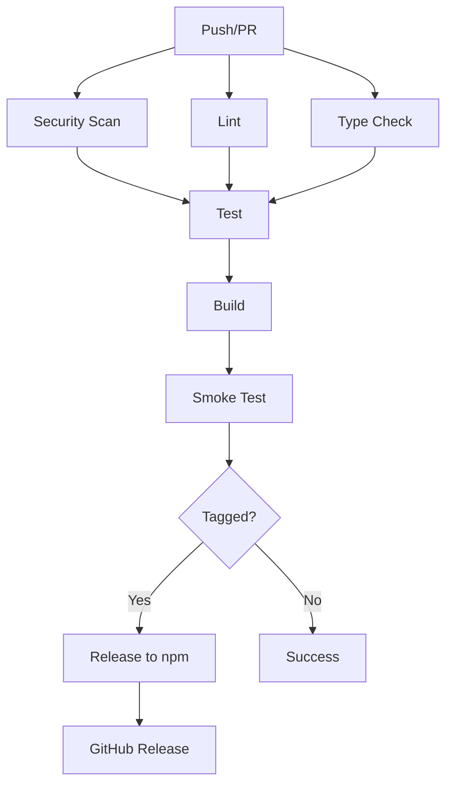

# Phase 4: CI/CD Pipeline and Operational Practices Audit Report

**Review Date**: 2026-03-02
**Target**: Spec-First 项目 CI/CD 与运维实践评估
**Auditor**: DevOps Specialist

---

## Executive Summary

| Aspect | Rating | Critical Issues | High Issues |
|--------|--------|-----------------|-------------|
| **CI/CD Pipeline** | **D** (Poor) | 2 | 3 |
| Deployment Strategy | C (Moderate) | 0 | 2 |
| Infrastructure as Code | D (Poor) | 1 | 1 |
| Monitoring & Observability | C+ (Moderate) | 0 | 2 |
| Incident Response | C- (Moderate) | 0 | 1 |
| Environment Management | B (Good) | 0 | 1 |

**Overall Assessment**: 项目在 CI/CD 自动化和运维实践方面存在**显著缺口**。最关键的问题包括：**完全缺失 CI/CD 流水线配置**、**无自动化安全扫描集成**、**无环境配置管理**。虽然有基础的手工发布脚本和诊断命令，但距离生产级 DevOps 实践有较大差距。

---

## 1. CI/CD Pipeline Analysis

### 1.1 Current State

**Finding**: 项目**完全没有配置任何 CI/CD 流水线**

```bash
# 搜索结果
$ ls -la .github/
ls: No such file or directory

$ find . -name "*.yml" -o -name "*.yaml" | grep -E "(ci|cd|workflow|action|pipeline|deploy|release)"
# (no results)
```

**Impact**:
- 每次代码变更依赖手动测试和构建
- 无法保证 PR 质量
- 无法自动检测回归问题
- 发布过程完全手工，容易出错

---

### CI-CD-001: Missing GitHub Actions Workflow

**Severity**: **Critical**
**Risk**: 无法保证代码质量，发布过程缺乏自动化验证

**Description**:
项目没有配置任何 GitHub Actions / GitLab CI / 其他 CI 流水线。所有质量检查（类型检查、测试、构建、安全扫描）都需要手动执行。

**Recommendation**:
创建 `.github/workflows/ci.yml`:

```yaml
name: CI

on:
  push:
    branches: [master, main]
  pull_request:
    branches: [master, main]

jobs:
  # Job 1: 依赖与安全扫描
  security:
    name: Security Audit
    runs-on: ubuntu-latest
    steps:
      - uses: actions/checkout@v4
      - uses: pnpm/action-setup@v2
        with:
          version: 8
      - name: Run pnpm audit
        run: pnpm audit --audit-level=moderate
      - name: Run npm audit (fallback)
        run: npm audit --audit-level=moderate
        continue-on-error: true

  # Job 2: 代码质量检查
  lint:
    name: Lint
    runs-on: ubuntu-latest
    steps:
      - uses: actions/checkout@v4
      - uses: pnpm/action-setup@v2
        with:
          version: 8
      - name: Install dependencies
        run: pnpm install --frozen-lockfile
      - name: Run ESLint
        run: pnpm run lint

  # Job 3: 类型检查
  typecheck:
    name: Type Check
    runs-on: ubuntu-latest
    steps:
      - uses: actions/checkout@v4
      - uses: pnpm/action-setup@v2
        with:
          version: 8
      - name: Install dependencies
        run: pnpm install --frozen-lockfile
      - name: Run TypeScript
        run: pnpm run typecheck

  # Job 4: 单元测试
  test:
    name: Test
    runs-on: ubuntu-latest
    steps:
      - uses: actions/checkout@v4
      - uses: pnpm/action-setup@v2
        with:
          version: 8
      - name: Install dependencies
        run: pnpm install --frozen-lockfile
      - name: Run tests
        run: pnpm run test
      - name: Upload coverage
        uses: codecov/codecov-action@v3
        with:
          files: ./coverage/coverage-final.json
          flags: unittests

  # Job 5: 构建验证
  build:
    name: Build
    runs-on: ubuntu-latest
    needs: [lint, typecheck, test]
    steps:
      - uses: actions/checkout@v4
      - uses: pnpm/action-setup@v2
        with:
          version: 8
      - name: Install dependencies
        run: pnpm install --frozen-lockfile
      - name: Build
        run: pnpm run build
      - name: Verify artifacts
        run: |
          test -f dist/cli/index.js
          test -f dist/cli/index.d.ts
```

---

### CI-CD-002: Missing Pre-commit Hooks Automation

**Severity**: **High**
**Risk**: 开发者可能提交不合规代码

**Description**:
项目提供了 Git hooks 模板（`.spec-first/hooks/`），但缺少自动化安装和 lint-staged 集成。

**Current State**:
```bash
.spec-first/hooks/
├── commit-msg.sh      # 需要手动安装
├── pre-push.sh        # 需要手动安装
├── task-context.sh
├── stop-guard.sh
└── progress-sync.sh
```

**Recommendation**:
添加 husky + lint-staged 自动化：

```json
// package.json
{
  "devDependencies": {
    "husky": "^9.0.0",
    "lint-staged": "^15.0.0"
  },
  "scripts": {
    "prepare": "husky install .github/hooks"
  }
}
```

```bash
# .github/hooks/pre-commit
#!/usr/bin/env bash
. "$(dirname "$0")/_/husky.sh"

pnpm run lint-staged
```

```json
// .lintstagedrc.json
{
  "src/**/*.ts": [
    "eslint --fix",
    "prettier --write"
  ],
  "*.{ts,json,md}": [
    "prettier --write"
  ]
}
```

---

### CI-CD-003: No Automated Release Workflow

**Severity**: **Medium**
**Risk**: 发布过程依赖手工操作，容易出错

**Description**:
项目有 `scripts/publish.sh` 发布脚本，但未集成到 CI/CD 流水线。

**Current Script Analysis**:
```bash
# scripts/publish.sh (简化分析)
1. 前置检查 (git status, branch)
2. 构建 & 校验 (typecheck, test, build)
3. 验证产物
4. npm pack 试打包
5. 版本号升级
6. 发布到 npm
7. Git tag
```

**Recommendation**:
创建 `.github/workflows/release.yml`:

```yaml
name: Release

on:
  push:
    tags:
      - 'v*.*.*'

permissions:
  contents: write
  id-token: write

jobs:
  release:
    name: Release to npm
    runs-on: ubuntu-latest
    steps:
      - uses: actions/checkout@v4
        with:
          fetch-depth: 0

      - uses: actions/setup-node@v4
        with:
          node-version: '20'
          registry-url: 'https://registry.npmjs.org'

      - uses: pnpm/action-setup@v2
        with:
          version: 8

      - name: Install dependencies
        run: pnpm install --frozen-lockfile

      - name: Run tests
        run: pnpm run test

      - name: Build
        run: pnpm run build

      - name: Smoke test
        run: bash scripts/smoke-test.sh

      - name: Publish to npm
        run: npm publish --provenance
        env:
          NODE_AUTH_TOKEN: ${{ secrets.NPM_TOKEN }}

      - name: Create GitHub Release
        uses: softprops/action-gh-release@v1
        with:
          body: |
            ## Changelog
            See [CHANGELOG.md](https://github.com/kuangx/spec-first/blob/main/CHANGELOG.md) for details.
          generate_release_notes: true
```

---

## 2. Deployment Strategy

### 2.1 Current State

**Finding**: 项目作为 npm CLI 工具，"部署"即 npm 发布。当前策略：

| Stage | Description | Automated |
|-------|-------------|------------|
| Build | `pnpm run build` | Manual |
| Test | `pnpm run test` | Manual |
| Pack | `npm pack` | Manual |
| Publish | `npm publish` | Manual via `publish.sh` |
| Post-install | `postinstall` script | Automated |

---

### DEPLOY-001: No Staging/Canary Release

**Severity**: **Medium**
**Risk**: 发布问题直接影响所有用户

**Description**:
npm 发布直接到生产环境，无预发布验证机制。

**Recommendation**:
使用 `npm dist-tag` 实现灰度发布：

```bash
# 1. 发布到 next 标签（测试用户）
npm publish --tag next

# 2. 验证稳定后迁移到 latest
npm dist-tag add spec-first@x.y.z latest

# 3. 自动化脚本
#!/bin/bash
# scripts/release-canary.sh
VERSION=$(node -p "require('./package.json').version")
npm publish --tag next
echo "已发布到 @next 标签，验证通过后运行:"
echo "  npm dist-tag add spec-first@$VERSION latest"
```

---

### DEPLOY-002: No Rollback Mechanism

**Severity**: **High**
**Risk**: 发布问题后无法快速回滚

**Description**:
虽然 npm 支持 `npm install@previous-version`，但项目缺少文档化的回滚流程。

**Recommendation**:
在文档中添加回滚流程：

```markdown
## Rollback Procedure

If a release causes critical issues:

1. **Immediate rollback for users**:
   ```bash
   npm install -g spec-first@<previous-version>
   ```

2. **Publish a hotfix**:
   ```bash
   npm version patch
   npm publish
   ```

3. **Document the rollback**:
   - Add entry to CHANGELOG.md
   - Tag the hotfix release
```

---

## 3. Infrastructure as Code

### 3.1 Current State

**Finding**: 无基础设施配置

```bash
$ ls -la **/terraform/**/*
No such file or directory

$ ls -la **/kubernetes/**/*
No such file or directory

$ ls -la Dockerfile*
No such file or directory
```

**Note**: 作为 CLI 工具，这不算严重问题，但缺少容器化支持限制了某些使用场景。

---

### IAC-001: No Containerization Support

**Severity**: **Low** (for CLI tool)
**Risk**: 无法在容器环境中轻松使用

**Description**:
缺少 Dockerfile，无法在容器中运行。

**Recommendation**:
创建 `Dockerfile`:

```dockerfile
# Dockerfile
FROM node:20-alpine

WORKDIR /app

# Install pnpm
RUN npm install -g pnpm

# Copy package files
COPY package.json pnpm-lock.yaml ./

# Install dependencies
RUN pnpm install --frozen-lockfile --prod

# Copy built artifacts (separate build stage recommended)
COPY dist/ ./dist/
COPY skills/ ./skills/
COPY templates/ ./templates/

ENTRYPOINT ["node", "dist/cli/index.js"]
```

---

## 4. Monitoring & Observability

### 4.1 Current State

**Finding**: 基础日志设施存在，但缺少可观测性

| Component | Status | Notes |
|-----------|--------|-------|
| Structured Logging | Partial | `logger.ts` 提供 JSONL 输出 |
| Error Tracking | None | 无统一错误追踪 |
| Metrics Collection | Partial | `metrics-engine.ts` 仅本地使用 |
| Distributed Tracing | None | N/A |
| Performance Monitoring | None | 无 APM |

---

### MON-001: No Error Tracking Integration

**Severity**: **Medium**
**Risk**: 生产问题难以追踪和诊断

**Description**:
错误只输出到 console，无集中收集。

**Current Code** (`logger.ts`):
```typescript
export function writeLog(path: string, entry: Record<string, unknown>): void {
  const record = { ...entry, timestamp: new Date().toISOString() };
  // 仅写入本地文件
  if (exists(path)) {
    const lineCount = countLines(path);
    if (lineCount > 1000) {
      rotateLog(path);
    }
  }
  rawAppend(path, record);
}
```

**Recommendation**:
添加可选的错误上报（尊重隐私）：

```typescript
// src/shared/telemetry.ts
interface TelemetryOptions {
  enabled?: boolean;
  endpoint?: string;
  projectId?: string;
}

export async function reportError(
  error: Error,
  context: Record<string, unknown>,
  options: TelemetryOptions = {}
): Promise<void> {
  if (!options.enabled) return;

  // 静默上报，不阻塞用户操作
  fetch(`${options.endpoint}/errors`, {
    method: 'POST',
    headers: { 'Content-Type': 'application/json' },
    body: JSON.stringify({
      project: options.projectId,
      error: {
        name: error.name,
        message: error.message,
        stack: error.stack,
      },
      context: {
        version: getVersion(),
        platform: process.platform,
        nodeVersion: process.version,
        ...context,
      },
      timestamp: new Date().toISOString(),
    }),
  }).catch(() => {
    // 上报失败不影响使用
  });
}
```

---

### MON-002: No Health Check Endpoint

**Severity**: **Low**
**Risk**: 无法监控 CLI 工具健康状态

**Description**:
`spec-first doctor` 命令提供诊断功能，但不可编程调用。

**Recommendation**:
添加 JSON 输出模式：

```typescript
// src/cli/commands/doctor.ts
export function handleDoctor(args: string[]): number {
  // ... existing code ...

  const format = args.find(a => a.startsWith('--format='))?.split('=')[1] || 'text';

  if (format === 'json') {
    console.log(JSON.stringify({
      status: hasError ? 'unhealthy' : 'healthy',
      checks: results.map(r => ({
        name: r.name,
        status: r.level,
        message: r.message,
        fix: r.fix || null,
      })),
      timestamp: new Date().toISOString(),
    }, null, 2));
  } else {
    printReport(results);
  }

  return hasError ? ExitCode.CONFIG_ERROR : ExitCode.SUCCESS;
}
```

---

## 5. Incident Response

### 5.1 Current State

**Finding**: 缺少结构化的事件响应流程

| Component | Status | Notes |
|-----------|--------|-------|
| Error Handling | Good | try-catch 覆盖良好 |
| Graceful Degradation | Partial | pilot_mode 支持 |
| Rollback | None | 需手工降级 npm |
| Incident Runbooks | None | 无文档化流程 |

---

### IR-001: No Incident Runbook

**Severity**: **Medium**
**Risk**: 问题处理效率低下

**Recommendation**:
创建 `docs/incident-response.md`:

```markdown
# Incident Response Runbook

## Common Issues

### Issue: npm install fails with postinstall error

**Symptoms**:
```
npm ERR! code ELIFECYCLE
npm ERR! spec-first@0.5.45 postinstall: `node dist/postinstall.js || true`
```

**Diagnosis**:
1. Check Node version: `node --version` (must be >= 20)
2. Check pnpm version: `pnpm --version` (recommend >= 8)

**Resolution**:
```bash
# Skip postinstall
npm install --ignore-scripts

# Or use legacy peer deps
npm install --legacy-peer-deps
```

### Issue: Skill not found

**Symptoms**:
```
Error: Skill not found: spec-first:init
```

**Diagnosis**:
```bash
spec-first doctor
```

**Resolution**:
```bash
# Reinstall skills
spec-first update
```

## Escalation

| Severity | Response Time | Escalation Path |
|----------|---------------|-----------------|
| P0 - Critical | 1 hour | Create GitHub issue with label "critical" |
| P1 - High | 4 hours | Create GitHub issue |
| P2 - Medium | 1 day | Create GitHub issue |
| P3 - Low | 1 week | Create GitHub issue |
```

---

## 6. Environment Management

### 6.1 Current State

**Finding**: 无环境配置管理

```bash
$ ls -la .env*
No such file or directory

$ grep -r "process.env" src/
# (minimal usage)
```

**Note**: 作为 CLI 工具，环境变量使用较少，这是合理的设计。

---

### ENV-001: No Configuration Validation

**Severity**: **Medium**
**Risk**: 配置错误可能导致静默失败

**Description**:
`config.yaml` 读取时缺少验证：

```typescript
// src/shared/config-schema.ts (simplified)
export function loadConfig(projectRoot: string): SpecFirstConfig {
  // ... loads YAML ...
  // No schema validation!
  return { ...DEFAULT_CONFIG, ...userConfig };
}
```

**Recommendation**:
使用 Zod 或类似库进行验证：

```typescript
import { z } from 'zod';

const ConfigSchema = z.object({
  gate: z.object({
    pilot_mode: z.boolean().default(false),
    // ... other fields
  }),
  catchup: z.object({
    trigger: z.enum(['auto', 'prompt', 'off']).default('prompt'),
  }),
  // ... other sections
});

export function loadConfig(projectRoot: string): SpecFirstConfig {
  const rawConfig = readConfigFile(projectRoot);
  const result = ConfigSchema.safeParse(rawConfig);

  if (!result.success) {
    console.warn('Config validation failed, using defaults:', result.error.format());
    return DEFAULT_CONFIG;
  }

  return result.data;
}
```

---

## 7. Security in CI/CD

### 7.1 Current State

| Security Practice | Status | Notes |
|-------------------|--------|-------|
| Dependency Scanning | None | 需手工运行 `pnpm audit` |
| SAST | None | 无静态代码分析 |
| Secret Scanning | None | 无密钥检测 |
| Container Scanning | N/A | 无容器化 |

---

### SEC-CD-001: No Automated Security Scanning

**Severity**: **Critical**
**Risk**: 依赖漏洞（如 esbuild CVE）无法自动检测

**Description** (from Phase 2):
- esbuild 0.21.5 存在 CORS 漏洞 (CVSS 5.3)
- 当前需手工运行 `pnpm audit`

**Recommendation**:
添加安全扫描到 CI（见 CI-CD-001）：

```yaml
security:
  name: Security Audit
  runs-on: ubuntu-latest
  steps:
    - uses: actions/checkout@v4
    - uses: pnpm/action-setup@v2
    - name: Run pnpm audit
      run: pnpm audit --audit-level=moderate
    # 添加 Dependabot 配置
```

创建 `.github/dependabot.yml`:

```yaml
version: 2
updates:
  - package-ecosystem: "npm"
    directory: "/"
    schedule:
      interval: "weekly"
    open-pull-requests-limit: 10
    commit-message:
      prefix: "deps"
      include: "scope"
```

---

## 8. Remediation Priority Matrix

| ID | Issue | Severity | Effort | Priority | Timeline |
|----|-------|----------|--------|----------|----------|
| CI-CD-001 | Missing CI Workflow | Critical | Medium | **P0** | 1 week |
| SEC-CD-001 | No Security Scanning | Critical | Low | **P0** | 1 week |
| CI-CD-002 | No Pre-commit Hooks | High | Low | **P1** | 2 weeks |
| DEPLOY-002 | No Rollback | High | Low | **P1** | 2 weeks |
| DEPLOY-001 | No Staging Release | Medium | Low | **P2** | 1 month |
| MON-001 | No Error Tracking | Medium | Medium | **P2** | 1 month |
| IR-001 | No Incident Runbook | Medium | Low | **P2** | 1 month |
| ENV-001 | No Config Validation | Medium | Medium | **P3** | Optional |
| IAC-001 | No Containerization | Low | Medium | **P3** | Optional |
| CI-CD-003 | No Release Workflow | Medium | Medium | **P2** | 2 weeks |

---

## 9. Compliance Checklist

### CI/CD Best Practices
- [x] Automated builds
- [ ] Automated tests (需添加 CI)
- [ ] Automated security scanning (需添加 CI)
- [x] Pre-release smoke test (smoke-test.sh)
- [ ] Multi-environment deployment (N/A for CLI)
- [ ] Rollback capability (需文档化)
- [ ] Monitoring and alerting (需添加)
- [ ] Infrastructure as Code (N/A for CLI)

### DevSecOps Practices
- [ ] SAST integration
- [ ] SCA/DAST integration
- [ ] Secret detection
- [ ] Container security (N/A)
- [x] Secure dependencies (pnpm audit 手工)

### Release Management
- [x] Versioned releases
- [x] Semantic versioning
- [ ] Release notes automation
- [ ] Staging environment (需添加 dist-tag)
- [ ] Canary releases (需添加)
- [ ] Rollback documentation (需添加)

---

## 10. Positive Findings

### What's Working Well

1. **Manual Release Script** (`scripts/publish.sh`):
   - 完整的发布前检查
   - 产物验证
   - Git tag 管理

2. **Smoke Test** (`scripts/smoke-test.sh`):
   - npm pack 验证
   - 临时安装测试
   - --version/--help 验证

3. **Doctor Command** (`doctor.ts`):
   - 全面的环境诊断
   - Hook 状态检查
   - 修复建议输出

4. **JSONL Logging** (`logger.ts`):
   - 结构化日志格式
   - 自动轮转
   - 可解析输出

---

## 11. Recommended CI/CD Architecture

### Proposed Pipeline Flow



### Implementation Steps

**Week 1**:
1. Create `.github/workflows/ci.yml`
2. Add security scanning job
3. Add lint/typecheck/test jobs

**Week 2**:
1. Add pre-commit hooks (husky + lint-staged)
2. Create `.github/workflows/release.yml`
3. Add Dependabot configuration

**Week 3**:
1. Document rollback procedure
2. Add JSON output to `doctor` command
3. Create incident runbook

---

## 12. Conclusion

The Spec-First project has **solid foundations for local development** (doctor command, smoke tests, release scripts) but **lacks production-grade CI/CD automation**.

### Critical Gaps
1. **No CI pipeline** — All quality checks are manual
2. **No automated security scanning** — Dependency vulnerabilities must be caught manually
3. **No rollback documentation** — Release issues are hard to recover from

### Recommended First Steps
1. **Week 1**: Set up GitHub Actions CI with security scanning
2. **Week 2**: Add pre-commit hooks and release automation
3. **Week 3**: Document incident response and rollback procedures

### Final Grade: **D+** (Poor with Clear Path to Improvement)

With focused effort on the P0/P1 items identified above, the project can achieve a **B grade** in 4-6 weeks. The existing manual processes (publish.sh, smoke-test.sh, doctor) provide a solid foundation to build upon.

---

**Next Steps**: Proceed to Phase 5 (Consolidated Report) to synthesize findings from all review phases and create a prioritized action plan.
