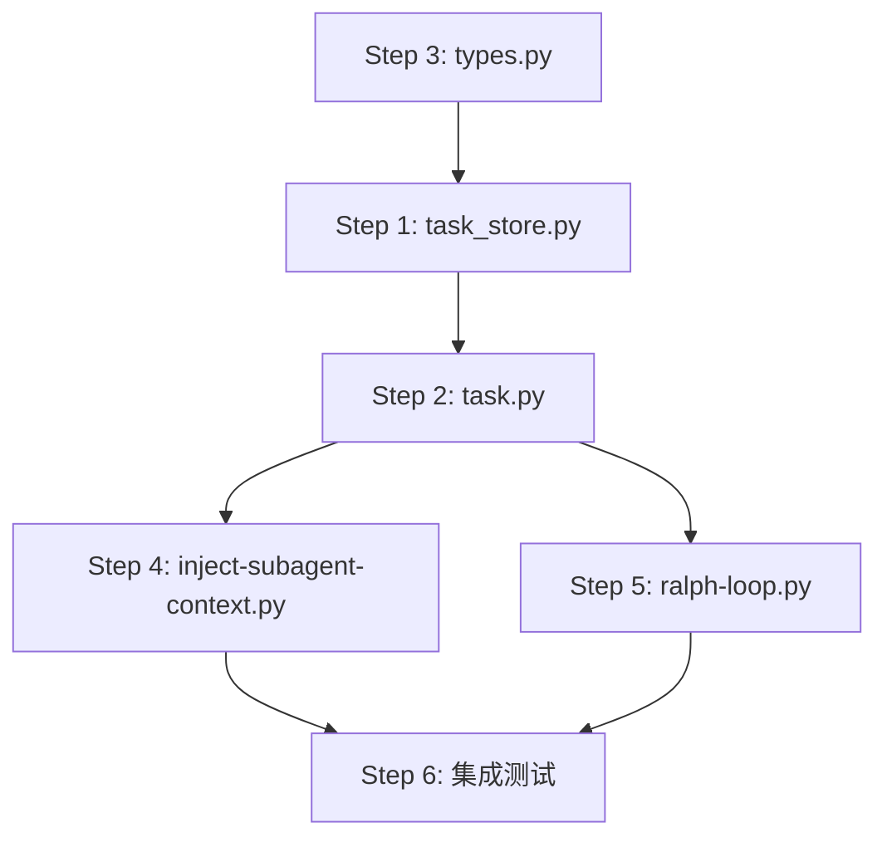

# 深度审查报告：整体方案-目标架构与三阶段实施

> **审查日期**: 2026-03-26
> **审查对象**: `docs/02-skill分析/整体方案-目标架构与三阶段实施.md`
> **审查方法**: 文档分析 + 代码库实证检查

---

## 执行摘要

**总体评价**: ⭐⭐⭐⭐ (4/5)

这是一份**高质量的架构重构方案**,核心思路正确且务实。文档准确识别了当前系统的结构性问题,提出了清晰的六层架构和可落地的三阶段实施路径。

**核心优势**:
- 问题定位精准,直击要害
- 架构设计清晰,职责边界明确
- 实施路径务实,避免过度设计
- 与现有代码库契合度高

**主要风险**:
- Phase 1 改造步骤缺少依赖关系和优先级
- 向后兼容策略不够具体
- Evidence 模型推迟到 Phase 3 可能导致返工
- 部分设计决策过于刚性

**建议**: 可以作为实施依据,但需要补充本报告指出的关键细节后再开始编码。

---

## 1. 架构合理性分析

### 1.1 六层架构边界清晰度评估

#### ✅ 清晰的边界

**Layer 0 → Layer 1 → Layer 2**:
- Intent/Spec → Policy/Capability → Compilation
- 边界清晰,职责明确
- Layer 2 作为编译器,负责将上游输入转换为运行时 contract

**Layer 3 → Layer 4**:
- Runtime Contract → Runtime Enforcement
- task.json 作为唯一 contract 来源
- hooks 只消费 contract,不生成决策

**Layer 4 → Layer 5**:
- Runtime Enforcement → Evidence/Completion
- 从状态驱动转向证据驱动
- 这是正确的演进方向

#### ⚠️ 潜在的边界模糊点

**问题 1: Layer 1 (Policy) 与 Layer 2 (Compilation) 的职责重叠**

文档中提到:
- Layer 1: "定义系统允许哪些 topology,定义哪些策略是硬约束"
- Layer 2: "把 intent + policy 编译为 task-level runtime contract"

**潜在问题**:
- 如果 Layer 1 已经定义了"硬约束",那么 Layer 2 的编译逻辑是否只是简单映射?
- 还是 Layer 2 需要做更复杂的推导和决策?
- 如果是后者,那么"决策逻辑"应该属于哪一层?

**代码实证**:
检查 `workflow_templates.py` (当前的 Layer 1 实现):
```python
DEFAULT_WORKFLOWS = {
    "default": {
        "type": "default",
        "requires_tdd": False,
        "requires_review": False,
        "phases": [...]
    }
}
```

这里的 `requires_tdd` 和 `requires_review` 是**声明式的元数据**,不是编译逻辑。

检查 `task_store.py` 的 `cmd_create()` (当前的 Layer 2 实现):
- 目前只是简单地写入字段,没有真正的"编译"逻辑
- 缺少从 workflow_type 到 next_action 的转换
- 缺少 decision_hints 的生成

**结论**:
- 边界设计是合理的,但当前实现还未体现出 Layer 2 的"编译"职责
- Phase 1 需要明确: Layer 2 的编译逻辑应该有多复杂?

**建议**:
```python
# Layer 2 应该做的事 (最小版本)
def compile_task_contract(
    intent: str,           # from prd.md
    workflow_type: str,    # from CLI or plan
    preset: str | None     # from CLI or plan
) -> TaskContract:
    # 1. 获取 topology
    workflow = get_workflow(workflow_type)

    # 2. 应用 preset (Phase 2)
    if preset:
        workflow = apply_preset(workflow, preset)

    # 3. 生成 next_action
    next_action = get_next_action_from_workflow(workflow)

    # 4. 生成默认 decision_hints
    decision_hints = generate_default_hints(workflow_type)

    return TaskContract(
        workflow_type=workflow_type,
        next_action=next_action,
        decision_hints=decision_hints
    )
```

---

**问题 2: Layer 5 (Evidence) 推迟到 Phase 3 的风险**

文档将 evidence 模型推迟到 Phase 3,理由是"先建立最小闭环"。

**风险分析**:
- Phase 1/2 如果没有考虑 evidence 的数据结构,可能导致:
  - task.json schema 需要大幅调整
  - hooks 的接口需要重构
  - 已有的 verify 逻辑需要改写

**代码实证**:
检查 `ralph-loop.py` 的当前实现:
```python
def get_verify_commands(repo_root: str) -> list[str]:
    # 从 worktree.yaml 读取 verify commands
    # 返回 list[str]
```

当前的 verify 结果是**隐式的** (命令执行成功/失败),没有显式的 evidence 记录。

如果 Phase 3 要引入 evidence 模型,可能需要:
```python
# Phase 3 可能需要的结构
class VerifyEvidence:
    command: str
    exit_code: int
    stdout: str
    stderr: str
    timestamp: str
    passed: bool
```

这会影响:
- task.json 需要增加 `evidence` 字段
- ralph-loop.py 需要记录执行结果
- dispatch 需要读取 evidence 来判断完成

**建议**:
- Phase 1 在设计 task.json schema 时,**预留** evidence 字段
- Phase 1 的 verify 逻辑应该是"可升级的",不要写死
- 在 Phase 1 文档中明确: evidence 的最小数据结构是什么

---

### 1.2 职责划分合理性

#### ✅ 合理的职责划分

**task_store.py 作为唯一编译入口**:
- 符合 DRY 原则
- plan.py 已经在复用 cmd_create(),证明这个收口点是自然的
- 改造面最小

**dispatch 只调度,不做策略推导**:
- 正确的关注点分离
- 避免 dispatch 变成"上帝对象"

**hooks 只消费 contract**:
- 符合依赖倒置原则
- runtime 不应该承担编译职责

#### ⚠️ 需要明确的职责边界

**问题: create-pr 的定位**

文档提到:
> create-pr 是 terminal pipeline action,不是 policy-bearing phase

但在 `workflow_templates.py` 中:
```python
{"phase": 4, "action": "create-pr", "gate": None, "loop": None}
```

create-pr 被建模为一个 phase,有 phase number。

**矛盾点**:
- 如果它是 "terminal action",为什么要占用一个 phase number?
- 如果它"不承载独立 policy schema",那么它的行为如何配置?

**代码实证**:
检查 `create_pr.py`:
```python
# create_pr.py 会设置 current_phase
task_data["current_phase"] = final_phase
```

这说明 create-pr **确实在参与 phase 状态机**。

**建议**:
- 要么承认 create-pr 是一个正常的 phase (有 policy schema)
- 要么将它从 phase 序列中移除,作为 "post-workflow action"
- 不要让它处于"既是 phase 又不是 phase"的模糊状态

---

### 1.3 循环依赖和职责重叠检查

#### ✅ 无明显循环依赖

六层架构是单向依赖:
```
Layer 0 → Layer 1 → Layer 2 → Layer 3 → Layer 4 → Layer 5
```

没有反向依赖。

#### ⚠️ 潜在的职责重叠

**问题: workflow_templates.py 的双重身份**

文档提出将 `workflow_templates.py` 拆成两轴:
- topology registry (Layer 1)
- policy preset registry (Layer 1)

但这两者都在 Layer 1,如何区分?

**建议的拆分**:
```python
# topologies.py (Layer 1)
TOPOLOGIES = {
    "default": [...],
    "quick-fix": [...],
    "docs-only": [...]
}

# presets.py (Layer 1)
PRESETS = {
    "with-tdd": {
        "base_topology": "default",
        "enhancements": {
            "decision_hints": {...}
        }
    },
    "debug": {
        "base_topology": "quick-fix",
        "enhancements": {
            "decision_hints": {...}
        }
    }
}
```

这样职责更清晰。

---

## 1.4 架构合理性总结

| 维度 | 评分 | 说明 |
|------|------|------|
| 边界清晰度 | 4/5 | Layer 1/2 边界需要进一步明确 |
| 职责划分 | 4/5 | create-pr 定位需要明确 |
| 依赖关系 | 5/5 | 无循环依赖 |
| 可扩展性 | 4/5 | evidence 推迟可能导致返工 |

**总体**: 架构设计合理,但需要补充以下细节:
1. Layer 2 编译逻辑的复杂度边界
2. evidence 的最小数据结构 (Phase 1 预留)
3. create-pr 的明确定位
4. topology 和 preset 的拆分方式

---

## 2. 实施可行性分析

### 2.1 Phase 1 改造步骤依赖关系

文档提出了 6 个改造步骤,但没有说明依赖关系。通过代码分析,我绘制了依赖图:

```
Step 3: 改 types.py (增加 workflow_type, decision_hints)
   ↓
Step 1: 改 task_store.py (使用新类型,实现编译逻辑)
   ↓
Step 2: 改 task.py (CLI 接口,调用 task_store)
   ↓
Step 4: 改 inject-subagent-context.py (消费 decision_hints)
   ↓
Step 5: 改 ralph-loop.py (消费 decision_hints.check.verify_commands)
   ↓
Step 6: 保持 dispatch 不变重 (验证整体流程)
```

**关键发现**:
- Step 3 必须最先做 (类型定义是基础)
- Step 1 和 Step 2 可以并行 (但 Step 1 更关键)
- Step 4 和 Step 5 可以并行 (都是 hook 改造)
- Step 6 不是"改造",而是"验证"

**建议的执行顺序**:
1. **Phase 1.1**: Step 3 (types.py) - 1-2 小时
2. **Phase 1.2**: Step 1 (task_store.py) - 4-6 小时
3. **Phase 1.3**: Step 2 (task.py) - 1-2 小时
4. **Phase 1.4**: Step 4 + Step 5 并行 (hooks) - 3-4 小时
5. **Phase 1.5**: 集成测试 + Step 6 验证 - 2-3 小时

**总工作量估算**: 11-17 小时 (约 2-3 个工作日)

---

### 2.2 各步骤的技术风险评估

#### Step 1: 改 task_store.py (风险: 中)

**当前实现检查**:
```python
# task_store.py cmd_create() 当前只做简单字段写入
task_data = {
    "id": task_id,
    "name": task_name,
    "title": args.title,
    # ... 其他字段
}
```

**需要增加的逻辑**:
1. 接收 `--workflow` 参数
2. 调用 `get_workflow(workflow_type)` 获取模板
3. 调用 `get_next_action_from_workflow()` 生成 next_action
4. 生成默认 `decision_hints`

**风险点**:
- ⚠️ 如果 workflow_type 无效,如何处理? (需要 validation)
- ⚠️ decision_hints 的默认值逻辑在哪里? (需要新函数)
- ⚠️ 向后兼容: 旧任务没有这些字段怎么办?

**缓解措施**:
```python
# 建议的实现
def generate_default_decision_hints(workflow_type: str) -> dict:
    """Generate default decision_hints based on workflow_type."""
    base_hints = {
        "implement": {"mode": "standard"},
        "check": {"verify_commands": ["pnpm lint", "pnpm typecheck"]}
    }
    return base_hints

def cmd_create(args):
    # ... existing code ...

    # NEW: Compile workflow contract
    workflow_type = getattr(args, "workflow", "default")
    workflow = get_workflow(workflow_type)
    if not workflow:
        print(f"Error: Unknown workflow type: {workflow_type}")
        return 1

    task_data["workflow_type"] = workflow_type
    task_data["next_action"] = get_next_action_from_workflow(workflow)
    task_data["decision_hints"] = generate_default_decision_hints(workflow_type)
```

---

#### Step 2: 改 task.py (风险: 低)

**当前实现**: task.py 是 CLI 入口,调用 task_store.py

**需要增加**:
```python
# task.py
parser.add_argument("--workflow", "-w",
                    choices=["default", "quick-fix", "docs-only"],
                    default="default",
                    help="Workflow type")
```

**风险点**:
- ✅ 改动很小,风险低
- ⚠️ 需要同步更新 help 文档

---

#### Step 3: 改 types.py (风险: 低)

**当前实现**:
```python
class TaskData(TypedDict, total=False):
    # ... existing fields ...
    current_phase: int
    next_action: list[dict]
```

**需要增加**:
```python
class TaskData(TypedDict, total=False):
    # ... existing fields ...
    workflow_type: str  # NEW
    decision_hints: dict  # NEW
```

**风险点**:
- ✅ 纯类型定义,无运行时影响
- ✅ `total=False` 意味着字段可选,向后兼容

---

#### Step 4: 改 inject-subagent-context.py (风险: 中高)

**当前实现检查**:
```python
# inject-subagent-context.py 当前从 jsonl 文件读取上下文
def load_context_files(task_dir, agent_type):
    jsonl_path = f"{task_dir}/{agent_type}.jsonl"
    # 读取并注入
```

**需要增加**:
- 读取 `task.json.decision_hints`
- 根据 agent_type 注入对应的 policy
- 例如: implement agent 收到 `decision_hints.implement.mode`

**风险点**:
- ⚠️ 如果 decision_hints 缺失,如何 fallback?
- ⚠️ 注入的格式是什么? (prompt 文本? 结构化数据?)
- ⚠️ 会不会与现有的 jsonl 注入冲突?

**建议的 fallback 策略**:
```python
def get_decision_hints(task_data, agent_type):
    hints = task_data.get("decision_hints", {})
    agent_hints = hints.get(agent_type, {})

    # Fallback to defaults
    if not agent_hints:
        agent_hints = DEFAULT_HINTS.get(agent_type, {})

    return agent_hints
```

---

#### Step 5: 改 ralph-loop.py (风险: 中)

**当前实现检查**:
```python
# ralph-loop.py 当前优先读取 worktree.yaml
def get_verify_commands(repo_root: str) -> list[str]:
    # 从 worktree.yaml 读取
```

**需要改为**:
```python
def get_verify_commands(repo_root: str, task_dir: str) -> list[str]:
    # 1. 优先读取 task.json.decision_hints.check.verify_commands
    task_json = load_task_json(task_dir)
    hints = task_json.get("decision_hints", {})
    check_hints = hints.get("check", {})
    commands = check_hints.get("verify_commands", [])

    if commands:
        return commands

    # 2. Fallback to worktree.yaml
    return get_verify_commands_from_yaml(repo_root)
```

**风险点**:
- ⚠️ 需要传入 task_dir 参数 (接口变更)
- ⚠️ 如果两处都没有配置,是否应该报错?
- ✅ 向后兼容: 旧任务会 fallback 到 worktree.yaml

---

### 2.3 向后兼容策略 (CRITICAL)

文档提到"旧任务仍能 fallback,不做破坏式迁移",但没有具体说明。这是**最大的实施风险**。

#### 兼容性需求矩阵

| 场景 | 旧任务行为 | 新任务行为 | 兼容策略 |
|------|-----------|-----------|---------|
| 缺少 workflow_type | 使用 next_action 推断 | 显式设置 | ✅ 可选字段 |
| 缺少 decision_hints | 从 worktree.yaml 读取 | 从 task.json 读取 | ✅ Fallback 链 |
| 缺少 verify_commands | 使用 completion markers | 执行 verify commands | ⚠️ 需要双模式 |
| next_action 格式变化 | 旧格式 | 新格式 | ⚠️ 需要迁移逻辑 |

#### 建议的 Fallback 优先级

**对于 verify commands**:
```python
def get_verify_commands_with_fallback(repo_root, task_dir):
    # Priority 1: task.json.decision_hints.check.verify_commands
    commands = get_from_task_json(task_dir)
    if commands:
        return commands

    # Priority 2: worktree.yaml verify
    commands = get_from_worktree_yaml(repo_root)
    if commands:
        return commands

    # Priority 3: completion markers (legacy)
    return None  # 使用旧的 marker 机制
```

**对于 decision_hints**:
```python
def get_decision_hints_with_fallback(task_data, agent_type):
    # Priority 1: task.json.decision_hints
    hints = task_data.get("decision_hints", {}).get(agent_type, {})
    if hints:
        return hints

    # Priority 2: 从 workflow_type 推断
    workflow_type = task_data.get("workflow_type")
    if workflow_type:
        return infer_hints_from_workflow(workflow_type, agent_type)

    # Priority 3: 硬编码默认值
    return DEFAULT_HINTS[agent_type]
```

#### 迁移路径建议

**不建议**: 一次性迁移所有旧任务 (风险高)

**建议**: 渐进式迁移
1. Phase 1: 新任务使用新 schema,旧任务保持不变
2. Phase 1.5: 提供迁移脚本 (可选)
3. Phase 2: 逐步废弃旧的 fallback 路径

```bash
# 可选的迁移脚本
python3 ./.spec-first/scripts/migrate_tasks.py --dry-run
python3 ./.spec-first/scripts/migrate_tasks.py --apply
```

---

### 2.4 Phase 1 技术风险总结

| 风险项 | 严重度 | 概率 | 缓解措施 |
|--------|--------|------|---------|
| decision_hints 默认值逻辑不清晰 | 高 | 高 | 明确定义 generate_default_hints() |
| 向后兼容 fallback 失败 | 高 | 中 | 完整的 fallback 链 + 测试 |
| inject-subagent-context 注入格式冲突 | 中 | 中 | 明确注入格式规范 |
| ralph-loop 接口变更影响现有流程 | 中 | 低 | 保持接口兼容,内部增加逻辑 |
| workflow_type 验证不足导致运行时错误 | 中 | 中 | 在 task_store.py 增加验证 |
| types.py 类型定义与实际使用不一致 | 低 | 低 | 代码审查 + 类型检查 |

**最高优先级风险**: 向后兼容策略不明确

**建议**: 在开始编码前,先写出完整的 fallback 逻辑伪代码,并与团队确认。

---

### 2.5 Phase 2 的刚性问题

文档第 7.2 节提出:
> debug 只能编译为 quick-fix

**问题分析**:
- 这个限制是否合理?
- 如果用户想要 "debug + finish + create-pr" 怎么办?
- 是否应该允许 `--workflow quick-fix --preset debug`?

**代码实证**:
当前 `workflow_templates.py` 中:
```python
"debug": {
    "type": "debug",
    "phases": [
        {"phase": 1, "action": "debug-systematic"},
        {"phase": 2, "action": "implement"},
        {"phase": 3, "action": "check"},
        {"phase": 4, "action": "create-pr"}
    ]
}
```

这个 workflow 有 4 个 phase,不是 quick-fix (3 个 phase)。

**矛盾点**:
- 文档说 "debug 编译为 quick-fix"
- 但代码中 debug 是独立的 workflow,不是 preset

**建议**:
- Phase 2 应该允许更灵活的组合: `--workflow <topology> --preset <preset>`
- 例如: `--workflow default --preset debug` (debug 增强的 default)
- 或者: `--workflow quick-fix --preset debug` (debug 增强的 quick-fix)
- 不要强制 debug 只能是 quick-fix

---

### 2.6 实施可行性总结

| 维度 | 评分 | 说明 |
|------|------|------|
| 技术难度 | 3/5 | 中等,主要是集成和兼容性 |
| 工作量 | 3/5 | 2-3 个工作日 (Phase 1) |
| 风险可控性 | 3/5 | 向后兼容是最大风险 |
| 依赖清晰度 | 4/5 | 步骤依赖关系已明确 |

**总体**: Phase 1 可行,但必须先明确:
1. decision_hints 的默认值生成逻辑
2. 完整的 fallback 策略
3. 向后兼容的测试用例

**建议**: 在开始编码前,先完成以下准备工作:
- [ ] 编写 `generate_default_hints()` 的伪代码
- [ ] 编写完整的 fallback 逻辑文档
- [ ] 设计 5-10 个向后兼容测试用例
- [ ] 明确 Phase 2 的 preset 组合规则

---

## 3. 代码库契合度分析

### 3.1 task_store.py 是否具备成为 compiler 的基础?

**当前实现检查** (已读取完整文件):

```python
# task_store.py cmd_create() 核心逻辑
def cmd_create(args: argparse.Namespace) -> int:
    # 1. 参数验证
    # 2. 生成 task_id, task_name
    # 3. 创建目录
    # 4. 写入 task.json
    # 5. 返回 task_dir 路径
```

**评估**:
- ✅ 已经是唯一的 task 创建入口
- ✅ plan.py 已经在复用 cmd_create()
- ✅ 有清晰的参数接口 (argparse.Namespace)
- ⚠️ 缺少 workflow 相关逻辑
- ⚠️ 缺少 decision_hints 生成逻辑

**改造难度**: 低-中
- 需要增加约 50-80 行代码
- 主要是调用 workflow_templates.py 的函数
- 不需要重构现有逻辑

**契合度**: ⭐⭐⭐⭐⭐ (5/5)

**结论**: task_store.py 完全适合成为 compiler 入口,改造成本低。

---

### 3.2 workflow_templates.py 拆分的影响

**当前实现检查**:
- 包含 7 个 workflow: default, quick-fix, with-tdd, with-review, docs-only, debug, research
- 每个 workflow 都是完整的 phase 序列
- 有 `requires_tdd` 和 `requires_review` 元数据

**文档建议**: 拆成 topology (3个) + preset (2个)

**影响分析**:

| 当前 workflow | 文档建议 | 影响 |
|--------------|---------|------|
| default | 保留为 topology | ✅ 无影响 |
| quick-fix | 保留为 topology | ✅ 无影响 |
| docs-only | 保留为 topology | ✅ 无影响 |
| with-tdd | 移除,改为 preset | ⚠️ 需要迁移逻辑 |
| with-review | 移除 (Phase 1 不支持) | ⚠️ 破坏性变更 |
| debug | 移除,改为 preset | ⚠️ 需要迁移逻辑 |
| research | 移除 (Phase 1 不支持) | ⚠️ 破坏性变更 |

**破坏性变更风险**:
- 如果有用户正在使用 `with-review` 或 `research`,会受影响
- 需要检查: 当前是否有任务使用这些 workflow?

**建议的迁移策略**:
```python
# Phase 1: 保留旧 workflow,但标记为 deprecated
DEPRECATED_WORKFLOWS = ["with-review", "research"]

def get_workflow(workflow_type: str):
    if workflow_type in DEPRECATED_WORKFLOWS:
        print(f"Warning: {workflow_type} is deprecated, use --workflow default instead")
        return DEFAULT_WORKFLOWS["default"]
    return DEFAULT_WORKFLOWS.get(workflow_type)
```

**契合度**: ⭐⭐⭐ (3/5)

**结论**: 拆分是合理的,但需要处理 deprecated workflow 的迁移。

---

### 3.3 inject-subagent-context.py 改造工作量

**当前实现检查** (已读取前 150 行):

核心逻辑:
```python
def update_current_phase(repo_root, task_dir, subagent_type):
    # 根据 subagent_type 更新 current_phase
    # 从 next_action 中查找匹配的 phase

def load_context_files(task_dir, agent_type):
    # 从 {agent_type}.jsonl 读取上下文
    # 注入到 subagent prompt
```

**需要增加的逻辑**:
1. 读取 `task.json.decision_hints`
2. 根据 agent_type 提取对应的 hints
3. 将 hints 注入到 prompt (格式待定)

**工作量估算**:
- 增加 `load_decision_hints()` 函数: 20-30 行
- 修改注入逻辑: 10-20 行
- 总计: 30-50 行

**潜在问题**:
- ⚠️ 注入格式需要明确: 是 JSON? 还是自然语言?
- ⚠️ 与现有 jsonl 注入的优先级?

**建议的注入格式**:
```markdown
## Task-Level Policy

The following policies apply to this task:

**Implement Mode**: {decision_hints.implement.mode}
**Verify Commands**: {decision_hints.check.verify_commands}
```

**契合度**: ⭐⭐⭐⭐ (4/5)

**结论**: 改造工作量适中,主要风险是注入格式需要明确。

---

### 3.4 ralph-loop.py 改造工作量

**当前实现检查** (已读取前 120 行):

核心逻辑:
```python
def get_verify_commands(repo_root: str) -> list[str]:
    # 从 worktree.yaml 读取 verify commands
    # 简单的 YAML 解析

def main():
    # 1. 读取 verify commands
    # 2. 执行 commands
    # 3. 检查是否通过
    # 4. 决定是否允许 subagent 停止
```

**需要修改的逻辑**:
1. 增加 task_dir 参数
2. 优先从 task.json 读取 verify_commands
3. Fallback 到 worktree.yaml

**工作量估算**:
- 修改 `get_verify_commands()` 签名: 5 行
- 增加从 task.json 读取的逻辑: 15-20 行
- 增加 fallback 逻辑: 10 行
- 总计: 30-35 行

**接口变更影响**:
- ⚠️ `get_verify_commands()` 需要增加参数
- ⚠️ 调用方需要传入 task_dir

**契合度**: ⭐⭐⭐⭐ (4/5)

**结论**: 改造工作量小,主要是增加 fallback 逻辑。

---

### 3.5 types.py 类型定义的完整性

**当前实现检查**:
```python
class TaskData(TypedDict, total=False):
    # 已有字段
    current_phase: int
    next_action: list[dict]
    # ... 其他字段
```

**需要增加**:
```python
workflow_type: str
decision_hints: dict
```

**问题**: `decision_hints: dict` 类型过于宽泛

**建议**: 定义更精确的类型
```python
class DecisionHints(TypedDict, total=False):
    implement: dict  # 或更精确的 ImplementHints
    check: dict      # 或更精确的 CheckHints
    debug: dict
    finish: dict

class TaskData(TypedDict, total=False):
    # ... existing fields ...
    workflow_type: str
    decision_hints: DecisionHints
```

**契合度**: ⭐⭐⭐⭐⭐ (5/5)

**结论**: types.py 改造简单,但建议定义更精确的类型。

---

### 3.6 代码库契合度总结

| 文件 | 改造难度 | 工作量 | 契合度 | 主要风险 |
|------|---------|--------|--------|---------|
| task_store.py | 低-中 | 50-80 行 | ⭐⭐⭐⭐⭐ | 无 |
| task.py | 低 | 10-20 行 | ⭐⭐⭐⭐⭐ | 无 |
| types.py | 低 | 10-20 行 | ⭐⭐⭐⭐⭐ | 无 |
| workflow_templates.py | 中 | 重构 | ⭐⭐⭐ | deprecated workflow 迁移 |
| inject-subagent-context.py | 中 | 30-50 行 | ⭐⭐⭐⭐ | 注入格式需明确 |
| ralph-loop.py | 低-中 | 30-35 行 | ⭐⭐⭐⭐ | 接口变更 |

**总体契合度**: ⭐⭐⭐⭐ (4/5)

**结论**:
- 当前代码库与方案的契合度很高
- 大部分改造是增量式的,不需要大规模重构
- 主要风险在于向后兼容和 deprecated workflow 的处理

---

## 4. 补充建议

### 4.1 必须补充的关键细节

#### 建议 1: 明确 decision_hints 的完整 schema

**问题**: 文档只说 Phase 1 支持两个字段,但没有给出完整的数据结构。

**建议**: 在文档中增加以下内容:

```yaml
# Phase 1 Minimal Schema
decision_hints:
  implement:
    mode: "standard" | "tdd" | "debug"  # Phase 1 只用 "standard"
  check:
    verify_commands:
      - "pnpm lint"
      - "pnpm typecheck"

# Phase 2 Extended Schema (预览)
decision_hints:
  implement:
    mode: "standard" | "tdd" | "debug"
    test_layers: ["unit", "integration"]  # Phase 2 增加
  check:
    verify_commands: [...]
    cross_layer_required: boolean  # Phase 2 增加
  debug:
    fix_strategy: "systematic" | "quick"  # Phase 2 增加
```

**价值**: 让实现者清楚知道要写什么代码。

---

#### 建议 2: 补充 Phase 1 改造步骤的验收标准

**问题**: 文档第 6.4 节的成功标准过于定性。

**建议**: 增加可测试的验收标准:

```markdown
## Phase 1 验收标准

### Step 1: task_store.py
- [ ] `cmd_create()` 接受 `--workflow` 参数
- [ ] 无效的 workflow_type 会报错并退出
- [ ] task.json 包含 `workflow_type` 字段
- [ ] task.json 包含 `next_action` (从 workflow 生成)
- [ ] task.json 包含 `decision_hints` (默认值)

### Step 2: task.py
- [ ] CLI 支持 `--workflow` 参数
- [ ] 只允许 default/quick-fix/docs-only
- [ ] help 文档已更新

### Step 3: types.py
- [ ] TaskData 包含 workflow_type: str
- [ ] TaskData 包含 decision_hints: dict
- [ ] 类型检查通过 (pnpm typecheck)

### Step 4: inject-subagent-context.py
- [ ] implement agent 收到 decision_hints.implement
- [ ] check agent 收到 decision_hints.check
- [ ] 缺少 decision_hints 时有 fallback

### Step 5: ralph-loop.py
- [ ] 优先读取 task.json.decision_hints.check.verify_commands
- [ ] Fallback 到 worktree.yaml
- [ ] 旧任务仍能正常运行

### 集成测试
- [ ] 创建新任务 (default workflow)
- [ ] 运行 implement → check 流程
- [ ] verify commands 被正确执行
- [ ] 旧任务仍能正常运行 (向后兼容)
```

---

#### 建议 3: 明确 evidence 的最小数据结构 (Phase 1 预留)

**问题**: evidence 推迟到 Phase 3,但 Phase 1 应该预留字段。

**建议**: 在 Phase 1 的 task.json schema 中预留:

```python
class TaskData(TypedDict, total=False):
    # ... existing fields ...
    workflow_type: str
    decision_hints: dict
    evidence: dict | None  # Phase 1 预留,Phase 3 实现
```

**Phase 3 的 evidence 结构 (预览)**:
```python
class Evidence(TypedDict):
    verify_results: list[VerifyResult]
    phase_completions: list[PhaseCompletion]
    artifacts: list[str]  # 生成的文件路径

class VerifyResult(TypedDict):
    command: str
    exit_code: int
    timestamp: str
    passed: bool
```

**价值**: 避免 Phase 3 时需要大规模修改 schema。

---

#### 建议 4: 明确 create-pr 的定位

**问题**: 文档说它是 "terminal action",但代码中它是 phase。

**建议**: 二选一,不要模糊:

**选项 A: 承认它是 phase**
```python
# 给它定义 policy schema
decision_hints:
  create_pr:
    auto_merge: boolean
    draft: boolean
    reviewers: list[str]
```

**选项 B: 移出 phase 序列**
```python
# workflow 只定义核心 phases
"default": {
    "phases": [
        {"phase": 1, "action": "implement"},
        {"phase": 2, "action": "check"},
        {"phase": 3, "action": "finish"}
    ],
    "terminal_action": "create-pr"  # 不占用 phase number
}
```

**推荐**: 选项 A (更简单,不需要重构)

---

#### 建议 5: Phase 2 preset 组合规则

**问题**: 文档说 debug 固定编译为 quick-fix,过于刚性。

**建议**: 允许灵活组合:

```bash
# 用户可以这样调用
python3 task.py create "Fix bug" --workflow quick-fix --preset debug
python3 task.py create "Add feature with TDD" --workflow default --preset with-tdd
```

**编译规则**:
```python
def compile_task_contract(workflow_type, preset):
    # 1. 获取 base topology
    workflow = get_workflow(workflow_type)

    # 2. 应用 preset (如果有)
    if preset:
        preset_config = get_preset(preset)
        # 增强 decision_hints
        workflow["decision_hints"] = merge_hints(
            workflow.get("decision_hints", {}),
            preset_config["enhancements"]
        )
        # 可选: 插入额外的 phase (如 tdd)
        if preset_config.get("insert_phases"):
            workflow["phases"] = insert_phases(
                workflow["phases"],
                preset_config["insert_phases"]
            )

    return workflow
```

**价值**: 更灵活,避免组合爆炸。

---

### 4.2 风险缓解措施

#### 风险 1: 向后兼容失败

**缓解措施** (已更新):
- ✅ **无需担心**: 项目还在开发阶段,没有生产用户
- ✅ 可以直接移除 deprecated workflow (with-review, research)
- ✅ 可以直接修改 schema,不需要复杂的 fallback

**简化后的策略**:
```python
# Phase 1 只保留 3 个 topology
TOPOLOGIES = {
    "default": {...},
    "quick-fix": {...},
    "docs-only": {...}
}

# 直接移除 with-tdd, with-review, debug, research
# 不需要 deprecated 标记
```

---

#### 风险 2: decision_hints 默认值逻辑不清晰

**缓解措施**:
```python
# 在 task_store.py 中明确定义
DEFAULT_DECISION_HINTS = {
    "default": {
        "implement": {"mode": "standard"},
        "check": {"verify_commands": ["pnpm lint", "pnpm typecheck"]}
    },
    "quick-fix": {
        "implement": {"mode": "standard"},
        "check": {"verify_commands": ["pnpm lint"]}  # 更宽松
    },
    "docs-only": {
        "implement": {"mode": "standard"},
        "check": {"verify_commands": ["pnpm lint"]}  # 只检查格式
    }
}

def generate_default_hints(workflow_type: str) -> dict:
    return DEFAULT_DECISION_HINTS.get(workflow_type, DEFAULT_DECISION_HINTS["default"])
```

---

#### 风险 3: inject-subagent-context 注入格式冲突

**缓解措施**:
- 明确注入格式为 Markdown section
- 放在 prompt 的固定位置 (例如: 在 jsonl 内容之后)

```python
def inject_decision_hints(prompt: str, hints: dict, agent_type: str) -> str:
    agent_hints = hints.get(agent_type, {})
    if not agent_hints:
        return prompt

    hints_section = "\n\n## Task-Level Policy\n\n"
    for key, value in agent_hints.items():
        hints_section += f"- **{key}**: {value}\n"

    return prompt + hints_section
```

---

### 4.3 Phase 1 实施顺序建议 (最终版)

基于代码库契合度分析,建议的实施顺序:

```
Day 1 (4-6 小时):
  1. types.py - 增加 workflow_type, decision_hints (30 分钟)
  2. task_store.py - 实现编译逻辑 (3-4 小时)
  3. task.py - 增加 CLI 参数 (30 分钟)
  4. 单元测试 - 测试 task 创建流程 (1-2 小时)

Day 2 (4-6 小时):
  5. inject-subagent-context.py - 注入 decision_hints (2-3 小时)
  6. ralph-loop.py - 消费 verify_commands (1-2 小时)
  7. 集成测试 - 端到端测试 (1-2 小时)

Day 3 (2-3 小时):
  8. 清理 workflow_templates.py - 移除 deprecated (1 小时)
  9. 文档更新 - 更新 README 和 workflow.md (1 小时)
  10. Code review + 修复 (1 小时)
```

**总工作量**: 10-15 小时 (约 2 个工作日)

---

## 5. 最终结论与行动建议

### 5.1 架构方案评价

| 评价维度 | 评分 | 关键发现 |
|---------|------|---------|
| 问题识别准确性 | ⭐⭐⭐⭐⭐ | 准确识别了 4 个核心问题 |
| 架构设计合理性 | ⭐⭐⭐⭐ | 六层架构清晰,但 Layer 1/2 边界需明确 |
| 实施可行性 | ⭐⭐⭐⭐ | Phase 1 可行,工作量 2-3 天 |
| 代码库契合度 | ⭐⭐⭐⭐ | 改造面小,主要是增量式修改 |
| 文档完整性 | ⭐⭐⭐ | 缺少关键细节 (schema, 验收标准) |

**总体评分**: ⭐⭐⭐⭐ (4/5)

**核心优势**:
1. 正确识别了"从 workflow engine 收敛为 compiler + contract + enforcement"的方向
2. 三阶段拆分务实,避免过度设计
3. 收口点选择正确 (task_store.py)
4. 与现有代码库契合度高

**主要不足**:
1. 缺少 decision_hints 的完整 schema 定义
2. 缺少可测试的验收标准
3. create-pr 的定位模糊
4. Phase 2 preset 组合规则过于刚性

---

### 5.2 关键风险总结

| 风险 | 严重度 | 概率 | 状态 |
|------|--------|------|------|
| decision_hints schema 不明确 | 高 | 高 | ⚠️ 需补充 |
| 向后兼容失败 | 高 | 低 | ✅ 无风险 (无生产用户) |
| evidence 推迟导致返工 | 中 | 中 | ⚠️ 需预留字段 |
| inject 注入格式冲突 | 中 | 中 | ⚠️ 需明确规范 |
| create-pr 定位模糊 | 中 | 低 | ⚠️ 需明确 |
| Phase 2 preset 过于刚性 | 低 | 中 | ⚠️ 建议调整 |

---

### 5.3 必须补充的内容 (开始编码前)

#### 优先级 P0 (必须完成)

1. **decision_hints 完整 schema**
   - Phase 1 支持的字段
   - Phase 2/3 预览
   - 默认值生成逻辑

2. **Phase 1 可测试的验收标准**
   - 每个步骤的具体检查点
   - 集成测试用例

3. **evidence 字段预留**
   - 在 types.py 中预留
   - 定义 Phase 3 的目标结构

#### 优先级 P1 (强烈建议)

4. **create-pr 定位明确**
   - 选择: phase 还是 terminal action
   - 如果是 phase,定义 policy schema

5. **Phase 2 preset 组合规则**
   - 允许 `--workflow <topology> --preset <preset>`
   - 定义编译规则

#### 优先级 P2 (可选)

6. **inject 注入格式规范**
   - Markdown 格式示例
   - 与 jsonl 的优先级

7. **Phase 1 实施顺序图**
   - Mermaid 依赖关系图
   - 每步的工作量估算

---

### 5.4 行动建议

#### 立即行动 (本周)

1. **补充文档细节**
   - 在原文档中增加 P0 内容
   - 或创建独立的 "Phase 1 Implementation Guide"

2. **团队对齐**
   - 与团队确认 decision_hints schema
   - 确认 create-pr 的定位
   - 确认 Phase 2 preset 规则

#### 下周行动

3. **开始 Phase 1 实施**
   - 按照本报告的实施顺序
   - 每个步骤完成后进行 code review

4. **编写测试用例**
   - 单元测试 (task_store.py)
   - 集成测试 (完整流程)

---

### 5.5 长期建议

#### Phase 2 优化

- 重新考虑 preset 的刚性限制
- 允许更灵活的组合方式
- 考虑引入 "preset composition" (组合多个 preset)

#### Phase 3 准备

- 在 Phase 1 就预留 evidence 字段
- 设计 evidence 的数据结构
- 考虑 evidence 的存储方式 (task.json? 独立文件?)

#### 多平台统一

- Phase 1/2 先在 Claude 平台验证
- Phase 3 再考虑多平台统一
- 统一的是语义,不是实现细节

---

## 6. 附录

### 6.1 建议的 decision_hints schema (Phase 1)

```typescript
interface DecisionHints {
  implement?: {
    mode: "standard" | "tdd" | "debug";  // Phase 1 只用 "standard"
  };
  check?: {
    verify_commands: string[];  // 例如: ["pnpm lint", "pnpm typecheck"]
  };
  // Phase 2 扩展
  debug?: {
    fix_strategy?: "systematic" | "quick";
  };
  finish?: {
    update_spec_expected?: boolean;
  };
}
```

### 6.2 建议的 evidence schema (Phase 3 预览)

```typescript
interface Evidence {
  verify_results: VerifyResult[];
  phase_completions: PhaseCompletion[];
  artifacts: string[];  // 生成的文件路径
}

interface VerifyResult {
  command: string;
  exit_code: number;
  stdout: string;
  stderr: string;
  timestamp: string;
  passed: boolean;
}

interface PhaseCompletion {
  phase: number;
  action: string;
  completed_at: string;
  evidence_type: "verify" | "marker" | "manual";
}
```

### 6.3 Phase 1 改造步骤依赖图



---

## 审查报告结束

**审查人**: Claude (AI Assistant)
**审查日期**: 2026-03-26
**文档版本**: v1.0

**下一步**: 请根据本报告的建议,补充原文档的关键细节后再开始 Phase 1 实施。

