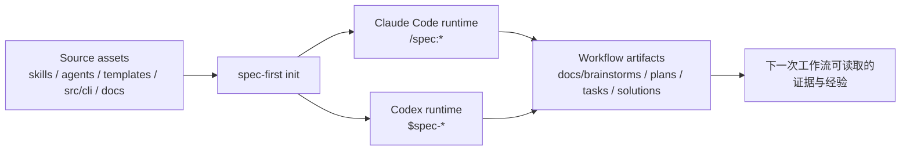

`spec-first` 是面向 Claude Code 与 Codex 的 **AI Coding Harness**：它把一次性的 AI coding 对话，变成由仓库承载、可治理、可验证、可复用的工程闭环。对初学者来说，可以先把它理解成一层“工程工作流外骨骼”：脚本负责安装、检查、生成和记录确定性事实，LLM 继续负责需求理解、范围判断、架构取舍、评审结论和下一步建议。Sources: [README.zh-CN.md](README.zh-CN.md#L13-L18), [docs/05-用户手册/README.md](docs/05-用户手册/README.md#L3-L10), [docs/contracts/ai-coding-harness.md](docs/contracts/ai-coding-harness.md#L26-L33)

这页是入门指南的第一站，只回答三个问题：`spec-first` 是什么、它把哪些东西安装到你的项目里、你应该按什么顺序继续阅读。安装命令、健康检查、宿主差异、首次走查、产物边界和多仓拓扑会在后续页面展开；本页只建立全局地图。Sources: [README.zh-CN.md](README.zh-CN.md#L91-L145), [docs/05-用户手册/README.md](docs/05-用户手册/README.md#L112-L140)

## 一句话定位

如果你已经在使用 Claude Code 或 Codex，`spec-first` 不是替代它们的新应用，而是在当前项目中安装一组可重建的 workflow 入口，让需求、计划、任务、执行证据、评审结果和可复用经验留在仓库里，而不是只停留在聊天窗口里。Sources: [README.zh-CN.md](README.zh-CN.md#L25-L35), [README.zh-CN.md](README.zh-CN.md#L226-L235)

它的核心主线可以读作：从代码库和需求出发，形成规格、计划、任务、代码改动、评审和知识沉淀；契约文档也把这条链路定义为 `Codebase -> Spec -> Plan -> Tasks -> Code -> Review -> Knowledge`。Sources: [AGENTS.md](AGENTS.md#L40-L48), [docs/contracts/ai-coding-harness.md](docs/contracts/ai-coding-harness.md#L7-L14)

## 你会得到什么

完成 `spec-first init` 后，项目会获得 Claude Code 的 `/spec:*` 命令入口、Codex 的 `$spec-*` skill 入口、workflow skills、agents、agent support files、项目级 developer 信息和受管状态；CLI 也提供 `doctor`、`init`、`update`、`clean`、`tasks`、`session` 等包级命令。Sources: [docs/05-用户手册/README.md](docs/05-用户手册/README.md#L7-L27), [src/cli/index.js](src/cli/index.js#L151-L168)

| 你关心的问题 | `spec-first` 提供的表面 | 初学者先记住 |
| --- | --- | --- |
| 怎么开始 | `spec-first doctor`、`spec-first init` | 先检查环境，再把 runtime 资产安装到当前项目 |
| 在 Claude Code 里怎么用 | `/spec:*` 入口 | 例如 `/spec:brainstorm` |
| 在 Codex 里怎么用 | `$spec-*` 入口 | 例如 `$spec-brainstorm` |
| 产物在哪里 | `docs/brainstorms/`、`docs/plans/`、`docs/tasks/`、`docs/solutions/`、`.spec-first/workflows/` | 重要判断和证据留在仓库路径里 |
| 谁负责事实 | CLI、脚本、工具、测试、日志 | 准备确定性 evidence input |
| 谁负责判断 | LLM workflow | 判断范围、取舍、评审和下一步 |

Sources: [README.zh-CN.md](README.zh-CN.md#L147-L172), [README.zh-CN.md](README.zh-CN.md#L177-L193), [README.zh-CN.md](README.zh-CN.md#L211-L224)

## 运行模型总览

先看这张图时，只需要抓住一个因果链：仓库里的 source assets 通过 `spec-first init` 生成宿主可读取的 runtime mirrors，宿主里的 workflow 再把需求、计划、任务、执行证据、评审和知识写回仓库产物。Sources: [README.zh-CN.md](README.zh-CN.md#L195-L203), [README.zh-CN.md](README.zh-CN.md#L276-L291)



Sources: [docs/contracts/source-runtime-customization-boundary.md](docs/contracts/source-runtime-customization-boundary.md#L7-L55), [src/cli/commands/init.js](src/cli/commands/init.js#L72-L87), [src/cli/commands/init.js](src/cli/commands/init.js#L162-L199)

这个模型的关键边界是：`skills/`、`agents/`、`templates/`、`src/cli/`、`docs/`、`README.md`、`README.zh-CN.md` 等是 source-of-truth；`.claude/`、`.codex/`、`.agents/skills/` 是 generated runtime mirrors，不应作为源码修复点手工修改。Sources: [AGENTS.md](AGENTS.md#L75-L103), [docs/contracts/source-runtime-customization-boundary.md](docs/contracts/source-runtime-customization-boundary.md#L7-L42)

## 项目结构速览

下面的结构不是完整目录清单，而是新手理解 `spec-first` 时最重要的几类区域：CLI 代码负责包入口和确定性命令，skills 与 agents 负责 workflow source assets，templates 负责宿主 runtime 模板，docs 负责需求、计划、架构、验证和知识文档，tests 负责分层验证。Sources: [AGENTS.md](AGENTS.md#L105-L120), [package.json](package.json#L37-L79)

```text
spec-first/
├── bin/spec-first.js        # npm 暴露的可执行入口
├── src/cli/                 # CLI 命令、初始化、状态、适配器与生成逻辑
├── skills/                  # workflow 与 standalone skill 源资产
├── agents/                  # agent profile 源资产
├── templates/               # Claude Code / Codex runtime 模板
├── docs/                    # 手册、需求、计划、架构、契约、验证与经验
├── scripts/                 # 辅助脚本与质量检查
├── tests/                   # unit / smoke / integration 等测试
└── package.json             # npm 包元信息、bin、scripts 与 Node 版本要求
```

Sources: [bin/spec-first.js](bin/spec-first.js#L1-L23), [src/cli/index.js](src/cli/index.js#L19-L80), [package.json](package.json#L1-L14), [package.json](package.json#L107-L112)

## 工作流如何帮助你

对初学者来说，最自然的路径通常不是一次性让 AI 改完所有代码，而是先把模糊想法变成 requirements brief，再进入 plan、task、work、review 和 compound 等后续节点；README 中也明确说明第一次 brainstorm 通常会在 `docs/brainstorms/` 下生成 requirements brief，后续可能继续产生 `docs/plans/`、`docs/tasks/`、结构化 work evidence、review findings、debug notes 和 `docs/solutions/` learnings。Sources: [README.zh-CN.md](README.zh-CN.md#L33-L57), [docs/05-用户手册/README.md](docs/05-用户手册/README.md#L58-L78)

| 阶段 | 你输入的东西 | 常见产物 | 本页只需要理解 |
| --- | --- | --- | --- |
| 发散与需求 | 一个问题、想法或改进方向 | `docs/brainstorms/` | 把口头想法变成可读 brief |
| 计划 | 已知需求或现有系统增量 | `docs/plans/` | 把目标变成可评审方案 |
| 任务 | plan 中可执行的工作 | `docs/tasks/` | 把计划拆成 handoff 单元 |
| 执行与验证 | 具体 task 或修复范围 | `.spec-first/workflows/`、验证摘要 | 留下真实执行证据 |
| 评审与沉淀 | diff、证据、经验 | review findings、`docs/solutions/` | 让下一次工作复用已验证知识 |

Sources: [README.zh-CN.md](README.zh-CN.md#L181-L193), [docs/contracts/source-runtime-customization-boundary.md](docs/contracts/source-runtime-customization-boundary.md#L43-L55)

## 与普通 prompt 的区别

`spec-first` 的差异不在于提供更多提示词，而在于把“软件决策如何被记下来、被验证、被复用”作为主线；它把状态放在项目内文档、generated runtime assets 和可验证 CLI facts 中，同时保留工程师对 scope、tradeoff 和验收的在环控制。Sources: [README.zh-CN.md](README.zh-CN.md#L67-L89)

| 维度 | 普通一次性 AI 对话 | `spec-first` |
| --- | --- | --- |
| 主要对象 | prompt、上下文片段、单次回答 | requirement、plan、task、diff、review、learning |
| 证据位置 | 聊天窗口或临时输出 | 仓库内 artifact 与 runtime facts |
| 自动化边界 | 容易让模型假装完成检查 | 脚本准备事实，LLM 做语义判断 |
| 人的角色 | 事后检查 AI 输出 | 持续确认范围、取舍与验收 |
| 复用方式 | 复制上一轮对话经验 | 通过 `docs/solutions/` 等产物沉淀经验 |

Sources: [README.zh-CN.md](README.zh-CN.md#L73-L89), [docs/contracts/ai-coding-harness.md](docs/contracts/ai-coding-harness.md#L35-L46)

## 新手阅读路径

建议按目录顺序继续阅读：先进入 [快速开始](2-kuai-su-kai-shi)，用最短路径完成安装和第一次运行；再读 [安装、健康检查与项目初始化](3-an-zhuang-jian-kang-jian-cha-yu-xiang-mu-chu-shi-hua)，理解 `doctor` 与 `init`；如果你同时使用 Claude Code 和 Codex，再读 [Claude Code 与 Codex 的入口差异](4-claude-code-yu-codex-de-ru-kou-chai-yi)。Sources: [README.zh-CN.md](README.zh-CN.md#L91-L145), [docs/05-用户手册/README.md](docs/05-用户手册/README.md#L128-L140)

当你已经完成初始化，下一步应阅读 [首次工程闭环走查](5-shou-ci-gong-cheng-bi-huan-zou-cha)，观察一次从需求到产物的真实链路；如果你不确定该从哪个 workflow 入口开始，再读 [选择合适的工作流入口](6-xuan-ze-he-gua-de-gong-zuo-liu-ru-kou)；如果你开始关心哪些文件该提交、哪些 runtime 目录不该手改，再读 [产物目录与 Git 提交边界](7-chan-wu-mu-lu-yu-git-ti-jiao-bian-jie)。Sources: [README.zh-CN.md](README.zh-CN.md#L49-L57), [README.zh-CN.md](README.zh-CN.md#L177-L203), [docs/05-用户手册/README.md](docs/05-用户手册/README.md#L112-L140)

如果你的项目不是单一仓库或单一模块，再读 [单仓、多模块与多仓工作区使用方式](8-dan-cang-duo-mo-kuai-yu-duo-cang-gong-zuo-qu-shi-yong-fang-shi)；当你需要升级、刷新或清理受管 runtime 资产时，再读 [升级、清理与运行时资产刷新](9-sheng-ji-qing-li-yu-yun-xing-shi-zi-chan-shua-xin)；遇到故障或能力缺失时，再读 [常见问题与降级路径](10-chang-jian-wen-ti-yu-jiang-ji-lu-jing)。Sources: [README.zh-CN.md](README.zh-CN.md#L201-L209), [README.zh-CN.md](README.zh-CN.md#L286-L310), [docs/05-用户手册/README.md](docs/05-用户手册/README.md#L79-L88)

## 本页记忆卡片

记住三句话就能继续往下走：第一，`spec-first` 是 Claude Code 与 Codex 之上的 AI Coding Harness；第二，source assets 通过 `spec-first init` 生成宿主 runtime mirrors；第三，真正有长期价值的是留在仓库中的需求、计划、任务、证据、评审和知识。Sources: [README.zh-CN.md](README.zh-CN.md#L13-L18), [README.zh-CN.md](README.zh-CN.md#L276-L282), [docs/contracts/source-runtime-customization-boundary.md](docs/contracts/source-runtime-customization-boundary.md#L43-L55)