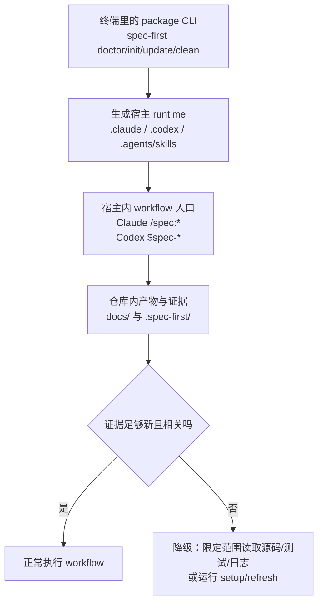
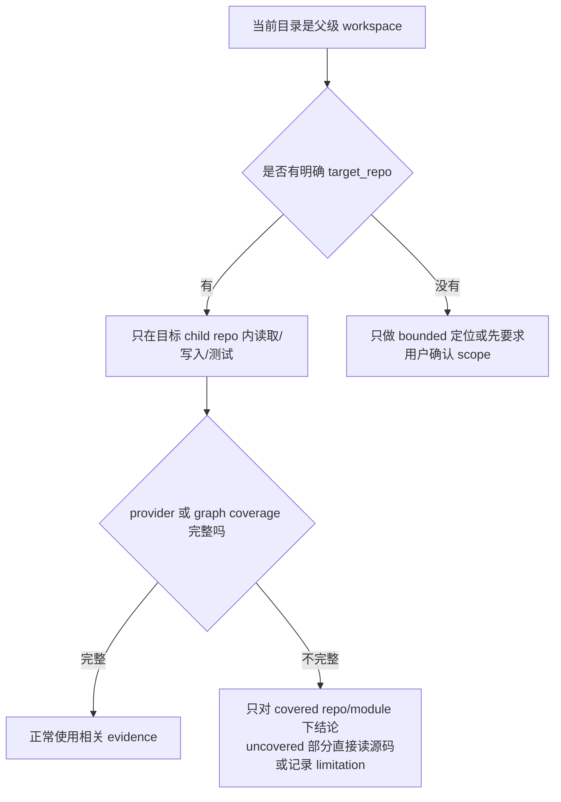

本页回答初学者最容易卡住的三个问题：**装好了但入口不可见怎么办**、**诊断结果不是绿色怎么办**、**外部工具或多仓工作区不完整时还能不能继续工作**。核心判断很简单：`spec-first doctor` 检查 CLI 与 runtime surface，`spec-first init` 从 source 重新生成宿主 runtime，`spec-mcp-setup` 准备 required harness runtime facts；如果证据不完整，workflow 应降级为 bounded direct source reads，而不是把缺失证据说成成功证据。Sources: [README.zh-CN.md](README.zh-CN.md#L93-L145), [doctor.js](src/cli/commands/doctor.js#L28-L101), [20-研发场景与降级路径.md](docs/05-用户手册/20-研发场景与降级路径.md#L3-L10)

## 架构假设：先分清三层问题

排障前先建立一个模型：**package CLI** 是你在终端运行的 `spec-first` 命令，**generated host runtime** 是 `spec-first init` 写入项目的 Claude Code / Codex 入口，**workflow evidence** 是后续 workflow 产生或读取的证据；这三层可以分别成功或失败，所以“npm 安装成功”不等于“宿主里已经能看到 `/spec:*` 或 `$spec-*`”。Sources: [README.zh-CN.md](README.zh-CN.md#L125-L145), [README.zh-CN.md](README.zh-CN.md#L177-L203), [AGENTS.md](AGENTS.md#L75-L103)



项目里相关目录可以按“source 与 runtime 分离”来记：`skills/`、`agents/`、`templates/`、`src/cli/`、`docs/` 是 source-of-truth；`.claude/`、`.codex/`、`.agents/skills/` 是可重建 runtime mirror；`.spec-first/` 保存本地 setup、workspace 或 workflow evidence，不能替代当前源码、测试和日志。Sources: [AGENTS.md](AGENTS.md#L77-L120), [README.zh-CN.md](README.zh-CN.md#L179-L203), [20-研发场景与降级路径.md](docs/05-用户手册/20-研发场景与降级路径.md#L12-L22)

```text
spec-first project
├── skills/                 # source：workflow 与 standalone skill
├── agents/                 # source：agent profile
├── templates/              # source：宿主 runtime 模板
├── src/cli/                # source：doctor/init/update/clean 等 CLI
├── .claude/                # runtime：Claude Code 生成资产
├── .codex/                 # runtime：Codex hooks/agents/state
├── .agents/skills/         # runtime：Codex skill discovery
├── docs/                   # durable workflow artifacts
└── .spec-first/            # local setup/workflow/workspace evidence
```

## 快速判断表

遇到问题时，先不要急着删除目录或手改 `.claude/`、`.codex/`、`.agents/skills/`；这些目录是 generated runtime assets，正确修复路径通常是确认 source、重新运行 `spec-first init`，然后重启宿主。Sources: [AGENTS.md](AGENTS.md#L95-L103), [README.zh-CN.md](README.zh-CN.md#L201-L203), [04-常见问题.md](docs/05-用户手册/04-常见问题.md#L20-L42)

| 现象 | 先检查 | 推荐动作 | 降级方式 |
|---|---|---|---|
| `spec-first` 命令不可用 | Node.js/npm、PATH | 重新安装或按包管理器修复 | 暂时不能使用 package CLI |
| `doctor` 找不到宿主 runtime | `.claude/`、`.codex/`、`.agents/skills/` | 运行 `spec-first init` | 只做普通源码阅读，不声称 workflow ready |
| 宿主里没有 `/spec:*` 或 `$spec-*` | runtime 文件存在但宿主未加载 | 完全退出并重启宿主 | 用终端 CLI 检查，不直接进入 workflow |
| `workflow_runnability=simulated` | evidence 缺失、过期或不完整 | 按任务运行必要验证或 setup | 披露证据限制后继续 bounded 工作 |
| 多仓或 provider 不完整 | workspace facts、coverage、provider readiness | 明确 `target_repo` 或运行 setup | 只对已覆盖范围下结论 |
Sources: [04-常见问题.md](docs/05-用户手册/04-常见问题.md#L51-L81), [doctor.js](src/cli/commands/doctor.js#L532-L619), [20-研发场景与降级路径.md](docs/05-用户手册/20-研发场景与降级路径.md#L24-L50)

## Q1：如何确认安装真的成功？

第一阶段确认终端 CLI：运行 `spec-first doctor`，必要时加 `--claude` 或 `--codex` 指定宿主；`doctor` 会检查 Node.js、Git、宿主 CLI、managed runtime assets、host readiness 和 workflow runnability，并在普通输出或 JSON 输出里给出可执行修复建议。Sources: [04-常见问题.md](docs/05-用户手册/04-常见问题.md#L5-L21), [doctor.js](src/cli/commands/doctor.js#L103-L182), [README.zh-CN.md](README.zh-CN.md#L292-L306)

```bash
spec-first doctor
spec-first doctor --claude
spec-first doctor --codex
spec-first doctor --json
```

第二阶段确认宿主入口：运行 `spec-first init`，选择目标宿主，完成后**完全退出并重启** Claude Code 或 Codex；然后在宿主会话内检查 `/spec:brainstorm --help` 或 `$spec-brainstorm --help`，因为这些入口不是 shell 命令，而是宿主加载 runtime 后提供的 workflow surface。Sources: [README.zh-CN.md](README.zh-CN.md#L125-L145), [04-常见问题.md](docs/05-用户手册/04-常见问题.md#L28-L42), [index.js](src/cli/index.js#L151-L168)

```text
# Claude Code 会话中
/spec:brainstorm --help

# Codex 会话中
$spec-brainstorm --help
```

## Q2：为什么 `doctor` 通过了，workflow 仍然不是 verified？

`doctor --json` 中的 `workflow_runnability` 有三种状态：`verified` 表示 runtime surface、host readiness、managed state 和新鲜有效的 execution evidence 都满足；`simulated` 表示 runtime surface 已就绪但 verification evidence 缺失、过期或不完整；`not_verified` 表示 runtime assets、managed state 或 workflow surface 本身还不完整。Sources: [04-常见问题.md](docs/05-用户手册/04-常见问题.md#L51-L81), [doctor.js](src/cli/commands/doctor.js#L532-L619)

| 状态 | 初学者理解 | 下一步 |
|---|---|---|
| `verified` | 入口和近期 evidence 都可用 | 可以进入对应 workflow，但仍按任务验证 |
| `simulated` | 入口可用，但缺少 verification-grade evidence | 继续工作时说明限制，必要时运行 setup 或验证 |
| `not_verified` | runtime 或宿主 surface 还没准备好 | 先运行 `spec-first init`，重启宿主再检查 |
Sources: [04-常见问题.md](docs/05-用户手册/04-常见问题.md#L64-L81), [doctor.js](src/cli/commands/doctor.js#L584-L619)

常见 fallback reason 包括 `verification_evidence_missing`、`verification_evidence_schema_invalid`、`verification_gates_unresolved`、`verification_evidence_not_relevant`、`verification_evidence_stale` 和 `verification_evidence_freshness_unknown`；这些原因不是“失败标签”，而是在告诉你当前 evidence 不能被当成 verification-grade truth。Sources: [04-常见问题.md](docs/05-用户手册/04-常见问题.md#L72-L81), [doctor.js](src/cli/commands/doctor.js#L639-L672)

## Q3：宿主入口找不到时怎么办？

先检查生成目录：Claude Code 侧看 `.claude/commands/spec`、`.claude/skills`、`.claude/spec-first/workflows` 和 `.claude/agents`；Codex 侧看 `.agents/skills`、`.codex/agents` 和 `.codex/spec-first/state.json`。如果目录缺失，运行 `spec-first init`；如果目录存在但宿主看不到入口，重启宿主。Sources: [04-常见问题.md](docs/05-用户手册/04-常见问题.md#L110-L165), [claude.js](src/cli/adapters/claude.js#L34-L63), [codex.js](src/cli/adapters/codex.js#L41-L75)

```bash
# Claude Code runtime
ls .claude/commands/spec
ls .claude/skills
ls .claude/spec-first/workflows

# Codex runtime
ls .agents/skills
find .codex/agents -type f | head
```

Claude Code 的公开 workflow 入口形如 `/spec:brainstorm`，Codex 的公开 workflow 入口形如 `$spec-brainstorm`；两者共享 source assets，但通过不同 runtime surface 暴露给宿主，因此不要把 Codex 入口写成 `/spec:*`，也不要把 Claude 入口写成 `$spec-*`。Sources: [README.zh-CN.md](README.zh-CN.md#L147-L171), [AGENTS.md](AGENTS.md#L242-L260), [codex.js](src/cli/adapters/codex.js#L27-L35)

## Q4：升级后旧入口、旧说明或 runtime 漂移怎么办？

日常升级使用 `spec-first update`；它会运行 `npm install -g spec-first@latest`，升级成功后启动一个 fresh `spec-first init` 子进程刷新当前项目的 generated runtime assets，避免旧进程直接执行新生成逻辑造成版本错位。Sources: [update.js](src/cli/commands/update.js#L13-L24), [update.js](src/cli/commands/update.js#L44-L91), [README.zh-CN.md](README.zh-CN.md#L175-L176)

```bash
spec-first update
```

如果自动刷新 runtime 失败或 scope 无法安全判断，`update` 会打印 fallback commands：单仓运行 `spec-first init -y`，父级 workspace 运行 `spec-first init --all-repos -y`；如果你不是通过 `npm -g` 安装，例如 Claude plugin、pnpm 或 volta，应按自己的安装方式升级，避免产生冲突副本。Sources: [update.js](src/cli/commands/update.js#L64-L91), [update.js](src/cli/commands/update.js#L121-L152), [README.zh-CN.md](README.zh-CN.md#L29-L35)

## Q5：什么时候用 `spec-mcp-setup`，什么时候直接继续？

`doctor` 不替代 setup workflow：它主要检查 CLI、managed runtime assets、host readiness 和 workflow verification evidence；如果目标是准备 required harness runtime、MCP/helper readiness 或 provider setup facts，应在当前宿主内运行 `/spec:mcp-setup` 或 `$spec-mcp-setup`。Sources: [04-常见问题.md](docs/05-用户手册/04-常见问题.md#L51-L82), [README.zh-CN.md](README.zh-CN.md#L276-L290), [README.zh-CN.md](README.zh-CN.md#L151-L153)

```text
# Claude Code
/spec:mcp-setup

# Codex
$spec-mcp-setup
```

轻量源码定位、单文件解释或明确范围的小修复不需要把 setup 当硬前置；当 provider 或 graph facts 缺失时，正确降级方式是读取当前源码、git diff、测试和日志，并在结论里说明限制，而不是偷偷运行 watcher、daemon、hooks 或 external refresh。Sources: [README.zh-CN.md](README.zh-CN.md#L286-L290), [20-研发场景与降级路径.md](docs/05-用户手册/20-研发场景与降级路径.md#L40-L50), [20-研发场景与降级路径.md](docs/05-用户手册/20-研发场景与降级路径.md#L94-L102)

## Q6：多仓工作区或父级 workspace 怎么降级？

多仓 workspace 的基本规则是：写入、测试、review autofix、commit 或修复前必须明确 `target_repo` 或 per-child scope；父目录下的 `.spec-first/workspace/*` 只是 advisory workspace summaries，不能覆盖 child repo 的 `.spec-first/config/*`、当前源码、测试或日志。Sources: [20-研发场景与降级路径.md](docs/05-用户手册/20-研发场景与降级路径.md#L5-L22), [20-研发场景与降级路径.md](docs/05-用户手册/20-研发场景与降级路径.md#L24-L39), [AGENTS.md](AGENTS.md#L242-L254)



当 `graph-targets.json` 显示 build-target 覆盖缺口时，只能把 graph 或 direct source evidence 用于 covered git roots；对 `non_git_build_modules[]` 中未覆盖的 Gradle/npm module，需要直接读源码、运行相关测试或明确记录 limitation，不能因为父级 workspace 命名了相邻 module 就自动扩大工作范围。Sources: [20-研发场景与降级路径.md](docs/05-用户手册/20-研发场景与降级路径.md#L73-L79), [20-研发场景与降级路径.md](docs/05-用户手册/20-研发场景与降级路径.md#L94-L102)

## Q7：父级 workspace 有残留 artifact 能删吗？

可以先运行 `spec-first clean --workspace-orphans` 预览；没有 `--confirm` 时它只读取 `.spec-first/workspace/parent-artifact-quarantine.json` 并打印候选路径，不会删除文件。Sources: [20-研发场景与降级路径.md](docs/05-用户手册/20-研发场景与降级路径.md#L64-L72), [clean.js](src/cli/commands/clean.js#L156-L200)

```bash
spec-first clean --workspace-orphans
spec-first clean --workspace-orphans --confirm
```

真正删除前，clean 会验证 quarantine schema、路径必须是 POSIX repo-relative、不能包含绝对路径或 `..`，并且只允许 `.spec-first/config/tool-facts.json` 和 `.spec-first/config/runtime-capabilities.json` 这类受支持 orphan target；删除计划还会检查目标不能逃出项目根目录或通过 symlink escape。Sources: [clean.js](src/cli/commands/clean.js#L235-L263), [clean.js](src/cli/commands/clean.js#L312-L337)

## Q8：broken worktree 或 corrupted gitdir 怎么处理？

如果 setup 诊断显示 `git_health.status="broken-worktree"`，先运行 `spec-first repair-worktree --dry-run` 查看 pointer 摘要和手动修复建议；该路径是 preview-first，不会直接删除 `.git` pointer。Sources: [04-常见问题.md](docs/05-用户手册/04-常见问题.md#L83-L108), [README.zh-CN.md](README.zh-CN.md#L292-L309)

```bash
spec-first repair-worktree --dry-run
```

如果是 `corrupted-gitdir`，按诊断提示使用 Git 自身工具，例如 `git fsck`；如果只是 `coverage_gap.uncovered_top_level_dirs`，它表示父级 workspace 中有非 Git 目录未被 child repo discovery 覆盖，不等于 workflow 失败，处理方式是显式传入目标 folder 或直接读取相关源码。Sources: [04-常见问题.md](docs/05-用户手册/04-常见问题.md#L87-L108), [20-研发场景与降级路径.md](docs/05-用户手册/20-研发场景与降级路径.md#L73-L79)

## Q9：能不能手改 `.claude/`、`.codex/` 或 `.agents/skills/`？

不要把 `.claude/`、`.codex/`、`.agents/skills/` 当 source；它们是 generated runtime mirrors。需要改 workflow、skill、agent、template 或 CLI 行为时，应修改 `skills/`、`agents/`、`templates/`、`src/cli/` 或 docs 下的 source assets，再运行 `spec-first init` 重新生成 runtime。Sources: [AGENTS.md](AGENTS.md#L75-L120), [README.zh-CN.md](README.zh-CN.md#L217-L224), [README.zh-CN.md](README.zh-CN.md#L328-L330)

手改 runtime 的常见后果是下一次 `init` 或 `update` 覆盖你的改动，或者让 `doctor` 报告 runtime drift；如果你只是想临时恢复可用入口，仍然应使用 `spec-first init`，而不是在 generated mirror 里 patch 单个文件。Sources: [AGENTS.md](AGENTS.md#L95-L103), [AGENTS.md](AGENTS.md#L163-L172), [README.zh-CN.md](README.zh-CN.md#L201-L203)

## 降级路径速查

降级不是“放弃”，而是把结论限定在证据真实覆盖的范围内：provider 不可用时用 direct source/test/log evidence，multi-repo scope 不清时先限定 `target_repo`，verification evidence 不新鲜时披露 freshness limitation，non-git folder 中不要声称 Git diff、commit freshness 或 review impact evidence。Sources: [20-研发场景与降级路径.md](docs/05-用户手册/20-研发场景与降级路径.md#L24-L50), [20-研发场景与降级路径.md](docs/05-用户手册/20-研发场景与降级路径.md#L80-L92)

| 场景 | 可以继续吗 | 正确降级 |
|---|---:|---|
| `dirty-single-repo` | 可以 | 保持 diff scope 明确，提交或 review 前披露 dirty paths |
| `multi-repo-workspace` | 可以 | 写入前明确 `target_repo` 或 per-child scope |
| `provider-degraded` | 可以 | graph-backed claim 降级为 bounded direct evidence |
| `non-git-folder` | 部分可以 | 可读文件，但不声称 Git freshness 或 commit evidence |
| `foreign-residual-workspace` | 谨慎 | 先预览 orphan cleanup，再刷新 harness |
| `blocked-action-required` | 暂停高风险动作 | 清理或刷新前不做写入、autofix、commit 或 root-cause claim |
Sources: [20-研发场景与降级路径.md](docs/05-用户手册/20-研发场景与降级路径.md#L24-L50), [20-研发场景与降级路径.md](docs/05-用户手册/20-研发场景与降级路径.md#L94-L102)

## 推荐阅读顺序

如果你刚接入，先读 [快速开始](2-kuai-su-kai-shi)，再读 [安装、健康检查与项目初始化](3-an-zhuang-jian-kang-jian-cha-yu-xiang-mu-chu-shi-hua)，然后用 [首次工程闭环走查](5-shou-ci-gong-cheng-bi-huan-zou-cha) 验证入口是否能产生真实 artifact；理解产物边界时读 [产物目录与 Git 提交边界](7-chan-wu-mu-lu-yu-git-ti-jiao-bian-jie)，遇到单仓、多模块、多仓 scope 问题时读 [单仓、多模块与多仓工作区使用方式](8-dan-cang-duo-mo-kuai-yu-duo-cang-gong-zuo-qu-shi-yong-fang-shi)，升级或刷新 runtime 时读 [升级、清理与运行时资产刷新](9-sheng-ji-qing-li-yu-yun-xing-shi-zi-chan-shua-xin)。Sources: [README.zh-CN.md](README.zh-CN.md#L256-L310), [README.md](README.md#L147-L171)