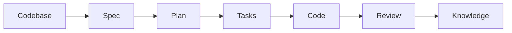
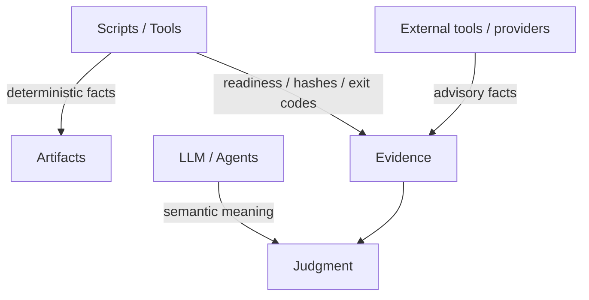

这一页聚焦 `spec-first` 作为 **AI Coding Harness** 的设计原则：它为什么存在、靠什么成立、以及为什么它不是 prompt 集合、状态机或中心化流程引擎。当前页位于“深入解析 / 核心设计”之下，位置本身就说明它讨论的是系统判断基线，而不是某个具体 workflow 的操作手册。Sources: [AGENTS.md](AGENTS.md#L32-L49), [docs/contracts/ai-coding-harness.md](docs/contracts/ai-coding-harness.md#L1-L14), [docs/10-prompt/结构化项目角色契约.md](docs/10-prompt/结构化项目角色契约.md#L11-L23)

## 设计命题
`spec-first` 的第一性原理很明确：AI coding 的问题不在“能不能写代码”，而在“判断、证据和评审轨迹会不会随对话窗口消失”。因此它把一次性的对话，重构为一个可重复、可观察、可约束、可验证的工程闭环；核心链路始终是 `Codebase -> Spec -> Plan -> Tasks -> Code -> Review -> Knowledge`。这意味着系统价值不在单点功能，而在把工程决策变成可沉淀的持久 artifact。Sources: [README.zh-CN.md](README.zh-CN.md#L13-L18), [docs/contracts/ai-coding-harness.md](docs/contracts/ai-coding-harness.md#L7-L14), [CONCEPTS.md](CONCEPTS.md#L9-L16), [docs/10-prompt/结构化项目角色契约.md](docs/10-prompt/结构化项目角色契约.md#L29-L37)

这张图不是在描述一个刚性状态机，而是在描述一个证据递进链：每一层都必须比上一层更接近可执行、可验证、可复用的工程事实。Sources: [docs/contracts/ai-coding-harness.md](docs/contracts/ai-coding-harness.md#L7-L14), [docs/10-prompt/结构化项目角色契约.md](docs/10-prompt/结构化项目角色契约.md#L42-L60)

## 六层 Harness
`AI Coding Harness` 的哲学不是“多一些自动化”，而是把 AI 开发拆成六个负载分层：Context、Execution、Evidence、Evaluation、Governance、Knowledge。每一层都对应明确的责任，避免把上下文、执行、证据、治理和知识混成同一种东西。这样的分层让系统可以局部演进：例如上下文治理可以独立加强，而不必改写整个工作流。Sources: [docs/contracts/ai-coding-harness.md](docs/contracts/ai-coding-harness.md#L15-L25), [docs/10-prompt/结构化项目角色契约.md](docs/10-prompt/结构化项目角色契约.md#L42-L60)

| 层 | 设计意图 | 约束点 |
|---|---|---|
| `Context Harness` | 只给相关上下文，不广播整仓库 | 有界读取、`summary-first`、精确路径 |
| `Execution Harness` | 让计划、任务、工作、评审之间可交接 | 传递 scope / identity / evidence，不变成状态机 |
| `Evidence Harness` | 让结论可追溯、可质疑、可验证 | provenance、freshness、limitations |
| `Evaluation Harness` | 判断系统是否真的变好 | 聚焦检查、质量门禁、反馈闭环 |
| `Governance Harness` | 约束 source/runtime/provider 边界 | mutation gate、host delivery、freshness owner |
| `Knowledge Harness` | 沉淀可复用经验 | verified、可发现、可失效的知识进入 durable surface |
Sources: [docs/contracts/ai-coding-harness.md](docs/contracts/ai-coding-harness.md#L15-L25), [docs/contracts/artifact-summary.md](docs/contracts/artifact-summary.md#L1-L20), [docs/contracts/context-governance.md](docs/contracts/context-governance.md#L1-L14)

## 三条不变量
这个 harness 的设计哲学可以压缩成三条不变量：第一，`Scripts prepare, LLM decides`；第二，`Light contract + Explicit boundaries`；第三，可信证据优先于自动化便利。它们共同把系统切成“确定性准备”与“语义判断”两半：脚本负责路径、哈希、校验、状态和产物；LLM 负责 scope、取舍、风险解释和 review 结论。Sources: [AGENTS.md](AGENTS.md#L32-L49), [docs/10-prompt/结构化项目角色契约.md](docs/10-prompt/结构化项目角色契约.md#L64-L77), [docs/contracts/source-runtime-customization-boundary.md](docs/contracts/source-runtime-customization-boundary.md#L57-L79)

| 原则 | 允许 | 禁止 |
|---|---|---|
| `Scripts prepare, LLM decides` | 脚本生成事实、exit code、reason_code | 脚本替代语义判断 |
| `Light contract` | 轻量、明确、可维护的语义合同 | 过度中心化、过度 schema 化 |
| `Explicit boundaries` | 明确 source / runtime / provider / artifact / consumer | 多真相源、边界泄漏 |
| 可信证据优先 | 先验证，再结论 | 用猜测冒充事实 |
| preview-first / source-first | 先预览、先改 source | 直接 silent write、手改 runtime 镜像 |
Sources: [AGENTS.md](AGENTS.md#L36-L49), [docs/10-prompt/结构化项目角色契约.md](docs/10-prompt/结构化项目角色契约.md#L72-L77), [docs/contracts/source-runtime-customization-boundary.md](docs/contracts/source-runtime-customization-boundary.md#L7-L24)

## 责任分界
`spec-first` 不是把所有能力都做成一套强状态机，而是明确谁拥有哪类判断权。`src/cli/plugin.js` 把 source assets、host delivery 和 dual-host governance 绑定到可读的治理清单；`docs/contracts/context-governance.md` 则把默认上下文排除项、summary-first 规则和 host instruction reuse policy 固化下来。换句话说，系统哲学不是“让 AI 看到更多”，而是“让 AI 看到更对的东西”。Sources: [src/cli/plugin.js](src/cli/plugin.js#L15-L35), [docs/contracts/context-governance.md](docs/contracts/context-governance.md#L1-L14), [docs/contracts/context-governance.md](docs/contracts/context-governance.md#L22-L35)

这张关系图的重点是：外部工具和脚本都能提供证据，但不能自动升级为权威；语义结论必须回到当前 source、测试、日志或用户确认上完成闭环。Sources: [docs/contracts/source-runtime-customization-boundary.md](docs/contracts/source-runtime-customization-boundary.md#L57-L93), [docs/contracts/ai-coding-harness.md](docs/contracts/ai-coding-harness.md#L26-L34), [CONCEPTS.md](CONCEPTS.md#L37-L44)

## 证据与交接
在实现层面，`spec-first` 通过 `summary-first handoff` 把跨 workflow 交接变成可压缩的事实流，而不是把长报告、原始日志或 session transcript 直接甩给下游。`artifact-summary.v1` 明确要求每个 durable artifact 带上 `producer`、`scope`、`evidence_paths`、`unresolved_risks` 和 `full_artifact_read_triggers`，这体现的是一种保守的工程哲学：默认传摘要，只在证据不足时展开全文。Sources: [docs/contracts/artifact-summary.md](docs/contracts/artifact-summary.md#L1-L20), [docs/contracts/artifact-summary.md](docs/contracts/artifact-summary.md#L21-L73), [docs/contracts/context-governance.md](docs/contracts/context-governance.md#L54-L80)

`README.zh-CN.md` 也把这个哲学落成用户可感知的叙事：第一次闭环的第一产物是写入仓库的 Markdown artifact，而不是隐藏 memory；work、review、debug、compound 的结果会以 evidence 和 learning 的形式保留在 repo 中。`tests/unit/ai-coding-harness-contracts.test.js` 则把这些文字约束变成可执行护栏，确保文档始终坚持“bounded AI Coding Harness，不是 state machine”这一定位。Sources: [README.zh-CN.md](README.zh-CN.md#L33-L56), [README.zh-CN.md](README.zh-CN.md#L67-L90), [tests/unit/ai-coding-harness-contracts.test.js](tests/unit/ai-coding-harness-contracts.test.js#L12-L67)

## 运行时边界
从 CLI 视角看，`spec-first` 的运行时哲学同样是“source 控制行为，runtime 负责投递”。`src/cli/index.js` 只负责命令分发、版本提醒、帮助输出和具体子命令入口，说明它是一个薄入口层；`src/cli/plugin.js` 则从 `skills-governance.json`、`templates/claude/commands/spec`、`skills/` 和 `agents/` 汇总可投递资产，体现“source-of-truth 统一，host delivery 按平台投影”的原则。Sources: [src/cli/index.js](src/cli/index.js#L19-L80), [src/cli/plugin.js](src/cli/plugin.js#L15-L47), [src/cli/contracts/dual-host-governance/skills-governance.json](src/cli/contracts/dual-host-governance/skills-governance.json#L1-L47)

| 维度 | Source | Generated runtime | 设计含义 |
|---|---|---|---|
| 行为归属 | `skills/`, `agents/`, `templates/`, `src/cli/` | `.claude/`, `.codex/`, `.agents/skills/` | 先改 source，不手改镜像 |
| 证据归属 | 仓库内 artifacts、tests、logs | host-local 投影 | 证据可追溯，不可反向当 source |
| 修复方式 | `spec-first init` | 不直接 patch | runtime drift 通过再生成修复 |
Sources: [docs/contracts/source-runtime-customization-boundary.md](docs/contracts/source-runtime-customization-boundary.md#L7-L41), [docs/contracts/context-governance.md](docs/contracts/context-governance.md#L83-L96), [AGENTS.md](AGENTS.md#L75-L104)

## 阅读路径
如果要继续理解这套设计哲学，最合适的顺序是先读 [从需求到知识沉淀的工程闭环](12-cong-xu-qiu-dao-zhi-shi-chen-dian-de-gong-cheng-bi-huan)，再读 [上下文、执行、证据、评估、治理与知识六层架构](13-shang-xia-wen-zhi-xing-zheng-ju-ping-gu-zhi-li-yu-zhi-shi-liu-ceng-jia-gou)，最后读 [脚本事实与 LLM 语义判断的责任分界](14-jiao-ben-shi-shi-yu-llm-yu-yi-pan-duan-de-ze-ren-fen-jie)。这样能从“为什么”过渡到“怎么分层”，再收束到“谁负责什么”，避免把 harness 误读成单纯的命令集合。Sources: [docs/contracts/ai-coding-harness.md](docs/contracts/ai-coding-harness.md#L1-L14), [docs/10-prompt/结构化项目角色契约.md](docs/10-prompt/结构化项目角色契约.md#L27-L37), [README.zh-CN.md](README.zh-CN.md#L147-L173)