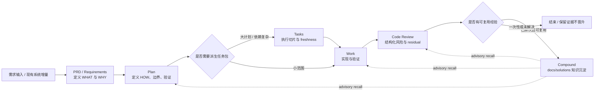

spec-first 的核心闭环不是“多放几个 prompt”，而是把 AI coding 放进一条可追踪的工程链路：`Codebase -> Spec -> Plan -> Tasks -> Code -> Review -> Knowledge`。这页只解释这条链路如何把一次需求输入逐步转化为需求文档、计划、任务、代码变更、评审证据与可复用知识，不展开 CLI 包入口、双宿主投递、单个 workflow 的完整操作细节。Sources: [结构化项目角色契约.md](docs/10-prompt/结构化项目角色契约.md#L42-L60), [AGENTS.md](AGENTS.md#L40-L48)

## 架构假设

可以先把闭环理解为一个**证据逐级升格系统**：需求阶段沉淀 WHAT/WHY，计划阶段沉淀 HOW，任务阶段把大计划压缩为可执行切片，执行阶段用 diff 与验证结果形成事实，评审阶段把风险结构化，最后 compound 阶段只把“已解决且可复用”的经验提升为长期知识。这个假设由角色契约中的六层 Harness、workflow 链路和 knowledge promotion gate 共同支撑。Sources: [结构化项目角色契约.md](docs/10-prompt/结构化项目角色契约.md#L47-L60), [结构化项目角色契约.md](docs/10-prompt/结构化项目角色契约.md#L97-L110)

图中的反向虚线不是“知识自动决定下次方案”，而是表示 `docs/solutions/` 中的经验在后续 plan、work、review 中只能作为 advisory recall candidate；消费者仍需回到 source refs、测试、日志、合同或变更文件确认事实。Sources: [spec-work/SKILL.md](skills/spec-work/SKILL.md#L110-L117), [spec-compound/SKILL.md](skills/spec-compound/SKILL.md#L87-L98)

## 闭环阶段

| 阶段 | 主要问题 | 产物位置 | 下游消费者 |
| --- | --- | --- | --- |
| PRD / Requirements | 要做什么，为什么，当前系统证据是什么 | `docs/brainstorms/*-requirements.md` | `spec-plan`、doc review、后续维护者 |
| Plan | 怎么做，边界与验证是什么 | `docs/plans/*-plan.md` | `spec-work`、`spec-write-tasks`、review |
| Tasks | 计划是否需要压缩为执行切片 | `docs/tasks/*-tasks.md` | `spec-work`、人工执行审查 |
| Work | 是否按范围完成实现并留下验证证据 | repo diff、测试输出、可选 run evidence | `spec-code-review`、PR、compound |
| Code Review | diff 是否存在结构化风险或 residual | 临时 review artifact 或 durable residual summary | `spec-work`、PR、人类 reviewer、compound |
| Compound | 解决方案是否值得复用 | `docs/solutions/**/*` | 后续 plan、work、debug、review |

这些阶段不是强状态机；它们是有边界的工作流节点。小改动可以从 plan 直接到 work，复杂计划可以先派生 tasks，但每个节点都必须尊重上游 source-of-truth，不得把派生产物升级成新的真相源。Sources: [spec-write-tasks/SKILL.md](skills/spec-write-tasks/SKILL.md#L71-L83), [spec-work/SKILL.md](skills/spec-work/SKILL.md#L160-L180)

## 从需求到计划

PRD 阶段的职责是让 planning 不必发明产品行为：它把已有系统增量、粗糙产品说明或低质量 PRD 转成最小但耐用的需求产物，覆盖 WHAT/WHY、当前状态证据、验收、范围边界，并明确不写实现计划、不编辑 runtime mirror、不创建第二套 `docs/prds/` 拓扑。Sources: [spec-prd/SKILL.md](skills/spec-prd/SKILL.md#L9-L17), [spec-prd/SKILL.md](skills/spec-prd/SKILL.md#L64-L72)

计划阶段接收需求文档、bug report、功能想法或粗略描述，但它的语义边界是 HOW：输出 goals、non-goals、requirements、implementation units、文件和测试引用、顺序、风险与 handoff 选项；在交接前保持 plan-only，不进入实现或测试证明。Sources: [spec-plan/SKILL.md](skills/spec-plan/SKILL.md#L11-L23), [spec-plan/SKILL.md](skills/spec-plan/SKILL.md#L35-L57)

PRD 到 Plan 的关键约束是 traceability：如果上游需求带有 `spec_id`、actors、flows、acceptance examples、scope boundaries、decisions 或 PRD-grade feature slices，计划必须继承这些锚点；如果计划需要自行选择术语、source-of-truth、领域归属或验收边界，就说明 PRD handoff 仍有熵，需要回到需求层补齐，而不是在计划里偷偷补产品判断。Sources: [spec-plan/SKILL.md](skills/spec-plan/SKILL.md#L155-L179)

## 从计划到执行

`spec-write-tasks` 是 plan 与 work 之间的可选派生层，只在计划足够大、依赖明显或用户明确要求拆任务时使用；它不会执行代码，也不能改变范围、验收或非目标，只能把 source plan 压缩成带 `spec_id`、`source_plan`、`source_plan_hash`、依赖、文件边界和验证焦点的执行索引。Sources: [spec-write-tasks/SKILL.md](skills/spec-write-tasks/SKILL.md#L7-L13), [spec-write-tasks/SKILL.md](skills/spec-write-tasks/SKILL.md#L31-L49)

`spec-work` 是闭环中真正产生代码、文档或配置变更的节点；它从计划、任务包或明确实现请求出发，先确认 repo/branch/task-pack 边界，再按范围实现、运行聚焦验证、执行必要质量检查，并以 changed files、verification commands、review tier、residual status 与 next action 结束。Sources: [spec-work/SKILL.md](skills/spec-work/SKILL.md#L15-L47), [spec-work/SKILL.md](skills/spec-work/SKILL.md#L186-L200)

执行节点的核心防线是“不让实现重新定义需求或计划”：当 WHAT/HOW 未解决、目标仓库不清楚、task pack stale、hash 或 `spec_id` 不匹配、scope 超出计划时，work 必须停止并给出 handoff，而不是在实现过程中扩大范围。Sources: [spec-work/SKILL.md](skills/spec-work/SKILL.md#L19-L39), [spec-work/SKILL.md](skills/spec-work/SKILL.md#L160-L180)

## 证据与评审

闭环不是靠“模型说完成”收口，而是靠直接证据与 summary-first handoff。`artifact-summary.v1` 要求下游先消费简短摘要、source paths、evidence paths、limitations 和 full-read triggers；长计划、review report、raw log、session transcript 或外部工具输出不应被无差别塞给每个下游 agent。Sources: [artifact-summary.md](docs/contracts/artifact-summary.md#L1-L20), [artifact-summary.md](docs/contracts/artifact-summary.md#L55-L73)

`spec-code-review` 位于实现之后，用 current branch diff、PR scope、计划或任务证据、测试上下文和可选外部工具证据生成结构化 finding；输出需要带 severity、confidence、evidence、autofix_class、owner routing、residual status 和 Coverage，外部工具失败时只能降级为 fallback evidence，不能冒充已确认影响面。Sources: [spec-code-review/SKILL.md](skills/spec-code-review/SKILL.md#L11-L43), [spec-code-review/SKILL.md](skills/spec-code-review/SKILL.md#L101-L110)

上下文治理防止闭环被“全量上下文幻觉”污染：普通 workflow 默认排除 `.spec-first/audits/**`、`.spec-first/governance/**`、`.claude/**`、`.codex/**` 和 `.agents/skills/**`，优先读取用户请求、diff、changed files、计划/需求/task-pack summary，再读取 source-of-truth、nearby source/test 和精确路径证据。Sources: [context-governance.md](docs/contracts/context-governance.md#L22-L35), [context-governance.md](docs/contracts/context-governance.md#L97-L107)

## 知识晋升

Compound 阶段只处理“刚解决且有复用价值”的问题，它的目标是在 `docs/solutions/` 写出一个 durable solution document，并保留 duplicate/related-doc notes、frontmatter 校验和 evidence-backed summary；它明确不用于 active debugging、未解决实现、一次性美化或原始 transcript 归档。Sources: [spec-compound/SKILL.md](skills/spec-compound/SKILL.md#L10-L24), [spec-compound/SKILL.md](skills/spec-compound/SKILL.md#L26-L49)

知识晋升有硬边界：新晋升的 solution 必须包含 `invalidation_condition`、`source_refs`、`domain`、`pattern`、`rejected_alternatives` 与 `applicability_limits` 等结构化召回字段；历史旧文档可以作为 legacy advisory，但缺少 source refs 或失效条件时不能阻塞普通 recall，也不能被当作 confirmed truth。Sources: [spec-compound/SKILL.md](skills/spec-compound/SKILL.md#L93-L103)

这就是闭环的“沉淀”含义：不是把每次对话都保存下来，而是只把经过实现、验证、评审或源码确认的可复用经验提升为长期知识；后续工作流读取它时仍然要按 source refs 回到当前代码、测试、合同或日志确认是否仍然成立。Sources: [spec-compound/SKILL.md](skills/spec-compound/SKILL.md#L87-L98), [artifact-summary.md](docs/contracts/artifact-summary.md#L65-L73)

## 产物地图

| 目录或位置 | 闭环角色 | Git 边界 |
| --- | --- | --- |
| `docs/brainstorms/*-requirements.md` | 需求与 PRD-grade requirements | 通常提交 |
| `docs/plans/*-plan.md` | 实施计划、取舍、验证范围 | 通常提交 |
| `docs/tasks/*-tasks.md` | 从 plan 派生的执行 handoff | 视团队协作需要提交 |
| repo diff / tests / logs | 实现事实与验证证据 | 随代码或验证输出存在 |
| `<os-temp>/spec-first/spec-code-review/<run-id>/` | 当前 review run 临时协调 | 不作为 repo-local durable truth |
| `docs/solutions/**/*` | 可复用工程知识 | 通常提交 |

这张地图体现了 source 与 runtime/control-plane 的边界：`docs/brainstorms/`、`docs/plans/`、`docs/tasks/` 和 `docs/solutions/` 是长期协作文档层；`.spec-first/` 下的 setup、audit、app-audit、quality gate 和 work run evidence 多数是可重建或 run-scoped 产物，不应替代源码、计划、任务包或 solution 文档的真相源。Sources: [04-workflows-artifacts-map.md](docs/05-用户手册/04-workflows-artifacts-map.md#L25-L35), [04-workflows-artifacts-map.md](docs/05-用户手册/04-workflows-artifacts-map.md#L36-L64)

## 反模式

| 反模式 | 为什么破坏闭环 | 正确边界 |
| --- | --- | --- |
| 在 Plan 中发明 WHAT | 计划越权替代需求判断 | 回到 PRD / requirements 补齐 |
| 让 task pack 改范围 | 派生产物变成第二计划 | 只重排执行切片 |
| 未验证就声明完成 | evidence harness 失效 | 跑聚焦验证或记录 not-run reason |
| 把 review finding 当知识 | 风险尚未被解决和确认 | 先修复或保留 residual |
| 把 raw session transcript 存入 solution | 噪声与隐私风险进入 durable layer | 只沉淀可复用 lesson 与 source refs |

这些反模式都可以归约为同一个边界错误：把 advisory、临时、派生或未确认的信息提升成 durable truth。spec-first 的设计用 source-first、summary-first、verification gate、handoff gate 和 knowledge promotion gate 限制这种错误。Sources: [结构化项目角色契约.md](docs/10-prompt/结构化项目角色契约.md#L80-L116), [context-governance.md](docs/contracts/context-governance.md#L50-L61)

## 推荐阅读路径

读完本页后，如果想理解这条闭环为什么属于 AI Coding Harness 的一部分，继续读 [上下文、执行、证据、评估、治理与知识六层架构](13-shang-xia-wen-zhi-xing-zheng-ju-ping-gu-zhi-li-yu-zhi-shi-liu-ceng-jia-gou)；如果想理解确定性脚本与 LLM 判断的责任分界，继续读 [脚本事实与 LLM 语义判断的责任分界](14-jiao-ben-shi-shi-yu-llm-yu-yi-pan-duan-de-ze-ren-fen-jie)；如果要进入具体操作，再读 [需求发散、PRD 与计划编写工作流](20-xu-qiu-fa-san-prd-yu-ji-hua-bian-xie-gong-zuo-liu) 和 [任务拆分、执行、调试与优化工作流](21-ren-wu-chai-fen-zhi-xing-diao-shi-yu-you-hua-gong-zuo-liu)。Sources: [spec-prd/SKILL.md](skills/spec-prd/SKILL.md#L43-L49), [spec-plan/SKILL.md](skills/spec-plan/SKILL.md#L51-L57), [spec-work/SKILL.md](skills/spec-work/SKILL.md#L41-L47)