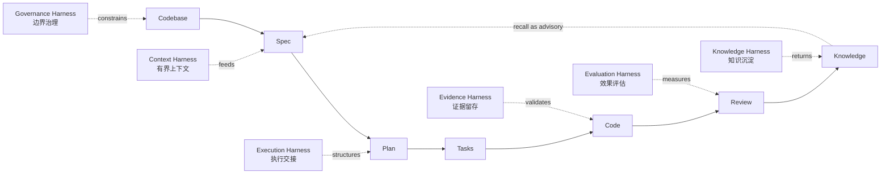
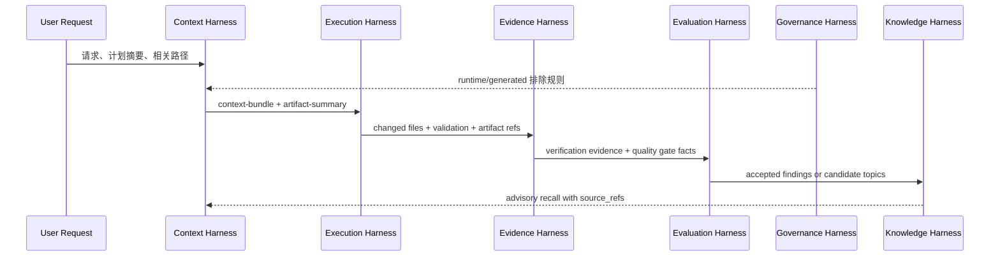

本页位于「深入解析 / 核心设计」中的第三篇，解释 spec-first 如何把 AI coding 从一次性提示词使用，组织为 **Context、Execution、Evidence、Evaluation、Governance、Knowledge** 六个相互制约的工程层；它只讨论六层架构本身，不展开 CLI 调度、初始化生成、具体工作流入口或质量门禁细节。Sources: [结构化项目角色契约.md](docs/10-prompt/结构化项目角色契约.md#L42-L60), [ai-coding-harness.md](docs/contracts/ai-coding-harness.md#L15-L24)

## 架构假设

第一性原理是：AI coding 的不稳定性不能只靠更长 prompt 解决，而要靠 **有界上下文、可跟踪执行、可追溯证据、可复盘评估、明确治理边界、可失效知识沉淀** 共同约束。项目角色契约把核心链路定义为 `Codebase -> Spec -> Plan -> Tasks -> Code -> Review -> Knowledge`，并把六层分别映射到 Context Harness、Execution Harness、Evidence Harness、Evaluation Harness、Governance Harness 与 Knowledge Harness。Sources: [结构化项目角色契约.md](docs/10-prompt/结构化项目角色契约.md#L42-L60), [ai-coding-harness.md](docs/contracts/ai-coding-harness.md#L7-L24)

上图应按横切层理解，而不是按中心化状态机理解：六层不是一个单独模块，也不是强制所有 workflow 走同一固定路径；合同明确要求 contract 变更服务核心链路，保持 scripts 准备确定性事实、LLM 判断语义意义，并避免让 external tools 拥有 scope、finding、root-cause、mutation 或 workflow state 权威。Sources: [ai-coding-harness.md](docs/contracts/ai-coding-harness.md#L26-L33), [结构化项目角色契约.md](docs/10-prompt/结构化项目角色契约.md#L64-L76)

## 六层总览

| 层 | 解决的问题 | 主要机制 | 明确边界 |
| --- | --- | --- | --- |
| Context | 给 AI 正确上下文，而不是无限上下文 | `context-governance.md`、`context-bundle.v1`、`artifact-summary.v1` | 不广播 full repo、generated runtime、raw MCP dump 或长 artifact |
| Execution | 让执行在 plan/task/work/review 间可交接 | `spec-work` 执行契约、run artifact schema、task/plan scope | 不把 workflow 变成中心化状态机 |
| Evidence | 让结论可质疑、可验证 | source reads、tests/logs、verification evidence、provenance | external-tool evidence 在确认前只是 advisory |
| Evaluation | 记录系统是否真的变好 | quality gate result、feedback topics、self-reflection loop | 不用脚本决定语义质量或升级优先级 |
| Governance | 约束 source/runtime/provider/mutation 边界 | source-runtime boundary、context exclusion、dual-host/session contracts | 不手改 generated runtime mirror 作为 source fix |
| Knowledge | 把已验证经验带回下一次 | `docs/solutions/`、spec-compound schema、recall trust boundary | recall 是候选线索，必须回源确认 |

这张表的关键不是“六个目录”，而是六类责任边界：Context 管输入，Execution 管过程骨架，Evidence 管可验证依据，Evaluation 管改进反馈，Governance 管权限与真相源，Knowledge 管经验是否可复用、可回源、可失效。Sources: [ai-coding-harness.md](docs/contracts/ai-coding-harness.md#L15-L24), [knowledge-harness.md](docs/contracts/knowledge/knowledge-harness.md#L18-L30)

## Context Harness：有界输入层

Context 层的目标是让 worker、reviewer、researcher 获得 **最小充分 context**，而不是把完整仓库、完整文档、完整 artifact 或 generated runtime mirror 全量塞入 prompt；`context-bundle.v1` 使用 related paths、artifact summaries、evidence paths、full-read triggers、excluded context、budget 与 degraded 标记组成可审查 envelope。Sources: [context-bundle.md](docs/contracts/context-bundle.md#L1-L15), [context-bundle.md](docs/contracts/context-bundle.md#L43-L99)

Context Governance 进一步规定普通上下文默认排除 `.spec-first/audits/**`、`.spec-first/governance/**`、`.claude/**`、`.codex/**`、`.agents/skills/**`，但仍允许读取 checked-in source truth，例如 `skills/`、`agents/`、`templates/`、`src/cli/`、`docs/contracts/`、`AGENTS.md`、`CLAUDE.md` 与任务相关源码测试。Sources: [context-governance.md](docs/contracts/context-governance.md#L22-L35), [context-governance.md](docs/contracts/context-governance.md#L97-L108)

Context 层采用 **summary-first**：先读 summary、manifest、status、readiness facts 或用户指定路径，需要更深证据时才按具体 artifact path 精确读取；高频 workflow 还要求稳定 instruction prefix 与动态 suffix 分离，避免把 git status、测试输出、MCP dump、raw log 等易变内容混入稳定提示层。Sources: [context-governance.md](docs/contracts/context-governance.md#L50-L61), [context-governance.md](docs/contracts/context-governance.md#L71-L80)

## Execution Harness：执行交接层

Execution 层把“开始做事”拆成可交接的 scope、task identity、repo scope 与 handoff evidence，但项目合同明确它不能变成状态机；目录级 harness map 将该层主要锚定到 `workflows/spec-id-traceability.md` 与 `workflows/spec-work-run-artifact.schema.json`。Sources: [ai-coding-harness.md](docs/contracts/ai-coding-harness.md#L17-L24), [ai-coding-harness.md](docs/contracts/ai-coding-harness.md#L26-L33)

`spec-work` 的执行契约体现这一点：它要求先判断输入是 plan、task pack 还是 bare prompt，再验证 repo、branch、task-pack 边界，构建任务列表，分步实现，运行聚焦验证，执行质量或 review pass，最后返回完成契约；当 WHAT/HOW、目标仓库或 task pack 新鲜度不满足时，必须停止并给出 compact handoff，而不是静默扩范围。Sources: [SKILL.md](skills/spec-work/SKILL.md#L15-L47), [SKILL.md](skills/spec-work/SKILL.md#L136-L183)

执行层的 run artifact 是写侧证据合同：schema 声明 producer 可用并已 workflow integrated，运行路径为 `.spec-first/workflows/spec-work/<workspace-slug>/<run-id>/run.json`，同一 workspace/run-id 不覆盖，只有 durable evidence trigger 调用 producer 时才把 `workflow_integrated` 设为 true。Sources: [spec-work-run-artifact.schema.json](docs/contracts/workflows/spec-work-run-artifact.schema.json#L1-L10), [spec-work-run-artifact-contract.test.js](tests/unit/spec-work-run-artifact-contract.test.js#L124-L165)

## Evidence Harness：证据留存层

Evidence 层的直接证据通道包括 source-read、verification、handoff-summary、external-tool 与 capability-candidate；其中 source reads 是确认路径，tests、syntax checks、CLI output、logs 与 deterministic validators 提供 exit code 和事实，handoff summary 只传 compact evidence 与 limitations，external-tool 输出在被 source/test/log evidence 确认前不可信。Sources: [ai-coding-harness.md](docs/contracts/ai-coding-harness.md#L35-L46), [source-runtime-customization-boundary.md](docs/contracts/source-runtime-customization-boundary.md#L57-L80)

`spec-work-run-artifact` schema 把证据分为 `script_confirmed`、`llm_asserted` 与 `provider_untrusted`：脚本确认 validation、changed files、artifact refs、raw log ref、resume evidence；LLM 提供 summary、read artifacts、key decisions、deferred follow-up、next action；provider readiness 只作为未受信事实进入 artifact。Sources: [spec-work-run-artifact.schema.json](docs/contracts/workflows/spec-work-run-artifact.schema.json#L143-L193), [spec-work-run-artifact-producer.test.js](tests/unit/spec-work-run-artifact-producer.test.js#L37-L88)

Verification evidence schema 则提供更窄的验证记录结构：每个 evidence item 必须带 `evidence_ref`、`verifier`、`gate_ids`、`evidence_type`、`status`、`artifact_path`、`captured_at` 与 `stage`，其 stage 枚举限定为 plan、work、review、verify 或 unknown。Sources: [verification-evidence.schema.json](docs/contracts/verifiers/verification-evidence.schema.json#L1-L49)

## Evaluation Harness：效果评估层

Evaluation 层不是让脚本替代架构判断，而是把“系统是否真的变好”变成可复盘输入；目录级合同把它连接到 quality gates、verification evidence 与 self-reflection capability upgrade，并强调评估应使用聚焦检查、advisory quality gate 和 decision-linked metrics，而不是只看使用次数。Sources: [ai-coding-harness.md](docs/contracts/ai-coding-harness.md#L21-L24), [ai-coding-harness.md](docs/contracts/ai-coding-harness.md#L47-L56)

Self-reflection 合同定义了稳定循环：自我审视、能力缺口、能力升级决策、最佳实践吸收、plan handoff、review 验证、compound 沉淀、下一轮自我审视；同时禁止新增自动 rewrite、自动升级、让脚本决定 capability gap、CUD status、priority 或 semantic effectiveness。Sources: [self-reflection-capability-upgrade.md](docs/contracts/workflows/self-reflection-capability-upgrade.md#L1-L24), [self-reflection-capability-upgrade.md](docs/contracts/workflows/self-reflection-capability-upgrade.md#L26-L35)

质量反馈实现保持被动：`buildQualityFeedbackTopics` 只把失败的 gate check 归一化为 candidate topics，记录 gate id、passed 状态、artifact path 与失败 check 摘要；测试同时断言成功 gate 保持空 candidate list，避免凭空发明 workflow state。Sources: [quality-feedback.js](src/verification/quality-feedback.js#L7-L55), [quality-feedback.test.js](tests/unit/quality-feedback.test.js#L18-L89)

## Governance Harness：边界治理层

Governance 层负责 source/runtime/provider/customization 边界：行为变更应修改 checked-in source assets，例如 `skills/`、`agents/`、`templates/`、`src/cli/`、`src/cli/contracts/**`、`docs/`、README、`AGENTS.md`、`CLAUDE.md` 与 `CHANGELOG.md`；`.claude/`、`.codex/`、`.agents/skills/` 是 generated runtime mirrors，不能手改作为 source fix。Sources: [source-runtime-customization-boundary.md](docs/contracts/source-runtime-customization-boundary.md#L7-L42), [结构化项目角色契约.md](docs/10-prompt/结构化项目角色契约.md#L135-L152)

治理层同时划分 Scripts/Tools 与 LLM/Agents 的责任：脚本和工具准备文件发现、git 状态、schema 校验、hash、readiness、drift、machine-readable facts、reason_code、exit code；LLM 和 agents 负责需求理解、架构取舍、任务拆分、影响面解释、review 判断、风险解释、fallback 决策和 next action 建议。Sources: [结构化项目角色契约.md](docs/10-prompt/结构化项目角色契约.md#L80-L99), [source-runtime-customization-boundary.md](docs/contracts/source-runtime-customization-boundary.md#L57-L80)

硬 gate 的落点被限制为五类：mutation gate、verification gate、source/runtime gate、handoff gate、knowledge promotion gate；合同特别强调 **gate the exits, not the thinking**，即硬卡出口和副作用，不硬卡语义推理路径。Sources: [结构化项目角色契约.md](docs/10-prompt/结构化项目角色契约.md#L99-L116)

## Knowledge Harness：知识沉淀层

Knowledge 层把核心链路最后一环做成 file-first、summary-first、recall-as-advisory 的知识闭环：目标是让经验可发现、可回源、可失效，同时不引入向量库、SQLite 或外部 memory 平台作为默认 source truth，也不把 `docs/solutions/` recall 当作 confirmed truth。Sources: [knowledge-harness.md](docs/contracts/knowledge/knowledge-harness.md#L1-L17), [knowledge-harness.md](docs/contracts/knowledge/knowledge-harness.md#L31-L47)

知识层内部还有自己的六层 map：L1 Project Context、L2 Context Budget、L3 Code Intelligence、L4 Memory / Prior Decisions、L5 Skill / Tool Capability、L6 Evidence / Promotion；当前合同明确 L2/L4/L6 是 v1.15 completion gate，L5 是 advisory follow-up，L1 已覆盖，L3 延后到 v1.16 capability-aware 协同。Sources: [knowledge-harness.md](docs/contracts/knowledge/knowledge-harness.md#L18-L30), [knowledge-harness-contracts.test.js](tests/unit/knowledge-harness-contracts.test.js#L19-L46)

Recall trust boundary 是知识层的核心防线：`docs/solutions/**` 命中只产生 advisory candidate，consumer 必须回到 learning frontmatter 的 `source_refs` 或 evidence summary 的 `source_reads_required`，用当前 source/test/doc、确定性校验或人工 reviewer 确认后，才能把结论升为 confirmed。Sources: [knowledge-harness.md](docs/contracts/knowledge/knowledge-harness.md#L48-L63), [knowledge-harness-contracts.test.js](tests/unit/knowledge-harness-contracts.test.js#L105-L158)

## 层间交互模式

六层的交互模式可以概括为：治理层先约束什么能作为上下文和真相源，Context 层把最小充分输入交给 Execution 层，Execution 层产出 diff、验证和 artifact refs，Evidence 层把它们分级为 script-confirmed、LLM-asserted、provider-untrusted，Evaluation 层把失败检查转成可复盘 topic，Knowledge 层只沉淀已验证且可失效的经验，再以 advisory recall 形式回到下一轮上下文。Sources: [context-governance.md](docs/contracts/context-governance.md#L97-L108), [spec-work-run-artifact.schema.json](docs/contracts/workflows/spec-work-run-artifact.schema.json#L150-L193), [quality-feedback.js](src/verification/quality-feedback.js#L24-L50), [knowledge-harness.md](docs/contracts/knowledge/knowledge-harness.md#L56-L63)

## 反模式

| 反模式 | 破坏的层 | 为什么危险 |
| --- | --- | --- |
| 把 `.claude/`、`.codex/` 当 source 改 | Governance | 破坏 source/runtime 真相源 |
| 把 raw MCP dump 广播给 reviewer | Context / Evidence | 扩大噪声、泄露边界、让未确认数据影响判断 |
| 用脚本决定架构取舍或 finding 成立 | Governance / Evaluation | 混淆 deterministic facts 与 semantic judgment |
| 把 `docs/solutions/` 命中直接当结论 | Knowledge / Evidence | 跳过 source_refs 与当前 source/test/doc 确认 |
| 为所有 workflow 画死状态图 | Execution | 把轻合同误建成中心化流程引擎 |

这些反模式共同违反同一条原则：**确定性边界可以硬，语义判断必须轻**。spec-first 的六层架构不是为了消灭 LLM 判断，而是为了让 LLM 的判断建立在可追踪输入、可验证证据和可治理副作用之上。Sources: [结构化项目角色契约.md](docs/10-prompt/结构化项目角色契约.md#L64-L76), [ai-coding-harness.md](docs/contracts/ai-coding-harness.md#L26-L33), [source-runtime-customization-boundary.md](docs/contracts/source-runtime-customization-boundary.md#L81-L94)

## 阅读路径

如果你想继续理解六层架构如何落到具体责任分界，下一篇建议读 [脚本事实与 LLM 语义判断的责任分界](14-jiao-ben-shi-shi-yu-llm-yu-yi-pan-duan-de-ze-ren-fen-jie)；如果你想看工作流如何消费这些层，继续读 [需求发散、PRD 与计划编写工作流](20-xu-qiu-fa-san-prd-yu-ji-hua-bian-xie-gong-zuo-liu) 与 [任务拆分、执行、调试与优化工作流](21-ren-wu-chai-fen-zhi-xing-diao-shi-yu-you-hua-gong-zuo-liu)；如果你关注契约与质量闭环，再读 [Workflow Contract、Artifact Summary 与 Handoff 协议](25-workflow-contract-artifact-summary-yu-handoff-xie-yi)、[Verification Profile、Schema 校验与质量反馈](26-verification-profile-schema-xiao-yan-yu-zhi-liang-fan-kui) 和 [Context Governance 与 Summary-First 证据传递](27-context-governance-yu-summary-first-zheng-ju-chuan-di)。Sources: [ai-coding-harness.md](docs/contracts/ai-coding-harness.md#L1-L13), [context-governance.md](docs/contracts/context-governance.md#L71-L80), [artifact-summary.md](docs/contracts/artifact-summary.md#L1-L13)