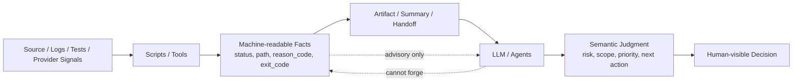

本页的架构假设是：spec-first 不是让脚本替代模型判断，也不是让 LLM 假装执行确定性校验，而是把工程闭环拆成两类职责——**脚本产出可验证事实**，**LLM 基于事实做语义判断**。这个边界在项目级治理中被表述为 “Scripts prepare, LLM decides”，并被进一步约束为：脚本负责文件发现、路径解析、git 状态、schema 校验、hash、readiness、reason_code、artifact path、raw log、exit code；LLM/agents 负责需求理解、架构取舍、任务拆分、影响面解释、review 判断、风险解释、fallback 决策与 next action。Sources: [AGENTS.md](AGENTS.md#L34-L39), [AGENTS.md](AGENTS.md#L50-L65)

这页位于深入解析的核心设计部分，前一页建议先读 [上下文、执行、证据、评估、治理与知识六层架构](13-shang-xia-wen-zhi-xing-zheng-ju-ping-gu-zhi-li-yu-zhi-shi-liu-ceng-jia-gou)，后一页可继续读 [CLI 命令调度与包入口模型](15-cli-ming-ling-diao-du-yu-bao-ru-kou-mo-xing)。本页只解释 script facts 与 LLM semantic judgment 的责任分界，不展开 CLI 调度、初始化计划、source/runtime 生成流程或完整 workflow 系统。Sources: [docs/10-prompt/结构化项目角色契约.md](docs/10-prompt/结构化项目角色契约.md#L64-L76), [docs/10-prompt/结构化项目角色契约.md](docs/10-prompt/结构化项目角色契约.md#L80-L86)

## 核心判断：强运行边界，轻语义合同

spec-first 的第一原则不是“全部自动化”，而是区分**可机械判定的不变量**与**需要语义判断的问题**。角色契约明确把 mutation、verification、source/runtime、handoff、knowledge promotion 放入可硬卡的出口，把需求是否明确、计划是否合理、任务拆分粒度、review finding 是否成立、root cause 是否被证据支持、是否需要更多上下文、是否需要 human owner 介入留给 LLM 或 orchestrator。Sources: [docs/10-prompt/结构化项目角色契约.md](docs/10-prompt/结构化项目角色契约.md#L99-L115)

这个分界的实际含义是：脚本可以拒绝不安全路径、缺失证据、schema 不匹配、runtime artifact 越界、验证摘要不一致；但脚本不应该判断“架构是否优雅”“这个 review finding 是否真正重要”“下一步是否应该重构还是降级”。相反，LLM 可以解释风险、选择修复路径、决定是否需要人工介入；但不能声称测试已运行、不能编造命令输出、不能把 advisory provider 输出升级为 confirmed truth。Sources: [AGENTS.md](AGENTS.md#L52-L65), [docs/10-prompt/结构化项目角色契约.md](docs/10-prompt/结构化项目角色契约.md#L72-L76)

上图的关键不是线性流程，而是**权限方向**：事实只能从可验证输入经脚本进入 artifact；语义判断只能消费这些事实并显式说明局限，不能反向伪造事实。`artifact-summary.v1` 也采用同样边界：它帮助下游先消费摘要与 evidence paths，但明确不是完整报告、不是 underlying artifact 的 source-of-truth 替代品、也不是 script-owned semantic conclusion。Sources: [docs/contracts/artifact-summary.md](docs/contracts/artifact-summary.md#L1-L20)

## 三类信息的责任矩阵

| 信息类型 | 典型字段或产物 | 责任方 | 可做什么 | 不可做什么 |
|---|---|---|---|---|
| 确定性事实 | `status`、`reason_code`、`artifact_path`、`exit_code`、schema validation errors | Scripts / Tools | 读取、校验、拒绝、写入、汇总 | 做架构判断或业务优先级判断 |
| 语义断言 | `summary`、`key_decisions`、`deferred_follow_up`、`next_action` | LLM / Agents | 解释影响、选择路径、提出下一步 | 伪造测试、伪造源码读取、伪造 provider 可信度 |
| Advisory 输入 | provider readiness、external-tool evidence、compact evidence summary | Provider / Workflow handoff | 提供候选线索、说明限制、触发 fallback | 单独形成高置信 finding、root cause、merge/block 决策 |

这个矩阵可以从 `spec-work-run-artifact` 的 schema 直接看到：同一个 run artifact 同时要求 `script_confirmed`、`llm_asserted`、`provider_untrusted`，并把它们拆成独立字段。`script_confirmed` 包含 validation、changed files、artifact refs、raw log ref、resume evidence；`llm_asserted` 包含 summary、read artifacts、key decisions、deferred follow-up、next action；`provider_untrusted` 只记录 readiness status 与简短 summaries。Sources: [docs/contracts/workflows/spec-work-run-artifact.schema.json](docs/contracts/workflows/spec-work-run-artifact.schema.json#L13-L31), [docs/contracts/workflows/spec-work-run-artifact.schema.json](docs/contracts/workflows/spec-work-run-artifact.schema.json#L150-L242)

## 脚本事实：只确认可机械验证的边界

`spec-work-run-artifact` 的 producer 先解析输入、校验 payload、生成受控路径、检查输出 containment、校验 verification run summary 引用，然后用原子写入创建 `.spec-first/workflows/spec-work/<workspace>/<run-id>/run.json`；如果 artifact 已存在则返回 `artifact-already-exists`，成功时只输出 `status: written`、`reason_code: written`、`artifact_path`、schema version、producer availability、workflow integration 与 warnings。这里的脚本权力集中在“是否能安全写入一个结构化事实产物”，不包含对任务成败或架构质量的自由裁决。Sources: [src/cli/helpers/spec-work-run-artifact.js](src/cli/helpers/spec-work-run-artifact.js#L193-L273)

该 producer 的字段白名单也体现边界：payload 只允许 `schema_version`、`workflow`、`mode`、`producer`、`plan_path`、`plan_source`、`task_pack_path`、`source_refs`、`script_confirmed`、`llm_asserted`、`provider_untrusted`、`direct_evidence_used`、`retention`；脚本确认区只允许 validation、changed files、artifact refs、raw log ref、resume evidence；LLM 断言区只允许 summary、read artifacts、key decisions、deferred follow-up、next action。Sources: [src/cli/helpers/spec-work-run-artifact.js](src/cli/helpers/spec-work-run-artifact.js#L38-L80)

`schema-validator` 进一步说明脚本事实的性质：它支持 JSON Schema 的类型、枚举、const、required、properties、additionalProperties、组合条件、数组长度、字符串长度、pattern、数值边界等机械规则，并返回 path-level errors。它能证明“结构是否满足约束”，不能证明“设计是否合理”。Sources: [src/contracts/schema-validator.js](src/contracts/schema-validator.js#L47-L198)

## LLM 判断：在证据约束内做语义裁决

LLM 在这个架构中不是弱化角色，而是被放在更合适的位置：它负责解释事实之间的关系、识别影响面、判断风险优先级、决定 fallback 与 next action。角色契约把 LLM/Agents 的职责列为需求理解、架构取舍、任务拆分、影响面解释、review 判断、风险解释、fallback 决策、next action 建议，同时禁止伪造确定性校验和编造命令结果。Sources: [docs/10-prompt/结构化项目角色契约.md](docs/10-prompt/结构化项目角色契约.md#L80-L86)

`spec-work-run-artifact` schema 对 `llm_asserted` 的约束也很精确：它允许 LLM 记录 summary、read artifacts、key decisions、deferred follow-up、next action，并限制文本长度与路径格式；但这些字段被放在 `llm_asserted` 下，而不是混入 `script_confirmed`。这让下游可以消费 LLM 的判断，同时保留“这是模型断言，不是脚本确认”的类型信息。Sources: [docs/contracts/workflows/spec-work-run-artifact.schema.json](docs/contracts/workflows/spec-work-run-artifact.schema.json#L205-L229)

## Advisory 输入：可提示，不可裁决

Provider readiness contract 把 `provider-readiness.v2` 定义为 mechanical provider readiness 与 setup-owned runtime tooling metadata，并明确声明它是 advisory setup fact，不是 workflow truth，也不是 confirmed context。契约还禁止把 `advisory`、`evidence_candidate`、`confirmed_context` 这类语义信任字段写进 provider readiness；workflow 只有在 direct source、test、log、contract 或 user evidence 确认之后，才可以提升 provider 输出。Sources: [docs/contracts/provider-readiness.md](docs/contracts/provider-readiness.md#L1-L13)

Provider readiness 的 consumer 规则继续收紧这个边界：`readiness_status` 是进入 setup decision health 的唯一 readiness 字段，lifecycle 字段只是解释 setup 停在哪里；provider 自报 fresh 不被当作 deterministic freshness，必须映射为 unknown，除非 spec-first 有直接证据；artifact 存在也不足以证明 runtime 可用。Sources: [docs/contracts/provider-readiness.md](docs/contracts/provider-readiness.md#L14-L26)

实现层的 `provider-readiness-renderer.cjs` 也按这个模型输出：provider entry 包含 `readiness_status`、lifecycle、repo alignment、capabilities、limitations、`source_read_required: true`、fallback、next actions、native interfaces、first generation、steady state 和 usage note；默认 limitations 直接写明 provider readiness 是 advisory，fresh self-reports 在被 source/test/log evidence 确认前映射为 unknown。Sources: [skills/spec-mcp-setup/scripts/provider-readiness-renderer.cjs](skills/spec-mcp-setup/scripts/provider-readiness-renderer.cjs#L396-L435)

## Handoff：摘要优先，但仍需回源确认

`artifact-summary.v1` 的设计把跨 workflow 传递变成 summary-first：producer 汇总 goal、scope、non-goals、implementation units、validation、open questions、verdict、findings、residual status、evidence paths、exit code、reason_code、raw log paths 等；consumer 先读 summary，只有触发 full artifact read trigger 时才展开完整 artifact。Sources: [docs/contracts/artifact-summary.md](docs/contracts/artifact-summary.md#L55-L73)

这个 handoff 仍然保持责任边界：tool-heavy artifacts 汇总 exit code、reason_code、关键字段和 raw log paths，而不是嵌入 raw output；direct/session evidence summary 可以记录 source reads required、commands used、limitations、redaction status，但不得嵌入 raw external-tool output，也不得成为 finding 或 root cause 的 source of truth。Sources: [docs/contracts/artifact-summary.md](docs/contracts/artifact-summary.md#L55-L63)

## Review finding：语义结论必须锚定证据

`review-finding.v1` 不是让脚本自动生成最终 review 结论，而是提供一个 compact finding envelope，让 synthesis 消费 structured findings，并保留 evidence、confidence、owner、verification、changelog requirements。它明确不授权 agent 在没有 evidence 的情况下编造 findings。Sources: [docs/contracts/workflows/review-finding.md](docs/contracts/workflows/review-finding.md#L1-L18)

消费规则把“LLM 判断”与“证据边界”粘在一起：每个 actionable finding 至少需要一条带 path 或 command anchor 的 evidence entry；external-tool evidence 只是 supporting evidence，除非配对 direct file、diff、test、standard、requirement、contract 或 log evidence，否则不能单独形成 high-confidence finding、root-cause claim 或 merge/block decision。Sources: [docs/contracts/workflows/review-finding.md](docs/contracts/workflows/review-finding.md#L48-L56)

## Closeout：防止 LLM 伪完成

`honest-closeout.v1` 是 workflow closeout claims 的 structured verdict model，定位为 validator output，而不是第二份 durable closeout artifact。它要求 claims 带 claim type、asserted status、evidence refs、verdict、reason code，并把 validation、impact surface、review、knowledge promotion 分开处理。Sources: [docs/contracts/workflows/honest-closeout.md](docs/contracts/workflows/honest-closeout.md#L1-L10)

这个 validator 只检查 claim-to-evidence 的结构关系：validation claims 必须引用 verification run summary；空 evidence refs 是 unsupported；诚实报告 not-run、failed 或 degraded 的 validation 不会被验证为通过，而是使 closeout 降级；自然语言 claims 没有 structured claim objects 时只能得到 degraded。Sources: [docs/contracts/workflows/honest-closeout.md](docs/contracts/workflows/honest-closeout.md#L11-L21)

实现中，validation claim 会读取 run summary、解析 `verification-run-summary:` refs、检查 ref 是否存在、检查 evidence status 是否与 asserted status 一致；当 asserted status 是 passed 时，还会复用 aggregate run summary status，避免只引用通过子集而隐藏 not-run、failed 或 degraded check。Sources: [src/cli/helpers/honest-closeout.js](src/cli/helpers/honest-closeout.js#L188-L227)

对 impact surface、review、knowledge promotion，脚本只验证 evidence refs 是仓库内相对路径、未逃逸 containment、存在、不是 symlink、是真实文件，并对 knowledge promotion 要求 evidence 位于 `docs/solutions/**`。脚本在这里证明“证据引用是否合法且存在”，不证明“review 判断是否必然正确”。Sources: [src/cli/helpers/honest-closeout.js](src/cli/helpers/honest-closeout.js#L229-L320)

## 反模式与正确落点

| 反模式 | 为什么危险 | 正确落点 |
|---|---|---|
| 脚本根据关键词判定架构优劣 | 把语义判断伪装成确定性事实 | 脚本输出候选 signals，LLM 判断架构影响 |
| LLM 声称测试通过但没有 run summary | 伪造确定性校验 | closeout claim 引用 verification evidence |
| Provider 自报 fresh 后直接形成 finding | advisory 被升级为 confirmed truth | direct source/test/log/contract 复核后再判断 |
| Summary 替代 full artifact source-of-truth | 丢失追踪与上下文边界 | summary-first，trigger 命中后读 full artifact |
| External tool evidence 单独阻断合并 | 辅助证据越权 | 配对 direct evidence 后由 reviewer/orchestrator 判断 |

这些反模式都指向同一个根因：把**事实生产权**和**语义裁决权**混在一起。项目级治理明确要求可信证据优先于自动化便利、清晰边界优先于功能完整、可验证事实优先于模型猜测，并禁止 advisory facts 被当作 confirmed truth。Sources: [AGENTS.md](AGENTS.md#L46-L65), [docs/10-prompt/结构化项目角色契约.md](docs/10-prompt/结构化项目角色契约.md#L72-L76)

## 读代码时的识别方法

识别脚本事实层时，优先寻找字段白名单、schema validation、path containment、atomic write、exit code、reason_code、artifact path、raw log path、readiness status、verification summary 读取与聚合。`spec-work-run-artifact` producer、`honest-closeout` validator、`schema-validator` 都属于这类实现：它们的判断标准可以被重复执行和复现。Sources: [src/cli/helpers/spec-work-run-artifact.js](src/cli/helpers/spec-work-run-artifact.js#L193-L273), [src/cli/helpers/honest-closeout.js](src/cli/helpers/honest-closeout.js#L188-L320), [src/contracts/schema-validator.js](src/contracts/schema-validator.js#L47-L198)

识别 LLM 判断层时，寻找 summary、key decisions、risk explanation、fallback decision、next action、review finding confidence、residual status 等字段。它们可以被 schema 限制形状和长度，可以被 evidence 要求约束，但最终含义仍由 LLM/agent/orchestrator 在上下文中解释。Sources: [docs/contracts/workflows/spec-work-run-artifact.schema.json](docs/contracts/workflows/spec-work-run-artifact.schema.json#L205-L229), [docs/contracts/workflows/review-finding.md](docs/contracts/workflows/review-finding.md#L19-L56)

识别 advisory 层时，注意 provider readiness、external-tool evidence、compact evidence summary、quality feedback candidate topics 等对象。`quality-feedback` 从 AI Dev Quality Gate failed checks 构造 candidate topics，保留 artifact paths 和 tags，但它输出的是 passive quality feedback topics，不是自动修复任务或最终质量结论。Sources: [src/verification/quality-feedback.js](src/verification/quality-feedback.js#L24-L50)

## 结论：边界不是降低自动化，而是提升可信度

spec-first 的责任分界可以压缩成一句话：**脚本负责把世界整理成可验证事实，LLM 负责在事实边界内做工程判断**。这让 workflow 同时获得两种能力：确定性层能防止路径逃逸、schema 漂移、伪验证、runtime 误用；语义层能保留架构取舍、风险解释、任务拆分、review synthesis 与下一步决策的灵活性。Sources: [docs/10-prompt/结构化项目角色契约.md](docs/10-prompt/结构化项目角色契约.md#L64-L76), [docs/10-prompt/结构化项目角色契约.md](docs/10-prompt/结构化项目角色契约.md#L99-L115)

继续阅读时，建议先进入 [CLI 命令调度与包入口模型](15-cli-ming-ling-diao-du-yu-bao-ru-kou-mo-xing) 理解这些边界如何被命令入口承载，再读 [Workflow Contract、Artifact Summary 与 Handoff 协议](25-workflow-contract-artifact-summary-yu-handoff-xie-yi) 理解跨 workflow 传递如何保持 summary-first 与 evidence-first。Sources: [docs/contracts/artifact-summary.md](docs/contracts/artifact-summary.md#L1-L20), [docs/contracts/workflows/spec-work-run-artifact.schema.json](docs/contracts/workflows/spec-work-run-artifact.schema.json#L13-L31)