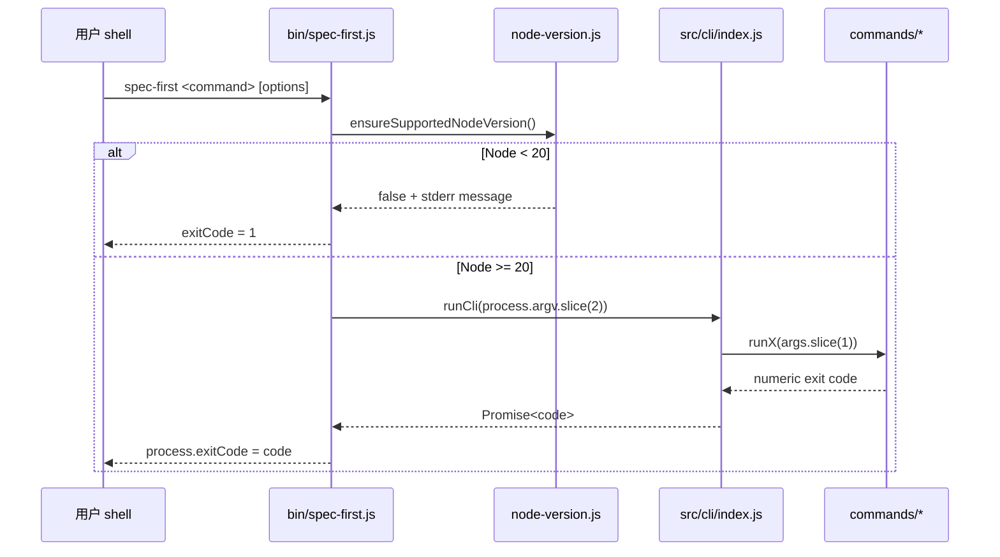
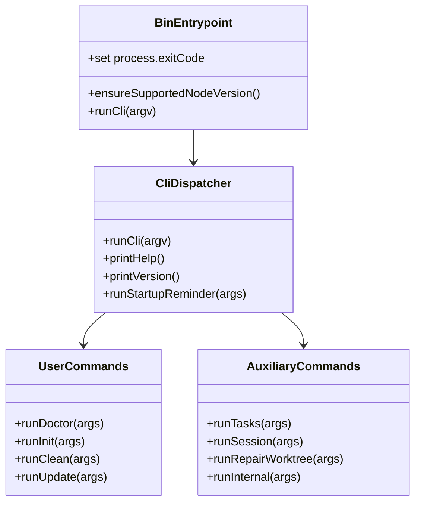

本页解释 `spec-first` 的 **包级 CLI 如何从 npm 入口进入 Node 进程、完成版本门禁、分派到命令模块，并与初始化后由 Claude Code / Codex 宿主提供的工作流入口保持边界**；它只覆盖包入口与命令调度，不展开初始化写入、Runtime Mirrors 生成或双宿主命名空间治理，这些主题分别属于 [初始化计划、受管状态与原子写入机制](16-chu-shi-hua-ji-hua-shou-guan-zhuang-tai-yu-yuan-zi-xie-ru-ji-zhi)、[Source Assets 到宿主 Runtime Mirrors 的生成流程](17-source-assets-dao-su-zhu-runtime-mirrors-de-sheng-cheng-liu-cheng) 与 [双宿主治理与命令命名空间投递规则](19-shuang-su-zhu-zhi-li-yu-ming-ling-ming-ming-kong-jian-tou-di-gui-ze)。Sources: [package.json](package.json#L5-L14), [bin/spec-first.js](bin/spec-first.js#L1-L23), [src/cli/index.js](src/cli/index.js#L151-L207)

## 架构假设与验证结论

从第一性原理看，CLI 入口模型必须回答三个问题：**包管理器如何找到可执行文件、可执行文件如何安全进入业务调度、调度层如何区分 package CLI 子命令与宿主 workflow 入口**。代码验证显示，`package.json` 通过 `bin.spec-first` 指向 `bin/spec-first.js`，包类型为 CommonJS，并通过 `exports` 暴露根入口与 `init-plan` 子模块；真正的命令分派集中在 `src/cli/index.js` 的 `runCli(argv)`。Sources: [package.json](package.json#L5-L14), [bin/spec-first.js](bin/spec-first.js#L12-L22), [src/cli/index.js](src/cli/index.js#L19-L80)

```mermaid
flowchart TD
  A[npm / npx / 全局 shell: spec-first] --> B[package.json bin 映射]
  B --> C[bin/spec-first.js]
  C --> D[Node 20+ 版本门禁]
  D --> E[src/cli/index.js runCli(argv)]
  E --> F{包级命令?}
  F -->|doctor/init/clean/update| G[用户可见维护命令]
  F -->|tasks/session/repair-worktree| H[辅助治理命令]
  F -->|startup-reminder/internal| I[隐藏或内部辅助入口]
  F -->|未知| J[返回 2 并打印 help]
  G --> K[init 后由宿主提供 /spec:* 或 $spec-*]
```

这张图强调一个核心边界：`spec-first` 这个 npm 可执行文件不是所有工作流的直接承载面，它主要负责安装、检查、更新、清理与辅助校验；`/spec:*` 和 `$spec-*` 是初始化后由宿主 CLI 提供的 workflow 入口，版本输出中也明确提示“这些是宿主 workflow 入口，不是 package CLI 子命令”。Sources: [src/cli/index.js](src/cli/index.js#L151-L183), [src/cli/index.js](src/cli/index.js#L185-L207), [tests/unit/cli-entry-contracts.test.js](tests/unit/cli-entry-contracts.test.js#L29-L66)

## 包入口表面

包入口由三个层次组成：`bin` 决定用户敲下 `spec-first` 时执行哪个文件，`exports` 决定包被 `require()` 时可见的模块边界，`files` 决定发布包中包含哪些运行所需资产。当前 manifest 将 CLI 入口绑定到 `bin/spec-first.js`，同时只显式导出根入口、`src/cli/init-plan` 与 `package.json`。Sources: [package.json](package.json#L5-L14), [package.json](package.json#L37-L79)

| 入口层 | 代码位置 | 对外语义 | 验证到的行为 |
|---|---|---|---|
| 可执行入口 | `bin.spec-first` | shell 命令 `spec-first` | 指向 `bin/spec-first.js` |
| 根模块导出 | `exports["."]` | 包根导入 | 指向同一个 bin 文件 |
| 计划模块导出 | `exports["./src/cli/init-plan"]` | 允许测试或消费者访问初始化计划模块 | 显式列入 exports |
| 发布文件集 | `files` | npm 包内容边界 | 包含 `bin/`、`src/`、`skills/`、`templates/` 与必要契约文档 |

Sources: [package.json](package.json#L6-L14), [package.json](package.json#L37-L79)

安装阶段本身被设计为低副作用：测试契约确认 manifest 不声明 `preinstall`、`install`、`postinstall`、`prepare` 等生命周期脚本，因此安装包不会自动写入项目运行时资产；运行时资产刷新由用户显式执行 `spec-first init` 或 `spec-first update` 后的刷新流程触发。Sources: [tests/unit/package-install-contracts.test.js](tests/unit/package-install-contracts.test.js#L114-L123), [src/cli/commands/update.js](src/cli/commands/update.js#L64-L91)

## 启动门禁与错误收束

`bin/spec-first.js` 是一个非常薄的启动壳：它先加载 `../src/cli/node-version`，调用 `ensureSupportedNodeVersion()`，不满足时设置退出码 `1` 并停止；满足时截取 `process.argv.slice(2)`，再加载 `../src/cli` 并调用 `runCli(argv)`，最终把返回码写入 `process.exitCode`。Sources: [bin/spec-first.js](bin/spec-first.js#L1-L23), [src/cli/node-version.js](src/cli/node-version.js#L3-L41)

Node 版本门禁是进入调度层前的硬约束：最低主版本为 20，`isSupportedNodeVersion()` 只接受可解析且大于等于 20 的版本，错误信息会提示安装 Node.js 20 或更新版本；测试还验证 `bin` 中版本检查的 `require()` 顺序早于 CLI 主模块加载。Sources: [src/cli/node-version.js](src/cli/node-version.js#L3-L41), [tests/unit/package-install-contracts.test.js](tests/unit/package-install-contracts.test.js#L235-L245), [package.json](package.json#L107-L109)



这个启动模型的结果是：**启动壳负责环境前置条件和异常兜底，调度层负责命令识别，命令模块负责具体业务退出码**。`runCli()` 抛出的异常会在 `bin` 的 `.catch()` 中转为 stderr 文本与退出码 `1`，而未知命令由调度层返回 `2`。Sources: [bin/spec-first.js](bin/spec-first.js#L14-L22), [src/cli/index.js](src/cli/index.js#L76-L80)

## 调度器的命令面

`runCli(argv)` 的调度规则是线性的、显式的：无命令或 `--help/-h` 打印帮助并返回 `0`，`--version/-v` 打印版本并返回 `0`，随后按固定字符串匹配子命令；`doctor`、`init`、`clean`、`update` 会先触发版本提醒逻辑，再进入各自命令模块。Sources: [src/cli/index.js](src/cli/index.js#L19-L80), [src/cli/index.js](src/cli/index.js#L151-L183)

| 命令 | 是否出现在 help | 分派目标 | 主要职责边界 |
|---|---:|---|---|
| `doctor` | 是 | `runDoctor()` | 检查环境、manifest 与受管运行时资产 |
| `init` | 是 | `runInit()` | 安装 workflows、skills、agents 与开发者 profile |
| `clean` | 是 | `runClean()` | 移除当前项目中 spec-first 受管资产 |
| `update` | 是 | `runUpdate()` | 升级 npm CLI 包并刷新 runtime assets |
| `tasks` | 是 | `runTasks()` | 派生任务包 hash 与校验 |
| `session` | 是 | `runSession()` | 多 actor session advisory 的注册、心跳、列表、注销 |
| `repair-worktree` | 是 | `runRepairWorktree()` | 预览或执行工作区指针修复脚本 |
| `startup-reminder` | 否 | `runStartupReminder()` | 针对 Claude/Codex 的启动版本提醒 |
| `internal` | 否 | `runInternal()` | 内部 helper 子命令聚合入口 |

Sources: [src/cli/index.js](src/cli/index.js#L33-L74), [src/cli/index.js](src/cli/index.js#L151-L183)

可见命令与隐藏命令的差异是文档化边界而不是能力缺失：帮助文本只展示面向用户的 package CLI 命令，并额外说明“Installed workflow entrypoints are provided by the host after `spec-first init`”；但调度器仍保留 `startup-reminder` 与 `internal`，用于启动提醒和内部脚本能力聚合。Sources: [src/cli/index.js](src/cli/index.js#L151-L183), [src/cli/index.js](src/cli/index.js#L82-L149), [src/cli/commands/internal.js](src/cli/commands/internal.js#L14-L69)

## 命令模块交互模型

命令模块遵循统一的“解析参数 → help/错误短路 → 执行业务 → 返回数字退出码”结构，但业务边界不同：`doctor` 检测平台与资产状态，`init` 解析交互或非交互初始化参数，`clean` 要求明确选择 Claude 或 Codex，`update` 执行全局 npm 升级后再刷新 runtime。Sources: [src/cli/commands/doctor.js](src/cli/commands/doctor.js#L28-L40), [src/cli/commands/init.js](src/cli/commands/init.js#L90-L120), [src/cli/commands/clean.js](src/cli/commands/clean.js#L25-L55), [src/cli/commands/update.js](src/cli/commands/update.js#L25-L91)



辅助命令也采用相同调度模式：`tasks` 有 `hash` 与 `validate` 子命令，`session` 有 `register`、`heartbeat`、`unregister`、`list`，`repair-worktree` 根据平台选择 PowerShell 或 Bash 脚本，`internal` 聚合上下文包、场景指纹、密钥 deny、verification profile 等内部 helper。Sources: [src/cli/commands/tasks.js](src/cli/commands/tasks.js#L9-L33), [src/cli/commands/session.js](src/cli/commands/session.js#L18-L43), [src/cli/commands/repair-worktree.js](src/cli/commands/repair-worktree.js#L6-L41), [src/cli/commands/internal.js](src/cli/commands/internal.js#L14-L69)

## Package CLI 与宿主 Workflow 的分界

最容易混淆的点是：`spec-first init` 安装或刷新宿主侧入口，但 `spec-first` 包级 CLI 本身并不直接承载 `/spec:plan` 或 `$spec-plan`。版本输出把使用路径拆成五步：先 `doctor`，再 `init`，再看 package CLI help，然后重启宿主 CLI，最后在对话中使用当前宿主对应入口；其中明确标注 `/spec:plan` 与 `$spec-plan` 是宿主 workflow 入口。Sources: [src/cli/index.js](src/cli/index.js#L185-L207)

| 使用场景 | 正确入口 | 入口归属 | 不应混淆为 |
|---|---|---|---|
| 检查安装与资产状态 | `spec-first doctor` | npm package CLI | `/spec:doctor` 或 `$spec-doctor` |
| 初始化项目运行时资产 | `spec-first init` | npm package CLI | 直接手动复制 runtime mirrors |
| 触发计划类工作流 | `/spec:plan` 或 `$spec-plan` | 宿主 CLI workflow | `spec-first plan` |
| 查看包级命令 | `spec-first --help` | npm package CLI | 宿主命令列表 |
| 查看版本与引导 | `spec-first --version` | npm package CLI | workflow 运行结果 |

Sources: [src/cli/index.js](src/cli/index.js#L151-L207), [tests/unit/cli-entry-contracts.test.js](tests/unit/cli-entry-contracts.test.js#L29-L66)

这个边界也反映在未知命令处理上：如果用户运行不存在的 `spec-first plan`，调度器不会尝试猜测宿主入口，而是打印 `Unknown command`、提示运行 `spec-first --help`，并返回退出码 `2`。Sources: [src/cli/index.js](src/cli/index.js#L76-L80)

## 退出码与契约化验证

从调用者角度看，包级 CLI 的退出码语义可归纳为：`0` 表示 help、version 或命令成功；`1` 表示运行时前置条件失败、业务失败或子进程失败；`2` 表示用法错误或未知命令；`doctor --json` 在发现错误时可返回 `3`。这些退出码不是集中枚举，而是分散在入口壳、调度器与命令模块中。Sources: [bin/spec-first.js](bin/spec-first.js#L7-L22), [src/cli/index.js](src/cli/index.js#L23-L80), [src/cli/commands/doctor.js](src/cli/commands/doctor.js#L37-L40), [src/cli/commands/doctor.js](src/cli/commands/doctor.js#L65-L100)

测试层把入口行为契约化：`cli-entry-contracts.test.js` 通过真实 `bin/spec-first.js` 启动进程，验证 help 中包含 `doctor`、`init`、`clean`、`update`、`tasks`、`session` 等命令，并验证版本输出包含当前包版本与 Claude Code / Codex 引导信息；安装契约测试则验证可执行脚本有 shebang、Node 20 门禁先于 CLI 主模块加载。Sources: [tests/unit/cli-entry-contracts.test.js](tests/unit/cli-entry-contracts.test.js#L12-L55), [tests/unit/package-install-contracts.test.js](tests/unit/package-install-contracts.test.js#L211-L245)

## 阅读路径

如果你接下来要理解 `init` 如何把包内资产写入项目，请读 [初始化计划、受管状态与原子写入机制](16-chu-shi-hua-ji-hua-shou-guan-zhuang-tai-yu-yuan-zi-xie-ru-ji-zhi)；如果你关心 `skills/` 与 `templates/` 如何成为 Claude/Codex 可见入口，请读 [Source Assets 到宿主 Runtime Mirrors 的生成流程](17-source-assets-dao-su-zhu-runtime-mirrors-de-sheng-cheng-liu-cheng)；如果你要新增命令或 Skill，则应继续读 [新增 Skill、Agent 与命令入口的接入规范](29-xin-zeng-skill-agent-yu-ming-ling-ru-kou-de-jie-ru-gui-fan)。Sources: [src/cli/index.js](src/cli/index.js#L151-L207), [package.json](package.json#L37-L79)