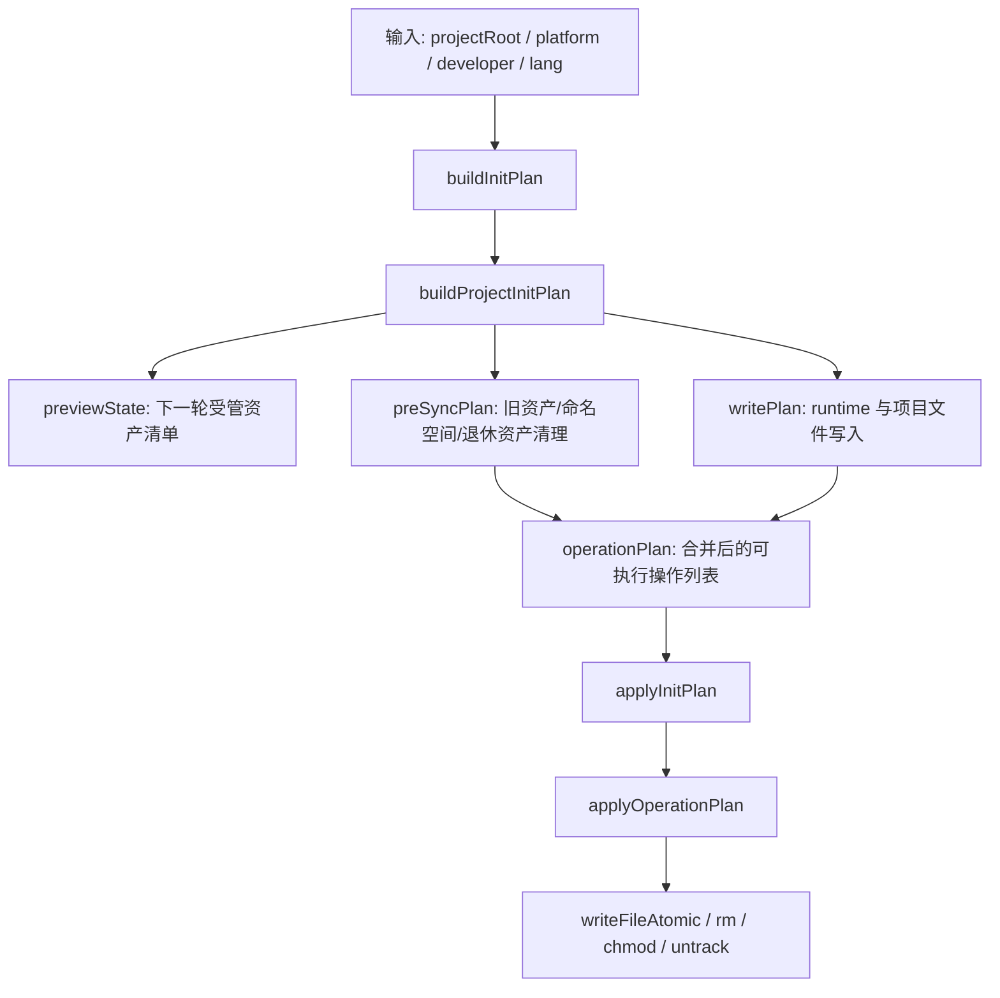
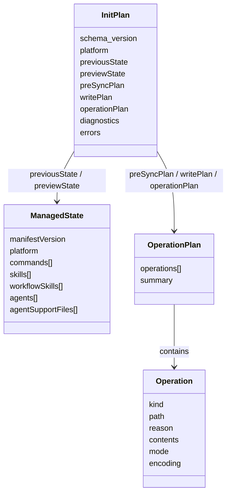
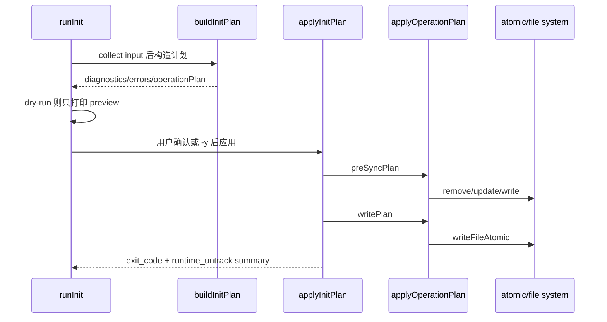

本页解释 `spec-first init` 在运行时写入前后的三个核心对象：**初始化计划**负责把将要发生的变更物化为可预览数据，**受管状态**负责记录上一轮由 spec-first 管理的 runtime 资产集合，**原子写入**负责降低写入中断或并发覆盖造成的半成品风险；范围限定在 `init` 计划构造、状态文件、操作执行器与文件写入机制，不展开 Claude/Codex 入口差异、source assets 生成细节或双宿主投递治理。Sources: [init-plan.js](src/cli/init-plan.js#L1-L9), [init.js](src/cli/commands/init.js#L793-L803), [state.js](src/cli/state.js#L78-L83), [atomic-write.js](src/cli/atomic-write.js#L12-L22)

## 架构假设与验证结论

从第一性原理看，`init` 不能直接把“我要安装运行时资产”变成一组立即执行的 `fs.writeFileSync` 调用，因为它必须同时满足 preview-first、source/runtime 边界、旧状态清理、路径安全与跨宿主差异；代码验证后的实际结构是：`src/cli/init-plan.js` 仅导出 `commands/init` 中的 `buildInitPlan` 与 `applyInitPlan`，真正的计划构造在 `buildProjectInitPlan`，真正的执行入口在 `applyProjectInitPlan`，底层文件副作用由 `state.applyOperationPlan` 解释操作列表。Sources: [init-plan.js](src/cli/init-plan.js#L1-L9), [init.js](src/cli/commands/init.js#L760-L803), [init.js](src/cli/commands/init.js#L1037-L1073), [state.js](src/cli/state.js#L560-L605)

上图的关键不是“流程复杂”，而是**计划与执行分离**：`buildInitPlan` 返回 `schema_version: spec-first-init-plan.v1`、`previewState`、`preSyncPlan`、`writePlan`、`operationPlan`、`summary`、`diagnostics` 与 `errors`，并且单测明确断言它在构造计划时不写文件；执行阶段才根据 plan 调用 `applyOperationPlan`，错误计划则直接返回 `exit_code: 1` 而不继续落盘。Sources: [init.js](src/cli/commands/init.js#L1003-L1034), [init.js](src/cli/commands/init.js#L1037-L1044), [init-plan.test.js](tests/unit/init-plan.test.js#L56-L84)

## 初始化计划：把副作用前置为数据

`buildInitPlan` 首先规范化 platform 与 target：单仓目标进入 `buildProjectInitPlan`，`all-repos` 目标进入 workspace 计划；这使调用方可以在同一个 API 上获得单仓或工作区初始化的计划对象，但本页只讨论单仓初始化的计划结构，因为 `applyInitPlan` 对 `plan.mode === 'all-repos'` 做了单独分派。Sources: [init.js](src/cli/commands/init.js#L760-L790), [init.js](src/cli/commands/init.js#L793-L803)

`buildProjectInitPlan` 的计划构造顺序是：读取旧受管状态，加载插件 manifest 与目标宿主的过滤资产集，计算 runtime 命令、资产同步计划与宿主 runtime 文件计划，然后用这些结果构造 `previewState`；因此 `previewState` 不是磁盘扫描的即时快照，而是“这次成功 init 后 state 文件应记录的受管资产集合”。Sources: [init.js](src/cli/commands/init.js#L842-L862), [init.js](src/cli/commands/init.js#L862-L927)

计划对象中最重要的三段操作是 `destructiveResetPlan`、`preSyncPlan` 与 `writePlan`：前者只在 legacy state 或 current runtime drift 被检测到时出现，`preSyncPlan` 负责移除过时受管资产、清理命名空间、裁剪退休 runtime 资产与旧 developer profile，`writePlan` 负责写入新一轮初始化产物；最终 `operationPlan` 由这三者合并而成。Sources: [init.js](src/cli/commands/init.js#L953-L990), [init.js](src/cli/commands/init.js#L992-L1004)

| 计划字段 | 责任 | 触发条件 | 执行者 |
|---|---|---|---|
| `destructiveResetPlan` | 受管 runtime 硬重置 | legacy state 或 current drift | `applyProjectInitPlan` |
| `preSyncPlan` | 移除过时、退休或命名空间外资产 | 每次正常构建计划 | `applyOperationPlan` |
| `writePlan` | 写入指令文件、runtime 文件、state 等 | 每次正常构建计划 | `applyOperationPlan` |
| `operationPlan` | 汇总可预览操作清单 | 由前三类 plan 合并 | dry-run 展示或 apply 执行 |

这个表对应的代码事实是：`preSyncPlan` 由多个 planner 合并，`initWritePlan.plan` 被保存为 `writePlan`，`operationPlan` 再合并 destructive reset、pre-sync 与 write plan；应用阶段在 destructive reset 存在时先创建 rollback backup，并按 reset、pre-sync、write 的顺序执行，否则只执行 pre-sync 与 write。Sources: [init.js](src/cli/commands/init.js#L986-L1004), [init.js](src/cli/commands/init.js#L1037-L1065)

## 受管状态：记录 ownership，而不是描述整个 runtime

受管状态文件的位置由宿主 adapter 决定：Claude 使用 `.claude/spec-first/state.json`，Codex 使用 `.codex/spec-first/state.json`；adapter 同时定义 runtime root、managed root、skills root、agents root 与 instruction file，这让同一套 state 机制可以服务不同宿主目录布局。Sources: [claude.js](src/cli/adapters/claude.js#L34-L64), [codex.js](src/cli/adapters/codex.js#L41-L75)

`state.json` 的 schema 是轻量但严格的 ownership ledger：必须包含非空字符串 `manifestVersion`，并且 `commands`、`skills`、`workflowSkills`、`agents`、`agentSupportFiles` 必须是字符串数组；`buildState` 从同步资产中提取这些字段，`normalizeState` 去重排序并补齐缺失数组，`writeState` 在写入前再次校验。Sources: [state.js](src/cli/state.js#L78-L83), [state.js](src/cli/state.js#L91-L117), [state.js](src/cli/state.js#L119-L149)

受管状态的核心作用是**精确删除自己曾经管理过的东西**：`planManagedAssetRemoval` 根据上一轮 state 的 `commands`、`skills`、`workflowSkills`、`agents` 与 `agentSupportFiles` 生成删除操作；`planObsoleteManagedAssetRemoval` 则只删除 previous state 中存在但 next state 中不存在的条目。Sources: [state.js](src/cli/state.js#L279-L345), [state.js](src/cli/state.js#L387-L458)

这也解释了为什么 state 不是“runtime 目录完整索引”：它不记录宿主或第三方拥有的文件，只记录 spec-first 管理的命令、skill、workflow skill、agent 与 agent support files；对应单测验证了 Codex 初始化会保留 provider-owned Graphify runtime，同时只追加/维护 spec-first 自己的 hook 配置。Sources: [state.js](src/cli/state.js#L91-L103), [init-plan.test.js](tests/unit/init-plan.test.js#L110-L152)

这组对象关系体现了 spec-first 的运行边界：`ManagedState` 决定哪些资产属于 spec-first，`OperationPlan` 决定这次将做哪些副作用，`Operation` 只表达文件系统动作与理由；语义判断不被写进状态机，确定性的写入、删除、路径校验与状态归档则由脚本执行。Sources: [state.js](src/cli/state.js#L244-L277), [state.js](src/cli/state.js#L560-L605), [结构化项目角色契约.md](docs/10-prompt/结构化项目角色契约.md#L64-L76)

## Legacy State 与 Runtime Drift 的重置路径

当旧 state 无法按当前 schema 读取时，`buildProjectInitPlan` 会尝试读取 raw state；如果它被识别为 legacy managed state，就设置 `legacyStateDetected`，并把诊断写入 plan，而不是立即删除文件。Sources: [init.js](src/cli/commands/init.js#L842-L861), [state.js](src/cli/state.js#L181-L185), [init.js](src/cli/commands/init.js#L953-L970)

legacy 路径会构造一个兼容旧布局的 reset state，然后用 `planHardResetManagedAssets` 生成 destructive reset；current runtime drift 路径则在已有 current state 的情况下调用 drift 检查，检测到后用上一轮 state 生成 hard reset，并把 `destructiveResetReason` 标记为 `current_runtime_drift`。Sources: [init.js](src/cli/commands/init.js#L953-L983), [state.js](src/cli/state.js#L352-L381)

`planHardResetManagedAssets` 在普通受管资产删除之外，还会删除命令根目录；如果 workflow root 与 skills root 不同，也会删除 workflow root，这是一种“只针对 spec-first 管理区域”的重置，而不是删除整个宿主 runtime。Sources: [state.js](src/cli/state.js#L352-L381), [claude.js](src/cli/adapters/claude.js#L42-L60), [codex.js](src/cli/adapters/codex.js#L49-L71)

单测把 legacy state 场景固定为可观察契约：构建计划时应出现 `legacyStateDetected`、`destructiveResetReason: legacy_state_detected` 与 destructive reset 摘要；执行后旧 skill 被移除，新命令被生成。Sources: [init-plan.test.js](tests/unit/init-plan.test.js#L154-L179)

## 操作执行器：路径安全先于文件副作用

`applyOperationPlan` 是计划到副作用的唯一解释器：它先解析 operation target，再检查真实路径是否仍位于项目根内，然后按 `ensure_dir`、`write_file` / `update_file`、`remove_file` / `prune_command`、`remove_dir`、`remove_empty_root`、`untrack_index` 分派执行。Sources: [state.js](src/cli/state.js#L560-L605)

路径安全分两层：`resolveOperationTarget` 禁止相对路径逃出 project root，也禁止删除 project root 本身；`assertOperationTargetContained` 通过 nearest existing path 的 realpath 检查 symlink 祖先是否把目标导向项目外。Sources: [state.js](src/cli/state.js#L641-L662), [state.js](src/cli/state.js#L664-L681)

| 风险 | 防线 | 行为 |
|---|---|---|
| `../` 写出项目根 | `resolveOperationTarget` | 抛出 outside project root |
| 删除项目根 | `resolveOperationTarget` | 抛出 targets project root |
| symlink runtime 指向外部目录 | `assertOperationTargetContained` | 抛出 escapes project root through symlink |
| 写入半成品 | `writeFileAtomic` | 同目录临时文件后 rename |
| 旧临时文件残留 | catch cleanup / 测试断言 | 删除 `.tmp` 文件 |

这些风险不是理论推导，而是由单测固定：操作计划拒绝项目外删除，拒绝通过 symlinked runtime ancestor 写入，拒绝通过 symlinked runtime root 删除，并拒绝删除 project root。Sources: [atomic-write.test.js](tests/unit/atomic-write.test.js#L104-L188)

## 原子写入：同目录临时文件、rename 与失败清理

`writeFileAtomic` 的实现很小：先创建目标目录，再用 `createAtomicTempPath` 在同一目录生成带 basename、pid、timestamp 与随机后缀的临时文件，写入临时文件后用 `fs.renameSync` 替换目标；如果写入或 rename 失败，就删除临时文件并重新抛出错误。Sources: [atomic-write.js](src/cli/atomic-write.js#L5-L22)

同目录临时文件是关键约束，因为 rename 只有在同一文件系统语义下才适合作为最终替换动作；测试明确断言临时文件位于目标文件同一目录，名称不是固定的 `${filePath}.tmp`，并且连续调用会生成不同路径。Sources: [atomic-write.js](src/cli/atomic-write.js#L5-L10), [atomic-write.test.js](tests/unit/atomic-write.test.js#L19-L29)

`writeFileAtomicIfAbsent` 走的是“只创建一次”的路径：写入临时文件后用 `fs.linkSync(tmpPath, filePath)` 建立硬链接，目标已存在时抛出 `EEXIST`，成功后尽力删除临时文件；这提供了“不覆盖已有文件”的原子创建语义。Sources: [atomic-write.js](src/cli/atomic-write.js#L24-L43), [atomic-write.test.js](tests/unit/atomic-write.test.js#L46-L59)

`state` 模块的写路径统一使用该 helper：`writeState` 调用 `writeFileAtomic` 写 state JSON，`writeManagedFile` 对文本与 buffer 写入都走 `writeFileAtomic`，然后在需要时执行 `chmodSync`；测试同时断言 state executor 不再包含直接的 `fs.writeFileSync(statePath` 或 `fs.writeFileSync(filePath` 写法。Sources: [state.js](src/cli/state.js#L78-L83), [state.js](src/cli/state.js#L630-L639), [atomic-write.test.js](tests/unit/atomic-write.test.js#L61-L70)

## 写入顺序与回滚边界

普通初始化的执行顺序是先应用 `preSyncPlan`，再应用 `writePlan`，最后写全局 developer profile；当存在 destructive reset 时，执行器会先创建 runtime rollback backup，然后依次执行 reset、pre-sync、write，失败时恢复 backup 并删除 backup。Sources: [init.js](src/cli/commands/init.js#L1037-L1073)

这里的回滚只包住 destructive reset 分支的 runtime 操作，不包住普通 pre-sync/write 的所有副作用，也不包住 `applyGlobalDeveloperProfileWrite`；因此它是针对破坏性重置的安全网，而不是完整事务系统。Sources: [init.js](src/cli/commands/init.js#L1046-L1067), [init.js](src/cli/commands/init.js#L1075-L1082)

这个时序也解释了 dry-run 的价值：`runInit` 在 `parsed.dryRun` 时只打印 previews 并返回，不会进入确认后的 `applyInitPlan`；非 `-y` 模式下也会先展示 preview，再通过 confirm 决定是否应用。Sources: [init.js](src/cli/commands/init.js#L175-L188), [init.js](src/cli/commands/init.js#L190-L200)

## 与宿主差异的最小交界

本页不展开宿主入口差异，但初始化计划必须读取 adapter 暴露的最小差异：Claude 有 `.claude/commands/spec`、`.claude/skills`、`.claude/spec-first/workflows` 与 `.claude/agents`；Codex 没有当前命令入口，skills 与 workflows 都投递到 `.agents/skills`，agents 投递到 `.codex/agents`。Sources: [claude.js](src/cli/adapters/claude.js#L42-L60), [codex.js](src/cli/adapters/codex.js#L49-L71)

Codex 还包含一个专门的 hook 写入保护：当项目根的 `.codex` 就是 `CODEX_HOME` 时，`planRuntimeFilesSync` 跳过 SessionStart hook 写入，但仍安装 skills、agents 与 `AGENTS.md`；正常项目 init 还会只读检测全局 Codex hook 污染并把它作为 advisory diagnostic，而不会自动删除。Sources: [codex.js](src/cli/adapters/codex.js#L136-L151), [init.js](src/cli/commands/init.js#L897-L923), [init-plan.test.js](tests/unit/init-plan.test.js#L181-L230)

## 设计边界与反模式

这个机制的设计边界可以概括为：**计划是事实表，不是状态机；state 是 ownership ledger，不是 runtime 全量索引；atomic write 是文件写入安全性，不是跨文件事务**。这些边界分别由 `buildInitPlan` 的无写入测试、state 字段 schema、operation executor 的逐操作执行，以及 destructive reset 分支的有限 rollback 体现。Sources: [init-plan.test.js](tests/unit/init-plan.test.js#L56-L84), [state.js](src/cli/state.js#L119-L149), [state.js](src/cli/state.js#L560-L605), [init.js](src/cli/commands/init.js#L1046-L1067)

| 设计选择 | 解决的问题 | 不承担的责任 |
|---|---|---|
| preview-first init plan | 让副作用可审查、可 dry-run | 不判断用户业务意图 |
| managed state | 精确清理 spec-first 管理资产 | 不拥有第三方 runtime 文件 |
| operation executor | 统一路径安全与文件动作 | 不提供跨文件强事务 |
| atomic write | 避免单文件半写入 | 不保证多文件全部成功或全部失败 |
| destructive reset backup | 降低 hard reset 失败风险 | 不覆盖普通写入与全局 profile 写入 |

这些取舍与项目角色契约一致：脚本负责文件发现、schema 校验、hash/readiness/drift 等确定性事实，LLM 或用户负责语义判断；硬 gate 应卡副作用与出口，而不是把 workflow 路径写成刚性状态机。Sources: [结构化项目角色契约.md](docs/10-prompt/结构化项目角色契约.md#L80-L116)

## 阅读路径

如果你要继续理解 `init` 的上下游，下一页建议读 [Source Assets 到宿主 Runtime Mirrors 的生成流程](17-source-assets-dao-su-zhu-runtime-mirrors-de-sheng-cheng-liu-cheng)，它解释 `writePlan` 中资产内容从哪里来；再读 [Developer Profile、语言策略与项目级配置](18-developer-profile-yu-yan-ce-lue-yu-xiang-mu-ji-pei-zhi)，理解 `developer` 与全局 profile 写入；如果关注宿主差异，再读 [双宿主治理与命令命名空间投递规则](19-shuang-su-zhu-zhi-li-yu-ming-ling-ming-ming-kong-jian-tou-di-gui-ze)。Sources: [init.js](src/cli/commands/init.js#L870-L878), [init.js](src/cli/commands/init.js#L1004-L1034), [init.js](src/cli/commands/init.js#L1067-L1082)