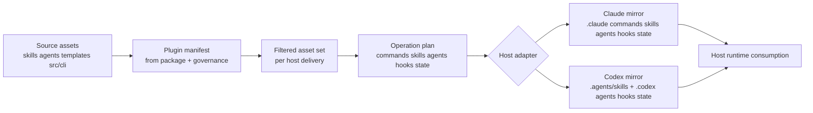
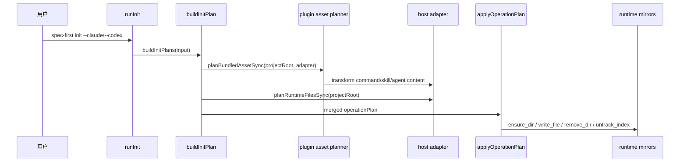
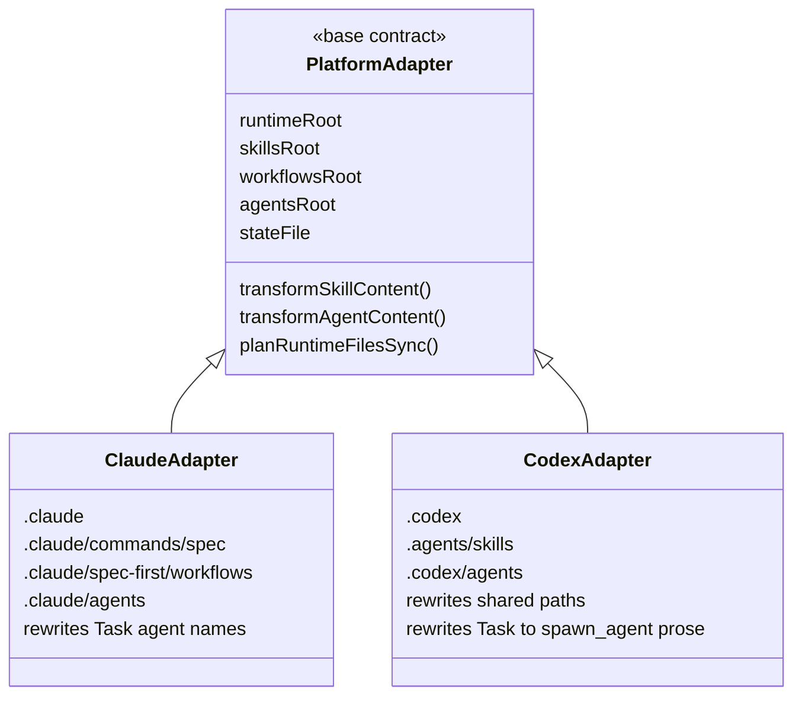

这页位于“深入解析 / 运行时与 CLI”的第 17 篇，专门解释 `spec-first init` 如何把仓库内的 source assets 变成 Claude Code 与 Codex 可消费的 runtime mirrors；它不展开升级、清理、Developer Profile 或命令命名空间治理，那些分别属于 [升级、清理与运行时资产刷新](9-sheng-ji-qing-li-yu-yun-xing-shi-zi-chan-shua-xin)、[Developer Profile、语言策略与项目级配置](18-developer-profile-yu-yan-ce-lue-yu-xiang-mu-ji-pei-zhi) 和 [双宿主治理与命令命名空间投递规则](19-shuang-su-zhu-zhi-li-yu-ming-ling-ming-kong-jian-tou-di-gui-ze)。Sources: [wiki.json](.zread/wiki/drafts/wiki.json#L124-L131), [AGENTS.md](AGENTS.md#L75-L104)

## 架构假设与验证结论

可验证的架构假设是：**source assets 是行为真相源，runtime mirrors 是宿主投递结果，生成器负责确定性投影，宿主适配器负责差异化改写**。仓库治理把 `skills/`、`agents/`、`templates/`、`src/cli/` 等列为 source-of-truth，把 `.claude/`、`.codex/`、`.agents/skills/` 列为 generated runtime assets，并明确要求 source 变更后用 `spec-first init` 重新生成 runtime，而不是手改 runtime mirror。Sources: [AGENTS.md](AGENTS.md#L75-L104), [source-runtime-customization-boundary.md](docs/contracts/source-runtime-customization-boundary.md#L7-L41)

这张图先给出关系模型：左侧是被打包在仓库内的 source assets，中间是 manifest、governance filter、operation plan 与 adapter transform，右侧才是宿主实际读取的 runtime mirror。图中的箭头表示当前代码中的生成依赖，不表示 runtime mirror 反向拥有 source 权威。Sources: [plugin.js](src/cli/plugin.js#L106-L147), [plugin.js](src/cli/plugin.js#L659-L678)



## Source 与 Runtime 的物理边界

物理边界的第一原则是“修改 source，不修 mirror”。source-of-truth 包含 `skills/`、`agents/`、`templates/`、`src/cli/`、契约、文档、README、`AGENTS.md`、`CLAUDE.md` 与 `CHANGELOG.md`；generated runtime mirror 只包含宿主消费路径 `.claude/`、`.codex/`、`.agents/skills/`。Sources: [source-runtime-customization-boundary.md](docs/contracts/source-runtime-customization-boundary.md#L7-L41), [AGENTS.md](AGENTS.md#L97-L120)

```text
source-of-truth
├── skills/
├── agents/
├── templates/
│   ├── claude/
│   └── codex/
├── src/cli/
└── docs/contracts/

generated runtime mirrors
├── .claude/
├── .codex/
└── .agents/skills/
```

Claude 与 Codex 的 runtime 拓扑不是同构复制。Claude adapter 声明 runtime root 为 `.claude`，命令入口在 `.claude/commands/spec`，workflow skills 在 `.claude/spec-first/workflows`，standalone skills 在 `.claude/skills`，agents 在 `.claude/agents`，state 在 `.claude/spec-first/state.json`；Codex adapter 声明 runtime root 为 `.codex`，skills 与 workflows 都投递到 `.agents/skills`，agents 投递到 `.codex/agents`，state 投递到 `.codex/spec-first/state.json`。Sources: [claude.js](src/cli/adapters/claude.js#L34-L64), [codex.js](src/cli/adapters/codex.js#L41-L75)

| 维度 | Claude Code runtime mirror | Codex runtime mirror |
|---|---|---|
| runtime root | `.claude` | `.codex` |
| command-backed workflow | `.claude/commands/spec` | 不写 `.codex/commands/spec`，由 `.agents/skills` 承载 |
| workflow skills | `.claude/spec-first/workflows` | `.agents/skills` |
| standalone skills | `.claude/skills` | `.agents/skills` |
| agents | `.claude/agents` | `.codex/agents` |
| managed state | `.claude/spec-first/state.json` | `.codex/spec-first/state.json` |

## 生成入口：从 `runInit` 到计划应用

`runInit` 是生成流程的外层编排：它解析 `spec-first init` 参数，决定是否需要交互输入，收集目标宿主与初始化参数，调用 `buildInitPlans` 生成计划；dry-run 时只打印 preview，非 dry-run 时先打印预览并确认，然后逐个调用 `applyInitPlan` 应用计划。Sources: [init.js](src/cli/commands/init.js#L90-L200), [init.js](src/cli/commands/init.js#L492-L498)

计划构建阶段会把每个目标平台映射到对应 adapter。后续的 project init plan 会加载 plugin manifest、读取 source 资产、按宿主过滤可投递资产、规划 bundled asset sync、规划 runtime hook 文件、构造 preview state，并把 destructive reset、pre-sync 与 write plan 合并成一个 operation plan。Sources: [init.js](src/cli/commands/init.js#L492-L498), [init.js](src/cli/commands/init.js#L924-L1034)

应用阶段不是直接散落写文件，而是按 plan 执行。`applyProjectInitPlan` 在 destructive reset 存在时先创建 rollback backup，再依次应用 reset、pre-sync、write plan，失败则恢复 backup；普通路径则先应用 pre-sync，再应用 write plan。实际文件系统副作用统一进入 `applyOperationPlan`。Sources: [init.js](src/cli/commands/init.js#L1037-L1072), [state.js](src/cli/state.js#L560-L604)



## Manifest 与治理过滤

manifest 不是手写清单，而是从 `package.json`、skills governance truth source、`templates/claude/commands/spec`、`skills/` 与 `agents/` 构建出来。workflow command 只来自 governance 中 `entry_surface === "workflow_command"` 的记录，且每个 command 必须能解析到模板 frontmatter 与对应 skill。Sources: [plugin.js](src/cli/plugin.js#L106-L147), [plugin.js](src/cli/plugin.js#L158-L174)

治理校验把 runtime 投递变成显式契约：每个 bundled skill 必须在 governance 中出现，`entry_surface`、`host_scope` 与 `host_delivery` 必须属于允许集合；workflow skill 必须有 command 映射，standalone skill 不能被投递为 command，internal-only skill 不能暴露为用户可见 command 或 skill。Sources: [plugin.js](src/cli/plugin.js#L300-L428), [tests/unit/init-source-path-coverage.test.js](tests/unit/init-source-path-coverage.test.js#L40-L57)

| 过滤维度 | 代码约束 | 生成影响 |
|---|---|---|
| `entry_surface` | workflow、standalone、internal 三类受控 | 决定是否进入 command-backed workflow 或 skill mirror |
| `host_delivery` | 每个 host 只能是 command、skill、internal、none | 决定 Claude/Codex 是否投递该资产 |
| `host_scope` | dual-host、host-exclusive、target-host-maintenance | 防止跨宿主误暴露 |
| command template | workflow command 必须有模板与 frontmatter | 防止 command mirror 缺描述或参数提示 |
| bundled coverage | bundled skill 必须被 governance 覆盖 | 防止 source asset 被遗漏 |

## Commands、Skills、Agents 的投影算法

`planBundledAssetSync` 是 source assets 到 runtime mirror 的核心规划器。它把三个子计划合并：Claude 有 commands 计划，Codex 因 `hasCommands === false` 不生成 command plan；两者都会生成 skills plan 与 agents plan；返回值同时包含 operation plan 与 syncedAssets，后者随后被写入 managed state。Sources: [plugin.js](src/cli/plugin.js#L659-L678), [codex.js](src/cli/adapters/codex.js#L49-L63)

commands 的投影只在 adapter 支持 commands 时发生。规划器先确保 command root 存在，再把 manifest command 映射成 adapter-specific filename，并通过 `renderRuntimeCommandContent` 生成 runtime command 文件内容；这些文件对 Claude 落在 `.claude/commands/spec`，而 Codex 路径被显式跳过。Sources: [plugin.js](src/cli/plugin.js#L701-L725), [claude.js](src/cli/adapters/claude.js#L42-L44)

skills 的投影是“先清目标目录，再递归复制并改写文本”。规划器区分 standalone、internal 与 workflow skills；workflow skill 在 Claude 下写入 `.claude/spec-first/workflows/<skill>`，在 Codex 下写入 `.agents/skills/<skill>`；每个 skill 目录先生成 `remove_dir` reset 操作，再通过 `planDirectoryWithTransform` 递归生成写入操作。Sources: [plugin.js](src/cli/plugin.js#L766-L824), [plugin.js](src/cli/plugin.js#L1059-L1100)

agents 的投影以文件为粒度：agent markdown 通过 adapter 的 `transformAgentContent` 改写后写入宿主 agents root，agent support files 原样写入；规划器同时确保 agents root 与父目录存在，并把 agent 文件与 support 文件分别标记为 `managed_agent` 与 `managed_agent_support_file`。Sources: [plugin.js](src/cli/plugin.js#L853-L890), [plugin.js](src/cli/plugin.js#L1103-L1136)

## 宿主适配器的内容改写

Claude adapter 的内容改写集中在三类事情：workflow command 会把 command template frontmatter 与对应 skill body 合并；skill content 会把 canonical agent names 改成 Claude 可执行名称，并把 source skill 路径按 runtime skill root 改写；agent content 也会把 canonical agent names 改成执行时名称。Sources: [claude.js](src/cli/adapters/claude.js#L66-L95), [skill-path-rewrite-markers.js](src/cli/skill-path-rewrite-markers.js#L12-L34)

Codex adapter 的内容改写偏向路径与调度语义：它把 `.claude/commands/spec/<name>.md`、`.claude/spec-first/workflows/`、`.claude/skills/`、`.claude/agents/` 等共享文本路径改写为 Codex runtime 路径；它还把 `Task spec-* (...)` 形式转成 Codex `spawn_agent` 可理解的 agent profile 引用与 fallback 说明。Sources: [codex.js](src/cli/adapters/codex.js#L211-L240), [codex.js](src/cli/adapters/codex.js#L253-L272)

路径改写不是盲替换。`rewriteSourceSkillRuntimePaths` 会逐行处理 `skills/<skill>/`，但当某行包含 source-of-truth、current source、source directory、not source、source fixes 等 source 语义标记，或是 Inputs 表格行时，会保留 source 路径；当一行是 Read、Run、Execute、Invoke、Open、Load 或 shell 命令语境时，则视为 operational runtime path 并允许改写。Sources: [skill-path-rewrite-markers.js](src/cli/skill-path-rewrite-markers.js#L3-L34), [skill-path-rewrite-markers.js](src/cli/skill-path-rewrite-markers.js#L36-L74)



## Hooks、Instruction Bootstrap 与 State

除了 skills、agents、commands，runtime 生成还包含宿主 hook 文件。Claude adapter 规划 `.claude/hooks/session-start` 与 `.claude/hooks/spec-plan-guard`，并设置可执行 mode；Codex adapter 规划 `.codex/hooks/session-start`、`.codex/hooks/session-start.cmd` 与 `.codex/hooks.json`，但当项目根就是 Codex global hook 目录时，会跳过 hook 写入以避免全局 double injection。Sources: [claude.js](src/cli/adapters/claude.js#L7-L24), [claude.js](src/cli/adapters/claude.js#L166-L182), [codex.js](src/cli/adapters/codex.js#L136-L151), [codex.js](src/cli/adapters/codex.js#L301-L327)

instruction bootstrap 写入的是 checked-in host entry document 的 managed block，而不是 `.claude/` 或 `.codex/` mirror 本体。Claude 使用 `CLAUDE.md`，Codex 使用 `AGENTS.md`；生成器用 `<!-- spec-first:bootstrap:start -->` 与 `<!-- spec-first:bootstrap:end -->` 包围最小 workflow 入口治理块，并可检测 missing、partial、installed、drifted 状态。Sources: [instruction-bootstrap.js](src/cli/instruction-bootstrap.js#L5-L20), [instruction-bootstrap.js](src/cli/instruction-bootstrap.js#L38-L82)

managed state 是 runtime mirror 的账本。`buildState` 记录 manifest version、platform、commands、skills、workflowSkills、agents 与 agentSupportFiles；`writeState` 会先 normalize 与 validate shape，再原子写入 adapter 的 state file。这个 state 后续用于 hard reset、obsolete asset removal 与 clean 的受管删除边界。Sources: [state.js](src/cli/state.js#L54-L83), [state.js](src/cli/state.js#L91-L149)

## Operation Plan 与写入安全

operation plan 把文件系统副作用压缩成有限操作集合：`ensure_dir`、`write_file`、`update_file`、`remove_file`、`remove_dir`、`remove_empty_root` 与 `untrack_index`。`mergeOperationPlans` 会按 `kind:path` 去重并生成 summary，`buildFileWriteOperation` 会根据目标是否存在选择 write 或 update。Sources: [state.js](src/cli/state.js#L197-L277), [state.js](src/cli/state.js#L560-L604)

应用 plan 时，每个 operation 都先解析为项目根内的目标路径，并通过 containment 检查；写文件走 `writeManagedFile`，底层使用 atomic write，必要时设置 mode；删除文件、删除目录与 untrack index 也都在统一 dispatcher 内完成。Sources: [state.js](src/cli/state.js#L560-L604), [state.js](src/cli/state.js#L626-L650)

文本文件与二进制/非文本文件的处理不同。`planFileCopyWithTransform` 对非文本文件读取 buffer 并保留 mode，对文本文件读取 UTF-8、执行 adapter transform、再生成 write/update operation；可转换文本扩展名由 `TEXT_FILE_EXTENSIONS` 控制，包括 `.md`、`.json`、`.yaml`、`.sh`、`.py` 等。Sources: [plugin.js](src/cli/plugin.js#L38-L48), [plugin.js](src/cli/plugin.js#L1103-L1136)

## Drift、Reset 与重新生成语义

重新生成不是简单覆盖。计划阶段会构造 preview state，并在发现 legacy state 或 current runtime drift 时规划 managed hard reset；否则会先规划 obsolete managed asset removal、command namespace prune、retired runtime asset prune 与 legacy developer profile cleanup，再执行写入计划。Sources: [init.js](src/cli/commands/init.js#L924-L1003), [state.js](src/cli/state.js#L279-L360)

runtime 完整性检查同样基于 source 再投影。`inspectInstalledAssets` 会按过滤后的 asset set 检查 commands、skills、agents 与 agent support files；skills 检查会确认每个应投递 skill 的 `SKILL.md` 是否存在，并对已存在的 skill 做 integrity 检查。Sources: [plugin.js](src/cli/plugin.js#L892-L948), [plugin.js](src/cli/plugin.js#L950-L960)

测试契约覆盖了关键不变量：所有 runtime-deliverable bundled skill 必须被 governance 覆盖并被至少一个宿主选择；workflow command template 与 workflow skill source 必须同时出现在 Claude 与 Codex 的选择集中；关键 workflow 与 routing skills 必须出现在两个宿主的 planned runtime sync paths 中。Sources: [init-source-path-coverage.test.js](tests/unit/init-source-path-coverage.test.js#L40-L73), [init-source-path-coverage.test.js](tests/unit/init-source-path-coverage.test.js#L75-L97)

## 生成流程的边界与反模式

正确的修复顺序是：先确认 source-of-truth，再检查 generator 或 adapter，再运行 `spec-first init` 重新生成 runtime mirror。`doctor` 或 inspect 报告 drift 只是 source/runtime 可能不一致的证据，不是直接 patch `.claude/`、`.codex/` 或 `.agents/skills/` 的许可。Sources: [source-runtime-customization-boundary.md](docs/contracts/source-runtime-customization-boundary.md#L25-L41), [AGENTS.md](AGENTS.md#L97-L104)

| 现象 | 正确处理 | 反模式 |
|---|---|---|
| workflow 文案错 | 修改 `skills/<skill>/SKILL.md` 或 command template，再 init | 手改 `.claude/spec-first/workflows` |
| agent 引用错 | 修改 `agents/` 或 adapter transform，再 init | 手改 `.claude/agents` / `.codex/agents` |
| Codex 路径仍指向 Claude | 检查 Codex adapter 的 shared path rewrite | 在 `.agents/skills` 中批量替换 |
| hook drift | 运行 `spec-first init` 让 adapter 重写 managed hook | 手改 hook 后不回源 |
| state 记录不一致 | 检查 managed state 与生成计划 | 删除 state 后手工补 runtime |

如果你正在读这一页是为了实现或审查 runtime generation 相关改动，下一步应回到 source 侧：修改投递规则时读 [双宿主治理与命令命名空间投递规则](19-shuang-su-zhu-zhi-li-yu-ming-ling-ming-kong-jian-tou-di-gui-ze)，修改初始化状态与原子写入时读 [初始化计划、受管状态与原子写入机制](16-chu-shi-hua-ji-hua-shou-guan-zhuang-tai-yu-yuan-zi-xie-ru-ji-zhi)，只做日常刷新或清理时读 [升级、清理与运行时资产刷新](9-sheng-ji-qing-li-yu-yun-xing-shi-zi-chan-shua-xin)。Sources: [wiki.json](.zread/wiki/drafts/wiki.json#L118-L146), [source-runtime-customization-boundary.md](docs/contracts/source-runtime-customization-boundary.md#L116-L128)