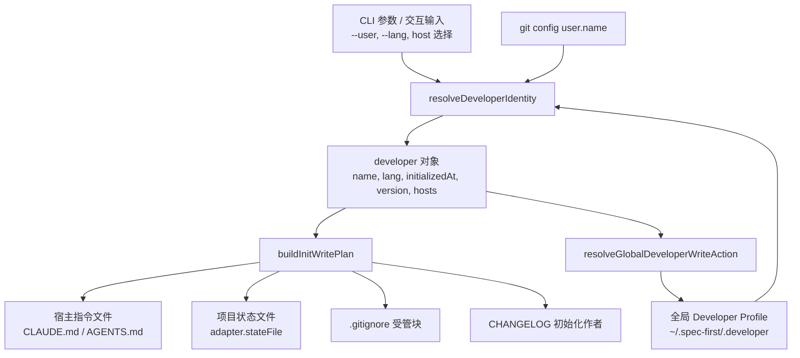
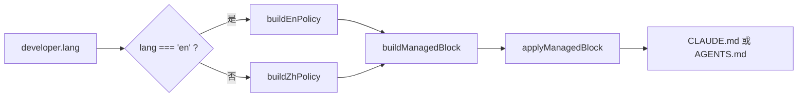

Spec-First 把“开发者是谁、默认用什么语言沟通、项目根目录写入哪些受管配置”拆成三层：全局 Developer Profile 保存个人偏好，语言策略块写入宿主指令文件，项目级配置由初始化写计划统一落地并保持可重复执行。本页只解释这三层的配置模型，不展开 runtime mirror 生成、命令命名空间投递或工作流质量门禁。Sources: [developer.js](src/cli/developer.js#L6-L12), [init.js](src/cli/commands/init.js#L2328-L2349), [lang-policy.js](src/cli/lang-policy.js#L5-L15)

## 架构假设与验证结论

核心假设是：Spec-First 不把开发者身份写进每个项目，而是使用 `~/.spec-first/.developer` 作为跨项目偏好源；项目初始化时再把语言治理、宿主入口指令、状态文件、`.gitignore` 策略等项目级配置写入目标仓库。源码验证支持这个假设：Developer Profile 的全局路径由 `os.homedir()` 和 `.spec-first/.developer` 拼出；初始化测试还明确断言 Codex 初始化后不存在旧式项目内 `.codex/spec-first/.developer`。Sources: [developer.js](src/cli/developer.js#L6-L12), [init-interactive.test.js](tests/unit/init-interactive.test.js#L190-L205)



这个图里的关键边界是：`developer` 对象在初始化计划中作为输入事实使用，但全局 profile 的创建、覆盖或保留由单独的 `resolveGlobalDeveloperWriteAction` 决定；项目级写入则由 `buildInitWritePlan` 合并 asset/runtime/gitignore/metadata/untrack 计划后执行。Sources: [init.js](src/cli/commands/init.js#L1004-L1034), [init.js](src/cli/commands/init.js#L1037-L1081), [init.js](src/cli/commands/init.js#L2252-L2293)

## Developer Profile 的职责边界

Developer Profile 是跨项目的轻量文本记录，字段包括 `name`、`lang`、`initialized_at`、`version`，并可追加 `hosts`；写入函数会创建 `~/.spec-first` 目录并按固定键值格式输出。它不是项目状态文件，也不是宿主 runtime 资产，因此初始化会通过全局写入动作单独处理它，而不是把它混入项目的 `.claude/` 或 `.codex/` runtime 目录。Sources: [developer.js](src/cli/developer.js#L130-L151), [init.js](src/cli/commands/init.js#L1075-L1081)

| 字段 | 来源与规范化 | 用途 |
|---|---|---|
| `name` | 显式参数优先，其次全局 profile，再回退 `git config user.name` | 初始化身份与 changelog 作者候选 |
| `lang` | 显式参数优先，其次全局 profile，再默认 `zh` | 生成语言策略块与本地化初始化提示 |
| `initialized_at` | 初始化时生成，覆盖 profile 时保留既有首次时间 | 记录首次初始化时间 |
| `version` | 来自当前 `package.json` 版本 | 记录写入 profile 时的 Spec-First 版本 |
| `hosts` | 初始化时根据选择的宿主集合写入，去重排序 | 下次交互时预选宿主 |

`resolveDeveloperIdentity` 的优先级是显式 `--user/--lang`、全局 profile、Git 用户名、默认语言 `zh`；如果无法解析开发者名称会报错，如果语言不是 `zh` 或 `en` 也会报错。这个设计使身份解析保持确定性，同时把“语言只支持两种策略模板”写成代码约束。Sources: [developer.js](src/cli/developer.js#L51-L81), [developer.js](src/cli/developer.js#L188-L199)

Changelog 作者解析与初始化身份解析相近但不完全相同：它优先读全局 Developer Profile；没有全局名称时可使用 fallbackName；再没有时读取 `git config user.name`；最终仍可能返回 unresolved 空名称而不直接阻断。语言策略块也把这一点写给宿主：`author` 读取全局 profile，取不到时回退 Git 身份或留空。Sources: [developer.js](src/cli/developer.js#L84-L122), [lang-policy.js](src/cli/lang-policy.js#L85-L88)

## 语言策略的落地方式

语言策略不是散落在 prompt 中的自然语言约定，而是写入宿主入口指令文件的受管块；块边界使用 `<!-- spec-first:lang:start -->` 与 `<!-- spec-first:lang:end -->` 标记。写入逻辑支持三种状态：文件不存在时创建块，文件存在但无标记时追加，标记完整时原位替换；如果只有开始标记没有结束标记，则按“无有效标记”追加。Sources: [lang-policy.js](src/cli/lang-policy.js#L5-L15), [lang-policy.js](src/cli/lang-policy.js#L45-L62)



中文策略要求默认用中文生成回复、状态更新、澄清、文档、需求/计划/任务、评审、总结、变更说明以及 commit/PR 文案；同时允许输入、工具输出、引用材料保留原文，并要求代码标识符、命令、路径、配置键、环境变量、API/协议名保持原文。英文策略是同一约束的英文版本，区别只在默认生成语言。Sources: [lang-policy.js](src/cli/lang-policy.js#L75-L88), [lang-policy.js](src/cli/lang-policy.js#L91-L105)

语言策略在初始化写计划里落地：`buildInitMetadataPlan` 读取当前宿主指令文件，先移除旧的 runtime tools 与 coding guidelines 受管块，再用 `applyManagedBlock` 写入语言策略，随后追加 bootstrap block，最终把结果作为 `managed_instruction_file` 操作写回 `adapter.instructionFile`。Sources: [init.js](src/cli/commands/init.js#L2401-L2431)

## 项目级配置的写入范围

项目级配置由 `buildInitWritePlan` 统一合并：source asset 同步计划、宿主 runtime 预览计划、`.gitignore` 计划、metadata 计划以及 runtime untrack 计划。这个函数本身不直接写盘，而是返回 operation plan；真正执行在 `applyProjectInitPlan` 中完成，成功后才应用全局 Developer Profile 写入。Sources: [init.js](src/cli/commands/init.js#L2328-L2349), [init.js](src/cli/commands/init.js#L1037-L1081)

```text
project-root/
├── CLAUDE.md 或 AGENTS.md      # 语言策略与 bootstrap 受管块
├── CHANGELOG.md                # 不存在时初始化
├── .gitignore                  # spec-first 受管忽略块
├── .claude/settings.json       # Claude 项目级 hooks 配置，仅 Claude 路径
└── .spec-first/config/*.json   # 本地 setup/runtime facts，默认忽略
```

`.gitignore` 策略分三组：生成 runtime assets、本地 setup 与 workflow runtime artifacts、可选 provider 本地产物；其中 `.spec-first/config/*.json`、`.spec-first/workflows/`、`.spec-first/workspace/`、`.spec-first/sessions/` 等都被纳入本地运行产物忽略范围。受管块使用 `# spec-first:start` 与 `# spec-first:end`，支持新增、替换和保持已有内容。Sources: [gitignore-policy.js](src/cli/gitignore-policy.js#L6-L45), [gitignore-policy.js](src/cli/gitignore-policy.js#L57-L103)

## Claude 项目设置的特殊性

Claude 的项目级设置集中在 `.claude/settings.json`，当前受管内容是两个 hook matcher：`SessionStart` 匹配 `startup|resume|clear|compact`，执行 `.claude/hooks/session-start`；`UserPromptExpansion` 匹配 `spec:plan`，执行 `.claude/hooks/spec-plan-guard`。这些 matcher 由固定构造函数生成，并通过 `upsertManagedClaudeHooks` 写入 settings。Sources: [claude-settings.js](src/cli/claude-settings.js#L5-L23), [claude-settings.js](src/cli/claude-settings.js#L25-L47), [claude-settings.js](src/cli/claude-settings.js#L73-L100)

Claude settings 写入前会先解析 JSON；如果 `.claude/settings.json` 不是合法 JSON 对象，初始化会返回 `invalid_claude_settings_json` 和修复提示，要求用户修好该文件后重新运行 `spec-first init` 并选择 Claude Code。这个错误路径发生在写入计划执行之前，因此不会在 settings 无效时继续覆盖项目配置。Sources: [claude-settings.js](src/cli/claude-settings.js#L240-L249), [init.js](src/cli/commands/init.js#L929-L950)

受管 hook 的更新策略是“移除自己的旧条目，再追加当前模板”，并且区分漂移检测与移除匹配：检测使用较宽松的路径识别，移除只接受精确命令或命令前缀，从而保留用户自定义 wrapper。契约测试覆盖了保留用户权限、保留其他 hook、重复 upsert 不重复写入、保留仅引用受管路径的 wrapper 等行为。Sources: [claude-settings.js](src/cli/claude-settings.js#L49-L71), [tests/unit/claude-settings.test.js](tests/unit/claude-settings.test.js#L74-L140), [tests/unit/claude-settings.test.js](tests/unit/claude-settings.test.js#L142-L170)

## 配置行为对照

| 配置对象 | 存储位置 | 写入时机 | 覆盖策略 | 主要消费者 |
|---|---|---|---|---|
| Developer Profile | `~/.spec-first/.developer` | 初始化应用阶段之后 | 首次创建；显式 name/lang 或 host 变化时覆盖；否则保留 | 初始化、changelog 作者、宿主选择预填 |
| 语言策略块 | `CLAUDE.md` 或 `AGENTS.md` | metadata 写计划 | 标记完整则原位替换，无标记则追加 | 当前宿主的指令入口 |
| Claude hooks 设置 | `.claude/settings.json` | Claude 初始化路径 | 移除受管条目后追加模板，保留用户配置 | Claude Code 项目级 hook |
| `.gitignore` 受管块 | `.gitignore` | init 写计划 | 标记完整则替换，无标记则追加 | Git 边界与本地产物隔离 |
| setup/runtime facts | `.spec-first/config/*.json` | setup 类流程产物 | 被 `.gitignore` 默认忽略 | doctor/setup/readiness 消费者 |

这个对照表反映的是当前源码事实：Developer Profile 是全局偏好，语言策略是宿主入口文件里的受管说明，Claude hooks 是项目级 JSON 配置，`.spec-first/config/*.json` 是本地 facts 产物而非应提交的项目源码。Sources: [developer.js](src/cli/developer.js#L130-L151), [init.js](src/cli/commands/init.js#L2401-L2445), [claude-settings.js](src/cli/claude-settings.js#L73-L100), [gitignore-policy.js](src/cli/gitignore-policy.js#L23-L35)

## 使用与排障路径

第一次初始化时，如果没有全局 Developer Profile，系统会根据输入创建它；如果已有 profile，host 选择会用于下次交互预选，且不支持的 host id 会在预选时被忽略。测试覆盖了“初始无预选”“记住上次 host”“忽略不支持 host”“host 变化即使 name/lang 不变也持久化”的路径。Sources: [init-interactive.test.js](tests/unit/init-interactive.test.js#L210-L303)

如果语言显示不符合预期，先检查 `~/.spec-first/.developer` 的 `lang` 是否为 `zh` 或 `en`，再检查目标仓库的 `CLAUDE.md` 或 `AGENTS.md` 是否存在完整的 `spec-first:lang` 标记块；初始化会通过标记块替换来保持幂等，而不是要求用户手动维护整份指令文件。Sources: [developer.js](src/cli/developer.js#L72-L81), [lang-policy.js](src/cli/lang-policy.js#L45-L62), [tests/unit/lang-policy.sh](tests/unit/lang-policy.sh#L74-L143)

如果 Claude 初始化失败并提示 settings JSON 无效，应先修复 `.claude/settings.json` 为 JSON object，再重新运行初始化；如果 hook 状态显示缺失或漂移，检查 `SessionStart` 与 `UserPromptExpansion` 下是否只有一个匹配当前模板的受管 matcher。Sources: [init.js](src/cli/commands/init.js#L929-L950), [claude-settings.js](src/cli/claude-settings.js#L157-L234)

## 继续阅读

理解本页后，建议先读 [Source Assets 到宿主 Runtime Mirrors 的生成流程](17-source-assets-dao-su-zhu-runtime-mirrors-de-sheng-cheng-liu-cheng)，因为 Developer Profile 与语言策略解释的是“配置输入”，而 runtime mirrors 解释这些输入如何生成宿主侧资产；再读 [双宿主治理与命令命名空间投递规则](19-shuang-su-zhu-zhi-li-yu-ming-ling-ming-ming-kong-jian-tou-di-gui-ze)，理解 Claude 与 Codex 的投递差异；如果你关心初始化写计划与状态文件的通用机制，回看 [初始化计划、受管状态与原子写入机制](16-chu-shi-hua-ji-hua-shou-guan-zhuang-tai-yu-yuan-zi-xie-ru-ji-zhi)。Sources: [init.js](src/cli/commands/init.js#L2328-L2349), [init.js](src/cli/commands/init.js#L2401-L2445)