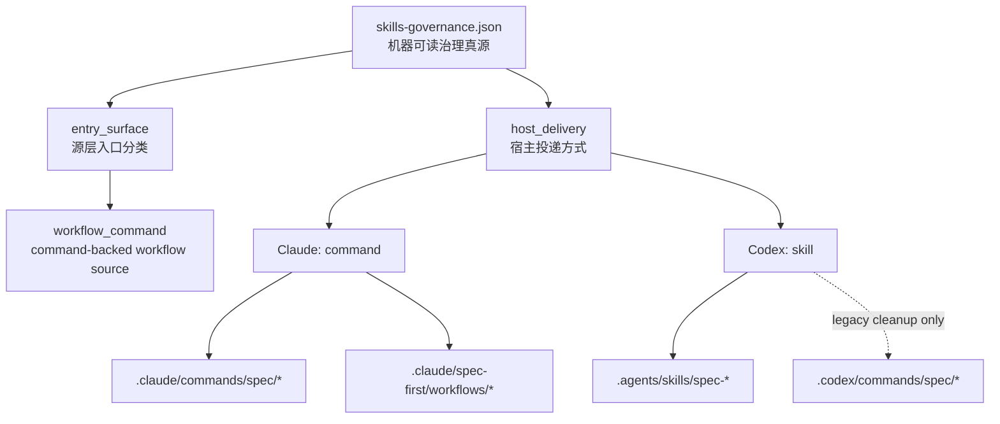
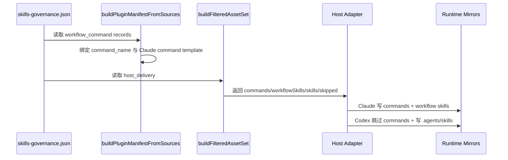

本页位于“深入解析 → 运行时与 CLI”中的第 19 页，解释 spec-first 如何用同一份源资产治理 Claude Code 与 Codex 两个宿主，同时避免把“源层 workflow_command”误投递成两个宿主都拥有命令文件。核心结论是：**Claude 的用户入口是 `/spec:*`，Codex 的用户入口是 `$spec-*`；Codex 不再安装 `.codex/commands/spec/*` 兼容命令层，而是通过 `.agents/skills/` 发现 workflow**。Sources: [README.md](docs/contracts/dual-host-governance/README.md#L8-L26)

## 架构假设与验证边界

本页的第一性假设是：spec-first 的“双宿主一致性”不是目录完全对称，而是**能力同源、投递异构、入口可辨识**。这一点由双宿主治理契约明确限定：`entry_surface` 表达 skill 在仓库真源中的入口类型，`host_delivery` 表达每个宿主最终如何交付，二者不能混写；因此 `workflow_command` 是源层事实，不自动推出 Codex 必须生成 command 文件。Sources: [README.md](docs/contracts/dual-host-governance/README.md#L34-L55), [README.md](docs/contracts/dual-host-governance/README.md#L77-L115)

第二个假设是：命名空间治理必须同时约束“用户可见入口”和“运行时文件投影”。ClaudeAdapter 的 runtime root 是 `.claude`，command root 是 `.claude/commands/spec`，workflow skill root 是 `.claude/spec-first/workflows`；CodexAdapter 的 runtime root 是 `.codex`，但 `hasCommands` 为 `false`，skill 与 workflow root 都落在 `.agents/skills`，并把 `.codex/commands/spec` 仅保留为 legacy cleanup target。Sources: [claude.js](src/cli/adapters/claude.js#L29-L60), [codex.js](src/cli/adapters/codex.js#L27-L83)

第三个假设是：治理不是文档约定，而是机器可读 contract、运行时构建逻辑和测试守卫的组合。`skills-governance.schema.json` 固定 `entry_surface`、`host_scope`、`host_delivery` 的枚举域，`skills-governance.json` 中的 `spec-doc-review` 记录展示了同一个 workflow 在 Claude 投递为 `command`、在 Codex 投递为 `skill` 的实际治理形态。Sources: [skills-governance.schema.json](src/cli/contracts/dual-host-governance/skills-governance.schema.json#L33-L54), [skills-governance.json](src/cli/contracts/dual-host-governance/skills-governance.json#L39-L47)

## 概念关系图

下面的 Mermaid 图展示“源层分类”和“宿主投递”之间的关系：`skills-governance.json` 是真源，CLI 从它生成 manifest 和 filtered asset set；Claude 分支继续生成命令文件和 workflow mirror，Codex 分支跳过命令文件，只把 workflow skill 投递到 `.agents/skills`。Sources: [plugin.js](src/cli/plugin.js#L17-L35), [plugin.js](src/cli/plugin.js#L112-L147), [plugin.js](src/cli/plugin.js#L564-L633)

这个图的关键不是“两个宿主目录看起来相同”，而是“同一个 workflow record 在两个宿主上有不同投递语义”。契约明确规定：Claude 对 command-backed workflow 继续生成 `.claude/commands/spec/*`，并同步到 `.claude/spec-first/workflows/`；Codex 的 `host_delivery.codex = skill`，不再生成 `.codex/commands/spec/*`，而是通过 `.agents/skills/spec-*` 发现与调用。Sources: [README.md](docs/contracts/dual-host-governance/README.md#L98-L115)

## 命名空间投递矩阵

| 维度 | Claude Code | Codex |
|---|---|---|
| 用户可见 workflow 入口 | `/spec:*` | `$spec-*` |
| command-backed workflow 投递 | `.claude/commands/spec/*` | 不生成 command 文件 |
| workflow skill mirror | `.claude/spec-first/workflows/*` | `.agents/skills/spec-*` |
| standalone skill 投递 | `.claude/skills/*` | `.agents/skills/*` |
| agent profile 投递 | `.claude/agents/*` | `.codex/agents/*` |
| instruction file | `CLAUDE.md` | `AGENTS.md` |

表中的差异来自适配器层的路径定义：ClaudeAdapter 声明 `commandRoot`、`skillsRoot`、`workflowsRoot`、`agentsRoot` 和 `instructionFile`；CodexAdapter 声明 `hasCommands = false`，并把 `skillsRoot` 与 `workflowsRoot` 都指向 `.agents/skills`，同时使用 `.codex/agents` 与 `AGENTS.md`。Sources: [claude.js](src/cli/adapters/claude.js#L42-L64), [codex.js](src/cli/adapters/codex.js#L49-L75)

这张矩阵说明命名空间规则有两个层次：**用户命令命名空间**只暴露 `/spec:*` 与 `$spec-*`；**文件投递命名空间**则由宿主适配器决定。CLI 的版本提示也把二者拆开说明：重启宿主后 Claude 使用 `/spec:*`、Codex 使用 `$spec-*`，并特别指出这些是宿主 workflow 入口，不是 package CLI 子命令。Sources: [index.js](src/cli/index.js#L189-L207)

## 运行时构建流程

filtered asset set 是双宿主治理的执行枢纽。构建时，CLI 读取治理记录，按当前平台查看 `record.host_delivery[platform]`：如果 `entry_surface = workflow_command` 且 delivery 为 `command`，则加入 `commands` 与 `workflowSkills`；如果 delivery 为 `skill`，则只加入 `workflowSkills`；其他情况进入 `skipped`，并带上被排除原因。Sources: [plugin.js](src/cli/plugin.js#L564-L633)

实际同步时，`syncBundledAssets` 与 `planBundledAssetSync` 都先调用 `buildFilteredAssetSet(adapter.id)`，然后只有当 `adapter.hasCommands` 为真时才同步或计划同步 command 文件。由于 CodexAdapter 的 `hasCommands` 固定为 `false`，Codex 即便拥有 workflow skill，也不会从 command template 生成 `.codex/commands/spec/*`。Sources: [plugin.js](src/cli/plugin.js#L650-L678), [codex.js](src/cli/adapters/codex.js#L49-L55)

Claude 的 command 内容生成也不是简单复制 template：`renderCommandContent` 会在存在 skill 内容时保留 command frontmatter，并将 workflow skill 正文合并进去，再调用 `transformSkillContent` 做 runtime path rewrite；这解释了为什么 Claude 同时拥有 command surface 与 workflow mirror，而不是两个互相漂移的独立文本源。Sources: [claude.js](src/cli/adapters/claude.js#L66-L91)

## Codex 兼容层的收口规则

Codex 的 `.codex/commands/spec/*` 在当前架构中只有一个身份：**历史兼容清理目标**。契约明确说它不再是正式产品面，`init / doctor / clean / README / skill 文案` 不再把它描述为可用入口，Codex 统一通过 `.agents/skills/` 下的 `$spec-*` 发现与调用 workflow。Sources: [README.md](docs/contracts/dual-host-governance/README.md#L17-L32)

实现层也按这个规则收口：CodexAdapter 的类注释直接声明 `.codex/commands/spec/` 是 legacy compatibility layer cleanup target only；`removeRuntimeFiles` 会删除当前 command root、旧 `.codex/spec-first/commands`、旧 marketplace/plugin 目录等历史路径。Sources: [codex.js](src/cli/adapters/codex.js#L27-L35), [codex.js](src/cli/adapters/codex.js#L195-L200)

这条规则的架构价值在于降低双入口心智负担：同一个 Codex workflow 不再同时拥有 `$spec-*` 与 `.codex/commands/spec/*` 两套解释路径。契约中的决策理由也明确指出，继续生成 `.codex/commands/spec/*` 会让 `init`、`doctor`、CLI banner 与 smoke 守卫持续把它当成正式产品面，而 Codex 已具备 `.agents/skills/` 发现路径。Sources: [README.md](docs/contracts/dual-host-governance/README.md#L28-L32)

## 路由入口与授权边界

会话启动注入的 bootstrap block 把入口命名空间直接写入宿主上下文：Claude 分支写入“Claude workflow 入口使用 `/spec:*`”，Codex 分支写入“Codex workflow 入口使用 `$spec-*`”。同一段逻辑还禁止把 `using-spec-first` 当成 command-backed workflow，并要求不要直接暴露 internal-only skills。Sources: [instruction-bootstrap.js](src/cli/instruction-bootstrap.js#L140-L171)

Codex 还有一条额外边界：进入公开 `$spec-*` 前，顶层 orchestrator 可以 best-effort 运行 `spec-first startup-reminder --codex`，失败或空输出不阻塞；同时公开 `$spec-*` 调用只授权 workflow 本身，不自动授权 `spawn_agent`，缺少 subagents/personas/delegated/parallel 明示授权时要走 documented fallback 并记录 `dispatch_authorization_missing`。Sources: [instruction-bootstrap.js](src/cli/instruction-bootstrap.js#L149-L153)

`using-spec-first` 自身被治理为 standalone meta skill，而不是 workflow command。测试直接断言它的治理记录是 `entry_surface: standalone_skill`、`command_name: null`、`host_scope: dual_host`，且 Claude 与 Codex 的 `host_delivery` 都是 `skill`；这防止入口路由器把“如何选择工作流”的元技能误发布成一级 workflow 命令。Sources: [using-spec-first-contracts.test.js](tests/unit/using-spec-first-contracts.test.js#L203-L220)

## 治理枚举对比

| 枚举 | 允许值 | 本页关注点 |
|---|---|---|
| `entry_surface` | `workflow_command` / `standalone_skill` / `internal_only` | 描述源层角色，不等于每个宿主都生成命令文件 |
| `host_scope` | `dual_host` / `host_exclusive` / `target_host_maintenance` | 描述能力交付边界 |
| `host_delivery` | `command` / `skill` / `internal` / `none` | 描述每个宿主最终投递形态 |

这些枚举被 schema 固定为机器可验证集合，并且治理记录必须包含 `skill_name`、`entry_surface`、`command_name`、`host_scope`、`owner_host`、`host_delivery` 六个字段；`host_delivery` 必须同时声明 `claude` 与 `codex`，不能只声明当前宿主。Sources: [skills-governance.schema.json](src/cli/contracts/dual-host-governance/skills-governance.schema.json#L33-L54), [skills-governance.schema.json](src/cli/contracts/dual-host-governance/skills-governance.schema.json#L55-L110)

契约文本进一步解释了这些字段的分工：`command_name` 在 `entry_surface = workflow_command` 时必填，`owner_host` 在 `host_exclusive` 或 `target_host_maintenance` 时必填，`host_delivery` 的 `claude` 与 `codex` 可取 `command`、`skill`、`internal`、`none`。Sources: [README.md](docs/contracts/dual-host-governance/README.md#L77-L97)

## Drift 防线

第一道防线是 schema 与 JSON contract：它们把治理字段从散落文案提升为运行时真源。第二道防线是 manifest 构建：`buildPluginManifestFromSources` 只从 `entry_surface = workflow_command` 的治理记录中生成 command manifest，并要求 workflow command 同时存在 `command_name`、`skill_name` 与对应 command template frontmatter。Sources: [plugin.js](src/cli/plugin.js#L112-L147)

第三道防线是运行时过滤：`buildFilteredAssetSet` 在每次 init preview、同步、doctor、clean 等运行时阶段使用同一组过滤规则。契约也要求 filtered asset set 至少覆盖 init previewState、removeObsoleteManagedAssets、实际同步、doctor、clean 与 state 模块相关清理/检查逻辑。Sources: [README.md](docs/contracts/dual-host-governance/README.md#L150-L195), [plugin.js](src/cli/plugin.js#L564-L633)

第四道防线是测试：`using-spec-first` 测试验证 Codex runtime 文案包含 `$spec-*`、startup reminder、dispatch admission 与 host-level subagent tool contract 边界，并验证 Codex 路径 rewrite 不把旧 Claude command path 作为正式入口保留。Sources: [using-spec-first-contracts.test.js](tests/unit/using-spec-first-contracts.test.js#L223-L262), [using-spec-first-contracts.test.js](tests/unit/using-spec-first-contracts.test.js#L289-L305)

## 阅读路径

如果你需要先理解宿主入口与 package CLI 的差异，先读 [Claude Code 与 Codex 的入口差异](4-claude-code-yu-codex-de-ru-kou-chai-yi)，再回到本页理解为什么 `/spec:*` 与 `$spec-*` 不是同一种文件投递机制。Sources: [index.js](src/cli/index.js#L189-L207)

如果你关心这些规则如何从 source assets 生成 runtime mirrors，下一步读 [Source Assets 到宿主 Runtime Mirrors 的生成流程](17-source-assets-dao-su-zhu-runtime-mirrors-de-sheng-cheng-liu-cheng)；如果你要新增入口或调整 skill 类型，再读 [新增 Skill、Agent 与命令入口的接入规范](29-xin-zeng-skill-agent-yu-ming-ling-ru-kou-de-jie-ru-gui-fan)。Sources: [plugin.js](src/cli/plugin.js#L650-L719)

如果你要追踪 workflow 调度而不是入口投递，继续读 [CLI 命令调度与包入口模型](15-cli-ming-ling-diao-du-yu-bao-ru-kou-mo-xing) 和 [选择合适的工作流入口](6-xuan-ze-he-gua-de-gong-zuo-liu-ru-kou)，因为本页只解释双宿主治理与命名空间投递，不展开每个 workflow 的业务选择规则。Sources: [instruction-bootstrap.js](src/cli/instruction-bootstrap.js#L156-L171)