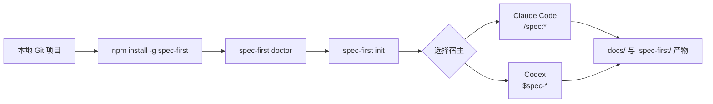

`spec-first` 的快速开始目标很窄：在一个已有 Git 项目里安装 CLI，检查本机环境，初始化 Claude Code 和/或 Codex 的项目级 runtime，然后在宿主会话中跑通第一个工作流入口，让需求、计划、执行和评审开始留下仓库内 artifact，而不是只停留在聊天窗口里。Sources: [README.zh-CN.md](README.zh-CN.md#L13-L18), [README.zh-CN.md](README.zh-CN.md#L33-L57)

## 架构假设与验证

**架构假设**：`spec-first` 不是独立替代 Claude Code 或 Codex 的应用，而是一个 Node.js CLI；它把仓库中的 source assets 通过 `spec-first init` 投递成宿主可识别的 runtime assets，随后由宿主内的 `/spec:*` 或 `$spec-*` 入口生成 `docs/` 与 `.spec-first/` 下的工作流证据。代码验证显示 npm 包暴露 `spec-first` 二进制入口，CLI 支持 `doctor`、`init`、`update` 等命令，Claude adapter 将入口投递到 `.claude/commands/spec`、`.claude/skills`、`.claude/spec-first/workflows` 和 `.claude/agents`，Codex adapter 将技能入口投递到 `.agents/skills` 并把 agent 放到 `.codex/agents`。Sources: [package.json](package.json#L1-L9), [src/cli/index.js](src/cli/index.js#L151-L175), [src/cli/adapters/claude.js](src/cli/adapters/claude.js#L29-L60), [src/cli/adapters/codex.js](src/cli/adapters/codex.js#L27-L75)

下面这张图只表达快速开始所需的最小路径：你先在 shell 里安装和初始化，再回到 Claude Code 或 Codex 会话中调用工作流入口；更深入的运行时治理、契约测试和多仓工作区细节留给后续页面。Sources: [README.zh-CN.md](README.zh-CN.md#L91-L145), [README.zh-CN.md](README.zh-CN.md#L276-L310)



## 开始前准备

开始前确认四件事：Node.js 版本至少为 `20.0.0`，Git 已安装并位于 `PATH`，你已经安装 Claude Code 或 Codex 中至少一个宿主，并且终端位于要启用 `spec-first` 的项目仓库根目录。`doctor` 的实现会检查 Node 版本、Git 可用性以及宿主 CLI 是否能被当前 shell 发现，因此它是安装后的第一个可信反馈点。Sources: [package.json](package.json#L107-L109), [README.zh-CN.md](README.zh-CN.md#L91-L99), [src/cli/commands/doctor.js](src/cli/commands/doctor.js#L103-L181)

| 准备项 | 为什么需要 | 快速确认方式 |
|---|---|---|
| Node.js `>=20.0.0` | CLI 入口在启动时检查 Node 支持范围 | `node -v` |
| Git | `doctor`、setup 和 workflow 会读取 Git 仓库事实 | `git --version` |
| Claude Code 或 Codex | workflow 入口由宿主加载，不是普通 shell 命令 | `claude --version` 或 `codex --version` |
| 项目根目录 | runtime assets 和 artifacts 都按当前项目写入 | 在目标 repo 根目录运行命令 |

Sources: [bin/spec-first.js](bin/spec-first.js#L1-L23), [src/cli/commands/doctor.js](src/cli/commands/doctor.js#L42-L63), [src/cli/commands/doctor.js](src/cli/commands/doctor.js#L103-L181)

## 三步跑通

第一步，在系统终端安装 CLI 并执行健康检查；macOS、Linux 和 Windows 都使用 npm 全局安装，Windows 推荐 PowerShell 7+ 或原生 `cmd.exe` 做安装和 smoke check。Sources: [README.zh-CN.md](README.zh-CN.md#L100-L123)

```bash
npm install -g spec-first
spec-first doctor
```

第二步，在目标项目根目录运行初始化；交互式 `spec-first init` 会让你选择 Claude Code 和/或 Codex，确认开发者姓名与语言，预览将写入的内容，然后再显式确认应用。也可以用 `--claude`、`--codex`、`-y`、`--lang <zh|en>` 等参数收窄初始化行为。Sources: [README.zh-CN.md](README.zh-CN.md#L125-L133), [src/cli/commands/init.js](src/cli/commands/init.js#L89-L118), [src/cli/commands/init.js](src/cli/commands/init.js#L218-L315)

```bash
spec-first init
```

第三步，重启 Claude Code 或 Codex，或新开一个宿主会话，然后在宿主内运行第一个 workflow 入口；注意这些入口不是 shell 命令，而是宿主加载 runtime assets 后提供的会话命令。Sources: [README.zh-CN.md](README.zh-CN.md#L133-L145)

```text
# Claude Code 会话中
/spec:brainstorm "改进 onboarding"

# Codex 会话中
$spec-brainstorm "改进 onboarding"
```

## Claude Code 与 Codex 入口差异

快速开始只需要记住一个差异：Claude Code 使用 `/spec:*` 命令面，Codex 使用 `$spec-*` skill 面；同一个 workflow 的 source skill 由治理映射决定如何投递到不同宿主，例如 `spec-brainstorm` 在 Claude 侧投递为 command，在 Codex 侧投递为 skill。Sources: [docs/05-用户手册/01-快速开始.md](docs/05-用户手册/01-快速开始.md#L1-L4), [src/cli/contracts/dual-host-governance/skills-governance.json](src/cli/contracts/dual-host-governance/skills-governance.json#L181-L190)

| 使用场景 | Claude Code 输入 | Codex 输入 | 初次期望结果 |
|---|---|---|---|
| 需求发散 | `/spec:ideate "你的想法"` | `$spec-ideate "你的想法"` | 形成候选方向 |
| 需求澄清 | `/spec:brainstorm "你的需求"` | `$spec-brainstorm "你的需求"` | 写入 requirements brief |
| 编写计划 | `/spec:plan` | `$spec-plan` | 写入 implementation plan |
| 执行实现 | `/spec:work` | `$spec-work` | 产生代码变更与验证说明 |
| 代码评审 | `/spec:code-review` | `$spec-code-review` | 生成结构化评审结论 |

Sources: [README.zh-CN.md](README.zh-CN.md#L147-L173), [docs/05-用户手册/01-快速开始.md](docs/05-用户手册/01-快速开始.md#L120-L158)

## 会写入什么

初始化后，Claude Code 项目通常会出现 `.claude/commands/spec`、`.claude/skills`、`.claude/spec-first/workflows`、`.claude/agents` 等 runtime mirror；Codex 项目通常会出现 `.agents/skills`、`.codex/agents` 和 `.codex/spec-first/state.json` 等项目级 runtime 状态。这些是 generated runtime copies，不是主要编辑面；需要刷新时重新运行 `spec-first init`。Sources: [docs/05-用户手册/01-快速开始.md](docs/05-用户手册/01-快速开始.md#L60-L68), [README.zh-CN.md](README.zh-CN.md#L201-L204)

```text
your-project/
├── docs/
│   ├── brainstorms/   # requirements brief 或 PRD-grade requirements
│   ├── plans/         # implementation plans
│   ├── tasks/         # derived task packs
│   └── solutions/     # reusable learnings
├── .spec-first/
│   ├── workflows/     # work closeout 等结构化执行证据
│   └── app-audit/     # App consistency audit 运行产物
├── .claude/           # Claude Code generated runtime assets
├── .codex/            # Codex generated runtime assets
└── .agents/skills/    # Codex skill runtime assets
```

这条目录示意只展示初学者最常遇到的路径：`docs/brainstorms/` 是第一次 `brainstorm` 的常见落点，后续链路可能继续写入 `docs/plans/`、`docs/tasks/`、结构化 work evidence、review findings 和 `docs/solutions/`，但不是每个 workflow 都会写入所有 artifact。Sources: [README.zh-CN.md](README.zh-CN.md#L49-L57), [README.zh-CN.md](README.zh-CN.md#L177-L199)

## 判断是否成功

最直接的成功信号是：重新运行 `spec-first doctor` 后，当前宿主的 commands、skills、agents 或 Codex 的 `.agents/skills`、`.codex/agents` 检查通过；如果宿主里看不到新入口，先确认已经完整重启宿主，再重新执行 `spec-first init`。Sources: [docs/05-用户手册/01-快速开始.md](docs/05-用户手册/01-快速开始.md#L204-L223)

```bash
spec-first doctor
spec-first doctor --claude
spec-first doctor --codex
```

| 现象 | 初学者判断 | 下一步 |
|---|---|---|
| `doctor` 提示未检测到平台 | 项目尚未初始化 runtime | 运行 `spec-first init` |
| Node.js 报错 | 本机 Node 版本不满足要求 | 安装 Node.js 20 或更新版本 |
| Git 报错 | 当前 shell 找不到 Git | 安装 Git 并检查 `PATH` |
| 宿主命令不可见 | 宿主未重载 runtime assets | 重启 Claude Code 或 Codex |
| 已生成 brief | 第一个 workflow 已跑通 | 继续进入 plan 或 work |

Sources: [src/cli/commands/doctor.js](src/cli/commands/doctor.js#L54-L63), [src/cli/commands/doctor.js](src/cli/commands/doctor.js#L103-L181), [README.zh-CN.md](README.zh-CN.md#L49-L57)

## 下一步阅读

如果你刚完成本页，建议按目录顺序继续：[安装、健康检查与项目初始化](3-an-zhuang-jian-kang-jian-cha-yu-xiang-mu-chu-shi-hua) 用来补齐安装和初始化细节，[Claude Code 与 Codex 的入口差异](4-claude-code-yu-codex-de-ru-kou-chai-yi) 用来理解双宿主命令面，[首次工程闭环走查](5-shou-ci-gong-cheng-bi-huan-zou-cha) 用来把 brainstorm、plan、work、review 和 compound 串成一次完整实践。Sources: [README.zh-CN.md](README.zh-CN.md#L237-L260), [README.zh-CN.md](README.zh-CN.md#L276-L310)