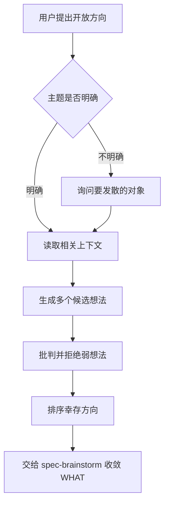
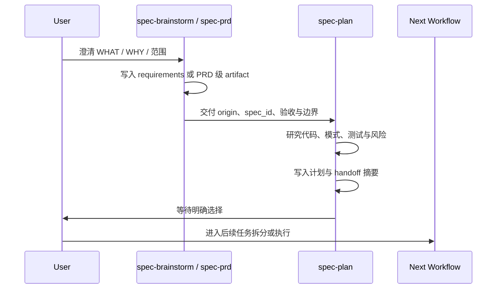

本页解释 spec-first 中从“还不知道什么值得做”到“可以进入实现计划”的上游工作流链路：`spec-ideate` 负责生成并筛选候选方向，`spec-brainstorm` 负责把开放问题收敛成需求文档，`spec-prd` 负责 brownfield 场景下的 PRD 级 WHAT/WHY 与证据固化，`spec-plan` 负责把已收敛的需求转成 HOW 层面的实施计划；它不覆盖任务拆分、执行、调试、代码评审或知识沉淀，这些内容应继续阅读 [任务拆分、执行、调试与优化工作流](21-ren-wu-chai-fen-zhi-xing-diao-shi-yu-you-hua-gong-zuo-liu) 与后续页面。Sources: [SKILL.md](skills/spec-ideate/SKILL.md#L11-L18), [SKILL.md](skills/spec-brainstorm/SKILL.md#L11-L15), [SKILL.md](skills/spec-prd/SKILL.md#L9-L16), [SKILL.md](skills/spec-plan/SKILL.md#L11-L16)

## 核心定位

从第一性原理看，这组工作流的关键边界是 **WHAT 与 HOW 分离**：`spec-ideate` 问“哪些方向最值得探索”，`spec-brainstorm` 问“选定方向到底意味着什么”，`spec-prd` 在既有系统增量中固化产品行为、验收、范围和证据，`spec-plan` 才进入实现路径、文件影响、测试场景、依赖顺序和风险决策。Sources: [SKILL.md](skills/spec-ideate/SKILL.md#L11-L18), [SKILL.md](skills/spec-brainstorm/SKILL.md#L62-L69), [SKILL.md](skills/spec-prd/SKILL.md#L64-L72), [SKILL.md](skills/spec-plan/SKILL.md#L88-L112)

这条链路的工程价值在于降低“计划替产品做决定”的概率：需求发散阶段允许产生多个方向并显式拒绝弱想法，需求/PRD 阶段把用户行为、范围边界、验收样例和当前系统证据写入可复用文档，计划阶段再继承这些约束，而不是重新发明产品语义。Sources: [SKILL.md](skills/spec-ideate/SKILL.md#L77-L82), [SKILL.md](skills/spec-brainstorm/SKILL.md#L19-L51), [SKILL.md](skills/spec-prd/SKILL.md#L117-L164), [SKILL.md](skills/spec-plan/SKILL.md#L155-L181)


上图中的 `spec-prd` 不是所有需求的必经步骤；当已有系统增量需要当前状态证据、Change Delta、验收、范围边界和 owner 决策时，它提供 PRD 级 requirements origin，而普通开放式需求仍可由 `spec-brainstorm` 产出 `docs/brainstorms/` 下的需求文档后交给 `spec-plan`。Sources: [SKILL.md](skills/spec-brainstorm/SKILL.md#L33-L51), [SKILL.md](skills/spec-prd/SKILL.md#L17-L49), [prd-output-template.md](skills/spec-prd/references/prd-output-template.md#L7-L23), [SKILL.md](skills/spec-plan/SKILL.md#L144-L181)

## 工作流对比

| 工作流 | 核心问题 | 典型输入 | 持久产物 | 不做什么 |
| --- | --- | --- | --- | --- |
| `spec-ideate` | 哪些方向值得探索 | focus hint、仓库证据、近期 ideation | `docs/ideation/` 中的排序想法文档 | 不写需求、计划或代码 |
| `spec-brainstorm` | 这个需求到底是什么 | feature idea、问题陈述、上下文与用户决策 | `docs/brainstorms/` 中的需求文档或简短对齐摘要 | 不实现代码，不做详细技术设计 |
| `spec-prd` | 既有系统增量的 WHAT/WHY 是否足够计划 | 增量请求、现有 PRD、草稿、源码/文档证据 | `docs/brainstorms/*-requirements.md`，`artifact_kind: prd-requirements` | 不创建 `docs/prds/`，不写实施计划 |
| `spec-plan` | 应该如何构建 | 需求文档、PRD、bug report、粗略任务描述 | `docs/plans/` 下的实施或结构化计划 | 不执行代码，不越过 handoff 直接进入实现 |

Sources: [SKILL.md](skills/spec-ideate/SKILL.md#L29-L49), [SKILL.md](skills/spec-brainstorm/SKILL.md#L29-L51), [SKILL.md](skills/spec-prd/SKILL.md#L27-L49), [SKILL.md](skills/spec-plan/SKILL.md#L35-L57)

## 需求发散：从候选方向到可讨论主题

`spec-ideate` 位于 `spec-brainstorm` 之前，它的目标不是补全需求，而是先基于仓库或主题证据产生多个候选想法、逐一批判、解释幸存者并给出进入 brainstorm 的建议；因此它适合“想改进什么”“有什么高价值方向”“给我几个惊喜选项”这类尚未选定 WHAT 的场景。Sources: [SKILL.md](skills/spec-ideate/SKILL.md#L11-L18), [SKILL.md](skills/spec-ideate/SKILL.md#L21-L39), [SKILL.md](skills/spec-ideate/SKILL.md#L77-L82)

`spec-brainstorm` 接手的是已经有方向但产品行为、问题框架、用户目标、成功标准或范围边界仍然开放的请求；它通过一次只问一个问题、优先使用阻塞式问题工具、按 scope 控制仪式感的方式，把讨论收敛成足以让计划不再发明 WHAT 的需求文档或对齐摘要。Sources: [SKILL.md](skills/spec-brainstorm/SKILL.md#L21-L47), [SKILL.md](skills/spec-brainstorm/SKILL.md#L71-L85), [SKILL.md](skills/spec-brainstorm/SKILL.md#L129-L147)



这个阶段的关键约束是 **发散不等于规划**：即使 ideation 文档给出 ranked survivors，也只构成 brainstorm 的输入；真正的用户行为、非目标、验收、风险和交付边界仍由 `spec-brainstorm` 或 `spec-prd` 固化。Sources: [SKILL.md](skills/spec-ideate/SKILL.md#L33-L51), [SKILL.md](skills/spec-brainstorm/SKILL.md#L31-L47), [SKILL.md](skills/spec-prd/SKILL.md#L155-L164)

## PRD：Brownfield 增量的 WHAT/WHY 固化

`spec-prd` 专门面向既有系统的增量需求、现有 PRD 改写或 PRD 可计划性验证；它要求先建立当前系统快照和证据，再确认 Change Delta、领域语言、范围边界、验收样例与 owner 决策，避免计划阶段被迫选择产品术语、source-of-truth、硬边界或验收语义。Sources: [SKILL.md](skills/spec-prd/SKILL.md#L19-L49), [SKILL.md](skills/spec-prd/SKILL.md#L117-L146), [SKILL.md](skills/spec-plan/SKILL.md#L177-L181)

PRD 产物默认写入 `docs/brainstorms/YYYY-MM-DD-NNN-<slug>-requirements.md`，并用 `artifact_kind: prd-requirements` 标记为计划可消费的 PRD 级 requirements origin；规范明确禁止创建第二套 `docs/prds/` 目录，从而保持 `docs/brainstorms/*-requirements.md -> plan -> tasks -> work -> review -> knowledge` 的单一链路。Sources: [SKILL.md](skills/spec-prd/SKILL.md#L13-L16), [SKILL.md](skills/spec-prd/SKILL.md#L64-L72), [prd-output-template.md](skills/spec-prd/references/prd-output-template.md#L7-L23)

| PRD 输出形态 | 适用场景 | 结果 |
| --- | --- | --- |
| `bypass` | 清晰 bugfix、微小脚本/文档修改、已可实现任务 | 不写 PRD，给出紧凑 plan/work handoff |
| `compact-prd` | 小型 brownfield 增量需要 WHAT 追踪 | 写核心段落、最小证据与假设 |
| `normal-prd` | 普通产品/系统增量需要计划级需求 | 写需求、验收、范围及触发的领域段落 |
| `topology-heavy-prd` | workflow、contract、迁移、替换、source-of-truth 或混合 surface 变更 | 增加拓扑、surface、producer/consumer、负向验收与决策说明 |

Sources: [prd-output-template.md](skills/spec-prd/references/prd-output-template.md#L24-L35), [prd-output-template.md](skills/spec-prd/references/prd-output-template.md#L37-L72)

PRD 的表面视角包括 App、H5/PC、Admin、Backend/Java、CLI/DevTool 与 Mixed；这些是用于提出产品问题的 lens，而不是实现角色分类，因此它们只帮助发现入口、状态、权限、幂等、兼容、日志、降级或跨 surface 一致性等 WHAT 层问题，不替计划决定实现单元。Sources: [prd-output-template.md](skills/spec-prd/references/prd-output-template.md#L75-L88), [prd-output-template.md](skills/spec-prd/references/prd-output-template.md#L183-L191)

## 计划编写：从 WHAT 到 HOW

`spec-plan` 的边界是 **计划而非执行**：它可以从 requirements、PRD、bug report、feature idea 或粗略描述进入，但在 post-plan handoff 之前只研究、决策、写入或更新计划产物，不修改代码、不运行实现工作流、不声称实现已经开始。Sources: [SKILL.md](skills/spec-plan/SKILL.md#L11-L24), [SKILL.md](skills/spec-plan/SKILL.md#L25-L57)

当存在相关 `docs/brainstorms/*-requirements.md` 时，`spec-plan` 会把它作为 primary input，继承 `spec_id`、问题框架、actors、flows、acceptance examples、requirements、success criteria、scope boundaries、关键决策、依赖、假设和 outstanding questions；如果 origin 是 `artifact_kind: prd-requirements`，还会保留 PRD 级 trace、自检摘要与 feature slice 线索。Sources: [SKILL.md](skills/spec-plan/SKILL.md#L144-L181), [SKILL.md](skills/spec-plan/SKILL.md#L183-L200)



计划质量的最低标准是让实现者能自信开始：计划必须包含问题框架、范围边界、可追溯需求、repo-relative 文件路径、测试文件路径、带理由的决策、可遵循的既有模式、具体测试场景、依赖和顺序；它不是代码草稿，也不是工具命令脚本。Sources: [SKILL.md](skills/spec-plan/SKILL.md#L88-L112)

## 产物结构与追踪

这组工作流的可追踪性由轻量 `spec_id` 串联：新 requirements 文档使用 `docs/brainstorms/YYYY-MM-DD-NNN-<slug>-requirements.md`，其 `spec_id` 为 `YYYY-MM-DD-NNN-<slug>`；plan 从 origin requirements 继承 `spec_id`，direct-entry plan 才生成 plan-local `spec_id`，后续 task pack 再复制该身份并绑定 source plan hash。Sources: [spec-id-traceability.md](docs/contracts/workflows/spec-id-traceability.md#L1-L8), [spec-id-traceability.md](docs/contracts/workflows/spec-id-traceability.md#L21-L30)

```text
docs/
├── ideation/
│   └── <date>-<topic>-ideation.md
├── brainstorms/
│   └── YYYY-MM-DD-NNN-<slug>-requirements.md
└── plans/
    └── YYYY-MM-DD-NNN-<slug>-plan.md
```

这棵结构表达的是上游 artifact 的最小路径关系：ideation 是候选方向记录，brainstorms 下的 requirements/PRD 是 WHAT 的 source-of-truth，plans 是 HOW 的 source-of-truth；同一链路中的普通 plan 编辑、deepening、task pack regeneration、work/review handoff 保持同一 `spec_id`，互斥探索分支或 abandon-and-replace 才需要考虑新链路。Sources: [SKILL.md](skills/spec-ideate/SKILL.md#L33-L39), [SKILL.md](skills/spec-brainstorm/SKILL.md#L33-L39), [SKILL.md](skills/spec-prd/SKILL.md#L35-L38), [spec-id-traceability.md](docs/contracts/workflows/spec-id-traceability.md#L38-L54)

跨工作流交接采用 summary-first 思路：`artifact-summary.v1` 用短摘要携带 artifact 类型、source path、producer、goal、scope、non-goals、关键结论、风险、evidence paths、recommended next action 和 full-read triggers，下游先消费 summary，只有缺少需求、任务、finding 或证据细节时才展开完整 artifact。Sources: [artifact-summary.md](docs/contracts/artifact-summary.md#L1-L7), [artifact-summary.md](docs/contracts/artifact-summary.md#L21-L52), [artifact-summary.md](docs/contracts/artifact-summary.md#L55-L72)

## 证据与上下文边界

需求和计划都遵循 “source-first, summary-first” 的证据纪律：`spec-prd` 的当前状态断言必须来自用户确认、源码、文档、测试、契约或其他可确认材料；`spec-plan` 在消费上游 artifact 时先读取摘要和精确路径，再按触发条件展开全文，并把运行时生成镜像、治理审计目录和 advisory capability-class 信息排除在默认 source-of-truth 之外。Sources: [SKILL.md](skills/spec-prd/SKILL.md#L117-L135), [governance-boundaries.md](skills/spec-plan/references/governance-boundaries.md#L19-L33), [governance-boundaries.md](skills/spec-plan/references/governance-boundaries.md#L39-L42)

| 边界 | 需求/PRD 阶段 | 计划阶段 |
| --- | --- | --- |
| 当前状态 | 只写影响 PRD 的 confirmed 或明确标注的假设 | 读取 origin，不重新发明 WHAT |
| 技术细节 | 默认不写实现单元、schema、API 字段、任务拆分 | 写实施单元、文件、测试、依赖与风险 |
| 用户问题 | 只问会改变范围或验收的最小问题 | 只问会阻塞计划结构或决策的问题 |
| 外部/工具证据 | 可作为候选，重要结论需回到 source 确认 | advisory 输入，不能替代源码/测试/契约确认 |

Sources: [SKILL.md](skills/spec-prd/SKILL.md#L64-L72), [prd-output-template.md](skills/spec-prd/references/prd-output-template.md#L183-L191), [SKILL.md](skills/spec-plan/SKILL.md#L88-L112), [governance-boundaries.md](skills/spec-plan/references/governance-boundaries.md#L35-L42)

## 阅读路径

如果你正在第一次理解完整工程闭环，建议先读 [从需求到知识沉淀的工程闭环](12-cong-xu-qiu-dao-zhi-shi-chen-dian-de-gong-cheng-bi-huan) 建立全局链路，再读本页掌握需求、PRD 与计划边界，随后进入 [任务拆分、执行、调试与优化工作流](21-ren-wu-chai-fen-zhi-xing-diao-shi-yu-you-hua-gong-zuo-liu) 理解 plan 之后如何变成可执行任务与实现闭环。Sources: [AGENTS.md](AGENTS.md#L40-L49), [SKILL.md](skills/spec-plan/SKILL.md#L55-L57)

如果你关心产物如何在工作流之间传递，应继续阅读 [Workflow Contract、Artifact Summary 与 Handoff 协议](25-workflow-contract-artifact-summary-yu-handoff-xie-yi)；如果你关心质量反馈、schema 校验和 readiness，应继续阅读 [Verification Profile、Schema 校验与质量反馈](26-verification-profile-schema-xiao-yan-yu-zhi-liang-fan-kui)。Sources: [artifact-summary.md](docs/contracts/artifact-summary.md#L1-L7), [artifact-summary.md](docs/contracts/artifact-summary.md#L65-L72), [SKILL.md](skills/spec-prd/SKILL.md#L155-L164)