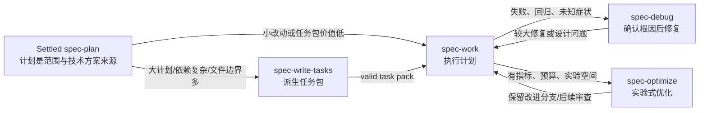
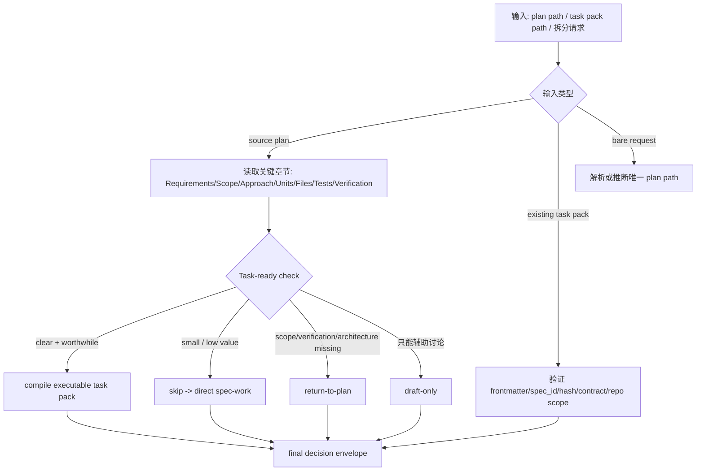
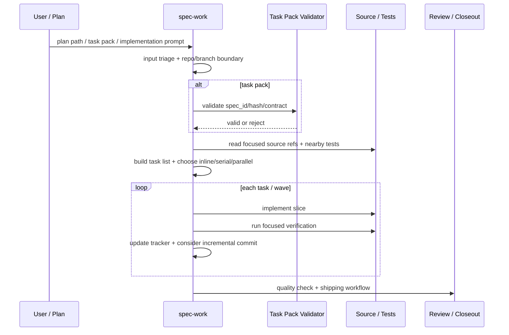
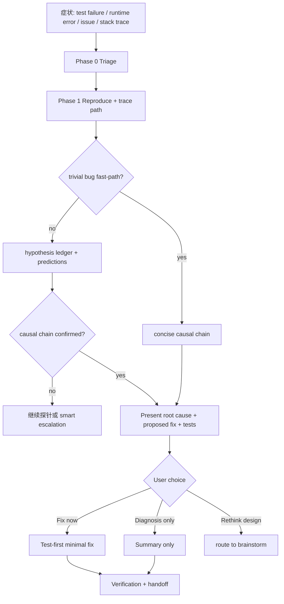
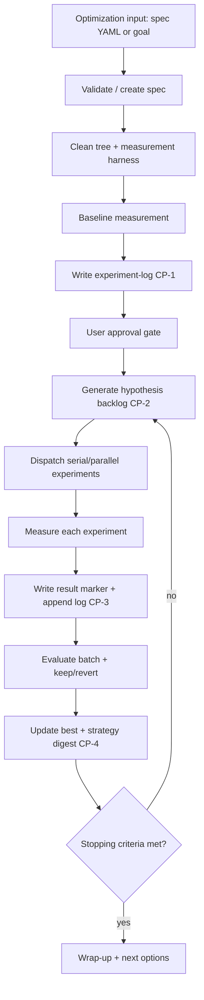

本页解释 Spec First 在“计划已经足够收敛之后”如何把工程工作推进到可执行、可验证、可调试、可优化的闭环：`spec-write-tasks` 负责把较大的 settled plan 压缩成可消费的任务包，`spec-work` 负责在当前仓库边界内执行计划或任务包，`spec-debug` 负责在症状与失败出现时先确认根因再修复，`spec-optimize` 负责在有明确指标和预算时运行实验式优化循环；本页不覆盖需求发散、PRD、计划编写、结构化代码评审或知识沉淀的完整机制，这些应分别阅读 [需求发散、PRD 与计划编写工作流](20-xu-qiu-fa-san-prd-yu-ji-hua-bian-xie-gong-zuo-liu)、[结构化代码评审与多 Agent 合成机制](22-jie-gou-hua-dai-ma-ping-shen-yu-duo-agent-he-cheng-ji-zhi) 与 [Compound 知识沉淀与经验复用边界](24-compound-zhi-shi-chen-dian-yu-jing-yan-fu-yong-bian-jie)。Sources: [spec-write-tasks/SKILL.md](skills/spec-write-tasks/SKILL.md#L9-L12), [spec-work/SKILL.md](skills/spec-work/SKILL.md#L11-L14), [spec-debug/SKILL.md](skills/spec-debug/SKILL.md#L7-L10), [spec-optimize/SKILL.md](skills/spec-optimize/SKILL.md#L7-L10)

## 架构假设：四个入口不是线性阶段，而是按证据类型分工

本页的核心架构假设是：**任务拆分、执行、调试、优化并不是同一个“大执行命令”的不同按钮，而是四类证据姿态**。任务拆分处理“计划是否需要派生执行索引”，执行处理“在已定边界内交付变更”，调试处理“症状到根因的因果链”，优化处理“指标、预算、实验日志驱动的迭代改进”；每个入口都有明确的使用条件、输出、失败模式和下游消费者，因此开发者应先判断当前问题缺少的是任务边界、实现变更、根因证据，还是可度量改进目标。Sources: [spec-write-tasks/SKILL.md](skills/spec-write-tasks/SKILL.md#L13-L45), [spec-work/SKILL.md](skills/spec-work/SKILL.md#L15-L47), [spec-debug/SKILL.md](skills/spec-debug/SKILL.md#L13-L45), [spec-optimize/SKILL.md](skills/spec-optimize/SKILL.md#L11-L43)

这个图表达的是“证据驱动路由”：`spec-write-tasks` 只在任务包能降低执行风险或上下文负载时介入，并且任务包永远不能替代 source plan；`spec-work` 可以直接消费 settled plan，也可以消费验证过的 task pack；`spec-debug` 不以“先改代码”为目标，而是先复现、追踪、确认 causal chain；`spec-optimize` 只有在存在可重复测量目标、范围和预算时才启动。Sources: [spec-write-tasks/SKILL.md](skills/spec-write-tasks/SKILL.md#L47-L50), [spec-work/SKILL.md](skills/spec-work/SKILL.md#L186-L235), [spec-debug/SKILL.md](skills/spec-debug/SKILL.md#L108-L128), [spec-optimize/SKILL.md](skills/spec-optimize/SKILL.md#L87-L101)

## 入口选择矩阵

| 当前情况 | 应使用 | 不应使用 | 决策理由 |
|---|---|---|---|
| settled plan 很大、依赖链明显、文件边界多，执行者需要先拆分才能安全推进 | `spec-write-tasks` | 直接把大计划压给 `spec-work` | 任务包能显式化依赖、文件边界、验证焦点和并行机会 |
| 小改动、1-2 个文件、浅依赖，计划已经足够直接 | `spec-work` | `spec-write-tasks` | 派生层会增加携带成本，跳过不是遗漏 |
| 已有 task pack，需要确认是否能交给执行 | `spec-write-tasks` validate-only 或 `spec-work` 内置验证 | 直接按 Markdown 勾选执行 | 必须检查 `spec_id`、`source_plan_hash`、结构契约与 repo scope |
| 测试失败、运行时报错、回归、堆栈或 issue 症状 | `spec-debug` | 普通 feature execution | 需要先复现并建立完整根因链 |
| 希望“变快、变准、变好”，且能定义指标、测量命令、预算与实验边界 | `spec-optimize` | 无指标的普通实现或模糊优化 | 优化入口要求 baseline、实验日志、停止条件和预算门禁 |

这张表的关键不是记命令名，而是识别**当前缺少哪种确定性**：缺任务切片时拆分，缺实现时执行，缺因果解释时调试，缺可度量改进路径时优化。Sources: [spec-write-tasks/SKILL.md](skills/spec-write-tasks/SKILL.md#L51-L69), [spec-work/SKILL.md](skills/spec-work/SKILL.md#L138-L183), [spec-debug/SKILL.md](skills/spec-debug/SKILL.md#L15-L22), [spec-optimize/SKILL.md](skills/spec-optimize/SKILL.md#L13-L20)

## 任务拆分：把计划压缩成可执行索引，而不是改写计划

`spec-write-tasks` 位于 `spec-plan` 与 `spec-work` 之间，是一个**可选派生层**：它不执行代码，而是把 settled plan 压缩成更容易被 `spec-work` 消费的 task pack，使依赖关系、文件边界、验证焦点和并行机会显式化。任务包的定位非常严格：它是 derived execution index，不是第二份计划，也不能改变 scope、acceptance criteria 或 non-goals。Sources: [spec-write-tasks/SKILL.md](skills/spec-write-tasks/SKILL.md#L7-L12), [spec-write-tasks/SKILL.md](skills/spec-write-tasks/SKILL.md#L71-L84)

任务拆分的准入条件是“拆分会降低风险或上下文负载”：例如计划较大、包含多个实现单元、存在清晰依赖链或文件边界、需要单独的任务文档作为 `spec-work` 输入；反过来，小改动、少量文件、浅依赖、仍在选择产品/架构/验收边界、或者用户真正想要立即实现时，不应强行生成任务包。Sources: [spec-write-tasks/SKILL.md](skills/spec-write-tasks/SKILL.md#L51-L69)

拆分算法按语义顺序工作：先抽取需求、边界、实现单元、文件、验证与 deferred unknowns；再识别共享 schema、contract、adapter、fixture、测试 helper、CLI surface 等 foundation；然后决定每个 unit 是保持一个任务、拆成 vertical story tasks，还是与邻近 unit 合并；之后构建真实输出依赖图、分配 waves、写 task cards，并在输出前检查 traceability、scope、granularity、dependency、verification 与 consumption readiness。Sources: [spec-write-tasks/SKILL.md](skills/spec-write-tasks/SKILL.md#L191-L218)

可执行 task pack 必须写入 `docs/tasks/YYYY-MM-DD-NNN-<type>-<slug>-tasks.md`，正文包含 Overview、Source Summary、Traceability Matrix、Task Graph、Execution Waves、Task Pack Contract、Task Cards、Orientation Evidence、Validation Notes 与 Regeneration Rules；真正能交给 `spec-work` 的条件是匹配 `spec_id`、可验证 `source_plan_hash`、有效 machine-readable `Task Pack Contract`，并且语义审查可接受。Sources: [spec-write-tasks/SKILL.md](skills/spec-write-tasks/SKILL.md#L235-L270)

## 执行：从计划或任务包交付完整变更

`spec-work` 的职责是执行已经准备好的工作文档或具体实现请求，输出 scoped code/docs/config changes、focused verification results、review/residual status，以及紧凑的完成响应；它的失败模式包括 repo scope 模糊、task pack 过期或不可验证、hash/spec_id 不匹配、超出计划范围、不安全分支/worktree 状态以及验证失败。Sources: [spec-work/SKILL.md](skills/spec-work/SKILL.md#L17-L43)

执行开始时，`spec-work` 会把 plan 视为 decision artifact，而不是逐行脚本；如果输入是 validated task pack，则 task pack 提供 execution order、task boundaries、file focus、`stop_if` 和 validation notes，而 `source_plan` 仍然是 scope、requirements 和 non-goals 的唯一来源。Sources: [spec-work/SKILL.md](skills/spec-work/SKILL.md#L186-L200)

`spec-work` 对 task pack 的验证是硬边界：执行前要确认 `type: task-pack`、`generated_by: spec-write-tasks`、`status: derived`、`mode: derived`，读取 source plan，匹配 `spec_id`，确认 `source_plan_hash` 是具体 canonical body hash，并运行 `spec-first tasks validate <task-pack-path> --json`；draft、transient、missing-source、missing-spec-id、spec-id-mismatch、missing-hash、hash-mismatch 等情况都必须拒绝执行。Sources: [spec-work/SKILL.md](skills/spec-work/SKILL.md#L195-L209)

执行策略根据任务数量、依赖结构与宿主隔离能力选择：1-2 个小任务或需要用户互动时 inline；3 个以上且有依赖时可用 serial subagents；3 个以上且通过 parallel safety check 时可用 parallel subagents；并行前必须建立 file-to-unit mapping，检查文件交集，并根据 Claude Code worktree isolation、shared-directory、Codex fork workspace 或无 subagent 支持来决定是否允许重叠。Sources: [spec-work/SKILL.md](skills/spec-work/SKILL.md#L305-L340)

执行循环强调 vertical slice 和连续反馈：每个任务先读计划、任务包或 Phase 0 发现的相关文件，查找相似模式和测试，按现有约定实现，补充或调整测试，运行系统级测试检查和相关测试，确认行为变更是否有验证依据，再标记任务完成并评估是否形成增量提交。Sources: [spec-work/SKILL.md](skills/spec-work/SKILL.md#L372-L425)

增量提交不是机械地“每个步骤都提交”，而是在逻辑单元完成、测试通过、即将切换上下文或要尝试风险变更时提交；如果只能写出 “WIP” 或 “partial X” 的提交信息，就应等待。对于 task pack，`Task Cards`、`Execution Waves`、`dependencies` 和 `task_id` 是提交边界的起点，但实际边界仍要根据实现中发现的情况调整。Sources: [spec-work/SKILL.md](skills/spec-work/SKILL.md#L428-L462)

执行阶段还内置了持续质量纪律：遵循现有模式，使用计划引用的相似代码，按项目约定命名和复用组件；测试应在每次显著变更后运行，而不是积累到最后；完成若干相关单元后再做简化，避免早期过度抽象，也避免多 subagent 产出的重复模式长期残留。Sources: [spec-work/SKILL.md](skills/spec-work/SKILL.md#L463-L486)

## 调试：先建立因果链，再决定是否修复

`spec-debug` 用于 failing tests、runtime errors、broken behavior、regressions、stack traces、issue references 或多次失败的修复尝试；它不用于计划内 feature implementation、需求/计划审查、setup/update/runtime drift repair 或明显非 bug 的增强。它的核心原则是先调查再修复：没有完整 causal chain，就不能提出修复方案。Sources: [spec-debug/SKILL.md](skills/spec-debug/SKILL.md#L13-L22), [spec-debug/SKILL.md](skills/spec-debug/SKILL.md#L61-L69)

调试入口按四个阶段运行：Phase 0 triage 解析输入和 issue 证据；Phase 1 investigate 复现 bug 并追踪代码路径；Phase 2 root cause 形成带预测的假设并通过 causal chain gate；Phase 3 fix 在用户选择修复时做 test-first 的最小修复；Phase 4 handoff 输出结构化总结。Sources: [spec-debug/SKILL.md](skills/spec-debug/SKILL.md#L108-L128)

复现阶段要求用最小反馈回路观察症状，例如失败测试、CLI 调用、HTTP/browser 脚本、trace replay、throwaway harness、property/fuzz loop 或其他具体 reproducer；如果无法复现，需要记录尝试过的路径和缺失条件，而不能把直觉写成 root cause confirmed。Sources: [spec-debug/SKILL.md](skills/spec-debug/SKILL.md#L153-L180), [spec-debug/SKILL.md](skills/spec-debug/SKILL.md#L124-L128)

根因阶段要求从触发条件一路解释到观察到的症状，中间不能有 “somehow” 式断点；对于非显然链路，要形成 prediction，并用不同代码路径或场景验证它。若预测失败但修复“看起来有效”，这说明可能只是修了症状，根因仍未确认。Sources: [spec-debug/SKILL.md](skills/spec-debug/SKILL.md#L207-L228)

修复阶段只有在用户选择 “Fix it now” 后进行，并遵循 test-first：读取附近测试约定，写能捕捉 bug 的 failing test 或使用现有 failing test，确认失败原因正确，实施最小修复，复跑测试，再自审每一行变更，最后运行更广泛的回归测试；三次修复失败后应回到根因阶段，而不是继续叠加改动。Sources: [spec-debug/SKILL.md](skills/spec-debug/SKILL.md#L274-L300)

## 优化：用指标、预算和实验日志驱动改进

`spec-optimize` 面向可度量目标的迭代优化：先定义目标和 measurement scaffolding，再运行 serial 或 parallel experiments，用 hard gates 或 LLM-as-judge 分数衡量，保留改进、拒绝退化，并收敛到更优解。它不适合普通实现、没有指标的模糊改进、没有反馈回路的调试，或没有预算/并发上限的开放式探索。Sources: [spec-optimize/SKILL.md](skills/spec-optimize/SKILL.md#L7-L20)

优化入口的 admission gate 很硬：必须有 repeatable measurement target、至少一个便宜的 degenerate gate、measurement command 或明确的 harness 构建计划、显式 mutable/immutable scope、有限 experiment budget、execution mode 与 max_concurrent；judge 模式还需要有限的成本上限，除非用户明确批准 uncapped spend。Sources: [spec-optimize/SKILL.md](skills/spec-optimize/SKILL.md#L87-L101)

优化的持久化纪律是它区别于普通执行的核心：experiment log on disk 是单一事实来源，conversation context 不是 durable storage；每个实验测量后必须立即写入磁盘并读回验证，批次结束后还要更新 best、outcomes、strategy digest 与 hypothesis backlog。Sources: [spec-optimize/SKILL.md](skills/spec-optimize/SKILL.md#L119-L180), [spec-optimize/SKILL.md](skills/spec-optimize/SKILL.md#L543-L583)

baseline 阶段会运行 measurement harness，必要时重复多次并聚合，记录 gate 和 diagnostics；在进入假设生成前，必须把 baseline 写入 `.spec-first/workflows/spec-optimize/<spec-name>/experiment-log.yaml` 并验证文件内容，然后把 baseline metrics、日志位置、parallel readiness、clean-tree status、worktree budget 和 judge budget 呈现给用户，得到明确批准后才能进入 Phase 2。Sources: [spec-optimize/SKILL.md](skills/spec-optimize/SKILL.md#L361-L438)

实验循环中，每个 hypothesis 会按 serial 或 parallel 模式执行；每个实验完成后先运行 measurement，写 crash-recovery marker，评估 degenerate gates，必要时运行 judge sampling，然后立即追加 experiment log 并验证写入；批次评估时只保留超过噪声阈值或 judge minimum improvement 的改进，runner-up 只有在文件级 disjoint 且组合后仍更优时才会被保留。Sources: [spec-optimize/SKILL.md](skills/spec-optimize/SKILL.md#L494-L638)

## 四类工作流的产物与边界

| 工作流 | 主要输入 | 主要产物 | 关键边界 | 典型下一步 |
|---|---|---|---|---|
| `spec-write-tasks` | local source plan、existing task pack、明确可解析的拆分请求 | `docs/tasks/*-tasks.md` 或 decision envelope | 不改 scope，不执行代码，不替代 plan | `spec-work` 或 task-pack review |
| `spec-work` | validated task pack、settled plan、具体实现请求 | repo diff、验证结果、completion response、必要时提交/PR 证据 | 不执行 stale/unverifiable task pack，不扩展计划范围 | code review、commit/PR、release |
| `spec-debug` | bug 描述、issue、error、test failure、日志 | root-cause summary、fix、验证结果、debug handoff | 未确认 causal chain 不修复；不可复现要披露 | 较大修复转 `spec-work`，设计问题转 brainstorm |
| `spec-optimize` | optimization spec 或可度量目标 | `.spec-first/workflows/spec-optimize/<spec-name>/` 下的 spec/log/digest、实验分支与保留改进 | 无指标、无预算、无测量命令不启动 | code review、compound learning、PR |

这张表体现了一个统一治理原则：**可执行性来自身份、范围、证据和反馈回路，而不是来自 Markdown 看起来像任务列表**。task pack 需要身份与 hash，执行需要 repo 与 scope，调试需要复现与因果链，优化需要 baseline 与实验日志。Sources: [spec-write-tasks/SKILL.md](skills/spec-write-tasks/SKILL.md#L272-L303), [spec-work/SKILL.md](skills/spec-work/SKILL.md#L31-L39), [spec-debug/SKILL.md](skills/spec-debug/SKILL.md#L27-L41), [spec-optimize/SKILL.md](skills/spec-optimize/SKILL.md#L25-L39)

## 常见误用与纠偏

| 误用 | 风险 | 正确做法 |
|---|---|---|
| 把 task pack 当成新的计划 | scope、acceptance、non-goals 被二次改写 | 回到 source plan；task pack 只重排执行切片 |
| task pack hash 不匹配仍继续执行 | stale 或 wrong-chain handoff 被静默执行 | 停止，重新从 source plan 生成或验证 |
| 先改 bug 再找证据 | 修到症状而不是根因 | 先复现、追踪、通过 causal chain gate |
| “优化一下”但没有指标 | 实验不可比较，成本不可控 | 先定义 metric、gate、measurement、scope、budget |
| 并行 subagents 共享文件或共享目录乱改 | git index contention、测试互相污染、冲突难归因 | 做 file overlap check，并按宿主隔离能力降级到 serial |

这些纠偏并不是流程洁癖，而是为了防止 AI 执行中最常见的失败模式：看似推进很快，实际把范围、证据和状态混在一起，最后无法判断改动是否来自正确计划、是否修到根因、是否真的变好。Sources: [spec-write-tasks/SKILL.md](skills/spec-write-tasks/SKILL.md#L71-L84), [spec-work/SKILL.md](skills/spec-work/SKILL.md#L201-L223), [spec-debug/SKILL.md](skills/spec-debug/SKILL.md#L70-L78), [spec-optimize/SKILL.md](skills/spec-optimize/SKILL.md#L119-L143)

## 推荐阅读路径

如果你刚进入工作流系统，建议先阅读 [需求发散、PRD 与计划编写工作流](20-xu-qiu-fa-san-prd-yu-ji-hua-bian-xie-gong-zuo-liu)，理解 settled plan 如何形成；然后阅读本页，把 plan 如何进入任务拆分、执行、调试和优化串起来；接着阅读 [结构化代码评审与多 Agent 合成机制](22-jie-gou-hua-dai-ma-ping-shen-yu-duo-agent-he-cheng-ji-zhi)，理解执行后的审查闭环；如果你需要理解跨工作流 handoff 的数据形态，再阅读 [Workflow Contract、Artifact Summary 与 Handoff 协议](25-workflow-contract-artifact-summary-yu-handoff-xie-yi) 与 [Verification Profile、Schema 校验与质量反馈](26-verification-profile-schema-xiao-yan-yu-zhi-liang-fan-kui)。Sources: [spec-write-tasks/SKILL.md](skills/spec-write-tasks/SKILL.md#L43-L45), [spec-work/SKILL.md](skills/spec-work/SKILL.md#L45-L47), [spec-debug/SKILL.md](skills/spec-debug/SKILL.md#L43-L45), [spec-optimize/SKILL.md](skills/spec-optimize/SKILL.md#L41-L43)