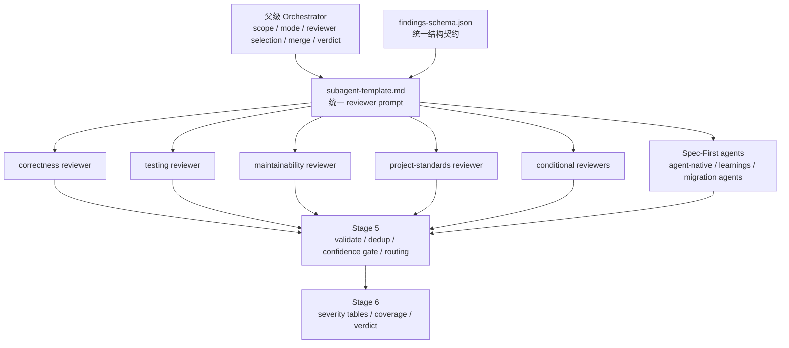
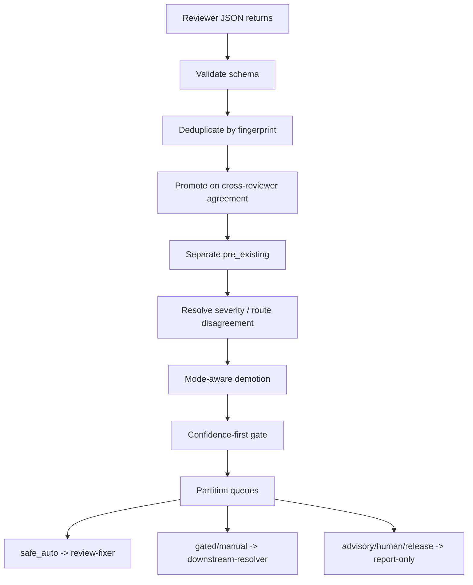

本页解释 `/spec:code-review` 如何把一次代码评审拆成“范围解析 → reviewer 选择 → 并行派发 → 结构化返回 → 合并去重 → 置信度门控 → 输出/修复/交接”的闭环。我的架构假设是：这个工作流不是“让多个模型各说各话”，而是一个由父级 orchestrator 控制的审查编译器；leaf reviewer 只负责只读分析并返回 schema 化证据，最终发现、路由、置信度提升、降噪和报告格式都由 orchestrator 统一裁决。该假设由 Skill 描述、Workflow 合约、Stage 3/4/5/6 的执行规则、schema 与输出模板共同验证。Sources: [SKILL.md](skills/spec-code-review/SKILL.md#L7-L10), [SKILL.md](skills/spec-code-review/SKILL.md#L21-L40), [SKILL.md](skills/spec-code-review/SKILL.md#L738-L794)

## 工作流在整体研发链路中的位置

`/spec:code-review` 位于 `Code → Review → Knowledge` 的交界处：它消费当前分支 diff、PR 元数据、计划/任务/执行产物、项目标准、测试和日志证据，输出合并后的 findings、residual actionable work、Coverage 与 verdict；被接受的可复用模式可以被后续知识沉淀入口处理，但代码评审本身不会自动写入知识库或创建 PR。Sources: [workflow-skill-agent-map.md](docs/workflow-skill-agent-map.md#L6-L19), [SKILL.md](skills/spec-code-review/SKILL.md#L21-L43), [SKILL.md](skills/spec-code-review/SKILL.md#L852-L856)

```mermaid
flowchart LR
  Code[代码变更 / Diff] --> Review[/spec:code-review/]
  Review --> Findings[结构化 Findings]
  Review --> Fixes[safe_auto 修复队列]
  Review --> Residual[Residual Actionable Work]
  Review --> Coverage[Coverage / 证据限制]
  Findings --> PR[PR 准备或人工评审]
  Residual --> Work[后续 downstream-resolver]
  Coverage --> Quality[质量判断与风险披露]
  Review -. advisory only .-> Compound[/spec:compound/ 知识沉淀建议]
```

上图只表达本页边界内的审查产物流向：`spec-code-review` 可以向 `spec-work`、PR 准备、人类 reviewer 或 `spec-compound` 提供下游输入，但它不拥有提交、推送、创建 PR 或自动运行知识沉淀的决策权。Sources: [SKILL.md](skills/spec-code-review/SKILL.md#L41-L43), [SKILL.md](skills/spec-code-review/SKILL.md#L156-L163), [SKILL.md](skills/spec-code-review/SKILL.md#L172-L183), [SKILL.md](skills/spec-code-review/SKILL.md#L852-L856)

## 核心设计：父级编排器与只读 reviewer 的分工

`spec-code-review` 的中心抽象是 **orchestrator-owned synthesis**：父级 workflow 负责解析参数、确定 diff scope、发现计划、选择 reviewer、检查运行时派发能力、调度并发、持久化可选 artifact、合并结果和生成最终报告；各 reviewer 是只读分析 agent，只返回结构化 JSON，不写文件、不修改源码、不切分自己的工作流。Sources: [SKILL.md](skills/spec-code-review/SKILL.md#L115-L130), [SKILL.md](skills/spec-code-review/SKILL.md#L477-L533), [SKILL.md](skills/spec-code-review/SKILL.md#L621-L641), [SKILL.md](skills/spec-code-review/SKILL.md#L690-L704)



这个分工避免了两个常见失败模式：第一，leaf reviewer 自行扩大范围或执行写操作；第二，多个 reviewer 的非结构化意见直接堆叠到最终报告。模板明确要求 reviewer “RETURN JSON to the parent”，并强调 artifact 由 orchestrator 写入；Skill 也要求 synthesis 拥有最终 route，并在 reviewer 意见冲突时选择更保守路径。Sources: [subagent-template.md](skills/spec-code-review/references/subagent-template.md#L20-L39), [subagent-template.md](skills/spec-code-review/references/subagent-template.md#L121-L128), [SKILL.md](skills/spec-code-review/SKILL.md#L212-L217), [SKILL.md](skills/spec-code-review/SKILL.md#L666-L670)

## 输入模式与运行模式

工作流接受当前分支 diff、PR URL/编号、分支目标、显式 `base:<sha-or-ref>`、可选 `plan:<path>`，以及 `mode:autofix`、`mode:report-only`、`mode:headless` 三类模式 token；未指定模式时进入 interactive。冲突模式会在派发 reviewer 前停止，headless 模式缺少可确定 diff scope 也会停止，这保证编排器不会在上下文不明确时启动多 agent 审查。Sources: [SKILL.md](skills/spec-code-review/SKILL.md#L21-L27), [SKILL.md](skills/spec-code-review/SKILL.md#L117-L130), [SKILL.md](skills/spec-code-review/SKILL.md#L143-L151), [SKILL.md](skills/spec-code-review/SKILL.md#L172-L183)

| 模式 | 是否可写 | 是否交互 | reviewer 派发要求 | 典型输出 |
|---|---:|---:|---|---|
| interactive | 可自动应用 `safe_auto` | 是 | 可用则多 persona；不可用则只读 fallback | 人类可读 severity 表、Coverage、verdict |
| autofix | 仅 `safe_auto` | 否 | 需要安全派发/修复能力 | run artifact、已修复项、残留工作摘要 |
| report-only | 否 | 否 | 可多 agent；也可安全 fallback | 只读报告，不写 artifact |
| headless | 仅单轮 `safe_auto` | 否 | 需要可确定 diff scope 与安全派发 | 结构化文本 envelope 与 `Review complete` 信号 |

模式不仅改变输出格式，也改变副作用边界：`report-only` 明确不写 `<review-artifact-dir>/`，不编辑文件、不提交、不创建 PR；`autofix` 与 `headless` 只能应用 `safe_auto -> review-fixer`，并且永不提交、推送或创建 PR；interactive 则在安全边界内可以走用户确认、最佳判断或后续交接。Sources: [SKILL.md](skills/spec-code-review/SKILL.md#L156-L168), [SKILL.md](skills/spec-code-review/SKILL.md#L172-L183), [SKILL.md](skills/spec-code-review/SKILL.md#L185-L189)

## Diff scope 是所有 reviewer 的共同事实底座

Stage 1 的任务是计算 base、文件列表、diff 和 untracked 文件列表；`base:` 快路径直接跳过 base branch 推断，用指定 ref 计算 merge-base 并输出 `BASE`、`FILES`、`DIFF`、`UNTRACKED` 四段信息。PR 模式会先读取 PR 状态、标题、正文、base/head、URL 和既有评论信号，再用本地 checkout 对 base 分支计算 diff，而不是把 `gh pr diff` 作为最终 scope。Sources: [SKILL.md](skills/spec-code-review/SKILL.md#L287-L306), [SKILL.md](skills/spec-code-review/SKILL.md#L308-L373)

untracked 文件被显式排除在审查范围外，除非用户先将其纳入 Git；headless/autofix 不会停下来追问，而是在 Coverage 中说明被排除的 untracked 文件。这个规则把“审查事实”限定在可追踪 diff 内，避免 reviewer 对本地未纳入版本控制的文件产生不可复现判断。Sources: [SKILL.md](skills/spec-code-review/SKILL.md#L431-L431), [SKILL.md](skills/spec-code-review/SKILL.md#L862-L865)

## Reviewer 选择：规模感知的核心层 + 条件层

Reviewer 选择先运行规模感知 preflight，记录文件数、排除的 untracked 数、非测试/非生成/非 lockfile 的 executable line 数、是否 docs-only、是否 simple config-only、是否 sensitive diff、是否有 prior comments、是否显式 plan 等事实；只有当变更小、无敏感路径、无 prior comments、无显式 plan 且没有排除 untracked 时，才可使用最小 reviewer 集。Sources: [SKILL.md](skills/spec-code-review/SKILL.md#L477-L533)

| Diff 类别 | 核心 reviewer 集 | 使用条件 |
|---|---|---|
| docs-only | project-standards、maintainability | 小范围文档/示例/非运行时代码 |
| simple config-only | correctness、testing、project-standards | 配置/CI/package 元数据且无执行源码 |
| tiny executable diff | correctness、testing、maintainability | 非敏感且 executable line 数较小 |
| medium / broad / sensitive / unclear | correctness、testing、maintainability、project-standards、agent-native、learnings | 任一最小集条件不满足或事实不明 |

完整默认核心包括 `spec-correctness-reviewer`、`spec-testing-reviewer`、`spec-maintainability-reviewer`、`spec-project-standards-reviewer`，再加两个 Spec-First 特定 agent：`spec-agent-native-reviewer` 和 `spec-learnings-researcher`。条件 reviewer 进一步覆盖 security、performance、API contract、data migrations、reliability、adversarial、CLI readiness、previous comments，以及 Rails、Python、TypeScript、frontend races、Swift/iOS 等栈特定视角。Sources: [SKILL.md](skills/spec-code-review/SKILL.md#L219-L267), [persona-catalog.md](skills/spec-code-review/references/persona-catalog.md#L5-L63)

条件选择不是关键词匹配，而是 orchestrator 阅读 diff 后的判断；persona catalog 明确要求先运行 Stage 3 preflight，再对 cross-cutting、stack-specific 和 Spec-First conditional agents 逐类判断，并在派发前公告 reviewer team 和每个条件 reviewer 的选择理由。Sources: [persona-catalog.md](skills/spec-code-review/references/persona-catalog.md#L64-L71), [SKILL.md](skills/spec-code-review/SKILL.md#L535-L566)

## 运行时与 dispatch gate：多 Agent 是能力，不是默认假设

Stage 4 在创建 run ID 或派发 reviewer 前，会执行只读 host/runtime readiness preflight；Codex、Claude runtime 与 source checkout 分别有不同的 `detect-tools.sh` 路径。该 preflight 只解释运行时是否适合派发，不决定审查质量或 diff scope；required MCP 启动/配置失败是 runtime boundary issue，不是代码 finding。Sources: [SKILL.md](skills/spec-code-review/SKILL.md#L589-L610)

派发还必须通过 dispatch capability gate：当前 host 必须暴露 dispatch primitive，当前权限边界必须允许 subagents/parallel agents/delegated review，且选中的 reviewers 必须属于文档化的代码审查阶段。若 dispatch 不可用、被禁用或不安全，工作流进入 single-agent report-only fallback，父级 orchestrator 串行应用所选 persona lenses，不创建 artifact 目录、不写 reviewer artifacts、不运行 validator 或 fixer。Sources: [SKILL.md](skills/spec-code-review/SKILL.md#L621-L641)

这解释了 `spec-code-review` 的一个重要工程立场：多 agent 并行是可用时的加速和隔离机制，不是绕过宿主边界的理由。Skill 明确禁止在缺少 dispatch 能力时调用隐藏 helper 或外部 CLI 伪装成 agent，也禁止从代码评审创建未文档化的 implement/check agents。Sources: [SKILL.md](skills/spec-code-review/SKILL.md#L271-L273), [SKILL.md](skills/spec-code-review/SKILL.md#L623-L632)

## 并发调度、模型分层与 artifact 边界

派发时，`spec-correctness-reviewer`、`spec-security-reviewer`、`spec-adversarial-reviewer` 继承 session model，因为它们承担最高风险的逻辑、安全与对抗性分析；其他 persona 与 Spec-First agents 在宿主提供稳定中档 alias 时使用中档模型。orchestrator 自身也继承 session model，因为意图发现、reviewer 选择、合并去重和综合裁决需要与用户配置一致的推理能力。Sources: [SKILL.md](skills/spec-code-review/SKILL.md#L643-L649), [SKILL.md](skills/spec-code-review/SKILL.md#L676-L680)

并发调度是有界的：编排器尊重 harness 的 active-subagent limit，队列化 reviewer，只派发宿主接受的数量；容量/线程限制类错误被视为 backpressure 而非 reviewer failure，并在 slot 释放后重试。Codex 默认最多 4 个 active reviewer agent，除非 runtime 明确给出不同安全上限。Sources: [SKILL.md](skills/spec-code-review/SKILL.md#L680-L688)

run artifact 是会话/编排器 handoff，不是 repo-local durable truth；非 report-only 模式会在 OS temp 下生成 `<review-artifact-dir>`，并把 reviewer JSON 作为父级可选 cache 写入该目录。leaf reviewer 只拿到 run metadata 用于关联，不直接写文件；report-only 和 single-agent fallback 都跳过 run ID 与目录创建。Sources: [SKILL.md](skills/spec-code-review/SKILL.md#L152-L155), [SKILL.md](skills/spec-code-review/SKILL.md#L651-L670), [SKILL.md](skills/spec-code-review/SKILL.md#L704-L732)

## Reviewer 输出契约：schema 化 finding 而不是自由文本

每个 persona reviewer 返回统一 JSON：顶层包含 `reviewer`、`findings`、`residual_risks`、`testing_gaps`；每条 finding 必须包含 title、severity、file、line、why_it_matters、autofix_class、owner、requires_verification、confidence、evidence、pre_existing 等字段。schema 将发现拆为 merge-tier 与 detail-tier：前者用于合并、去重和路由，后者用于输出解释和 headless 细节。Sources: [findings-schema.json](skills/spec-code-review/references/findings-schema.json#L1-L29), [findings-schema.json](skills/spec-code-review/references/findings-schema.json#L133-L137)

| 字段组 | 关键字段 | 主要用途 |
|---|---|---|
| 定位 | `file`, `line`, `title` | 形成 fingerprint、输出表格定位 |
| 严重度 | `severity: P0-P3` | 决定修复优先级与 verdict 权重 |
| 置信度 | `confidence: 0/25/50/75/100` | 决定是否进入 primary findings |
| 路由 | `autofix_class`, `owner`, `requires_verification`, `suggested_fix` | 决定自动修复、下游交接或人工判断 |
| 证据 | `why_it_matters`, `evidence[]`, `pre_existing` | 支撑解释、验证与 pre-existing 分离 |
| 软信号 | `residual_risks`, `testing_gaps` | 承接无法确认为 primary finding 的风险和测试缺口 |

置信度是离散 anchor，而不是连续概率：0/25 表示不应发出或不应报告，50 表示真实但低影响或窄范围信号，75 表示已双检并会影响用户/调用方/运行时，100 表示可从代码本身确定。该离散设计防止 reviewer 输出“0.73”这类不可校准伪精度。Sources: [findings-schema.json](skills/spec-code-review/references/findings-schema.json#L72-L80), [findings-schema.json](skills/spec-code-review/references/findings-schema.json#L102-L114), [subagent-template.md](skills/spec-code-review/references/subagent-template.md#L43-L56)

`autofix_class` 与 `owner` 是行动路由轴，而不是严重度轴：`safe_auto` 表示本地、确定、可由 in-skill fixer 自动应用；`gated_auto` 表示有具体修复但涉及行为/合约/权限等敏感边界；`manual` 表示需要设计或跨切面决策；`advisory` 表示仅报告的信息或运行/发布注意事项。Sources: [SKILL.md](skills/spec-code-review/SKILL.md#L201-L217), [findings-schema.json](skills/spec-code-review/references/findings-schema.json#L121-L132)

## 合成机制：校验、去重、提升、降噪、分区

Stage 5 把多个 reviewer JSON returns 编译为一个 deduplicated、confidence-gated finding set。第一步是 schema 校验：顶层字段、finding 必填字段、枚举值、布尔值、正整数 line 和离散 confidence anchor 不合格时会被丢弃，并记录 drop count；detail-tier 字段坏掉但 merge-tier 有效时，只能在当前输出模式可安全省略细节的情况下保留，并在 Coverage 记录降级。Sources: [SKILL.md](skills/spec-code-review/SKILL.md#L738-L754)

去重使用 `normalize(file) + line_bucket(line, +/-3) + normalize(title)` 作为 fingerprint；匹配时保留最高 severity、最高 anchor，并记录哪些 reviewer 共同发现。若两个以上独立 reviewer 命中同一 fingerprint，合成阶段会把 anchor 提升一级，例如 50→75 或 75→100，因为跨 reviewer corroboration 比单个视角更强。Sources: [SKILL.md](skills/spec-code-review/SKILL.md#L755-L756)

冲突处理遵循保守原则：若多个 reviewer 对同一区域的 severity、autofix_class 或 owner 不一致，最终输出会标注分歧并保留更保守路径；synthesis 可以把 `safe_auto` 收窄到 `gated_auto` 或 `manual`，但不能在没有新证据时把它放宽。Sources: [SKILL.md](skills/spec-code-review/SKILL.md#L757-L760)



降噪发生在 primary findings 进入最终报告前：P2/P3、`advisory`、且只由 testing 或 maintainability 贡献的弱质量信号，在 interactive/report-only 中进入 `testing_gaps` 或 `residual_risks`，在 headless/autofix 中被抑制并记录计数。随后 confidence-first gate 抑制低于 75 的 primary findings；例外是 P0 且 anchor ≥50 的 critical-but-uncertain 风险不能被静默丢弃。Sources: [SKILL.md](skills/spec-code-review/SKILL.md#L774-L787)

最终分区把可执行工作拆为三类：只有 `safe_auto -> review-fixer` 进入 in-skill fixer queue；未解决的 `gated_auto` 或 `manual` 且 owner 为 `downstream-resolver` 的问题进入 residual actionable queue；`advisory`、human-owned 或 release-owned 项进入 report-only queue。排序按 P0→P3、anchor 降序、文件路径和行号，并在完整 primary set 上分配稳定编号。Sources: [SKILL.md](skills/spec-code-review/SKILL.md#L788-L794)

## 验证 pass：外部化前的独立复核

Stage 5b 是可选的 independent verification gate：在 headless、autofix、interactive 的 File-tickets 路由中运行；report-only、single-agent fallback、interactive report-only 路由和 best-judgment fixer 路径不运行。它为每个需要外部化的 surviving finding 派发一个独立 validator sub-agent，重新检查 diff、周边代码、调用方、guard、framework defaults 和 git blame。Sources: [SKILL.md](skills/spec-code-review/SKILL.md#L796-L817)

每条 finding 独立验证，而不是批量验证；当需要验证的 finding 超过 15 条，只验证最高严重度和最高 anchor 的 15 条，其余记录为 over-budget drop。validator 返回 `{ validated: true | false, reason }`；false、timeout、dispatch error 或 malformed JSON 都会导致 finding 被丢弃并在 Coverage 中记录原因。Sources: [SKILL.md](skills/spec-code-review/SKILL.md#L818-L836)

这个设计的核心目的不是提高吞吐，而是降低 persona bias：单个批量 validator 容易沿着原有 finding pattern 做确认偏误，逐条独立 validator 则保留“ fresh context ”的反证价值，同时仍受 Stage 4 的有界调度约束。Sources: [SKILL.md](skills/spec-code-review/SKILL.md#L836-L836)

## 最终报告：severity table、Coverage 与 verdict

interactive 输出必须使用 pipe-delimited markdown tables，并按 P0/P1/P2/P3 分组；每行包含稳定 `#`、file、issue、reviewer、confidence-first 和 route。模板明确禁止自由文本 finding、box-drawing 分隔线和未转义的 literal pipe，TypeScript union、shell pipeline 或 Markdown 示例中的 `|` 必须转义成 `\|`。Sources: [SKILL.md](skills/spec-code-review/SKILL.md#L838-L870), [review-output-template.md](skills/spec-code-review/references/review-output-template.md#L1-L6), [review-output-template.md](skills/spec-code-review/references/review-output-template.md#L127-L152)

| 输出区块 | 触发条件 | 作用 |
|---|---|---|
| Findings | 有 surviving primary findings | 按严重度组织结构化审查结论 |
| Requirements Completeness | Stage 2b 找到 plan | 对照计划要求与实现覆盖 |
| Applied Fixes | 本轮运行了修复阶段 | 说明已应用的 `safe_auto` |
| Residual Actionable Work | 有 unresolved downstream work | 交接给后续 resolver 或人工处理 |
| Pre-existing | 有 `pre_existing: true` | 从 verdict 影响中分离历史问题 |
| Learnings & Past Solutions | learnings agent 有结果 | 以 Known Pattern 形式提供 advisory evidence |
| Agent-Native Gaps | agent-native reviewer 有结果 | 暴露 agent 可达性缺口 |
| Schema Drift / Deployment Notes | migration agents 运行 | 汇总 schema drift 与部署验证事项 |
| Coverage | 始终需要 | 披露证据范围、降级、抑制、失败 reviewer 与限制 |
| Verdict | 始终需要 | 给出 Ready / Ready with fixes / Not ready |

Coverage 是这个工作流的审计面：它需要报告被抑制的 confidence anchor 数、mode-aware demotion/suppression、validator drop、over-budget drop、residual risks、testing gaps、failed/timed-out reviewers、resource lens 状态、direct evidence posture、非交互模式的不确定性，以及多 repo 场景下每个 child repo 的证据。Sources: [SKILL.md](skills/spec-code-review/SKILL.md#L862-L865)

如果审查声明进行了 targeted validation，Coverage 或 artifact handoff 应引用结构化 `verification-run-summary.v1`，而不是自由表述“tests passed”；如果缺少结构化 claim 或 evidence 对象，closeout 应标记为 degraded。Sources: [SKILL.md](skills/spec-code-review/SKILL.md#L865-L865), [spec-code-review-contracts.test.js](tests/unit/spec-code-review-contracts.test.js#L78-L85)

## Headless 输出面向调用方而非人类阅读优化

`mode:headless` 不使用 interactive 的 pipe table，而是返回结构化文本 envelope：顶部包含 Scope、Intent、Reviewers、Verdict、Artifact；随后按 `gated_auto`、`manual`、`advisory` 等 route 组织 findings，并保留 severity、owner、requires_verification、confidence、why、suggested_fix 与 evidence；最终以 `Review complete` 作为调用方可检测的终止信号。Sources: [SKILL.md](skills/spec-code-review/SKILL.md#L871-L900), [review-output-template.md](skills/spec-code-review/references/review-output-template.md#L153-L164)

这种格式差异反映了消费者差异：interactive 优先支持人类按严重度 triage，headless 优先支持上游 workflow 或程序化调用方按 route 接收残留工作和 artifact path。Sources: [SKILL.md](skills/spec-code-review/SKILL.md#L172-L183), [SKILL.md](skills/spec-code-review/SKILL.md#L873-L883)

## 直接证据边界：外部工具只能辅助，不能替代确认

Code Review 不要求 external-tool readiness 才能启动 reviewer；默认证据来自 bounded direct diff/source reads、`rg`、ast-grep、package/test facts、logs 与用户提供产物。若影响面无法从直接证据确认，只能记录为 residual risk 或 test candidate，不能作为 confirmed finding。Sources: [SKILL.md](skills/spec-code-review/SKILL.md#L101-L110)

当 diff 较广或影响敏感时，Stage 3 记录直接证据目标：API diff 要看 handler、consumer、route、tests 与 response contract；共享 symbol diff 要看直接 import/caller 与代表性测试；MCP/RPC 工具定义 diff 要看 tool definition、handler、description、runtime expectation 与 tests；multi-repo diff 要按 child repo 分别解析证据。Sources: [SKILL.md](skills/spec-code-review/SKILL.md#L568-L578)

项目图谱或 code graph 等 capability-class 候选只能作为 advisory review input；必须通过 readiness status、生命周期信息和直接 source/test/log evidence 重新落地，provider 自报新鲜度不是 confirmed review fact。缺失、未知、unverified、失败或不安全时，审查继续使用 bounded direct evidence，并在 Coverage 记录 provider_untrusted 或 fallback 限制。Sources: [SKILL.md](skills/spec-code-review/SKILL.md#L107-L110)

## 项目标准 reviewer 的特殊路径

`project-standards` 是 Host Instruction Reuse Policy 的显式例外：父级 orchestrator 只发现相关 `CLAUDE.md` 与 `AGENTS.md` 的路径，不读取内容；它过滤出目录是 changed file 祖先的标准文件，并把路径列表以 `<standards-paths>` 传给 `project-standards` reviewer，由 leaf reviewer 自己读取与变更文件类型相关的部分。Sources: [SKILL.md](skills/spec-code-review/SKILL.md#L580-L588)

这个路径既避免父级 context 膨胀，也把“项目标准是否被违反”的判断交给专门 persona，而不是让所有 reviewer 重复加载宿主说明。相关 contract test 明确检查 diff scope、plan/task/work artifacts、host/project instructions、direct evidence、multi-repo scope 和 standards path discovery 等要求存在。Sources: [spec-code-review-contracts.test.js](tests/unit/spec-code-review-contracts.test.js#L18-L48)

## 与知识沉淀的边界

`spec-learnings-researcher` 在评审中检索 `docs/solutions/` 的历史经验，但 recalled learnings 是 advisory candidate evidence，不是 confirmed finding；最终报告可以给出 Learning Capture Recommendation，但该推荐不是 finding、不是 residual actionable work、不是 verdict input、不是 autofix item，也不是 merge gate。Sources: [SKILL.md](skills/spec-code-review/SKILL.md#L850-L856), [spec-code-review-contracts.test.js](tests/unit/spec-code-review-contracts.test.js#L88-L129)

因此，代码评审最多建议用户运行当前宿主的 compound entrypoint，并带上简短上下文；在 report-only、autofix 和 headless 中不会提问，最多加一行 advisory。它不会自动运行 `spec-compound`，不会写 `docs/solutions/`，也不会因为学习捕获建议而创建 ticket。Sources: [SKILL.md](skills/spec-code-review/SKILL.md#L852-L856), [spec-code-review-contracts.test.js](tests/unit/spec-code-review-contracts.test.js#L115-L121)

## 失败与降级路径

工作流把失败分成 scope/mode 错误、runtime/dispatch 不可用、外部证据降级、reviewer 结果缺失和验证失败等类别。冲突模式、headless 无 diff scope、共享 checkout 不允许切换等属于前置停止；dispatch 不可用或 unsafe 时进入 single-agent report-only fallback；required MCP readiness 失败会停止继续派发并把剩余 persona lenses 内联到只读 fallback。Sources: [SKILL.md](skills/spec-code-review/SKILL.md#L33-L40), [SKILL.md](skills/spec-code-review/SKILL.md#L619-L641), [SKILL.md](skills/spec-code-review/SKILL.md#L682-L688)

降级不是静默成功：Coverage 必须说明 single-agent report-only fallback、runtime readiness preflight unavailable、optional external-tool limitation、failed/timed-out reviewers、validator drop 和 direct evidence limitation。契约测试也确认 OS temp artifact、不可硬编码 `/tmp`、fallback 不创建旧式 repo-local workflow artifact、以及不使用 bulk preview gate 的约束。Sources: [SKILL.md](skills/spec-code-review/SKILL.md#L634-L641), [SKILL.md](skills/spec-code-review/SKILL.md#L862-L865), [spec-code-review-contracts.test.js](tests/unit/spec-code-review-contracts.test.js#L165-L190)

## 设计取舍总结

这个机制的主要取舍是 **把 reviewer 智能限制在结构化、只读、可合成的边界内**。它牺牲了某些“自由发挥”的灵活度，换来可验证的 schema、稳定编号、置信度门控、保守路由、Coverage 披露和可程序化消费的 headless 输出；多 agent 的价值不在数量，而在不同 persona 的独立证据经过同一合成器统一裁决。Sources: [subagent-template.md](skills/spec-code-review/references/subagent-template.md#L121-L158), [SKILL.md](skills/spec-code-review/SKILL.md#L738-L794), [review-output-template.md](skills/spec-code-review/references/review-output-template.md#L127-L164)

阅读路径上，建议先回到 [任务拆分、执行、调试与优化工作流](21-ren-wu-chai-fen-zhi-xing-diao-shi-yu-you-hua-gong-zuo-liu) 理解 review 的上游执行产物，再阅读 [Workflow Contract、Artifact Summary 与 Handoff 协议](25-workflow-contract-artifact-summary-yu-handoff-xie-yi) 理解 artifact handoff 和 downstream routing，最后阅读 [Verification Profile、Schema 校验与质量反馈](26-verification-profile-schema-xiao-yan-yu-zhi-liang-fan-kui) 理解结构化验证与质量反馈如何约束 review closeout。Sources: [workflow-skill-agent-map.md](docs/workflow-skill-agent-map.md#L23-L47), [SKILL.md](skills/spec-code-review/SKILL.md#L95-L99), [SKILL.md](skills/spec-code-review/SKILL.md#L865-L865)