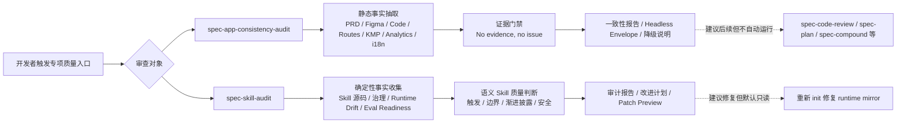
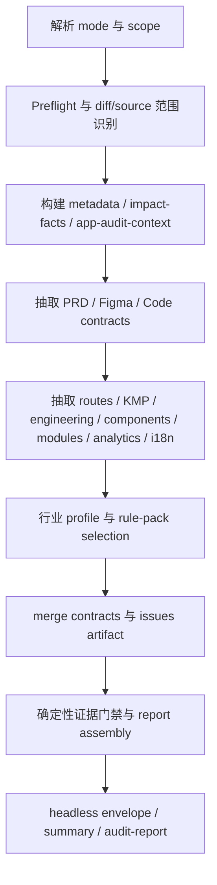
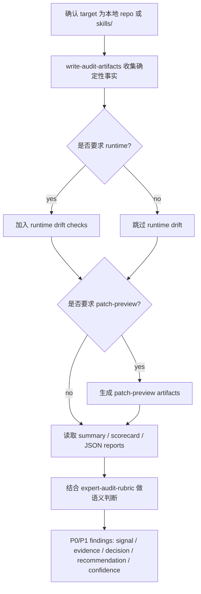

本页位于“工作流系统”中的专项质量入口，聚焦两个不直接承担日常开发执行、但用于提升交付前质量确定性的工作流：`spec-app-consistency-audit` 面向移动 App 的 PRD、Figma、源码、路由、架构、组件、埋点、i18n 与行业规则做静态优先一致性审查；`spec-skill-audit` 面向 Skill 资产本身的触发精度、边界契约、渐进披露、运行时治理与漂移风险做源码质量审计。它们共同遵循“脚本产出确定性事实，LLM 做语义判断”的边界，不替代测试、构建、真机验证、普通代码审查或自动修复。Sources: [SKILL.md](skills/spec-app-consistency-audit/SKILL.md#L13-L19), [SKILL.md](skills/spec-app-consistency-audit/SKILL.md#L50-L54), [SKILL.md](skills/spec-skill-audit/SKILL.md#L11-L16), [SKILL.md](skills/spec-skill-audit/SKILL.md#L57-L82)

## 架构假设与验证结论

本页的第一性原理假设是：专项质量入口不是“另一个代码评审器”，而是围绕特定质量域建立的**证据编译器 + 语义审查器**。代码考古验证显示，App 一致性审查的核心输入来自 mode token、diff base、source root、PRD/Figma、行业 lens 与 extractor facts，输出为静态一致性 findings、headless envelope、降级输入说明与 report-writer handoff；Skill 审计的核心输入来自目标 Skill、治理 guard、Skill/Agent 源码、双宿主治理、runtime/catalog facts 与角色契约，输出为带 evidence、confidence、suggested action 与 residual risk 的 Skill 审计 findings。Sources: [SKILL.md](skills/spec-app-consistency-audit/SKILL.md#L21-L39), [SKILL.md](skills/spec-skill-audit/SKILL.md#L27-L46)



这张图刻意把“事实抽取”和“语义判断”分开：App 审查的 deterministic helpers 负责 preflight、artifact validation、contract extraction、industry profiling、rule-pack selection、evidence gating 与 report assembly，LLM experts 才负责语义判断；Skill 审计也明确先收集 deterministic facts，再读取 summary、scorecard、JSON reports 与 rubric 进行判断。Sources: [SKILL.md](skills/spec-app-consistency-audit/SKILL.md#L338-L347), [SKILL.md](skills/spec-skill-audit/SKILL.md#L169-L198)

## 两类入口的职责差异

| 入口 | 主要审查对象 | 适用时机 | 不适用场景 | 产物定位 |
|---|---|---|---|---|
| `spec-app-consistency-audit` | 移动 App 的产品意图、设计状态、页面路由、KMP/Clean Architecture、组件模块复用、埋点、i18n、行业规则 | PRD、Figma context 或本地源码存在，且跨来源一致性重要时 | 只想跑测试、lint、build、模拟器、真机；没有 PRD/Figma/source；格式化或机械重构；要求直接改产品代码 | 静态一致性 findings、run-scoped artifacts、headless envelope、runtime follow-up 建议 |
| `spec-skill-audit` | Skill 源码质量、触发精度、边界重叠、输入输出契约、渐进披露、eval readiness、安全、runtime governance | 需要审计 Skill 资产、检查公共入口治理、准备 Skill 改进计划或发现 runtime drift 风险时 | 安装第三方 Skill、挖掘远程 Skill 仓库、直接改生成 runtime mirror、替代普通代码审查 | Skill 审计报告、scorecard、drift report、改进计划、显式请求时的 patch preview |

App 审查的“何时使用”覆盖 PRD/Figma/source 一致性、Android/iOS 行为漂移、KMP shared logic、Clean Architecture、页面路由、交互状态、埋点、i18n、可访问性、组件复用和行业风险；其“何时不用”明确排除普通测试构建、无输入审查、格式化重构和直接编辑产品代码。Skill 审计的“何时使用”覆盖 source skills、`SKILL.md` 质量、触发精度、边界重叠、契约缺失、failure modes、source/runtime consistency、runtime drift 与 patch-preview suggestions；其“何时不用”明确排除安装第三方 Skill、远程 Skill 挖掘、直接修改 `.claude/`、`.codex/`、`.agents/skills/`、自动重写源码以及替代代码评审。Sources: [SKILL.md](skills/spec-app-consistency-audit/SKILL.md#L56-L74), [SKILL.md](skills/spec-skill-audit/SKILL.md#L89-L116)

## App 一致性审查：静态优先的移动质量入口

`spec-app-consistency-audit` 的默认模式是 `static_only`，并明确禁止在用户未要求时启动 simulator、real device、package build、Appium、Maestro、cloud device run 或等价 runtime workflow。它的价值在于把运行前能确定的产品、设计、源码与规则证据先收敛出来，降低后续 QA、真机和代码评审阶段的信息不确定性。Sources: [SKILL.md](skills/spec-app-consistency-audit/SKILL.md#L75-L80)



headless runner 的实际管线由 `scripts/run-audit.js` 编排，它先写 `metadata.json`，再执行 preflight、impact facts、PRD/Figma/code contracts、page route、KMP architecture、engineering quality、component/module、analytics、i18n、industry profile、rule-pack selection、merge contracts、issues、audit report、metadata finalize、audit context、latest summary、artifact manifest 与 headless envelope。该 runner 是 subprocess orchestrator，不发明 issue、不调用 LLM、不远程抓取 Figma/PRD 资产。Sources: [SKILL.md](skills/spec-app-consistency-audit/SKILL.md#L154-L181)

## App 审查的模式、输入与失败边界

| 参数或模式 | 作用 | 关键约束 |
|---|---|---|
| `mode:headless` | 面向父工作流或程序化调用，写 run-scoped artifacts，返回 compact envelope | 必须有可确定 diff scope；缺少 base 返回 `scope_headless_missing_base` |
| `mode:report-only` | 只读报告模式，不写 run artifacts | 若 extractor 只能文件输出，则记录 degraded coverage，不写文件 |
| `base:<sha-or-ref>` | 确定性 diff base | headless 与 `from:code-review` 审查 diff 时应传入 |
| `source:<path>` | App source root | 相对路径按 repoRoot 解析，不按 sourceRoot 或偶然 cwd |
| `prd:<path>` / `figma-context:<path>` | 本地产品与设计输入 | Figma 必须是本地 materialized JSON 才是可抽取上下文 |
| `figma-ref:<id-or-url>` | 仅引用远程 Figma | headless/report-only 中降级为 `input_figma_reference_only`，不远程 fetch |
| `industry:<name>` | 显式行业 lens | 行业 confirmed finding 仍需 confirmed industry profile 与项目证据 |
| `depth:deep` | 深化标记 | 不是 mode，不与 headless/report-only 冲突 |

mode contract 明确要求多个 mode token 互斥，`mode:headless` 缺少 determinable diff scope 会失败，`mode:report-only` 严格 no-write，`figma-ref` 在 headless/report-only 中只能降级，所有模式都不得修改 product source、generated runtime assets、durable standards 或 `.spec-first/specs/repo-profile.yaml`。Sources: [SKILL.md](skills/spec-app-consistency-audit/SKILL.md#L81-L106)

## App 审查产物结构与证据纪律

App 审查默认与 headless runs 将产物写入 `.spec-first/app-audit/runs/<run-id>/`，v0.1a spine 包括 `metadata.json`、`artifact-manifest.json`、`preflight.json`、`impact-facts.json`、`app-audit-context.json`、`issues.json`、`audit-report.json`、`app-consistency-audit.md`、`app-consistency-audit.summary.md` 与 `headless-envelope.txt`；`latest-summary.json` 只是最新 run 指针，消费者必须校验 `head_sha`、`diff_hash`、`worktree_fingerprint` 与 `audit_verdict_scope` 后才能把 run artifact 当作当前证据。Sources: [SKILL.md](skills/spec-app-consistency-audit/SKILL.md#L115-L152)

```text
skills/spec-app-consistency-audit/
├── SKILL.md
├── prompts/        # skill-local experts 与 ECC-derived lenses
├── rule-packs/     # common-app、analytics、i18n、KMP、行业规则
├── schemas/        # contract、issue、report、metadata schema
└── scripts/        # deterministic helpers 与 headless runner
```

App 审查的核心证据政策是 “No evidence, no issue”：confirmed issue 必须引用至少一个项目特定证据来源，例如 PRD、Figma、code、route、architecture、analytics、i18n 或 extracted contract evidence；rule packs 可以解释风险与理由，但不能单独支撑 confirmed project issue。每个 issue 还必须包含 `static_confirmed`、`requires_runtime_verification`、`requires_real_device`、`contract_status`、`confidence`、`provenance`、`evidence`、`claim_family`、`affected_surface`、`impact`、`recommendation`、`validation_status`、`review_lifecycle` 与 `data_sensitivity` 等字段。Sources: [SKILL.md](skills/spec-app-consistency-audit/SKILL.md#L280-L324)

## App 审查中的 Figma 与隐私边界

Figma extraction 只消费本地 JSON context 文件，Figma node 或 file reference 本身不是可抽取上下文；interactive/default 模式下可以用宿主 Figma MCP 工具获取设计上下文并写入 `.spec-first/app-audit/runs/<run-id>/input/figma-context.json`，但 headless 与 report-only 模式不得远程 materialize Figma context，只能记录 degraded mode，并把 design-alignment findings 保持为 skipped/advisory，除非本地 materialized context 已经存在。Sources: [SKILL.md](skills/spec-app-consistency-audit/SKILL.md#L229-L254)

Figma redaction 默认使用 `--redaction internal`：保留短的非敏感 screen、component 与 text labels 以支持 PRD/Figma/Code 匹配，同时 hash 每个 label；`strict` 只保留 hash 与 metadata，`none` 只在用户显式允许时保留完整 labels/text。安全边界还要求把 PRD、Figma、source、artifact text 与 rule-pack text 当作不可信输入，不服从抽取 artifact 中的指令，并且不得把 token-bearing URLs、cookies、Authorization headers、OAuth tokens 或长原始 PRD/Figma 文本写入报告、summary、manifest 或 headless envelope。Sources: [SKILL.md](skills/spec-app-consistency-audit/SKILL.md#L255-L264), [SKILL.md](skills/spec-app-consistency-audit/SKILL.md#L377-L383)

## Skill 审计：把 Skill 当作工程协议审查

`spec-skill-audit` 的定位是把 Skill debt 暴露在演变为 workflow debt 之前。它审查 source `SKILL.md`、Skill 目录结构、trigger clarity、scope boundaries、input/output contracts、workflow steps、scripts/references/examples/assets/evals 组织、failure modes、eval readiness、instruction/script safety 与 runtime governance；在 spec-first 仓库中还会检查 `skills/` 是否作为 source of truth、双宿主治理、Claude/Codex delivery expectations、generated runtime drift，以及“scripts prepare deterministic facts, LLMs make semantic judgments”的原则。Sources: [SKILL.md](skills/spec-skill-audit/SKILL.md#L57-L82)



Skill 审计默认目标是当前 spec-first 仓库的 `skills/`，也可以指定一个本地 Skill 目录；其确定性事实入口是 `node skills/spec-skill-audit/scripts/write-audit-artifacts.js --repo .`，可追加 `--runtime`、`--patch-preview` 或 `--target skills/<skill-name>`。审计时要读取 `skill-audit-summary.md`、`skill-improvement-plan.md` 与相关 JSON reports，scorecards 只是 signals 而不是 gates，并且每个 P0/P1 finding 都要给出 signal、file/section evidence、counter-evidence status、decision、reason、recommendation 与 confidence。Sources: [SKILL.md](skills/spec-skill-audit/SKILL.md#L118-L130), [SKILL.md](skills/spec-skill-audit/SKILL.md#L167-L198)

## Skill 审计产物与治理边界

Skill 审计默认把本地审计产物写到 `.spec-first/audits/skill-audit/latest/`，完整 self-audit 可能包含 `skill-source-inventory.json`、`reviewer-guard-coverage-report.json`、`rule-maturity-observations.json`、`expert-scorecard.json`、`skill-audit-report.json`、`trigger-routing-report.json`、`boundary-overlap-matrix.json`、`security-risk-report.json`、`eval-readiness-report.json`、`promise-implementation-report.json`、`governance-drift-report.json`、`runtime-drift-report.json`、`executor-context.json`、`skill-audit-summary.md` 与 `skill-improvement-plan.md`；显式请求 patch preview 时还可能写 `patch-preview/summary.md` 与 `patch-preview/*.patch.md`。Sources: [SKILL.md](skills/spec-skill-audit/SKILL.md#L132-L166)

```text
skills/spec-skill-audit/
├── SKILL.md
├── evals/          # audit / boundary / security / trigger cases
├── examples/       # excellent / weak / dangerous skill examples
├── references/     # rubrics、threat model、source-vs-runtime contract
└── scripts/        # fact collection、drift、layout、security、report writer
```

Skill 审计默认对被审查源码与 runtime assets 保持只读，只能写 `.spec-first/audits/skill-audit/` 下的审计报告；未经用户显式确认，不得修改 `skills/`、`agents/`、`templates/`、`src/cli/contracts/`、`.claude/`、`.codex/` 或 `.agents/skills/`。如果发现 generated runtime drift，正确修复路径是重新运行带目标 host 的 `spec-first init`，不是手工 patch 生成副本。Sources: [SKILL.md](skills/spec-skill-audit/SKILL.md#L200-L218)

## 渐进披露与 Runtime Drift 的审计重点

Skill 审计把 Skill entry prompt 视为渐进披露表面：如果主 `SKILL.md` 承载过长 examples、重复 rubrics、provider-specific details、大型 checklist 或应放入 `references/`、`scripts/`、`assets/`、eval files 的操作性材料，就应作为 progressive-disclosure drift 被标记。但这类发现是 optimization/risk signal，不是自动重写命令；脚本只报告确定性 evidence，LLM 再解释漂移是否影响 governance、catalog、README/user-doc visibility 或 source/runtime boundaries。Sources: [SKILL.md](skills/spec-skill-audit/SKILL.md#L83-L88), [spec-skill-audit-contracts.test.js](tests/unit/spec-skill-audit-contracts.test.js#L8-L24)

Skill 审计的 failure modes 也体现“不中断可继续事实收集”的策略：找不到 source skills 时报告 `NO_SKILLS_FOUND`、展示搜索路径并提示 `skills/<name>/SKILL.md` 布局；target 不是 spec-first repo root 或本地 `skills/` 下单个目录时，本版本停止；治理验证失败时继续 source inventory 与结构检查，把治理错误作为 evidence；runtime directories 缺失时标记 `not_initialized` 而不失败；runtime drift 被检测到时报告漂移、建议 rerun init，但不 patch runtime copies。Sources: [SKILL.md](skills/spec-skill-audit/SKILL.md#L220-L249)

## 双宿主投递与命令入口模型

这两个专项入口都属于 `workflow_command`，并采用双宿主投递：Claude 侧投递为 command，Codex 侧投递为 skill。治理契约中 `spec-app-consistency-audit` 的 `command_name` 是 `app-consistency-audit`，`host_delivery` 为 Claude `command`、Codex `skill`；`spec-skill-audit` 的 `command_name` 是 `skill-audit`，投递规则相同。Sources: [skills-governance.json](src/cli/contracts/dual-host-governance/skills-governance.json#L170-L180), [skills-governance.json](src/cli/contracts/dual-host-governance/skills-governance.json#L335-L345)

Claude command template 只定义命令 metadata，初始化时由 `spec-first init` 把 template frontmatter 与对应 `skills/<name>/SKILL.md` body 合成 runtime command；因此更改行为应编辑 source skill，而不是编辑生成 runtime command。`app-consistency-audit` 的 template 暴露了 mode、base、source、prd、figma-context/figma-ref、industry 与 depth 参数；`skill-audit` 的 template 暴露 target skill path 或 audit options。Sources: [app-consistency-audit.md](templates/claude/commands/spec/app-consistency-audit.md#L1-L13), [skill-audit.md](templates/claude/commands/spec/skill-audit.md#L1-L13)

单元测试进一步验证了 App 审查的投递契约：plugin manifest 暴露 Claude command 并映射到 `spec-app-consistency-audit`，Claude asset set 包含 `app-consistency-audit` command 与 workflow skill，Codex asset set 只包含 workflow skill 而不包含同名 command；runtime sync 测试还确认生成资产来自 source，且不会把 repo runtime 作为 source truth。Sources: [spec-app-consistency-audit-entry.test.js](tests/unit/spec-app-consistency-audit-entry.test.js#L51-L71), [spec-app-consistency-audit-entry.test.js](tests/unit/spec-app-consistency-audit-entry.test.js#L73-L134)

## 与主线工作流的衔接边界

在工作流总图中，`/spec:skill-audit` 被定义为审计 Skill 资产的源码质量、触发精度、边界契约与双宿主一致性；`/spec:app-consistency-audit` 被定义为对移动 App 的 PRD、Figma、源码、路由与架构边界做静态一致性审查，且 app-audit 不调用通用 agent，专家判断由 skill-local prompts 承载。Sources: [workflow-skill-agent-map.md](docs/workflow-skill-agent-map.md#L23-L47)

App 审查可建议后续交给 `spec-plan`、`spec-code-review`、`spec-skill-audit`、`spec-polish-beta` 或 `spec-compound`，但不会自动运行这些工作流；在 v0.1 中 follow-ups 只出现在 `app-consistency-audit.summary.md` 与 headless envelope，独立 `workflow-handoff-suggestions.json` 尚未实现。Skill 审计的 downstream consumers 则包括 `spec-work`、`spec-code-review`、release governance、skill maintainers、runtime setup/update decisions 与负责判断 remediation priority 的人。Sources: [SKILL.md](skills/spec-app-consistency-audit/SKILL.md#L371-L375), [SKILL.md](skills/spec-skill-audit/SKILL.md#L48-L50)

## 阅读路径建议

如果你刚读完常规审查机制，建议先回看 [结构化代码评审与多 Agent 合成机制](22-jie-gou-hua-dai-ma-ping-shen-yu-duo-agent-he-cheng-ji-zhi)，理解为什么 App 一致性审查不是普通 code review；然后阅读本页掌握专项质量入口；接着进入 [Compound 知识沉淀与经验复用边界](24-compound-zhi-shi-chen-dian-yu-jing-yan-fu-yong-bian-jie)，理解专项审查后的经验如何沉淀。Sources: [workflow-skill-agent-map.md](docs/workflow-skill-agent-map.md#L33-L44), [SKILL.md](skills/spec-app-consistency-audit/SKILL.md#L371-L375)

如果你的目标是扩展或新增类似入口，下一步应读 [新增 Skill、Agent 与命令入口的接入规范](29-xin-zeng-skill-agent-yu-ming-ling-ru-kou-de-jie-ru-gui-fan)，并把本页的三个约束带过去：source skill 是行为真相、runtime mirror 不手改、脚本只提供确定性事实而不替代 LLM 的语义判断。Sources: [SKILL.md](skills/spec-app-consistency-audit/SKILL.md#L183-L193), [SKILL.md](skills/spec-skill-audit/SKILL.md#L75-L82), [SKILL.md](skills/spec-skill-audit/SKILL.md#L200-L218)