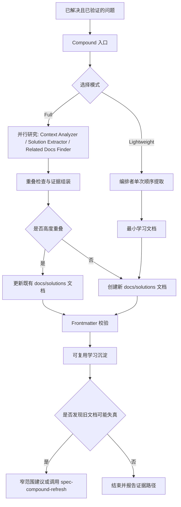

**架构假设：**`spec-compound` 不是“把会话全部存档”的工具，而是一个在问题已经解决后，将可复用经验提升为 `docs/solutions/` 中单篇学习文档的知识沉淀入口；它的边界由三件事共同限定：只记录已验证且有复用价值的经验、只输出一个主要学习文档、只在证据充分时做最小范围的发现性与词汇维护。这个页面只解释 Compound 的知识沉淀与经验复用边界，不展开代码评审、任务执行、质量门禁或上下文治理的完整机制；这些主题可继续阅读 [结构化代码评审与多 Agent 合成机制](22-jie-gou-hua-dai-ma-ping-shen-yu-duo-agent-he-cheng-ji-zhi)、[Workflow Contract、Artifact Summary 与 Handoff 协议](25-workflow-contract-artifact-summary-yu-handoff-xie-yi) 与 [Context Governance 与 Summary-First 证据传递](27-context-governance-yu-summary-first-zheng-ju-chuan-di)。Sources: [SKILL.md](skills/spec-compound/SKILL.md#L10-L15), [SKILL.md](skills/spec-compound/SKILL.md#L18-L49)

## Compound 要解决的核心问题

Compound 的注意力点是“刚刚解决的问题”。当上下文还新鲜时，它把问题症状、排查路径、根因、最终方案、预防策略和相关引用整理为结构化学习文档，使后续开发者或 Agent 在遇到相似问题时可以先检索既有经验，而不是重新完整研究一遍。这个“复利”模型在技能说明中被明确描述为：第一次解决问题需要研究，记录之后下一次发生类似问题只需要快速查找。Sources: [SKILL.md](skills/spec-compound/SKILL.md#L10-L15), [SKILL.md](skills/spec-compound/SKILL.md#L465-L473), [SKILL.md](skills/spec-compound/SKILL.md#L573-L590)

Compound 的输出边界非常窄：主要产物是一个 `docs/solutions/` 学习文档；相关的重复文档说明、可选发现性维护和简洁的证据摘要只是围绕这个主产物服务。它不是活跃调试工具，不用于未完成实现，不归档原始 transcript，也不是每个任务完成时必须执行的强制关卡。Sources: [SKILL.md](skills/spec-compound/SKILL.md#L18-L40)

## 概念关系图

下面的图展示 Compound 在知识沉淀链路中的位置：它接收已解决问题的上下文和证据，经过分类、去重、写作与校验，产出可检索的学习文档；只有在发现旧学习可能失真时，才将维护责任交给 `spec-compound-refresh`。Sources: [SKILL.md](skills/spec-compound/SKILL.md#L42-L49), [SKILL.md](skills/spec-compound/SKILL.md#L312-L358)

这条链路的关键约束是“先事实、后沉淀”：Compound 可以消费上游摘要、变更文件、测试、最终工作或评审总结、可选 session history 和既有 `docs/solutions/` 候选，但持久输出中应记录可复用经验增量和证据路径，而不是复制完整上游报告、原始工具输出或完整 review bundle。Sources: [SKILL.md](skills/spec-compound/SKILL.md#L26-L36), [SKILL.md](skills/spec-compound/SKILL.md#L87-L103)

## 什么时候使用，什么时候不要使用

Compound 适用于“问题已经真实解决，并且经验值得未来 Agent 或队友复用”的场景。判断重点不是任务是否完成，而是是否存在可复用的模式：例如某类构建错误的根因、某个工作流缺口的修复方式、某种架构或工具决策的适用边界。Sources: [SKILL.md](skills/spec-compound/SKILL.md#L18-L24), [schema.yaml](skills/spec-compound/references/schema.yaml#L11-L35)

不应使用 Compound 来推动活跃调试、完成未解决实现、记录一次性视觉微调、归档原始会话或充当强制收尾门禁。如果问题没有解决、没有可复用经验、范围不清、已经有重复文档、证据不安全、session/subagent 不可用，或 YAML/schema 校验失败，都属于 Compound 的失败模式或阻断条件。Sources: [SKILL.md](skills/spec-compound/SKILL.md#L22-L40), [SKILL.md](skills/spec-compound/SKILL.md#L474-L486)

| 场景 | 是否适合 Compound | 边界理由 |
|---|---:|---|
| 刚修复一个可复现的测试失败，并知道根因 | 适合 | 属于已解决问题，可沉淀症状、根因、方案与预防 |
| 正在排查线上错误，根因未确认 | 不适合 | Compound 不用于 active debugging 或未解决工作 |
| 完成一次只改颜色的 UI 小调整 | 不适合 | 一次性 cosmetic edit 不具备复用价值 |
| 发现旧学习文档与当前代码不一致 | 通常使用 `spec-compound-refresh` | 维护 stale/overlap/inaccurate docs 是 refresh 的职责 |
| 需要让未来 Agent 知道某类已验证工作流经验 | 适合 | 可进入 knowledge track 并写入 `docs/solutions/` |

Sources: [SKILL.md](skills/spec-compound/SKILL.md#L18-L40), [SKILL.md](skills/spec-compound-refresh/SKILL.md#L10-L39)

## Full 模式与 Lightweight 模式的边界

Compound 在执行前必须让用户选择 Full 或 Lightweight，不能替用户预选，也不能跳过提问。Full 模式会并行启动研究子任务，并可在用户同意时通过 `spec-sessions` 做前台 session history enrichment；Lightweight 模式则由主编排者单次顺序完成，不启动 subagents，也不执行并行任务。Sources: [SKILL.md](skills/spec-compound/SKILL.md#L105-L132), [SKILL.md](skills/spec-compound/SKILL.md#L420-L459)

| 模式 | 适用情况 | 会做什么 | 明确不做什么 |
|---|---|---|---|
| Full | 默认推荐；问题较复杂；需要去重、交叉引用或更完整预防策略 | 并行运行 Context Analyzer、Solution Extractor、Related Docs Finder；可选 session history；再由编排者写入最终文档 | 子任务不能写文件；不能在研究完成前并行组装 |
| Lightweight | 简单修复；长会话接近上下文上限；希望更省 token | 主编排者顺序提取、分类、写最小文档、可选更新既有 `CONCEPTS.md` | 不启动 subagents；不做 Related Docs Finder 重叠检查；可能产生后续需 refresh 处理的重叠文档 |

Sources: [SKILL.md](skills/spec-compound/SKILL.md#L134-L140), [SKILL.md](skills/spec-compound/SKILL.md#L163-L239), [SKILL.md](skills/spec-compound/SKILL.md#L425-L461)

Full 模式中的子任务只返回文本数据，不能创建 `context-analysis.md`、`solution-draft.md` 这类中间文件；唯一负责写入的是主编排者。这个限制避免知识沉淀过程把临时分析碎片也变成仓库持久资产，从而保持 `docs/solutions/` 的知识库形态清晰。Sources: [SKILL.md](skills/spec-compound/SKILL.md#L134-L140), [SKILL.md](skills/spec-compound/SKILL.md#L517-L525)

## 学习文档的分类模型

Compound 的 frontmatter 由 `references/schema.yaml` 约束，并通过 `problem_type` 分为 bug track 与 knowledge track。Bug track 覆盖 build/test/runtime/performance/database/security/UI/integration/logic 等缺陷或失败；knowledge track 覆盖 best practice、documentation gap、workflow issue、developer experience、architecture pattern、design pattern、tooling decision 与 convention 等实践、模式、约定和决策。Sources: [schema.yaml](skills/spec-compound/references/schema.yaml#L1-L35), [yaml-schema.md](skills/spec-compound/references/yaml-schema.md#L12-L20)

Bug track 与 knowledge track 的正文结构不同：Bug track 关注 Problem、Symptoms、What Didn't Work、Solution、Why This Works 和 Prevention；Knowledge track 关注 Context、Guidance、Why This Matters、When to Apply 和 Examples。这个设计使 Compound 不会把所有经验都强行写成“事故复盘”，也不会把真正的缺陷修复写成抽象建议。Sources: [SKILL.md](skills/spec-compound/SKILL.md#L193-L209), [resolution-template.md](skills/spec-compound/assets/resolution-template.md#L7-L60), [resolution-template.md](skills/spec-compound/assets/resolution-template.md#L64-L112)

| 维度 | Bug Track | Knowledge Track |
|---|---|---|
| 核心对象 | 已诊断并修复的缺陷、错误或失败 | 实践、模式、约定、决策、工作流改进或文档经验 |
| 必填差异 | 需要 `symptoms`、`root_cause`、`resolution_type` | 无额外必填字段，`applies_when` 等为可选 |
| 正文重点 | 症状、失败尝试、根因、修复、预防 | 背景、指导、价值、适用条件、示例 |
| 典型目录 | `build-errors/`、`test-failures/`、`runtime-errors/` 等 | `architecture-patterns/`、`tooling-decisions/`、`workflow-issues/` 等 |

Sources: [schema.yaml](skills/spec-compound/references/schema.yaml#L37-L190), [SKILL.md](skills/spec-compound/SKILL.md#L488-L516)

新提升为持久学习的文档必须包含结构化召回字段 `invalidation_condition` 与 `source_refs`。这些字段让未来使用者知道：什么时候这条经验会过期，以及需要回看哪些源代码、测试、文档或评审路径来重新确认它仍然成立；旧文档如果缺少这些字段，只能作为 `legacy_unstructured_advisory` 候选，不能被当作已验证的结构化知识。Sources: [schema.yaml](skills/spec-compound/references/schema.yaml#L221-L233), [schema.yaml](skills/spec-compound/references/schema.yaml#L242-L270), [yaml-schema.md](skills/spec-compound/references/yaml-schema.md#L56-L64)

## 去重、更新与创建新文档的边界

Full 模式中的 Related Docs Finder 会搜索 `docs/solutions/`，并从问题陈述、根因、解决方案、引用文件和预防规则五个维度评估重叠度。高重叠意味着 4–5 个维度匹配，通常不应新建重复文档；中等重叠意味着同一区域但角度或方案不同；低重叠则表示相关但 distinct。Sources: [SKILL.md](skills/spec-compound/SKILL.md#L210-L239)

当重叠度高时，Compound 的正确行为是更新既有文档，而不是创建一篇新文档；更新时保留原路径与 frontmatter 结构，刷新方案、代码示例、预防提示和过期引用，并添加 `last_updated: YYYY-MM-DD`。这样做的理由是：两篇描述同一问题与同一方案的文档会立刻产生漂移风险，更新已有文档比制造重复知识更可维护。Sources: [SKILL.md](skills/spec-compound/SKILL.md#L273-L285), [SKILL.md](skills/spec-compound/SKILL.md#L560-L571)

Lightweight 模式跳过去重检查，因此可能创建与已有文档重叠的新文档；这不是流程错误，而是明确的性能与上下文权衡。若后续发现重叠，可由 `spec-compound-refresh` 在维护阶段处理。Sources: [SKILL.md](skills/spec-compound/SKILL.md#L420-L461)

## 与 Compound Refresh 的分工

`spec-compound` 负责“新鲜经验的沉淀”，`spec-compound-refresh` 负责“既有学习文档随代码现实变化后的维护”。Refresh 的触发条件是 `docs/solutions/` 下学习或模式文档 stale、overlapping、inaccurate，或被明确点名要求刷新、合并、清理；它的输出包括 refresh report 和对 `docs/solutions/` 的 scoped edits，例如 keep、update、consolidate、replace、delete、stale-mark 或 recommended actions。Sources: [SKILL.md](skills/spec-compound-refresh/SKILL.md#L6-L39), [SKILL.md](skills/spec-compound-refresh/SKILL.md#L111-L122)

Compound 不会默认自动运行 Refresh。只有当新学习明显暗示旧学习或 pattern 可能失真时，才应窄范围调用或建议 `spec-compound-refresh`；例如新修复反驳旧方案、新方案取代旧方案、重构或依赖升级使旧引用失效、pattern 过宽或过时，或者 Related Docs Finder 给出高置信 refresh candidate。Sources: [SKILL.md](skills/spec-compound/SKILL.md#L312-L358)

| 责任 | `spec-compound` | `spec-compound-refresh` |
|---|---|---|
| 主要问题 | 新解决的问题是否值得沉淀 | 旧学习是否仍准确、有用、去重良好 |
| 主产物 | 一个 `docs/solutions/` 学习文档 | Refresh report 与 scoped docs/solutions edits |
| 默认行为 | 捕获新经验 | 维护既有知识库 |
| 是否 broad sweep | 不应扩展成广泛历史审查 | 可按 focused、batch、broad 范围处理 |
| 删除策略 | 不负责删除旧文档 | 可删除无用文档，但需要检查 inbound links |

Sources: [SKILL.md](skills/spec-compound/SKILL.md#L312-L358), [SKILL.md](skills/spec-compound-refresh/SKILL.md#L148-L190), [spec-compound-contracts.test.js](tests/unit/spec-compound-contracts.test.js#L208-L223)

## 证据边界：摘要优先，原始材料不入库

Compound 遵循 Summary-First Handoff：应先消费上游 `artifact-summary.v1` 风格摘要，再决定是否打开完整计划、评审、work log、session extract 或原始产物。最终 durable output 应捕获“可复用经验增量与证据路径”，而不是复制完整上游报告。Sources: [SKILL.md](skills/spec-compound/SKILL.md#L87-L91)

外部工具或 broad impact evidence 只能作为聚焦线索，不能直接成为学习文档中的事实结论；可复用经验必须被 changed source、tests、logs、contracts 或 review findings 等 source-confirmed evidence 重新确认。原始工具输出、原始 diff hunks、完整 transcript 和完整 review bundle 不应进入学习文档，除非安全且必要的短摘录能支撑经验表达。Sources: [SKILL.md](skills/spec-compound/SKILL.md#L91-L103), [spec-compound-contracts.test.js](tests/unit/spec-compound-contracts.test.js#L132-L152)

Session history 也有同样边界。Full 模式中，用户同意后可以调用 `spec-sessions` 查找相关历史，但调用提示必须窄：限定时间窗口、具体问题主题、过滤规则和输出 schema；返回内容用于补充 “What was tried before”、“What didn't work”、“Key decisions” 或 “Related context”，而不是建立完整历史索引。Sources: [SKILL.md](skills/spec-compound/SKILL.md#L122-L130), [SKILL.md](skills/spec-compound/SKILL.md#L241-L263)

## CONCEPTS.md 只是 advisory vocabulary

Compound 可以在学习文档写入或更新后检查仓库根目录是否已有 `CONCEPTS.md`。如果存在，它会读取 `references/concepts-vocabulary.md`，只围绕新学习及其 source-confirming context 提取项目特定术语；如果不存在，不会创建或 bootstrap 这个文件，而是记录 `CONCEPTS.md: not present; no vocabulary maintenance applied`。Sources: [SKILL.md](skills/spec-compound/SKILL.md#L301-L310), [concepts-vocabulary.md](skills/spec-compound/references/concepts-vocabulary.md#L1-L10)

`CONCEPTS.md` 的定位是 repo-local advisory vocabulary：帮助 Agent 使用稳定名称理解项目特定概念，但不是 PRD、ADR、workflow contract、product roadmap、setup requirement 或 source-of-truth override。直接读取源代码、已提交契约、当前计划、用户决策和 validated run evidence 仍然优先。Sources: [concepts-vocabulary.md](skills/spec-compound/references/concepts-vocabulary.md#L1-L6)

术语维护也必须保持窄范围：只添加新工程师理解源码、计划、评审、ticket 或未来学习文档时确实需要的项目特定术语；不要添加普通编程词汇、普通英文、一次性变量名、文件路径、类名、函数签名、配置值、负责人、日期、版本特定声明或原始实现细节。Sources: [concepts-vocabulary.md](skills/spec-compound/references/concepts-vocabulary.md#L11-L24)

## Discoverability 的边界

Compound 的知识库只有在未来 Agent 能发现时才会产生复利。因此在学习写入和 refresh 决策之后，它会检查根级 instruction files，例如 `AGENTS.md` 或 `CLAUDE.md`，判断其中是否能让 Agent 知道 `docs/solutions/` 的存在、结构和适用时机。Sources: [SKILL.md](skills/spec-compound/SKILL.md#L360-L370)

如果 instruction file 已经满足语义要求，Compound 不做改动；如果不满足，Full 模式下可以提出最小增量，例如在目录说明中加入一行或新增一个小节，说明 `docs/solutions/` 是按 category 与 YAML frontmatter 组织的已解决问题知识库。这里的语气应该是信息性描述，而不是“always search before implementing” 这类强制命令，以避免制造低价值重复检索。Sources: [SKILL.md](skills/spec-compound/SKILL.md#L372-L394)

如果 `CONCEPTS.md` 被更新并且 instruction file 未暴露它，Full 模式可用同样的 consent flow 请求添加一个小发现性说明；Lightweight 模式只报告 tip。这个边界确保发现性维护服务于知识复用，而不是把一次学习沉淀扩展成 instruction file 重写工程。Sources: [SKILL.md](skills/spec-compound/SKILL.md#L394-L395), [concepts-vocabulary.md](skills/spec-compound/references/concepts-vocabulary.md#L31-L34), [SKILL.md](skills/spec-compound/SKILL.md#L437-L457)

## 运行中的常见误区

Compound 最常见的边界错误是把研究中间物持久化、让子任务写文件、在研究未完成时开始组装、创建多篇文档，或在高重叠情况下新建重复文档。正确做法是：研究阶段只返回文本，编排者等待所有研究结果后再写一个最终 `docs/solutions/` 文档；如果已有文档高度覆盖同一问题，则更新它。Sources: [SKILL.md](skills/spec-compound/SKILL.md#L265-L299), [SKILL.md](skills/spec-compound/SKILL.md#L517-L525)

| 错误做法 | 正确边界 |
|---|---|
| 把原始会话、完整 diff 或完整 review bundle 写进学习文档 | 只记录可复用经验增量、短证据摘要和 repo-relative evidence paths |
| 让 Context Analyzer 或 Solution Extractor 创建文件 | 子任务只返回文本，主编排者写入最终文档 |
| 每次任务结束都强制 Compound | 只在问题已解决且有复用价值时使用 |
| 高重叠时创建“更新版”新文档 | 更新既有文档并添加 `last_updated` |
| `CONCEPTS.md` 不存在时自动创建 | 不创建，只记录未维护 |
| 新学习暗示旧文档失真时 broad sweep | 先捕获新学习，再用窄 scope 建议或调用 refresh |

Sources: [SKILL.md](skills/spec-compound/SKILL.md#L83-L103), [SKILL.md](skills/spec-compound/SKILL.md#L134-L140), [SKILL.md](skills/spec-compound/SKILL.md#L273-L285), [SKILL.md](skills/spec-compound/SKILL.md#L301-L358)

## 对中级开发者的实践判断

当你准备使用 Compound 时，可以先问三个问题：问题是否已经解决并验证；这条经验未来是否会让相似工作更快或更安全；是否能用 source/test/doc/review 路径支撑结论。如果三个答案都是“是”，Compound 就适合把经验提升为结构化学习；如果仍在排查、证据只来自未经确认的工具输出，或经验只对本次会话有效，则应该暂缓沉淀。Sources: [SKILL.md](skills/spec-compound/SKILL.md#L18-L45), [SKILL.md](skills/spec-compound/SKILL.md#L474-L486), [SKILL.md](skills/spec-compound/SKILL.md#L87-L103)

如果你关心后续流程衔接，可以按当前目录继续阅读：[Workflow Contract、Artifact Summary 与 Handoff 协议](25-workflow-contract-artifact-summary-yu-handoff-xie-yi) 解释 Compound 产物如何进入跨工作流交接；[Context Governance 与 Summary-First 证据传递](27-context-governance-yu-summary-first-zheng-ju-chuan-di) 解释为什么 Compound 不应复制完整上游材料；[新增 Skill、Agent 与命令入口的接入规范](29-xin-zeng-skill-agent-yu-ming-ling-ru-kou-de-jie-ru-gui-fan) 则适合在你需要扩展类似工作流入口时阅读。Sources: [SKILL.md](skills/spec-compound/SKILL.md#L46-L49), [SKILL.md](skills/spec-compound/SKILL.md#L87-L103), [tests/unit/spec-compound-contracts.test.js](tests/unit/spec-compound-contracts.test.js#L116-L130)