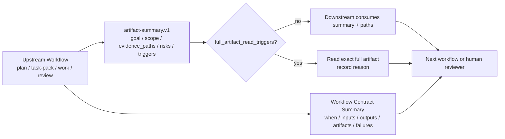
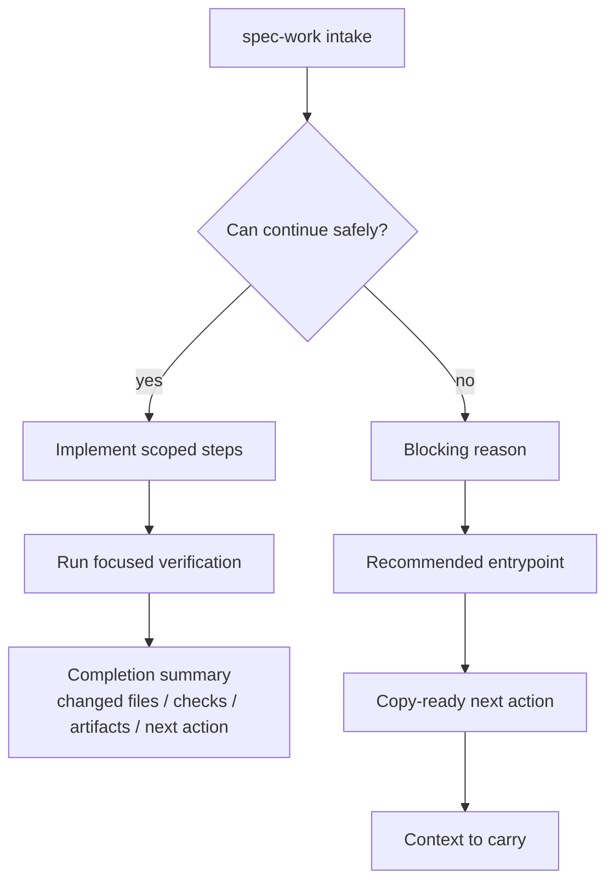

本页位于“契约与质量”分组，专注解释 spec-first 在工作流之间如何用 **Workflow Contract Summary**、`artifact-summary.v1` 与阻塞式 handoff envelope 传递意图、证据、风险和下一步，而不把每个计划、任务包、评审报告、运行日志或会话 transcript 全量广播给下游 agent；它不展开 Schema 校验、Context Governance 或测试门禁的完整机制，那些内容分别继续阅读 [Verification Profile、Schema 校验与质量反馈](26-verification-profile-schema-xiao-yan-yu-zhi-liang-fan-kui)、[Context Governance 与 Summary-First 证据传递](27-context-governance-yu-summary-first-zheng-ju-chuan-di) 与 [测试体系、契约测试与发布质量门禁](28-ce-shi-ti-xi-qi-yue-ce-shi-yu-fa-bu-zhi-liang-men-jin)。Sources: [artifact-summary.md](docs/contracts/artifact-summary.md#L1-L8), [ai-coding-harness.md](docs/contracts/ai-coding-harness.md#L15-L25), [public-workflow-contract-summary.test.js](tests/unit/public-workflow-contract-summary.test.js#L25-L46)

## 架构假设：handoff 的核心不是“传更多”，而是“传可追溯的最小决策面”

可验证的架构模式是：spec-first 把跨工作流交接拆成三层契约面——入口附近的 **Workflow Contract Summary** 给人和 LLM 一个稳定 I/O 边界，`artifact-summary.v1` 给下游一个 summary-first 的 durable artifact 摘要，具体 workflow 的 handoff envelope 在无法继续时给用户一个可立即执行的下一步；这三层都服务 AI Coding Harness 的 Context / Execution / Evidence / Knowledge 分层，而不是形成中心化状态机。Sources: [ai-coding-harness.md](docs/contracts/ai-coding-harness.md#L15-L25), [artifact-summary.md](docs/contracts/artifact-summary.md#L21-L53), [spec-work/SKILL.md](skills/spec-work/SKILL.md#L171-L182)



上图表达的是一个“窄腰”设计：上游可以产生计划、任务包、评审、工作结果或知识沉淀等不同产物，但下游首先消费的是短摘要、精确路径、限制条件与触发条件；只有当摘要缺少需求、任务、finding 或 evidence detail，或者需要精确 prose / line references 时，才打开完整 artifact。Sources: [artifact-summary.md](docs/contracts/artifact-summary.md#L47-L52), [artifact-summary.md](docs/contracts/artifact-summary.md#L65-L73), [context-governance.md](docs/contracts/context-governance.md#L50-L62)

## Workflow Contract Summary：每个入口先声明“能做什么、不能做什么、失败时怎么停”

公共 workflow 和必要 standalone entry skill 必须在入口附近暴露紧凑的合同摘要，字段包括 When To Use、When Not To Use、Inputs、Outputs、Artifacts、Failure Modes、Workflow 与 Downstream Consumers；这使调用者在加载完整长 prompt 前，就能判断这个入口是否匹配当前任务，并让边界错误尽早暴露。Sources: [public-workflow-contract-summary.test.js](tests/unit/public-workflow-contract-summary.test.js#L25-L46)

| 合同字段 | 决策作用 | 示例边界 |
| --- | --- | --- |
| When To Use | 判断是否进入该 workflow | `spec-work` 只在 task pack、settled plan、spec path 或具体实现请求已可执行时使用 |
| When Not To Use | 防止错误入口吞掉上游问题 | `spec-plan` 不用于实现代码、运行测试作为 proof 或生成 task-pack state |
| Inputs / Outputs | 固定输入产物和输出形态 | `spec-write-tasks` 输入本地 source plan 或 task-pack，输出 derived task pack、验证结果、skip/return/draft 决策 |
| Artifacts | 明确 durable evidence 在哪里 | `spec-code-review` 默认 session-scoped，只有显式路由时才形成 repo-local durable evidence |
| Failure Modes | 定义何时停止而不是自作主张 | `spec-work` 遇到 repo scope、stale task-pack、scope expansion 或 unsafe state 时停止并 handoff |
| Downstream Consumers | 标记谁会消费该结果 | work 输出可被 code review、git/PR、compound、release notes 和 human reviewer 消费 |

这些字段不是装饰性 README，而是被契约测试检查的入口面；测试还要求 summary 保留 source/runtime 边界与 script/LLM 责任分界，例如 using-spec-first 中“CLI 准备确定性事实、LLM 决定推荐 workflow”，plan 中“setup/runtime facts stay advisory”，write-tasks 中“task pack 不替代 source plan”，work 中“不把 generated runtime mirrors 当 source fix”。Sources: [public-workflow-contract-summary.test.js](tests/unit/public-workflow-contract-summary.test.js#L48-L60), [spec-work/SKILL.md](skills/spec-work/SKILL.md#L15-L47), [spec-plan/SKILL.md](skills/spec-plan/SKILL.md#L25-L57), [spec-write-tasks/SKILL.md](skills/spec-write-tasks/SKILL.md#L13-L45), [spec-code-review/SKILL.md](skills/spec-code-review/SKILL.md#L11-L43)

## Artifact Summary：durable artifact 的 summary-first handoff 合同

`artifact-summary.v1` 是 durable workflow artifact 的共享 handoff 合同，目标是让 plan、work、review、compound、release 等下游步骤先消费短摘要和精确 evidence paths，再决定是否读取完整 artifact；它不是第二份完整报告，不替代 underlying artifact 的 source of truth，也不是脚本拥有的语义结论。Sources: [artifact-summary.md](docs/contracts/artifact-summary.md#L1-L19)

`artifact-summary.v1` 的核心字段覆盖 `artifact_type`、`source_path`、`producer`、`goal`、`scope`、`non_goals`、`key_conclusions`、`changed_facts`、`unresolved_risks`、`evidence_paths`、`evidence_summaries`、`recommended_next_action` 与 `full_artifact_read_triggers`；其中 `evidence_summaries` 可记录 direct evidence 的 source reads required、limitations 与 redaction_status，但不能嵌入 raw external-tool output。Sources: [artifact-summary.md](docs/contracts/artifact-summary.md#L21-L53)

| 字段组 | 作用 | 消费者应如何使用 |
| --- | --- | --- |
| identity | `schema_version`、`artifact_type`、`source_path`、`producer`、`timestamp` | 定位 artifact 链路与生产者，不从文件名猜测身份 |
| decision surface | `goal`、`scope`、`non_goals`、`key_conclusions`、`changed_facts` | 判断当前 workflow 是否可继续，避免重读整份 plan/report |
| risk surface | `unresolved_risks`、`limitations` | 形成 review、work 或 release handoff 的 residual status |
| evidence surface | `evidence_paths`、`evidence_summaries.source_reads_required` | 回到 source/test/contract/log 做确认 |
| routing surface | `recommended_next_action`、`full_artifact_read_triggers` | 决定下一入口和是否展开 full artifact |

Producer 规则按 artifact 类型压缩不同事实面：plan/task 汇总 goal、scope、non-goals、implementation units、validation 和 open questions；review 汇总 verdict、actionable findings、residual status、evidence paths 与完整 reviewer artifact path；work 汇总 changed files、verification commands、review tier 和 residual status；compound 汇总 reusable lesson delta 与 source evidence paths；tool-heavy artifact 汇总 exit code、reason_code、关键字段和 raw log paths，而不是嵌入 raw output。Sources: [artifact-summary.md](docs/contracts/artifact-summary.md#L55-L64)

Consumer 规则是确定的读取顺序：先读 summary；只有 trigger 适用时才展开 full artifact；handoff 传 summary 和 paths，不复制 full artifact body；缺 summary 时标记 `summary_missing` 并读取最小 status、manifest 或 explicit path；如果展开 full artifact，需要记录 `full_artifact_read_reason`，且其值对应具体 trigger。Sources: [artifact-summary.md](docs/contracts/artifact-summary.md#L65-L73)

## Handoff 协议：从阻塞停止到可执行下一步

当 `spec-work` 无法安全继续并需要推荐另一个 workflow、任务编译、repo scoping、task-pack regeneration 或用户澄清时，它不能只说“return to spec-plan”或给出裸 workflow 名称，而必须输出用户可执行的 compact handoff：`Blocking reason`、`Recommended entrypoint`、`Next action` 与 `Context to carry`。Sources: [spec-work/SKILL.md](skills/spec-work/SKILL.md#L160-L182)

```text
Blocking reason: <specific reason execution cannot continue safely>
Recommended entrypoint: <current-host public entrypoint or standalone skill name>
Next action: <copy-ready invocation or short reply phrase>
Context to carry: <plan/task-pack path, failed validation command, stop_if, target_repo gap, or scope evidence when applicable>
```

这个 envelope 的关键约束是“下一步必须可立即执行或批准”，并且 `Context to carry` 要短，只携带值得保留的 artifact、command 或 scope fact；它把失败从“模型临场解释”变成了可交接的执行接口。Sources: [spec-work/SKILL.md](skills/spec-work/SKILL.md#L171-L182)



`spec-work` 的 failure modes 明确包括 missing/ambiguous repo scope、stale or unverifiable task pack、hash/spec_id mismatch、scope expansion beyond plan/task pack、unsafe branch/worktree state 与 validation failures；遇到这些情况应停止并给出 handoff envelope，而不是静默扩大 scope。Sources: [spec-work/SKILL.md](skills/spec-work/SKILL.md#L37-L47), [spec-work/SKILL.md](skills/spec-work/SKILL.md#L171-L182)

## 身份、派生与新鲜度：handoff 不是 workflow state

`spec_id` 是贯穿 requirements、plan 与 derived task pack 的轻量 artifact identity，用于让相关 artifact 易于 join，而不是 workflow state、approval marker、progress database、freshness check 或 central registry key；它属于 Execution Harness，负责在 Spec → Plan → Tasks → Code 链路中携带身份而不变成状态机。Sources: [spec-id-traceability.md](docs/contracts/workflows/spec-id-traceability.md#L1-L8)

| 字段 | Owner | Handoff 责任 |
| --- | --- | --- |
| `spec_id` | requirements / plan / task pack frontmatter | 标识同一 artifact chain |
| `origin` | plan frontmatter | 指向上游需求或源输入 |
| `source_plan` | task pack frontmatter | 指向唯一 source plan |
| `source_plan_hash` | task pack frontmatter | 证明 task-pack 相对 task-relevant plan sections 的新鲜度 |
| R/A/F/AE IDs | requirements and plan trace | 保留产品意图与 acceptance examples |
| U-IDs | plan and work trace | 保留 plan-local implementation-unit identity |
| `task_id` | task pack | 标识派生执行切片 |

任务包的 handoff 边界更严格：`spec-write-tasks` 产出的 task pack 是 source plan 的 derived execution input，不是第二份 plan；可执行 handoff 必须位于 `docs/tasks/YYYY-MM-DD-NNN-<type>-<slug>-tasks.md`，并带 `type: task-pack`、`status: derived`、`spec_id`、`source_plan`、`source_plan_hash`、`generated_by: spec-write-tasks` 与 `mode: derived` 等 frontmatter。Sources: [task-pack-schema.md](skills/spec-write-tasks/references/task-pack-schema.md#L1-L29), [task-pack-schema.md](skills/spec-write-tasks/references/task-pack-schema.md#L31-L44)

`spec_id` 与 `source_plan_hash` 承担不同职责：前者标识 requirements / plan / task-pack chain，后者证明 task pack 仍派生自当前 source plan body；若 source plan 缺少 `spec_id`，不应写可执行 task pack，而应返回 `spec-plan` 补充 frontmatter，或者只写明确非 `spec-work` 输入的 draft/transient task pack。Sources: [task-pack-schema.md](skills/spec-write-tasks/references/task-pack-schema.md#L56-L68)

## 证据边界：脚本事实、LLM 判断与 external-tool advisory

AI Coding Harness 的边界规则把责任分为两类：scripts 准备确定性事实，例如 path、schema validity、hash、readiness、budget、reason code、artifact refs 与 raw-log refs；LLM workflows 判断语义意义，例如 scope、架构取舍、finding 是否成立、root cause、task ordering，以及 degraded evidence 是否足够。Sources: [ai-coding-harness.md](docs/contracts/ai-coding-harness.md#L26-L33)

External-tool evidence 在 source、test、log、schema、contract 或用户确认前都只是 advisory；durable artifacts 必须 summary-first 且完成 redaction，raw external-tool output、raw diff hunks、credentialed URLs、tokens、internal hostnames 与完整 private process / route dumps 不进入 durable docs。Sources: [ai-coding-harness.md](docs/contracts/ai-coding-harness.md#L28-L33)

`spec-work` 的 direct evidence boundary 进一步说明，普通实现不要求 external-tool readiness；可用直接 source reads、`rg`、ast-grep、git diff、focused tests、logs、package metadata 与用户提供 artifact 作为 evidence base，若外部工具不可用或不在 scope 内，应披露 limitation，而不是声称未确认的 impact 或 coverage。Sources: [spec-work/SKILL.md](skills/spec-work/SKILL.md#L114-L120)

## Run Artifact 与 closeout：工作结果的事实面和语义面分离

`spec-work-run-artifact.schema.json` 是内部 producer 的 source-owned write-side contract，运行路径形态为 `.spec-first/workflows/spec-work/<workspace-slug>/<run-id>/run.json`；schema 要求 artifact 携带 `workflow`、`run_id`、`mode`、`workspace_slug`、`producer`、`plan_path`、`task_pack_path`、`source_refs`、`script_confirmed`、`llm_asserted`、`provider_untrusted`、`retention`、`artifact_path` 与 `warnings` 等字段。Sources: [spec-work-run-artifact.schema.json](docs/contracts/workflows/spec-work-run-artifact.schema.json#L1-L31)

该 schema 明确拆分 `script_confirmed` 与 `llm_asserted`：前者承载 validation、changed_files、artifact_refs、raw_log_ref 与 resume_evidence 等确定性事实，后者承载 summary、read_artifacts、key_decisions、deferred_follow_up 与 next_action 等 LLM 语义输出；这正是 handoff 协议中“事实可验证、结论可追问”的实现形态。Sources: [spec-work-run-artifact.schema.json](docs/contracts/workflows/spec-work-run-artifact.schema.json#L150-L203), [spec-work-run-artifact.schema.json](docs/contracts/workflows/spec-work-run-artifact.schema.json#L205-L229)

Run artifact 的 direct evidence 字段是紧凑 evidence summary，包含 `source_refs`、`checks_or_logs`、`repo_scope`、`limitations` 与 `redaction_status`；schema 描述强调它是来自 plan intake 或 work closeout 的 compact direct source/test/log evidence summary，是 advisory Harness evidence，不拥有 scope authority。Sources: [spec-work-run-artifact.schema.json](docs/contracts/workflows/spec-work-run-artifact.schema.json#L321-L354)

`honest-closeout.v1` 则定义 workflow closeout claims 的结构化 verdict 模型，字段包括 `claims[]` 中的 `claim_type`、`asserted_status`、`evidence_refs[]`、`verdict` 与 `reason_code`，以及 overall 的 `verified`、`degraded` 或 `unsupported`；它是 validator output，不是第二份 durable closeout artifact。Sources: [honest-closeout.md](docs/contracts/workflows/honest-closeout.md#L1-L10)

Closeout 的证据边界强调，validation claims 必须指向由 `verification-run-summary.v1` 支撑的 `verification-run-summary:<check-id>` refs，空 evidence refs 是 unsupported，诚实报告 `not-run`、`failed` 或 `degraded` 不会被伪装成 verified，而是降级 overall closeout；自然语言 claims 缺少 structured claim objects 时也只能 degraded。Sources: [honest-closeout.md](docs/contracts/workflows/honest-closeout.md#L11-L21)

## Review Closure Traceability：从审查 finding 到整改 plan 的轻量回链

`referenced_reviews` 是 plan frontmatter 中的轻量字段，用来记录某个 plan 承接了哪些 review/audit findings，使 review → 整改闭环可以机器可追踪，而不是依赖人的记忆；它不是 workflow state、approval marker、progress database、coverage guarantee 或 central registry。Sources: [review-closure-traceability.md](docs/contracts/workflows/review-closure-traceability.md#L1-L10)

该字段的 entry 包含 `path`、`role`、`scope`，并在条件满足时携带 `addresses_findings`、`deferred_findings`、`followup_plan` 与 `note`；确定性检查有意保持弱约束，只强制 `role: origin` 且 `scope: in` 的 entry 必须带 finding id 或 deferred finding id，而 finding 是否真实存在、是否被正确裁决、报告所有 finding 是否都被覆盖仍归 LLM / orchestrator 语义判断。Sources: [review-closure-traceability.md](docs/contracts/workflows/review-closure-traceability.md#L11-L24), [review-closure-traceability.md](docs/contracts/workflows/review-closure-traceability.md#L27-L36)

这个设计体现了 handoff 协议的治理哲学：脚本只防止 silent 断链，语义完整性由审查和计划工作流负责；因此它能让整改链路可审计，同时避免把轻量回链误升级为强制覆盖门禁。Sources: [review-closure-traceability.md](docs/contracts/workflows/review-closure-traceability.md#L37-L52)

## 常见反模式与正确处理

| 反模式 | 为什么危险 | 正确处理 |
| --- | --- | --- |
| 把完整 plan / report / raw log 复制给每个下游 | 破坏 summary-first，浪费上下文预算，并扩大敏感信息面 | 传 `artifact-summary.v1`、evidence paths、limitations 与 triggers |
| 把 task pack 当第二份 plan | 可能改变 scope、acceptance 或 non-goals | task pack 只作为 derived execution index，source plan 仍是 single source of truth |
| 用 external-tool output 直接定 finding 或 root cause | external evidence 未经 source/test/log/contract 确认前只是 advisory | 回到 source reads、tests、logs、schema 或用户确认 |
| 因 scope 不清而继续实现 | 会把规划问题变成执行漂移 | 输出 handoff envelope，带 blocking reason 与 next action |
| 用自然语言声称“已验证”但没有结构化 evidence refs | closeout 无法验证 | 用 honest-closeout claims 连接 verification summary 或明确 degraded/not-run |

这些反模式都能在现有契约中找到对应防线：artifact summary 禁止成为第二份完整报告或 source-of-truth 替代品，task pack schema 强调派生产物不替代 source plan，AI Coding Harness 规定 external tools 不拥有 finding/root-cause/scope authority，spec-work 要求无法安全继续时停止并 handoff，honest closeout 要求 claims 指向结构化 evidence。Sources: [artifact-summary.md](docs/contracts/artifact-summary.md#L15-L19), [task-pack-schema.md](skills/spec-write-tasks/references/task-pack-schema.md#L1-L4), [ai-coding-harness.md](docs/contracts/ai-coding-harness.md#L28-L33), [spec-work/SKILL.md](skills/spec-work/SKILL.md#L171-L182), [honest-closeout.md](docs/contracts/workflows/honest-closeout.md#L11-L21)

## 阅读路径

如果你正在实现或审查工作流入口，下一步应阅读 [Verification Profile、Schema 校验与质量反馈](26-verification-profile-schema-xiao-yan-yu-zhi-liang-fan-kui)，因为本页解释 handoff 要传什么，而相邻页解释哪些 profile、schema 与 quality feedback 负责验证这些事实面；如果你正在优化上下文预算或多 agent 证据传递，应继续阅读 [Context Governance 与 Summary-First 证据传递](27-context-governance-yu-summary-first-zheng-ju-chuan-di)。Sources: [context-governance.md](docs/contracts/context-governance.md#L71-L80), [ai-coding-harness.md](docs/contracts/ai-coding-harness.md#L47-L57)

如果你要新增 Skill、Agent 或命令入口，本页的结论应转化为接入 checklist：入口附近必须有 Workflow Contract Summary，durable artifact 必须 summary-first，handoff 必须包含可执行 next action，事实与语义要分层，external-tool evidence 只能 advisory，完整接入规范继续阅读 [新增 Skill、Agent 与命令入口的接入规范](29-xin-zeng-skill-agent-yu-ming-ling-ru-kou-de-jie-ru-gui-fan)。Sources: [public-workflow-contract-summary.test.js](tests/unit/public-workflow-contract-summary.test.js#L25-L46), [artifact-summary.md](docs/contracts/artifact-summary.md#L55-L73), [ai-coding-harness.md](docs/contracts/ai-coding-harness.md#L26-L33)