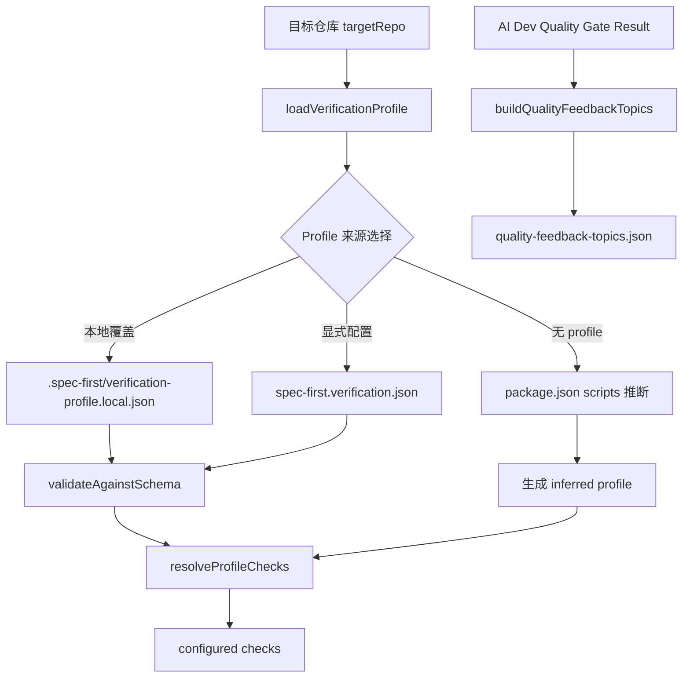
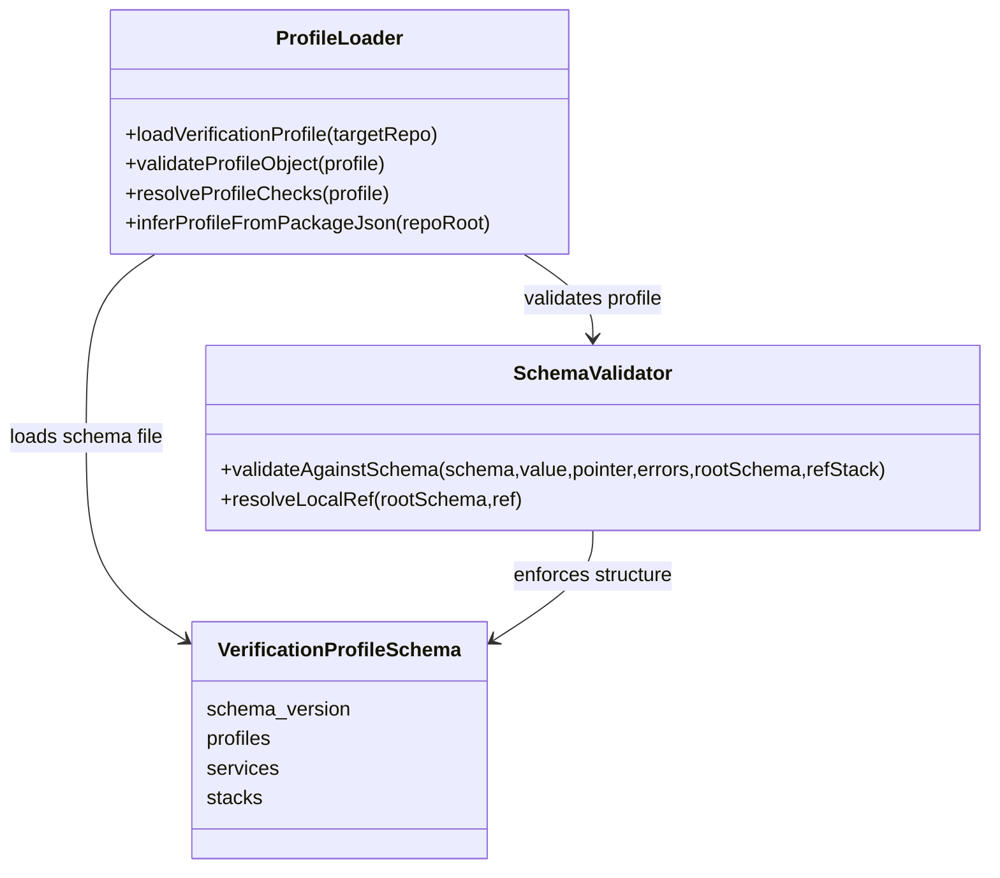
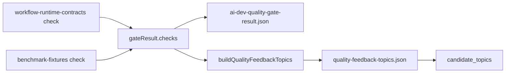

本页位于“契约与质量”分组中的当前位置：[Verification Profile、Schema 校验与质量反馈](26-verification-profile-schema-xiao-yan-yu-zhi-liang-fan-kui)。它只解释三个相邻但职责不同的机制：Verification Profile 如何声明可验证检查，轻量 Schema Validator 如何提供确定性的契约校验，Quality Feedback 如何把质量门禁失败转化为后续可消费的被动反馈主题；它不展开测试体系、发布门禁、Context Governance 或新增 Skill 接入规范。Sources: [profile-loader.js](src/verification/profile-loader.js#L9-L23), [schema-validator.js](src/contracts/schema-validator.js#L47-L198), [quality-feedback.js](src/verification/quality-feedback.js#L24-L50)

## 架构假设与验证结论

从代码边界看，Verification Profile 不是“执行器”，而是**检查声明与解析层**：它先定位目标仓库，再按本地覆盖、显式文件、package.json 推断的顺序加载检查定义，最后把 profile、service、stack 三层引用解析为扁平 checks；Schema Validator 是这个声明层的确定性结构守门人；Quality Feedback 则消费质量门禁结果，把失败 check 归一化为候选反馈主题。Sources: [profile-loader.js](src/verification/profile-loader.js#L27-L50), [profile-loader.js](src/verification/profile-loader.js#L142-L200), [quality-feedback.js](src/verification/quality-feedback.js#L24-L50)

这个流程的关键约束是**声明、校验、反馈三段解耦**：profile schema 的描述明确声明它负责服务栈与检查命令身份，不执行检查或决定验证状态；测试也覆盖了“加载显式 profile 并解析命令但不执行”的行为。Sources: [verification-profile.schema.json](docs/contracts/verification/verification-profile.schema.json#L1-L5), [verification-profile.test.js](tests/unit/verification-profile.test.js#L94-L110)

## Verification Profile 的数据模型

Verification Profile 的规范版本固定为 `verification-profile.v1`，默认显式文件名是 `spec-first.verification.json`，本地覆盖文件是 `.spec-first/verification-profile.local.json`，并且存在 `.spec-first/config.local.yaml` 到本地 profile 路径的受限别名机制；默认可推断脚本名称覆盖 typecheck、test、unit、smoke、integration、e2e、lint、build 等常见 npm scripts。Sources: [profile-loader.js](src/verification/profile-loader.js#L9-L23), [profile-loader.js](src/verification/profile-loader.js#L53-L83)

Profile 的 schema 要求顶层必须包含 `schema_version`、`default_profile`、`profiles`、`services`、`stacks`，且禁止额外顶层字段；其中 profile 选择 service 与 checks，service 声明 path、stack、required，stack 声明 detect、commands、runner_kind、required_tools。Sources: [verification-profile.schema.json](docs/contracts/verification/verification-profile.schema.json#L5-L16), [verification-profile.schema.json](docs/contracts/verification/verification-profile.schema.json#L17-L82)

| 层级 | 必需字段 | 语义 |
|---|---|---|
| 顶层 profile | `schema_version`, `default_profile`, `profiles`, `services`, `stacks` | 声明验证契约整体结构 |
| `profiles.<name>` | `services`, `checks` | 指定该 profile 要覆盖哪些服务与检查 |
| `services.<id>` | `path`, `stack`, `required` | 指定服务路径、技术栈引用与是否必需 |
| `stacks.<id>` | `detect`, `commands`, `runner_kind`, `required_tools` | 指定检查命令、运行器类别与依赖工具 |

仓库根目录中的标准 profile 示例把 `default` profile 绑定到 `spec-first` 服务，并将 `typecheck`、`unit`、`smoke`、`integration` 四类检查映射到 npm scripts，同时为每个检查声明 `npm-script` runner 和 `node`、`npm` 依赖工具。Sources: [spec-first.verification.json](spec-first.verification.json#L1-L40)

## Profile 来源选择与状态语义

加载入口 `loadVerificationProfile` 首先解析目标仓库；目标仓库不可用时返回 `rejected` 与 `target-repo-not-found`，否则依次尝试本地覆盖、显式 profile、package.json 推断。这个顺序意味着个人或机器本地配置可以覆盖团队显式 profile，而没有任何 profile 文件时仍可从 npm scripts 中获得最低限度的验证入口。Sources: [profile-loader.js](src/verification/profile-loader.js#L27-L50), [profile-loader.js](src/verification/profile-loader.js#L53-L72)

本地覆盖路径的别名非常保守：`config.local.yaml` 只接受 `verification_profile_path: .spec-first/verification-profile.local.json` 这一目标值，其他路径会被解析为空；这限制了本地配置把 profile 指向任意位置的能力。Sources: [profile-loader.js](src/verification/profile-loader.js#L74-L83), [verification-profile.test.js](tests/unit/verification-profile.test.js#L116-L135)

| 状态 | 典型 `reason_code` | 触发条件 |
|---|---|---|
| `configured` | `profile-loaded` | 成功读取并解析显式或本地 profile |
| `configured` | `profile-inferred` | 无 profile 文件，但从 package.json scripts 推断出检查 |
| `not-configured` | `package-json-missing` | 无 profile 且没有 package.json |
| `not-configured` | `verification-scripts-missing` | package.json 中没有可推断验证脚本 |
| `invalid` | `profile-unreadable` | profile JSON 读取或解析失败 |
| `invalid` | `profile-schema-invalid` | profile 不满足 schema |
| `invalid` | `profile-default-missing` / `profile-resolution-invalid` | profile 内部引用无法解析 |
| `rejected` | `target-repo-not-found` | 目标仓库解析失败 |

当显式 profile 文件无法读取或 JSON 解析失败时，加载器返回 `invalid/profile-unreadable`；当 Schema 校验失败时返回 `invalid/profile-schema-invalid`；当 schema 通过但默认 profile、service、stack、command、runner_kind、required_tools 的交叉引用缺失时，返回 resolution 级错误而不是继续生成部分 checks。Sources: [profile-loader.js](src/verification/profile-loader.js#L85-L134), [profile-loader.js](src/verification/profile-loader.js#L142-L200)

## 从 package.json 推断 Profile

当仓库没有本地或显式 profile 时，加载器读取 `package.json`，只从固定白名单脚本名中生成 commands；命令形式统一为 `npm run <scriptName>`，每个推断检查的 `runner_kind` 都是 `npm-script`，`required_tools` 都是 `node` 与 `npm`。Sources: [profile-loader.js](src/verification/profile-loader.js#L203-L242)

推断出来的 profile 使用 `inferred` 作为默认 profile，创建 `root` 服务，服务路径为 `.`，stack 为 `package-scripts`，再把推断出的 commands、runner_kind、required_tools 组装成标准 profile 结构并解析为 checks。Sources: [profile-loader.js](src/verification/profile-loader.js#L244-L278)

测试确认推断只接受白名单内脚本：包含 `typecheck` 与 `test:unit` 的 package.json 会生成对应检查，而 `setup` 这类非验证脚本不会被纳入。Sources: [verification-profile.test.js](tests/unit/verification-profile.test.js#L141-L166)

## Schema Validator 的职责边界

`validateAgainstSchema` 是项目内的轻量确定性校验器，支持 `$ref`、type、enum、const、required、properties、items、additionalProperties、anyOf、oneOf、allOf、if/then/else、数组长度、字符串长度、pattern 与数值边界等关键字。Sources: [schema-validator.js](src/contracts/schema-validator.js#L3-L27), [schema-validator.js](src/contracts/schema-validator.js#L47-L198)

它不是完整 JSON Schema 引擎：项目文档明确说明该实现用于 spec-first 的契约测试与 doctor evidence checks，不应被当作 Ajv 或其他标准完备校验器的替代品；如果契约需要完整 JSON Schema 行为，应为该消费者增加显式依赖与测试。Sources: [schema-validator.md](docs/contracts/schema-validator.md#L1-L4), [schema-validator.md](docs/contracts/schema-validator.md#L23-L28)

对象校验不是只在显式 `type: object` 时触发；只要 schema 带有 required、properties 或 additionalProperties 等对象级约束，且 value 是普通对象，校验器就会检查必填键、属性 schema 与额外字段。这一点避免了省略 type 的子 schema 静默放行缺失字段。Sources: [schema-validator.js](src/contracts/schema-validator.js#L38-L45), [schema-validator.js](src/contracts/schema-validator.js#L124-L154)

## Profile 解析的引用完整性

`resolveProfileChecks` 的核心不是执行命令，而是把 `profiles.<name>.services[]` 与 `profiles.<name>.checks[]` 交叉展开到具体 service 与 stack；每个生成的 check 都包含 id、profile、service、service_path、service_required、stack、runner_kind、command、required_tools。Sources: [profile-loader.js](src/verification/profile-loader.js#L142-L200)

解析阶段会拒绝悬空引用：默认 profile 不存在、profile 引用的 service 不存在、service 引用的 stack 不存在、stack 没有某个 check 的 command、runner_kind 或 required_tools，都会记录错误并使解析结果带有 `profile-resolution-invalid`。Sources: [profile-loader.js](src/verification/profile-loader.js#L142-L181), [profile-loader.js](src/verification/profile-loader.js#L196-L200)

测试覆盖了 canonical 引用缺失场景：当 profile 的 checks 指向 `missing`，但 stack 没有对应 command 时，错误包含 `stack node does not define command for check missing`。Sources: [verification-profile.test.js](tests/unit/verification-profile.test.js#L236-L241)

## CLI 暴露的 Loader 边界

内部 CLI 边界是 `verification-profile load --target-repo <repo> [--json]`；它只调用 `loadVerificationProfile` 并输出 JSON，返回码规则是 configured 或 not-configured 返回 0，invalid 或 rejected 返回 1，参数错误返回 2。Sources: [verification-profile.js](src/cli/helpers/verification-profile.js#L5-L27), [verification-profile.js](src/cli/helpers/verification-profile.js#L29-L52)

测试确认内部 CLI 会暴露 profile loader 的解析结果：对含有显式 profile 的临时仓库执行 `verification-profile load --target-repo ... --json` 后，输出状态为 configured，checks 中包含 `typecheck` 与 `unit`。Sources: [verification-profile.test.js](tests/unit/verification-profile.test.js#L195-L214)

## Artifact 路径与质量反馈产物

质量门禁产物路径通过 `resolveWorkflowArtifactDir` 统一落在 `<repoRoot>/.spec-first/workflows/<workflow>/<slug>/`，并且 workflow 与 slug 必须是安全路径片段；实现还检查 Windows 非法文件名、保留名，以及 artifact 目录必须停留在 anchor root 内。Sources: [artifact-paths.js](src/verification/artifact-paths.js#L34-L52), [artifact-paths.js](src/verification/artifact-paths.js#L54-L93)

AI Dev Quality Gate 使用该路径机制创建 `.spec-first/workflows/quality-gates/ai-dev-quality-gate/`，写入 `ai-dev-quality-gate-result.json`，随后根据 gate result 生成 `quality-feedback-topics.json`，并在返回结果中暴露 result 与 feedback artifact 的相对路径。Sources: [run-ai-dev-quality-gate.js](scripts/run-ai-dev-quality-gate.js#L138-L164)

Quality Feedback 的 schema 要求顶层包含 `schema_version`、`generated_at`、`source`、`latest_gate`、`candidate_topics`，其中 source 固定为 `passive-quality-feedback`，candidate topic 的 kind 目前允许 `failed-check` 与 `failed-evidence`。Sources: [quality-feedback-topics.schema.json](docs/contracts/quality-gates/quality-feedback-topics.schema.json#L1-L26), [quality-feedback-topics.schema.json](docs/contracts/quality-gates/quality-feedback-topics.schema.json#L71-L127)

## Quality Feedback 的归一化规则

`buildQualityFeedbackTopics` 遍历质量门禁结果中的 checks，只把 `passed === false` 且存在 `check_id` 的 check 转为 topic；成功 check 不会生成候选主题，因此该机制不会凭空发明工作流状态。Sources: [quality-feedback.js](src/verification/quality-feedback.js#L7-L22), [quality-feedback.js](src/verification/quality-feedback.js#L24-L50)

失败 check 会被归一化为 `topic_id: gate-check:<check_id>`、`kind: failed-check`、`topic_key` 与 `scope_hint` 均来自 check_id，artifact_paths 只收集 check 的 artifact_path，tags 固定包含 `quality-gate`、check_id 与 check.kind。Sources: [quality-feedback.js](src/verification/quality-feedback.js#L7-L22)

测试验证了失败门禁的反馈形态：`workflow-runtime-contracts` 失败时会生成一个 `failed-check` topic，并把 junit artifact 路径放入 artifact_paths；同时 latest_gate 记录 gate id、passed、generated_at 与 gate result artifact 路径。Sources: [quality-feedback.test.js](tests/unit/quality-feedback.test.js#L18-L58)

成功门禁的测试则确认 candidate_topics 为空，但 latest_gate 仍记录最近一次 gate 的元信息，这使反馈产物同时具备“最新门禁索引”和“失败主题输入”两种用途。Sources: [quality-feedback.test.js](tests/unit/quality-feedback.test.js#L61-L88)

## 高级开发者的使用判断

当你需要声明“这个仓库或服务应该跑哪些验证命令”时，应修改 Verification Profile；当你需要保证 profile 或反馈产物形态不漂移时，应依赖 schema 与契约测试；当你需要把失败质量门禁沉淀为后续分析输入时，应读取 `quality-feedback-topics.json`，而不是把 gate result 当成语义主题列表直接消费。Sources: [verification-profile.schema.json](docs/contracts/verification/verification-profile.schema.json#L3-L5), [quality-feedback.js](src/verification/quality-feedback.js#L24-L50), [quality-feedback-topics.schema.json](docs/contracts/quality-gates/quality-feedback-topics.schema.json#L71-L127)

| 需求 | 应使用的机制 | 不应混用的边界 |
|---|---|---|
| 声明验证命令 | Verification Profile | 不在 profile loader 中执行命令 |
| 校验契约形态 | Schema Validator | 不假设它是完整 JSON Schema 引擎 |
| 暴露失败主题 | Quality Feedback | 不把成功 check 转成候选主题 |
| 定位产物 | Artifact Path Resolver | 不允许路径逃逸到 artifact anchor root 外 |

从工程闭环看，本页机制处在“质量契约与反馈输入”位置：它为后续测试、治理与上下文传递提供结构化事实，但不替代测试体系本身，也不定义上下文注入策略。继续阅读时，建议先进入 [测试体系、契约测试与发布质量门禁](28-ce-shi-ti-xi-qi-yue-ce-shi-yu-fa-bu-zhi-liang-men-jin) 理解这些契约如何被门禁执行，再阅读 [Context Governance 与 Summary-First 证据传递](27-context-governance-yu-summary-first-zheng-ju-chuan-di) 理解反馈与证据如何被压缩传递。Sources: [run-ai-dev-quality-gate.js](scripts/run-ai-dev-quality-gate.js#L88-L103), [run-ai-dev-quality-gate.js](scripts/run-ai-dev-quality-gate.js#L138-L164), [quality-feedback.js](src/verification/quality-feedback.js#L24-L50)