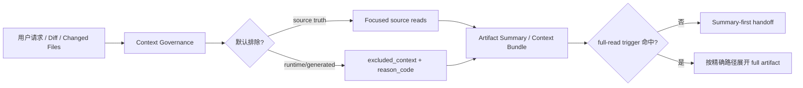
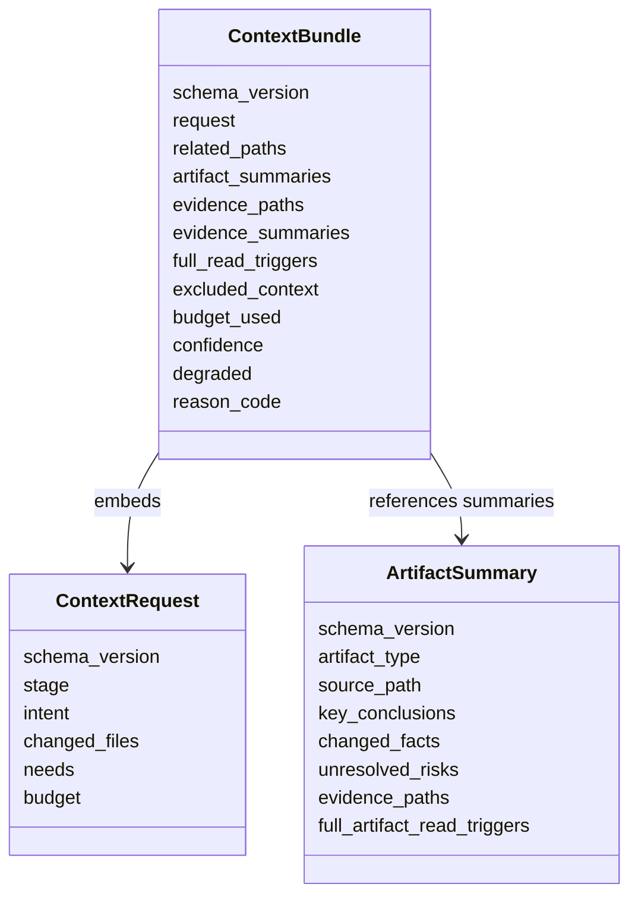

本页位于“契约与质量”章节，聚焦 **Context Governance** 如何把上下文读取从“全量广播”约束为“有界、可追溯、按需展开”的工程协议；它只讨论普通 workflow 的上下文边界、runtime/generated artifact 排除、summary-first handoff、context-bundle envelope 与预算降级，不展开测试门禁、Schema 校验、Workflow Contract 或安全隐私边界，这些分别属于 [Verification Profile、Schema 校验与质量反馈](26-verification-profile-schema-xiao-yan-yu-zhi-liang-fan-kui)、[Workflow Contract、Artifact Summary 与 Handoff 协议](25-workflow-contract-artifact-summary-yu-handoff-xie-yi) 和 [安全、隐私与外部工具证据边界](30-an-quan-yin-si-yu-wai-bu-gong-ju-zheng-ju-bian-jie)。Sources: [context-governance.md](docs/contracts/context-governance.md#L1-L14), [context-bundle.md](docs/contracts/context-bundle.md#L16-L22)

## 架构假设：上下文治理不是 Router，而是 Context Harness 的边界合同

从第一性原则看，spec-first 的上下文治理不是要让一个中心化组件替 LLM 判断语义相关性，而是把“哪些内容默认不应进入普通上下文”“如何传递证据摘要”“何时允许展开完整 artifact”这些边界固化为合同；`context-governance.md` 明确声明它不是 Context Router 或 workflow 状态机，只定义普通 workflow 读取 repo context 时必须遵守的最小 runtime exclusion policy，同时保留 source-first、summary-first、path-backed evidence 的读取方式。Sources: [context-governance.md](docs/contracts/context-governance.md#L1-L14), [context-governance.md](docs/contracts/context-governance.md#L15-L21)

在 AI Coding Harness 分层中，Context Harness 的职责是向 LLM 提供有界、相关、可追溯的上下文，并避免广播整个 repo、generated runtime、raw MCP dump 或长 artifact；其主要合同正是 `context-governance.md`、`context-bundle.md` 和 `artifact-summary.md`，因此本页可视为六层架构中“上下文层”的具体治理机制。Sources: [ai-coding-harness.md](docs/contracts/ai-coding-harness.md#L15-L24)

这张图表达的核心关系是：治理层不替 workflow 做语义判断，而是在读取前先应用 runtime/generated 排除、在传递时优先使用 summary 与路径、在证据不足时才触发精确 full-read；脚本侧准备路径、预算、reason code、artifact refs 等确定性事实，LLM workflow 仍负责 scope、finding、root cause、任务排序等语义判断。Sources: [ai-coding-harness.md](docs/contracts/ai-coding-harness.md#L26-L33), [context-bundle.md](docs/contracts/context-bundle.md#L3-L7)

## 默认排除：把 runtime 与 generated mirror 从普通上下文中移除

普通 workflow 默认不把 `.spec-first/audits/**`、`.spec-first/governance/**`、`.claude/**`、`.codex/**`、`.agents/skills/**` 纳入上下文候选集；这些路径分别代表审计执行产物、治理观测证据、Claude/Codex 的 generated runtime mirror 或 Codex-facing generated skill mirror，而普通 workflow 仍可读取 checked-in source truth，例如 `skills/`、`agents/`、`templates/`、`src/cli/`、`docs/contracts/`、`AGENTS.md`、`CLAUDE.md`、`README*` 以及当前任务直接相关的源码、测试、计划或需求文档。Sources: [context-governance.md](docs/contracts/context-governance.md#L22-L35)

| 路径范围 | 默认处理 | reason_code | 设计含义 |
| --- | --- | --- | --- |
| `.spec-first/audits/**` | 排除 | `runtime_audit_artifact_excluded` | 审计产物体积大、可重建，不是普通 source truth |
| `.spec-first/governance/**` | 排除 | `runtime_governance_artifact_excluded` | 治理观测证据只在周期审计或显式治理复查中读取 |
| `.claude/**` / `.codex/**` | 排除 | `generated_runtime_mirror_excluded` | 宿主本地 runtime mirror，不作为 source fix |
| `.agents/skills/**` | 排除 | `generated_runtime_mirror_excluded` | Codex-facing generated skill mirror |
| `skills/`、`src/cli/`、`docs/contracts/` 等 source truth | 允许按需读取 | 不适用 | 普通 workflow 的可验证事实来源 |

这组排除规则不是 `.gitignore` 的别名：合同明确说明不把 `.gitignore` 当作 LLM context policy 的唯一来源，并要求普通 plan/work/debug/review/compound/session 上下文收集先读取用户请求、diff、changed files、计划/需求/task-pack summary，再读取 source-of-truth 与 nearby implementation/test slices，最后才在 summary 证据不足或任务明确需要时按精确路径读取 full artifact/raw evidence。Sources: [context-governance.md](docs/contracts/context-governance.md#L15-L21), [context-governance.md](docs/contracts/context-governance.md#L97-L109)

## Host instruction 复用：不要把入口指令当成每次必读文件

`AGENTS.md`、`CLAUDE.md` 和项目角色文档属于 host/project instruction layer；Claude 或 Codex 进入仓库时通常已经把适用入口指令注入当前会话，所以普通 workflow 的 orientation 应优先使用已加载的 host/project instructions，而不是因为 prompt 模板需要“校准”就重新读取根指令文件。Sources: [context-governance.md](docs/contracts/context-governance.md#L36-L49)

允许精确读取 instruction source 的情况被限制为五类：用户明确点名 instruction 文件或路径；任务正在修改、审查、生成或诊断 instruction/runtime/setup/update/audit/source-runtime drift；已加载指令缺失、stale 或与 source 冲突；需要检查目录级 `AGENTS.md`/`CLAUDE.md` 是否管辖 changed files；以及 `spec-code-review` 的 project-standards persona 需要自包含 standards path list。Sources: [context-governance.md](docs/contracts/context-governance.md#L40-L48)

## Summary-first：传递结论、路径与触发条件，而不是复制完整 artifact

`artifact-summary.v1` 是 durable workflow artifact 的共享 summary-first handoff 合同；它让下游 plan、work、review、compound、release 先消费简短摘要与精确 evidence paths，再决定是否读取完整 artifact，并明确自己不是第二份完整报告、不是 underlying artifact 的 source-of-truth 替代品，也不是 script-owned semantic conclusion。Sources: [artifact-summary.md](docs/contracts/artifact-summary.md#L1-L20)

`artifact-summary.v1` 的关键字段包括 `artifact_type`、`source_path`、`producer`、`goal`、`scope`、`non_goals`、`key_conclusions`、`changed_facts`、`unresolved_risks`、`evidence_paths`、`evidence_summaries`、`recommended_next_action` 与 `full_artifact_read_triggers`；这些字段让下游既能快速理解 artifact 的工程意义，又能回到具体路径做 source/test/contract confirmation。Sources: [artifact-summary.md](docs/contracts/artifact-summary.md#L21-L53)

| 维度 | Summary-first 做法 | 禁止或避免的做法 |
| --- | --- | --- |
| 计划/任务交接 | 汇总 goal、scope、non-goals、implementation units、validation、open questions | 把完整计划全文复制给所有 downstream agent |
| Review 交接 | 汇总 verdict、actionable findings、residual status、evidence paths、完整 reviewer artifact path | 广播完整 reviewer JSON 或长报告正文 |
| Work 交接 | 汇总 changed files、verification commands、review tier、residual status | 把完整会话 transcript 当作证据 |
| Tool-heavy artifact | 汇总 exit code、reason_code、关键字段、raw log paths | 嵌入 raw output、raw MCP dump 或大 JSON |
| Direct/session evidence | 记录 source reads required、commands used、limitations、redaction status | 把 session-local evidence 当成 finding/root cause 的 source of truth |

Consumer 规则同样严格：先读 summary；只有 `full_artifact_read_triggers` 适用时才展开完整 artifact；agent handoff 传递 summary 和 paths，不复制 full artifact body；缺少 summary 时标记 `summary_missing` 并读取最小可用 status、manifest 或 explicit path；如果展开完整 artifact，则记录 `full_artifact_read_reason` 并对应具体触发原因。Sources: [artifact-summary.md](docs/contracts/artifact-summary.md#L55-L73)

## Context Bundle：把动态上下文装入可审查 envelope

`context-request.v1` 与 `context-bundle.v1` 是轻量上下文包合同，用于把当前任务需要的 related paths、artifact summaries、evidence paths 与 full-read triggers 放进一个可审查 envelope；它同样不是中心化 Context Router 或 workflow 状态机，脚本只准备确定性路径、预算和 reason，LLM 仍决定哪些上下文足以支持当前 plan、work、review 或 compound 判断。Sources: [context-bundle.md](docs/contracts/context-bundle.md#L1-L8)

`context-bundle.v1` 的目标是为高频 workflow 提供 cache-friendly dynamic suffix，避免向 reviewer/worker/researcher 发送 full repo、full docs、full artifact 或 generated runtime mirror，同时记录 included/excluded context 的 reason_code，在预算超限时显式 degraded，并保留 path-backed evidence；完整内容只在 `full_read_triggers` 命中时按路径展开。Sources: [context-bundle.md](docs/contracts/context-bundle.md#L9-L15)

这个类图对应合同字段：`context-request.v1` 描述 stage、intent、changed files 与预算；`context-bundle.v1` 描述 related paths、artifact summaries、evidence paths、evidence summaries、full-read triggers、excluded_context 与 degraded 状态；`artifact-summary.v1` 则作为 durable artifact 的 summary-first handoff 被 bundle 引用。Sources: [context-bundle.md](docs/contracts/context-bundle.md#L23-L99), [artifact-summary.md](docs/contracts/artifact-summary.md#L21-L53)

## Cache-friendly prompt layout：稳定前缀与动态后缀分层

高频 workflow 应把输入拆成两个稳定层：stable instruction prefix 放 role contract、workflow contract summary、hard boundaries、reference index、source/runtime policy，并保持稳定排序与稳定措辞；dynamic suffix 放当前 user request、diff summary、changed files、tool summary、artifact summary、context bundle、temporary evidence paths，大输出使用 summary + path，full content 按 trigger 精确展开。Sources: [context-governance.md](docs/contracts/context-governance.md#L71-L80), [context-bundle.md](docs/contracts/context-bundle.md#L101-L111)

| Prompt 层 | 内容 | 变化频率 | 规则 |
| --- | --- | --- | --- |
| Stable instruction prefix | role contract、workflow contract summary、hard boundaries、reference index、source/runtime policy | 低 | 稳定排序、稳定措辞，不混入 git status、测试输出、raw log 或一次性诊断 |
| Dynamic suffix | user request、diff summary、changed files、tool summary、artifact summary、context bundle、temporary evidence paths | 高 | 每轮按需生成；大输出 summary + path；full content 只在 trigger 命中时读取 |

这套布局直接服务上下文预算与缓存友好性：普通 workflow 应优先传递 `context-bundle.md` 定义的 compact facts，以及 `artifact-summary.md` 定义的 summary-first handoff，而不是复制 full artifact、full report、raw MCP dump 或完整 external-tool output。Sources: [context-governance.md](docs/contracts/context-governance.md#L71-L81), [context-governance.md](docs/contracts/context-governance.md#L50-L62)

## 内部 helper 的实现边界：规范化、排除、预算与降级

内部 helper `spec-first internal context-bundle --json --stage <stage>` 可从显式 path arguments 生成 context envelope；实现中 `buildContextBundle` 会收集 changed files、related paths、artifact summaries 与 evidence paths，分别标记来源与 reason，然后应用 runtime exclusion、文件预算、token 估算，最后输出 `schema_version: spec-first.context-bundle.v1`、request、related_paths、artifact_summaries、evidence_paths、full_read_triggers、excluded_context、budget_used、confidence、degraded 与 reason_code。Sources: [context-bundle.md](docs/contracts/context-bundle.md#L116-L121), [context-bundle.js](src/cli/helpers/context-bundle.js#L243-L337)

实现侧的排除前缀覆盖 `.spec-first/audits`、`.spec-first/governance`、`.spec-first/workspace`、`.spec-first/app-audit`、`.spec-first/workflows`、`.spec-first/sessions`、`.claude`、`.codex` 和 `.agents/skills`；当 `allowRuntimeContext` 未开启时，匹配这些前缀的路径会进入 `excluded_context`，并携带对应 `kind`、`path`、`reason_code` 与 reason。Sources: [context-bundle.js](src/cli/helpers/context-bundle.js#L10-L71), [context-bundle.js](src/cli/helpers/context-bundle.js#L339-L369)

路径安全不是字符串前缀检查那么简单：helper 会把输入路径解析为 repo-relative canonical path，并检查 repo 外路径或 symlink escape；`normalizeContextPath` 通过 repoRoot、invocation cwd、relative path 与 realpath escape 判断 `outsideRepo`，`realPathEscapesRepo` 会对存在路径或最近存在祖先做 realpath 检查，防止 repo 内 symlink 指向 repo 外仍被当作普通上下文读取。Sources: [context-bundle.js](src/cli/helpers/context-bundle.js#L396-L456), [context-governance.md](docs/contracts/context-governance.md#L106-L109)

预算压力以 degraded envelope 表达，而不是静默全量读取：`applyFileBudget` 在达到 `maxFiles` 后把剩余条目写入 `excluded_context` 并标记 `context_budget_exceeded`；`buildContextBundle` 还会根据估算 token 与 `maxTokens` 设置 `confidence: low`、`degraded: true` 和 `reason_code: context_budget_exceeded`。Sources: [context-bundle.js](src/cli/helpers/context-bundle.js#L302-L337), [context-bundle.js](src/cli/helpers/context-bundle.js#L371-L390)

## 允许例外：显式 runtime 任务可以读 runtime artifact，但不改变 source-of-truth

合同允许少量任务在明确范围内读取 runtime artifacts：`spec-mcp-setup` / `spec-first update` CLI 可读取 runtime delivery、host setup、drift repair 所需路径；`spec-skill-audit` 可读取 `.spec-first/audits/skill-audit/**` 的本轮 summary、scorecard、runtime-drift evidence，并可在 governance health pass 读取 `.spec-first/governance/rule-maturity.json` 的观测汇总；`spec-app-consistency-audit` 可读取 `.spec-first/app-audit/**` 的 run-scoped evidence；changelog author resolution 可读取 `~/.spec-first/.developer`，但只用于 `CHANGELOG.md` 作者字段，不纳入 broad context bundle。Sources: [context-governance.md](docs/contracts/context-governance.md#L82-L96)

这些例外不改变 source-of-truth：generated runtime mirrors 仍应通过 source 修改后运行 `spec-first init` 并选择目标宿主来修复，不能手改 mirror 作为 source fix；这也是为什么普通 workflow 的排除规则同时覆盖 `.claude/**`、`.codex/**` 与 `.agents/skills/**`。Sources: [context-governance.md](docs/contracts/context-governance.md#L82-L96), [context-governance.md](docs/contracts/context-governance.md#L22-L35)

## Changelog 消费：强制记录不等于全量预读

`CHANGELOG.md` 对 project source changes 仍是 mandatory，但上下文治理缩小的是 workflow 如何消费和写入 changelog context：普通 plan/work/debug/review context 应读取 changelog 格式指导与最新相关日期窗口，而不是完整历史 changelog；release-history、regression archaeology 或用户明确历史问题可以扩大窗口，但应说明 reason 并保持 path-backed summary。Sources: [context-governance.md](docs/contracts/context-governance.md#L63-L70)

新的 changelog 条目应是 compact breadcrumbs：一句简明摘要命名 source surface，必要时说明用户可见影响，记录 verification status 或 not-run reason，并在长推理需要时指向 plan/review/validation artifact；详细设计理由应放在 requirements、plans、reviews、validation artifacts 或 PR descriptions，而不是把 changelog 变成第二份设计文档。Sources: [context-governance.md](docs/contracts/context-governance.md#L63-L70), [context-governance-contracts.test.js](tests/unit/context-governance-contracts.test.js#L46-L51)

## Failure Modes：排除、缺摘要与预算超限必须可见

上下文治理定义了明确的 failure modes：runtime audit artifact 被排除时返回 path/summary 指针；generated runtime mirror 被排除时指向 source-of-truth 或 update/init workflow；repo 外路径不进入普通 repo context bundle；非 runtime workflow 请求 runtime context 时只读取用户明确路径，否则排除并说明边界；summary 缺失时读取最小 status/manifest 或要求用户确认是否展开 full artifact；预算超限时生成 compact summary 与 excluded_context，而不是 silent full-read。Sources: [context-governance.md](docs/contracts/context-governance.md#L110-L120)

这些 failure modes 在测试中被合同化：测试断言 governance 文档包含默认排除、Host Instruction Reuse Policy、runtime/generated mirror reason codes、outside repo exclusion、Allowed Exceptions、Changelog Consumption Policy，并验证高频 workflow surface 引用 `docs/contracts/context-governance.md` 且携带 `.spec-first/audits/**`、`.spec-first/governance/**`、`.claude/**`、`.codex/**`、`.agents/skills/**` 等排除锚点。Sources: [context-governance-contracts.test.js](tests/unit/context-governance-contracts.test.js#L26-L60), [context-governance-contracts.test.js](tests/unit/context-governance-contracts.test.js#L88-L116)

## Workflow 侧消费：高频入口把治理规则嵌入执行姿态

`spec-work` 的 Context Orientation Anchor 要求从当前用户请求、plan/task pack、already-loaded host/project instructions、package manifests、command registries、nearby implementation/tests、git diff 或 changed files 定向执行，并使用“先读计划/任务摘要和 contract metadata，再读确定性 inventory/validation facts，再读当前 task/phase refs，再读 focused source-of-truth sections，最后才读 deeper references”的 intake order。Sources: [spec-work/SKILL.md](skills/spec-work/SKILL.md#L63-L69)

`spec-code-review` 的 Context Orientation Anchor 同样从 diff scope、用户请求、plan/task/work artifacts、already-loaded host/project instructions、package manifests、nearby implementation/tests 与 test results 定向 review；这说明 summary-first 与 already-loaded instruction reuse 不是单独文档规则，而是高频 workflow 的运行姿态。Sources: [spec-code-review/SKILL.md](skills/spec-code-review/SKILL.md#L59-L62)

合同测试进一步要求 `spec-code-review`、`spec-work`、`spec-plan`、`spec-doc-review` 等高频 workflow 消费 compact context contracts，而不是默认 full broadcast，并要求维护 run-local context ledger，记录 paths read、reason、phase 与 compact summary，在同一 workflow run 内复用已加载 summary，只有确切措辞需要时才重读。Sources: [context-bundle-contracts.test.js](tests/unit/context-bundle-contracts.test.js#L101-L134)

## 实践判定表：何时 summary 足够，何时展开 full artifact

| 场景 | 默认动作 | 可展开 full artifact 的触发 |
| --- | --- | --- |
| 下游只需要上游结论、scope、风险与下一步 | 读取 `artifact-summary.v1` | 无需展开 |
| reviewer 需要可操作 finding 的精确证据 | 先读 summary 与 evidence paths | `full_artifact_read_triggers` 命中，记录 reason |
| summary 缺失 | 标记 `summary_missing`，读最小 status/manifest 或 explicit path | 用户确认或 workflow 明确需要 |
| tool-heavy run 产出 raw log | 传 exit code、reason_code、关键字段、raw log path | 调试 raw failure 且路径明确 |
| runtime/generated path 出现在普通 context 候选中 | 写入 `excluded_context` + reason_code | 只有 setup/update/runtime-drift/audit/governance-health 或用户显式路径请求 |

这张表来自合同中的 producer/consumer 规则、runtime artifact policy 与 failure modes：核心约束是“摘要先行、路径保真、触发再展开、排除要有 reason_code”，从而避免 raw logs、大 JSON、旧 audit snapshots、generated mirrors 或完整 external-tool output 被广播给普通 reviewer/worker。Sources: [artifact-summary.md](docs/contracts/artifact-summary.md#L55-L73), [context-governance.md](docs/contracts/context-governance.md#L50-L62), [context-governance.md](docs/contracts/context-governance.md#L110-L120)

## 与相邻页面的阅读路径

若你要理解本页在整体质量体系中的位置，建议先读 [Workflow Contract、Artifact Summary 与 Handoff 协议](25-workflow-contract-artifact-summary-yu-handoff-xie-yi)，再读本页，随后进入 [测试体系、契约测试与发布质量门禁](28-ce-shi-ti-xi-qi-yue-ce-shi-yu-fa-bu-zhi-liang-men-jin)；若你的关注点是执行中如何形成 evidence 与验证闭环，则应串联 [Verification Profile、Schema 校验与质量反馈](26-verification-profile-schema-xiao-yan-yu-zhi-liang-fan-kui)；若你的关注点是外部工具或隐私证据边界，则继续读 [安全、隐私与外部工具证据边界](30-an-quan-yin-si-yu-wai-bu-gong-ju-zheng-ju-bian-jie)。Sources: [ai-coding-harness.md](docs/contracts/ai-coding-harness.md#L17-L24), [context-bundle.md](docs/contracts/context-bundle.md#L16-L22)