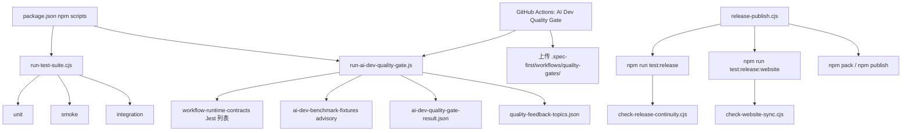
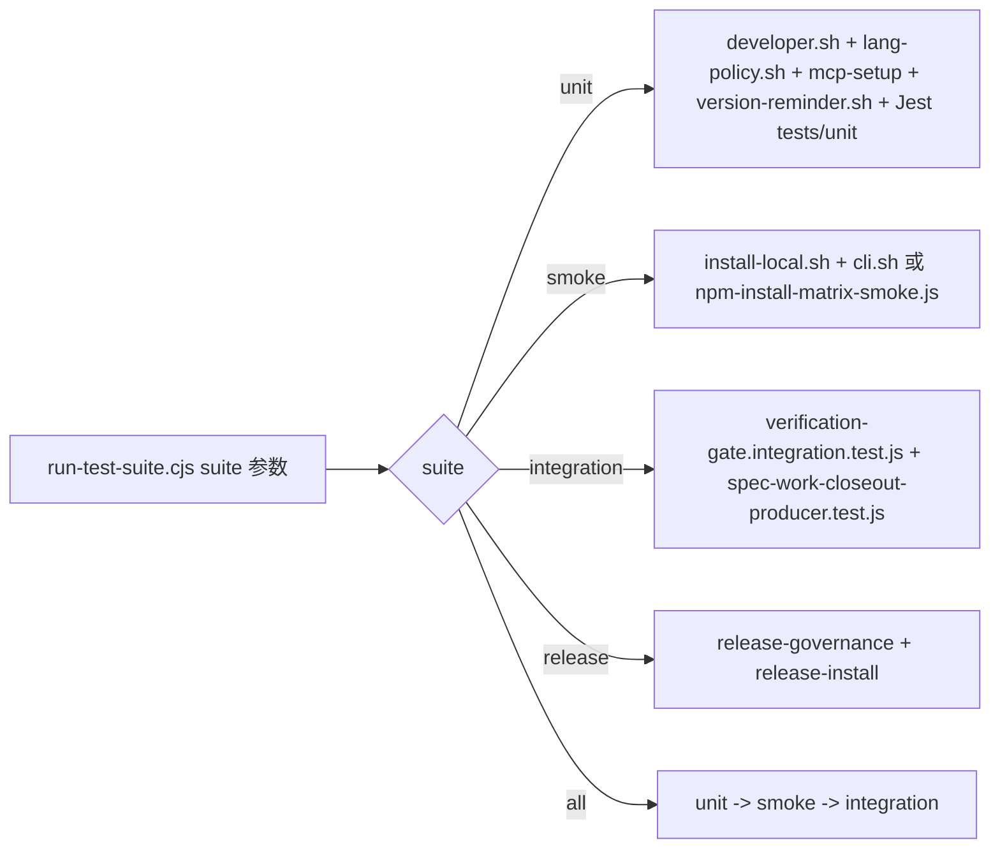
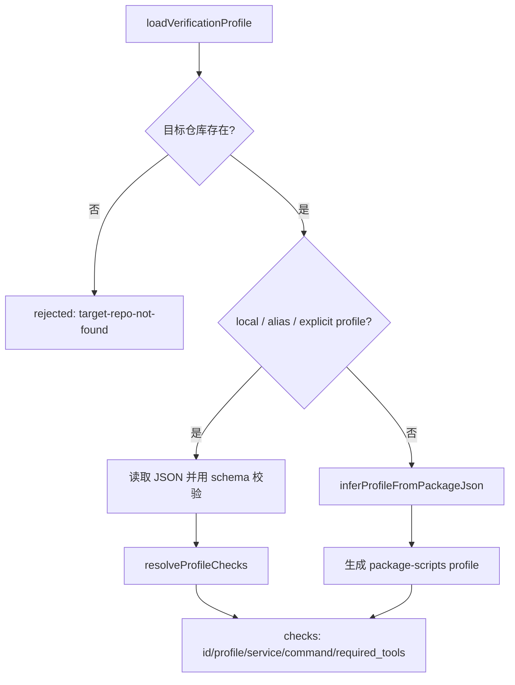

本页解释 spec-first 仓库如何把测试、契约校验、AI Dev Quality Gate、发布连续性检查与安装矩阵组合成可追踪的质量门禁。核心判断是：该项目不是只依赖单一 `jest` 命令，而是以 `scripts/run-test-suite.cjs` 编排本地测试套件，以 `scripts/run-ai-dev-quality-gate.js` 生成质量门禁结果与反馈产物，并在发布脚本中强制执行发布前校验；这些机制共同服务于“事实由脚本产出、结果以仓库产物留痕”的质量闭环。Sources: [package.json](package.json#L15-L35), [run-test-suite.cjs](scripts/run-test-suite.cjs#L69-L124), [run-ai-dev-quality-gate.js](scripts/run-ai-dev-quality-gate.js#L138-L164), [release-publish.cjs](scripts/release-publish.cjs#L109-L132)

## 架构假设与验证结论

从第一性原理看，测试体系要回答三个问题：**哪些检查必须阻断合入或发布**、**哪些检查只提供退化或漂移信号**、**检查结果如何被后续工作流消费**。代码验证显示，阻断性检查主要来自工作流运行时契约测试、发布连续性守卫、发布安装验证与站点同步检查；AI benchmark fixtures 被显式标记为 advisory，不参与 `passed` 的阻断计算，但会进入 `advisory_failures` 和质量反馈产物。Sources: [run-ai-dev-quality-gate.js](scripts/run-ai-dev-quality-gate.js#L88-L103), [ai-dev-quality-gate.test.js](tests/unit/ai-dev-quality-gate.test.js#L61-L126), [check-release-continuity.cjs](scripts/check-release-continuity.cjs#L253-L318)

下面的关系图展示本页范围内的质量门禁链路：本地测试套件负责覆盖单元、冒烟与集成检查；AI Dev Quality Gate 负责聚合工作流运行时契约与 benchmark fixture 信号；CI 负责在相关路径变化时执行门禁并上传产物；发布脚本在打包或发布前再次调用 release gate 与 website gate。Sources: [run-test-suite.cjs](scripts/run-test-suite.cjs#L69-L124), [ai-dev-quality-gate.yml](.github/workflows/ai-dev-quality-gate.yml#L3-L69), [release-publish.cjs](scripts/release-publish.cjs#L109-L132)

## 测试入口与套件分层

`package.json` 暴露了多层测试入口：`test:unit`、`test:smoke`、`test:integration`、`test`、`test:release`、`test:release:governance`、`test:release:install`、`test:ai-dev:gate` 与 `test:ai-dev:benchmarks`。这意味着开发者可以在本地按风险层级选择最小检查，也可以在发布或 CI 中执行聚合门禁。Sources: [package.json](package.json#L23-L35)

| 入口 | 执行目标 | 主要用途 | 阻断属性 |
|---|---|---|---|
| `npm run test:unit` | `run-test-suite.cjs unit` | 单元测试与部分 shell 合约检查 | 本地/CI 可阻断 |
| `npm run test:smoke` | `run-test-suite.cjs smoke` | CLI 与安装冒烟 | 本地/发布可阻断 |
| `npm run test:integration` | `run-test-suite.cjs integration` | 质量门禁集成契约 | 本地/CI 可阻断 |
| `npm test` | `run-test-suite.cjs all` | unit + smoke + integration | 聚合阻断 |
| `npm run test:release` | `run-test-suite.cjs release` | 发布治理 + 发布安装 | 发布阻断 |
| `npm run test:ai-dev:gate` | `run-ai-dev-quality-gate.js` | AI 开发质量门禁 | CI 阻断工作流运行时契约 |
| `npm run test:ai-dev:benchmarks` | `run-ai-dev-benchmark-fixtures.js` | benchmark fixture 结构检查 | advisory 信号 |

表中的分层来自脚本声明与 runner 分发逻辑：`runAll()` 顺序运行 unit、smoke、integration；`runRelease()` 运行 release governance 与 release install；AI Dev Quality Gate 和 benchmark fixtures 是独立 npm 入口。Sources: [package.json](package.json#L23-L35), [run-test-suite.cjs](scripts/run-test-suite.cjs#L115-L137), [run-ai-dev-quality-gate.js](scripts/run-ai-dev-quality-gate.js#L167-L183), [run-ai-dev-benchmark-fixtures.js](scripts/run-ai-dev-benchmark-fixtures.js#L375-L392)

`jest.config.js` 只定义测试环境边界，不承担业务选择逻辑：它加载 `tests/jest-setup.js`，并忽略 `.worktrees`、`.agents`、`.claude`、`.codex`、`.spec-first` 与 benchmark fixture 目录，避免运行时产物、宿主镜像或基准 fixture 被误纳入常规 Jest 扫描。Sources: [jest.config.js](jest.config.js#L3-L21)

## run-test-suite：本地质量检查的统一调度器

`run-test-suite.cjs` 是本地测试编排中心。它以 `spawnSync` 执行 Node、Jest 或 Bash 命令，默认超时为 15 分钟，并允许通过 `SPEC_FIRST_TEST_COMMAND_TIMEOUT_MS` 调整命令超时；如果命令超时或非零退出，runner 会抛出带状态码的错误并在 `main()` 中转化为进程退出码。Sources: [run-test-suite.cjs](scripts/run-test-suite.cjs#L8-L47), [run-test-suite.cjs](scripts/run-test-suite.cjs#L126-L155)

该 runner 对平台差异有明确边界：在原生 Windows 且未设置 `SPEC_FIRST_FORCE_POSIX_TESTS=1` 时，POSIX shell 测试会被跳过或替换为 PowerShell/Node 路径；例如 MCP setup 在 Windows 下只运行 PowerShell 合约测试，smoke 在 Windows 下运行 npm install matrix smoke。Sources: [run-test-suite.cjs](scripts/run-test-suite.cjs#L9-L17), [run-test-suite.cjs](scripts/run-test-suite.cjs#L61-L92), [run-test-suite.cjs](scripts/run-test-suite.cjs#L107-L113)

## 契约测试：用测试锁定公共协议和治理面

契约测试在该仓库中不是一个单独目录，而是一类命名与目的明确的 Jest 测试：例如 `*-contracts.test.js`、`*-contract.test.js`、`branch-protection-policy.test.js`、`package-install-contracts.test.js`、`schema-validator-contracts.test.js` 等。AI Dev Quality Gate 进一步维护了一个显式的 `WORKFLOW_RUNTIME_CONTRACT_TESTS` 列表，用固定测试文件集合覆盖分支保护、安装契约、MCP PowerShell 契约、工作流入口契约、计划状态分类等运行时契约面。Sources: [run-ai-dev-quality-gate.js](scripts/run-ai-dev-quality-gate.js#L16-L30), [ai-dev-quality-gate.test.js](tests/unit/ai-dev-quality-gate.test.js#L186-L203)

这种“显式列表”避免质量门禁从工作流状态中推断检查集合。测试本身断言 `WORKFLOW_RUNTIME_CONTRACT_TESTS` 的完整列表，并断言 GitHub workflow 的 path filters 覆盖治理契约、工作流契约、相关 skills、门禁脚本与测试文件，同时排除已不属于该门禁的旧路径。Sources: [ai-dev-quality-gate.test.js](tests/unit/ai-dev-quality-gate.test.js#L186-L234)

| 契约测试对象 | 例子 | 质量价值 |
|---|---|---|
| 工作流运行时契约 | `spec-plan-contracts.test.js`、`spec-work-contracts.test.js`、`spec-code-review-contracts.test.js` | 防止工作流入口、产物或命令语义漂移 |
| 发布与安装契约 | `package-install-contracts.test.js`、`npm-install-matrix-smoke.test.js`、`release-continuity-guard.test.js` | 防止 npm 包内容、安装路径和发布前检查失配 |
| 治理与分支保护契约 | `branch-protection-policy.test.js`、`agents-governance-contracts.test.js` | 防止治理文件与 CI 必需检查脱节 |
| Schema 与产物契约 | `schema-validator-contracts.test.js`、`ai-dev-quality-gate.test.js` | 防止 JSON 结果、profile 与 gate schema 漂移 |

AI Dev Quality Gate 的契约测试还验证结果 schema：门禁结果必须包含 `schema_version`、`generated_at`、`gate_id`、`passed`、`checks`、`failures` 与 `advisory_failures`；每个 check 必须有 `check_id`、`kind`、`passed`、`summary` 与 `artifact_path`。Sources: [ai-dev-quality-gate-result.schema.json](docs/contracts/quality-gates/ai-dev-quality-gate-result.schema.json#L1-L73), [ai-dev-quality-gate.test.js](tests/unit/ai-dev-quality-gate.test.js#L24-L59)

## Schema 校验器与 Verification Profile 的边界

仓库内置的 schema validator 支持 `$ref`、`type`、`enum`、`const`、`required`、`properties`、`additionalProperties`、组合 schema、字符串长度、数组长度、正则与数值边界等关键字。它的职责是校验结构化 JSON 契约，而不是执行测试命令或解释测试语义。Sources: [schema-validator.js](src/contracts/schema-validator.js#L3-L27), [schema-validator.js](src/contracts/schema-validator.js#L47-L198)

Verification Profile 描述“应该运行哪些检查”，不直接执行检查。仓库根部的 `spec-first.verification.json` 声明默认 profile 为 `default`，服务为 `spec-first`，检查为 `typecheck`、`unit`、`smoke`、`integration`，并把这些检查映射到 `npm run typecheck`、`npm run test:unit`、`npm run test:smoke` 与 `npm run test:integration`。Sources: [spec-first.verification.json](spec-first.verification.json#L1-L40)

当存在显式 profile、local profile 或 `.spec-first/config.local.yaml` 别名时，loader 会优先读取配置；否则会从 `package.json` 推断 `typecheck`、`test`、`test:unit`、`test:smoke`、`test:integration`、`test:e2e`、`lint`、`build` 等脚本，并把它们标记为 `npm-script`、需要 `node` 和 `npm`。Sources: [profile-loader.js](src/verification/profile-loader.js#L27-L51), [profile-loader.js](src/verification/profile-loader.js#L203-L278)

## AI Dev Quality Gate 的聚合模型

AI Dev Quality Gate 的核心常量是 `GATE_ID = ai-dev-quality-gate`，它执行两类检查：一类是阻断性的 `workflow-runtime-contracts`，通过 Jest 运行固定的 `WORKFLOW_RUNTIME_CONTRACT_TESTS`；另一类是 advisory 的 `ai-dev-benchmark-fixtures`，用于暴露 benchmark fixture 漂移但不阻断整体 gate。Sources: [run-ai-dev-quality-gate.js](scripts/run-ai-dev-quality-gate.js#L14-L30), [run-ai-dev-quality-gate.js](scripts/run-ai-dev-quality-gate.js#L105-L135), [run-ai-dev-quality-gate.js](scripts/run-ai-dev-quality-gate.js#L138-L149)

`buildGateResult()` 的阻断逻辑非常明确：它先把 workflow runtime contracts 放入 checks，如果存在 benchmark fixtures 再加入 checks；随后只把 `advisory !== true` 的检查计入 blocking checks，`passed` 只由 blocking checks 决定，`failures` 也只记录阻断失败。Sources: [run-ai-dev-quality-gate.js](scripts/run-ai-dev-quality-gate.js#L88-L103)

benchmark fixture 失败不会让 gate 失败，但会被转换成 `advisory_failures`，其中包含 `check_id`、`reason_code` 与相关 `artifact_paths`。测试用例明确覆盖了一个 `unsafe-path` fixture 失败仍保持 `result.passed === true` 的场景。Sources: [run-ai-dev-quality-gate.js](scripts/run-ai-dev-quality-gate.js#L66-L86), [ai-dev-quality-gate.test.js](tests/unit/ai-dev-quality-gate.test.js#L61-L126)

## Benchmark Fixtures：只声明验证命令，不执行命令

`run-ai-dev-benchmark-fixtures.js` 校验 benchmark fixture 的 manifest，而不是执行 fixture 中声明的验证命令。每个 fixture 的结果会标记 `advisory: true`，并把 `validation_commands_status` 设置为 `declared_only`；这使 fixture 能表达期望工作流、期望产物、质量信号与语义审查记录，同时避免把 benchmark 用例误当作真实端到端执行。Sources: [run-ai-dev-benchmark-fixtures.js](scripts/run-ai-dev-benchmark-fixtures.js#L109-L167), [run-ai-dev-benchmark-fixtures.js](scripts/run-ai-dev-benchmark-fixtures.js#L278-L289)

fixture manifest schema 要求 `schema_version`、`fixture_id`、`scenario_type`、`prompt_path`、`repo_path`、`expected_workflows`、`expected_changed_paths`、`expected_artifacts`、`validation_commands` 与 `quality_signals`。目前允许的 `scenario_type` 是 `api-contract`、`docs-only`、`cli-bugfix` 与 `multi-module-refactor`。Sources: [ai-dev-benchmark-fixture.schema.json](docs/contracts/quality-gates/ai-dev-benchmark-fixture.schema.json#L1-L35), [ai-dev-benchmark-fixture.schema.json](docs/contracts/quality-gates/ai-dev-benchmark-fixture.schema.json#L44-L107)

安全边界集中在路径校验上：脚本拒绝空路径、反斜杠、绝对路径、Windows 绝对路径、归一化后变化的路径、`.` 与 `..` 段；它还检查 prompt、repo、semantic review artifact 是否存在，并要求至少声明一个 expected artifact 与一个 validation command。Sources: [run-ai-dev-benchmark-fixtures.js](scripts/run-ai-dev-benchmark-fixtures.js#L53-L79), [run-ai-dev-benchmark-fixtures.js](scripts/run-ai-dev-benchmark-fixtures.js#L196-L276)

## CI 质量门禁与分支保护契约

`.github/workflows/ai-dev-quality-gate.yml` 在 pull request 中只对相关路径变化触发，包括契约、验证、质量门禁、工作流文档、门禁脚本、关键 skills、相关测试、benchmark fixtures、package 文件以及 workflow 自身。工作流使用 Node 20、执行 `npm ci`，然后运行 `npm run test:ai-dev:gate`，最后无论成功失败都会上传 `.spec-first/workflows/quality-gates/` 下的产物。Sources: [ai-dev-quality-gate.yml](.github/workflows/ai-dev-quality-gate.yml#L3-L69)

分支保护策略以 JSON 契约形式存在，模式为 advisory，目标分支 pattern 是 `main`，必需检查描述为 `AI Dev Quality Gate / ai-dev-gate / npm run test:ai-dev:gate`，并列出覆盖路径。该文件还声明非目标：不修改 GitHub 分支设置、不推断 workflow state、不替代仓库特定的人类判断。Sources: [branch-protection-policy.json](src/cli/contracts/quality-gates/branch-protection-policy.json#L1-L64)

集成测试会同时验证 package scripts、test runner、GitHub workflow 与 branch protection policy 的一致性：它断言 `test:ai-dev:gate`、`test:ai-dev:benchmarks` 与 `test:integration` 存在，断言 workflow 调用 dedicated gate script 并上传产物，也断言分支保护 required check 与 workflow 名称、路径、job、命令保持一致。Sources: [verification-gate.integration.test.js](tests/integration/verification-gate.integration.test.js#L16-L72)

## 发布质量门禁

发布入口 `release-publish.cjs` 在写入目标版本后、打包或发布前，强制运行 `npm run test:release` 与 `npm run test:release:website`。这保证发布校验针对的是目标版本，而不是旧版本；dry-run 会预览 `npm pack --dry-run`，真实发布会先 `npm pack`，再执行 `npm publish --registry=https://registry.npmjs.org --no-git-checks`。Sources: [release-publish.cjs](scripts/release-publish.cjs#L96-L132), [release-publish.test.js](tests/unit/release-publish.test.js#L14-L39)

`test:release` 映射到 `run-test-suite.cjs release`，它会执行 `check-release-continuity.cjs` 和 `tests/smoke/release-dual-host-governance.sh`，然后执行发布安装检查；在 Windows 且未强制 POSIX 时，发布安装检查会走 `npm-install-matrix-smoke.js`。Sources: [package.json](package.json#L32-L35), [run-test-suite.cjs](scripts/run-test-suite.cjs#L102-L118)

Release continuity guard 包含多个 guard：运行时能力目录新鲜度、公共 workflow contract summary 覆盖、package delivery surface、website sync release gate 保留，以及 README 边界链接。最终结果区分 `blocking_failures` 与 `advisory_failures`，只有 blocking failure 会让整体状态变为 failed。Sources: [check-release-continuity.cjs](scripts/check-release-continuity.cjs#L55-L160), [check-release-continuity.cjs](scripts/check-release-continuity.cjs#L199-L239), [check-release-continuity.cjs](scripts/check-release-continuity.cjs#L253-L318)

## 安装矩阵与包交付验证

`npm-install-matrix.yml` 在 push、pull request 或手工触发时运行三操作系统、三 Node 版本矩阵：Ubuntu、macOS、Windows 分别覆盖 Node 20、22、24。非 Windows 直接运行 `node scripts/npm-install-matrix-smoke.js`，Windows 同时覆盖 PowerShell 与 cmd 两种 shell，并上传 `.spec-first/ci/npm-install-matrix/` 产物。Sources: [npm-install-matrix.yml](.github/workflows/npm-install-matrix.yml#L1-L94)

发布连续性检查中的 `package-delivery-surface` 会读取 `package.json` 的 `files` 字段，并用 `npm pack --dry-run --json` 检查 tarball 内容是否包含必需交付面，例如 `docs/catalog/runtime-capabilities.md`、`docs/contracts/workflows/`、关键 scripts、`src/`、`skills/` 与 `templates/`。Sources: [package.json](package.json#L37-L78), [check-release-continuity.cjs](scripts/check-release-continuity.cjs#L119-L197)

## 质量反馈产物

AI Dev Quality Gate 不只输出 pass/fail，还会写入两个产物：`ai-dev-quality-gate-result.json` 与 `quality-feedback-topics.json`。前者记录 gate 汇总结果，后者通过 `buildQualityFeedbackTopics()` 把失败 check 转换为候选质量反馈主题，包含 topic id、kind、summary、scope hint、artifact paths 与 tags。Sources: [run-ai-dev-quality-gate.js](scripts/run-ai-dev-quality-gate.js#L138-L164), [quality-feedback.js](src/verification/quality-feedback.js#L7-L55)

产物目录由 `resolveWorkflowArtifactDir(repoRoot, 'quality-gates', GATE_ID)` 决定，GitHub Actions 上传的路径是 `.spec-first/workflows/quality-gates/`。因此门禁结果既可以被 CI 展示，也可以被后续工作流作为结构化证据读取。Sources: [run-ai-dev-quality-gate.js](scripts/run-ai-dev-quality-gate.js#L138-L158), [ai-dev-quality-gate.yml](.github/workflows/ai-dev-quality-gate.yml#L60-L69)

## 开发者使用建议

日常改动优先运行与变更面匹配的最小检查：改 CLI 或核心逻辑时运行 `npm run test:unit`；改初始化、安装或命令入口时补充 `npm run test:smoke`；改质量门禁、Verification Profile 或 workflow 合约时运行 `npm run test:integration` 与 `npm run test:ai-dev:gate`；准备发布时必须走 `npm run test:release` 与 `npm run test:release:website`，或直接使用发布脚本的 dry-run 路径。Sources: [package.json](package.json#L23-L35), [run-test-suite.cjs](scripts/run-test-suite.cjs#L69-L124), [release-publish.cjs](scripts/release-publish.cjs#L109-L128)

| 变更类型 | 建议命令 | 需要重点查看的产物 |
|---|---|---|
| 单元逻辑或契约测试 | `npm run test:unit` | Jest 输出、shell 测试退出码 |
| CLI 安装或启动体验 | `npm run test:smoke` | smoke 脚本输出 |
| 质量门禁或 workflow 契约 | `npm run test:integration && npm run test:ai-dev:gate` | `.spec-first/workflows/quality-gates/` |
| benchmark fixture | `npm run test:ai-dev:benchmarks` | `benchmark-fixtures-result.json` |
| 发布前检查 | `npm run test:release && npm run test:release:website` | release continuity guard 输出、website sync 输出 |
| 包交付矩阵 | GitHub `npm Install Matrix` workflow | `.spec-first/ci/npm-install-matrix/` |

这些建议完全对应仓库中已有的 npm scripts、runner 分支、CI workflow 与发布脚本，不引入额外约定；如果需要理解质量门禁产物如何进入工作流证据链，可继续阅读 [Verification Profile、Schema 校验与质量反馈](26-verification-profile-schema-xiao-yan-yu-zhi-liang-fan-kui) 与 [Context Governance 与 Summary-First 证据传递](27-context-governance-yu-summary-first-zheng-ju-chuan-di)。Sources: [package.json](package.json#L23-L35), [run-test-suite.cjs](scripts/run-test-suite.cjs#L126-L165), [quality-feedback.js](src/verification/quality-feedback.js#L24-L55)

## 与相邻页面的阅读关系

本页位于“契约与质量”小节中，承接 [Workflow Contract、Artifact Summary 与 Handoff 协议](25-workflow-contract-artifact-summary-yu-handoff-xie-yi) 对工作流产物协议的定义，以及 [Verification Profile、Schema 校验与质量反馈](26-verification-profile-schema-xiao-yan-yu-zhi-liang-fan-kui) 对 profile 与 schema 的解释；读完本页后，建议继续阅读 [新增 Skill、Agent 与命令入口的接入规范](29-xin-zeng-skill-agent-yu-ming-ling-ru-kou-de-jie-ru-gui-fan)，理解新增入口如何进入同一套契约测试与质量门禁。Sources: [profile-loader.js](src/verification/profile-loader.js#L27-L51), [schema-validator.js](src/contracts/schema-validator.js#L47-L198), [run-ai-dev-quality-gate.js](scripts/run-ai-dev-quality-gate.js#L16-L30)