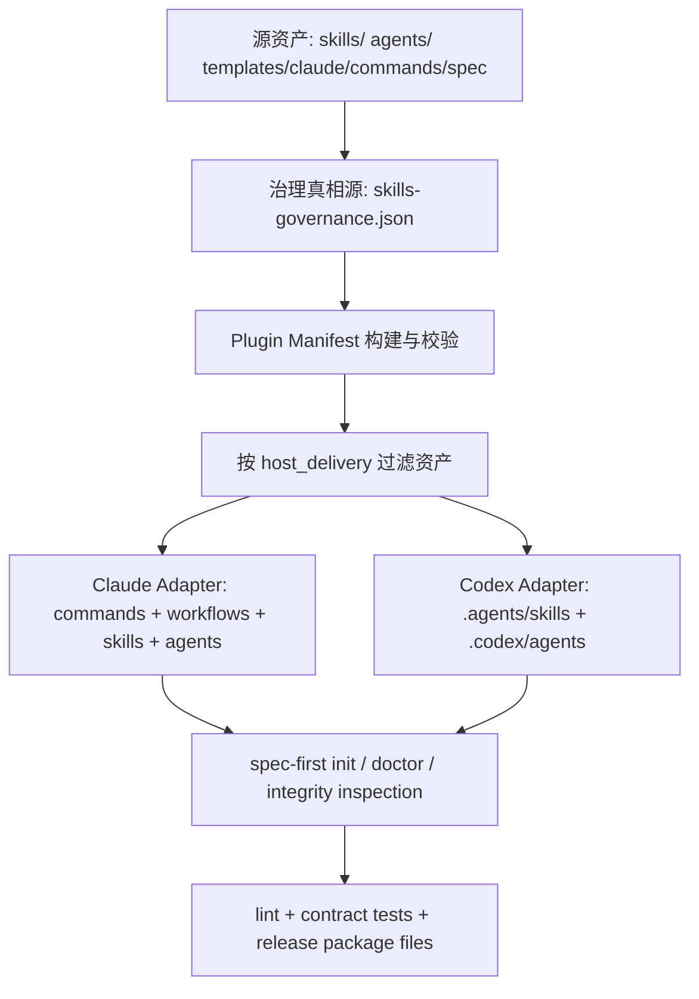
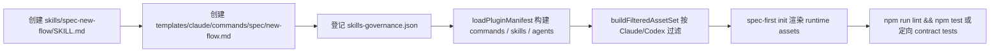
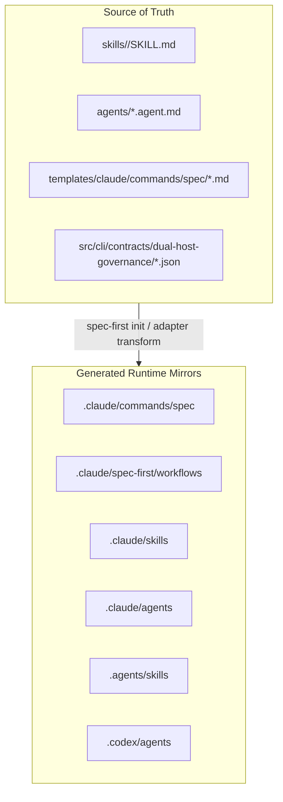

本页定位在目录中的「契约与质量」层，关注新增或修改 `skills/`、`agents/` 与宿主命令入口时，维护者必须同时满足的**源资产、治理清单、运行时投递与质量门禁**。架构假设如下：spec-first 不把 Skill、Agent、命令入口视为孤立 Markdown，而是先从源目录和治理契约生成 manifest，再按 Claude / Codex Adapter 投递到不同 runtime mirror，并通过 lint、contract tests 与 integrity inspection 防止入口漂移；代码验证显示，源目录固定为 `templates/claude/commands/spec`、`skills`、`agents`，治理真相源为 `src/cli/contracts/dual-host-governance/skills-governance.json`，支持的入口面包括 `workflow_command`、`standalone_skill`、`internal_only`。Sources: [plugin.js](src/cli/plugin.js#L15-L34)

这张图只表达接入链路，不表达具体工作流语义：新增 Skill 或 Agent 的行为内容仍在对应 `SKILL.md` 或 `.agent.md` 中维护；命令入口只在 `workflow_command` 类型下成立，并且 Claude 的命令模板只提供 frontmatter 元数据，运行时命令体由配对 Skill 内容合成。Sources: [plugin.js](src/cli/plugin.js#L112-L147), [plan.md](templates/claude/commands/spec/plan.md#L1-L13), [claude.js](src/cli/adapters/claude.js#L66-L78)

## 1. 接入对象的三类边界

新增对象首先要判定它属于哪一种入口面：`workflow_command` 是用户可见的工作流入口，必须有 `command_name` 并能在 manifest 中找到对应命令；`standalone_skill` 是可被宿主作为 Skill 发现但不应被包装成斜杠命令的能力；`internal_only` 是内部辅助能力，不允许作为用户可见 command 或 skill 投递。治理校验会检查 `entry_surface`、`host_scope`、`host_delivery` 的枚举合法性，并拒绝未知 Skill、重复 Skill、缺失命令名、非工作流 Skill 配置命令名等不一致状态。Sources: [plugin.js](src/cli/plugin.js#L271-L356)

| 接入类型 | 必备源资产 | 治理字段姿态 | 用户可见入口 | 典型投递结果 |
|---|---|---|---|---|
| `workflow_command` | `skills/<skill>/SKILL.md` + `templates/claude/commands/spec/<command>.md` | `command_name` 必须等于 manifest 中该 Skill 对应命令 | Claude 为 `/spec:<command>`；Codex 以 Skill 形式发现 | Claude: command + workflow skill；Codex: workflow skill |
| `standalone_skill` | `skills/<skill>/SKILL.md` | `command_name: null`，`host_delivery.*` 不得为 `command` | 不是命令入口 | standalone skill |
| `internal_only` | `skills/<skill>/SKILL.md` | `command_name: null`，不得以 command 或 skill 用户可见投递 | 无用户入口 | internal 或 skipped |

当前治理清单中可以看到三种模式并存：例如 `spec-plan`、`spec-work`、`spec-code-review` 等是 `workflow_command`，Claude 投递为 `command`，Codex 投递为 `skill`；`spec-write-tasks` 是 `standalone_skill`，双宿主均以 `skill` 投递；大量辅助 Skill 如 `git-worktree`、`changelog`、`feature-video` 是 `internal_only`，双宿主投递为 `internal`。Sources: [skills-governance.json](src/cli/contracts/dual-host-governance/skills-governance.json#L193-L223), [skills-governance.json](src/cli/contracts/dual-host-governance/skills-governance.json#L281-L377), [skills-governance.json](src/cli/contracts/dual-host-governance/skills-governance.json#L5-L37)

## 2. 新增 Workflow Command Skill 的最小接入路径

新增命令型工作流时，第一步是在 `skills/<skill-name>/SKILL.md` 创建源 Skill；第二步是在 `templates/claude/commands/spec/<command-name>.md` 创建 Claude 命令模板，并提供 `description` 与 `argument-hint` frontmatter；第三步在 `skills-governance.json` 中登记 `entry_surface: "workflow_command"`、`command_name: "<command-name>"`、`host_scope` 与双宿主 `host_delivery`；第四步运行 lint 与测试，确保 manifest 构建、运行时渲染、入口文案与投递过滤全部通过。Sources: [plugin.js](src/cli/plugin.js#L158-L174), [plugin.js](src/cli/plugin.js#L327-L337), [package.json](package.json#L15-L35)

命令模板不应复制完整工作流逻辑；Claude Adapter 在渲染运行时命令时会读取命令模板 frontmatter，再读取配对 Skill 的 `SKILL.md` 正文，将两者合并后进行路径和 agent 名称转换。因此，修改工作流行为应改 Skill 源文件，修改 Claude 命令展示元数据才改模板。Sources: [claude.js](src/cli/adapters/claude.js#L66-L90), [plugin.js](src/cli/plugin.js#L1181-L1189), [plan.md](templates/claude/commands/spec/plan.md#L6-L13)

运行时投递不是手写复制：`syncBundledAssets` 会基于过滤后的资产集合分别同步 commands、skills、agents；Claude 因 `hasCommands` 支持命令目录，会写入命令文件；Codex Adapter 明确 `hasCommands` 为 false，用户可见工作流入口从 `.agents/skills/` 发现，`.codex/commands/spec/` 仅作为遗留兼容清理目标。Sources: [plugin.js](src/cli/plugin.js#L650-L677), [plugin.js](src/cli/plugin.js#L680-L719), [codex.js](src/cli/adapters/codex.js#L27-L67)

## 3. 新增 Standalone Skill 的接入规则

新增 standalone Skill 时只创建 `skills/<skill-name>/SKILL.md` 并在治理清单登记 `entry_surface: "standalone_skill"`、`command_name: null`；它可以投递为宿主 Skill，但不能被描述成 `/spec:<name>` 或 `$spec-<name>` 这样的用户命令入口。代码中的治理校验会拒绝 standalone Skill 的 `host_delivery` 为 `command`，lint 还会根据治理清单动态构造 standalone Skill 的命令别名禁用规则。Sources: [plugin.js](src/cli/plugin.js#L345-L355), [lint-skill-entrypoints.js](scripts/lint-skill-entrypoints.js#L43-L70), [skills-governance.json](src/cli/contracts/dual-host-governance/skills-governance.json#L358-L366)

入口文案必须区分“可作为 Skill 使用”和“可作为命令调用”：lint 配置会扫描 `skills` 下的 Markdown，禁止 heading 以 `/` 开头，禁止 Codex 用户入口写成 `/spec:*`，并禁止遗留 `/research`、`/simplify` 等自由命令别名；单元测试确认 standalone Skill 的正向命令文案会被报错，而带有 “Do not route users to …” 的防护性说明允许存在。Sources: [lint-skill-entrypoints.config.json](scripts/lint-skill-entrypoints.config.json#L1-L30), [lint-skill-entrypoints.test.js](tests/unit/lint-skill-entrypoints.test.js#L37-L123)

## 4. 新增 Internal Skill 的接入规则

新增 internal Skill 时，它仍必须存在于 `skills/` 并登记到 `skills-governance.json`，但 `entry_surface` 应为 `internal_only`，`command_name` 必须为 `null`，且 `host_delivery` 不能暴露为 `command` 或 `skill`。治理校验对 `internal_only` 有硬约束：如果任一平台将其配置为用户可见 delivery，会直接抛错。Sources: [plugin.js](src/cli/plugin.js#L358-L365), [skills-governance.json](src/cli/contracts/dual-host-governance/skills-governance.json#L50-L80), [skills-governance.json](src/cli/contracts/dual-host-governance/skills-governance.json#L82-L125)

需要注意，`internal_only` 并不等于一定不会被复制到运行时：过滤逻辑只会把 `entry_surface: "internal_only"` 且 delivery 为 `internal`、并且在 `DELIVERED_INTERNAL_SKILLS` allowlist 中的 Skill 放入 `internalSkills`；当前 allowlist 只包含 `git-worktree`。因此新增 internal Skill 默认是内部治理事实，不应假设它会被运行时安装，除非代码层显式加入内部投递集合。Sources: [plugin.js](src/cli/plugin.js#L35-L37), [plugin.js](src/cli/plugin.js#L608-L615)

## 5. 新增 Agent 的接入规则

新增 Agent 的源文件位于 `agents/`，文件名通常为 `<agent-name>.agent.md`，并使用 frontmatter 描述 `name`、`description`、`model`、`tools` 等宿主可读信息；Plugin manifest 会递归收集 `agents` 目录下的 Markdown 作为 agent entries，非 Markdown 支持文件作为 agent support files 单独处理。Sources: [spec-code-simplicity-reviewer.agent.md](agents/spec-code-simplicity-reviewer.agent.md#L1-L6), [plugin.js](src/cli/plugin.js#L520-L548), [plugin.js](src/cli/plugin.js#L139-L147)

Agent 接入必须有消费者或治理登记：单元测试会扫描 `skills`、`templates`、`src/cli` 中对 agent 名称的引用，若某个 bundled agent 既没有被引用，也没有出现在 `agents-governance.json` 的 `standalone_agents` allowlist 中，就会被判定为 orphan；allowlist 条目还必须对应真实 agent，并且只能用于真正无 source 引用的孤儿，避免治理文件自我匹配造成假阳性。Sources: [agents-governance-contracts.test.js](tests/unit/agents-governance-contracts.test.js#L17-L27), [agents-governance-contracts.test.js](tests/unit/agents-governance-contracts.test.js#L42-L55), [agents-governance-contracts.test.js](tests/unit/agents-governance-contracts.test.js#L72-L98)

Agent 的运行时复制由 Adapter 转换：Claude 复制到 `.claude/agents` 并重写 canonical agent 名称以适配执行；Codex 复制到 `.codex/agents` 并做共享路径和内容转换。`inspectAgentIntegrity` 会比较源文件经 Adapter 转换后的期望内容与 runtime 实际内容，并报告 `content_mismatch` 等问题。Sources: [claude.js](src/cli/adapters/claude.js#L93-L111), [codex.js](src/cli/adapters/codex.js#L115-L133), [plugin.js](src/cli/plugin.js#L826-L889), [plugin.js](src/cli/plugin.js#L1271-L1285)

## 6. Source Asset 与 Runtime Mirror 的责任分界

维护者只应修改 source assets：`skills/`、`agents/`、`templates/`、`src/cli/` 与 `docs/contracts/` 等；`.claude/`、`.codex/`、`.agents/skills/` 是由 `spec-first init` 生成或刷新的 runtime mirror，不是源事实。质量治理文档明确写明 generated runtime mirrors 不是 source of truth，contract tests 也把这一点作为保留边界检查。Sources: [skill-agent-quality-governance.md](docs/contracts/workflows/skill-agent-quality-governance.md#L3-L8), [skill-agent-quality-governance.md](docs/contracts/workflows/skill-agent-quality-governance.md#L74-L80), [skill-agent-quality-governance-contracts.test.js](tests/unit/skill-agent-quality-governance-contracts.test.js#L45-L53)

Integrity inspection 以 source 经 Adapter 转换后的内容为期望值：命令检查会重新渲染 runtime command 并与实际文件比较；Skill 检查会比较 `SKILL.md` 以及支持文件；Agent 检查会比较 agent 文件经转换后的内容。因此，runtime 中的手工修改会表现为 drift，而不是新的源事实。Sources: [plugin.js](src/cli/plugin.js#L1164-L1189), [plugin.js](src/cli/plugin.js#L1191-L1250), [plugin.js](src/cli/plugin.js#L1271-L1285)

## 7. Host Delivery 选择矩阵

新增入口时不要从“Claude 有 slash command，所以 Codex 也要有 command”推导投递方式；代码事实相反：Claude Adapter 的 `commandRoot` 是 `.claude/commands/spec`，同时工作流 Skill 被放入 `.claude/spec-first/workflows`；Codex Adapter `hasCommands` 为 false，`skillsRoot` 与 `workflowsRoot` 都是 `.agents/skills`，用户可见工作流入口由 Skill 发现。Sources: [claude.js](src/cli/adapters/claude.js#L42-L56), [codex.js](src/cli/adapters/codex.js#L49-L67)

| 维度 | Claude | Codex |
|---|---|---|
| 命令型 workflow 的用户入口 | `.claude/commands/spec/<command>.md`，由 `/spec:<command>` 暴露 | 无 Codex command 写入；以 `.agents/skills/<skill>` 暴露 |
| workflow Skill runtime 位置 | `.claude/spec-first/workflows/<skill>` | `.agents/skills/<skill>` |
| standalone Skill runtime 位置 | `.claude/skills/<skill>` | `.agents/skills/<skill>` |
| Agent runtime 位置 | `.claude/agents` | `.codex/agents` |
| 入口过滤依据 | `skills-governance.json` 的 `host_delivery.claude` | `skills-governance.json` 的 `host_delivery.codex` |

过滤逻辑只根据当前平台读取 `host_delivery`：`workflow_command` 在 delivery 为 `command` 时进入 commands 与 workflowSkills，在 delivery 为 `skill` 时只进入 workflowSkills；`standalone_skill` 只有 delivery 为 `skill` 时进入 standalone skills；不匹配的条目会进入 skipped 列表。Sources: [plugin.js](src/cli/plugin.js#L564-L633)

## 8. 质量门禁与测试选择

新增 Skill、Agent 或命令入口后，至少执行 `npm run lint` 与相关单元测试；`package.json` 中的 `lint` 实际调用 `lint:skill-entrypoints`，该脚本会扫描 `skills` 下 Markdown 并执行入口文案规则。对于命令入口、宿主差异、Agent 引用治理，建议补充运行对应 contract tests，例如 `lint-skill-entrypoints.test.js`、`agents-governance-contracts.test.js`、`cli-entry-contracts.test.js`。Sources: [package.json](package.json#L15-L35), [lint-skill-entrypoints.js](scripts/lint-skill-entrypoints.js#L171-L195), [lint-skill-entrypoints.test.js](tests/unit/lint-skill-entrypoints.test.js#L1-L7)

发布包边界也必须同步考虑：`package.json` 的 `files` 白名单包含 `bin/`、`src/`、`agents/`、`skills/`、`templates/`、相关 `docs/contracts` 与 lint / test 脚本；因此新增源资产只要放在这些受管目录中，才会随 npm 包进入安装后的运行时刷新链路。Sources: [package.json](package.json#L37-L79)

## 9. 接入检查清单

以下检查清单用于维护者在 PR 前自审，重点防止“只加 Markdown、不加治理”、“把 standalone 写成命令”、“runtime mirror 当源改”、“Agent 无消费者”等高频漂移。Sources: [plugin.js](src/cli/plugin.js#L245-L268), [lint-skill-entrypoints.js](scripts/lint-skill-entrypoints.js#L73-L115), [agents-governance-contracts.test.js](tests/unit/agents-governance-contracts.test.js#L72-L98)

| 检查项 | 通过标准 | 失败信号 |
|---|---|---|
| Skill 源目录 | `skills/<skill>/SKILL.md` 存在 | governance 引用 unknown bundled skill |
| Workflow command 模板 | `templates/claude/commands/spec/<command>.md` 存在且有 `description`、`argument-hint` | manifest 构建时报 missing frontmatter 或 missing template |
| Governance 登记 | `entry_surface`、`command_name`、`host_scope`、`host_delivery` 与类型一致 | validateSkillsGovernance 抛错 |
| Standalone 入口文案 | 不使用 `/spec:*` 或 `$spec-*` 作为正向入口 | lint 报 `standalone-command-entrypoint` |
| Agent 消费者 | Agent 被 `skills` / `templates` / `src/cli` 引用，或登记为 standalone allowlist | orphan detection 失败 |
| Runtime 修改 | 不直接编辑 `.claude/`、`.codex/`、`.agents/skills/` 作为源 | doctor / integrity inspection 出现 drift |
| 包发布边界 | 新文件位于 package `files` 覆盖目录 | npm 包 dry-run 缺失资产 |

## 10. 与相邻页面的阅读路径

如果你正在新增的是用户可见工作流入口，建议先回看 [双宿主治理与命令命名空间投递规则](19-shuang-su-zhu-zhi-li-yu-ming-ling-ming-ming-kong-jian-tou-di-gui-ze)，再结合本页完成治理登记；如果你需要理解 `spec-first init` 如何把源资产写入 runtime mirror，继续阅读 [Source Assets 到宿主 Runtime Mirrors 的生成流程](17-source-assets-dao-su-zhu-runtime-mirrors-de-sheng-cheng-liu-cheng)；如果你要补齐测试与发布门禁，下一步阅读 [测试体系、契约测试与发布质量门禁](28-ce-shi-ti-xi-qi-yue-ce-shi-yu-fa-bu-zhi-liang-men-jin)。Sources: [plugin.js](src/cli/plugin.js#L650-L677), [cli-entry-contracts.test.js](tests/unit/cli-entry-contracts.test.js#L29-L66)