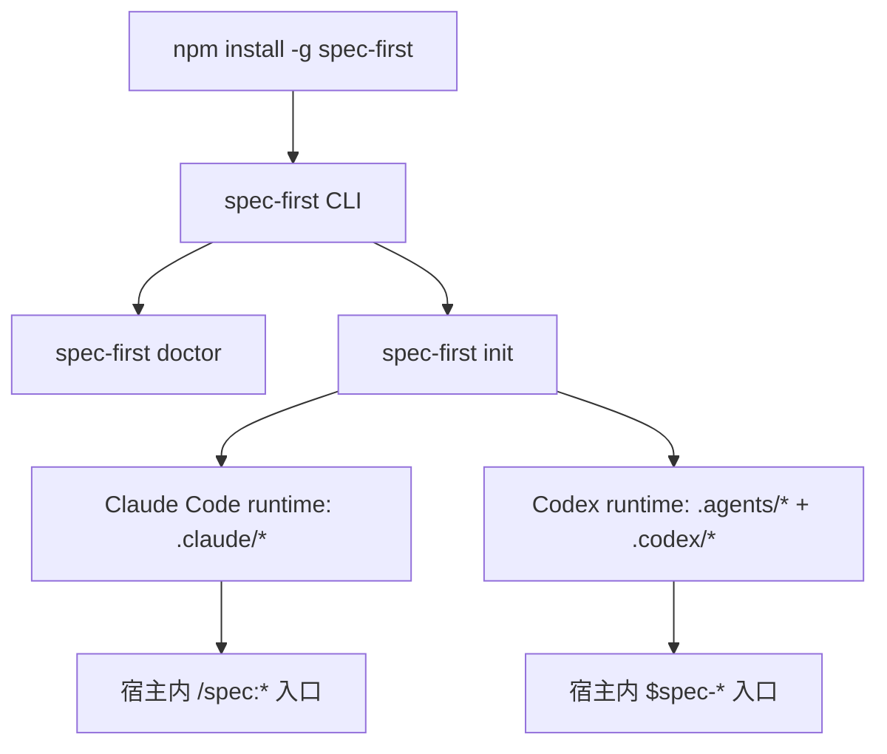
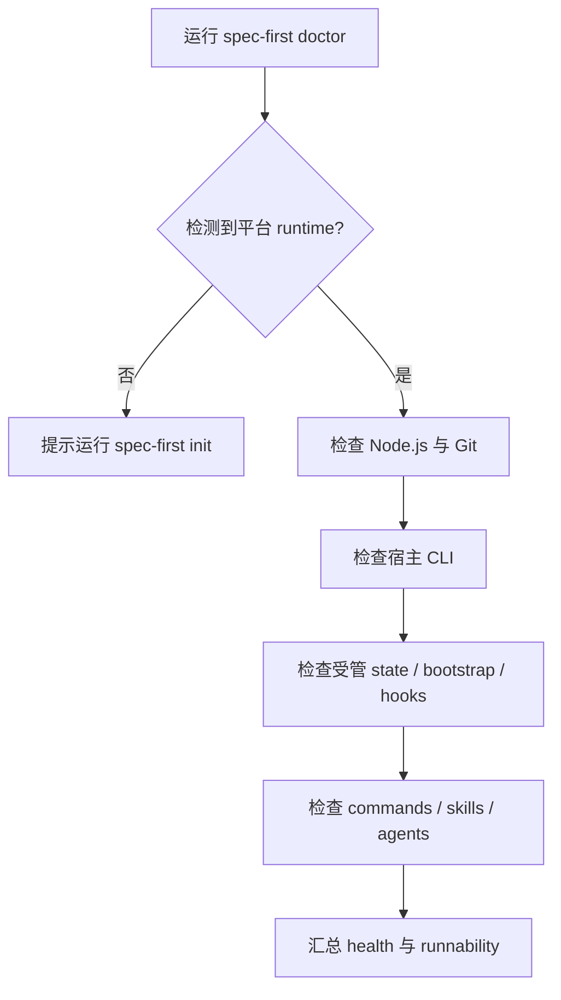
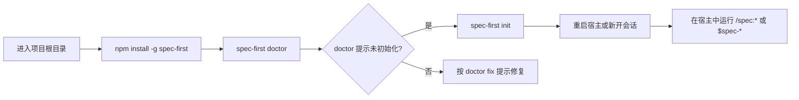

本页位于入门指南的第三站，目标是把“我已经安装了 spec-first 吗？”、“当前项目能不能使用？”、“初始化会写入哪些文件？”这三个新手最容易混淆的问题拆开讲清楚。你只需要记住一条主线：先安装 package CLI，再用 `spec-first doctor` 看环境和运行时状态，最后用 `spec-first init` 生成当前项目的宿主运行时资产。Sources: [package.json](package.json#L2-L13), [README.zh-CN.md](README.zh-CN.md#L91-L145), [src/cli/index.js](src/cli/index.js#L151-L175)

## 先理解三层模型

`spec-first` 不是直接把工作流命令塞进你的 shell，而是先安装一个 npm CLI，再由这个 CLI 在项目内生成 Claude Code 或 Codex 能识别的运行时入口。CLI 的包名是 `spec-first`，二进制入口也是 `spec-first`，包要求 Node.js `>=20.0.0`；二进制启动时会先检查 Node 版本，不满足时输出“Install Node.js 20 or newer”并退出。Sources: [package.json](package.json#L2-L13), [package.json](package.json#L107-L109), [bin/spec-first.js](bin/spec-first.js#L1-L23), [src/cli/node-version.js](src/cli/node-version.js#L3-L33)



这张图的重点是“CLI 与宿主入口不是同一层”：`spec-first doctor` 和 `spec-first init` 是终端里的 package CLI 命令；`/spec:*` 与 `$spec-*` 是初始化后由宿主加载的工作流入口，应该在 Claude Code 或 Codex 会话中使用，而不是当作 shell 命令直接执行。Sources: [README.zh-CN.md](README.zh-CN.md#L125-L145), [src/cli/index.js](src/cli/index.js#L151-L175)

## 安装命令

新手推荐从全局 npm 安装开始：在 macOS、Linux、Windows PowerShell 或 Windows cmd.exe 中运行 `npm install -g spec-first`，然后立刻运行 `spec-first doctor`。中文 README 对三个平台给出的安装命令一致，差异只在终端外壳；Windows 上推荐 Windows Terminal + PowerShell 7+ 或原生 `cmd.exe`，PowerShell 5.1 也支持但 UTF-8 行为不如 PowerShell 7+ 稳定。Sources: [README.zh-CN.md](README.zh-CN.md#L93-L124)

| 场景 | 命令 | 目的 |
|---|---|---|
| 首次安装 | `npm install -g spec-first` | 安装全局 package CLI |
| 安装后确认 | `spec-first doctor` | 检查环境、宿主与项目运行时状态 |
| 初始化项目 | `spec-first init` | 生成 Claude Code / Codex runtime assets |
| 查看版本与下一步 | `spec-first -v` | 显示版本，并提示 doctor 与 init |
| 查看命令面 | `spec-first --help` | 查看 package CLI 支持的命令 |

本地源码脚本也明确把安装模型切换为 npm CLI：推荐安装是 `npm install -g spec-first`，项目初始化顺序是 `spec-first doctor` 再 `spec-first init`；如果以前装过旧 shim，脚本提示重开终端或执行 `hash -r`，避免 shell 缓存继续指向旧路径。Sources: [install-local.sh](install-local.sh#L1-L35)

## 健康检查会检查什么

`spec-first doctor` 的第一层作用是“告诉你当前项目有没有初始化过”。当当前目录没有检测到任何 spec-first 平台运行时时，doctor 会输出“Run `spec-first init` and select Claude Code and/or Codex”，并以成功状态返回；这意味着空项目里 doctor 不是失败，而是在给你下一步初始化指引。Sources: [src/cli/commands/doctor.js](src/cli/commands/doctor.js#L28-L63), [tests/smoke/install-tarball.sh](tests/smoke/install-tarball.sh#L138-L145)

初始化后，doctor 会按平台汇总检查项：通用检查包括 Node.js 与 Git，平台检查包括 Claude Code 或 Codex CLI 是否在 `PATH` 上、受管状态文件是否存在、bootstrap 指令是否存在、runtime hook 是否可用、命令/技能/Agent 资产是否安装。报告还会计算 `install_health`、`runtime_asset_health`、`host_readiness`、`decision_input_health` 与 `workflow_runnability`，所以它既是环境检查，也是“项目运行面是否完整”的诊断入口。Sources: [src/cli/commands/doctor.js](src/cli/commands/doctor.js#L103-L182), [src/cli/commands/doctor.js](src/cli/commands/doctor.js#L424-L529)



doctor 支持按宿主收窄检查范围：`spec-first doctor --claude` 只检查 Claude Code 相关面，`spec-first doctor --codex` 只检查 Codex 相关面，`--json` 会输出结构化报告；如果报告中存在 `ERROR`，JSON 模式返回码为 `3`，普通模式也会以错误状态结束。Sources: [src/cli/commands/doctor.js](src/cli/commands/doctor.js#L28-L100), [src/cli/commands/doctor.js](src/cli/commands/doctor.js#L1003-L1040)

## 初始化会问什么

`spec-first init` 默认是交互式流程：选择一个或多个宿主运行时、确认开发者姓名与语言、选择目标仓库范围、预览写入计划，然后显式确认是否应用。源码中的交互逻辑支持 `--claude`、`--codex`、`-y/--yes`、`--dry-run`、`--all-repos`、`--repo`、`--user` 与 `--lang`；如果没有交互式终端且未使用 `-y/--yes`，命令会退出并提示必须使用交互式终端或显式 yes 模式。Sources: [src/cli/commands/init.js](src/cli/commands/init.js#L89-L200), [src/cli/commands/init.js](src/cli/commands/init.js#L218-L315), [tests/unit/init-interactive.test.js](tests/unit/init-interactive.test.js#L133-L188)

| 选项 | 用途 | 新手建议 |
|---|---|---|
| `spec-first init` | 进入完整交互式初始化 | 首次使用推荐 |
| `spec-first init --claude` | 只初始化 Claude Code runtime | 只用 Claude Code 时使用 |
| `spec-first init --codex` | 只初始化 Codex runtime | 只用 Codex 时使用 |
| `spec-first init --dry-run` | 预览写入计划，不落盘 | 不确定会改哪些文件时先用 |
| `spec-first init -y` | 使用默认值跳过交互 | 自动化或已熟悉流程后使用 |
| `spec-first init --lang zh` | 指定中文初始化文案与 profile 语言 | 中文团队推荐 |

初始化时如果全局 developer profile 已存在且没有显式传入姓名或语言，流程会询问是否沿用该 profile；profile 存在于用户 home 下的 `.spec-first/.developer`，会记录 `name`、`lang`、初始化时间、版本与上次选择的 hosts。这样重复初始化时不会每次都强迫你重新填写姓名与语言。Sources: [src/cli/commands/init.js](src/cli/commands/init.js#L318-L417), [tests/unit/init-interactive.test.js](tests/unit/init-interactive.test.js#L14-L45)

## 初始化会写到哪里

Claude Code 与 Codex 的项目内资产位置不同。Claude adapter 声明 runtime root 是 `.claude`，命令目录是 `.claude/commands/spec`，技能目录是 `.claude/skills`，工作流目录是 `.claude/spec-first/workflows`，Agent 目录是 `.claude/agents`，状态文件是 `.claude/spec-first/state.json`，项目指令文件是 `CLAUDE.md`。Sources: [src/cli/adapters/claude.js](src/cli/adapters/claude.js#L29-L64), [src/cli/adapters/claude.js](src/cli/adapters/claude.js#L97-L112)

Codex adapter 声明 runtime root 是 `.codex`，但用户可见 workflow entrypoints 来自 `.agents/skills`；它的 Agent 目录是 `.codex/agents`，状态文件是 `.codex/spec-first/state.json`，项目指令文件是 `AGENTS.md`。源码注释还说明 `.codex/commands/spec` 只是 legacy compatibility cleanup target，当前 Codex 支持是 project-scoped。Sources: [src/cli/adapters/codex.js](src/cli/adapters/codex.js#L27-L75), [src/cli/adapters/codex.js](src/cli/adapters/codex.js#L119-L153)

```text
project-root/
├── CLAUDE.md                 # Claude Code 项目指令文件
├── AGENTS.md                 # Codex 项目指令文件
├── .claude/
│   ├── commands/spec/        # Claude /spec:* 命令入口
│   ├── skills/               # Claude standalone skills
│   ├── agents/               # Claude agents
│   └── spec-first/state.json # Claude 受管状态
├── .agents/
│   └── skills/               # Codex $spec-* 技能入口
└── .codex/
    ├── agents/               # Codex agents
    ├── hooks/                # Codex session hooks
    └── spec-first/state.json # Codex 受管状态
```

初始化不是盲写文件，而是先构建写入计划：读取既有 state，加载 manifest，按宿主过滤 commands、skills 与 agents，解析 developer identity，再由 adapter 生成平台专属 runtime sync plan；应用阶段才把计划写入目标项目。这个设计让 `--dry-run` 能在写入前展示预览，也让重复初始化可以根据受管状态做同步。Sources: [src/cli/commands/init.js](src/cli/commands/init.js#L792-L900), [src/cli/commands/init.js](src/cli/commands/init.js#L162-L191)

## 推荐的第一次路径

第一次使用时，把终端切到你想启用 spec-first 的 Git 项目根目录，按顺序执行：`npm install -g spec-first`、`spec-first doctor`、`spec-first init`。初始化完成后，重启 Claude Code 或 Codex，或新开宿主会话，让宿主加载刚生成的 runtime assets；然后再进入宿主会话使用 `/spec:brainstorm "改进 onboarding"` 或 `$spec-brainstorm "改进 onboarding"` 这类工作流入口。Sources: [README.zh-CN.md](README.zh-CN.md#L93-L145)



如果你还没有决定用 Claude Code 还是 Codex，初始化时可以同时选择两个宿主；如果只想先试一个，使用 `--claude` 或 `--codex` 可以减少生成面。若你担心写入范围，先运行 `spec-first init --dry-run` 看预览，再运行正式初始化。Sources: [src/cli/commands/init.js](src/cli/commands/init.js#L72-L87), [src/cli/commands/init.js](src/cli/commands/init.js#L174-L187), [tests/unit/init-interactive.test.js](tests/unit/init-interactive.test.js#L133-L149)

## 常见问题速查

| 现象 | 可验证原因 | 处理方式 |
|---|---|---|
| `spec-first` 无法启动 | Node 版本低于 20 | 安装 Node.js 20 或更新版本 |
| `doctor` 提示没有平台 | 当前项目还没 init | 运行 `spec-first init` 并选择宿主 |
| `init` 在非交互终端失败 | 未使用 `-y/--yes` | 使用交互式终端，或显式传 `-y --claude/--codex` |
| 宿主里没有入口 | runtime assets 未加载 | 重启宿主或新开会话 |
| 不确定会写哪些文件 | 初始化计划尚未预览 | 先运行 `spec-first init --dry-run` |

这些问题都来自已实现的控制面：Node 版本门禁在二进制入口前执行，doctor 会在无平台时提示 init，init 在非 TTY 且未 yes 模式时拒绝写入，初始化成功后 README 要求重启宿主或新开会话以加载 runtime assets。Sources: [src/cli/node-version.js](src/cli/node-version.js#L23-L33), [src/cli/commands/doctor.js](src/cli/commands/doctor.js#L54-L63), [src/cli/commands/init.js](src/cli/commands/init.js#L112-L124), [README.zh-CN.md](README.zh-CN.md#L125-L145)

## 下一步阅读

完成本页后，建议继续读 [Claude Code 与 Codex 的入口差异](4-claude-code-yu-codex-de-ru-kou-chai-yi)，因为你已经生成了两个宿主可能不同的 runtime surface；如果你已经成功运行第一个工作流，再读 [首次工程闭环走查](5-shou-ci-gong-cheng-bi-huan-zou-cha)；如果初始化后想理解产物应该提交什么、忽略什么，再读 [产物目录与 Git 提交边界](7-chan-wu-mu-lu-yu-git-ti-jiao-bian-jie)。Sources: [README.zh-CN.md](README.zh-CN.md#L33-L57), [README.zh-CN.md](README.zh-CN.md#L177-L200)