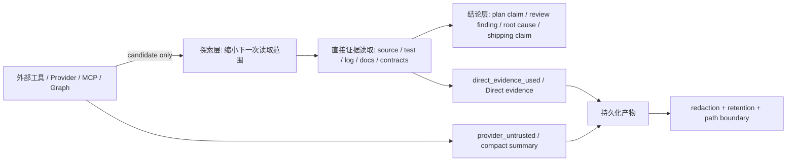
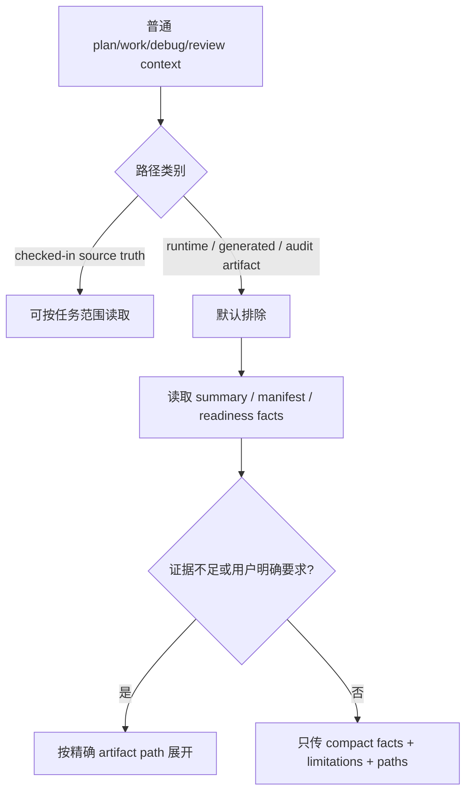
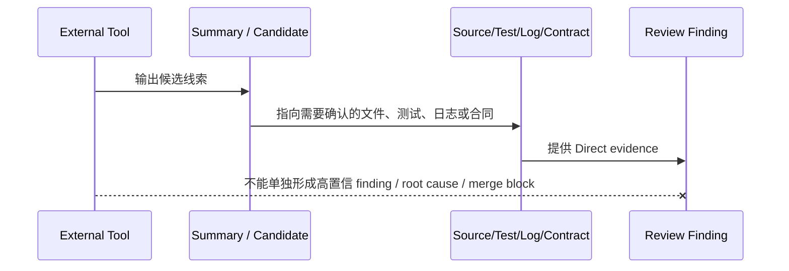

本页位于「契约与质量」章节的末尾，目标是把 spec-first 中**安全、隐私、外部工具证据可信度、持久化产物脱敏**这四类边界收束为一个可执行的开发者心智模型：外部工具可以帮助定位，脚本可以准备确定性事实，LLM 可以做语义判断，但任何面向计划、评审、根因、合并或发布的结论，都必须回到 source/test/log/contract/user confirmation 这类直接证据上。Sources: [ai-coding-harness.md](docs/contracts/ai-coding-harness.md#L26-L33), [project-graph-consumption.md](docs/contracts/project-graph-consumption.md#L64-L69)

架构假设是：spec-first 不把安全治理做成单个“安全模块”，而是把边界分散固定在 Harness 合同、上下文治理、provider readiness、project-graph consumption、review finding、run artifact schema、secret deny patterns 和专项审查测试中；因此高级开发者需要关注的不是“哪个工具可信”，而是“这个结论是否已经完成从候选证据到直接证据的升级，并且是否完成脱敏与路径边界控制”。Sources: [ai-coding-harness.md](docs/contracts/ai-coding-harness.md#L15-L24), [provider-readiness.md](docs/contracts/provider-readiness.md#L3-L12), [review-finding.md](docs/contracts/workflows/review-finding.md#L48-L55)

## 证据边界总览

下面的关系图展示本页讨论的核心边界：外部工具和 provider 输出进入系统时只处于 candidate/advisory 层；上下文治理限制 raw dump 和 runtime artifacts 的扩散；结论层必须由直接证据确认；持久化层必须 summary-first 且完成 redaction。Sources: [ai-coding-harness.md](docs/contracts/ai-coding-harness.md#L17-L24), [context-governance.md](docs/contracts/context-governance.md#L50-L62), [project-graph-consumption.md](docs/contracts/project-graph-consumption.md#L76-L84)

这张图的关键约束是：project-graph 和 code-graph 能改变“先看哪里”，但不能直接成为“答案”；review finding 允许 `external-tool` 作为 evidence type，但外部工具证据如果没有文件、diff、测试、标准、需求、合同或日志证据配对，不能单独形成高置信 finding、根因结论或 merge/block 决策。Sources: [project-graph-consumption.md](docs/contracts/project-graph-consumption.md#L33-L42), [review-finding.md](docs/contracts/workflows/review-finding.md#L29-L35), [review-finding.md](docs/contracts/workflows/review-finding.md#L50-L55)

## Harness 层面的安全原则

AI Coding Harness 合同把安全与隐私边界直接写入六层架构：Context Harness 不广播整个 repo、generated runtime、raw MCP dump 或长 artifact；Evidence Harness 保留 provenance、freshness、source reads、limitations 和 redaction；Governance Harness 明确 source/runtime/provider 边界、host delivery、mutation gate、并发和 freshness refresh owner。Sources: [ai-coding-harness.md](docs/contracts/ai-coding-harness.md#L17-L24)

| 层面 | 安全/隐私职责 | 明确禁止或降级的行为 |
| --- | --- | --- |
| Context Harness | 有界、相关、可追溯上下文 | 不广播 raw MCP dump、generated runtime、长 artifact |
| Evidence Harness | 记录来源、新鲜度、限制、脱敏 | 外部工具未确认前不作为结论事实 |
| Governance Harness | 固定 source/runtime/provider 边界 | provider 不拥有 scope、finding、root-cause、mutation 或 workflow state 权限 |
| Execution Harness | 传递 scope 与 handoff evidence | 不把执行交接变成隐藏状态机 |

Harness 的边界规则明确区分脚本与 LLM：脚本准备路径、schema validity、hash、readiness、budget、reason code、artifact refs 和 raw-log refs 等确定性事实；LLM 判断 scope、架构取舍、finding 是否成立、root cause、任务顺序以及 degraded evidence 是否足够。Sources: [ai-coding-harness.md](docs/contracts/ai-coding-harness.md#L26-L33)

最重要的安全原则是：durable artifacts 必须 summary-first 且完成 redaction，raw external-tool output、raw diff hunks、credentialed URLs、tokens、internal hostnames 和完整 private process/route dumps 不进入 durable docs；这不是格式偏好，而是跨 workflow 的隐私边界。Sources: [ai-coding-harness.md](docs/contracts/ai-coding-harness.md#L30-L32)

## 外部工具与 Provider 的可信度梯度

Provider readiness 合同只描述机械准备状态，它是 advisory setup fact，不是 workflow truth，也不是 confirmed context；合同禁止把 `advisory`、`evidence_candidate` 或 `confirmed_context` 这类语义信任字段写入 readiness，因为 provider 输出只有在直接 source/test/log/contract/user evidence 确认后才能被 workflow 提升为可用结论。Sources: [provider-readiness.md](docs/contracts/provider-readiness.md#L1-L12)

| 输入类型 | 初始可信度 | 可用于 | 不可用于 |
| --- | --- | --- | --- |
| provider readiness | 机械 setup fact | 判断是否可尝试探索 | 证明业务结论 |
| project-graph / code-graph 输出 | candidate/advisory | 缩小下一次 source read | 直接证明 root cause、impact、coverage、merge readiness |
| 外部工具 raw output | 未确认上下文 | 生成 compact summary 与限制说明 | 直接进入普通 prompt bundle 或 durable docs |
| source/test/log/contract/user confirmation | confirmed evidence | 支撑结论层 claim | 替代 redaction 或路径边界 |

Project-graph consumption 合同进一步规定：availability 必须锚定 setup-facts，而不是 artifact presence；如果 setup facts 缺失、stale、缺少 `generated_at` 或 freshness 不可信，就把 project-graph availability 记录为 unknown，并回退到 bounded direct source reads、`rg` 和 ast-grep。Sources: [project-graph-consumption.md](docs/contracts/project-graph-consumption.md#L49-L63)

Project-graph 的消费梯度只有三类：广义 orientation query、relationship path、concept explanation；这些输出只能决定下一步读取哪里，不能成为答案本身。结论层的 plan claim、review finding、root-cause conclusion、implementation basis 或 shipping claim 必须由 source、tests、logs、docs、contracts 或 user confirmation 确认。Sources: [project-graph-consumption.md](docs/contracts/project-graph-consumption.md#L33-L42), [project-graph-consumption.md](docs/contracts/project-graph-consumption.md#L64-L69)

## 上下文隐私：默认排除与 Summary-First

Context Governance 合同规定普通上下文读取默认排除 `.spec-first/audits/**`、`.spec-first/governance/**`、`.claude/**`、`.codex/**` 和 `.agents/skills/**`，这些路径分别代表 runtime audit artifacts、governance observation artifacts、Claude/Codex generated runtime mirrors 和 Codex-facing generated skill mirrors。Sources: [context-governance.md](docs/contracts/context-governance.md#L22-L34)

普通 workflow 仍可读取 checked-in source truth，例如 `skills/`、`agents/`、`templates/`、`src/cli/`、`docs/contracts/`、`AGENTS.md`、`CLAUDE.md`、`README*` 以及与当前任务直接相关的源码、测试、计划或需求文档；边界不是“不能读任何配置”，而是不能把 runtime/generated/audit artifacts 当作普通 source context。Sources: [context-governance.md](docs/contracts/context-governance.md#L34-L35)

Runtime Artifact Policy 要求下游 workflow 优先读取 canonical summary、validated contract 或明确路径，而不是扫描整棵 `.spec-first/**`；summary-first 规则要求先读 summary/manifest/status/readiness facts，再在需要更深证据时精确读取 artifact path，并且不把 raw logs、大 JSON、旧 audit snapshots 或 generated mirrors 广播给 reviewer/worker。Sources: [context-governance.md](docs/contracts/context-governance.md#L50-L62)

外部工具结果和 session summaries 也遵守同一规则：只传递 compact facts、source-read requirements、limitations 和 precise artifact paths，不把 raw MCP dumps 或 full external-tool output 广播进普通 prompt bundles。Sources: [context-governance.md](docs/contracts/context-governance.md#L61-L62)

## Secret Deny Patterns：路径级敏感面

spec-first 使用 `secret-deny-patterns.v1` 合同描述路径级敏感面，覆盖 env 文件、私钥、工具凭据、token/secret/password/API key 命名、移动端签名材料，并保留 `.env.example`、`.env.template`、`.env.sample` 作为排除项。Sources: [secret-deny-patterns.json](src/cli/contracts/security/secret-deny-patterns.json#L1-L42)

| 敏感面 | 示例模式 | reason_code |
| --- | --- | --- |
| 环境变量文件 | `.env`, `.env.*` | `secret-env-file` |
| 私钥与证书 | `*.pem`, `*.key`, `id_rsa*`, `*.p12`, `*.pfx`, `*.keystore` | `secret-private-key` |
| 工具凭据 | `.npmrc`, `.pypirc`, `.netrc`, `.git-credentials`, `.aws/credentials`, `.aws/config` | `secret-tool-credential` |
| 命名敏感文件 | `**/*token*`, `**/*secret*`, `**/*credentials*`, `**/*password*`, `**/*apikey*`, `**/*api_key*` | `secret-name-match` |
| 移动端签名 | `*.mobileprovision`, `*.cer`, `*.certSigningRequest` | `secret-mobile-signing` |

辅助实现会把反斜杠规范化为 `/`，支持 glob 到 regex 的转换，并通过 `isSecretDeniedPath` 先处理 exclusions 和 allowlist，再匹配敏感模式；这意味着 secret-deny 是路径边界检查，不是内容扫描器。Sources: [secret-deny-patterns.js](src/cli/helpers/secret-deny-patterns.js#L16-L39), [secret-deny-patterns.js](src/cli/helpers/secret-deny-patterns.js#L41-L75)

Allowlist 只能是精确 repo-relative path，schema 禁止绝对路径、home-dir expansion、drive/colon path、dot segment、parent escape、glob 和反斜杠；测试同时验证 `.env`、证书、`.aws/credentials` 等真实敏感路径仍被拒绝，而维护 secret-deny 合同本身的少数文件被允许。Sources: [secret-deny-patterns.schema.json](src/cli/contracts/security/secret-deny-patterns.schema.json#L42-L49), [secret-deny-patterns-contracts.test.js](tests/unit/secret-deny-patterns-contracts.test.js#L119-L167)

## 持久化产物的脱敏与 raw output 禁止

`spec-work-run-artifact.schema.json` 在写侧合同中约束 source refs、changed files、artifact refs、raw log refs、LLM asserted fields、provider_untrusted 和 direct_evidence_used；其中 raw log ref 必须声明 `secret_stripped: true`，`redaction_status` 只能是 `redacted` 或 `none-required`，并且 source_refs/changed_files 禁止绝对路径、Windows drive path、反斜杠、dot segment、generated mirrors 和 `.spec-first` source refs。Sources: [spec-work-run-artifact.schema.json](docs/contracts/workflows/spec-work-run-artifact.schema.json#L143-L193), [spec-work-run-artifact.schema.json](docs/contracts/workflows/spec-work-run-artifact.schema.json#L205-L242)

`provider_untrusted` 只能保存 readiness_status 和最多 20 条、每条最多 500 字符的 summaries；`direct_evidence_used` 保存 source_refs、checks_or_logs、repo_scope、limitations 和 redaction_status。这体现了一个持久化原则：外部工具只能作为紧凑、不可信摘要存在，直接证据才进入 confirmed evidence 字段。Sources: [spec-work-run-artifact.schema.json](docs/contracts/workflows/spec-work-run-artifact.schema.json#L230-L242), [spec-work-run-artifact.schema.json](docs/contracts/workflows/spec-work-run-artifact.schema.json#L321-L353)

测试明确拒绝 generated runtime mirrors、非 workflow runtime artifacts、绝对路径、raw output、超长 transcript、`Authorization: Bearer secret-token`、带 `token=` 的 URL、`raw_log_dump` 和 unexpected fields；这把 schema 的隐私边界固定为可回归检查，而不是仅依赖 reviewer 自觉。Sources: [spec-work-run-artifact-producer.test.js](tests/unit/spec-work-run-artifact-producer.test.js#L560-L640)

## App 一致性审查中的外部设计证据边界

App 一致性审查对 Figma 输入采用 reference-only 和 materialized context 的分离：只有 Figma node reference 时，artifact 标记 `has_figma_reference=true`，但 `has_figma_materialized_context=false` 且 `figma_context_mode=mcp_reference_only`，并记录 degraded mode `figma_materialized_context_missing`。Sources: [spec-app-consistency-audit-preflight.test.js](tests/unit/spec-app-consistency-audit-preflight.test.js#L103-L117)

当传入含 token 的 Figma URL 时，preflight 只保留 reference hash、host 和 `figma-ref:<hash>` 形式的安全路径，不保留原始 token、node-id 或含文件名的 URL 片段；这说明外部设计工具链接在进入证据系统前会被降级为 sanitized reference-only context。Sources: [spec-app-consistency-audit-preflight.test.js](tests/unit/spec-app-consistency-audit-preflight.test.js#L119-L143)

审查报告构建也执行内容级脱敏：测试构造了 Bearer token、含 `token=secret` 的内部 URL 和 internal hostname，最终 JSON report 不包含 `abc.def.ghi`、`bare.secret.token`、`token=secret` 或 `internal.example.test`。Sources: [spec-app-consistency-audit-report.test.js](tests/unit/spec-app-consistency-audit-report.test.js#L100-L153)

Headless runner 的端到端测试进一步验证 staged raw issues 中的 `Authorization: Bearer runner-secret-token`、`Cookie: session=runner-secret`、内部 URL、绝对私有路径 `/Users/example/private/TradeBuyScreen.kt` 都不会出现在 stdout、issues.json、audit-report.json、manifest、audit context 或 envelope 的持久化文本中。Sources: [spec-app-consistency-audit-cli-e2e.test.js](tests/unit/spec-app-consistency-audit-cli-e2e.test.js#L1103-L1174)

## 评审结论的证据升级规则

`review-finding.v1` 是 code、document 和 app consistency reviews 共享的 compact finding envelope，目标是让 review synthesis 消费 structured findings，而不是长篇 reviewer prose，并保留 evidence、confidence、owner、verification 和 changelog requirements。Sources: [review-finding.md](docs/contracts/workflows/review-finding.md#L1-L10)

每个 actionable finding 必须至少包含一条带 path 或 command anchor 的 evidence entry；如果 finding 引用 compact evidence summary，必须总结 freshness/limitations，并写明确认该 claim 的 source reads、tests、logs 或 contracts。Sources: [review-finding.md](docs/contracts/workflows/review-finding.md#L48-L55)

这条规则让外部工具证据在评审中保留价值但不越权：它可以帮助发现待确认的风险面，也可以作为 supporting evidence 出现在 finding 中；但如果没有直接证据配对，它不能升级为 high-confidence finding、root-cause claim 或 merge/block decision。Sources: [review-finding.md](docs/contracts/workflows/review-finding.md#L50-L55)

## 开发者操作准则

当你在 workflow 中使用外部工具、MCP、浏览器、graph provider 或审查脚本时，先判断它属于 exploration-tier 还是 conclusion-tier：探索层可以用它缩小读取范围；结论层必须补齐 source/test/log/docs/contracts/user confirmation，并把未确认的 provider 输出记录到 `provider_untrusted.summaries[]` 或等价 compact summary。Sources: [project-graph-consumption.md](docs/contracts/project-graph-consumption.md#L64-L84)

当你需要读取上下文时，按 Context Governance 的顺序执行：先读用户请求、diff、changed files、计划/需求/task-pack summary；再读 source-of-truth files 和 nearby implementation/test slices；然后读 validated summaries、review facts 或 deterministic setup facts；只有用户要求、workflow 明确需要或 summary 显示证据不足时，才精确读取 full artifact 或 raw evidence。Sources: [context-governance.md](docs/contracts/context-governance.md#L97-L106)

当你要写入 durable artifact、report、handoff 或 review finding 时，检查三件事：是否 summary-first，是否包含 provenance/freshness/limitations/source-read requirements，是否已经移除 raw external-tool output、credentialed URLs、tokens、internal hostnames、绝对私有路径和完整 private dumps。Sources: [ai-coding-harness.md](docs/contracts/ai-coding-harness.md#L47-L56), [spec-work-run-artifact-producer.test.js](tests/unit/spec-work-run-artifact-producer.test.js#L560-L640)

## 与相邻页面的阅读关系

如果你需要理解“为什么脚本只准备确定性事实、LLM 才做语义判断”，先回到 [脚本事实与 LLM 语义判断的责任分界](14-jiao-ben-shi-shi-yu-llm-yu-yi-pan-duan-de-ze-ren-fen-jie)；如果你需要理解 evidence 如何跨 workflow 传递，再阅读 [Workflow Contract、Artifact Summary 与 Handoff 协议](25-workflow-contract-artifact-summary-yu-handoff-xie-yi) 和 [Context Governance 与 Summary-First 证据传递](27-context-governance-yu-summary-first-zheng-ju-chuan-di)。Sources: [ai-coding-harness.md](docs/contracts/ai-coding-harness.md#L26-L33), [context-governance.md](docs/contracts/context-governance.md#L71-L80)

如果你关注质量门禁如何验证这些边界，继续阅读 [Verification Profile、Schema 校验与质量反馈](26-verification-profile-schema-xiao-yan-yu-zhi-liang-fan-kui) 与 [测试体系、契约测试与发布质量门禁](28-ce-shi-ti-xi-qi-yue-ce-shi-yu-fa-bu-zhi-liang-men-jin)；如果你要新增外部工具、Agent 或 Skill，下一步应阅读 [新增 Skill、Agent 与命令入口的接入规范](29-xin-zeng-skill-agent-yu-ming-ling-ru-kou-de-jie-ru-gui-fan)，并把本页的证据边界作为新增入口的安全基线。Sources: [ai-coding-harness.md](docs/contracts/ai-coding-harness.md#L47-L56), [provider-readiness.md](docs/contracts/provider-readiness.md#L14-L25)