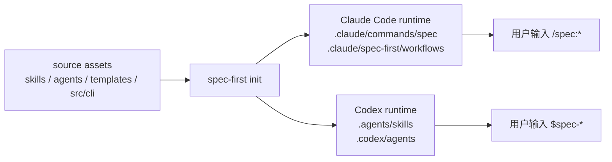
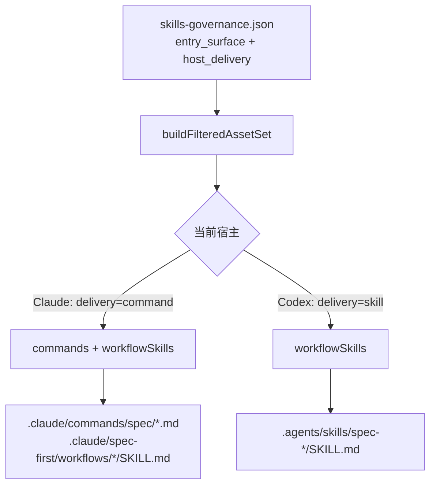

如果你刚开始使用 spec-first，最容易混淆的一点是：**Claude Code 和 Codex 调用的是同一套工作流能力，但入口长得不一样**。Claude Code 侧使用 `/spec:*` 命令；Codex 侧使用 `$spec-*` skill 入口；安装和刷新它们的统一终端命令仍然是 `spec-first init`。这一页只解释“入口差异”，不展开每个工作流该怎么选；如果你还没有完成安装，请先读 [安装、健康检查与项目初始化](3-an-zhuang-jian-kang-jian-cha-yu-xiang-mu-chu-shi-hua)，读完本页后再进入 [首次工程闭环走查](5-shou-ci-gong-cheng-bi-huan-zou-cha)。Sources: [README.zh-CN.md](README.zh-CN.md#L128-L145), [docs/05-用户手册/01-快速开始.md](docs/05-用户手册/01-快速开始.md#L3-L63)

## 先记住一个核心判断

**入口差异不是功能差异，而是宿主发现机制差异**：spec-first 的 source assets 仍然来自 `skills/`、`agents/`、`templates/` 和 `src/cli/`，再由 `spec-first init` 生成到不同宿主能识别的 runtime 位置。README 明确说明，一套 source assets 同时支持 Claude Code 的 `/spec:*` 入口和 Codex 的 `$spec-*` 入口，并且 `.claude/`、`.codex/`、`.agents/skills/` 都是可以通过 `spec-first init` 重建的 generated runtime copies。Sources: [README.zh-CN.md](README.zh-CN.md#L89-L89), [README.zh-CN.md](README.zh-CN.md#L197-L201)

这张图的重点是：你平时不要手改 `.claude/`、`.codex/` 或 `.agents/skills/` 来“修入口”，因为这些是生成出来的 runtime mirror；真正的 source 在仓库内的 `skills/`、`agents/`、`templates/` 和 CLI 生成逻辑里。项目指引也把 `.claude/`、`.codex/`、`.agents/skills/` 明确列为 generated runtime assets，并要求优先修改 source，再用 `spec-first init` 重新生成。Sources: [AGENTS.md](AGENTS.md#L75-L103), [README.zh-CN.md](README.zh-CN.md#L330-L330)

## 两个宿主的用户入口

从用户视角看，同一个意图在两个宿主里只差前缀和命名风格：Claude Code 是斜杠命令，例如 `/spec:brainstorm`；Codex 是 skill 风格入口，例如 `$spec-brainstorm`。README 把这张表定义为公开入口的唯一映射表，并说明共享说明应写“当前宿主”，具体 `/spec:*` 与 `$spec-*` 映射集中放在入口表和 runtime 指引里。Sources: [README.zh-CN.md](README.zh-CN.md#L138-L149)

| 使用意图 | Claude Code 入口 | Codex 入口 | 结果位置或作用 |
|---|---|---|---|
| 发散需求 | `/spec:brainstorm` | `$spec-brainstorm` | `docs/brainstorms/` 下的 requirements brief |
| 编写计划 | `/spec:plan` | `$spec-plan` | `docs/plans/` 下的 implementation plan |
| 执行开发 | `/spec:work` | `$spec-work` | scoped source changes、tests、verification notes |
| 调试问题 | `/spec:debug` | `$spec-debug` | root cause、fix、verification evidence |
| 代码评审 | `/spec:code-review` | `$spec-code-review` | structured findings 和 residual risks |
| 沉淀经验 | `/spec:compound` | `$spec-compound` | `docs/solutions/` 下的 reusable learning |

这些入口不是全部列表，而是初学者最常见的一组。完整映射在 README 的公开入口表里，包括 runtime setup、session history、Slack research、skill audit、PRD、App consistency audit、optimize、polish、release notes 等入口；如果你不知道该从哪个入口开始，可以在当前宿主里描述任务，让 `using-spec-first` 推荐公开入口并说明原因。Sources: [README.zh-CN.md](README.zh-CN.md#L151-L171), [README.zh-CN.md](README.zh-CN.md#L145-L145)

## 为什么 Claude Code 是 `/spec:*`

Claude Code adapter 明确把命令目录设为 `.claude/commands/spec`，把普通 skills 放到 `.claude/skills`，把 command-backing workflow skills 放到 `.claude/spec-first/workflows`，并把 agents 放到 `.claude/agents`。这意味着 Claude Code 看到的是项目内的 command 文件，用户自然通过 `/spec:*` 触发工作流。Sources: [src/cli/adapters/claude.js](src/cli/adapters/claude.js#L34-L64)

Claude Code 侧还有一个“命令壳 + workflow skill”的结构：`renderCommandContent` 会把 command template 的 frontmatter 与对应 skill source 的 body 合并，再做 Claude runtime 所需的 agent name 和路径改写。因此，`/spec:plan` 这类入口不是孤立 prompt，而是指向同名 workflow skill 的宿主命令包装。Sources: [src/cli/adapters/claude.js](src/cli/adapters/claude.js#L66-L91), [src/cli/plugin.js](src/cli/plugin.js#L701-L719)

Claude Code 初始化还会写入受管 hook 文件，例如 SessionStart hook 和 spec-plan guard hook；SessionStart hook 会读取项目的 `CLAUDE.md`，在会话开始时注入 using-spec-first 入口治理提示，提醒较大或有风险的工作应通过公开 `/spec:*` workflow 进入。Sources: [src/cli/adapters/claude.js](src/cli/adapters/claude.js#L7-L24), [templates/claude/hooks/session-start](templates/claude/hooks/session-start#L17-L40)

## 为什么 Codex 是 `$spec-*`

Codex adapter 明确返回 `hasCommands = false`，并把 `skillsRoot` 和 `workflowsRoot` 都指向 `.agents/skills`；源码注释也说明 Codex 是 project-scoped：用户可见 workflow entrypoints 从 `.agents/skills/` 发现，`.codex/commands/spec/` 只被当作 legacy compatibility cleanup target。换句话说，Codex 当前不是通过 `.codex/commands/spec/*.md` 暴露工作流，而是通过 `.agents/skills/spec-*/SKILL.md` 暴露 `$spec-*` 入口。Sources: [src/cli/adapters/codex.js](src/cli/adapters/codex.js#L27-L35), [src/cli/adapters/codex.js](src/cli/adapters/codex.js#L49-L75)

Codex 的 init 同样会同步 skills 和 agents，但不会走 command 文件生成分支：`planBundledAssetSync` 只有在 `adapter.hasCommands` 为真时才规划 command sync；否则 command plan 为空，然后继续规划 skills 和 agents。快速开始文档也把生成路径总结为 Claude Code 的 `.claude/commands/spec`、`.claude/skills`、`.claude/spec-first/workflows`、`.claude/agents`，以及 Codex 的 `.agents/skills`、`.codex/agents`。Sources: [src/cli/plugin.js](src/cli/plugin.js#L659-L678), [docs/05-用户手册/01-快速开始.md](docs/05-用户手册/01-快速开始.md#L62-L63)

Codex adapter 仍然维护 `.codex/` 下的状态、agents 和 hook 文件，例如 `.codex/spec-first/state.json`、`.codex/agents`、`.codex/hooks/session-start` 和 `.codex/hooks.json`；但这些不改变用户入口的核心事实：正式 workflow delivery 是 `.agents/skills`。本地源码安装文档也明确写出，Codex 的 `$spec-*` 入口来自项目内 `.agents/skills/spec-*/SKILL.md`，不会生成 `.codex/commands/spec/`。Sources: [src/cli/adapters/codex.js](src/cli/adapters/codex.js#L65-L83), [src/cli/adapters/codex.js](src/cli/adapters/codex.js#L136-L153), [docs/05-用户手册/06-本地源码安装.md](docs/05-用户手册/06-本地源码安装.md#L17-L20)

## 同一工作流如何投递到两个宿主

spec-first 用治理表描述每个 skill 的 entry surface 和双宿主 delivery。以 `spec-doc-review` 为例，它的 `entry_surface` 是 `workflow_command`，`command_name` 是 `doc-review`，但 `host_delivery.claude` 是 `command`，`host_delivery.codex` 是 `skill`；这正是 `/spec:doc-review` 与 `$spec-doc-review` 同源但不同形态的直接证据。Sources: [src/cli/contracts/dual-host-governance/skills-governance.json](src/cli/contracts/dual-host-governance/skills-governance.json#L38-L47)

生成逻辑会读取治理表和 bundled command manifest，把 `workflow_command` 按宿主 delivery 分成 command 或 skill：delivery 为 `command` 时加入 `commands` 和 `workflowSkills`，delivery 为 `skill` 时只加入 `workflowSkills`。后续同步时，只有支持 commands 的 adapter 才写 command 文件，但两个宿主都会继续同步 workflow skills、standalone skills、internal skills 和 agents。Sources: [src/cli/plugin.js](src/cli/plugin.js#L564-L633), [src/cli/plugin.js](src/cli/plugin.js#L650-L678)

## 初学者应该怎么操作

第一次安装后，你只需要按顺序做三件事：先在终端运行 `spec-first doctor` 检查环境，再运行 `spec-first init` 选择 Claude Code 和/或 Codex，最后完全重启宿主，让宿主重新发现生成的入口。快速开始文档明确建议先 `doctor` 再 `init`，并说明初始化会多选宿主、确认开发者姓名与语言、预览写入内容后再确认。Sources: [docs/05-用户手册/01-快速开始.md](docs/05-用户手册/01-快速开始.md#L42-L58)

| 场景 | 终端命令 | 宿主内入口 | 你应该期待什么 |
|---|---|---|---|
| 只装 Claude Code runtime | `spec-first init --claude` | `/spec:*` | `.claude/commands/spec` 和相关 `.claude/` runtime 被生成 |
| 只装 Codex runtime | `spec-first init --codex` | `$spec-*` | `.agents/skills` 和 `.codex/agents` 被生成 |
| 两个宿主都要用 | `spec-first init --claude --codex` 或交互多选 | 两者都有 | 同一套 source 投递到两个 runtime |
| 检查安装状态 | `spec-first doctor --claude` / `spec-first doctor --codex` | 不适用 | 检查对应宿主 runtime health |

如果 Claude Code 里找不到 `/spec:*`，优先检查 `.claude/commands/spec`、`.claude/skills`、`.claude/spec-first/workflows`、`.claude/agents` 是否通过 `doctor`；如果 Codex 里找不到 `$spec-*`，优先检查 `.agents/skills` 和 `.codex/agents`。不要先手动删除 runtime 目录；quick start 明确说 legacy managed state 或 clean 拒绝时，应重新运行 `spec-first init` 并选择目标宿主，由 init 自动 hard reset 并重建运行时。Sources: [docs/05-用户手册/01-快速开始.md](docs/05-用户手册/01-快速开始.md#L209-L229), [docs/05-用户手册/01-快速开始.md](docs/05-用户手册/01-快速开始.md#L113-L118)

## 页面边界与下一步

本页只解决“为什么 Claude Code 输入 `/spec:*`，Codex 输入 `$spec-*`”这个入口问题；具体每个 workflow 什么时候用，不在本页展开。下一步建议按目录顺序阅读：[首次工程闭环走查](5-shou-ci-gong-cheng-bi-huan-zou-cha) 会带你跑一遍从需求到验证的最小闭环；如果你已经理解入口但不知道该选哪个工作流，再读 [选择合适的工作流入口](6-xuan-ze-he-gua-de-gong-zuo-liu-ru-kou)。Sources: [.zread/wiki/drafts/wiki.json](.zread/wiki/drafts/wiki.json#L27-L46)