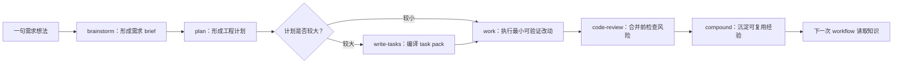

你当前位于入门指南的“首次工程闭环走查”页：它承接 [快速开始](2-kuai-su-kai-shi) 之后的第一个完整练习，目标不是解释所有内部机制，而是让新手用一个很小的需求，看见 `spec-first` 如何把一次 AI 对话变成“需求、计划、执行、评审、知识沉淀”都可追踪的工程闭环。Sources: [09-首次工作流走查.md](docs/05-用户手册/09-首次工作流走查.md#L3-L10), [README.md](docs/05-用户手册/README.md#L58-L78)

## 先形成一个正确心智模型

`spec-first` 的第一性原理是：AI coding 的风险不只在“代码写错”，也在需求判断、计划取舍、验证证据和经验复用随会话丢失。因此本页的走查只关注一个闭环：先把模糊想法变成需求，再把需求变成计划，然后执行最小可验证改动，最后通过评审和知识沉淀把结果留给下一次使用。Sources: [结构化项目角色契约.md](docs/10-prompt/结构化项目角色契约.md#L42-L60), [README.md](docs/05-用户手册/README.md#L3-L10)

在这个闭环里，脚本和工具负责确定性事实，例如安装、路径、schema、hash、readiness、git 状态和测试日志；LLM 与 agents 负责语义判断，例如需求理解、范围取舍、任务拆分、影响面解释、review 判断和下一步建议。新手最重要的不是背命令，而是知道“事实要有证据，判断要有边界”。Sources: [结构化项目角色契约.md](docs/10-prompt/结构化项目角色契约.md#L64-L76), [结构化项目角色契约.md](docs/10-prompt/结构化项目角色契约.md#L80-L111)



这张图只表达“首次闭环”的推荐路径，不是强制状态机。实际使用时，如果你已经有清晰计划，可以直接进入 `plan` 或 `work`；如果当前是失败排障，应进入 `debug`；如果是移动 App 在 QA 前检查 PRD、Figma 与源码一致性，可以插入 `app-consistency-audit`。Sources: [09-首次工作流走查.md](docs/05-用户手册/09-首次工作流走查.md#L209-L219), [README.md](docs/05-用户手册/README.md#L74-L78)

## 前置准备：只做一次，不要每轮重复

首次使用、换宿主、升级后重建 runtime assets，或 MCP/helper 环境变化时，先安装 CLI、运行 `spec-first doctor`，再运行 `spec-first init`。`init` 会让你选择 Claude Code 和/或 Codex，并生成当前项目使用的宿主 runtime assets；后续 `/spec:*` 与 `$spec-*` 入口是在宿主会话中运行，不是 shell 命令。Sources: [09-首次工作流走查.md](docs/05-用户手册/09-首次工作流走查.md#L11-L45), [01-快速开始.md](docs/05-用户手册/01-快速开始.md#L40-L68)

```bash
npm install -g spec-first
spec-first doctor
spec-first init
```

初始化后重启 Claude Code 或 Codex，让宿主加载新生成的 runtime assets。Claude Code 使用 `/spec:*`，Codex 使用 `$spec-*`；两者不是同一组命令面，但在本页的闭环中承担同类入口角色。Sources: [01-快速开始.md](docs/05-用户手册/01-快速开始.md#L3-L4), [09-首次工作流走查.md](docs/05-用户手册/09-首次工作流走查.md#L36-L45)

| 准备动作 | 什么时候需要 | 新手判断 |
| --- | --- | --- |
| `spec-first doctor` | 安装后或怀疑环境异常 | 先看当前 CLI 与宿主状态 |
| `spec-first init` | 首次使用、升级后、换宿主后 | 生成当前项目 runtime assets |
| `/spec:mcp-setup` / `$spec-mcp-setup` | MCP/helper 缺失或环境变化 | 准备 required harness runtime 与工具事实 |
| bounded source reads / `rg` / git diff / tests/logs | 进入业务 workflow 时 | 当前代码事实仍要回源验证 |

这张表的关键边界是：setup 只准备运行环境和事实，不替代需求判断、计划判断或实现判断；普通轻量任务在完成 `doctor`、`init` 并重启宿主后，可以直接进入匹配的 workflow。Sources: [09-首次工作流走查.md](docs/05-用户手册/09-首次工作流走查.md#L46-L70), [01-快速开始.md](docs/05-用户手册/01-快速开始.md#L70-L99)

## 第一步：从一句想法生成需求 brief

假设你的第一个练习需求是 `Improve onboarding for first-time CLI users`。在 Codex 中运行 `$spec-brainstorm "Improve onboarding for first-time CLI users"`，在 Claude Code 中运行 `/spec:brainstorm "Improve onboarding for first-time CLI users"`；第一次 brainstorm 通常会生成一个 `docs/brainstorms/*.md` 需求 brief。Sources: [09-首次工作流走查.md](docs/05-用户手册/09-首次工作流走查.md#L72-L90)

```text
# Codex
$spec-brainstorm "Improve onboarding for first-time CLI users"

# Claude Code
/spec:brainstorm "Improve onboarding for first-time CLI users"
```

这个 brief 应回答用户是谁、当前卡在哪里、本轮必须解决什么、哪些想法不在范围内、成功标准是什么，以及后续 planning 需要注意哪些边界。如果这些内容还不清楚，正确动作是继续澄清，而不是急着实现。Sources: [09-首次工作流走查.md](docs/05-用户手册/09-首次工作流走查.md#L86-L100)

## 第二步：用 plan 承接需求

当需求 brief 足够稳定后，进入 `$spec-plan` 或 `/spec:plan`。plan 的职责是把 requirements 转成可评审、可执行的工程决策上下文，通常写入 `docs/plans/*.md`；它不需要提前锁死所有实现细节，也不应该替代执行者做微步骤。Sources: [09-首次工作流走查.md](docs/05-用户手册/09-首次工作流走查.md#L102-L123)

```text
# Codex
$spec-plan

# Claude Code
/spec:plan
```

一个好的 plan 至少说明实施目标和非目标、需要修改或新增的大致文件区域、依赖关系和风险点、验证方式，以及哪些问题留到 implementation-time 决策。对新手来说，plan 的价值是先让“怎么做”变得可讨论，而不是直接让 AI 在代码里试错。Sources: [09-首次工作流走查.md](docs/05-用户手册/09-首次工作流走查.md#L124-L131)

## 第三步：大计划再编译 task pack

如果 plan 很小，可以直接进入 work；如果 plan 涉及多个模块、多个阶段或多人/多 agent 交接，可以使用 standalone `write-tasks` skill，把 plan 编译成 `docs/tasks/*.md` task pack。task pack 记录 source plan、hash、task graph、wave 和验证信号，但它不是新的需求真相源。Sources: [09-首次工作流走查.md](docs/05-用户手册/09-首次工作流走查.md#L132-L140)

| 场景 | 是否需要 task pack | 原因 |
| --- | --- | --- |
| 单文件文档修正 | 通常不需要 | plan 已足够指导执行 |
| 小型 bugfix | 通常不需要 | 可直接进入最小可验证 work |
| 多模块改动 | 建议需要 | 便于拆分 wave 和交接 |
| 多人或多 agent 协作 | 建议需要 | 便于记录 source、hash 与任务图 |

如果 plan 后续变化，应重新编译或验证 task pack freshness。新手可以把 task pack 理解为“给复杂执行用的交接清单”，而不是每次都必须生成的文档。Sources: [09-首次工作流走查.md](docs/05-用户手册/09-首次工作流走查.md#L132-L140), [01-快速开始.md](docs/05-用户手册/01-快速开始.md#L91-L99)

## 第四步：进入 work 执行最小可验证改动

当 plan 或 task pack 已经可执行后，进入 `$spec-work` 或 `/spec:work`。work 阶段会读取当前请求、plan/task pack、AGENTS/CLAUDE 指令、相关源码和测试，然后做最小可验证改动；执行结果通常包括代码或文档 diff、对应测试或检查命令、验证记录、残余风险说明，以及必要时更新 `CHANGELOG.md`。Sources: [09-首次工作流走查.md](docs/05-用户手册/09-首次工作流走查.md#L142-L164)

```text
# Codex
$spec-work

# Claude Code
/spec:work
```

这里最容易犯的错是手改 generated runtime copies 来“快速修复”。正确边界是：如果变更涉及 spec-first 自身的 skill、agent、template 或 CLI，应修改 source assets，再按需要通过 `spec-first init` 重建目标宿主 runtime；不要把 `.claude/`、`.codex/` 或 `.agents/skills/` 当成 source truth。Sources: [09-首次工作流走查.md](docs/05-用户手册/09-首次工作流走查.md#L156-L164), [结构化项目角色契约.md](docs/10-prompt/结构化项目角色契约.md#L135-L152)

## 第五步：合并前 review，完成后 compound

准备合并前，运行 `$spec-code-review` 或 `/spec:code-review`。review 的重点是 bug、行为回归、测试缺口和残余风险，不是为改动写表扬稿；如果发现问题，应回到 work 或 debug 处理，而不是把 review 当作形式步骤。Sources: [09-首次工作流走查.md](docs/05-用户手册/09-首次工作流走查.md#L181-L193)

```text
# Codex
$spec-code-review

# Claude Code
/spec:code-review
```

当一个问题被稳定解决，并且经验值得复用时，再运行 `$spec-compound` 或 `/spec:compound`。compound 会把可复用经验写入 `docs/solutions/`，让后续会话可以读取这些知识，而不是让判断只停留在当前聊天窗口里。Sources: [09-首次工作流走查.md](docs/05-用户手册/09-首次工作流走查.md#L195-L207), [README.md](docs/05-用户手册/README.md#L91-L99)

## 产物长什么样

首次闭环不是只得到“代码改了”。按标准链路推进时，你会看到需求、计划、代码与测试变更、结构化评审结论和知识沉淀分别落在不同位置；这些产物让下一次 workflow 能读取上下文，而不是重新从零解释背景。Sources: [01-快速开始.md](docs/05-用户手册/01-快速开始.md#L172-L179), [README.md](docs/05-用户手册/README.md#L39-L57)

```text
project/
├── docs/
│   ├── brainstorms/   # 需求 brief
│   ├── plans/         # 工程计划
│   ├── tasks/         # 可选 task pack
│   └── solutions/     # 可复用经验沉淀
├── .claude/           # Claude Code generated runtime assets
├── .codex/            # Codex generated runtime assets
├── .agents/skills/    # Codex skill runtime mirror
└── .spec-first/       # 本地配置、readiness 或 workspace advisory facts
```

长期协作文档层包括 `docs/brainstorms/`、`docs/plans/`、`docs/tasks/` 和 `docs/solutions/`；generated runtime assets 包括 `.claude/`、`.codex/` 和 `.agents/skills/`；spec-first 自身能力的源码真相源是 `skills/`、`agents/`、`templates/` 和 `src/cli/`。Sources: [09-首次工作流走查.md](docs/05-用户手册/09-首次工作流走查.md#L221-L228), [结构化项目角色契约.md](docs/10-prompt/结构化项目角色契约.md#L135-L152)

## 常见入口判断

| 当前情况 | 推荐入口 | 判断逻辑 |
| --- | --- | --- |
| 只有一句想法，还没有成功标准 | `$spec-brainstorm` / `/spec:brainstorm` | 先提高需求输入质量 |
| 需求清楚，但不知道怎么落地 | `$spec-plan` / `/spec:plan` | 先把工程路径变成可评审计划 |
| 已有 plan 或 task pack | `$spec-work` / `/spec:work` | 直接执行最小可验证改动 |
| 现有实现失败或测试报错 | `$spec-debug` / `/spec:debug` | 先找根因，不把 bug 当 feature 做 |
| 准备合并，想确认风险 | `$spec-code-review` / `/spec:code-review` | 查 bug、回归、测试缺口和残余风险 |
| 已稳定解决，经验值得复用 | `$spec-compound` / `/spec:compound` | 把经验沉淀到可复用知识 |

这张表帮助新手从“我现在该敲哪个命令”切换到“我现在处于闭环的哪个节点”。如果当前任务是移动 App，并且需要在模拟器、真机、打包或 QA 前检查 PRD / Figma / source 一致性，可以在 code review 前后插入 `$spec-app-consistency-audit` 或 `/spec:app-consistency-audit`。Sources: [09-首次工作流走查.md](docs/05-用户手册/09-首次工作流走查.md#L165-L193), [09-首次工作流走查.md](docs/05-用户手册/09-首次工作流走查.md#L209-L219)

## 完成这页后读什么

如果你刚完成第一次闭环，下一步建议读 [选择合适的工作流入口](6-xuan-ze-he-gua-de-gong-zuo-liu-ru-kou)，学习如何从不同任务状态进入正确 workflow；再读 [产物目录与 Git 提交边界](7-chan-wu-mu-lu-yu-git-ti-jiao-bian-jie)，确认哪些产物该提交、哪些只是可重建 runtime 或本地事实。Sources: [README.md](docs/05-用户手册/README.md#L112-L141), [09-首次工作流走查.md](docs/05-用户手册/09-首次工作流走查.md#L221-L228)

如果你想回头确认安装和初始化细节，读 [安装、健康检查与项目初始化](3-an-zhuang-jian-kang-jian-cha-yu-xiang-mu-chu-shi-hua)；如果你还不确定 Claude Code 与 Codex 的命令差异，读 [Claude Code 与 Codex 的入口差异](4-claude-code-yu-codex-de-ru-kou-chai-yi)；如果你要处理单仓、多模块或多仓 workspace，读 [单仓、多模块与多仓工作区使用方式](8-dan-cang-duo-mo-kuai-yu-duo-cang-gong-zuo-qu-shi-yong-fang-shi)。Sources: [01-快速开始.md](docs/05-用户手册/01-快速开始.md#L101-L118), [README.md](docs/05-用户手册/README.md#L79-L88)