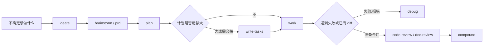

当你已经完成安装、初始化并能在 Claude Code 或 Codex 会话里看到 `spec-first` 入口时，本页回答一个更实际的问题：**现在应该运行哪一个 workflow？** 初学者不需要背完整菜单，只需要先判断当前问题处在“想法、需求、计划、任务、执行、排错、审查、沉淀”中的哪一段，再选择对应入口；Claude Code 使用 `/spec:*`，Codex 使用 `$spec-*`，这些入口必须在宿主会话中运行，不是 shell 命令。Sources: [README.zh-CN.md](README.zh-CN.md#L125-L145), [README.zh-CN.md](README.zh-CN.md#L147-L172)

## 架构假设：入口不是菜单，而是工程阶段

`spec-first` 的工作流主线可以简化为 `Codebase → Context → Spec → Plan → Tasks → Code → Review → Knowledge`：先建立可读上下文，再把想法变成需求，把需求变成计划，把计划变成任务或直接执行，最后通过审查和知识沉淀把结果留在仓库里。这个页面只讲**入口选择**，不展开每个 workflow 的内部机制。Sources: [docs/workflow-skill-agent-map.md](docs/workflow-skill-agent-map.md#L4-L20)



这个图的关键不是要求你按固定状态机走完所有节点，而是帮助你定位**当前最缺的产物**：缺想法时不要直接写计划，缺计划时不要急着执行，已有实现时不要回到 brainstorm，失败时优先 debug，值得复用的解决方案再 compound。Sources: [docs/05-用户手册/09-首次工作流走查.md](docs/05-用户手册/09-首次工作流走查.md#L72-L164), [docs/05-用户手册/09-首次工作流走查.md](docs/05-用户手册/09-首次工作流走查.md#L165-L200)

## 一眼选择表

| 你现在的状态 | Claude Code 入口 | Codex 入口 | 预期产物或结果 |
|---|---|---|---|
| 不知道方向，只想发散选项 | `/spec:ideate` | `$spec-ideate` | `docs/ideation/` 下的候选想法排序 |
| 有粗略功能想法，需要整理需求 | `/spec:brainstorm` | `$spec-brainstorm` | `docs/brainstorms/` 下的 requirements brief |
| 已有增量需求或粗糙 PRD，需要变成更稳的需求文档 | `/spec:prd` | `$spec-prd` | `docs/brainstorms/` 下的 PRD-grade requirements |
| 需求基本清楚，需要实施方案 | `/spec:plan` | `$spec-plan` | `docs/plans/` 下的 implementation plan |
| 计划较大，需要拆成可交接任务包 | 使用 standalone `write-tasks` skill | 使用 standalone `write-tasks` skill | `docs/tasks/` 下的 task pack |
| 计划或任务已经可执行 | `/spec:work` | `$spec-work` | 代码/文档改动、测试和验证说明 |
| 有失败、报错、测试红灯或根因不清 | `/spec:debug` | `$spec-debug` | 根因、修复和验证证据 |
| 有代码 diff，需要合并前审查 | `/spec:code-review` | `$spec-code-review` | structured findings 和 residual risks |
| 有需求、计划或 Markdown 文档，需要审查 | `/spec:doc-review` | `$spec-doc-review` | 文档问题、缺口和残余风险 |
| 问题已解决，经验值得复用 | `/spec:compound` | `$spec-compound` | `docs/solutions/` 下的 reusable learning |
| 宿主、MCP 或 helper runtime 就绪性不清 | `/spec:mcp-setup` | `$spec-mcp-setup` | required harness runtime facts 和 setup-owned artifacts |

这张表故意按“你缺什么”而不是按命令名称排序：`ideate` 用于还没确定问题框架，`brainstorm` 用于把粗略产品问题变成需求 brief，`prd` 用于已有系统增量或粗糙 PRD 的 brownfield 需求整理，`plan` 用于把需求转成实施上下文，`work` 用于执行，`review/debug/compound` 分别处理检查、失败和知识沉淀。Sources: [README.zh-CN.md](README.zh-CN.md#L151-L173), [skills/using-spec-first/SKILL.md](skills/using-spec-first/SKILL.md#L160-L180)

## 最小决策规则

如果你只记一条规则，记住：**不要按关键词选入口，要按当前缺失的工程产物选入口。** `using-spec-first` 的路由契约明确要求不要只靠关键词；当用户只是问“下一步跑什么”时，它应该只推荐一个最佳入口、一个具体理由和一个下一步动作，而不是打印完整菜单。Sources: [skills/using-spec-first/SKILL.md](skills/using-spec-first/SKILL.md#L122-L146)

| 判断问题 | 选入口 |
|---|---|
| “我连方向都没定，只想比较可能性？” | `ideate` |
| “我知道大概想做什么，但需求边界还不清？” | `brainstorm` |
| “我已有需求或 PRD，需要面向现有系统收敛？” | `prd` |
| “需求已经稳定，下一步是怎么做？” | `plan` |
| “计划已经可执行，下一步是改代码或文档？” | `work` |
| “现在有红灯、报错、失败测试或根因不明？” | `debug` |
| “已经有 diff 或文档，想知道是否可靠？” | `code-review` 或 `doc-review` |
| “这次解决方案未来还会遇到，值得留作经验？” | `compound` |

当你问“what next?”，如果已有 brainstorm 需求文档但没有实施方向，下一步通常是 `plan`；如果已有 plan 或已验证 task pack 且工作已准备好，下一步通常是 `work`；如果已有 diff 且你想判断是否准备好，按 artifact 类型选择 `code-review` 或 `doc-review`。Sources: [skills/using-spec-first/SKILL.md](skills/using-spec-first/SKILL.md#L174-L180)

## 入口与产物目录的关系

工作流入口的价值在于把判断留成仓库 artifact，而不是只留在聊天窗口里。常见路径是：`brainstorm/prd` 写入 `docs/brainstorms/`，`plan` 写入 `docs/plans/`，`write-tasks` 写入 `docs/tasks/`，`work` 可能留下 `.spec-first/workflows/spec-work/` 结构化执行证据，`compound` 写入 `docs/solutions/`。Sources: [README.zh-CN.md](README.zh-CN.md#L181-L193), [docs/05-用户手册/09-首次工作流走查.md](docs/05-用户手册/09-首次工作流走查.md#L86-L140)

```text
docs/
  ideation/      发散候选想法
  brainstorms/   requirements brief 或 PRD-grade requirements
  plans/         implementation plan
  tasks/         derived task pack
  solutions/     reusable learning

.spec-first/
  workflows/spec-work/  structured work closeout evidence
```

这个结构说明了为什么不要把所有事情都从 `brainstorm` 开始：如果你已经有可执行 plan，直接进入 `work` 更合适；如果你只有失败现象，`debug` 比 `plan` 更贴近问题；如果你只是要审查已有文档，`doc-review` 比重新写需求更准确。Sources: [README.zh-CN.md](README.zh-CN.md#L173-L175), [skills/using-spec-first/SKILL.md](skills/using-spec-first/SKILL.md#L140-L146)

## 什么时候不需要 workflow

不是所有请求都要进入公开 workflow。轻量事实回答、窄范围代码定位、明确且低风险的小改动、已经处在某个 active workflow 内的后续步骤，都可以直接回答或直接执行；只有当任务变成多文件、架构/契约/治理、运行时交付、根因不清、风险较高或需要持久 artifact 时，才需要重新路由到公开入口。Sources: [skills/using-spec-first/SKILL.md](skills/using-spec-first/SKILL.md#L17-L28), [skills/using-spec-first/SKILL.md](skills/using-spec-first/SKILL.md#L58-L84)

在 `spec-first` 仓库自身工作时，这条边界更重要：普通单点低风险文案或配置修正可以直接做，但涉及 prompt、workflow、contract、governance、skill、agent prose、runtime delivery 或架构改动时，通常应该进入当前宿主的 `work` workflow；文档审查走 `doc-review`，bug/失败走 `debug`，setup/update/runtime repair 走 setup/update 相关路径。Sources: [AGENTS.md](AGENTS.md#L147-L161), [skills/using-spec-first/SKILL.md](skills/using-spec-first/SKILL.md#L86-L101)

## 特殊情况：setup、工作区与降级

如果你刚初始化项目、换宿主、升级后重建 runtime assets，或 MCP/helper 环境变化，先在宿主会话里运行 `mcp-setup`；它负责安装和验证 required harness runtime、MCP servers 与 helper tools，输出确定性环境事实，但不替代后续需求判断、实现判断或代码证据。Sources: [docs/05-用户手册/09-首次工作流走查.md](docs/05-用户手册/09-首次工作流走查.md#L46-L66)

如果当前目录是多仓父 workspace、dirty workspace、非 Git 目录或 provider degraded 状态，入口选择仍然以用户意图为主，但需要更明确的 scope 和证据边界：多仓写入、测试、commit、review autofix 前要明确 `target_repo` 或 per-child scope；provider degraded 时不要把 graph-backed claim 当成已确认事实，必要时先跑 `mcp-setup` 或改用 bounded direct evidence。Sources: [docs/05-用户手册/20-研发场景与降级路径.md](docs/05-用户手册/20-研发场景与降级路径.md#L24-L39), [skills/using-spec-first/SKILL.md](skills/using-spec-first/SKILL.md#L183-L200)

## 推荐阅读顺序

如果你是第一次使用，先读 [首次工程闭环走查](5-shou-ci-gong-cheng-bi-huan-zou-cha)，用一个小需求跑通 `brainstorm → plan → work → review/compound` 的完整感觉；如果你还不熟悉 Claude Code 和 Codex 的命令差异，回到 [Claude Code 与 Codex 的入口差异](4-claude-code-yu-codex-de-ru-kou-chai-yi)；当你开始关心这些 artifact 会写到哪里、哪些文件应该提交，再继续读 [产物目录与 Git 提交边界](7-chan-wu-mu-lu-yu-git-ti-jiao-bian-jie)。Sources: [docs/05-用户手册/09-首次工作流走查.md](docs/05-用户手册/09-首次工作流走查.md#L1-L10), [.zread/wiki/drafts/wiki.json](.zread/wiki/drafts/wiki.json#L28-L53)

如果你只是站在当前页面想立刻行动，最稳的下一步是用一句话描述你手上的状态，然后按表格选一个入口：不确定方向用 `ideate`，需求不清用 `brainstorm`，需求已清用 `plan`，已有计划用 `work`，失败用 `debug`，已有 diff 用 `code-review` 或 `doc-review`。Sources: [README.zh-CN.md](README.zh-CN.md#L151-L173), [skills/using-spec-first/SKILL.md](skills/using-spec-first/SKILL.md#L160-L180)