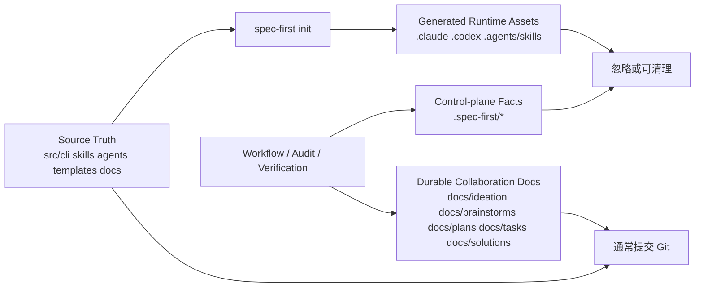

你当前位于入门指南的第 7 页：[产物目录与 Git 提交边界](7-chan-wu-mu-lu-yu-git-ti-jiao-bian-jie)。本页只回答一个问题：当 spec-first 在项目中生成文档、runtime mirror、控制面事实和临时执行证据时，哪些应该进入 Git，哪些应该保持本地可重建。Sources: [10-产物目录.md](docs/05-用户手册/10-产物目录.md#L1-L11), [AGENTS.md](AGENTS.md#L75-L103)

## 核心判断

**第一原则是区分 source truth、generated runtime assets、control-plane facts 与 durable collaboration docs。** `src/cli/`、`skills/`、`agents/`、`templates/` 和 `docs/` 属于源码或长期协作文档层；`.claude/`、`.codex/`、`.agents/skills/` 是由 `spec-first init` 生成的宿主运行时镜像；`.spec-first/` 下多数目录记录 setup、audit、verification、workspace 等机器事实，通常不作为长期知识提交。Sources: [AGENTS.md](AGENTS.md#L77-L103), [10-产物目录.md](docs/05-用户手册/10-产物目录.md#L51-L74)



上图的前提是：runtime 目录不是源码修复入口，漂移时应回到 source truth 与生成器，再通过 `spec-first init` 重建；机器事实由脚本写入并被后续流程读取，但语义判断仍由 LLM 或维护者完成。Sources: [AGENTS.md](AGENTS.md#L52-L65), [AGENTS.md](AGENTS.md#L97-L103), [10-产物目录.md](docs/05-用户手册/10-产物目录.md#L49-L50)

## 目录速查

```text
.
├── docs/                         # 长期协作文档与知识沉淀，通常提交
│   ├── ideation/
│   ├── brainstorms/
│   ├── plans/
│   ├── tasks/
│   └── solutions/
├── src/cli/ skills/ agents/ templates/
│                                 # spec-first source truth，提交
├── .claude/ .codex/ .agents/skills/
│                                 # init 生成的宿主 runtime mirror，不作为 source truth
├── .spec-first/
│   ├── config/ workspace/
│   ├── audits/ app-audit/
│   └── workflows/
│                                 # setup/audit/verification/workflow 事实，通常不提交
└── <os-temp>/spec-first/...
                                  # 单次运行临时 handoff，不提交
```

这个结构把“需要团队长期协作的内容”放在 `docs/` 和源码目录，把“宿主可重新生成的入口与镜像”放在 runtime 目录，把“当前机器或当前 run 的事实”放在 `.spec-first/` 或 OS 临时目录。Sources: [10-产物目录.md](docs/05-用户手册/10-产物目录.md#L13-L24), [04-workflows-artifacts-map.md](docs/05-用户手册/04-workflows-artifacts-map.md#L19-L35), [04-workflows-artifacts-map.md](docs/05-用户手册/04-workflows-artifacts-map.md#L112-L121)

## Git 边界表

| 路径或产物 | 角色 | Git 边界 | 维护动作 |
| --- | --- | --- | --- |
| `docs/ideation/`、`docs/brainstorms/`、`docs/plans/`、`docs/tasks/`、`docs/solutions/` | 需求、计划、任务交接与知识沉淀 | 通常提交；`docs/tasks/` 视协作需要提交 | 作为后续 workflow 的 durable context |
| `src/cli/`、`skills/`、`agents/`、`templates/` | CLI、Skill、Agent、runtime 模板 source truth | 提交 | 修改源码后按需测试并重建 runtime |
| `.claude/commands/spec/`、`.claude/skills/`、`.claude/spec-first/workflows/`、`.claude/agents/` | Claude Code runtime assets | 不作为 source truth | 漂移时运行 `spec-first init` |
| `.codex/`、`.agents/skills/` | Codex runtime assets 与 skill mirror | 不作为 source truth | 漂移时运行 `spec-first init` |
| `.spec-first/config/`、`.spec-first/workspace/`、`.spec-first/audits/`、`.spec-first/app-audit/`、`.spec-first/workflows/` | setup、workspace、audit、verification、workflow facts | 通常不提交 | 读取为机器事实；stale 时重新生成或降级说明 |
| `<os-temp>/spec-first/spec-code-review/<run-id>/` | code review 单次运行 handoff | 不提交 | 仅供当前 reviewer/orchestrator run 使用 |

表中的边界来自现有用户手册和 `.spec-first/` 产物映射：durable docs 是协作输入，runtime assets 可重建，control-plane facts 是执行事实而非知识库，OS temp handoff 不承诺长期保留。Sources: [10-产物目录.md](docs/05-用户手册/10-产物目录.md#L15-L24), [10-产物目录.md](docs/05-用户手册/10-产物目录.md#L38-L50), [04-workflows-artifacts-map.md](docs/05-用户手册/04-workflows-artifacts-map.md#L36-L52)

## `.gitignore` 的受管块

`spec-first init` 使用 `# spec-first:start` / `# spec-first:end` managed block 写入忽略规则，覆盖 generated runtime assets、本地 setup/workflow runtime artifacts，以及可选 provider 的本地文件。该 managed block 是窄规则：它忽略 `.agents/skills/`，但不忽略整个 `.agents/`；忽略 `graphify-out/cost.json` 和 `graphify-out/.graphify_python`，但不忽略整个 `graphify-out/`。Sources: [gitignore-policy.js](src/cli/gitignore-policy.js#L3-L45), [gitignore-policy.test.js](tests/unit/gitignore-policy.test.js#L19-L56)

```gitignore
# spec-first:start
# spec-first generated runtime assets
.claude/commands/spec/
.claude/skills/
.claude/spec-first/
.claude/agents/
.claude/hooks/session-start
.claude/hooks/spec-plan-guard
.claude/tasks/
.claude/worktrees/
.codex/
.agents/skills/
.context/spec-first/

# spec-first local setup and workflow runtime artifacts
.spec-first/*.local.yaml
.spec-first/config.local.yaml
.spec-first/config/*.json
.spec-first/audits/
.spec-first/governance/
.spec-first/app-audit/
.spec-first/workflows/
.spec-first/workspace/
.spec-first/sessions/

# optional provider local artifacts
.codegraph/
graphify-out/cost.json
graphify-out/.graphify_python
# spec-first:end
```

managed block 的更新策略会保留用户在块外的原有 `.gitignore` 内容；若已有旧块，则替换块内规则；若内容为空或没有块，则追加一个新块并保证文件以换行结束。Sources: [gitignore-policy.js](src/cli/gitignore-policy.js#L57-L107), [gitignore-policy.test.js](tests/unit/gitignore-policy.test.js#L58-L111)

## Init、Clean 与 Untrack 的边界

`spec-first init` 是 runtime 资产的生成入口：它选择 Claude Code 和/或 Codex，写入 workflow、skills、agents、developer profile，并在目标项目中处理 `.gitignore` 受管块。CLI 帮助文案也把 `init` 定义为安装 workflows、skills、agents 和 developer profile 的命令，而不是写业务源码或长期文档的命令。Sources: [index.js](src/cli/index.js#L151-L168), [init.js](src/cli/commands/init.js#L36-L44)

`spec-first clean --claude` 或 `spec-first clean --codex` 只移除 spec-first 管理集合内的路径，并明确说明 managed set 之外的自定义资产保持不动；这使清理动作不会变成“删除整个宿主目录”的粗暴操作。Sources: [clean.js](src/cli/commands/clean.js#L425-L458)

如果历史上可重建 runtime 被误提交，`runtime-untrack` 会基于 `.gitignore` policy 枚举已 tracked 的 spec-first runtime/control-plane 路径，并计划 `git rm --cached`，即从 Git index 移除但保留工作区文件。Sources: [runtime-untrack.js](src/cli/runtime-untrack.js#L9-L41), [runtime-untrack.js](src/cli/runtime-untrack.js#L43-L89)

## Workflow Artifact 目录

workflow-scoped artifact 的标准解析函数把产物定位到 `<repoRoot>/.spec-first/workflows/<workflow>/<slug>/`，并校验 `workflow` 与 `slug` 是安全路径片段，同时要求最终路径留在 artifact anchor root 内。这个约束说明 `.spec-first/workflows/` 是受控投递目录，而不是任意写文件位置。Sources: [artifact-paths.js](src/verification/artifact-paths.js#L34-L52), [artifact-paths.js](src/verification/artifact-paths.js#L54-L93)

`.spec-first/workflows/spec-work/<workspace-slug>/<run-id>/run.json` 是 work closeout evidence，不是 plan 或 task 的 source authority；`direct_evidence_used` 只保存紧凑证据摘要，供后续 code review best-effort 消费。Sources: [04-workflows-artifacts-map.md](docs/05-用户手册/04-workflows-artifacts-map.md#L106-L110)

## 提交前检查

提交前优先确认四类内容：第一，源码和 durable docs 是否应该进入 Git；第二，`.gitignore` managed block 是否已提交以共享忽略规则；第三，`.claude/`、`.codex/`、`.agents/skills/` 是否只是 runtime mirror；第四，`.spec-first/` 下新增内容是否只是本地事实或执行产物。Sources: [.gitignore](.gitignore#L38-L64), [.gitignore](.gitignore#L76-L105), [10-产物目录.md](docs/05-用户手册/10-产物目录.md#L78-L89)

| 看到的变化 | 推荐判断 | 下一步 |
| --- | --- | --- |
| `docs/plans/*-plan.md` 或 `docs/brainstorms/*-requirements.md` | durable 协作文档 | 通常提交 |
| `skills/*/SKILL.md`、`agents/*.md`、`src/cli/*` | source truth | 提交并运行相关最窄验证 |
| `.claude/skills/*` 或 `.agents/skills/*` | generated runtime mirror | 不手改；需要时 `spec-first init` |
| `.spec-first/audits/*` 或 `.spec-first/app-audit/*` | 执行事实 | 通常不提交；必要结论摘录到 durable doc |
| `<os-temp>/spec-first/spec-code-review/*` | 临时 handoff | 不提交，不作为长期证据 |

这个判断矩阵与仓库治理一致：source-first 优先于 runtime patch，脚本事实优先于模型臆测，runtime drift 的修复方式是重新初始化目标宿主而不是编辑生成目录。Sources: [AGENTS.md](AGENTS.md#L48-L65), [AGENTS.md](AGENTS.md#L163-L172), [04-workflows-artifacts-map.md](docs/05-用户手册/04-workflows-artifacts-map.md#L150-L154)

## 阅读路径

如果你刚完成安装和初始化，建议先回看 [安装、健康检查与项目初始化](3-an-zhuang-jian-kang-jian-cha-yu-xiang-mu-chu-shi-hua)，再继续阅读 [首次工程闭环走查](5-shou-ci-gong-cheng-bi-huan-zou-cha)，最后进入下一页 [单仓、多模块与多仓工作区使用方式](8-dan-cang-duo-mo-kuai-yu-duo-cang-gong-zuo-qu-shi-yong-fang-shi)，用同一套边界理解父 workspace 与 child repo 的产物归属。Sources: [index.js](src/cli/index.js#L185-L200), [10-产物目录.md](docs/05-用户手册/10-产物目录.md#L86-L88)