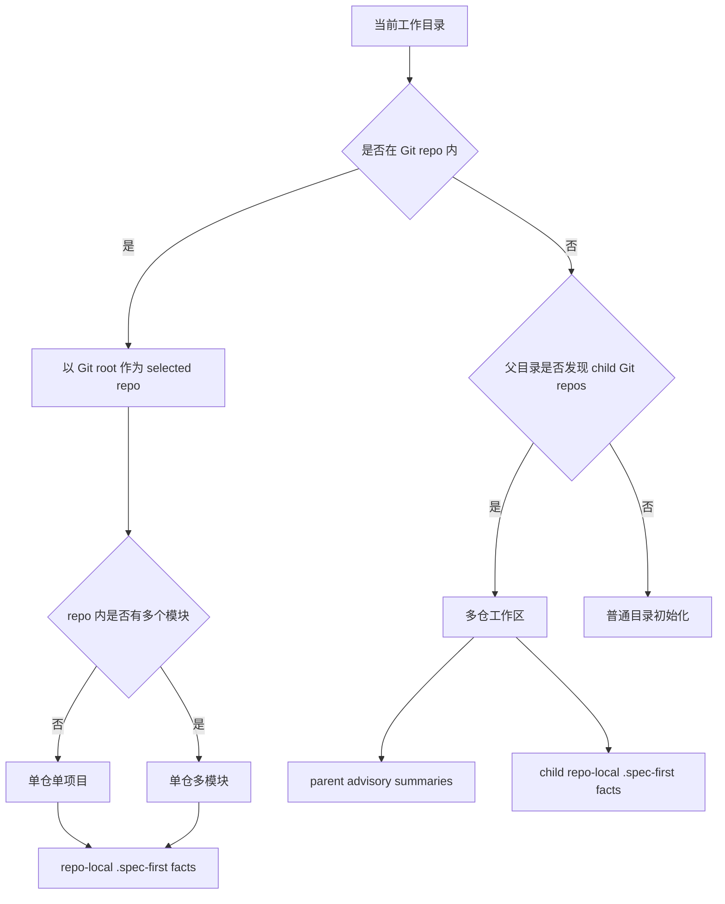
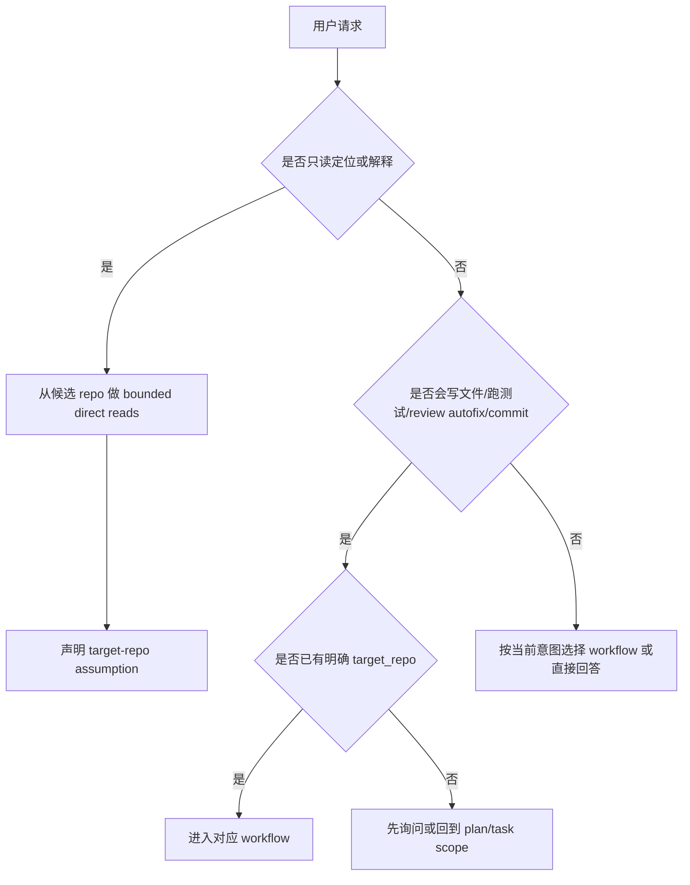

当项目从“一个仓库一个应用”扩展到 monorepo、多模块或父目录多仓工作区时，`spec-first` 的第一原则不是扩大自动化范围，而是先确认**哪个 Git repo root 拥有权威事实**。当前实现把 `.spec-first` facts 绑定到 selected Git repo root；单仓多模块不拆多套 `.spec-first`，父 workspace 的 summary 只作为 advisory，setup、plan、work、review、tests、changelog 和 commit 都需要明确 target repo。Sources: [README.zh-CN.md](README.zh-CN.md#L201), [README.zh-CN.md](README.zh-CN.md#L203), [docs/05-用户手册/README.md](docs/05-用户手册/README.md#L79)

## 架构假设：工作区边界先于工作流边界

本页的核心假设是：`spec-first` 面对复杂目录结构时，先解决“事实归属”，再解决“下一步跑哪个 workflow”。角色契约把系统目标定义为可治理、可验证、可复用的工程闭环，并明确脚本准备确定性事实、LLM 做语义判断；因此工作区拓扑不应该变成隐藏状态机，而应该变成可解释的 repo scope 与 evidence boundary。Sources: [结构化项目角色契约.md](docs/10-prompt/结构化项目角色契约.md#L31), [结构化项目角色契约.md](docs/10-prompt/结构化项目角色契约.md#L64), [结构化项目角色契约.md](docs/10-prompt/结构化项目角色契约.md#L70)



这张图表达的是运行边界，而不是命令菜单：在 Git 仓库内，`init` 默认选择当前 Git root；在父 workspace 中，交互式初始化会让用户选择“全部 child repos”或某个 child repo；显式 `--all-repos` 只能从非 Git repo 的父 workspace 运行，显式 `--repo` 必须解析到当前 workspace 内的 Git repo。Sources: [init.js](src/cli/commands/init.js#L501), [init.js](src/cli/commands/init.js#L518), [init.js](src/cli/commands/init.js#L559)

## 三种模式的判断表

| 模式 | 目录形态 | `.spec-first` 权威位置 | 适合的操作方式 |
|---|---|---|---|
| 单仓单项目 | 一个 Git repo 内只有一个主要应用、服务、SDK 或 CLI | 当前 Git repo root | plan、work、review、tests 都以当前 repo 为边界 |
| 单仓多模块 | 一个 Git repo 内有 `packages/`、`apps/`、Android modules 或前后端模块 | 仍然只在 Git repo root | 跨模块读取与影响分析可以发生，但不把 module 当 child repo |
| 多仓工作区 | 父目录下有多个独立 `.git` child repos | 每个 child repo 各自拥有 `.spec-first`；父目录只放 advisory summary | setup 可批量维护，写入、测试、review、commit 必须明确 child repo |

这三类名称来自用户手册既有定义：单仓单项目、单仓多模块、多仓工作区。关键差异不是目录层级深浅，而是 `.git` 边界：单仓多模块仍是一个 Git root；多仓工作区则是父目录下多个独立 Git 工程。Sources: [08-三种开发模式.md](docs/05-用户手册/08-三种开发模式.md#L1), [08-三种开发模式.md](docs/05-用户手册/08-三种开发模式.md#L78), [08-三种开发模式.md](docs/05-用户手册/08-三种开发模式.md#L120)

## 视觉化目录结构

```text
single-repo-app/
  .git/
  .spec-first/
  src/
  docs/

single-repo-multi-module/
  .git/
  .spec-first/
  packages/
    cli/
    core/
    web/
  services/
    api/
    worker/

multi-repo-workspace/
  frontend-app/
    .git/
    .spec-first/
  backend-api/
    .git/
    .spec-first/
  mobile-app/
    .git/
    .spec-first/
  .spec-first/
    workspace/
      *summary.json
```

上面的结构有一个反直觉但重要的结论：`packages/cli`、`services/api` 或 Android 的 `feature-login` 不是独立 repo scope，除非它们自己有 `.git`；相反，父 workspace 下的 `frontend-app`、`backend-api`、`mobile-app` 各自有 Git root，因此各自拥有 setup facts、plan/work/review 证据闭环。Sources: [08-三种开发模式.md](docs/05-用户手册/08-三种开发模式.md#L48), [08-三种开发模式.md](docs/05-用户手册/08-三种开发模式.md#L88), [08-三种开发模式.md](docs/05-用户手册/08-三种开发模式.md#L100)

## 单仓单项目：默认路径

单仓单项目是最直接的使用方式：在 repo 内运行 `spec-first init`，CLI 会沿当前目录向上找到 Git root，并把它作为 `single-repo` target；后续 generated runtime assets、项目指导、workflow artifacts 都围绕这个 repo 展开。Sources: [init.js](src/cli/commands/init.js#L501), [init.js](src/cli/commands/init.js#L760), [README.zh-CN.md](README.zh-CN.md#L177)

```bash
cd my-app
spec-first init
```

初始化完成后，Claude Code 使用 `/spec:*`，Codex 使用 `$spec-*`；如果需要更完整的 readiness，再运行当前宿主的 `mcp-setup`。这些下一步提示由 `init` 输出生成，并强调项目指导来自 `AGENTS.md`、`CLAUDE.md`、`docs/contracts`、直接源码证据、测试和日志。Sources: [init.js](src/cli/commands/init.js#L1799), [init.js](src/cli/commands/init.js#L1813), [src/cli/index.js](src/cli/index.js#L151)

## 单仓多模块：一个事实源，多个实施面

单仓多模块的正确心智模型是“一个 Git repo，多个 module 边界”。`spec-first` 的 `.spec-first` 仍放在 repo root；需求、计划、任务和 review 可以按 module 拆分，但 setup facts、direct source reads 与 workflow artifacts 不应在每个 module 下复制一套。Sources: [08-三种开发模式.md](docs/05-用户手册/08-三种开发模式.md#L48), [08-三种开发模式.md](docs/05-用户手册/08-三种开发模式.md#L80), [README.zh-CN.md](README.zh-CN.md#L203)

| 正确做法 | 避免做法 | 原因 |
|---|---|---|
| 在 repo root 运行 `spec-first init` | 在每个 module 里各跑一套初始化 | 避免 `.spec-first` facts 分裂 |
| 在 plan/task 中标出 module 影响面 | 把 module 当成 child repo | module 没有独立 Git root |
| review 时按 repo diff 审查，再说明 module 风险 | 为每个 module 伪造独立 review scope | 真实变更仍属于同一 Git repo |
| 用直接源码读取确认跨模块影响 | 只凭 project-graph candidate 下结论 | graph 输出只是 candidate evidence |

项目图谱或代码图谱在这种场景里只能缩小下一步读取范围，不能证明影响面、根因、受影响测试或合并就绪；结论级判断仍要回到源码、测试、日志、文档、契约或用户确认。Sources: [project-graph-consumption.md](docs/contracts/project-graph-consumption.md#L33), [project-graph-consumption.md](docs/contracts/project-graph-consumption.md#L49), [project-graph-consumption.md](docs/contracts/project-graph-consumption.md#L64)

## 多仓工作区：父目录只做 advisory，不做写入权威

多仓工作区中，父目录不是统一 Git repo；它可以用于发现 child repos、批量维护、输出 workspace summary，但不拥有 child repo 的 repo-local truth。用户手册明确写出：每个 repo 有自己的 `.spec-first/config/*`，每个 repo 有自己的 plan/work/review 证据闭环；父 workspace 不应被理解成“一套 `.spec-first` 管所有 repo”。Sources: [08-三种开发模式.md](docs/05-用户手册/08-三种开发模式.md#L122), [08-三种开发模式.md](docs/05-用户手册/08-三种开发模式.md#L156), [08-三种开发模式.md](docs/05-用户手册/08-三种开发模式.md#L165)

```bash
# 在父 workspace 对全部 child repos 初始化 runtime assets
spec-first init --all-repos -y

# 在父 workspace 显式选择一个 child repo
spec-first init --repo backend-api -y

# 在 child repo 内按单仓方式初始化
cd backend-api
spec-first init -y
```

CLI 的参数约束体现了这个边界：`--repo` 与 `--all-repos` 不能组合；`--all-repos` 必须从父 workspace 运行，不能在 Git repo 内运行；`--repo` 目标必须存在、位于当前 workspace 内，并解析到 workspace 内的 Git repo。Sources: [init.js](src/cli/commands/init.js#L256), [init.js](src/cli/commands/init.js#L311), [init.js](src/cli/commands/init.js#L518)

## 写入、测试与审查的 target repo 规则

只读问题可以从父 workspace 出发做 bounded direct reads，并说明 target-repo assumption；但一旦进入 plan、work、review autofix、tests、changelog 或 commit，就不能靠 cwd 暗示写入范围。`spec-work` 明确要求：父 workspace 中不能仅从 cwd 推断写入目标，plan 或 task pack 必须提供 `target_repo` 或每个 child 的 scope。Sources: [using-spec-first/SKILL.md](skills/using-spec-first/SKILL.md#L260), [spec-work/SKILL.md](skills/spec-work/SKILL.md#L122), [spec-work/SKILL.md](skills/spec-work/SKILL.md#L37)

| 场景 | 可以从父 workspace 做什么 | 需要明确什么 |
|---|---|---|
| “这个登录逻辑在哪个仓？” | 读取候选 child repo 的有限文件 | 说明候选 repo 假设 |
| “给 backend-api 做计划” | 读取 `backend-api` 相关证据 | `target_repo: backend-api` |
| “这个需求跨前后端” | 分别读取 frontend/backend 证据 | 每个 implementation unit 的 target repo |
| “跑测试并修复” | 不能默认跨全部 child repos 写 | 测试命令、写入 repo、验证边界 |
| “准备 review/commit” | 可按 repo 分组 diff | 每个 Git repo 的 diff 与验证证据 |

这种规则不是为了增加流程负担，而是为了防止父 workspace 的 advisory facts 被误当成 confirmed source truth。`target-repo` 辅助逻辑也要求目标必须是具体 Git repository root，并会拒绝指向 Git internals、secret-denied paths、generated runtime mirrors 或不受支持的 `.spec-first` artifact path。Sources: [target-repo-containment.test.js](tests/unit/target-repo-containment.test.js#L22), [target-repo-containment.test.js](tests/unit/target-repo-containment.test.js#L58), [README.zh-CN.md](README.zh-CN.md#L203)

## 读写决策流程



`using-spec-first` 的入口治理要求不要按关键词强行进 workflow；父 workspace 中的只读代码问题也不因为有多个 repo 就必须进入 workflow。但如果请求涉及 planning、review、implementation 或 mutation，则要先把目标 repo 明确下来，再让对应 workflow 接管 artifacts 与验证证据。Sources: [using-spec-first/SKILL.md](skills/using-spec-first/SKILL.md#L124), [using-spec-first/SKILL.md](skills/using-spec-first/SKILL.md#L260), [using-spec-first/SKILL.md](skills/using-spec-first/SKILL.md#L337)

## 常见误区

| 误区 | 正确理解 |
|---|---|
| “monorepo 里每个 package 都该有 `.spec-first`” | 单仓多模块只保留 repo root 的 `.spec-first` |
| “父 workspace 的 `.spec-first` 可以代表所有 child repos” | 父 workspace summary 只是 advisory |
| “`--all-repos` 意味着后续 work/review 默认跨所有仓写入” | 批量初始化不等于批量写业务代码 |
| “project-graph 找到候选关系就能直接下结论” | graph candidate 必须回到源码、测试或日志确认 |
| “dirty workspace 下只读问题必须先清理” | 只读 evidence 可降级披露；写入和结论要更谨慎 |

这些误区都来自同一个边界混淆：把 advisory workspace evidence 当成 confirmed repo-local truth。项目图谱契约明确禁止把 graph 输出当 confirmed evidence，用户手册也明确父 workspace 不拥有 repo-local truth；因此读可以宽、写必须窄，候选可以快、结论必须实。Sources: [project-graph-consumption.md](docs/contracts/project-graph-consumption.md#L1), [project-graph-consumption.md](docs/contracts/project-graph-consumption.md#L86), [08-三种开发模式.md](docs/05-用户手册/08-三种开发模式.md#L176)

## 推荐阅读顺序

如果你刚读完本页，下一步取决于当前目标：需要重新确认初始化命令时，读 [安装、健康检查与项目初始化](3-an-zhuang-jian-kang-jian-cha-yu-xiang-mu-chu-shi-hua)；不确定该跑哪个 workflow 时，读 [选择合适的工作流入口](6-xuan-ze-he-gua-de-gong-zuo-liu-ru-kou)；要理解产物写到哪里、哪些文件该提交时，读 [产物目录与 Git 提交边界](7-chan-wu-mu-lu-yu-git-ti-jiao-bian-jie)；升级后需要刷新 runtime assets 时，继续读 [升级、清理与运行时资产刷新](9-sheng-ji-qing-li-yu-yun-xing-shi-zi-chan-shua-xin)。Sources: [wiki.json](.zread/wiki/drafts/wiki.json#L56), [6-xuan-ze-he-gua-de-gong-zuo-liu-ru-kou.md](.zread/wiki/drafts/6-xuan-ze-he-gua-de-gong-zuo-liu-ru-kou.md#L83), [README.zh-CN.md](README.zh-CN.md#L292)