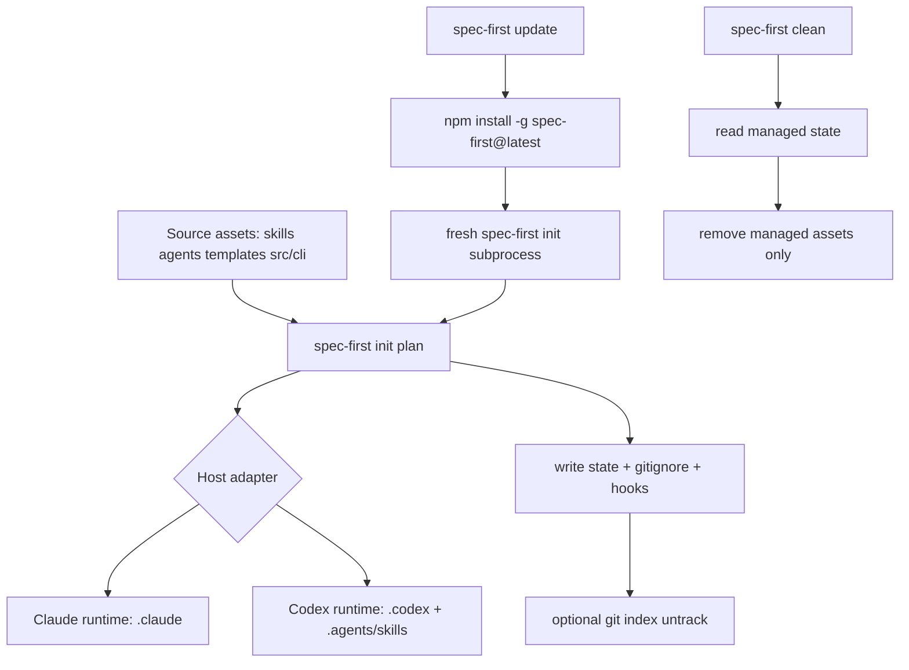

本页位于入门指南的第 9 篇，聚焦三个操作边界：`spec-first update` 如何升级 CLI 并刷新本地 runtime assets，`spec-first clean` 如何移除受管资产，以及为什么应通过 `spec-first init` 从 source-of-truth 重新生成宿主 runtime mirror，而不是手改 `.claude/`、`.codex/` 或 `.agents/skills/`。如果你还没有完成初始化，应先读 [安装、健康检查与项目初始化](3-an-zhuang-jian-kang-jian-cha-yu-xiang-mu-chu-shi-hua)；如果你正在判断哪些文件该提交，应继续读 [产物目录与 Git 提交边界](7-chan-wu-mu-lu-yu-git-ti-jiao-bian-jie)；若需要理解 source 到 runtime 的完整生成机制，可在本页之后读 [Source Assets 到宿主 Runtime Mirrors 的生成流程](17-source-assets-dao-su-zhu-runtime-mirrors-de-sheng-cheng-liu-cheng)。Sources: [index.js](src/cli/index.js#L151-L167), [AGENTS.md](AGENTS.md#L75-L104)

## 架构假设与验证结论

可验证的核心假设是：**升级不是只替换 npm 包，清理不是全删目录，刷新也不是在 runtime 里手工修补**。代码实现把三者拆成确定性路径：`update` 先执行全局 npm 升级，再用新的 `spec-first` 子进程运行 `init`；`clean` 读取受管 state 后只删除 spec-first 管理过的文件、目录、hook 与 managed block；`init` 从 bundled source 生成目标宿主 runtime，并在必要时做 managed hard reset、obsolete prune 与 Git index untrack。Sources: [update.js](src/cli/commands/update.js#L13-L24), [clean.js](src/cli/commands/clean.js#L101-L113), [init.js](src/cli/commands/init.js#L986-L1003)



这张图表达的是当前代码中的控制流事实：`update` 不在旧进程里直接复用生成逻辑，而是升级成功后生成 fresh `spec-first init` 子进程；`init` 通过 adapter 把同一批 source assets 投递到不同宿主路径；`clean` 依赖 state 做受管资产删除，最后声明自定义资产不受影响。Sources: [update.js](src/cli/commands/update.js#L64-L91), [plugin.js](src/cli/plugin.js#L659-L678), [clean.js](src/cli/commands/clean.js#L107-L113)

## 运行时资产的物理边界

spec-first 的 source-of-truth 包括 `skills/`、`agents/`、`templates/`、`src/cli/`、文档与包元数据；generated runtime assets 包括 `.claude/`、`.codex/`、`.agents/skills/`。仓库治理明确要求优先修改 source，runtime drift 通过 `spec-first init` 重新生成，而不是直接手改 runtime mirror。Sources: [AGENTS.md](AGENTS.md#L75-L104)

```text
source-of-truth
├── skills/
├── agents/
├── templates/
│   ├── claude/
│   └── codex/
└── src/cli/

generated runtime mirrors
├── .claude/
├── .codex/
└── .agents/skills/
```

Claude adapter 的 runtime root 是 `.claude`，命令入口写入 `.claude/commands/spec`，skills 写入 `.claude/skills`，workflow skills 写入 `.claude/spec-first/workflows`，agents 写入 `.claude/agents`，state 文件位于 `.claude/spec-first/state.json`。Codex adapter 的 runtime root 是 `.codex`，但用户可见 workflow/skill 入口位于 `.agents/skills`，agents 位于 `.codex/agents`，state 文件位于 `.codex/spec-first/state.json`，而 `.codex/commands/spec` 被标注为 legacy compatibility cleanup target。Sources: [claude.js](src/cli/adapters/claude.js#L34-L60), [codex.js](src/cli/adapters/codex.js#L27-L71)

| 维度 | Claude Code | Codex |
|---|---|---|
| runtime root | `.claude` | `.codex` |
| workflow/skill 入口 | `.claude/commands/spec` 与 `.claude/spec-first/workflows` | `.agents/skills` |
| standalone skills | `.claude/skills` | `.agents/skills` |
| agents | `.claude/agents` | `.codex/agents` |
| state | `.claude/spec-first/state.json` | `.codex/spec-first/state.json` |

Sources: [claude.js](src/cli/adapters/claude.js#L34-L60), [codex.js](src/cli/adapters/codex.js#L41-L71)

## 升级：`spec-first update`

`spec-first update` 的实现边界很窄：它无条件执行 `npm install -g spec-first@latest`，不做版本比较，也不检测安装来源；npm 自身负责幂等。如果升级成功，它随后解析当前目录是单 Git 仓库还是父工作区，并选择 `spec-first init -y` 或 `spec-first init --all-repos -y` 刷新 runtime assets。Sources: [update.js](src/cli/commands/update.js#L10-L24), [update.js](src/cli/commands/update.js#L121-L146)

| 场景 | 自动动作 | 失败/不确定时的提示 |
|---|---|---|
| 当前目录在 Git 仓库内 | `spec-first init -y` | init 失败时打印 fallback |
| 当前目录是父工作区且含子 Git 仓库 | `spec-first init --all-repos -y` | init 失败时打印 fallback |
| 无法安全判断范围 | 不自动刷新 | 打印单仓与父工作区 fallback 命令 |
| npm 不存在或安装失败 | 不刷新 runtime | 返回非 0 并提示手动升级命令 |

Sources: [update.js](src/cli/commands/update.js#L47-L87), [update.js](src/cli/commands/update.js#L148-L156)

测试契约覆盖了这个行为：成功升级会调用一次 installer，并用 fresh init 刷新 runtime；父工作区会选择 `init --all-repos -y`；自动刷新失败会返回失败并输出 fallback；未知刷新范围不会启动 init，只打印可复制命令。Sources: [update-contracts.test.js](tests/unit/update-contracts.test.js#L47-L76), [update-contracts.test.js](tests/unit/update-contracts.test.js#L109-L137)

需要注意安装来源：命令末尾明确提示，如果你是把 spec-first 作为 Claude Code plugin 安装，应该在 Claude Code 内使用 `claude plugin update`，因为 `npm -g` 管理的是另一份全局副本。Sources: [update.js](src/cli/commands/update.js#L88-L91), [update.js](src/cli/commands/update.js#L177-L179)

## 刷新：`spec-first init` 如何重建 runtime

`init` 的刷新过程先选择目标：当前目录若在 Git 仓库内，默认目标是该 Git root；显式 `--all-repos` 只能在父工作区运行，并要求能发现子 Git 仓库；显式 `--repo <path>` 必须解析到当前 workspace 内的 Git 仓库。Sources: [init.js](src/cli/commands/init.js#L501-L556)

刷新计划由 `buildProjectInitPlan` 构建：它加载 plugin manifest，按目标宿主过滤资产，调用 `planBundledAssetSync` 规划 commands、skills、agents，再调用 adapter 规划宿主 hook/runtime 文件，最后构造 preview state。Sources: [init.js](src/cli/commands/init.js#L862-L927), [plugin.js](src/cli/plugin.js#L659-L678)

如果发现 legacy managed state 或当前 runtime drift，`init` 会在重新写入前构建 managed hard reset；否则它会先 prune 过时 managed asset、命令命名空间与 retired runtime asset，再执行写入计划。这个顺序解释了为什么刷新可以同时处理升级后的新增资产、删除资产和迁移痕迹。Sources: [init.js](src/cli/commands/init.js#L953-L1003), [state.js](src/cli/state.js#L352-L381)

实际 apply 阶段会先执行 destructive reset 与 pre-sync，再执行 write plan；如果发生 destructive reset，代码还会创建 rollback backup，失败时恢复。所有写入、删除、目录创建和 Git index untrack 都通过 `applyOperationPlan` 统一执行，并对目标路径做 project containment 检查。Sources: [init.js](src/cli/commands/init.js#L1037-L1072), [state.js](src/cli/state.js#L560-L605)

## Git index untrack：刷新时的“保留文件、移出索引”

`init` 会调用 `planRuntimeUntrack` 检查 `.gitignore` 覆盖的 spec-first generated/runtime 路径是否已经被 Git 跟踪；如果存在，它生成 `untrack_index` 操作，apply 时执行 `git rm --cached --quiet -f -- <path>`，因此工作区文件会保留，只从 Git index 移除。Sources: [runtime-untrack.js](src/cli/runtime-untrack.js#L9-L40), [runtime-untrack.js](src/cli/runtime-untrack.js#L43-L89)

测试明确验证了这个语义：dry-run 会预览将被 untrack 的 managed runtime path 但不改变索引；apply 会输出“工作区文件保留”，Git 跟踪状态为空，同时磁盘上的 state 文件仍然存在；非 Git 目录中该检查会以 advisory skip 报告 `not-a-git-repo`。Sources: [init-dry-run.test.js](tests/unit/init-dry-run.test.js#L666-L704), [init-dry-run.test.js](tests/unit/init-dry-run.test.js#L706-L721)

## 清理：`spec-first clean`

`spec-first clean` 要求显式选择 `--claude` 或 `--codex`，两者不能同时指定；它读取对应宿主的 managed state，如果没有 state，则输出没有发现受管项目资产；如果 state 是 legacy 形态，它不会迁移旧安装，而是提示先重新 init。Sources: [clean.js](src/cli/commands/clean.js#L43-L85)

clean 的删除范围由 state 驱动：commands 删除文件，skills 与 workflow skills 删除目录，agents 与 agent support files 删除文件。额外 cleanup 会移除 instruction 文件中的 managed coding guidelines、runtime tools 与 bootstrap block，删除 state 文件，并调用宿主 adapter 清理 hook/runtime 文件。Sources: [state.js](src/cli/state.js#L279-L345), [clean.js](src/cli/commands/clean.js#L373-L422)

Claude 清理前会校验 `.claude/settings.json` 是否是合法 JSON；如果无法读取，会要求先修复 settings 再运行 `spec-first clean --claude`。Codex 清理会通过 adapter 删除 SessionStart hook 文件、Windows hook 文件，并更新或删除 `.codex/hooks.json` 中的受管 hook 配置。Sources: [clean.js](src/cli/commands/clean.js#L87-L99), [codex.js](src/cli/adapters/codex.js#L154-L184)

| 命令 | 作用 | 安全边界 |
|---|---|---|
| `spec-first clean --claude --dry-run` | 预览 Claude 受管资产清理 | 不写文件 |
| `spec-first clean --claude` | 删除 Claude 受管 runtime、state、managed blocks/hooks | 自定义资产不在 managed set 内则保留 |
| `spec-first clean --codex --dry-run` | 预览 Codex 受管资产清理 | 不写文件 |
| `spec-first clean --codex` | 删除 Codex 受管 runtime、state、hooks 与 legacy cleanup target | 自定义资产不在 managed set 内则保留 |

Sources: [clean.js](src/cli/commands/clean.js#L101-L113), [clean.js](src/cli/commands/clean.js#L358-L370)

## 父工作区孤儿资产清理

`spec-first clean --workspace-orphans` 是另一条清理路径，不能与 `--claude` 或 `--codex` 混用。它读取 `.spec-first/workspace/parent-artifact-quarantine.json`，默认只预览 quarantine evidence；只有追加 `--confirm` 才会删除列出的支持路径。Sources: [clean.js](src/cli/commands/clean.js#L156-L199)

当前允许的 workspace orphan cleanup target 只有 `.spec-first/config/tool-facts.json` 与 `.spec-first/config/runtime-capabilities.json`。删除计划会拒绝绝对路径、反斜杠、`..`、不在允许列表内的路径，以及通过 symlink 逃逸项目根目录的目标。Sources: [clean.js](src/cli/commands/clean.js#L235-L263), [clean.js](src/cli/commands/clean.js#L312-L337)

## 推荐操作顺序

日常升级时，优先运行 `spec-first update`，让它在升级后自动刷新当前仓库或父工作区；如果它报告刷新 degraded 或 scope undetermined，再按输出选择 `spec-first init -y` 或 `spec-first init --all-repos -y`。不要把 `.claude/`、`.codex/` 或 `.agents/skills/` 当作修复入口。Sources: [update.js](src/cli/commands/update.js#L64-L87), [AGENTS.md](AGENTS.md#L97-L104)

需要重新生成 runtime 时，使用 `spec-first init`；需要移除受管 runtime 时，使用 `spec-first clean --claude` 或 `spec-first clean --codex`；需要检查父工作区遗留配置事实时，先运行 `spec-first clean --workspace-orphans` 预览，再决定是否 `--confirm`。完成本页后，建议继续阅读 [常见问题与降级路径](10-chang-jian-wen-ti-yu-jiang-ji-lu-jing)，或进入深入解析中的 [初始化计划、受管状态与原子写入机制](16-chu-shi-hua-ji-hua-shou-guan-zhuang-tai-yu-yuan-zi-xie-ru-ji-zhi)。Sources: [index.js](src/cli/index.js#L158-L167), [clean.js](src/cli/commands/clean.js#L358-L370)