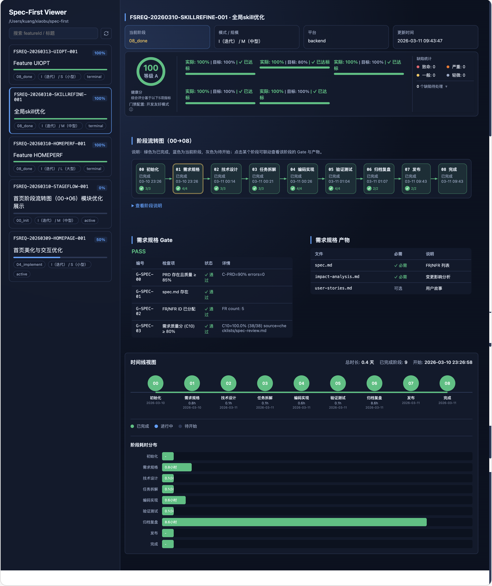

# Spec-First — 规范驱动的 AI 研发流程引擎

**为 AI 协同交付引入结构、可追溯性与质量门禁。**

[](https://www.npmjs.com/package/spec-first)
[](https://www.npmjs.com/package/spec-first)
[](https://nodejs.org)
[](https://www.typescriptlang.org)
[](LICENSE)

📖 [English README](./README.md)

---

## 问题所在

AI 编程助手（Claude Code、Codex、Cursor）能力强大，但天然无状态。每次新会话都会丢失上一轮的决策上下文。代码在未经验证的情况下直接提交。需求变更无从追溯。团队成员对 AI 的使用方式各不相同，导致代码审查失去可信基准。

Spec-First 在**流程层面**解决这些问题，而不是在提示词层面打补丁：

| 表象 | 根因 | Spec-First 解法 |
|---|---|---|
| AI 生成的代码与之前的决策不一致 | 会话间没有持久化的语义上下文 | `specs/<featureId>/` 目录作为跨会话的唯一真理源 |
| 未经验证的 AI 产物直接进入生产 | 生成与提交之间没有强制校验层 | 阶段门禁状态机——每个阶段必须通过质量门禁才能推进 |
| "这段代码为什么这样写"无法回答 | 需求到实现之间没有制品链接 | 14 类追溯 ID 体系，覆盖 FR → DS → TASK → TC 完整链路 |
| 每个开发者对 AI 的用法各异 | 没有共享的执行协议 | 20 个 Skill 统一采用 P0–P5 六阶段执行模型 |

---

## 工作原理

Spec-First 将 AI 工作流包裹在一个结构化状态机中。Feature 从 `00_init` 出发，只有当每个阶段的质量门禁通过后才能推进。

```
[想法] → 00_init → 01_specify → 02_design → 03_plan → 04_implement → 05_verify → 06_wrap_up → 07_release → 08_done
           ↓            ↓            ↓           ↓            ↓             ↓             ↓             ↓
                                          09_cancelled  ←  （任意活跃阶段均可取消）
```

在每个阶段，**Skill** 通过确定性的六阶段协议引导 AI 执行：

```
P0  LOCATE       定位当前 Feature，校验阶段合法性
P1  CONTEXT      加载 spec 目录、历史产物与运行记录
P2  GENERATE     AI 推理，生成结构化交付物草稿
P3  CONFIRM      用户审阅、迭代或拒绝（支持多轮确认）
P4  WRITE        最终产物落盘，注册追溯 ID
P5  副作用       同步追踪矩阵、触发门禁评估、更新运行态
```

这意味着每一次 AI 操作都是**可定位、有上下文、可确认、可审计**的。

## 第一性原则

Spec-First 的本质首先是一个 **Skill 主导系统**，而不是一个 CLI 主导的代码生成器。

- Skill 负责定义工作流、多 Agent 编排、约束和成功标准
- CLI 只负责最小支撑层：启动、持久化、校验和宿主集成
- 对于 `first` 这类项目认知任务，目标方向应当是：Skill 主导的多 Agent 编排优先，本地脚本退回支撑层

边界也很明确：

- runtime 资产是机器输入，必须保持合同稳定
- 面向人的文档可以更自由生成，但不能反向成为后续 Skill 的隐藏真源

---

## 快速开始

### 前置条件

- Node.js ≥ 20.0.0
- npm 或 pnpm
- Git
- Claude Code 或 Codex（可选，Skill 集成必需）

### 安装

```bash
npm install -g spec-first@latest
spec-first doctor          # 验证安装与宿主集成状态
```

### 初始化 Feature

```bash
cd /path/to/your-project

# --mode N = 全新功能  |  --mode I = 增量改进
# --size S = 小        |  --size M = 中   |  --size L = 大
spec-first init --feat AUTH --mode N --size M --platforms web,node
```

### 完整开发流程（Claude Code / Codex）

```bash
/spec-first:onboarding    # 第一次使用？从这里开始
/spec-first:init          # 初始化 Feature 工作区
/spec-first:spec          # 编写需求规格（FR + 验收标准）
/spec-first:design        # 技术设计（DS + API 契约）
/spec-first:task          # 将设计拆解为可追踪任务
/spec-first:code          # 按任务实现，关联追溯 ID 提交
/spec-first:verify        # 对照验收标准执行阶段验收
/spec-first:archive       # 复盘归档，收口 Feature
```

### 日常 CLI

```bash
spec-first feature current          # 当前是哪个 Feature？
spec-first stage current            # 当前处于哪个阶段？
spec-first gate                     # 门禁条件是否全部通过？
spec-first metrics report           # 覆盖率与健康评分
spec-first golive check <featureId> # 上线就绪检查
```

---

## 核心能力

### 阶段状态机（8 个活跃阶段 + 2 个终态）

每个 Feature 在 8 个活跃阶段中依次推进——每个阶段都有阻断性门禁条件——最终进入两个终态之一。终态不可逆，设计如此。

| 阶段 | 交付物 | 入口 |
|---|---|---|
| `00_init` | Feature 工作区、配置 | `spec-first init` |
| `01_specify` | 需求规格（FR + AC） | `/spec-first:spec` |
| `02_design` | 技术设计（DS + API） | `/spec-first:design` |
| `03_plan` | 带追溯 ID 的任务列表 | `/spec-first:task` |
| `04_implement` | 关联规格的代码提交 | `/spec-first:code` |
| `05_verify` | 测试用例与覆盖率证据 | `/spec-first:verify` |
| `06_wrap_up` | 复盘文档 | `/spec-first:archive` |
| `07_release` | 冒烟测试报告 + 发布说明 | `spec-first golive check` |
| `08_done` | *（终态）* | `spec-first done` |
| `09_cancelled` | *（终态）* | `spec-first stage cancel` |

### 质量门禁

每个阶段定义一组阻断性条件，全部通过才可推进。门禁评估是确定性的，支持 CI 集成。

```bash
spec-first gate                              # 评估当前阶段门禁
spec-first gate --stage 04_implement         # 评估指定阶段
spec-first golive check <featureId>          # 上线全量门禁（07_release）
spec-first metrics coverage --threshold 0.8  # 强制覆盖率阈值
```

### 全链路追溯

每个制品都携带类型化的追溯 ID，形成从业务需求到线上代码的完整可导航链路：

```
FR · DS · TASK · TC · RFC                  ← 主交付链
REQ · SYS · ARCH · MOD                    ← 需求与架构
ATP · STP · ITP · UTP                     ← 测试规划
Feature                                    ← Feature 级追踪
```

共 14 类 ID，每个 ID 均已注册、可检索、可校验。

```bash
spec-first id generate FR        # 生成新需求 ID
spec-first id verify FR-001      # 确认 ID 已注册并关联
spec-first matrix sync           # 重建追溯覆盖率矩阵
```

### 20 个内置 Skill

Skill 是面向 AI 的交互界面。每个 Skill 执行确定性的 P0–P5 协议，确保每次 AI 交互都已加载上下文、经过确认、副作用可追踪。

| 分类 | Skills |
|---|---|
| **引导认知** | `onboarding`、`first` |
| **核心阶段** | `init`、`spec`、`design`、`research`、`task`、`code`、`review`、`archive`、`catchup` |
| **编排运维** | `plan`、`verify`、`orchestrate`、`status`、`sync`、`feature`、`doctor` |
| **质量扩展** | `spec-review`、`analyze` |

### 宿主集成与自动化

```bash
spec-first update                # 刷新稳定宿主基线能力（Claude Code + Codex）
spec-first update --host gemini  # 显式启用 Gemini baseline（experimental）
spec-first update --host cursor  # 显式启用 Cursor baseline（experimental）
spec-first hooks status    # 查看 Git Hook 集成状态
spec-first viewer start    # 启动 Stage Viewer 可视化面板
spec-first commit          # 结构化提交，自动关联追溯 ID
```

### 发布

```bash
pnpm run release:publish                # 跨平台发布入口，默认自动判断版本升级
pnpm run release:publish -- minor       # 强制 minor 升级
pnpm run release:publish -- auto --dry-run
```

`publish.sh` 仍保留为兼容包装器，但推荐使用 `release:publish` / `scripts/publish.mjs` 作为正式入口。

---

## 架构

Spec-First 分为三层。层间边界严格：Skill 层不直接访问运行时，CLI 层不调用 Skill。

```
┌────────────────────────────────────────────────────┐
│  Skill 层  — Claude Code / Codex 集成              │
│  20 个 Skill · P0–P5 执行协议                      │
├────────────────────────────────────────────────────┤
│  CLI 层  — spec-first <命令>                       │
│  28 组确定性命令                                    │
├────────────────────────────────────────────────────┤
│  运行时层                                           │
│  ┌─────────────────┬──────────────────────────┐   │
│  │ process-engine  │ 阶段状态机，生命周期控制   │   │
│  │ gate-engine     │ 阻断性门禁条件评估         │   │
│  │ trace-engine    │ ID 注册表，覆盖率矩阵       │   │
│  │ skill-runtime   │ Skill 分发，Prompt 组装    │   │
│  │ ai-orchestrator │ 自动循环，Context Pack     │   │
│  │ metrics-engine  │ 健康评分，瓶颈检测         │   │
│  └─────────────────┴──────────────────────────┘   │
└────────────────────────────────────────────────────┘
```

---

## 可视化面板

Spec-First 内置可视化看板。执行 `spec-first viewer start` 即可启动，一览 Feature 健康分、阶段流转状态、门禁通过情况与各阶段耗时分布。



---

## 竞品学习

Spec-First 的设计来自对 AI 工作流生态的深入研究——不是为了取代这些工具，而是将它们各自最优秀的设计模式融合成一个完整的流程引擎。

| 项目 | 核心理念 | Spec-First 的借鉴 |
|---|---|---|
| **OpenSpec** | Actions not Phases — 工件 DAG 驱动而非刚性阶段门禁 | Delta Spec 需求演进追踪思路 |
| **Spec Kit** | 规范驱动开发 — constitution.md 作为最高准则 | 规范即契约原则；一致性分析模式 |
| **Planning-Files** | 上下文工程 — 文件即持久化工作记忆 | `specs/<featureId>/` 跨会话上下文持久化；`catchup` 的 5-Question Reboot 机制 |
| **Trellis** | Read Before Write — 每次开发前强制加载规范 | 开发前规范注入协议；`archive` 引入 break-loop 复盘机制 |
| **Superpowers** | Discipline Over Convenience — TDD 作为硬性门禁 | P0–P5 确定性执行模型；验证前禁止声称完成的门禁条件 |

---

## 贡献指南

欢迎提交 Bug 报告和 Pull Request。重大改动请先[开 Issue](https://github.com/sunrain520/spec-first/issues) 讨论。

本地开发：

```bash
npm install
npm run build
npm test
npm run lint
```

---

## 参考资料

- [完整项目介绍](./PROJECT-INTRODUCTION.md)
- [用户文档](./docs/07-用户文档/)
- [Skill 目录](./skills/spec-first/README.md)
- [CLI 命令参考](./docs/07-用户文档/CLI命令参考手册.md)

---

## 仓库与许可证

- [GitHub](https://github.com/sunrain520/spec-first)
- [Gitee](https://gitee.com/sunnyrain/spec-first)
- [Issue Tracker](https://github.com/sunrain520/spec-first/issues)
- [English README](./README.md)
- License：MIT © [leo.kuang](https://github.com/sunrain520)
