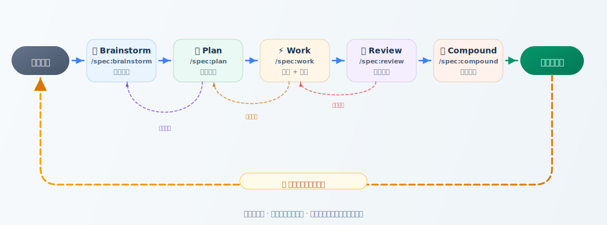

<div align="center">
  

# Spec-First

**中文优先的开源 AI 工程工作流 CLI**
**An open-source workflow CLI for turning AI coding into an engineered system**

*候选发散 → 需求澄清 → 方案规划 → 实施执行 → 结构化评审 → 知识沉淀*
*Ideate → Clarify → Plan → Execute → Review → Compound*

**把 AI 编程从一次性对话，升级为可安装、可治理、可复用的工程系统。**
**Turn AI coding from ad-hoc chat into an installable, governed, reusable engineering workflow.**

<p>
  <a href="https://www.npmjs.com/package/spec-first"></a>
  <a href="https://npmtrends.com/spec-first"></a>
  <a href="https://github.com/sunrain520/spec-first/blob/main/LICENSE"></a>
  <a href="https://github.com/sunrain520/spec-first/stargazers"></a>
  <a href="./docs/05-用户手册/README.md"></a>
  <a href="https://github.com/sunrain520/spec-first/issues"></a>
  <a href="https://github.com/sunrain520/spec-first/pulls"></a>
  <a href="https://deepwiki.com/sunrain520/spec-first"></a>
  <a href="https://chatgpt.com/?q=Explain+the+project+sunrain520/spec-first+on+GitHub"></a>
</p>

<p>
  <a href="http://1.15.14.36:8087/">官网 / Website</a>
  <span>&nbsp;•&nbsp;</span>
  <a href="#快速开始--quick-start">立即开始 / Get Started</a>
  <span>&nbsp;•&nbsp;</span>
  <a href="#核心工作流--core-workflow">查看工作流 / View Workflow</a>
  <span>&nbsp;•&nbsp;</span>
  <a href="./docs/05-用户手册/README.md">用户手册 / Manual</a>
  <span>&nbsp;•&nbsp;</span>
  <a href="https://www.npmjs.com/package/spec-first">npm</a>
</p>
</div>

<p align="center">
  
</p>

## 概述 | Overview

`spec-first` 是一个面向 **Claude Code** 和 **Codex** 的开源 `npm` CLI。
它不只是安装一组命令，而是把 AI 辅助开发从"临时对话"收敛成"可追踪、可评审、可复用"的工程流程。

`spec-first` is an open-source `npm` CLI for **Claude Code** and **Codex**.
It packages AI-assisted development into a workflow with explicit artifacts, structured review, and reusable project knowledge.
`spec-first init --codex` now also generates the shared `/spec:*` command files under `.codex/commands/spec/`, so Codex sessions see the same workflow entrypoints as Claude Code.

> 首次在 Claude Code 中使用时，建议按 `spec-first init --claude` → `/spec:mcp-setup` → 重启 Claude Code → `/spec:bootstrap` 的顺序完成宿主准备，再进入后续工作流。
>
> For first-time Claude Code setup, follow `spec-first init --claude` → `/spec:mcp-setup` → restart Claude Code → `/spec:bootstrap` before entering the rest of the workflow.

## 快速开始 | Quick Start

### 先决条件 | Prerequisites

- Node.js `>=20`
- 已安装 **Claude Code** 或 **Codex** 中的至少一个

At least one of **Claude Code** or **Codex** must be installed before running `spec-first init`.

### 1. 安装 CLI | Install

```bash
npm install -g spec-first
spec-first -v
```

### 2. 检查当前环境 | Check Environment

```bash
spec-first doctor          # 检查所有平台
spec-first doctor --claude # 仅检查 Claude Code 平台
spec-first doctor --codex  # 仅检查 Codex 平台
```

### 3. 在目标项目中初始化 | Initialize

```bash
spec-first init --claude
# or
spec-first init --codex
```

如需显式指定开发者信息：

```bash
spec-first init --claude -u <name> --lang <zh|en>
spec-first init --codex -u <name> --lang <zh|en>
```

身份解析规则：

- `-u/--user` 未提供时，优先读取全局 `~/.spec-first/.developer`
- 若全局配置不存在，则回退到 `git config user.name`
- `--lang` 未提供时，优先沿用当前项目已有 `.developer` 中的语言配置，再回退到全局配置，最后默认 `zh`

### 4. 开始使用工作流 | Start Workflow

#### Claude Code（首次使用）| Claude Code First Run

```text
# 第一步：初始化项目运行时 | Step 1: Initialize project runtime
spec-first init --claude

# 第二步：安装 MCP 工具 | Step 2: Install MCP tools
/spec:mcp-setup

# 第三步：重启 Claude Code | Step 3: Restart Claude Code

# 第四步：生成项目上下文 | Step 4: Generate project context
/spec:bootstrap

# 之后按需使用工作流 | Then use workflow as needed
/spec:ideate
/spec:brainstorm
/spec:plan
/spec:work
/spec:review
/spec:compound
```

> ⚠️ `/spec:bootstrap` 在启动时会检查宿主就绪状态（Host Readiness Gate）。如果跳过 `/spec:mcp-setup` 或未重启 Claude Code，bootstrap 会给出明确引导并停止，不会静默降级。
>
> ⚠️ `/spec:bootstrap` performs a Host Readiness Gate check on startup. If `/spec:mcp-setup` was not run or Claude Code was not restarted, bootstrap will stop with clear guidance instead of silently degrading.

#### Codex | Codex

```text
# 第一步：初始化项目运行时 | Step 1: Initialize project runtime
spec-first init --codex

# 第二步：生成项目上下文 | Step 2: Generate project context
$spec-bootstrap

# 之后按需使用工作流 | Then use workflow as needed
$spec-ideate
$spec-brainstorm
$spec-plan
$spec-work
$spec-review
$spec-compound
```

## 实际效果 | See It In Action

一条命令，向当前项目注入完整工作流能力：

Run one command to inject the full workflow into your project:

```bash
$ spec-first init --claude

📋 Wrote language policy to CLAUDE.md
📦 Generated 8 command file(s) in .claude/commands/spec
🧩 Generated 43 skill directory(ies) in .claude/skills
🤖 Generated 47 agent file(s) in .claude/agents
🪪 Wrote project developer profile:
  📍 path: .claude/spec-first/.developer
  👤 name: yourname
  🈯 lang: zh
  🔖 version: 1.4.0

🔁 Restart Claude Code after generation so it can pick up the new /spec:* commands.
```

初始化完成后，请按平台继续完成首次使用路径，再进入工作流：

After init, continue with the platform-specific first-run path before entering the workflow:

```text
Claude Code: /spec:mcp-setup → restart → /spec:bootstrap → /spec:ideate → /spec:brainstorm → /spec:plan → /spec:work → /spec:review → /spec:compound
Codex:       $spec-bootstrap → $spec-ideate → $spec-brainstorm → $spec-plan → $spec-work → $spec-review → $spec-compound
```

## 为什么需要它 | Why Spec-First

大多数 AI 编程失败，不是因为模型不够强，而是因为工程边界不稳定：

- 需求没有被明确记录
- 计划和实现容易脱节
- 评审缺少结构化结论
- 已解决问题难以沉淀为下一轮输入

Spec-First 解决的不是单次生成质量，而是整个交付闭环：

- 用 `doctor / init / clean` 管理项目运行时资产
- 用 `/spec:*` 与 `$spec-*` 提供稳定入口
- 用 Stage-0 + 五阶段工作流约束上下文和产出
- 用多代理评审与知识沉淀提升下一轮质量

Most AI coding failures stem not from weak models, but from unstable engineering boundaries:

- Requirements are never explicitly recorded
- Plans and implementations drift apart
- Reviews lack structured conclusions
- Solved problems can't be reused in the next round

Spec-First addresses the full delivery loop, not just a single response:

- Manage runtime assets with `doctor / init / clean`
- Provide stable entry points with `/spec:*` and `$spec-*`
- Constrain context and output with Stage-0 + five-stage workflow
- Improve next-round quality with multi-agent review and knowledge compounding

## 你会得到什么 | What You Get

| 能力 | 中文说明 | English |
|------|----------|---------|
| 双平台支持 | 同时支持 Claude Code 与 Codex | Supports both Claude Code and Codex |
| CLI 控制面 | 通过 3 个核心命令管理安装、检查、清理 | Manage install, health checks, and cleanup with 3 core commands |
| 工作流层 | 内置 Stage-0、Ideate、Brainstorm、Plan、Work、Review、Compound | Built-in workflow from project context to knowledge compounding |
| 能力层 | 内置 `43` 个 skills 与 `47` 个 agents | Ships with `43` skills and `47` agents |
| 运行时治理 | 支持受管资产同步、更新、恢复、清理 | Runtime assets are managed, versioned, and replaceable |
| 开放文档 | 提供用户手册、架构文档、方案文档和实践沉淀 | Includes manuals, architecture docs, plans, and learnings |

## 核心工作流 | Core Workflow

<p align="center">
  
</p>

| 阶段 Stage | Claude Code | Codex | 目标 Goal | 主要产物 Artifact |
|------------|-------------|-------|-----------|--------------------|
| **宿主准备 Host Setup** | `/spec:mcp-setup` → 重启 Claude Code | — | 一键安装和配置 MCP 工具链；写入宿主就绪标记 | `~/.claude/spec-first/host-setup.json` |
| Stage-0 | `/spec:bootstrap` | `$spec-bootstrap` | 为目标项目建立长期上下文（需先完成宿主准备） | `docs/contexts/<slug>/` |
| Ideate | `/spec:ideate` | `$spec-ideate` | 发散候选、排序方向 | `docs/ideation/*.md` |
| Brainstorm | `/spec:brainstorm` | `$spec-brainstorm` | 澄清需求、收敛范围、明确验收 | `docs/brainstorms/*.md` |
| Plan | `/spec:plan` | `$spec-plan` | 制定实施方案、拆解任务、识别风险 | `docs/plans/*.md` |
| Work | `/spec:work` | `$spec-work` | 按计划实现并补齐测试/文档 | code + tests |
| Review | `/spec:review` | `$spec-review` | 结构化审查与质量判定 | review report |
| Compound | `/spec:compound` | `$spec-compound` | 提炼经验并沉淀为知识资产 | `docs/solutions/**/*.md` |

<p align="center">
  
</p>

## 架构视图 | Architecture

<p align="center">
  
</p>

Spec-First 的核心不是把更多 prompt 塞给模型，而是构建稳定的三层结构：

1. 入口层 Entry Layer
   `spec-first` CLI 负责检查环境、初始化平台运行时、清理受管资产。
2. 工作流层 Workflow Layer
   skills 定义阶段边界、输入输出契约和执行顺序。
3. 能力层 Capability Layer
   agents 提供评审、研究、设计、文档和专项分析能力。

对应的项目运行时模型如下：

<p align="center">
  
</p>

## CLI 命令 | CLI Commands

| 命令 | 用途 | 说明 |
|------|------|------|
| `spec-first doctor` | 环境检查 | 检查本地环境、平台状态、插件清单与受管资产；`--claude` / `--codex` 可指定单平台 |
| `spec-first init` | 初始化运行时 | 向当前项目同步 commands、skills、agents 与开发者元数据；`--claude` / `--codex` 指定平台 |
| `spec-first clean` | 清理运行时 | 移除 Spec-First 管理的项目资产，保留非受管内容 |

查看帮助：

```bash
spec-first --help
```

## 适用场景 | Use Cases

- 希望让 AI 先理解项目，再开始生成实现
- 希望把"需求 -> 计划 -> 实施 -> 评审 -> 沉淀"变成团队约定
- 希望对 AI 输出增加结构化评审和多视角质量门禁
- 希望把已解决问题沉淀为下一轮可复用知识
- 希望在 Claude Code 和 Codex 之间复用一致的方法论

## 开源项目特性 | Open-Source Project Characteristics

这个仓库同时是：

- 一个可发布的 `npm` CLI 包
- 一套可版本化的 workflow assets 源仓库
- 一个围绕 AI 工程方法论持续演进的开源项目

项目内的 `skills/`、`agents/`、`templates/` 和 `docs/` 是源资产；运行时复制到 `.claude/`、`.codex/` 或 `.agents/` 的内容属于生成结果，不是源码真相。

## 文档导航 | Documentation

### 推荐阅读路径 | Suggested Paths

- 第一次使用 | First-time users: [快速开始](./docs/05-用户手册/01-快速开始.md) → [核心概念](./docs/05-用户手册/02-核心概念.md) → [完整示例](./docs/05-用户手册/03-完整示例.md)
- 遇到问题 | Troubleshooting: [常见问题](./docs/05-用户手册/04-常见问题.md) → [最佳实践](./docs/05-用户手册/05-最佳实践.md)
- 想参与开发 | Contributors: [整体架构](./docs/02-架构设计/01-整体架构.md) → [开发规范](./docs/03-实施方案/06-开发规范.md) → [测试方案](./docs/03-实施方案/04-测试方案.md)

### 用户使用 | User Guides

- [用户手册](./docs/05-用户手册/README.md)
- [快速开始](./docs/05-用户手册/01-快速开始.md)
- [核心概念](./docs/05-用户手册/02-核心概念.md)
- [完整示例](./docs/05-用户手册/03-完整示例.md)
- [常见问题](./docs/05-用户手册/04-常见问题.md)
- [最佳实践](./docs/05-用户手册/05-最佳实践.md)
- [本地源码安装](./docs/05-用户手册/06-本地源码安装.md)

### 设计与实现 | Design and Implementation

- [整体架构](./docs/02-架构设计/01-整体架构.md)
- [目录结构](./docs/02-架构设计/02-目录结构.md)
- [Agent Workflow Patterns](./docs/02-架构设计/03-agent-workflow-patterns.md)
- [开发规范](./docs/03-实施方案/06-开发规范.md)
- [测试方案](./docs/03-实施方案/04-测试方案.md)
- [版本更新说明](./docs/08-版本更新/README.md)

## 本地开发 | Local Development

```bash
git clone https://github.com/sunrain520/spec-first.git
cd spec-first
npm test
```

常用验证命令：

```bash
npm run test:smoke
npm run test:integration
bash tests/unit/lang-policy.sh
bash tests/unit/mcp-setup.sh
npm pack
```

## 贡献 | Contributing

欢迎提交 Issue 和 Pull Request。

**报告问题：** 请在 [Issues](https://github.com/sunrain520/spec-first/issues) 中说明复现步骤、环境信息（Node.js 版本、平台）和期望行为。

**提交代码：**

1. Fork 仓库，基于 `main` 创建特性分支
2. 阅读 [AGENTS.md](./AGENTS.md) 了解 agent 开发规范
3. 运行 `npm test` 确保所有测试通过
4. 提交 PR，说明变更目的和测试方式

贡献前建议先阅读：

- [AGENTS.md](./AGENTS.md)
- [用户手册](./docs/05-用户手册/README.md)
- [版本更新说明](./docs/08-版本更新/README.md)

## License

[MIT](https://github.com/sunrain520/spec-first/blob/main/LICENSE) © [sunrain520](https://github.com/sunrain520)
