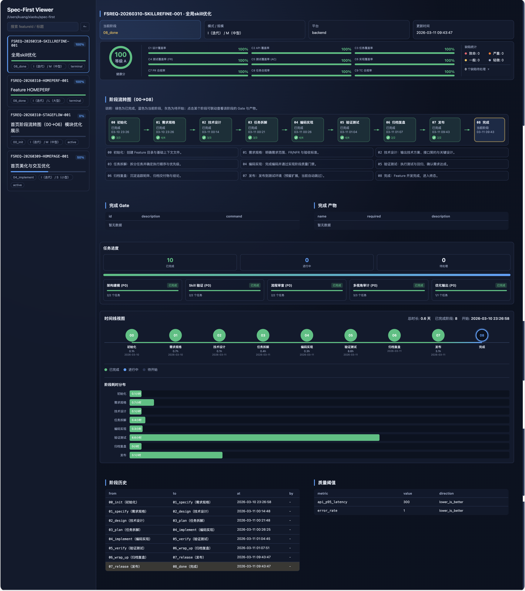

# Spec-First — AI Workflow Engine for Spec-Driven Development

> **Spec-First** is an AI workflow CLI for spec-driven development.
> Features: quality gates · requirements traceability · feature lifecycle · SDLC automation · AI coding orchestration.



> 📚 **完整文档**：[PROJECT-INTRODUCTION.md](PROJECT-INTRODUCTION.md) - 包含生态对比、框架深度解析等详细内容


## 项目定位

Spec-First 是一个面向 AI 协同开发场景的**规范驱动研发流程引擎**。

### 解决的核心痛点

- **上下文丢失**：多轮对话后 AI 忘记之前的需求和设计决策
- **质量失控**：AI 生成代码直接提交，缺少质量门禁和验证
- **追溯困难**：不知道某段代码为什么这么写，需求变更影响范围不清
- **协作混乱**：团队成员使用 AI 的方式不统一，缺少规范约束

### 三层架构

- **Skill 层**：面向 Claude Code / Codex 的高层协同入口，负责引导、编排、确认与文档生成
- **CLI 层**：面向脚本与 Skill 的确定性原子命令，负责状态、追踪、校验、诊断与宿主集成
- **运行时层**：提供阶段状态机、Context Pack、Gate、追踪矩阵、Hook 与 Viewer 支撑

**一句话概括**：Spec-First 让 AI 不只是”写代码”，而是按规范、按阶段、按证据推进交付。

## 适合谁使用

- **个人开发者**：使用 AI 辅助开发，希望保持代码质量和可追溯性
- **技术 Leader**：需要团队统一 AI 协作规范，确保交付质量
- **质量负责人**：需要对 AI 生成代码进行门禁管控和验证
- **开源维护者**：需要规范化的 PR 流程和变更追踪

## 目录

- [项目定位](#项目定位)
- [当前实现快照](#当前实现快照)
- [核心能力](#核心能力)
- [推荐入口](#推荐入口)
- [安装与初始化](#安装与初始化)
- [流程模型](#流程模型)
- [20 个内置 Skills](#20-个内置-skills)
- [28 组 CLI 命令概览](#28-组-cli-命令概览)
- [宿主集成与分发](#宿主集成与分发)
- [可视化面板](#可视化面板)
- [仓库结构](#仓库结构)
- [开发与验证](#开发与验证)
- [文档索引](#文档索引)
- [适合谁使用](#适合谁使用)
- [仓库与许可证](#仓库与许可证)

## 当前实现快照

以下内容以当前仓库为准，而不是历史 README 或方案稿：

| 维度 | 当前状态 |
|---|---|
| 包名 | `spec-first` |
| 当前版本 | `0.5.77` |
| 运行环境 | `Node.js >= 20.0.0` |
| 语言与模块 | TypeScript + ESM |
| 构建工具 | `tsup` |
| 测试工具 | `vitest` |
| 内置 spec-first Skills | **20 个** |
| 顶层 CLI 命令组 | **28 组** |
| 流程模型 | **8+2 阶段状态机** |
| 宿主集成 | Claude Code / Codex / Generic |
| 可视化 | 内置 Stage Viewer |

## 核心能力

- **规范即真理源**：围绕 `specs/<featureId>/` 组织需求、设计、任务、验收和运行态文件。
- **阶段受控推进**：从 `00_init` 到 `08_done` 走显式状态机，终态不可逆。
- **追踪与校验闭环**：ID、矩阵、Gate、覆盖率和分析报告互相补位。
- **AI 协同可恢复**：支持 `catchup`、`context`、`status`、`plan`、`orchestrate` 等会话恢复与编排能力。
- **宿主自动分发**：通过 `update` 将 Skills 同步到用户级目录与宿主命令入口。
- **可视化观察**：内置 Viewer，用于查看当前项目的阶段和状态。

## 推荐入口

Spec-First 有两种入口，推荐优先使用 Skill：

### 1. AI 协同入口（推荐）

在 Claude Code / Codex 中使用 `/spec-first:<skill>`：

- `/spec-first:onboarding`：新手引导
- `/spec-first:first`：项目快速认知
- `/spec-first:init`：初始化 Feature 工作区
- `/spec-first:spec` → `/spec-first:design` → `/spec-first:task` → `/spec-first:code`
- `/spec-first:verify`：阶段验收
- `/spec-first:archive`：归档复盘
- `/spec-first:orchestrate`：自动编排

### 2. CLI 原子入口（高级用户 / Skill 底层）

在终端直接使用 `spec-first ...`：

```bash
spec-first --help
spec-first --version
spec-first doctor
spec-first viewer open --print-url
spec-first update --dry-run
```

### 典型使用场景

**新功能开发流程**：
```bash
# 在 Claude Code 中使用 Skill
/spec-first:init          # 初始化 Feature
/spec-first:spec          # 编写需求规格
/spec-first:design        # 技术设计
/spec-first:task          # 任务拆解
/spec-first:code          # 代码实现
/spec-first:verify        # 阶段验收
```

**日常状态检查**：
```bash
spec-first feature current    # 查看当前 Feature
spec-first stage current      # 查看当前阶段
spec-first metrics report     # 查看覆盖率指标
spec-first gate               # 检查质量门禁
```

**CI/CD 集成**：
```bash
spec-first gate --stage 04_implement  # 质量门禁检查
spec-first golive check <featureId>   # 上线就绪检查
spec-first metrics coverage --threshold 0.8  # 覆盖率校验
```

> 当前用户文档的官方口径也是：**Skill 是推荐入口，CLI 是底层原子能力层**。

## 安装与初始化

### 前置条件

- Node.js >= 20.0.0
- npm 或 pnpm
- Git（用于 Hooks 集成）
- Claude Code 或 Codex（可选，用于 Skill 集成）

### 全局安装

```bash
npm install -g spec-first@latest
spec-first --version
```

### 安装验证

```bash
spec-first --version        # 检查版本
spec-first doctor           # 环境诊断
spec-first update --dry-run # 检查宿主集成
```

如果全局安装后的自动注册没有生效，手动执行：

```bash
spec-first update
```

### 常见问题

- **找不到命令**：检查 npm 全局 bin 目录是否在 PATH 中
- **update 失败**：检查 `~/.spec-first/` 和 `~/.claude/` 目录权限
- **init 失败**：确保当前目录是 Git 仓库（`git init`）

### 在目标项目中初始化 Feature

```bash
cd /path/to/your-project
spec-first init --feat AUTH --mode N --size M --platforms h5,java-backend
```

初始化完成后，推荐在 AI 宿主中继续使用：

```text
/spec-first:spec
/spec-first:design
/spec-first:task
/spec-first:code
/spec-first:verify
```

## 流程模型

### 8+2 阶段状态机

当前实现的阶段枚举如下：

| 阶段 | 含义 | 推荐入口 |
|---|---|---|
| `00_init` | 初始化工作区 | `/spec-first:init` |
| `01_specify` | 需求规格（FR + AC） | `/spec-first:spec` |
| `02_design` | 技术设计（DS + API） | `/spec-first:design` |
| `03_plan` | 任务拆解（TASK） | `/spec-first:task` |
| `04_implement` | 编码实现 | `/spec-first:code` |
| `05_verify` | 阶段验收（TC） | `/spec-first:verify` |
| `06_wrap_up` | 归档复盘 | `/spec-first:archive` |
| `07_release` | 上线检查 | `spec-first golive check` |
| `08_done` | 完成收口（终态） | `spec-first done` |
| `09_cancelled` | 取消终态 | `spec-first stage cancel` |

**设计原则**：
- **顺序推进**：确保质量门禁不被跳过，每个阶段都有明确的交付物和验收标准
- **终态不可逆**：防止已完成项目被误操作，08_done 和 09_cancelled 不可再转换
- **取消通道**：任何阶段都可以取消（→09_cancelled），保证随时止损

### Skill 统一执行模型

当前 Skills 采用统一的 P0-P5 六阶段执行模型（详见 `skills/spec-first/SHARED.md`）：

```text
P0_LOCATE      定位 Feature 并校验阶段合法性
P1_CONTEXT     加载 Context Pack、阶段产物与历史状态
P2_GENERATE    AI 推理生成交付物草稿
P3_CONFIRM     用户确认、修改或拒绝（支持多轮迭代）
P4_WRITE       写入最终交付物并注册追溯 ID
P5_SIDE_EFFECT 同步追踪矩阵、触发 Gate 评估、更新运行态
```

这意味着 Spec-First 不只是”生成文档”，而是把**定位、上下文、生成、确认、写入、副作用**六个环节统一纳入流程治理，确保每个 Skill 执行都是可追溯、可验证、可恢复的。

## 20 个内置 Skills

### 认知与引导

| Skill | 命令 | 作用 |
|---|---|---|
| `onboarding` | `/spec-first:onboarding` | 新手引导 - 交互式场景识别与学习路径推荐 |
| `first` | `/spec-first:first` | 项目快速认知 - quick 模式生成 4-5 份核心文档，deep 模式生成 10-11 份完整文档 |

### 核心阶段 Skills

| Skill | 命令 | 主要职责 |
|---|---|---|
| `init` | `/spec-first:init` | 初始化 Feature 工作区 |
| `catchup` | `/spec-first:catchup` | 恢复当前 Feature 上下文 |
| `spec` | `/spec-first:spec` | 编写需求规格 |
| `design` | `/spec-first:design` | 编写技术设计 |
| `research` | `/spec-first:research` | 补充技术调研 |
| `task` | `/spec-first:task` | 任务拆解与验收标准 |
| `code` | `/spec-first:code` | 按任务执行代码实现 |
| `review` | `/spec-first:review` | 变更范围与实现质量审查 |
| `archive` | `/spec-first:archive` | 归档复盘 |

### 编排与运维

| Skill | 命令 | 主要职责 |
|---|---|---|
| `plan` | `/spec-first:plan` | 生成阶段执行计划 |
| `verify` | `/spec-first:verify` | 阶段验收校验 |
| `orchestrate` | `/spec-first:orchestrate` | 按阶段自动编排执行 |
| `status` | `/spec-first:status` | 输出当前状态概览 |
| `doctor` | `/spec-first:doctor` | 宿主与环境诊断 |
| `sync` | `/spec-first:sync` | 追踪矩阵与状态同步 |
| `feature` | `/spec-first:feature` | Feature 查询与切换 |

### 质量扩展

| Skill | 命令 | 主要职责 |
|---|---|---|
| `spec-review` | `/spec-first:spec-review` | 需求规格质量审查 |
| `analyze` | `/spec-first:analyze` | 跨产物一致性分析 |

完整 Skill 目录见：`skills/spec-first/README.md`

## 28 组 CLI 命令概览

当前顶层 CLI 注册于 `src/cli/index.ts`，共 28 组命令：

### 工作区与流转

- `init` - 初始化 Feature 工作区
- `stage` - 阶段流转管理（current/suggest/advance/cancel）
- `feature` - Feature 列表、切换与查看
- `done` - 将 Feature 从 07_release 收口到 08_done
- `doctor` - 环境诊断与修复

### 追踪、校验与治理

- `id` - 追溯 ID 生成、校验与检索
- `matrix` - 同步追踪矩阵
- `trace` - 追溯链修复与校验
- `validate` - 产物格式校验
- `metrics` - 覆盖率度量与健康评分
- `gate` - 阶段质量门禁评估
- `golive` - 上线就绪检查与批准
- `rfc` - RFC 变更请求与状态管理
- `defect` - 缺陷跟踪与状态管理
- `analyze` - 跨产物一致性分析

### AI 协同与编排

- `ai` - 会话恢复与上下文摘要
- `orchestrate` - 受控编排协调入口（支持 --auto/--resume/--auto-advance）
- `first` - 项目首轮认知 runtime/docs 刷新
- `onboarding` - 新手引导 - 交互式场景识别与学习路径推荐
- `skill` - 动态渲染 skill 内容

### 提交与宿主集成

- `commit` - 规范提交并关联追溯 ID
- `hooks` - Git Hooks 安装与状态管理
- `viewer` - Stage Viewer 可视化面板
- `update` - 升级后刷新 Skill/MCP/Hooks
- `setup` - 注册 Claude Code + Codex Skill 命令（兼容入口，已废弃）
- `uninstall` - 清理宿主配置（卸载前执行）

### 开发与测试

- `batch-test` - 批量执行测试（临时命令）

完整参数与子命令请查看：`docs/07-用户文档/CLI命令参考手册.md`

## 宿主集成与分发

`spec-first update` 会围绕宿主完成刷新与补齐，当前实现关注这些目标：

- 同步 `skills/spec-first/*` 到用户级固定目录：`~/.spec-first/skills/spec-first/`
- 刷新 Claude Code 命令入口：`~/.claude/commands/spec-first/`
- 刷新 Codex Skills 目录：`~/.codex/skills/spec-first/`
- 刷新项目级 `.claude/settings.json`、Git hooks、Viewer/Session 相关配置

常用命令：

```bash
spec-first update --dry-run
spec-first update
spec-first hooks status
spec-first viewer url
```

## 可视化面板

仓库内置 Stage Viewer，对应脚本位于 `scripts/stage-viewer/`。

常用命令：

```bash
spec-first viewer start
spec-first viewer open --print-url
spec-first viewer url
```

如果你只想拿到当前项目的面板地址，`viewer url` 是最直接的方式。

## 仓库结构

```text
.
├── src/
│   ├── cli/                 # CLI 入口、路由与命令处理器
│   ├── core/                # 流程引擎、Gate、Skill 运行时、AI 编排、度量等核心能力
│   └── shared/              # 共享类型、文件系统工具、宿主路径与 Skill 分发逻辑
├── skills/spec-first/       # 20 个内置 Skills + 共享约束
├── templates/               # 初始化、矩阵、度量、发布等模板
├── scripts/                 # Viewer、发布、安装、冒烟脚本
├── docs/07-用户文档/        # 面向用户的安装、快速开始、使用手册、命令参考
├── docs/02-技术方案/V2/     # 当前技术方案索引
├── tests/                   # unit / integration / e2e / benchmark
├── packages/vscode-spec-first/ # VS Code 扩展包
└── PROJECT-INTRODUCTION.md  # 完整项目介绍
```

## 开发与验证

### 本地开发

```bash
npm install
npm run build
npm run typecheck
npm test
npm run lint
```

### 可视化与冒烟

```bash
npm run viewer:start
bash scripts/smoke-test.sh
```

### 发布前建议

```bash
npm run build
npm run typecheck
npm test
npm run lint
```

## 文档索引

### 用户文档

- `docs/07-用户文档/快速开始.md`
- `docs/07-用户文档/安装与更新.md`
- `docs/07-用户文档/使用手册.md`
- `docs/07-用户文档/CLI命令参考手册.md`
- `docs/07-用户文档/Skill命令参考手册.md`
- `docs/07-用户文档/Profile配置说明.md`
- `docs/07-用户文档/npm-发布指引.md`

### Skill 文档

- `skills/spec-first/README.md`
- `skills/spec-first/AGENTS.md`
- `skills/spec-first/SHARED.md`

### 技术方案

- `docs/02-技术方案/V2/README.md`

### 代码审查与架构优化

- `docs/review-bundles/2026-03-10-spec-review/00-最佳修复方案-健壮版.md` - **ID 链路最佳修复方案（健壮版）** - 数据完整性 vs 业务完整性，系统级保证
- `docs/review-bundles/2026-03-10-spec-review/00-最佳修复方案-终稿.md` - ID 链路修复方案（领域分层、职责单一）
- `docs/review-bundles/2026-03-10-spec-review/ID链路问题深度汇总.md` - 14 个问题详细分析
- `docs/review-bundles/2026-03-10-spec-review/ID链路全流程全景图.md` - 7 节点数据流图
- `docs/review-bundles/2026-03-10-spec-review/修复方案-分层校验策略.md` - 长期治理方案参考

## 仓库与许可证

- [GitHub](https://github.com/sunrain520/spec-first)
- [Gitee](https://gitee.com/sunnyrain/spec-first)
- License：MIT

## 结语

如果你要把 Spec-First 当作一个稳定工具来用，建议按下面的顺序理解它：

1. 先看 `docs/07-用户文档/快速开始.md`
2. 再看 `docs/07-用户文档/安装与更新.md`
3. 然后用 `skills/spec-first/README.md` 理解 Skill 目录
4. 最后用 `docs/07-用户文档/CLI命令参考手册.md` 查底层命令

这样你看到的是**当前实现版的 Spec-First**，而不是历史方案稿里的理想态描述。
