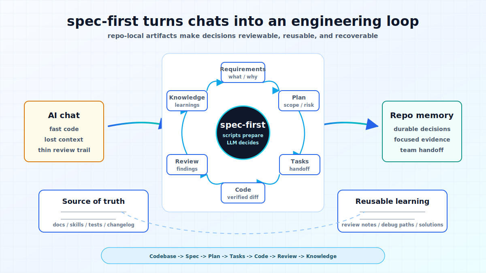

# spec-first

[](https://www.npmjs.com/package/spec-first)
[](./LICENSE)
[](./package.json)
[](https://github.com/sunrain520/spec-first/actions/workflows/npm-install-matrix.yml)
[](http://spec-first.cn/)

[English](./README.md) | [简体中文](./README.zh-CN.md)

Spec-driven AI engineering workflows for Claude Code and Codex.

`spec-first` turns AI coding sessions into a repeatable engineering loop: brainstorm requirements, write plans, compile task packs, execute work, review code, debug failures, and compound learnings.

It keeps deterministic setup in scripts while leaving product judgment, implementation tradeoffs, and review decisions to the LLM.

Official site: [spec-first.cn](http://spec-first.cn/)

## See It In 90 Seconds



```text
Loose idea
  -> $spec-brainstorm or /spec:brainstorm
  -> docs/brainstorms/YYYY-MM-DD-NNN-topic-requirements.md
  -> $spec-plan or /spec:plan
  -> docs/plans/YYYY-MM-DD-NNN-topic-plan.md
  -> $spec-work or /spec:work
  -> code, tests, and verification notes
  -> $spec-code-review or /spec:code-review
  -> structured findings and residual risks
```

The point is not another prompt snippet. The point is a durable project-local workflow where each AI session leaves useful engineering context for the next one.

## A Tiny Example

Input inside your current host session:

```text
$spec-brainstorm "Improve onboarding for first-time CLI users"
```

Claude Code users can run `/spec:brainstorm "Improve onboarding for first-time CLI users"` instead.

A complete workflow chain can leave artifacts like:

```text
docs/brainstorms/2026-05-01-001-cli-onboarding-requirements.md
docs/plans/2026-05-01-001-feat-cli-onboarding-plan.md
docs/tasks/2026-05-01-001-feat-cli-onboarding-tasks.md
```

The first brainstorm run usually creates only the requirements brief. The plan, task-pack, work, review, debug, and compound entries add their own artifacts when you choose to continue the chain.

For the detailed walkthrough, see [Chinese First Workflow Walkthrough](./docs/05-用户手册/09-首次工作流走查.md).

## Why spec-first?

AI coding breaks down when important decisions live only inside a chat window: the next session misses context, reviewers cannot see why a plan changed, and teams cannot reuse what worked.

`spec-first` gives that work a lightweight shape:

- Requirements become durable briefs instead of disappearing prompts.
- Plans and task packs turn vague intent into reviewable execution context.
- Work, review, debug, and compound workflows preserve evidence and learning.
- Scripts prepare facts and runtime assets; the LLM decides scope, tradeoffs, implementation strategy, and review evidence.
- One source asset set supports Claude Code `/spec:*` entries and Codex `$spec-*` entries without hand-maintaining generated runtime copies.

## Quickstart

Prerequisites:

- Node.js `>=20.0.0` and npm.
- Claude Code or Codex installed, with one chosen as the current host.
- A terminal opened at the root of the project repo where you want to enable `spec-first`. First-time users can try a throwaway/test repo before initializing a real project.

Terminal commands:

```bash
npm install -g spec-first
spec-first doctor
```

Initialize only the host you actually use:

```bash
# Claude Code project
spec-first init --claude -u <name> --lang en

# Codex project
spec-first init --codex -u <name> --lang en
```

Run the init command for each host you actually use. For example, run only `--claude` for Claude Code-only projects, only `--codex` for Codex-only projects, or both when the same repo should support both hosts.

Restart the host or open a new session so it loads the generated runtime assets.

Host-session workflow entries are not shell commands:

```text
# In a Claude Code session
/spec:brainstorm "Improve onboarding"

# In a Codex session
$spec-brainstorm "Improve onboarding"
```

### You are done when

The first brainstorm run produces a requirements brief such as:

```text
docs/brainstorms/YYYY-MM-DD-NNN-topic-requirements.md
```

From there, continue to the current host's plan entrypoint.

## What You Get

```text
docs/
  brainstorms/   requirements briefs from early problem framing
  plans/         implementation plans ready for review and execution
  tasks/         derived task packs when a plan needs structured handoff
  solutions/     reusable learnings captured after solving problems
```

In repo-relative form, those directories are `docs/brainstorms/`, `docs/plans/`, `docs/tasks/`, and `docs/solutions/`.

You also get structured review findings, debug evidence, and verification notes from the relevant workflows. Not every workflow writes every artifact; each entrypoint writes only the artifact that fits its role.

For who creates, reads, and should edit each artifact, see [Chinese Artifact Catalog](./docs/05-用户手册/10-产物目录.md).

## How It Works

```text
Source assets
  skills/  agents/  templates/  src/cli/
        |
        | spec-first init --claude or --codex
        v
Host runtime assets
  Claude Code: /spec:* commands
  Codex:      $spec-* skills
        |
        v
Workflow artifacts
  brainstorms -> plans -> tasks -> work/review/debug -> learnings
```

Source-of-truth assets live in the repository. Generated runtime copies under `.claude/`, `.codex/`, and `.agents/skills/` are disposable and can be rebuilt with `spec-first init`.

## Choose Your Path

| If you have... | Start here | Expected result |
|---|---|---|
| A rough idea or product problem | `/spec:brainstorm` or `$spec-brainstorm` | Requirements brief under `docs/brainstorms/` |
| A settled goal but no implementation strategy | `/spec:plan` or `$spec-plan` | Plan under `docs/plans/` |
| A plan or task pack ready to execute | `/spec:work` or `$spec-work` | Code changes, tests, and verification notes |
| A failing test, bug, or confusing error | `/spec:debug` or `$spec-debug` | Root cause, fix, and verification evidence |
| A diff that needs confidence before merge | `/spec:code-review` or `$spec-code-review` | Structured findings and residual risks |

## Core Workflows

| I want to... | Claude Code | Codex | Expected result |
|---|---|---|---|
| Explore an idea | `/spec:brainstorm` | `$spec-brainstorm` | Requirements brief under `docs/brainstorms/` |
| Plan implementation | `/spec:plan` | `$spec-plan` | Plan under `docs/plans/` |
| Execute work | `/spec:work` | `$spec-work` | Code, tests, and verification notes |
| Review code | `/spec:code-review` | `$spec-code-review` | Structured findings and residual risks |
| Debug a failure | `/spec:debug` | `$spec-debug` | Root cause, fix, and verification |

## Trust Model

`spec-first` does not ask the LLM to simulate deterministic tooling, and it does not replace LLM judgment with a rigid state machine.

The operating rule is simple: Scripts prepare, LLM decides.

- **What scripts do:** install, validate, generate, clean, hash, and report machine facts.
- **What the LLM decides:** requirements framing, scope boundaries, tradeoffs, implementation judgment, review evidence, and next steps.
- **What gets written:** repo-local docs, plans, task packs, review/debug artifacts, and managed runtime assets during init.
- **What is generated:** `.claude/`, `.codex/`, and `.agents/skills/` runtime copies. Do not hand-edit them as source truth.
- **What spec-first does not do:** it is not a generic agent marketplace, not a single prompt pack, and not a standalone app that works without Claude Code or Codex.

Use `spec-first clean --claude` or `spec-first clean --codex` to remove managed runtime assets.

## Use spec-first when

- You already use Claude Code or Codex and want project-local workflows instead of one-off prompts.
- You want AI coding work to leave durable requirements, plans, review findings, and learnings.
- You want scripts to handle deterministic setup while keeping semantic judgment with the LLM.
- You want a lightweight workflow layer that can be regenerated from source assets.

May not fit when you only need a single prompt snippet, a generic agent marketplace, a no-host standalone app, or a team process that does not want workflow artifacts written into the repo.

## Documentation

Official site and language entrypoints:

- [spec-first.cn](http://spec-first.cn/)
- [English README](./README.md)
- [简体中文 README](./README.zh-CN.md)

Learn the model:

- [Chinese User Manual](./docs/05-用户手册/README.md)
- [Chinese Core Concepts](./docs/05-用户手册/02-核心概念.md)
- [Chinese Architecture Overview](./docs/02-架构设计/01-整体架构.md)

Use workflows:

- [Chinese Quickstart](./docs/05-用户手册/01-快速开始.md)
- [Chinese First Workflow Walkthrough](./docs/05-用户手册/09-首次工作流走查.md)
- [Chinese Complete Example](./docs/05-用户手册/03-完整示例.md)
- [Chinese Artifact Catalog](./docs/05-用户手册/10-产物目录.md)
- [Chinese Workflows and Artifacts Map](./docs/05-用户手册/04-workflows-artifacts-map.md)

Develop and contribute:

- [Contributing Guide](./CONTRIBUTING.md)
- [Security Policy](./SECURITY.md)
- [License](./LICENSE)
- [Chinese Development Guide](./docs/03-实施方案/06-开发规范.md)
- [Chinese Testing Plan](./docs/03-实施方案/04-测试方案.md)

Release history:

- [Chinese Release Notes](./docs/08-版本更新/README.md)

Detailed manuals and implementation docs are currently Chinese-first.

## Full Workflow Reference

| Intent | Claude Code | Codex |
|---|---|---|
| Setup required harness runtime | `/spec:mcp-setup` | `$spec-mcp-setup` |
| Compile graph readiness facts | `/spec:graph-bootstrap` | `$spec-graph-bootstrap` |
| Update spec-first or runtime assets | `/spec:update` | `$spec-update` |
| Search agent session history | `/spec:sessions` | `$spec-sessions` |
| Research Slack context | `/spec:slack-research` | `$spec-slack-research` |
| Audit source skills | `/spec:skill-audit` | `$spec-skill-audit` |
| Generate and evaluate ideas | `/spec:ideate` | `$spec-ideate` |
| Brainstorm requirements | `/spec:brainstorm` | `$spec-brainstorm` |
| Review docs/plans | `/spec:doc-review` | `$spec-doc-review` |
| Write or deepen a plan | `/spec:plan` | `$spec-plan` |
| Compile task pack | use installed standalone `write-tasks` skill | use installed standalone `write-tasks` skill |
| Audit App consistency | `/spec:app-consistency-audit` | `$spec-app-consistency-audit` |
| Debug a failure or bug | `/spec:debug` | `$spec-debug` |
| Execute work | `/spec:work` | `$spec-work` |
| Execute work with Codex delegation beta | `/spec:work-beta` | `$spec-work-beta` |
| Optimize a measurable outcome | `/spec:optimize` | `$spec-optimize` |
| Polish browser-visible UI beta | `/spec:polish-beta` | `$spec-polish-beta` |
| Review code | `/spec:code-review` | `$spec-code-review` |
| Capture learning | `/spec:compound` | `$spec-compound` |
| Refresh stale learnings | `/spec:compound-refresh` | `$spec-compound-refresh` |
| Read release notes | `/spec:release-notes` | `$spec-release-notes` |

Startup version reminders, when surfaced by the managed Claude hook or Codex top-level workflow-entry guidance, only point to the update entrypoints above. They do not install packages, refresh runtime assets, or restart the host.

## Runtime Reference

`spec-first` provides CLI helpers (`doctor`, `init`, `clean`, `tasks`, version/help output), workflow source assets, host-filtered runtime generation, and public workflow entrypoints for ideation, brainstorming, planning, task-pack handoff, work execution, App consistency audit, debugging, review, setup, update, session research, Slack research, release notes, skill audit, compounding, optimization, and browser-visible polish.

Required harness runtime setup through the current host's setup workflow covers MCP servers, graph-provider MCP servers, helper CLIs, and project setup facts.

External graph readiness compilation through the current host's graph bootstrap workflow produces canonical graph and impact readiness artifacts for downstream workflows.

Current context and graph readiness use this path:

- Use the current host's setup workflow to install and verify the required harness runtime: Serena, Sequential Thinking, Context7, GitNexus, code-review-graph, `agent-browser`, `gh`, `jq`, `vhs`, `silicon`, `ffmpeg`, `ast-grep`, and the global `ast-grep` skill.
- Use the current host's graph bootstrap workflow after setup reports `baseline_ready=true`. It reads setup-owned config facts, validates provider command arrays, runs transient GitNexus/code-review-graph probes, and writes `.spec-first/graph/*`, `.spec-first/providers/*`, and `.spec-first/impact/*` readiness artifacts.
- Use the current host's plan workflow as the first graph-readiness consumer. It reports graph status, checks staleness, and falls back to bounded direct repo reads when facts are unavailable, blocked, stale, or degraded.
- In a parent workspace with multiple child Git repos, pass an explicit `--repo <child>` to setup/bootstrap scripts. The parent workspace only reports candidate repos and never owns repo-local `.spec-first/config/*`, `.spec-first/graph/*`, `.spec-first/impact/*`, or `.serena/*` artifacts.
- Use the installed standalone `write-tasks` skill for deterministic task-pack handoff, then the current host's work, code-review, and doc-review workflows with the current request, plans/task packs, diffs, targeted file reads, and tests as scope authority.

CLI reference:

```bash
spec-first --help
spec-first --version
spec-first doctor [--json] [--claude|--codex]
spec-first init (--claude|--codex) [-u <name>] [--lang zh|en] [--dry-run]
spec-first clean (--claude|--codex) [--dry-run]
spec-first tasks hash <plan-path> [--json]
spec-first tasks validate <task-pack-path> [--json] [--repo=<path>|--repo <path>]
```

Runtime asset summary:

| Layer | Current Contract |
|---|---|
| **Capability layer** | Bundled source assets ship with `41` skills, `51` agents and no agent support files. Runtime delivery is host-filtered by governance: the current bundle installs `20` commands + `2` standalone skills + `2` agent-facing internal skills on Claude, and `20` workflow skills + `2` standalone skills + `2` agent-facing internal skills on Codex, with `51` agents on both hosts |
| **Claude runtime** | Commands are generated under `.claude/commands/spec`, standalone and agent-facing internal skills under `.claude/skills`, command-backed workflow skill copies under `.claude/spec-first/workflows`, agents under `.claude/agents`, and managed state under `.claude/spec-first/state.json`. |
| **Codex runtime** | Workflow, standalone, and agent-facing internal skills are generated under `.agents/skills`, agents under `.codex/agents`, and managed state under `.codex/spec-first/state.json`. |
| **Readiness** | The setup workflow writes readiness ledger v2 plus setup-owned `graph-providers.json`, `runtime-capabilities.json`, and `provider-artifacts.json`; the graph bootstrap workflow consumes those facts and writes canonical graph facts, provider status, impact capabilities, and a report. |

Expected Claude init output includes:

```text
📦 Generated 20 command file(s) in .claude/commands/spec
🧩 Generated 4 skill directory(ies) in .claude/skills
🤖 Generated 51 agent file(s) in .claude/agents
Next steps:
  1. Restart Claude Code or open a new session so the host loads the generated /spec:* commands.
  2. In the new session, run /spec:mcp-setup to install and verify the required MCP/helper runtime.
  3. If /spec:mcp-setup shows graph bootstrap is still pending, run /spec:graph-bootstrap when prompted.
```

Expected Codex init output includes:

```text
🧩 Generated 24 skill directory(ies) in .agents/skills
🤖 Generated 51 agent file(s) in .codex/agents
Next steps:
  1. Restart Codex or open a new session so the host loads the generated $spec-* skills.
  2. In the new session, run $spec-mcp-setup to install and verify the required MCP/helper runtime.
  3. If $spec-mcp-setup shows graph bootstrap is still pending, run $spec-graph-bootstrap when prompted.
```

## Development & Contributing

```bash
npm run typecheck
npm run test:mcp-setup
npm run test:graph-bootstrap
npm run test:unit
npm run test:smoke
npm run test:integration
npm run test:ai-dev:gate
npm run test:release
npm run build
npm test
```

`npm run build` runs `npm pack --dry-run` and verifies the package payload shape through npm.

When changing source assets, edit `skills/`, `agents/`, `templates/`, or `src/cli/`, then regenerate runtime copies with `spec-first init --claude` or `spec-first init --codex` in a fresh host session.

For contribution and support details, see [CONTRIBUTING.md](./CONTRIBUTING.md), [SECURITY.md](./SECURITY.md), [LICENSE](./LICENSE), and [GitHub Issues](https://github.com/sunrain520/spec-first/issues).
