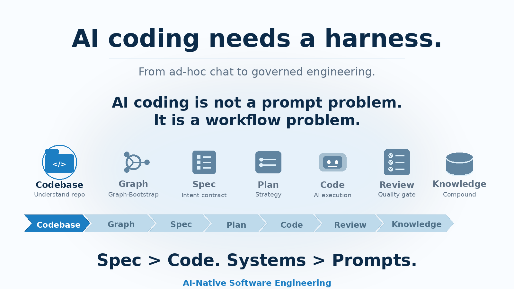

[English](./README.md) | [简体中文](./README.zh-CN.md)

<div align="center">



<h1>Spec-First</h1>

<p><strong>一个在 AI 编码交付循环的每个阶段，为 LLM 提供结构化、带来源依据的上下文输入，并治理从 ideation 到 compound learning 全链路的 workflow CLI。</strong></p>

<p>面向 <strong>Claude Code</strong> 与 <strong>Codex</strong> 的开源方案。安装一次，治理整条交付闭环。</p>

<p>
  <a href="#快速开始"><strong>快速开始</strong></a>
  <span>&nbsp;•&nbsp;</span>
  <a href="#核心工作流"><strong>工作流</strong></a>
  <span>&nbsp;•&nbsp;</span>
  <a href="#cli-命令"><strong>CLI</strong></a>
  <span>&nbsp;•&nbsp;</span>
  <a href="#支持语言"><strong>语言</strong></a>
  <span>&nbsp;•&nbsp;</span>
  <a href="./docs/05-用户手册/README.md"><strong>用户手册 (zh)</strong></a>
  <span>&nbsp;•&nbsp;</span>
  <a href="https://www.npmjs.com/package/spec-first"><strong>npm</strong></a>
</p>

<p>
  <a href="https://www.npmjs.com/package/spec-first"></a>
  <a href="https://npmtrends.com/spec-first"></a>
  <a href="./LICENSE"></a>
  <a href="https://github.com/sunrain520/spec-first/stargazers"></a>
  <a href="https://github.com/sunrain520/spec-first/issues"></a>
  <a href="https://github.com/sunrain520/spec-first/pulls"></a>
</p>

<p>
  <sub>
    <a href="https://deepwiki.com/sunrain520/spec-first"></a>
    &nbsp;
    <a href="https://chatgpt.com/?q=Explain+the+project+sunrain520/spec-first+on+GitHub"></a>
  </sub>
</p>

</div>

## 为什么是 Spec-First

多数 AI 编码失败，并不是因为模型太弱，而是因为 LLM 拿到的决策输入已经退化：

| 问题 | spec-first 怎么处理 | 约束方式 |
|------|---------------------|----------|
| LLM 从空白代码库上下文开始推断 | `graph-bootstrap` 提取 AST facts，并编译带 `provenance` 与 `confidence` 信号的 `minimal-context` | 宿主就绪 gate + runtime workflow contract |
| 需求从未被显式化 | Brainstorm 阶段产出 requirements artifact，供 Plan 阶段消费 | `SKILL.md` contract |
| 计划与实现逐渐漂移 | Plan artifact 是 Work 阶段的一等输入；Review Stage 2b 会把 **Requirements Trace** 与 diff 对照检查 | `SKILL.md` contract |
| 评审缺少结构 | 使用 **17 个 reviewer persona**（always-on + cross-cutting + stack-specific）外加 2 个 CE 专用 agent，并按 `safe_auto / gated_auto / manual / advisory` 路由 | `SKILL.md` contract |
| 已解决问题无法复用 | Compound 把结构化 learnings 写入 `docs/solutions/`，并带 YAML frontmatter 供后续检索 | `SKILL.md` contract |

**适合：**

- 想从 prompt-driven coding 升级到受治理 AI engineering workflow 的团队
- 同时使用 Claude Code 与 Codex，希望跨宿主复用同一套交付体系的开发者
- 需要显式 spec、结构化 review、以及可复用 post-task learnings 的项目

**不适合：**

- 没有使用 Claude Code 或 Codex 的团队
- 期待零配置、全自动代码生成的场景
- 交付链路过短，不值得承担多阶段 workflow 开销的团队

## 设计哲学

> **轻 contract · 明确边界 · 让 LLM 决策。**

Spec-First 基于一个核心判断：AI 编码质量受限于 LLM 决策输入的质量，而不是 orchestration 的重量。仓库治理（见 `CLAUDE.md` / `AGENTS.md`）明确禁止：

- 用多状态迁移去替代 LLM 判断的硬编码状态机
- 把互不相关的信号硬塞进一个 orchestration object 的过度设计 gate
- 通过增加耦合来扩张 contract，而不是通过提高清晰度来扩张

同时明确偏好：

- 把 `provenance`、`freshness`、`confidence`、`fallback_reason`、`verification_gaps` 作为独立、可组合的输入事实暴露出来
- 先提升输入质量，只有在证据充分时才增加自动化
- 保持 control-plane 的边界清晰：repo profile、diff recommendation、verifier dispatch、gate state、workflow prose、telemetry 各自只回答一个问题，不越界替别人回答

这个 README 的其余设计，都是这套立场的结果。

## 工作原理

Spec-First 改善的是 **LLM 拿到的决策输入**，而不是用状态机替代 LLM 的判断。

### 两个互补部分

**graph-bootstrap：系统地基**

```text
代码库 → AST 图谱 → facts 提取 → minimal-context（provenance + confidence）
      → injection-index（按阶段路由）→ workflow 输入
```

`graph-bootstrap` 会在 AI 开始编码之前，把代码库转换成结构化上下文。它通常每个项目运行一次，或者在代码变化后增量刷新，然后被后续所有 workflow 阶段复用。

**主工作流：交付闭环**

```text
Ideate → Brainstorm → Plan → Work → Review → Compound
```

它解决的是“一个需求如何被 AI 工程化地端到端交付”。每个阶段都有显式的输入产物、输出产物和 stage-gate contract。

### 我应该运行哪个 bootstrap？

| 入口 | 适用场景 | 产物 | 稳定性 |
|------|----------|------|--------|
| `/spec:graph-bootstrap` · `$spec-graph-bootstrap` | 你需要 fact-extracted、graph-informed 的上下文（Phase 0–4） | Phase 0–4 facts + `injection-index.yaml` + `minimal-context/*.json` | **当前主要 Stage-0 入口** |
| `/spec:compound` · `$spec-compound` | 你需要更偏知识捕获与复合上下文整理 | 上下文综合文档与可复用知识资产 | **补充型 Stage-0 路径** |

这些入口是 `spec-first init` 安装出来的宿主 workflow entrypoint，不是根级 `spec-first` CLI 子命令。

Stage-0 入口启动时都会执行 **Host Readiness Gate**。如果跳过了 MCP setup 或宿主没有重启，它们会直接停止并给出明确提示，而不是静默降级。
如果你仍看到旧版 bootstrap 入口，请迁移到 `/spec:graph-bootstrap` 或 `/spec:compound`。

### Stage-0 上下文质量信号

每个 context artifact 都带有机器可读的质量元数据。下游 `SKILL.md` contract 会读取这些信号并自适应：

| 字段 | 取值 | 含义 |
|------|------|------|
| `data_quality` | `fact-backed` · `partial` · `empty` · （缺失 = legacy manifest，按向后兼容处理） | 这份上下文有多少来自真实代码分析 |
| `provenance` | `fact-inventory` · `empty-fallback` | 内容是从提取出的事实编译而来，还是来自骨架兜底 |
| `confidence` | `high` · `medium` · `low` | 供 LLM 消费的可信度信号 |
| `fallback_reason` | `empty_fact_inventory`（根因）· `minimal_context_missing`（次因）· `workspace_child_partial_degraded` · （其他运行时特定取值） | 当上下文不是 fact-backed 时，显式说明退化原因 |

当 `data_quality: empty` 时，evaluator 会降到 **L1** 并设置 `fallback_reason`。这意味着 LLM 会收到明确提示：当前上下文只是骨架，不是真实分析结果。

#### Evaluator 分级

> **L0**：fact-backed 上下文，包含真实 AST 导出的信号，是完整强度的 Stage-0 输入。  
> **L1**：骨架化或退化上下文，evaluator 已设置 `fallback_reason`，下游 SKILL 应把这些信号视为 advisory。  
> **L2**：固定 minimal fallback，仅在 `injection-index.yaml` 无法解析时使用环境默认值（例如 `00-summary.md`、`pitfalls/index.md`）。

下游 skill 在 **任何 level 都允许继续执行**。evaluator 暴露 level 的目的是让 LLM 自行调整信心，而不是阻断执行。

### 约束模型

| 层级 | 覆盖内容 | 类型 |
|------|----------|------|
| CLI（`doctor` / `init` / `clean` / `stage0-context`） | 资产同步、状态追踪、manifest 校验、Stage-0 context 输出 | **Code-hard**，由 shell exit code 强制 |
| Host Readiness Gate + Stage-0 evaluator L0/L1/L2 | 在 `graph-bootstrap` / `stage0-context` 运行时生效，并输出 `fallback_reason` 与降级 level | **Runtime signal**，由代码发出，供 LLM 消费 |
| Workflow stages（`SKILL.md`） | 阶段 contract、artifact 命名、review 类别、requirements trace | **SKILL contract**，由 LLM 遵循 |
| Context signals（`provenance` / `confidence` / `fallback_reason`） | 嵌在 artifact 中的元数据 | **SKILL contract**，由 LLM 消费 |

## 支持语言

由 15 个 vendored / pinned 的 `tree-sitter` parser 提供支持。默认全部安装，不需要手动 opt-in。

| 语言 | Parser | 说明 |
|------|--------|------|
| C | `tree-sitter-c` | |
| C++ | `tree-sitter-cpp` | |
| C# | `tree-sitter-c-sharp` | |
| Go | `tree-sitter-go` | |
| Java | `tree-sitter-java` | |
| JavaScript | `tree-sitter-javascript` | CommonJS `require()` 会解析成 `imports_from` edges |
| Kotlin | `tree-sitter-kotlin` | |
| Objective-C | `tree-sitter-objc`（vendored fork） | `.m` / `.mm` / 启发式 `.h` 路由；提取 `@interface/@implementation/@protocol` |
| PHP | `tree-sitter-php` | |
| Python | `tree-sitter-python` | |
| Ruby | `tree-sitter-ruby` | |
| Rust | `tree-sitter-rust` | |
| Scala | `tree-sitter-scala` | |
| Swift | `tree-sitter-swift`（vendored fork） | 移除了上游 `tree-sitter-cli` 的 install-time 依赖 |
| TypeScript | `tree-sitter-typescript` | 覆盖 `.ts` / `.tsx` / `.d.ts` |

iOS 仓库会自动检测（`Podfile.lock` / `.xcodeproj`），并自动应用 Pod exclude path。

## 你会得到什么

| 能力 | 解决的问题 |
|------|------------|
| **CLI 控制面**（`doctor` / `init` / `clean` / `stage0-context`） | 提供可重复安装、健康检查、清理和 Stage-0 context 输出；所有受管资产都有可追踪来源 |
| **CRG 图引擎**（`spec-first crg *`） | **Code Review Graph**：一个嵌入式 Node.js runtime，基于 SQLite + FTS5，支持 AST → symbols → resolved edges → PageRank flows → community detection → surprising-connections → god-nodes → review-context |
| **graph-bootstrap 上下文引擎** | 让 LLM 获得 fact-extracted、带 confidence 标注的项目上下文，而不是直接面对裸代码库 |
| **完整工作流层** | Ideate → Brainstorm → Plan → Work → Review → Compound，全阶段都有显式 artifact contract |
| **17-persona Review stage**（+ 2 个 CE agent） | 产出结构化 findings，并按 `safe_auto / gated_auto / manual / advisory` 路由，而不是一次性 review 扫描 |
| **Compound / knowledge capture** | 把已解决问题写入 `docs/solutions/`，供后续 workflow 检索复用 |
| **双平台支持** | 一套方法论同时覆盖 Claude Code（`/spec:*`）与 Codex（`$spec-*`）。Claude 使用 `SessionStart` hook + bare-agent rewrite；Codex 使用 `.agents/skills/` discovery + 显式 `.codex/agents/...` path rewrite |
| **能力层资产** | 仓库内置源码资产共 `46` 个 skills、`55` 个 agents、`4` 个 agent support files。运行时交付会按双宿主治理过滤：当前版本在 Claude 侧安装 `11` 个 commands + `35` 个 skills，在 Codex 侧安装 `34` 个 skills；两侧都会安装 `55` 个 agents + `4` 个 support files |
| **运行时治理** | 受管资产记录在 `state.json` 中，可安全同步、刷新、恢复与清理 |

## 核心工作流

<p align="center">
  
</p>

### 主要阶段

| 阶段 | Claude Code | Codex | 输出产物 | 约束方式 |
|------|-------------|-------|----------|----------|
| 宿主准备 | `/spec:mcp-setup` → restart | `$spec-mcp-setup` → restart | 宿主专属 readiness ledger：`~/.claude/spec-first/host-setup.json` 或 `~/.codex/spec-first/host-setup.json` | **Code-hard**（bootstrap gate 会检查它） |
| Stage-0 图引导 | `/spec:graph-bootstrap` | `$spec-graph-bootstrap` | Phase 0–4 facts + `injection-index.yaml` + `minimal-context/*.json` | 宿主就绪 gate + runtime workflow contract |
| Ideate | `/spec:ideate` | `$spec-ideate` | `docs/ideation/*.md` | **SKILL.md** contract |
| Brainstorm | `/spec:brainstorm` | `$spec-brainstorm` | `docs/brainstorms/*.md` | **SKILL.md** contract |
| Plan | `/spec:plan` | `$spec-plan` | `docs/plans/*.md` | **SKILL.md** contract |
| Work | `/spec:work` | `$spec-work` | code + tests | **SKILL.md** contract |
| Review | `/spec:review` | `$spec-review` | 结构化 review report | **SKILL.md** contract（17 个 reviewer persona + 2 个 CE agent） |
| Compound | `/spec:compound` | `$spec-compound` | `docs/solutions/**/*.md` | **SKILL.md** contract |

### 辅助阶段

| 阶段 | Claude Code | Codex | 用途 |
|------|-------------|-------|------|
| Debug | `/spec:debug` | `$spec-debug` | 复现并诊断已有 bug 或 failure |
| Update | `/spec:update` | `$spec-update` | 在 `spec-first` 升级后刷新运行时资产 |
| Sessions | `/spec:sessions` | `$spec-sessions` | 搜索并总结过往 coding agent session |

这些 `/spec:*` 与 `$spec-*` 是生成出来的运行时 workflow 入口，不是根级 `spec-first` CLI 子命令。根 CLI 命令面见下方 [CLI 命令](#cli-命令)。

## 快速开始

### 前置条件

- Node.js `>=20`
- **Git 仓库**：`spec-first init` 会读取 `git config user.name`，`graph-bootstrap` 依赖 `git ls-files`，因此不支持非 Git 目录
- 至少安装 **Claude Code** 或 **Codex** 之一
- 磁盘空间：大约需要 60–120 MB 的 `node_modules`（15 个 tree-sitter parser 加上 `better-sqlite3` 的原生构建）

### 1. 安装

```bash
npm install -g spec-first
spec-first -v
```

> **`postinstall` 说明：** 安装器会执行 `bin/postinstall.js`，打印安装确认卡片，然后裁剪掉除当前平台之外的原生 `tree-sitter` 预编译产物。这个步骤只会删除安装目录中 `node_modules/` 里的文件，不会碰你的项目文件。

### 2. 检查环境

```bash
spec-first doctor
spec-first doctor --claude   # 只检查 Claude
spec-first doctor --codex    # 只检查 Codex
```

如果 `doctor` 报告 `legacy managed state`，请重新运行 `init`。这是唯一受支持的升级路径，它会先执行一次受管 hard reset，再重建运行时。
`doctor --json` 还会把 workflow verification evidence 作为结构化事实暴露出来：schema 有效性、freshness、`fallback_reason`，以及 `evidence_age_summary`（`oldest_*` / `newest_*` + `max_age_ms`），避免下游 workflow 自己猜证据是否过期。

### 3. 初始化项目

```bash
spec-first init --claude
# 或
spec-first init --codex
```

如果想显式设置开发者身份：

```bash
spec-first init --claude -u <name> --lang <zh|en>
spec-first init --codex -u <name> --lang <zh|en>
```

**身份解析顺序：**

1. `-u` flag 值（如果传了）
2. `~/.spec-first/.developer`（全局身份）
3. `git config user.name` 兜底

**语言解析顺序：**

1. `--lang` flag 值（如果传了）
2. 项目里已有的 `.developer` profile
3. 默认 `zh`

#### `init` 会写入什么

`init` **不是**只读操作。它会通过写入以下内容，把 `spec-first` 挂载进你的项目：

| 目标位置 | 写入内容 | `clean` 可移除？ |
|----------|----------|------------------|
| `CLAUDE.md` / `AGENTS.md` | `<!-- spec-first:lang:* -->` 语言策略块（幂等 marker block） | ❌ 需要手动删除，`clean` 不会移除这个语言策略块 |
| `CLAUDE.md` / `AGENTS.md` | `using-spec-first` 指令 bootstrap block | ✅ `clean` 会移除 |
| `CLAUDE.md` / `AGENTS.md` | `<!-- spec-first:coding-guidelines:* -->` 编码执行准则块 | ✅ `clean` 会移除 |
| `.claude/settings.json` | 受管 `SessionStart` matcher 条目（仅 Claude） | ✅ `clean` 会移除 |
| `.claude/hooks/session-start` | 受管 `SessionStart` hook 脚本（仅 Claude） | ✅ `clean` 会移除 |
| `.claude/commands/spec/**` · `.claude/skills/**` · `.claude/agents/**`（或 Codex 对应目录） | 受管运行时资产 | ✅ `clean` 会移除 |
| `.claude/spec-first/.developer` / `.codex/spec-first/.developer` | 宿主专属项目开发者 profile | ✅ `clean` 会移除 |
| `.claude/spec-first/state.json` / `.codex/spec-first/state.json` | 宿主专属受管资产追踪状态 | ✅ `clean` 会移除 |
| `CHANGELOG.md` | 仅在缺失时自动 bootstrap，写入受管格式头与初始 init 记录 | ❌ 创建后归用户所有 |

#### 如何回滚

```bash
spec-first clean --claude   # 或 --codex
```

`init` 不会覆盖已有的 `CLAUDE.md` / `AGENTS.md`。首次安装时，spec-first 会把自己受管的 instruction blocks 追加到现有用户内容后面；重新 `init` 时，只会替换它自己通过 marker 包裹的受管 block。

`clean` 会移除上表中“`clean` 可移除”列标记为可删的所有内容，然后打印本次删除了哪个平台的受管资产。受管范围之外的自定义资产不会受影响。语言策略块仍需手动删除；你可以在 `CLAUDE.md` / `AGENTS.md` 中搜索 `<!-- spec-first:lang:`。
`init --dry-run` 与 `clean --dry-run` 现在都会预览来自同一份 operation plan 的 file-level 变更面，因此 preview/apply 漂移被压缩到可测试、可回归的边界内。
当前运行时交付会按宿主治理分流：Claude 会写入 `11` 个 command、`35` 个 skill、`55` 个 agent 和 `4` 个 agent support file；Codex 不生成 command 目录，而是写入 `34` 个 skill，并安装同样的 `55` 个 agent 与 `4` 个 support file。

#### 示例输出

```bash
$ spec-first init --claude

🪝 Installed Claude SessionStart matcher in .claude/settings.json
📦 Generated 11 command file(s) in .claude/commands/spec
🧩 Generated 35 skill directory(ies) in .claude/skills
🤖 Generated 55 agent file(s) in .claude/agents
🧰 Generated 4 agent support file(s) in .claude/agents
🪪 Wrote project developer profile:
  📍 path: .claude/spec-first/.developer
  👤 name: yourname
  🈯 lang: zh
  ⏱ initialized_at: <ISO-8601 timestamp>
  🔖 version: <installed spec-first version>

🔁 Restart Claude Code after generation so it can pick up the new /spec:* commands.
```

> 数量和版本号会以你运行时实际安装的版本为准。如果仓库里还没有 `CHANGELOG.md`，`init` 还会额外打印 `📝 Bootstrapped CHANGELOG.md`。无论 `--lang` 设置为何，安装日志本身都会以英文输出；`--lang` 影响的是后续 Claude / Codex 回应所遵循的语言策略，而不是安装器自己的输出语言。Codex 的输出按设计不同：它不会生成 `.claude/commands/spec`，而是重启后通过 `$spec-*` skill 入口工作。

### 4. 首次运行

| 步骤 | Claude Code | Codex |
|------|-------------|-------|
| 安装 MCP 工具 | `/spec:mcp-setup` | `$spec-mcp-setup` |
| 重启宿主 | 重启 Claude Code | 重启 Codex |
| 构建上下文 | `/spec:graph-bootstrap` 或 `/spec:compound` | `$spec-graph-bootstrap` 或 `$spec-compound` |
| 启动工作流 | `/spec:ideate` → `/spec:brainstorm` → `/spec:plan` → `/spec:work` → `/spec:review` → `/spec:compound` | `$spec-ideate` → … → `$spec-compound` |

`graph-bootstrap` 在启动时会执行 **Host Readiness Gate**。如果你跳过了 MCP setup，或者宿主没有重启，它会直接停止并给出明确提示，而不是静默降级。

## 架构

```text
┌──────────────────────────────────────────────────────────────┐
│  入口层 — spec-first CLI                                     │
│  doctor / init / clean / stage0-context / crg <subcommand>   │
│  约束：code-hard（资产同步、状态、manifest、Stage-0 输出、     │
│       CRG SQLite pipeline）                                  │
├──────────────────────────────────────────────────────────────┤
│  上下文层 — graph-bootstrap / CRG 模块                        │
│  AST facts 提取 → artifact-manifest（data_quality）           │
│  → minimal-context（provenance + confidence + fallback）     │
│  → injection-index（按阶段路由）                              │
│  约束：code-hard gate（L0/L1/L2）+ SKILL.md 内容              │
├──────────────────────────────────────────────────────────────┤
│  工作流层 — skills                                            │
│  Ideate / Brainstorm / Plan / Work / Review / Compound       │
│  + Debug / Update / Sessions 辅助阶段                         │
│  阶段 contract、artifact 约定、review 分类                    │
│  约束：SKILL.md contract（由 LLM 遵循）                        │
├──────────────────────────────────────────────────────────────┤
│  能力层 — agents（6 类）                                      │
│  review/（17 reviewer personas + CE agents）                 │
│  document-review/（requirements / plan persona review）      │
│  research/（session / doc / Feishu / web context readers）   │
│  design/（UI / design-lens agents）                          │
│  workflow/（bug-reproduction / lint / pr-comment-resolver）  │
│  docs/（documentation / onboarding support）                 │
│  约束：convention（由 LLM 调度）                              │
└──────────────────────────────────────────────────────────────┘
```

`.claude/`、`.codex/`、`.agents/` 下的运行时资产都是**生成输出**，不是可编辑源码。`skills/`、`agents/`、`templates/`、`docs/` 才是 source of truth。

## CLI 命令

### 受管资产命令

| 命令 | 用途 | 说明 |
|------|------|------|
| `spec-first doctor` | 环境检查 | 校验平台状态、plugin manifest 与受管资产。`--claude` / `--codex` 可限定单平台。需要重新 `init` 时会报告 `legacy managed state`；`--json` 还会输出 evidence schema/freshness 与 `evidence_age_summary`。 |
| `spec-first init` | 初始化运行时 | 通过受管 operation plan 同步 commands、skills、agents、runtime hooks 与开发者元数据。它也是唯一受支持的 legacy 升级入口，会执行一次受管 hard reset。见上方 [init 会写入什么](#init-会写入什么)。 |
| `spec-first clean` | 删除受管资产 | 通过与 `--dry-run` 共用的 operation-plan 边界移除指定平台当前的 spec-first 受管资产；不会迁移 legacy state，也不会删除语言策略 marker block。 |
| `spec-first stage0-context` | 输出 Stage-0 运行时上下文 | 由 `spec-plan` / `spec-work` / `spec-review` 等 SKILL 在阶段启动时调用。支持 `--stage <plan\|work\|review>`、`--workflow <skill-name>`、`--format json`。 |

### CRG 图命令（`spec-first crg <subcommand>`）

这是一个基于 SQLite + FTS5 的嵌入式 Code Review Graph runtime。

```bash
spec-first crg --help
spec-first crg build --repo .
spec-first crg review-context --repo . --changed <ref>
```

| 子命令 | 用途 |
|--------|------|
| `build` | 从仓库构建或增量刷新 graph DB |
| `stats` | 报告 node / edge / community 数量以及 unresolved edge |
| `context` | 导出某个 symbol 或文件的 context bundle |
| `query` | 提供 8 类结构化查询：`callers_of / callees_of / importers_of / importees_of / dependents_of / dependencies_of / tests_for / similar_to` |
| `impact` | 对文件或 symbol 做 impact-of-change 分析 |
| `large-functions` | 查找超过阈值的函数 |
| `search` | 对 symbols / files 做 FTS5 全文搜索 |
| `flows` | 执行 PageRank + BFS flow 检测 |
| `flow` / `affected-flows` | 查看单个 flow，或查看受 diff 影响的 flow |
| `communities` / `community` | 三阶段 community detection，以及单个 community 的查看 |
| `architecture` | 生成高层架构摘要 |
| `surprising-connections` | 检测跨 community / peripheral-to-hub 的意外连接 |
| `god-nodes` | 检测高 fan-in 的 hub |
| `detect-changes` | 做基于 SHA-256 的增量变更检测 |
| `review-context` | 从 diff 组合生成 review context bundle |
| `postprocess` | 在 build 或增量刷新后重算 communities、flows、graph analysis 与 FTS |

所有子命令都支持 `--repo=<path>`。完整列表以当前安装版本 `spec-first crg --help` 的输出为准。

## 文档

当前完整文档仍以中文为主。英文读者在英文翻译补齐之前，可以把 [DeepWiki](https://deepwiki.com/sunrain520/spec-first) 或 [Ask ChatGPT](https://chatgpt.com/?q=Explain+the+project+sunrain520/spec-first+on+GitHub) 作为补充入口。

| 文档 | 语言 | 说明 |
|------|------|------|
| [英文 README](./README.md) | en | 英文入口文档 |
| [中文 README](./README.zh-CN.md) | zh | 完整中文版 README |
| [用户手册](./docs/05-用户手册/README.md) | zh | 用户手册总目录 |
| [快速开始](./docs/05-用户手册/01-快速开始.md) | zh | 首次配置与启动指南 |
| [核心概念](./docs/05-用户手册/02-核心概念.md) | zh | 架构与术语解释 |
| [完整示例](./docs/05-用户手册/03-完整示例.md) | zh | 端到端交付 walkthrough |
| [常见问题](./docs/05-用户手册/04-常见问题.md) | zh | 排障与常见问题 |
| [最佳实践](./docs/05-用户手册/05-最佳实践.md) | zh | 团队使用模式 |
| [架构概览](./docs/02-架构设计/01-整体架构.md) | zh | 面向贡献者的系统设计 |
| [开发规范](./docs/03-实施方案/06-开发规范.md) | zh | 贡献者开发规范 |
| [测试方案](./docs/03-实施方案/04-测试方案.md) | zh | 验证策略与测试设计 |
| [CHANGELOG](./CHANGELOG.md) | en / zh mixed | 规范化版本历史（machine-readable） |
| [版本更新索引](./docs/08-版本更新/README.md) | zh | 叙述性版本说明 |

## 本地开发

```bash
git clone https://github.com/sunrain520/spec-first.git
cd spec-first
npm install --legacy-peer-deps
npm test
```

> 这里必须加 `--legacy-peer-deps`，因为 vendored `tree-sitter` fork 与 `jest` 的 peer dependency 解析，在更严格的 resolver 下会冲突。不加这个参数时，第一次跑 `jest` 往往就会失败。

### 验证脚本

```bash
npm run test:unit           # shell unit tests + jest unit suite（tests/unit/*）
npm run test:smoke          # install-local + CLI smoke
npm run test:integration    # verification-gate jest + e2e shell
npm run test:e2e:crg        # CRG 全命令 + SQLite 审计
npm run test:jest           # 只跑 jest
npm run test:ai-dev:gate    # AI Dev Quality Gate（light contract check）
npm pack                    # release tarball dry run
```

`npm test` 实际会按 `test:unit → test:smoke → test:integration → test:e2e:crg` 的顺序执行。

## 贡献

欢迎提交 Issue 和 Pull Request。

如果你要报告 bug，请在 [Issue](https://github.com/sunrain520/spec-first/issues) 中附上复现步骤、环境信息和预期行为。

如果你要贡献代码：

1. Fork 仓库，并从 `master` 创建 feature branch。
2. 将 `master` 视为唯一接受直接更新的分支；`main` 仅作为自动同步的镜像分支，不应直接开发或提交。
3. 阅读 [AGENTS.md](./AGENTS.md)，了解仓库 workflow 约定。
4. 运行 `npm install --legacy-peer-deps`，然后执行 `npm test`。
5. 提交 PR，说明变更目标和验证细节。
6. 每一次 code / doc 变更，都必须按文件顶部定义的格式，在 [CHANGELOG.md](./CHANGELOG.md) 追加一行记录。

提交前建议先阅读：[AGENTS.md](./AGENTS.md) · [User Manual](./docs/05-用户手册/README.md) · [CHANGELOG](./CHANGELOG.md)

## 许可证

[MIT](./LICENSE) © [sunrain520](https://github.com/sunrain520)
