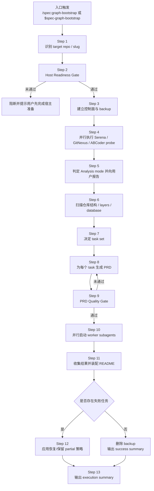

# cc-codex-spec-graph-bootstrap Skill 完整分析（最新 v1）

> 来源: 当前仓库 `skills/spec-graph-bootstrap/SKILL.md` 与 `references/*.md`
> 基准版本: spec-first v1.4.x（截至 2026-04-03）
> 入口: Claude Code `/spec:graph-bootstrap [target-repo-path-or-slug]` | Codex `$spec-graph-bootstrap [target-repo-path-or-slug]`

---

## 1. 做了什么事情（功能概述）

### 核心功能
**为目标项目生成可复用、可长期维护的项目上下文库**。

当前 `spec-graph-bootstrap` 是一个 **Stage-0 supporting workflow**：

- 面向目标仓库做架构分析
- 生成 `docs/contexts/<slug>/` 下的长期上下文资产
- 为后续 `brainstorm / plan / work / review / compound` 提供稳定上下文基础

### 当前版本范围

当前版本只负责 **生成上下文资产**，不负责把这些资产自动注入五阶段工作流；自动注入仍是未来能力。

### 解决的痛点

- 每次进入新项目都要重复推断技术栈、边界、层次、风险点
- 没有稳定上下文时，后续 brainstorm/plan/work/review 容易在不同 session 间漂移
- 大项目里“模块地图 / 边界 / 已知坑 / 数据关系”如果不先沉淀，后续 workflow 成本会持续偏高

### 适用场景

- 首次为一个项目建立 spec-first 长期上下文
- 项目发生明显架构变化后，刷新上下文资产
- 在进入 `spec:brainstorm` / `spec:plan` / `spec:work` 之前，先补齐稳定背景信息
- 对有数据库的项目补建数据库 ER 与关系说明

---

## 2. 怎么做的（实现流程）

### 整体架构：五段式执行链

```text
Host Readiness Gate
  -> Analysis Mode Probes
  -> Create PRD Task Contracts
  -> Execute Worker Subagents
  -> Assembly + Execution Summary
```

### 执行的详细流程（按时间顺序）

下面用“从用户触发到最终产物落盘”的顺序，把一次完整执行拆开说明。

#### 执行流程图



#### 执行流程图（ASCII）

```text
+---------------------------------------------------------------+
| 入口触发: /spec:graph-bootstrap [target] / $spec-graph-bootstrap [target] |
+-------------------------------+-------------------------------+
                                |
                                v
+---------------------------------------------------------------+
| Step 1: 识别 target repo / slug                               |
+-------------------------------+-------------------------------+
                                |
                                v
+---------------------------------------------------------------+
| Step 2: Host Readiness Gate                                   |
| - 检查 host-setup.json                                        |
| - 检查 MCP 是否已生效                                         |
| - 输出 JDT cache 预警                                         |
+----------------------+----------------------------------------+
                       |未通过
                       v
            +-----------------------------+
            | 阻断: 提示先完成宿主准备    |
            +-----------------------------+
                       ^
                       |
                       |通过
+----------------------+----------------------------------------+
| Step 3: 建立控制面与 backup                                   |
| - 计算 slug                                                   |
| - 检查 docs/contexts/<slug>/                                  |
| - 准备 .context/spec-first/bootstrap/...                      |
+-------------------------------+-------------------------------+
                                |
                                v
+---------------------------------------------------------------+
| Step 4: 并行执行工具 probe                                    |
| - Serena                                                      |
| - GitNexus                                                    |
| - ABCoder                                                     |
+-------------------------------+-------------------------------+
                                |
                                v
+---------------------------------------------------------------+
| Step 5: 判定 Analysis mode                                    |
| - Full / Enhanced / Basic                                     |
| - 向用户报告工具就绪状态                                      |
+-------------------------------+-------------------------------+
                                |
                                v
+---------------------------------------------------------------+
| Step 6: 扫描仓库结构 / layers / database                      |
+-------------------------------+-------------------------------+
                                |
                                v
+---------------------------------------------------------------+
| Step 7: 决定 task set                                         |
| - 固定任务                                                    |
| - 条件 layer 任务                                             |
| - 条件 database 任务                                          |
+-------------------------------+-------------------------------+
                                |
                                v
+---------------------------------------------------------------+
| Step 8: 为每个 task 生成 PRD                                  |
| .context/spec-first/bootstrap/<slug>/tasks/<task-id>/prd.md   |
+-------------------------------+-------------------------------+
                                |
                                v
+---------------------------------------------------------------+
| Step 9: PRD Quality Gate                                      |
| - Goal / Context / Files / Notes 是否足够具体                |
+----------------------+----------------------------------------+
                       |未通过
                       +----------------------+
                                              |
                                              v
                              +-------------------------------+
                              | 返回 Step 8 补强 PRD          |
                              +-------------------------------+
                                              |
                                              |通过
                                              v
+---------------------------------------------------------------+
| Step 10: 并行启动 worker subagents                            |
| - 每个 worker 只读自己的 PRD                                  |
| - 每个 worker 只写自己的 ownership boundary                   |
+-------------------------------+-------------------------------+
                                |
                                v
+---------------------------------------------------------------+
| Step 11: 收集结果并装配 README                                |
+-------------------------------+-------------------------------+
                                |
                                v
                     +-------------------------+
                     | 是否存在失败任务?       |
                     +-----------+-------------+
                                 |
                    +------------+------------+
                    |                         |
                    v                         v
      +---------------------------+   +-------------------------------+
      | 无失败: 删除 backup       |   | Step 12: 应用恢复 / partial   |
      | 准备 success summary      |   | 保留策略                      |
      +-------------+-------------+   +---------------+---------------+
                    |                                 |
                    +---------------+-----------------+
                                    |
                                    v
                    +---------------------------------------+
                    | Step 13: 输出 execution summary       |
                    | - slug                                |
                    | - 成功产物                            |
                    | - 失败任务                            |
                    | - Analysis mode / DB access mode      |
                    +---------------------------------------+
```

#### Step 1: 接收入口参数并确定目标仓库

入口形式：

```bash
/spec:graph-bootstrap [target-repo-path-or-slug]
$spec-graph-bootstrap [target-repo-path-or-slug]
```

编排器首先要判定两件事：

1. 当前运行目录是不是目标项目
2. 参数是仓库路径，还是 context slug

如果参数是路径，则把它当作目标仓库根目录；如果参数本身符合 slug 规则（`[a-z0-9-]+`），则后续直接把它当作 `<slug>` 使用。

**功能说明：** 统一入口语义，把“命令参数”翻译成后续流程可消费的目标仓库与上下文标识。

**产物内容：**
- `target_project_root`
- 原始参数类型判定结果（path 或 slug）
- 候选 `context_slug`

#### Step 2: 执行宿主就绪检查

在真正分析项目前，先检查宿主是否具备运行条件：

1. 读取 `~/.claude/spec-first/host-setup.json`
2. 检查 `setup_success`
3. 通过轻量 MCP 调用确认本机已经加载最新 MCP 配置
4. 如存在 Java/ABCoder 风险，再输出 JDT cache 预警

这一段的核心目标是把“宿主未安装”与“宿主已安装但未重启/未生效”区分开来。

输出结果只有两类：

- **阻断**：提示用户先做宿主准备，不进入项目分析
- **放行**：进入仓库级分析阶段

**功能说明：** 在进入项目分析前先判定宿主是否具备执行条件，避免后续在半初始化状态下生成不稳定结果。

**产物内容：**
- 宿主状态判定：`NOT_SETUP` / `SETUP_DONE_NOT_RESTARTED` / `READY`
- `host-setup.json` 版本信息
- 非阻断预警（如 JDT cache warning）
- 面向用户的阻断或放行提示

#### Step 3: 建立本次运行的控制面

放行后，编排器会先建立本次运行的最小控制面状态：

1. 计算 `<slug>`
2. 检查 `docs/contexts/<slug>/` 是否已存在
3. 若已存在，则复制到 backup 目录
4. 准备 `.context/spec-first/bootstrap/<slug>/tasks/` 目录结构

这一步还没有开始写最终文档，但已经确定了：

- 本次运行写入哪个上下文目录
- 是否属于重跑
- 失败时的恢复基线是什么

**功能说明：** 为本次 bootstrap 建立隔离的控制面和可恢复边界，确保后续写入可追踪、可回滚。

**产物内容：**
- `docs/contexts/<slug>/` 目标目录
- `.context/spec-first/bootstrap/<slug>/tasks/` 控制面目录
- `.context/spec-first/bootstrap/<slug>/backup_<ISO-timestamp>/`（如重跑）
- `rerun` / `fresh-run` 状态

#### Step 4: 并行做项目工具探针

接下来编排器并行跑三组 readiness probe：

- Serena probe
- GitNexus probe
- ABCoder probe

三组 probe 的执行方式是 **all-settled**，也就是：

- 某一个 probe 失败，不会中断其他 probe
- 最终统一收集结果，再做模式判定

此阶段的关键输出包括：

- `serena.ready`
- `gitnexus.ready`
- `abcoder.ready`
- 各自失败原因（如 `repo-not-indexed`、`parse-failed`、`language-not-supported:<lang>`）

**功能说明：** 在不假设工具一定可用的前提下，快速探明本轮可使用的分析能力边界。

**产物内容：**
- 工具 readiness 三元组：`serena.ready` / `gitnexus.ready` / `abcoder.ready`
- 每个 probe 的 `reason`
- ABCoder 语言识别结果
- 可供模式判定使用的原始探针结果集

#### Step 5: 判定分析模式并向用户报告

探针完成后，立即做模式判定：

- `gitnexus.ready && abcoder.ready` -> **Full**
- `serena.ready || abcoder.ready` -> **Enhanced**
- 其他情况 -> **Basic**

随后给用户一个简短状态汇总，通常包含：

- Serena 是否可用
- GitNexus 是否可用
- ABCoder 是否可用
- 最终 Analysis mode
- 数据库访问模式（如果已探测到）

这一步的意义是让用户知道：本次 bootstrap 的分析深度上限在哪里。

**功能说明：** 把离散的工具探针结果收敛成单一执行模式，确定后续分析与 PRD 编写所依赖的能力集合。

**产物内容：**
- `analysis_mode = Full | Enhanced | Basic`
- 面向用户的模式报告
- 当前 session 可用工具集合摘要

#### Step 6: 做仓库结构、层次与数据库扫描

模式确定后，编排器开始做第一轮仓库理解，目标不是直接写文档，而是为 PRD 准备足够具体的上下文证据。

这一轮会产出三类结果：

1. **仓库结构认知**
   - 主语言
   - 主框架
   - 顶层目录
   - 关键模块 / 入口点
2. **Layer detection**
   - frontend / backend / mobile / desktop / cli / shared / data 是否存在
3. **Database detection**
   - 是否发现 MySQL 配置
   - DB access level 是 MCP / CLI / ORM inference 哪一档
   - MCP 与项目 DB 是否一致

这一阶段得到的结论，后面会被直接拷进各个 PRD 的 `Context` / `Technical Notes` 中。

**功能说明：** 建立任务级文档写作所需的事实基础，让后续 worker 不必从零重新理解项目。

**产物内容：**
- 技术栈摘要
- 顶层目录与关键模块列表
- `layer_detection_result`
- `database_detection_result`
- 可写入 PRD 的证据片段（路径、模块名、配置键、模式说明）

#### Step 7: 决定要创建哪些任务

编排器不会固定创建所有上下文文件，而是根据上一步的证据来决定 task set：

- 一定创建：`summary-context` / `architecture-context` / `pitfalls-context`
- 条件创建：各类 layer task
- 满足跨层条件才创建：`guides-context`
- 数据库验证通过才创建：`database-context`

这一步的结果是一个明确的任务清单，每个任务都已经知道自己负责哪些目标文件。

**功能说明：** 把“项目扫描结果”转换成“需要生成哪些上下文资产”的任务规划。

**产物内容：**
- `selected_tasks`
- 每个 task 对应的 `Files to Fill`
- 条件任务的创建/省略决定

#### Step 8: 为每个任务生成 PRD

对于每一个被选中的 task，编排器会生成一个独立 PRD：

```text
.context/spec-first/bootstrap/<slug>/tasks/<task-id>/prd.md
```

每个 PRD 都是该 worker 的唯一任务契约，里面至少会写清楚：

- 这个任务要产出什么文件
- 当前仓库里哪些结构/模块/模式与它相关
- 当前 session 可用哪些分析工具
- 不能做什么（不能改源码、不能跑 git、不能越界写文件）
- 什么样算完成

如果是 `database-context`，则改用数据库专用模板，额外加入：

- 连接来源
- DB access level
- 凭证脱敏规则
- 表过滤规则
- ER 文档格式要求

**功能说明：** 为每个 worker 生成独立、可执行、可验证的任务契约，确保并发执行时边界清晰。

**产物内容：**
- `.context/spec-first/bootstrap/<slug>/tasks/<task-id>/prd.md`
- 非数据库 PRD 或数据库专用 PRD
- `Goal / Context / Tools Available / Files to Fill / Important Rules / Acceptance Criteria / Technical Notes`

#### Step 9: 对 PRD 做质量门检查

在 worker 启动前，编排器还会做一次轻量 quality gate，主要看四件事：

1. `Goal` 是否具体
2. `Context` 是否包含真实项目证据
3. `Files to Fill` 是否是精确文件路径
4. `Technical Notes` 是否包含项目特定约束

如果 PRD 太空泛，不会立刻启动 worker，而是先补充上下文，再重新过门。

**功能说明：** 在 worker 启动前过滤掉低质量任务契约，减少“分析不够具体导致产物空泛”的概率。

**产物内容：**
- `prd_quality_gate = pass | fail`
- 失败项清单（Goal / Context / Files / Notes）
- 补强后的 PRD 终稿

#### Step 10: 并行启动 worker subagents

当 PRD 全部过门后，编排器开始并行分发 worker。

每个 worker 接收到的最小信息集是：

- `task_id`
- `prd_path`
- `ownership_boundary`
- `execution_guardrails`
- `completion_report` 要求

worker 的执行重点是：

1. 读自己的 PRD
2. 用可用工具做补充分析
3. 只写自己拥有的上下文文件
4. 输出完成报告或阻塞说明

这一步是整条链路中最“并发”的部分，也是产出正文内容的核心阶段。

**功能说明：** 让多个 worker 在明确边界下并发生成上下文文档正文，缩短整体产出时间。

**产物内容：**
- 各 worker 的完成报告
- 已生成的上下文文件草稿/终稿
- 阻塞说明或缺失证据说明

#### Step 11: 收集 worker 结果并执行装配

所有 worker 返回后，编排器开始收集：

- 哪些文件成功生成
- 哪些任务失败
- 哪些任务只部分完成

然后统一做两类装配工作：

1. 写 `docs/contexts/<slug>/README.md`
2. 决定 backup 的处理方式

此时 README 只会引用真实生成出来的文件，不会假定所有计划文件都存在。

**功能说明：** 把分散的 worker 结果汇总成一个可浏览、可进入的上下文目录入口，并统一处理运行后状态。

**产物内容：**
- `docs/contexts/<slug>/README.md`
- 实际成功文件清单
- 失败任务清单
- backup 的待删除或待恢复状态

#### Step 12: 应用失败恢复策略

如果某些 worker 失败，编排器按失败等级处理：

- `summary-context` 失败 -> 视为核心失败，恢复整个上下文目录
- 非核心任务失败 -> 保留成功结果，输出 partial README
- 所有任务失败 -> 直接恢复

这保证 `docs/contexts/<slug>/` 不会落在一种“半覆盖、又无法确认哪些内容可信”的状态里。

**功能说明：** 根据失败等级决定恢复还是保留 partial 结果，保证最终目录状态始终可解释、可继续使用。

**产物内容：**
- full restore 或 partial preserve 决策
- 恢复后的 `docs/contexts/<slug>/` 状态
- partial README（如适用）
- 失败原因记录

#### Step 13: 输出执行摘要

最后给用户一段执行总结，通常会包含：

- 本次 bootstrap 的 slug
- 成功生成的文件
- 失败任务及原因
- Analysis mode
- DB access mode

从用户视角看，这一步相当于一次完整运行的收尾报告；从系统视角看，这一步标志着本轮 bootstrap 生命周期结束。

**功能说明：** 向用户交付本轮 bootstrap 的最终结果，明确哪些资产已可用、哪些部分仍需处理。

**产物内容：**
- execution summary 文本
- 本次 `slug`
- 成功产物列表
- 失败任务及原因
- `Analysis mode`
- `DB access mode`

### Phase 0: Host Readiness Gate

在任何项目分析之前，先检查宿主是否完成准备：

1. 检查 `~/.claude/spec-first/host-setup.json` 是否存在且 `setup_success == true`
2. 探测 MCP 是否已真正加载（优先 Context7，回退 Serena）
3. 如 `jdt_cache.writable == false`，给出 Java/ABCoder 相关预警

若未完成宿主准备，直接阻断，不进入后续分析阶段。

### Phase 1: Analyze the Target Repository

#### 1.1 建立 context slug

按以下优先级确定 `<slug>`：

1. 用户显式传入 slug
2. 复用目标项目中已有的 `docs/contexts/*/README.md`（要求包含 `<!-- spec-graph-bootstrap -->` 标记）
3. 退回到目标仓库目录名并转成 kebab-case

#### 1.2 重跑备份策略

如果 `docs/contexts/<slug>/` 已存在，先备份到：

```text
.context/spec-first/bootstrap/<slug>/backup_<ISO-timestamp>/
```

写入成功后删除备份；若 worker 失败则按恢复策略处理，避免静默覆盖旧资产。

#### 1.3 工具探针与分析模式判定

当前版本会并行探测三类能力：

- **Serena**：符号概览、符号定位、引用关系
- **GitNexus**：知识图谱、执行流、影响范围
- **ABCoder**：AST / repo 结构 / 节点下钻

模式判定规则：

| 模式 | 条件 | 能力 |
|------|------|------|
| **Full** | `gitnexus.ready AND abcoder.ready` | 架构级 + 符号级分析 |
| **Enhanced** | `serena.ready OR abcoder.ready` | 语义级分析 |
| **Basic** | 三类探针都失败 | 仅用 Read/Grep/Glob 做文本级分析 |

#### 1.4 ABCoder 探针的最新规则

当前 v1 对 ABCoder 的约束非常明确：

- 先 `list_repos()`，不猜 repo 名
- 如果 repo 不可见，先做主语言识别
- **支持矩阵仅含 Go / Java / Python（v0.3.1）**
- 正确命令是：

```bash
abcoder parse <language> <project-root>
```

#### 1.5 层检测与数据库检测

分析阶段还会额外做两件事：

- **Layer Detection**：识别 frontend / backend / mobile / desktop / cli / shared / data
- **Database Detection**：按优先级扫描 MySQL 配置，并判断 DB access level

数据库当前只积极支持 **MySQL MVP**，访问级别分为：

- Level 1: MCP MySQL
- Level 2: CLI `mysql`
- Level 3: ORM inference `[未验证]`

并要求做一次 **MCP `SELECT DATABASE()` 与项目配置的一致性校验**，避免 MCP 连到错误数据库。

### Phase 2: Create PRD Task Contracts

当前版本不是按“package × layer”去填编码规范，而是按 **上下文域（context domains）** 建任务。

控制面路径：

```text
.context/spec-first/bootstrap/<slug>/tasks/<task-id>/prd.md
```

#### 固定任务（一定创建）

| Task ID | 产物 |
|---------|------|
| `summary-context` | `docs/contexts/<slug>/00-summary.md` |
| `architecture-context` | `docs/contexts/<slug>/architecture/system-overview.md`、`module-map.md`，以及条件性的 `integration-boundaries.md` |
| `pitfalls-context` | `docs/contexts/<slug>/pitfalls/index.md` |

#### 条件任务（按检测结果创建）

| Task ID | 产物 |
|---------|------|
| `frontend-context` | `docs/contexts/<slug>/layers/frontend/index.md` |
| `backend-context` | `docs/contexts/<slug>/layers/backend/index.md` |
| `mobile-context` | `docs/contexts/<slug>/layers/mobile/index.md` |
| `desktop-context` | `docs/contexts/<slug>/layers/desktop/index.md` |
| `cli-context` | `docs/contexts/<slug>/layers/cli/index.md` |
| `shared-context` | `docs/contexts/<slug>/layers/shared/index.md` |
| `data-context` | `docs/contexts/<slug>/layers/data/index.md` |
| `guides-context` | `docs/contexts/<slug>/guides/index.md` |
| `database-context` | `docs/contexts/<slug>/database/*.md`（仅在 MySQL 已验证时创建） |

#### 每个 PRD 的核心结构

非数据库任务统一基于 `references/prd-template.md` 生成，必须包含：

- `Goal`
- `Context`
- `Tools Available`
- `Files to Fill`
- `Important Rules`
- `Acceptance Criteria`
- `Technical Notes`

#### 当前版本新增的 PRD 强化机制

当前实现包含以下几层约束：

- `Files to Fill` **动态化**：只列编排器有把握写好的文件
- `Task-specific Acceptance Criteria`：pitfalls / layer 任务会注入专项 AC
- `Technical Notes 推荐骨架`：summary / architecture / pitfalls 各自有建议结构
- `PRD Quality Gate`：在启动 worker 前检查 Goal/Context/Files/Notes 是否足够具体

### Phase 3: Execute Worker Subagents

每个 worker 只读自己的 PRD，只写自己被分配到的文件。

最小 dispatch contract：

```text
task_id: <task-id>
prd_path: .context/spec-first/bootstrap/<slug>/tasks/<task-id>/prd.md
ownership_boundary: only the files listed in Files to Fill
execution_guardrails: do not modify source code; do not run git commands
completion_report: produced files + any missing evidence or blocked assumptions
```

并行规则：

- 没有共享文件的 worker 可以并发
- 超过 20 分钟视为失败
- handoff contract 保持平台无关，不绑定特定宿主 API

### Phase 4: Assembly

所有 worker 完成后，由 orchestrator 串行做最后装配：

1. 汇总各 worker 的实际产物
2. 写 `docs/contexts/<slug>/README.md`
3. 全成功则删除 backup
4. 部分失败则按策略恢复或保留部分结果

当前版本的失败策略：

- `summary-context` 失败 -> 全量恢复
- 其他 worker 失败 -> 保留成功产物，写部分 README，并报告缺失域
- 全部 worker 失败 -> 全量恢复

---

## 3. 有哪些依赖（工具链）

### 宿主准备链路

推荐链路是：

```bash
/spec:mcp-setup quick
# 重启 Claude Code
/spec:graph-bootstrap [target]
```

### 分析能力依赖

| 能力层 | 工具 | 是否必需 | 说明 |
|-------|------|----------|------|
| Full mode | GitNexus + ABCoder | 可选 | 两者都 ready 才进入 Full |
| Enhanced mode | Serena 或 ABCoder | 可选 | 任一 ready 即可进入 Enhanced |
| Basic mode | Read / Grep / Glob | 兜底 | 所有 MCP 都失败时仍可运行 |
| Database | MySQL MCP 或 `mysql` CLI | 可选 | 仅数据库任务需要 |

### 当前工具使用规范

#### GitNexus

- 用于架构级问题：cluster、flow、impact、跨模块关系
- 推荐在 Full mode 里先用它定位宏观边界，再下钻源码

#### ABCoder

- 用于 repo 结构、file 结构、AST 节点与依赖
- 当前推荐下钻顺序：

```text
list_repos -> get_repo_structure -> get_file_structure -> get_ast_node
```

#### Serena

- 用于 Enhanced mode 的符号级分析
- 推荐顺序：

```text
get_symbols_overview -> find_symbol -> find_referencing_symbols -> search_for_pattern
```

---

## 4. 有哪些产物（输出文件）

### 控制面产物

控制面产物主要服务于“编排、恢复、追踪”，不是给最终读者直接消费的知识文档。

| 产物 | 路径 | 是否必然出现 | 生成时机 | 说明 |
|------|------|--------------|----------|------|
| Task PRD | `.context/spec-first/bootstrap/<slug>/tasks/<task-id>/prd.md` | 是 | Phase 2 | 每个 worker 的任务契约，定义文件归属、上下文、工具、验收标准 |
| Task 目录 | `.context/spec-first/bootstrap/<slug>/tasks/` | 是 | Phase 2 | 本轮 bootstrap 全部 worker 任务的容器目录 |
| Backup | `.context/spec-first/bootstrap/<slug>/backup_<ISO-timestamp>/` | 否 | Phase 1.2 | 仅在 `docs/contexts/<slug>/` 已存在时出现，用于 rerun 保护 |

### 控制面产物的内容说明

- **Task PRD**
  - 作用：作为 worker 的唯一执行契约
  - 典型内容：`Goal`、`Context`、`Tools Available`、`Files to Fill`、`Important Rules`、`Acceptance Criteria`、`Technical Notes`
- **Task 目录**
  - 作用：按 task 粒度隔离本轮任务
  - 典型内容：`summary-context/`、`architecture-context/`、`pitfalls-context/` 等 task 子目录
- **Backup**
  - 作用：在重跑时提供回滚基线
  - 典型内容：旧的 `docs/contexts/<slug>/` 完整快照

### 最终文档产物

最终文档产物是本次 bootstrap 真正交付给项目的长期知识资产，默认位于：

```text
docs/contexts/<slug>/
```

| 产物 | 路径 | 是否必然出现 | 由谁生成 | 说明 |
|------|------|--------------|----------|------|
| Context README | `docs/contexts/<slug>/README.md` | 是 | orchestrator | 上下文入口页，汇总本轮实际成功生成的文件 |
| Summary | `docs/contexts/<slug>/00-summary.md` | 是 | `summary-context` worker | 项目总览、技术栈、顶层结构、核心职责 |
| Architecture | `docs/contexts/<slug>/architecture/system-overview.md` | 是 | `architecture-context` worker | 系统整体结构、架构决策、边界 |
| Module Map | `docs/contexts/<slug>/architecture/module-map.md` | 是 | `architecture-context` worker | 顶层目录/模块职责映射 |
| Integration Boundaries | `docs/contexts/<slug>/architecture/integration-boundaries.md` | 否 | `architecture-context` worker | 模块接口、外部依赖、通信协议；仅在外部集成点明显时生成 |
| Pitfalls | `docs/contexts/<slug>/pitfalls/index.md` | 是 | `pitfalls-context` worker | 风险点、反模式、热点区域与规避建议 |

### 条件文档产物

这类产物是否出现，取决于仓库扫描结论。

| 产物 | 路径 | 触发条件 | 说明 |
|------|------|----------|------|
| Frontend Layer | `docs/contexts/<slug>/layers/frontend/index.md` | 检测到 frontend | 前端框架、页面组织、组件/状态模式 |
| Backend Layer | `docs/contexts/<slug>/layers/backend/index.md` | 检测到 backend | 服务入口、路由/API、服务层/数据层模式 |
| Mobile Layer | `docs/contexts/<slug>/layers/mobile/index.md` | 检测到 mobile | 移动端目录、应用壳、页面/模块结构 |
| Desktop Layer | `docs/contexts/<slug>/layers/desktop/index.md` | 检测到 desktop | 桌面端壳层、桥接层、窗口/进程边界 |
| CLI Layer | `docs/contexts/<slug>/layers/cli/index.md` | 检测到 cli | 命令入口、参数解析、命令组织方式 |
| Shared Layer | `docs/contexts/<slug>/layers/shared/index.md` | 检测到 shared | 共享模块、跨层复用代码、公共契约 |
| Data Layer | `docs/contexts/<slug>/layers/data/index.md` | 检测到 data | schema、ETL、pipeline、数据处理约定 |
| Guides | `docs/contexts/<slug>/guides/index.md` | 至少 3 个 active layers 且存在显式跨层依赖 | 跨层协作指南、依赖方向、使用约束 |

### 数据库相关产物

数据库产物是 `database-context` 的专属输出，仅在 MySQL 已验证时出现。

| 产物 | 路径 | 触发条件 | 说明 |
|------|------|----------|------|
| Single DB ER | `docs/contexts/<slug>/database/database-er.md` | 单数据库 + MySQL 已验证 | 单库 ER 图、核心关系、表清单、数据流 |
| Multi DB Index | `docs/contexts/<slug>/database/database-index.md` | 多数据库 + MySQL 已验证 | 多库入口索引页 |
| Per-DB ER | `docs/contexts/<slug>/database/database-<name>.md` | 多数据库 + MySQL 已验证 | 每个数据库各自的 ER 与说明文档 |

### 用户可见的运行结果产物

除了落盘文件，本次执行还会输出一组用户可见但不一定落盘的运行结果。

| 产物 | 载体 | 出现时机 | 说明 |
|------|------|----------|------|
| Host Gate 提示 | 终端 / agent 输出 | Phase 0 | 宿主是否可继续执行的阻断或放行信息 |
| Tool Probe 汇总 | 终端 / agent 输出 | Step 5 | Serena / GitNexus / ABCoder readiness 与 mode 结果 |
| Warning 信息 | 终端 / agent 输出 | Phase 0 / Phase 1 | JDT cache、工具降级、数据库不一致等预警 |
| Execution Summary | 终端 / agent 输出 | Step 13 | 本次 slug、成功产物、失败任务、Analysis mode、DB access mode |

### 产物内容详解

- **`README.md`**
  - 内容定位：入口导航页
  - 典型内容：生成时间、`<!-- spec-graph-bootstrap -->` 标记、各文档链接、缺失域说明
- **`00-summary.md`**
  - 内容定位：项目一页摘要
  - 典型内容：主语言、主框架、顶层结构、核心职责、已知限制
- **`architecture/system-overview.md`**
  - 内容定位：全局架构视图
  - 典型内容：架构风格、层次关系、关键设计决策、系统边界
- **`architecture/module-map.md`**
  - 内容定位：目录和模块地图
  - 典型内容：顶层目录列表、模块职责、一句话说明
- **`architecture/integration-boundaries.md`**
  - 内容定位：对外与对内接口边界
  - 典型内容：外部依赖、协议、模块间交互、接口约束
- **`pitfalls/index.md`**
  - 内容定位：风险知识库
  - 典型内容：代码层风险、架构层风险、业务逻辑风险、历史热点
- **`layers/<layer>/index.md`**
  - 内容定位：某一层的专用上下文
  - 典型内容：该层入口、组织方式、关键模式、常见反模式
- **`guides/index.md`**
  - 内容定位：跨层协作指南
  - 典型内容：依赖方向、跨层调用约束、共享模块使用建议
- **`database/*.md`**
  - 内容定位：数据库结构文档
  - 典型内容：连接状态标记、ER 图、核心关系、实体类型、数据流、已过滤表

### 运行结束后的目录形态示例

最小成功产物：

```text
docs/contexts/<slug>/
├── README.md
├── 00-summary.md
├── architecture/
│   ├── system-overview.md
│   └── module-map.md
└── pitfalls/
    └── index.md
```

较完整的成功产物：

```text
docs/contexts/<slug>/
├── README.md
├── 00-summary.md
├── architecture/
│   ├── system-overview.md
│   ├── module-map.md
│   └── integration-boundaries.md
├── pitfalls/
│   └── index.md
├── layers/
│   ├── frontend/
│   │   └── index.md
│   ├── backend/
│   │   └── index.md
│   └── shared/
│       └── index.md
├── guides/
│   └── index.md
└── database/
    └── database-er.md
```

### 最低质量要求

无论处于哪种分析模式，至少要满足：

- `00-summary.md` 识别主语言、主框架、顶层结构
- `architecture/module-map.md` 列出顶层目录及一句话职责
- 所有产物都是项目特定内容，而不是模板占位符
- `README.md` 含 `<!-- spec-graph-bootstrap -->` 生成标记

---

## 5. 有哪些规范（设计模式与约束）

### Worker 边界规则

- 每个 worker 只写 `Files to Fill` 中列出的文件
- 不修改源码
- 不执行 git 命令
- 可以自由读取代码做分析

### 文件级与章节级灵活性

当前 v1 把“灵活性”拆成两层：

- **文件级是否创建/省略**：由 orchestrator 在 Phase 2 决定
- **章节级如何组织内容**：由 worker 根据真实项目调整

也就是说，worker 可以删掉无证据的章节、增加项目特有章节，但**不应该擅自突破 PRD 已分配的文件边界**。

### 数据库安全规则

`database-context` 有额外安全约束：

- 不写密码
- 不写完整连接串
- 只记录环境变量名
- 若日志中出现连接串，密码段必须打码成 `***`

### README 与 index 对齐规则

- `README.md` 必须反映实际生成的上下文文件
- 各类 `index.md` 只能链接真实存在的文件
- 条件文件只有在检测到证据时才生成

### 完成度检查

当前版本的完成标准更强调“契约一致性”：

- 所有 PRD 列出的文件都已生成且非空
- 无模板占位符残留
- `module-map.md`、`00-summary.md` 等最低保障文件满足结构要求
- `database-er.md`（若生成）不泄漏凭证，并带 Mermaid ER 图
- 成功时 backup 被清理；失败时执行了恢复动作

---

## 6. 一句话结论

`cc-codex-spec-graph-bootstrap` 在当前 v1 中，本质上是一个 **“项目上下文 Bootstrap 编排器”**，负责先做宿主检查与项目分析，再为多个上下文域生成 PRD，并驱动并行 worker 产出 `docs/contexts/<slug>/` 这套长期上下文资产。
