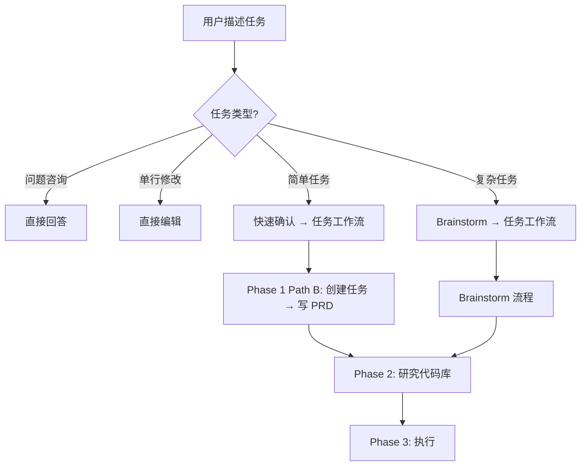

# 会话管理命令详解

> **命令列表**: `/trellis:start`, `/trellis:record-session`, `/trellis:onboard`

---

## 1. `/trellis:start` - 会话启动

### 1.1 功能概述

**核心职责**: 初始化 AI 开发会话，恢复上下文，引导任务分类

### 1.2 执行流程

```
┌─────────────────────────────────────────────────────────────┐
│                    Session Start Flow                        │
├─────────────────────────────────────────────────────────────┤
│  Step 1: 读取 workflow.md → 理解开发流程                      │
│  Step 2: 执行 get_context.py → 获取当前状态                   │
│  Step 3: 读取规范索引 → 了解可用规范                          │
│  Step 4: 报告状态并询问 → "What would you like to work on?"   │
└─────────────────────────────────────────────────────────────┘
```

### 1.3 任务分类决策树



### 1.4 任务工作流三阶段

#### Phase 1: 建立需求

| 路径 | 场景 | 步骤 |
|------|------|------|
| **Path A** | 从 Brainstorm 过来 | PRD 已存在，跳到 Phase 2 |
| **Path B** | 简单任务 | 确认理解 → 创建任务 → 写 PRD |

#### Phase 2: 准备实施

```
Step 4: Code-Spec 深度检查（基础设施/跨层变更必须）
Step 5: 研究代码库（调用 Research Agent）
Step 6: 配置上下文（初始化 jsonl 文件）
Step 7: 激活任务（设置 .current-task）
```

#### Phase 3: 执行

```
Step 8: Implement Agent（Hook 自动注入上下文）
Step 9: Check Agent（Hook 自动注入上下文）
Step 10: 完成（验证 → 报告 → 提醒用户）
```

### 1.5 关键设计

#### 操作类型标记

| 标记 | 含义 | 执行者 |
|------|------|--------|
| `[AI]` | Bash 脚本或 Task 调用 | AI |
| `[USER]` | Slash 命令 | 用户 |

#### 任务复杂度分类

| 复杂度 | 标准 | 处理方式 |
|--------|------|----------|
| **Trivial** | 单行修复、拼写错误 | 直接实现 |
| **Simple** | 清晰目标、1-2 文件 | 确认后实现 |
| **Moderate** | 多文件、部分模糊 | 轻量 Brainstorm |
| **Complex** | 模糊目标、架构决策 | 完整 Brainstorm |

### 1.6 核心原则

> **Code-spec context is injected, not remembered.**
>
> 任务工作流确保 Agent 自动接收相关规范上下文，比依赖 AI "记住" 规范更可靠。

---

## 2. `/trellis:record-session` - 会话记录

### 2.1 功能概述

**核心职责**: 一键记录会话进度，更新 Workspace 日志

**前置条件**: **必须**在用户测试并提交代码后使用

> ⚠️ **AI 不得执行 `git commit`** - 只读取历史

### 2.2 执行流程

```
┌─────────────────────────────────────────────────────────────┐
│                  Record Session Flow                         │
├─────────────────────────────────────────────────────────────┤
│  Step 1: 获取上下文                                          │
│          python3 ./.trellis/scripts/get_context.py           │
│                                                              │
│  Step 2: 一键添加会话                                        │
│          python3 ./.trellis/scripts/add_session.py \         │
│            --title "..." --commit "..." --summary "..."      │
│                                                              │
│  自动完成:                                                   │
│  ├─ 追加到 journal-N.md                                      │
│  ├─ 超过 2000 行自动创建新文件                               │
│  └─ 更新 index.md（会话计数、最后活跃、历史）                │
└─────────────────────────────────────────────────────────────┘
```

### 2.3 两种调用方式

#### 方式 1: 简单参数

```bash
python3 ./.trellis/scripts/add_session.py \
  --title "实现用户认证" \
  --commit "abc1234,def5678" \
  --summary "完成 JWT 令牌验证"
```

#### 方式 2: 详细内容（stdin）

```bash
cat << 'EOF' | python3 ./.trellis/scripts/add_session.py --title "..." --commit "..."
| Feature | Description |
|---------|-------------|
| New API | Added user authentication endpoint |
| Frontend | Updated login form |

**Updated Files**:
- `packages/api/modules/auth/router.ts`
- `apps/web/modules/auth/components/login-form.tsx`
EOF
```

### 2.4 自动归档任务

如果任务已完成：

```bash
python3 ./.trellis/scripts/task.py archive <task-name>
```

### 2.5 脚本命令参考

| 命令 | 用途 |
|------|------|
| `get_context.py` | 获取所有上下文信息 |
| `add_session.py` | 一键添加会话（推荐） |
| `task.py create` | 创建新任务目录 |
| `task.py archive` | 归档已完成任务 |
| `task.py list` | 列出活跃任务 |

---

## 3. `/trellis:onboard` - 项目入职

### 3.1 功能概述

**核心职责**: 作为导师引导新成员理解 AI 辅助工作流

**三个必须完成的部分**:

```
┌─────────────────────────────────────────────────────────────┐
│                    Onboard 三部分                            │
├─────────────────────────────────────────────────────────────┤
│  Part 1: 核心概念                                           │
│  ├─ 核心哲学（为什么存在这个工作流）                          │
│  ├─ 系统结构（目录和文件）                                   │
│  └─ 命令深度解析（每个命令的原理）                           │
│                                                              │
│  Part 2: 真实世界示例                                       │
│  ├─ 5 个完整工作流示例                                      │
│  └─ 每一步的原理、执行内容、跳过后果                        │
│                                                              │
│  Part 3: 自定义开发规范                                     │
│  ├─ 检查规范是否为空模板                                    │
│  └─ 引导填写项目特定内容                                    │
└─────────────────────────────────────────────────────────────┘
```

### 3.2 核心哲学解释

#### Challenge 1: AI 没有记忆

| 问题 | 解决方案 |
|------|----------|
| AI 每次会话都是空白状态 | `.trellis/workspace/` 系统捕获每次会话内容 |
| 忘记之前的工作 | `/trellis:start` 在会话开始时读取历史 |

#### Challenge 2: AI 只有通用知识

| 问题 | 解决方案 |
|------|----------|
| AI 不知道项目特定约定 | `.trellis/spec/` 包含项目规范 |
| 写出的代码不匹配项目风格 | `/before-*-dev` 命令在编码前注入规范 |

#### Challenge 3: AI 上下文窗口有限

| 问题 | 解决方案 |
|------|----------|
| 随着对话进行，规范被"遗忘" | `/check-*` 命令在编码后重新验证 |
| AI 回退到通用模式 | `/trellis:finish-work` 做最终整体审查 |

### 3.3 5 个真实世界示例

#### Example 1: Bug 修复会话

```
[1/8] /trellis:start          → AI 需要项目上下文
[2/8] task.py create          → 跟踪工作以供未来参考
[3/8] /trellis:before-frontend-dev → 注入项目前端知识
[4/8] 调查并修复 bug          → 实际开发工作
[5/8] /trellis:check-frontend → 重新验证代码是否符合规范
[6/8] /trellis:finish-work    → 整体跨层审查
[7/8] 用户测试并提交          → 用户验证
[8/8] /trellis:record-session → 为未来会话持久化记忆
```

#### Example 2: 规划会话（无代码）

```
[1/4] /trellis:start          → 非编码工作也需要上下文
[2/4] task.py create          → 规划是有价值的工作
[3/4] 审查文档、创建子任务    → 实际规划工作
[4/4] /trellis:record-session → 规划决策必须记录
```

#### Example 3: 代码审查修复

```
[1/6] /trellis:start          → 从上一次会话恢复上下文
[2/6] /trellis:before-backend-dev → 修复前重新注入规范
[3/6] 修复每个 CR 问题        → 在规范上下文中处理反馈
[4/6] /trellis:check-backend  → 验证修复没有引入新问题
[5/6] /trellis:finish-work    → 记录 CR 中的教训
[6/6] 用户提交，然后 record-session → 保留 CR 教训
```

#### Example 4: 大型重构

```
[1/5] /trellis:start          → 大规模变更前的清晰基线
[2/5] 规划阶段                → 分解为可验证的块
[3/5] 逐阶段执行，每阶段后 /check-* → 增量验证
[4/5] /trellis:finish-work    → 检查新模式是否需要文档
[5/5] 记录多个 commit hash    → 将所有提交链接到一个功能
```

#### Example 5: 调试会话

```
[1/6] /trellis:start          → 查看这个 bug 之前是否被调查过
[2/6] /trellis:before-backend-dev → 规范可能记录了已知陷阱
[3/6] 调查                    → 实际调试工作
[4/6] /trellis:check-backend  → 验证调试变更不会破坏其他东西
[5/6] /trellis:finish-work    → 调试发现可能需要文档
[6/6] 用户提交，然后 record-session → 调试知识是有价值的
```

### 3.4 关键规则

1. **AI 永远不提交** - 用户测试和批准
2. **代码前先规范** - `/before-*-dev` 命令注入项目知识
3. **代码后检查** - `/check-*` 命令捕获上下文漂移
4. **记录一切** - `/trellis:record-session` 持久化记忆

### 3.5 规范自定义检查

```bash
# 检查规范文件是否仍为空模板
grep -l "To be filled by the team" .trellis/spec/backend/*.md
grep -l "To be filled by the team" .trellis/spec/frontend/*.md
```

**情况 A**: 首次设置（空模板）
- 引导开发者分析代码库并填写规范

**情况 B**: 规范已自定义
- 开发者可以立即使用 `/before-*-dev` 命令
