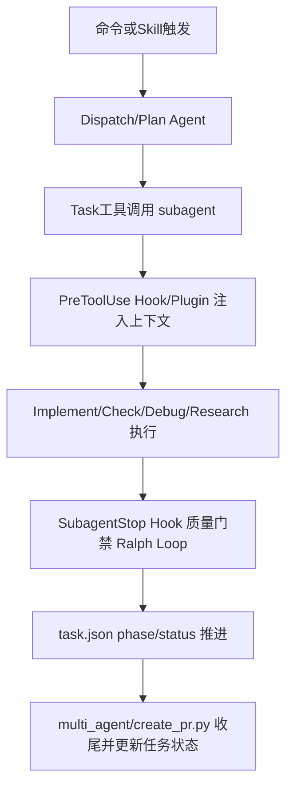

# Trellis 命令与 Skill 全景解析（逐项功能 + 实现逻辑）

> 分析时间: 2026-03-01  
> 分析对象: `/Users/kuang/xiaobu/Trellis`  
> 分析深度: 命令模板层 + Hook/Plugin 层 + 脚本执行层 + CLI 引擎层

---

## 1. 分析范围与口径

本报告把 Trellis 的“命令体系”拆成 5 层，避免只看提示词：

1. `trellis` CLI 命令层（真实可执行）
- `trellis init`
- `trellis update`

2. 平台命令模板层（人机交互协议）
- `.claude/.iflow/.opencode/.cursor/.kilocode/.gemini/.agent` 对应命令模板

3. Skill 层（Codex/Kiro）
- `.agents/skills/*/SKILL.md`
- `.kiro/skills/*/SKILL.md`

4. Agent + Hook/Plugin 层（上下文注入与门禁）
- `dispatch/implement/check/debug/research/plan`
- `session-start`、`inject-subagent-context`、`ralph-loop`

5. 运行脚本层（任务状态与多工作树流水线）
- `.trellis/scripts/task.py`
- `.trellis/scripts/add_session.py`
- `.trellis/scripts/get_context.py`
- `.trellis/scripts/multi_agent/*.py`

---

## 2. 平台能力矩阵（先看全貌）

## 2.1 平台载体与目录

| 平台 | 载体 | 目录 | 备注 |
|---|---|---|---|
| Claude Code | 命令+Agent+Hook | `.claude/` | 多代理主参考实现 |
| iFlow | 命令+Agent+Hook | `.iflow/` | 与 Claude 基本同构 |
| OpenCode | 命令+Agent+Plugin | `.opencode/` | 子代理拦截有平台限制 |
| Cursor | 命令 | `.cursor/commands/trellis-*.md` | 平铺前缀命名 |
| Kilo | 命令 | `.kilocode/commands/trellis/*.md` | 命令型平台 |
| Gemini CLI | TOML 命令 | `.gemini/commands/trellis/*.toml` | 无 hook/agent |
| Codex | Skills | `.agents/skills/*/SKILL.md` | `$skill` 触发语义 |
| Kiro | Skills | `.kiro/skills/*/SKILL.md` | 结构与 Codex 同构 |
| Antigravity | Workflows | `.agent/workflows/*.md` | 由 Codex skills 自动改写生成 |

## 2.2 逻辑命令覆盖（16 个）

| 逻辑命令 | Claude | iFlow | OpenCode | Cursor | Kilo | Gemini | Codex/Kiro Skill |
|---|---:|---:|---:|---:|---:|---:|---:|
| start | Y | Y | Y | Y | Y | Y | Y |
| brainstorm | Y | Y | Y | Y | Y | Y | Y |
| before-frontend-dev | Y | Y | Y | Y | Y | Y | Y |
| before-backend-dev | Y | Y | Y | Y | Y | Y | Y |
| check-frontend | Y | Y | Y | Y | Y | Y | Y |
| check-backend | Y | Y | Y | Y | Y | Y | Y |
| check-cross-layer | Y | Y | Y | Y | Y | Y | Y |
| finish-work | Y | Y | Y | Y | Y | Y | Y |
| update-spec | Y | Y | Y | Y | Y | Y | Y |
| break-loop | Y | Y | Y | Y | Y | Y | Y |
| record-session | Y | Y | Y | Y | Y | Y | Y |
| create-command | Y | Y | Y | Y | Y | Y | Y |
| integrate-skill | Y | Y | Y | Y | Y | Y | Y |
| onboard | Y | Y | Y | Y | Y | Y | Y |
| parallel | Y | Y | Y | N | Y | N | N |
| migrate-specs | N | N | Y(空文件) | N | N | N | N |

结论:
- 核心体系是“14 个基础命令 + 可选并行命令 + OpenCode 占位迁移命令”。
- `migrate-specs` 当前在 OpenCode 模板内为 0 行空实现，属于显式未完成能力。

---

## 3. CLI 真实命令（`trellis init/update`）

这两个命令是 Trellis 真正的“工程执行中枢”，不是提示词。

## 3.1 `trellis init`

实现入口: `src/commands/init.ts`

### 功能定位
- 初始化 `.trellis` 工作流骨架
- 配置所选平台模板
- 初始化开发者身份、模板哈希、版本文件
- 自动创建 bootstrap task（指导填写规范）

### 关键输入
- 平台 flags: `--claude --cursor --iflow --opencode --codex --kilo --kiro --gemini --antigravity`
- 模板策略: `--template --overwrite --append`
- 文件冲突策略: `--force --skip-existing`
- 无交互模式: `-y`

### 实现逻辑
1. 解析并选择平台（默认 `Claude + Cursor`，显式 flag 优先）。
2. 可选下载远程 spec 模板（失败回退 blank）。
3. 创建 `.trellis` 结构 (`createWorkflowStructure`)。
4. 写入 `.trellis/.version`。
5. 调用平台注册表驱动的 `configurePlatform()`，复制平台模板。
6. 创建 `AGENTS.md`。
7. 初始化 `.template-hashes.json`（后续 update 用于“用户改动检测”）。
8. 初始化 developer 并创建 `00-bootstrap-guidelines` 任务（`task.json + prd.md + .current-task`）。

### 结果产物
- `.trellis/*`
- 平台目录（如 `.claude/`, `.opencode/`, `.agents/skills/`）
- `.trellis/.version`, `.trellis/.template-hashes.json`

## 3.2 `trellis update`

实现入口: `src/commands/update.ts`

### 功能定位
- 版本升级/降级管控
- 模板变更识别与冲突处理
- 迁移清单执行（rename/rename-dir/delete）
- 更新前全量快照备份

### 关键输入
- `--dry-run`
- `--force / --skip-all / --create-new`
- `--allow-downgrade`
- `--migrate`

### 实现逻辑（核心）
1. 版本对比: 项目版本 vs CLI 版本 vs npm 最新版本。
2. 收集模板: 仅收集“已配置平台”模板（避免误更新未启用平台）。
3. 哈希判定:
- `new`
- `unchanged`
- `auto-update`（用户未改，模板变）
- `changed`（用户已改，需冲突策略）
4. 迁移判定:
- 基于 manifest 取待迁移项
- 额外检测 orphaned migrations（历史未执行完迁移）
- 分类 `auto/confirm/conflict/skip`
5. 更新前创建全量备份:
- 备份所有 managed dirs
- 排除用户数据目录（workspace/tasks 等）
6. 执行迁移（`--migrate`）:
- rename/rename-dir/delete
- 可交互确认 modified 项
- 同步更新 hash 记录
7. 模板写回:
- 自动更新可安全项
- 冲突项按 overwrite/skip/create-new
8. 更新版本戳与 hash。
9. 若存在 breaking+guide，自动生成 migration task（`migrate-to-<version>`）。

### 工程价值
- 在“框架升级”这件事上，Trellis 提供了可回滚、可审计、可分级冲突处理的完整机制。

---

## 4. 16 个逻辑命令逐条解析

> 命令模板主要来源: `src/templates/claude/commands/trellis/*.md`（其余平台为语法适配或内容裁剪）

## 4.1 `start`

### 功能
- 会话开场总入口，恢复上下文并决定后续流程（问答/小修/任务工作流）。

### 实现逻辑
1. 读 `.trellis/workflow.md`。
2. 调 `python3 ./.trellis/scripts/get_context.py` 获取 git/任务/日志状态。
3. 读 `spec` 索引。
4. 根据复杂度走:
- 直接处理
- 或 `brainstorm -> task workflow`
5. 进入任务工作流时，要求:
- `task.py create`
- PRD 建立
- `task.py init-context/add-context/start`

### 关键落地
- 不是直接“开始写代码”，而是先把“任务上下文与注入入口”建好。

## 4.2 `brainstorm`

### 功能
- 需求澄清与收敛，先记录任务再提问。

### 实现逻辑
1. 强制 Step0 创建任务目录（先落盘）。
2. 立即写初版 `prd.md`。
3. 先仓库调研后提问（Action before asking）。
4. 一次只问一个问题。
5. 技术选型先 research，再给 2-3 方案。
6. Diverge -> Converge，最终锁 MVP + Out of scope。

### 关键落地
- 把需求不确定性收敛为可执行 PRD，而不是在对话中漂移。

## 4.3 `before-frontend-dev`

### 功能
- 编码前注入前端规范。

### 实现逻辑
- 读取 `spec/frontend/index.md` 与相关专题（component/hook/state/type）。
- 明确标记为“写前必做”。

## 4.4 `before-backend-dev`

### 功能
- 编码前注入后端规范。

### 实现逻辑
- 读取 `spec/backend/index.md` 与相关专题（database/error/logging/type）。

## 4.5 `check-frontend`

### 功能
- 对前端变更做规范复核，抵抗上下文漂移。

### 实现逻辑
1. `git status` 定位改动。
2. 回读前端规范文件。
3. 对照规范检查并修复。

## 4.6 `check-backend`

### 功能
- 后端变更复核。

### 实现逻辑
1. `git status`。
2. 回读 backend 规范。
3. 对照规范检查并修复。

## 4.7 `check-cross-layer`

### 功能
- 跨层一致性检查（数据流、复用、导入、同层一致性等）。

### 实现逻辑
1. `git status` + `git diff --name-only`。
2. 按触发条件选择维度:
- Dimension A: 3+ 层数据流
- Dimension B/B2/B3: 复用与批量修改漏项
- Dimension C: 导入路径/依赖
- Dimension D: 同层一致性
3. 输出问题与修复建议。

## 4.8 `finish-work`

### 功能
- 提交前总检查清单（代码、测试、规范同步、跨层验证）。

### 实现逻辑
1. 质量门: `pnpm lint/type-check/test`。
2. 测试覆盖检查（新增函数/bugfix/integration）。
3. Spec 同步检查。
4. 对 infra/cross-layer 触发“硬门槛”（签名/契约/矩阵/用例/测试点）。

### 特点
- 在 pipeline 模式里，finish 阶段由 check agent 自动触发“主动 spec 同步”。

## 4.9 `update-spec`

### 功能
- 把实现过程中学到的可执行知识写回 `spec`。

### 实现逻辑
1. 识别学习点（决策/约定/反模式/gotcha）。
2. 区分写入 `backend/frontend` 还是 `guides`。
3. 对 infra/cross-layer 强制 7 段结构:
- Scope/Trigger
- Signatures
- Contracts
- Validation & Error Matrix
- Good/Base/Bad
- Tests Required
- Wrong vs Correct

## 4.10 `break-loop`

### 功能
- Debug 后复盘，阻断“修了忘，忘了再踩”。

### 实现逻辑
1. 根因分类（A-E）。
2. 分析失败修复尝试。
3. 设计预防机制。
4. 扩展系统性问题。
5. 立即更新 spec/guides（不是只写聊天结论）。

## 4.11 `record-session`

### 功能
- 会话沉淀与日志归档。

### 实现逻辑
1. `get_context.py` 获取当前上下文。
2. `add_session.py` 追加 journal。
3. 触发自动分卷（>2000 行新建 journal-N）。
4. 自动更新 workspace index 指标。
5. 可选 `task.py archive` 归档任务。

### 约束
- 明确禁止 AI 执行 commit，只允许读取 git 历史。

## 4.12 `create-command`

### 功能
- 生成新命令模板。

### 实现逻辑
1. 解析命令名与描述。
2. 按类型选择模板结构。
3. 生成到双目录（Claude + Cursor）:
- `.claude/commands/trellis/<name>.md`
- `.cursor/commands/trellis-<name>.md`

### 注意
- 命令规范强调“可执行、边界清晰、避免重复”。

## 4.13 `integrate-skill`

### 功能
- 将外部 skill 融入项目规范（不是直接生成项目代码）。

### 实现逻辑
1. 读取 skill 内容（如 `openskills read`）。
2. 分类技能目标（frontend/backend/docs/testing）。
3. 更新 `.trellis/spec/{target}/doc.md` section。
4. 若有示例，写入 `examples/skills/<skill-name>/`，代码文件用 `.template` 后缀。
5. 更新 index 导航。

## 4.14 `onboard`

### 功能
- 新成员入门教学脚本。

### 实现逻辑
- 命令内容本身是一份结构化 onboarding 课程，强制覆盖:
1. 核心哲学
2. 系统结构
3. 命令深度讲解
4. 5 个真实工作流示例
5. 检查并引导填写空白 spec 模板

## 4.15 `parallel`

### 功能
- 启动多工作树多代理流水线。

### 实现逻辑
1. 主仓 orchestrator 负责需求讨论与任务配置，不直接写代码。
2. 可调用 `multi_agent/plan.py` 生成任务并后台启动 plan agent。
3. 调 `multi_agent/start.py` 创建 worktree + 启 dispatch agent。
4. 监控与回收:
- `status.py`
- `cleanup.py`
- `create_pr.py`

### 特点
- 明确把“调度”和“编码”隔离，降低主分支污染与上下文串扰。

## 4.16 `migrate-specs`（OpenCode 专有）

### 功能
- 设计意图是“规范迁移”。

### 当前实现状态
- 文件存在但 0 行（占位）。
- 结论: 在 Trellis 当前版本中不具备可执行能力。

---

## 5. 14 个 Skill 逐条解析（Codex/Kiro）

Skill 路径:
- `src/templates/codex/skills/*/SKILL.md`
- `src/templates/kiro/skills/*/SKILL.md`

总体规律:
- 与 14 个基础命令语义同构。
- `parallel`、`migrate-specs` 不在 skill 集合中。
- 主要差异是触发语法与路径命名，不是流程语义。

## 5.1 Skill 总表（逐项）

| Skill | 功能介绍 | 实现逻辑介绍 |
|---|---|---|
| `start` | 会话启动与任务分流 | 读 `workflow + get_context`，按复杂度进入 direct/brainstorm/task workflow，并用 `task.py` 建立上下文注入基础 |
| `brainstorm` | 需求澄清与 PRD 收敛 | 先建 task 再问问题；研究优先；单问题迭代；输出可执行 PRD |
| `before-frontend-dev` | 前端写前规范注入 | 读取 frontend 索引与专题规范，作为实现前置条件 |
| `before-backend-dev` | 后端写前规范注入 | 读取 backend 索引与专题规范，作为实现前置条件 |
| `check-frontend` | 前端规范复核 | 基于 `git status` + spec 回读进行一致性检查与修复 |
| `check-backend` | 后端规范复核 | 同上，聚焦 backend 规范集 |
| `check-cross-layer` | 跨层一致性检查 | 按维度触发跨层数据流、复用、依赖路径、同层一致性检查 |
| `finish-work` | 提交前总检查 | lint/type/test + spec 同步 + 跨层硬门槛检查 |
| `update-spec` | 知识沉淀到规范 | 把实现知识转为可执行 spec，infra/cross-layer 强制 7 段结构 |
| `break-loop` | Debug 复盘防复发 | 根因分类、失败分析、预防机制、系统扩展、立即写回 spec |
| `record-session` | 会话与经验沉淀 | 通过 `add_session.py` 追记日志并更新索引，支持任务归档 |
| `create-command` | 生成新技能/命令模板 | 在技能平台生成新 `SKILL.md`（或在命令平台生成命令文件），遵循命名与边界规范 |
| `integrate-skill` | 外部 skill 规范化接入 | 把 skill 转写为项目规范 section + 示例模板，不直接改业务代码 |
| `onboard` | 新成员教学化上手 | 结构化讲解系统理念、命令职责、案例流程、规范填充 |

## 5.2 Codex 与 Kiro 差异点

| 维度 | Codex | Kiro |
|---|---|---|
| 目录 | `.agents/skills/<name>/SKILL.md` | `.kiro/skills/<name>/SKILL.md` |
| 触发语法 | `$skill-name` | skill 触发（平台语法） |
| 内容 | 基本同构 | 基本同构 |
| 与命令平台差异 | 使用 skill 叙事，不依赖 slash command 命名 | 同左 |

## 5.3 Antigravity 关系

- `src/templates/antigravity/index.ts` 直接复用 Codex skill 内容并做字符串改写:
  - `Codex skill` -> `Antigravity workflow`
  - `.agents/skills/...` -> `.agent/workflows/...`
  - `$skill` -> `/workflow`
- 说明 Trellis 把“流程语义”与“平台语法”解耦得比较清楚。

---

## 6. Agent / Hook / Plugin / Script 执行链路

## 6.1 标准链路（Pipeline 场景）

## 6.2 关键机制

### A. SessionStart 注入
- `session-start.py` / `session-start.js`
- 注入内容:
  - `get_context.py` 当前状态
  - `workflow.md`
  - `spec` 索引
  - `start` 命令说明

### B. PreToolUse 上下文注入
- `inject-subagent-context.py` / `plugin/inject-subagent-context.js`
- 从 `.trellis/.current-task` 定位任务目录
- 读取 `implement.jsonl/check.jsonl/debug.jsonl/research.jsonl + prd.md + info.md`
- 按 subagent 构造增强 prompt
- 自动更新 `task.json.current_phase`

### C. Ralph Loop 终止门禁
- `ralph-loop.py`
- 仅拦截 check agent 的 SubagentStop
- 优先跑 `worktree.yaml` verify commands
- 否则从 `check.jsonl.reason` 生成完成标记（如 `TYPECHECK_FINISH`）
- 未满足则阻断停止，最多 5 轮

### D. OpenCode 特殊点
- 插件源码明确标注: 项目级 plugin 对 subagent 拦截能力有限（OpenCode 已知限制）。
- 设计上通过 oh-my-opencode + `.claude/hooks` 兜底执行真实注入。
- 这是一种“平台能力不足 -> 双通道兼容”的工程折中。

---

## 7. 运行脚本层（真实状态机）

## 7.1 `task.py`

### 能力清单
- `create/init-context/add-context/validate/list-context/start/finish`
- `set-branch/set-base-branch/set-scope`
- `archive/list/list-archive`

### 状态推进
- `task.json` 维护 `status/current_phase/next_action`
- 默认 `next_action`: `implement -> check -> finish -> create-pr`

### 上下文文件策略
- `init-context` 自动生成 `implement.jsonl/check.jsonl/debug.jsonl`
- `add-context` 支持 file 和 directory 条目
- `validate` 校验 jsonl 指向路径存在性

## 7.2 `get_context.py` / `common/git_context.py`

- 输出分 text/json 两种
- 汇总: developer、分支、未提交数、最近 commit、当前任务、活跃任务、journal 状态
- 作为 SessionStart 与人工排障通用入口

## 7.3 `add_session.py`

- 追加 session 到 `journal-N.md`
- 超 2000 行自动分卷
- 自动回写 workspace `index.md`（总会话、活跃文件、历史表）

## 7.4 多代理脚本

- `multi_agent/plan.py`
  - 建任务并后台起 plan agent，写 `.plan-log`
- `multi_agent/start.py`
  - 创建/复用 git worktree
  - 复制任务目录与环境文件
  - 写 worktree 内 `.current-task`
  - 起 dispatch agent 并注册 registry
- `multi_agent/status.py`
  - summary/detail/log/watch/registry
- `multi_agent/cleanup.py`
  - 归档任务、清 registry、删 worktree、可选删分支
- `multi_agent/create_pr.py`
  - stage/commit/push/gh pr create(draft)
  - 回写 `task.json` 为 completed

---

## 8. 取长补短: 可借鉴到 spec-first 的优势

> 结合命令、skill、hook、脚本四层，给出可直接落地的借鉴点。

## 8.1 P0（优先借鉴）

1. 更新引擎的“分级冲突处理”
- 借鉴点: `new/auto-update/changed` 分类 + `overwrite/skip/create-new`
- 价值: 减少升级误伤用户定制

2. 迁移 manifest 化
- 借鉴点: `rename/rename-dir/delete` 按版本清单执行
- 价值: 升级可编排、可审计、可回放

3. 更新前快照备份
- 借鉴点: managed dirs 全量备份 + 用户数据排除
- 价值: 失败可恢复

4. Hook 驱动上下文注入
- 借鉴点: `task.jsonl + prd + info` 组合注入，不靠 agent 长记忆
- 价值: 降低会话漂移导致的质量衰减

5. 终止门禁（Ralph Loop）
- 借鉴点: check agent 输出需满足 verify 或 marker 才允许结束
- 价值: 把“做完”从主观声明变成可验证事实

## 8.2 P1（次优先借鉴）

1. 命令/Skill 语义同构、语法适配
- 一套流程语义映射多宿主，降低维护成本

2. Onboard 命令化教学
- 把团队方法论固化为可执行 onboarding 脚本

3. 会话日志自动分卷与索引维护
- 降低长期项目追溯成本

4. 并行工作树命令化
- 用 `plan/start/status/cleanup/create_pr` 形成闭环

## 8.3 已识别风险（借鉴时必须处理）

1. `migrate-specs` 空实现
- 风险: 名称存在但无行为，易造成误解
- 建议: 未实现功能显式标记 experimental/placeholder

2. OpenCode 子代理 hook 限制
- 风险: 平台能力不一致导致注入失效
- 建议: 明确“主通道+兜底通道”能力矩阵并做运行时健康检查

3. 高度依赖模板文档质量
- 风险: 文档漂移会直接影响行为
- 建议: 建立模板与运行行为一致性测试

---

## 9. 覆盖自检（本报告是否覆盖“每一个命令、skill”）

## 9.1 命令 16/16
- [x] start
- [x] brainstorm
- [x] before-frontend-dev
- [x] before-backend-dev
- [x] check-frontend
- [x] check-backend
- [x] check-cross-layer
- [x] finish-work
- [x] update-spec
- [x] break-loop
- [x] record-session
- [x] create-command
- [x] integrate-skill
- [x] onboard
- [x] parallel
- [x] migrate-specs

## 9.2 skills 14/14
- [x] start
- [x] brainstorm
- [x] before-frontend-dev
- [x] before-backend-dev
- [x] check-frontend
- [x] check-backend
- [x] check-cross-layer
- [x] finish-work
- [x] update-spec
- [x] break-loop
- [x] record-session
- [x] create-command
- [x] integrate-skill
- [x] onboard

---

## 10. 证据索引（代码路径）

### CLI 与更新引擎
- `/Users/kuang/xiaobu/Trellis/src/cli/index.ts`
- `/Users/kuang/xiaobu/Trellis/src/commands/init.ts`
- `/Users/kuang/xiaobu/Trellis/src/commands/update.ts`
- `/Users/kuang/xiaobu/Trellis/src/utils/template-hash.ts`
- `/Users/kuang/xiaobu/Trellis/src/migrations/index.ts`
- `/Users/kuang/xiaobu/Trellis/src/migrations/manifests/*.json`

### 命令/Skill 模板
- `/Users/kuang/xiaobu/Trellis/src/templates/claude/commands/trellis/*.md`
- `/Users/kuang/xiaobu/Trellis/src/templates/opencode/commands/trellis/*.md`
- `/Users/kuang/xiaobu/Trellis/src/templates/cursor/commands/*.md`
- `/Users/kuang/xiaobu/Trellis/src/templates/kilo/commands/trellis/*.md`
- `/Users/kuang/xiaobu/Trellis/src/templates/gemini/commands/trellis/*.toml`
- `/Users/kuang/xiaobu/Trellis/src/templates/codex/skills/*/SKILL.md`
- `/Users/kuang/xiaobu/Trellis/src/templates/kiro/skills/*/SKILL.md`

### Agent/Hook/Plugin
- `/Users/kuang/xiaobu/Trellis/src/templates/claude/agents/*.md`
- `/Users/kuang/xiaobu/Trellis/src/templates/iflow/agents/*.md`
- `/Users/kuang/xiaobu/Trellis/src/templates/opencode/agents/*.md`
- `/Users/kuang/xiaobu/Trellis/src/templates/claude/hooks/*.py`
- `/Users/kuang/xiaobu/Trellis/src/templates/opencode/plugin/*.js`
- `/Users/kuang/xiaobu/Trellis/src/templates/opencode/lib/trellis-context.js`

### 运行脚本
- `/Users/kuang/xiaobu/Trellis/.trellis/scripts/task.py`
- `/Users/kuang/xiaobu/Trellis/.trellis/scripts/get_context.py`
- `/Users/kuang/xiaobu/Trellis/.trellis/scripts/add_session.py`
- `/Users/kuang/xiaobu/Trellis/.trellis/scripts/multi_agent/plan.py`
- `/Users/kuang/xiaobu/Trellis/.trellis/scripts/multi_agent/start.py`
- `/Users/kuang/xiaobu/Trellis/.trellis/scripts/multi_agent/status.py`
- `/Users/kuang/xiaobu/Trellis/.trellis/scripts/multi_agent/cleanup.py`
- `/Users/kuang/xiaobu/Trellis/.trellis/scripts/multi_agent/create_pr.py`

