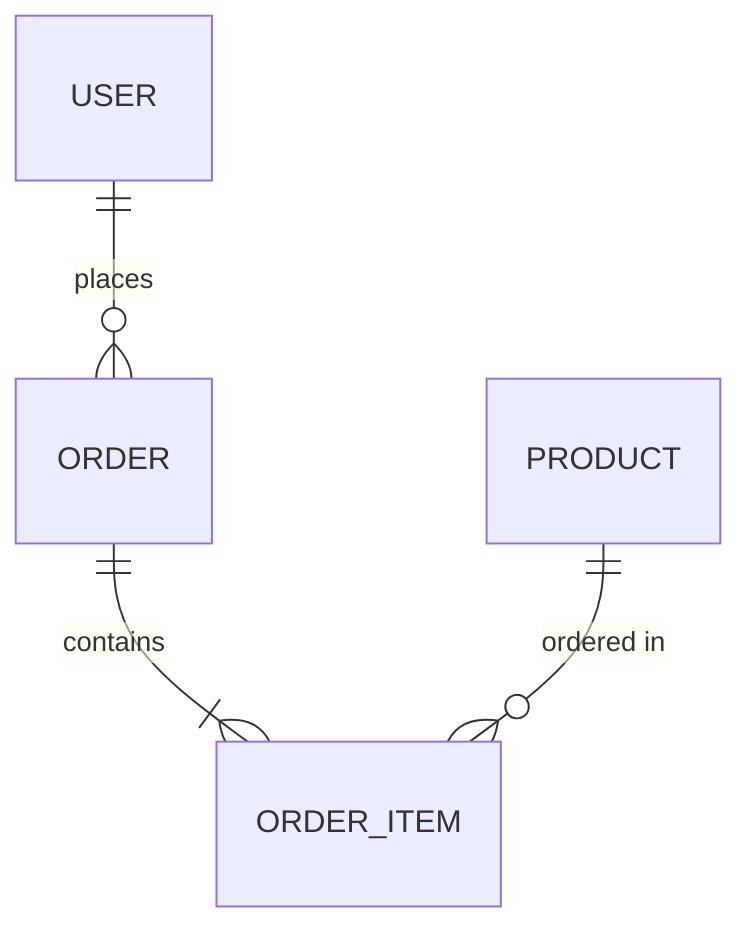

# 数据库文档最佳实践方案

> 版本: 2.1.0 | 日期: 2026-03-03 | 来源: Context7 + 业界实践

---

## 核心原则

### 文档作为索引入口（Index + Entry Pattern）

```
文档 = 索引 + 查询入口
     ≠ 数据库的完整复制
```

| 原则 | 说明 |
|------|------|
| **索引化** | 只记录核心元数据（表、关系、关键约束） |
| **可执行** | 提供 CLI 查询命令 |
| **轻量化** | 目标 < 200 行，< 10 KB |

---

## 产物结构标准

```
database-er.md
├── Frontmatter（元数据）
├── 概述（数据库类型/ORM）
├── 数据库连接（CLI 查询）
├── ER 图（表名 + 关系）
├── 核心关系（主表/从表/FK/基数）
├── 表清单（表名 + 用途）
└── 索引摘要（可选）
```

---

## ER 图最佳实践

### 标准：不列字段，只显示表名和关系



**图例**：
- `||--o{` = 一对多（左侧主表，右侧从表）
- `||--||` = 一对一
- 关系标签：业务含义

**❌ 禁止做法**：在 ER 图中列出所有字段
**✅ 正确做法**：只显示表名和关系线

---

## 关系符号规范

| 符号 | 含义 | 示例 |
|------|------|------|
| `||--o{` | 一对多 | `User ||--o{ Order : "places"` |
| `||--||` | 一对一 | `User ||--|| UserProfile : "has"` |
| `}o--o{` | 多对多 | `Student }o--o{ Course : "attends"` |

---

## CLI 查询方式

### 安全命令清单

| 数据库 | 列出表 | 查看结构 | 查看关系 |
|--------|--------|----------|----------|
| **MySQL** | `SHOW TABLES;` | `DESCRIBE table;` | `information_schema.KEY_COLUMN_USAGE` |
| **PostgreSQL** | `\dt` | `\d table` | `information_schema.table_constraints` |
| **SQLite** | `.tables` | `.schema table` | `PRAGMA foreign_key_list(table)` |
| **Oracle** | `SELECT * FROM user_tables;` | `DESC table` | `user_constraints` |
| **SQL Server** | `SELECT * FROM INFORMATION_SCHEMA.TABLES` | `sp_help 'table'` | `INFORMATION_SCHEMA.KEY_COLUMN_USAGE` |
| **MongoDB** | `db.getCollectionNames()` | `db.collection.findOne()` | N/A |

---

## 产物模板（通用版）

```yaml
---
last_updated: {{DATE}}
database_type: <MySQL/PostgreSQL/SQLite/Oracle/SQLServer/MongoDB>
cli_tool: <mysql/psql/sqlite3/sqlplus/sqlcmd/mongosh>
---

# <项目名> 数据库 ER 图

## 概述

- **数据库类型**: <类型>
- **开发环境**: <SQLite/MySQL 等>
- **生产环境**: <类型>
- **ORM 框架**: <Prisma/Django 等>

## 数据库连接

### CLI 查询

\`\`\`bash
# MySQL / MariaDB
mysql -h $DB_HOST -u $DB_USER -p db_name -e "DESCRIBE table_name;"
mysql -h $DB_HOST -u $DB_USER -p db_name -e "SHOW CREATE TABLE table_name;"

# PostgreSQL
psql -h $DB_HOST -U $DB_USER -d db_name -c "\d table_name"

# SQLite
sqlite3 path/to/db.sqlite3 ".schema table_name"
sqlite3 path/to/db.sqlite3 "PRAGMA table_info(table_name);"

# Oracle
sqlplus -s user/password@host:port/sid <<EOF
DESC table_name;
SELECT * FROM user_constraints WHERE table_name = 'TABLE_NAME';
EOF

# SQL Server
sqlcmd -S $DB_HOST -U $DB_USER -P $DB_PASSWORD -d db_name -Q "EXEC sp_help 'table_name';"

# MongoDB
mongosh --eval "db.getCollection('collection_name').findOne()"
\`\`\`

> 注：连接信息从环境变量或配置文件获取，不在此文档中硬编码

## ER 图

\`\`\`mermaid
erDiagram
    User ||--o{ Order : "places"
    Order ||--|{ OrderItem : "contains"
    Product ||--o{ OrderItem : "ordered in"
    Category ||--o{ Product : "categorizes"
\`\`\`

**图例**：`||--o{` 一对多，`||--||` 一对一

## 核心关系

| 主表 | 从表 | FK 字段 | 基数 | 关系说明 |
|------|------|---------|------|----------|
| User | Order | user_id | 1:N | 一个用户可下多个订单 |
| Order | OrderItem | order_id | 1:N | 一个订单包含多个明细 |
| Product | OrderItem | product_id | 1:N | 一个产品可在多个明细中 |

## 表清单

| 表名 | 用途 | 备注 |
|------|------|------|
| User | 用户账户 | 管理员和普通用户 |
| Order | 订单信息 | 订单主表 |
| OrderItem | 订单明细 | 订单包含的商品 |
| Product | 商品信息 | 商品主数据 |

## 索引摘要（可选）

> 仅列出 UNIQUE 约束和关键查询索引，普通索引省略。

| 表名 | 字段 | 类型 | 说明 |
|------|------|------|------|
| User | email | UNIQUE | 邮箱唯一 |
| Order | user_id | INDEX | 用户订单查询 |

> 💡 详细字段信息请使用上方 CLI 命令查询
```

### MongoDB 产物格式差异

\`\`\`yaml
---
database_type: MongoDB
---

## Collection 清单

| Collection | 用途 | 索引 |
|------------|------|------|
| users | 用户文档 | {email: 1}, {_id: 1} |
| orders | 订单文档 | {user_id: 1} |

## 查询示例

\`\`\`javascript
// 查看 Collection 结构
db.users.findOne()
// 查看索引
db.users.getIndexes()
\`\`\`
\`\`\`

---

## 质量检查清单

### 生成后自检

\`\`\`bash
# 1. 文件大小检查
wc -c docs/first/database-er.md  # 应 < 10KB
wc -l docs/first/database-er.md  # 应 < 200 行

# 2. 禁止内容检查（应无输出）
grep "## 表结构详情" docs/first/database-er.md
grep "## 字段详情" docs/first/database-er.md

# 3. 敏感信息检查（应无输出）
grep -i "password\|token\|secret" docs/first/database-er.md
\`\`\`

### 质量标准

| 检查项 | 要求 |
|--------|------|
| **文件大小** | < 10 KB / < 200 行 |
| **敏感信息** | 零泄露 |
| **ER 图** | 不显示表内字段 |
| **表结构详情** | 无逐表字段表格 |

---

## 参考来源

| 来源 | 链接 |
|------|------|
| Mermaid ER Diagram | https://mermaid.js.org/syntax/entityRelationshipDiagram.html |
| MySQL INFORMATION_SCHEMA | https://dev.mysql.com/doc/refman/8.0/en/information-schema.html |
| PostgreSQL Documentation | https://www.postgresql.org/docs/current/ |
| Oracle Documentation | https://docs.oracle.com/en/database/ |
| SQL Server Documentation | https://learn.microsoft.com/en-us/sql/ |
| MongoDB Documentation | https://www.mongodb.com/docs/ |
