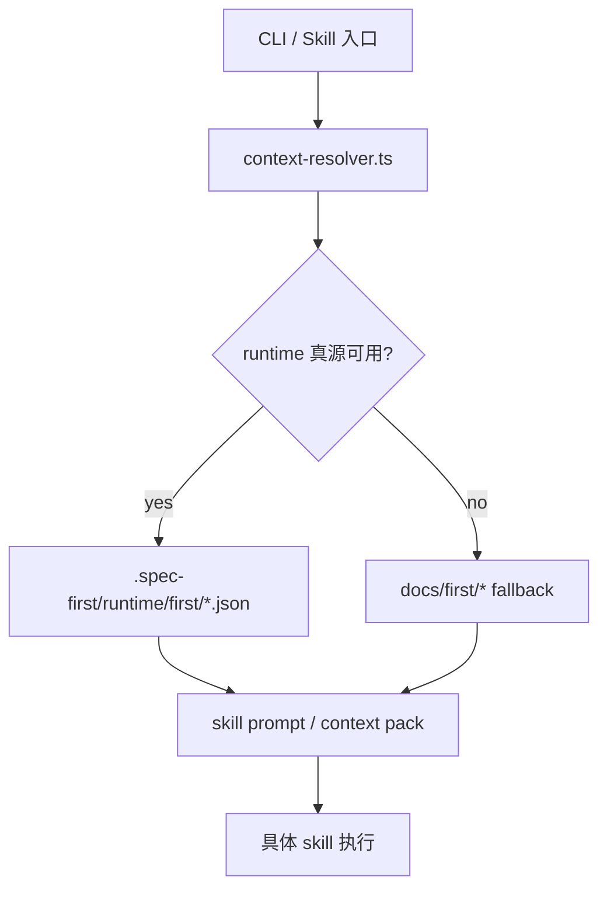
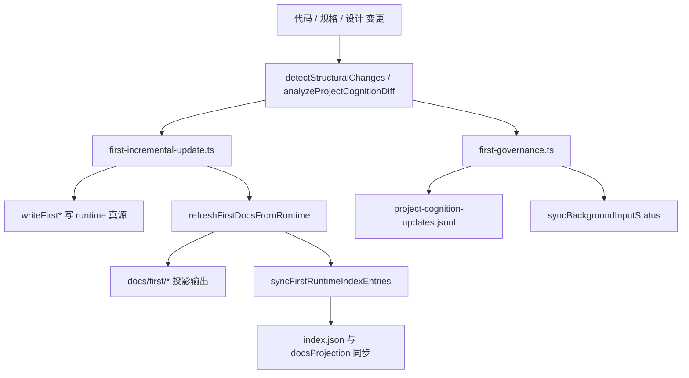
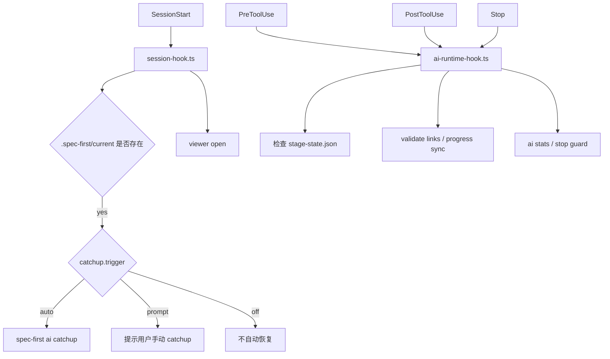

# Spec-First 记忆体系深度分析

> 基于当前仓库代码分析
>
> 分析目标：厘清项目里“记忆体系”有几层、各层怎么流转、在全流程 skill 中哪个节点负责写入、哪个节点负责更新、哪个节点负责实现
>
> 结论先行：这个项目不是单一记忆库，而是一个分层的知识与运行态系统。严格按代码边界看，可以拆成 5 层；如果把 skill 输入契约并入策略层，也可以收敛成 4 层主链路。

## 1. 一句话结论

这个仓库的“记忆”不是单点存储，而是由 4 条主链路 + 1 条辅助策略链路组成：

1. 真源层：`.spec-first/runtime/first/*.json`，是项目认知的 canonical truth。
2. Feature 运行态层：`specs/<featureId>/stage-state.json`、`task_plan.md`、`findings.md`、`todo-runner` 状态。
3. docs 投影层：`docs/first/*`，只是给人看的输出，不是 machine truth。
4. 会话 / Hook 层：`.claude/settings.json`、SessionStart / PreToolUse / PostToolUse / Stop hooks。
5. skill 输入契约层：`skills/skill-input-contracts.yaml`，决定每个 skill 该吃哪些上下文。

如果你问“哪个节点写入”，答案不是一个节点，而是一条分工链：

- 真源写入：`first-runtime-store.ts`
- 增量更新：`first-incremental-update.ts`
- 终局回写：`first-governance.ts`
- 会话注入与守卫：`session-hook.ts`、`ai-runtime-hook.ts`
- docs 投影：`first-doc-projection.ts`

## 2. 层级模型

| 层级 | 主要载体 | 是否真源 | 主要职责 | 典型写入节点 | 典型读取节点 |
| --- | --- | --- | --- | --- | --- |
| L0 真源层 | `.spec-first/runtime/first/index.json` + `summary.json` / `steering.json` / `conventions.json` / `critical-flows.json` / `entry-guide.json` / `api-contracts.json` / `structure-overview.json` / `domain-model.json` / `database-schema.json` | 是 | 保存项目级认知事实 | `first-runtime-store.ts` 的 `writeFirst*` 系列；`first-incremental-update.ts`；`first-governance.ts` | `first-context.ts`、`first-doc-projection.ts`、`context-resolver.ts`、`first.ts` |
| L1 Feature 运行态层 | `specs/<featureId>/stage-state.json`、`task_plan.md`、`findings.md`、`todo-runner` runtime | 是 | 保存某个 Feature 的阶段、任务、总结、背景状态 | `init`、`stage`、`catchup`、`ai-runtime-hook`、`context-sync.ts` | `catchup.ts`、`context-pack.ts`、`gate-engine`、`dispatcher.ts` |
| L2 docs 投影层 | `docs/first/*` | 否 | 给人阅读的知识输出层 | `first-doc-projection.ts` | `context-resolver.ts` 的 docs fallback、人工阅读 |
| L3 会话 / Hook 层 | `.claude/settings.json`、SessionStart / PreToolUse / PostToolUse / Stop | 否 | 把“当前会话该做什么”变成自动触发和守卫 | `session-hook.ts`、`ai-runtime-hook.ts`、`update.ts` | 宿主 Claude Code、session 启动流程 |
| L4 skill 输入契约层 | `skills/skill-input-contracts.yaml` | 否 | 决定 skill 该加载哪些 runtime 资产 | YAML 配置本身 | `context-resolver.ts` |

如果只看主记忆链路，可以把 L3 和 L4 合并，得到 4 层主模型：

1. 真源层。
2. Feature 运行态层。
3. docs 投影层。
4. 会话触发与上下文策略层。

## 3. 作用链路

### 3.1 读取链路

这条链路的关键点是：

- `context-resolver.ts` 先看 runtime 资产健康不健康，再决定是否降级到 docs。
- `docs/first/*` 只有在 canonical runtime 缺失或不健康时，才承担 fallback 角色。
- `skills/skill-input-contracts.yaml` 决定不同 skill 该优先吃哪些资产。

### 3.2 写入 / 更新链路

这条链路的关键点是：

- `first-incremental-update.ts` 负责“把结构变化写进 runtime 真源，再把 docs 投影刷新出来”。
- `first-governance.ts` 负责“终局判断 + 审计写回”，它写的是治理记录，不是普通业务产物。
- `syncFirstRuntimeIndexEntries()` 会把 runtime 资产和投影 docs 的健康状态同步回 `index.json`。
- `syncBackgroundInputStatus()` 会把整个项目的背景输入状态回写到每个 Feature 的 `stage-state.json`。

### 3.3 会话链路

这条链路的关键点是：

- `session-hook.ts` 负责会话开始时的恢复提醒和 viewer 启动。
- `ai-runtime-hook.ts` 负责写操作前后和 Stop 时的 guard / sync。
- 这层不是业务记忆本身，而是“记忆在宿主中的触发与守护机制”。

## 4. 各节点职责矩阵

| 节点 | 所属层 | 动作类型 | 角色判断 | 代码位置 |
| --- | --- | --- | --- | --- |
| `src/cli/commands/first.ts` | L0 | 校验 / 只读 | 不是写入节点，只验证 runtime 真源和 docs 输出是否已落盘 | `handleFirst()` |
| `src/cli/commands/ai.ts#context` | L0/L1 | 只读 | 组装上下文包，不写任何记忆 | `buildContextPack()` |
| `src/cli/commands/ai.ts#catchup` | L1 | 只读 | 读取 stage-state / task_plan / findings / todo 状态并输出恢复摘要 | `catchup()` |
| `src/core/skill-runtime/first-runtime-store.ts` | L0 | 写入 / 读取 | 真源 I/O 的底层入口 | `writeFirst*()` / `readFirst*()` |
| `src/core/skill-runtime/first-incremental-update.ts` | L0 + L2 | 更新 / 实现 | 把结构变化落实成 runtime 更新，再生成 docs 投影 | `incrementalUpdateRuntimeAssets()` |
| `src/core/skill-runtime/first-doc-projection.ts` | L2 | 实现 | 把 runtime 真源渲染成 `docs/first/*` | `renderProjectedDoc()` / `refreshFirstDocsFromRuntime()` |
| `src/core/skill-runtime/first-context.ts` | L0 + L1 | 更新 | 同步 runtime index、更新 backgroundInputStatus | `syncFirstRuntimeIndexEntries()` / `syncBackgroundInputStatus()` |
| `src/core/skill-runtime/first-governance.ts` | L0 + L1 | 写回 | 终局治理：写审计日志、同步背景状态 | `applyProjectCognitionWriteback()` |
| `src/core/tool-integration/session-hook.ts` | L3 | 触发 | 会话开始时注入路由 hint、自动 catchup、viewer 启动 | `registerSessionHooks()` |
| `src/core/tool-integration/ai-runtime-hook.ts` | L3 | 触发 / 守卫 | PreToolUse / PostToolUse / Stop hooks 的注册与执行 | `registerAIHooks()` |
| `src/core/skill-runtime/context-resolver.ts` | L4 | 策略 | 决定 skill 输入该取 runtime 还是 docs fallback | `SKILL_INPUT_MATRIX` / `resolveSkillAssetContract()` |
| `skills/skill-input-contracts.yaml` | L4 | 策略配置 | 定义每个 skill 的 required / recommended / optional 资产 | YAML 本身 |
| `src/cli/commands/update.ts` | L3 | 安装 / 注册 | 把 hooks、skills、viewer、MCP 基线一并补齐 | `refreshHostIntegrations()` |

## 5. 你关心的三个问题，直接回答

### 5.1 这个项目的记忆体系有几层模型

严格按代码边界看是 5 层：

1. 真源层。
2. Feature 运行态层。
3. docs 投影层。
4. 会话 / Hook 层。
5. skill 输入契约层。

如果你只关心主链路，可以压缩成 4 层，把第 5 层并入“会话 / 策略层”。

### 5.2 记忆体系的作用链路是什么

可以归纳成三条主链：

1. 读取链：`context-resolver.ts` 决定 runtime 真源还是 docs fallback，然后喂给 skill。
2. 更新链：`first-incremental-update.ts` 把结构变化写进 runtime，再刷新 docs 投影和 index。
3. 终局链：`first-governance.ts` 在 `wrap_up / done` 阶段做认知变更判定、审计写回、背景状态同步。

### 5.3 在全流程 skill 中，哪个节点写入，哪个节点更新，哪个节点实现

结论如下：

1. 写入节点：`first-runtime-store.ts` 的 `writeFirst*()` 系列是底层写入点；上层最明显的写回节点是 `first-governance.ts`。
2. 更新节点：`first-incremental-update.ts` 和 `first-context.ts` 是更新主力，前者负责内容变化，后者负责索引和状态同步。
3. 实现节点：`first-doc-projection.ts` 负责把真源“实现”为人可读的 docs 输出；`context-pack.ts` 负责把 feature 状态“实现”为上下文包；`catchup.ts` 负责把运行态“实现”为恢复摘要。

如果你要一句更硬的结论：

- 真源写入在 `first-runtime-store.ts`。
- 增量更新在 `first-incremental-update.ts`。
- 最终回写在 `first-governance.ts`。
- 会话触发在 `session-hook.ts` 和 `ai-runtime-hook.ts`。
- 人类可读输出在 `first-doc-projection.ts`。

## 6. 关键证据

| 代码文件 | 证据点 | 说明 |
| --- | --- | --- |
| `src/core/skill-runtime/first-runtime-store.ts` | `FIRST_RUNTIME_DIR`、`writeFirst*()`、`readFirst*()` | 真源 I/O 的统一入口 |
| `src/core/skill-runtime/first-context.ts` | `syncFirstRuntimeIndexEntries()`、`syncBackgroundInputStatus()` | 更新 index 与背景状态 |
| `src/core/skill-runtime/first-doc-projection.ts` | `renderProjectedDoc()`、`refreshFirstDocsFromRuntime()` | docs 投影输出层 |
| `src/core/skill-runtime/first-incremental-update.ts` | `incrementalUpdateRuntimeAssets()` | 结构变化驱动的增量更新 |
| `src/core/skill-runtime/first-governance.ts` | `applyProjectCognitionWriteback()`、`writeLog()` | 终局治理写回 |
| `src/core/ai-orchestrator/catchup.ts` | 6 步恢复流程 | 会话恢复主链路 |
| `src/core/ai-orchestrator/context-pack.ts` | 3 层上下文 + control/references | 上下文打包主链路 |
| `src/core/tool-integration/session-hook.ts` | SessionStart 决策树 | 会话自动恢复入口 |
| `src/core/tool-integration/ai-runtime-hook.ts` | PreToolUse / PostToolUse / Stop | 写操作守卫与同步 |
| `src/core/skill-runtime/context-resolver.ts` | runtime / docs fallback + skill 矩阵 | skill 输入策略层 |
| `skills/skill-input-contracts.yaml` | required / recommended / optional | skill 输入契约配置 |

## 7. 额外判断

1. `docs/first/*` 不是 truth source，它是输出层。
2. `spec-first first` 不是写入节点，它是校验 / 健康检查节点。
3. `catchup` 和 `context-pack` 不是写入节点，它们主要是消费和组织上下文。
4. `update.ts` 不是记忆内容生产节点，它是宿主集成和 hook 注册节点。
5. 这个系统的“记忆”核心不在单一文件，而在“真源 + 投影 + 守卫 + 策略”协同。

## 8. 最终判断

如果只问“这个项目的记忆体系到底是什么”，答案是：

它是一套以 `.spec-first/runtime/first/` 为真源、以 `specs/<featureId>/` 为运行态、以 `docs/first/` 为投影、以 `.claude/settings.json` 和 hook 为触发层、以 `skills/skill-input-contracts.yaml` 为输入策略层的分层记忆系统。

它的设计目标不是保存更多信息，而是保证：

1. 记忆可恢复。
2. 记忆可同步。
3. 记忆可投影。
4. 记忆可审计。
5. 记忆不会因为上下文压缩而丢失关键事实。
