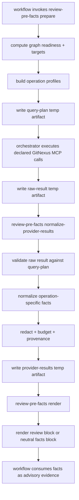

# GitNexus Harness context and evidence integration 技术方案

## 1. 文档定位

本文是 `docs/brainstorms/2026-05-26-001-gitnexus-workflow-context-evidence-requirements.md` 与 `docs/brainstorms/2026-05-26-002-gitnexus-integration-portfolio-80-20.md` 对应的完整技术方案文档，描述如何把 GitNexus 的深度能力接入 spec-first AI Coding Harness：`query`、`context`、`impact`、`detect_changes` 进入 `review-pre-facts` deterministic facts layer；`route_map`、`api_impact`、`shape_check`、`tool_map`、`cypher` 进入 workflow-native session lane；repo/group resources 与 group-aware `query/context/impact` 进入 workspace/group resource lane。

本文同时吸收 GitNexus 官方源码文档中暴露的完整能力面：deterministic helper 只固化四类高频事实操作，但 `route_map`、`api_impact`、`shape_check`、`tool_map`、`cypher`、group-aware `query/context/impact` 和 GitNexus resources 是完整实现范围的一部分。它们不进入 helper query-plan，而是进入 workflow-native session lane 或 workspace/group resource lane，由 SKILL/LLM 在具体任务中按任务域、read-only 边界、预算和 source confirmation 使用。

本文不是需求替代品，也不是执行进度记录。需求边界以 origin requirements 为主线 source of truth，portfolio 文档提供 80/20 成本排序和边界判断；实施拆分以 `docs/plans/2026-05-27-001-feat-gitnexus-bounded-pre-facts-plan.md` 为准。本文补足 plan 中不宜展开过细的技术设计：数据契约、operation profile、状态流、失败模式、redaction、metrics、workflow-native evidence envelope 和测试矩阵。

核心目标：

- 让 `review-pre-facts` 能生成 bounded GitNexus query-plan。
- 让 orchestrator 执行 GitNexus MCP 后，helper 能校验、归一化、预算、脱敏、渲染结果。
- 让 `spec-plan`、`spec-code-review`、`spec-debug` 消费同一类可信边界内的 graph facts。
- 让 GitNexus 官方深度能力通过三条通道进入 spec-first：deterministic helper、workflow-native session calls、workspace/group resources。
- 让 `spec-work`、`spec-write-tasks`、`spec-compound` / `spec-compound-refresh` 消费 source-confirmed graph evidence，用于 source-read focus、test focus、risk closeout 和知识沉淀。
- 继续保持 `Scripts prepare, LLM decides`：helper 只准备事实，LLM 仍决定 scope、finding、root cause、task ordering。

---

## 2. 设计原则

### 2.0 AI Coding Harness positioning

Harness 的精髓不是给 workflow 套一层框架，而是把不稳定的 AI 推理放进一个可重复、可观察、可约束、可验证的工程闭环。对 spec-first 来说，正确定位不是“一组 prompts / skills / commands”，而是：

```text
spec-first = AI Coding Harness for spec-driven software engineering
```

GitNexus 集成必须服务这条主链路，而不是把 spec-first 变成庞大的中心调度平台：

```text
Codebase -> Graph -> Spec -> Plan -> Tasks -> Code -> Review -> Knowledge
```

| Harness layer | Essence | This design's contribution |
|---|---|---|
| Context Harness | 给 AI 正确上下文，不给无限上下文 | `review-pre-facts` 生成 bounded GitNexus facts；resources/session-local calls 只做任务域上下文 |
| Execution Harness | 把任务执行变成可跟踪流程 | Graph evidence 进入 plan/task/work/review handoff，但不替代 plan/task scope |
| Evidence Harness | 结论必须有证据来源 | query-plan provenance、provider-results、source reads required、Coverage/debug ledger |
| Evaluation Harness | 记录有没有真的变好 | utilization metrics、graph-to-decision/finding/debug-hypothesis summaries |
| Governance Harness | 权限、边界、安全、降级 | redaction、mutation boundary、provider readiness、stale/degraded reason codes |
| Knowledge Harness | 把经验沉淀给下一次 | 只把 source-confirmed graph-informed learning 写入 `docs/solutions/` / compound |

GitNexus 主要增强 Context Harness 和 Evidence Harness：它提供代码图谱、symbol、调用关系、影响面和 diff/process evidence。但 GitNexus 不拥有任务范围、finding、root cause、自动修复、mutation 操作或 workflow 状态机权限。这是只把 `query/context/impact/detect_changes` 固化进 helper，同时把 API/tool/Cypher/group 能力纳入 session-local 或 resource lane 的根本原因。

### 2.1 Light contract

扩展现有三个 artifact，而不是创建第二条 facts pipeline：

- `review-pre-facts-query-plan.v1`
- `review-pre-facts-provider-raw-result.v1`
- `review-pre-facts-provider-results.v1`

所有新增字段采用 additive 演进，优先保持 `doc-review` / `code-review` 当前 query-only 行为兼容。

### 2.2 Explicit boundaries

边界分清：

| Layer | Owner | 职责 | 不负责 |
|---|---|---|---|
| `review-pre-facts` helper | script | readiness check、query-plan、schema validation、normalization、budget、redaction、render | scope、finding、root cause、业务优先级 |
| Orchestrator | workflow host | 只执行 query-plan 声明的 tool/operation/arguments，并写 raw result temp artifact | 临时改 arguments、追加未声明 operation |
| GitNexus MCP | provider | 返回 graph/code intelligence output | spec-first readiness truth、workflow decision |
| SKILL / LLM | workflow | 判断 evidence 如何影响 plan/review/debug | 假装执行确定性校验、忽略 source confirmation |

### 2.3 Helper-first, hook-light

核心治理放 helper 和 contract。SessionStart / startup reminder 只注入 readiness snapshot，不承载红线逻辑。

### 2.4 Summary-first, source-confirmed

`impact` 和 `detect_changes` 可能返回大量影响面或 diff 相关内容。durable output 只保留 summary、counts、repo-relative source-read candidates、risk hints 和 limitations；需要确认的结论必须回到 source/test/log/contract。

### 2.5 Source documents and authority

| Source | Role in this design | Authority |
|---|---|---|
| `docs/brainstorms/2026-05-26-001-gitnexus-workflow-context-evidence-requirements.md` | Defines helper lane, workflow-native lane, resource lane, operation scope, bounds, normalized result shape, rendering, safety and acceptance examples | Primary WHAT/scope source |
| `docs/brainstorms/2026-05-26-002-gitnexus-integration-portfolio-80-20.md` | Defines complete Harness lane model, 80/20 implementation ordering, marginal cost and mutation boundaries | Portfolio and sequencing source |
| `docs/plans/2026-05-27-001-feat-gitnexus-bounded-pre-facts-plan.md` | Defines implementation units and verification order | Execution planning source |
| Existing contracts under `docs/contracts/` | Define evidence policy, downstream consumption, provider readiness and pre-facts trust model | Governance source |
| GitNexus sibling repo docs: `GitNexus/README.md`, `GitNexus/ARCHITECTURE.md`, `GitNexus/AGENTS.md`, `GitNexus/GUARDRAILS.md` | Define official tool/resource capability, recommended agent use, staleness and pre-change impact posture | Provider capability source |

When these conflict, apply the narrower durable mechanism that preserves the complete Harness boundary: helper-owned bounded facts for deterministic operations, session/resource evidence envelope for task-domain native calls, LLM-owned semantic judgment, and metrics-guided future helper promotion.

### 2.6 Portfolio / Harness design coverage

| Portfolio item | Design coverage | Notes |
|---|---|---|
| F1 `review-pre-facts` 4 op extension | Sections 4-11, 14-16 | Deterministic helper lane spine |
| F2 utilization metrics | Section 12 | Metrics are retrospective evidence, not adoption theater |
| F3 startup readiness snapshot | Section 13 | Helper-first; host injection is a delivery surface, not governance authority |
| F4 redaction policy | Section 10 | Redaction is hard precondition for durable output |
| F5 `spec-write-tasks` consumption | Sections 5, 12, 16 | Task ordering/test focus only; no scope expansion |
| F6 `docs/solutions/` discoverability | Sections 16, 17 | Minimal instruction/discoverability change; no new knowledge pipeline |
| Workflow-native session lane | Sections 2.7, 2.8, 5.2, 15 | API/tool/Cypher capabilities are in scope through shared evidence envelope, not helper query-plan |
| Workspace/group resource lane | Sections 2.7, 2.8, 5.2, 15 | Repo/group resources orient multi-repo work without selecting write scope |
| Mutation-gated maintenance lane | Sections 10, 15, 17 | Preview-first/manual/setup governed; never ordinary workflow automation |

### 2.7 GitNexus official capability map

GitNexus 官方文档把 MCP 定位为 daily development 的 deep architectural view：`query` 用于 process-grouped search，`context` 用于 symbol 360-degree view，`impact` 用于 blast radius，`detect_changes` 用于 pre-commit / diff impact；同时还提供 API/tool surface、Cypher、自定义 resources 和 group-aware routing。spec-first 的集成策略不是把所有能力塞进一个 helper，而是按证据稳定性和治理边界分层消费。

| GitNexus capability | Official evidence depth | spec-first consumption lane | Deterministic helper use | Workflow-native / resource use | Governance boundary |
|---|---|---|---|---|---|
| `list_repos` / `gitnexus://repos` | indexed repo discovery, stats, staleness | workspace/group resource lane | no deterministic helper entry | workspace orientation and target repo disambiguation | advisory only; cannot select write scope by itself |
| `gitnexus://repo/{name}/context` | repo stats, staleness, available tools | workspace/group resource lane | startup/readiness snapshot input | session orientation before graph-heavy work | stale/degraded must be disclosed |
| `query` | process-grouped hybrid search, definitions, process symbols | deterministic helper + native session | yes | concept search before planning/debugging/review | bounded `limit`, `max_symbols`, no full content by default |
| `context` | symbol definition, categorized refs, process participation | deterministic helper + native session | yes | inspect key symbols before plan/work/debug | require unambiguous symbol or source confirmation |
| `impact` | upstream/downstream blast radius, affected modules/processes, risk | deterministic helper + native session | yes | pre-change and review impact analysis | local summary-first budget; provider `summaryOnly` only after schema proof |
| `detect_changes` | changed symbols and affected processes from git diff scopes | deterministic helper + native session | yes | review closeout, pre-commit, debug when diff-linked | no raw diff persistence; explicit scope required |
| `route_map` | route -> handler -> middleware/consumers | workflow-native session lane | no | API/web/backend planning and review | task-domain gated; only relevant when route evidence exists |
| `api_impact` | pre-change API route impact report | workflow-native session lane | no | API handler changes and response contract review | source/API contract confirmation required |
| `shape_check` | route response keys vs consumer property access | workflow-native session lane | no | API response drift and frontend/backend mismatch review | mismatch is finding candidate, not finding proof |
| `tool_map` | MCP/RPC tool definitions and handlers | workflow-native session lane | no | spec-mcp-setup, skill-audit, tool surface changes | useful for tool-facing tasks; utilization-gated helper candidate |
| `cypher` | arbitrary graph queries over schema | advanced native session lane | no | custom cross-module questions not answered by typed tools | schema-first, read-only, query budget and redaction required |
| group-aware `query/context/impact` | cross-repo or monorepo-service search/impact through `repo: "@group"` | workspace/group resource lane + native session | no generic helper entry | multi-repo planning/review when group status is fresh | cannot expand target repo; group status/contracts are advisory |
| `gitnexus://group/{name}/status` | group member and contract registry staleness | workspace/group resource lane | no | cross-repo readiness orientation | stale group evidence downgrades posture |
| `gitnexus://group/{name}/contracts` | provider/consumer contracts and cross-links | workspace/group resource lane | no | cross-service API/contract planning | contract refs require source confirmation |
| `rename` | coordinated graph + text rename, dry-run supported | manual mutation-gated lane | no | explicit user-approved refactor maintenance | never ordinary workflow auto-call |
| `group_sync` | rebuild group contract registry and bridge graph | manual mutation-gated lane | no | explicit graph maintenance | setup/bootstrap/manual only; not pre-facts |

### 2.8 Maximize GitNexus use strategy

Maximizing GitNexus in spec-first means picking the deepest useful graph primitive for the current workflow node, while keeping durable facts bounded and requiring source confirmation before decisions.

| Workflow node | GitNexus-first strategy | Durable output |
|---|---|---|
| `spec-plan` | Start with `query` for concepts/paths, then `context` for key symbols, then `impact` for shared helpers/refactors. For API work, use session-local `route_map` / `api_impact` / `shape_check`. For multi-repo work, read group status/resources and use group-aware `query/context/impact` only after target repo scope is explicit. | Graph / GitNexus Evidence block with capabilities used, key findings, source reads required, impact on plan, limitations |
| `spec-code-review` | Start with `detect_changes` for `staged`/`unstaged`/`compare`, then `impact` for high-risk changed symbols, then `context` for ambiguous ownership/call-chain questions. For API/tool changes, add session-local `api_impact` / `shape_check` / `tool_map`. | Coverage line plus advisory evidence summary; findings still need diff/source/test/contract proof |
| `spec-debug` | Start with `query` from symptom/stack trace, then `context` on suspect symbols, then upstream/downstream `impact` to test causal reach. Use `cypher` only when typed tools cannot answer a bounded graph question. | Hypothesis ledger `graph_evidence` plus non-graph causal-chain closure |
| `spec-work` / task execution | Consume plan/review graph evidence to prioritize source reads, tests and risk checks; before editing shared symbols, prefer session-local `impact`; before commit/review, prefer `detect_changes`. | Work closeout summary or run artifact records graph evidence used/rejected |
| `spec-write-tasks` | Use plan Graph / GitNexus Evidence for task ordering, `context_refs`, `test_focus`, and `stop_if`; never add new scope from graph alone. | Derived task-pack focus metadata |
| Knowledge / compound | Record only source-confirmed graph-informed lessons. Raw provider output is not durable knowledge. | concise docs/solutions entry with evidence provenance |

---

## 3. 当前基线与缺口

### 3.1 已有基线

`src/cli/helpers/review-pre-facts.js` 已具备：

- `prepare` / `normalize-provider-results` / `render` / `one-shot` 四种 mode。
- canonical graph readiness artifact 读取。
- current repo snapshot freshness check。
- temp run root boundary。
- path containment 与 symlink escape 防护。
- raw artifact 1 MiB、single-query 256 KiB、rendered block cap。
- provider-results provenance validation。
- degraded render。
- target-aware bounded direct reads。

### 3.2 真实缺口

当前缺口集中在一个 helper 链路：

| Function / Area | 当前行为 | 需要扩展 |
|---|---|---|
| `runReviewPreFacts()` workflow allowlist | 仅 `doc-review` / `code-review` | 增加 `plan` / `debug` profile |
| `LIMITS.maxFacts` / `renderedBlockChars` | 仅 review budgets | 增加 neutral workflow budgets |
| `buildQueryPlan()` | hardcode `gitnexus.query` | 生成 4 operation bounded plan |
| `validateQueryPlan()` | 仅校验字段存在 | 增加 operation allowlist / argument profile validation |
| `validateRawResult()` | 校验 query id/tool/operation | 增加 argument/provenance/annotation/mutation boundary |
| `normalizeRawFacts()` | query-shaped facts only | 分 operation normalizer |
| `validateProviderResults()` | excerpt/source-path centered | 支持 summary facts 与 operation-specific required fields |
| `renderFactsBlock()` | review-oriented wording | 增加 plan/debug neutral rendering |

---

## 4. 总体架构



关键点：

- `prepare` 不执行 GitNexus。
- orchestrator 只能执行 query-plan 中声明的 exact operation 和 arguments。
- `normalize-provider-results` 不信任 raw result，必须回查 query-plan。
- `render` 重新验证 provider-results schema 和 snapshot freshness。
- invalid provider-results 渲染为 legal degraded block，而不是把 raw output 注入 prompt。

---

## 5. Workflow Profiles

完整实现支持四个 deterministic helper workflow profile，并允许 workflow-native/session/resource evidence 在任务域匹配时补充上下文。

| Workflow | 目标 | 默认 operation strategy | Rendering |
|---|---|---|---|
| `doc-review` | 文档评审 pre-facts | 保持 query-first；非 query 只在明确 target/profile 下出现 | review-oriented |
| `code-review` | diff / changed files pre-facts | `detect_changes` for explicit diff scope；`impact` for safe changed targets；fallback `query` | review-oriented + Coverage |
| `plan` | 技术计划 graph orientation | `query` for paths/concepts；`context` / `impact` only for safe symbol targets | workflow-neutral |
| `debug` | bug hypothesis orientation | `query` / `context` for stack trace symbols/files；`detect_changes` only when debug is diff-linked | workflow-neutral |

### 5.1 Profile selection rule

Profile selection is deterministic and conservative:

- If a required target is absent, do not invent it.
- If symbol is ambiguous, degrade instead of asking LLM to guess.
- If graph is stale, emit no executable GitNexus query-plan and fallback to direct reads.
- If operation is outside deterministic helper scope, disclose `out_of_scope_for_deterministic_helper` and leave the capability to workflow-native/session/resource handling.

### 5.2 Workflow-native session/resource evidence envelope

`route_map`、`api_impact`、`shape_check`、`tool_map`、`cypher`、repo/group resources 和 group-aware `query/context/impact` 不进入 `review-pre-facts-query-plan.v1`，但完整实现必须让它们输出同一类 compact evidence envelope，避免 session-local tool calls 变成不可追溯的临时判断。

Recommended envelope fields:

```json
{
  "schema_version": "gitnexus-session-evidence.v1",
  "capability": "api_impact",
  "lane": "workflow-native-session",
  "tool_or_resource": "gitnexus.api_impact",
  "arguments_or_uri": { "route": "/api/example" },
  "repo_scope": "spec-first",
  "task_domain": "api-review",
  "provenance": {
    "source": "live-mcp",
    "tool_name": "gitnexus.api_impact"
  },
  "freshness": {
    "readiness": "session-local",
    "staleness": "unknown"
  },
  "summary": [],
  "source_reads_required": [],
  "limitations": [],
  "redaction_status": "none-required"
}
```

Envelope rules:

- It is advisory evidence, not a new durable helper namespace.
- It may be summarized into plan evidence, review Coverage, debug ledger, work closeout or compound docs only after redaction.
- It must list source reads required before any finding, root cause, task scope, API contract or knowledge claim is treated as confirmed.
- `cypher` envelope must additionally carry schema-read proof, bounded query text, result row/byte limits and redaction status.
- Group/resource envelope must carry target repo posture and cannot authorize writes outside explicit plan/task scope.

---

## 6. Operation Profiles

### 6.1 Common query-plan entry

Every executable query-plan entry keeps the existing v1 minimum fields:

```json
{
  "query_id": "q1",
  "provider": "gitnexus",
  "tool_name": "gitnexus.query",
  "operation": "query",
  "arguments": {},
  "target_refs": [],
  "max_results": 3,
  "reason_code": "provider_query_surface_available",
  "fallback_reason_code": "provider_query_unavailable"
}
```

New validation:

- `operation` must be one of `query`, `context`, `impact`, `detect_changes`.
- `tool_name` must match operation:
  - `query` -> `gitnexus.query`
  - `context` -> `gitnexus.context`
  - `impact` -> `gitnexus.impact`
  - `detect_changes` -> `gitnexus.detect_changes`
- `arguments` must match the operation profile.
- Mutation-capable operations are rejected even if GitNexus exposes them.

### 6.2 `query`

| Field | Value |
|---|---|
| Use case | code/symbol/process orientation |
| Required target | path, query text, or concept phrase |
| Default args | `repo`, `query`, `goal`, `limit`, `max_symbols`, `include_content=false` |
| Bounds | `limit <= 5`, `max_symbols <= 12`, no full content by default |
| Normalized fact kind | `query_symbol` |
| Required confirmation | source read for any behavior claim |

Example arguments:

```json
{
  "repo": "spec-first",
  "query": "review pre-facts for src/cli/helpers/review-pre-facts.js",
  "goal": "collect bounded semantic facts for workflow context",
  "limit": 3,
  "max_symbols": 8,
  "include_content": false
}
```

### 6.3 `context`

| Field | Value |
|---|---|
| Use case | symbol definition, type, incoming/outgoing references |
| Required target | `uid`, or `name + file_path/kind` |
| Default args | `repo`, `uid` or `name`, optional `file_path`, optional `kind`, `include_content=false` |
| Bounds | no full content; ambiguous symbol degrades |
| Normalized fact kind | `context_symbol` |
| Required confirmation | direct read of definition/callers before architectural decision |

Example arguments:

```json
{
  "repo": "spec-first",
  "name": "buildQueryPlan",
  "file_path": "src/cli/helpers/review-pre-facts.js",
  "kind": "Function",
  "include_content": false
}
```

### 6.4 `impact`

| Field | Value |
|---|---|
| Use case | blast radius, affected modules/processes, risk summary |
| Required target | explicit `target` and `direction` |
| Default args | `repo`, `target`, `direction`, `maxDepth`, `includeTests`, `relationTypes`, `timeoutMs` |
| Bounds | small `maxDepth` default, timeout, summary-first local truncation; provider summary options only after schema proof |
| Normalized fact kind | `impact_summary` |
| Required confirmation | source/test reads for affected surfaces before scope/test changes |

Example arguments:

```json
{
  "repo": "spec-first",
  "target": "buildQueryPlan",
  "file_path": "src/cli/helpers/review-pre-facts.js",
  "kind": "Function",
  "direction": "upstream",
  "maxDepth": 2,
  "includeTests": true,
  "relationTypes": ["CALLS"],
  "timeoutMs": 10000
}
```

Important correction: GitNexus README documents `summaryOnly` as an `impact` option, but the current host MCP tool schema available to spec-first must be treated as the executable contract. If that schema does not expose `summaryOnly`, the deterministic helper must not emit it. The stable boundary is local summary-first normalization and budget truncation; a provider-profile probe may add `summaryOnly` as an optimization after tool-schema proof.

### 6.5 `detect_changes`

| Field | Value |
|---|---|
| Use case | current diff / staged / compare changed symbols and affected processes |
| Required target | explicit `scope`, optional `base_ref` for compare |
| Default args | `repo`, `scope`, optional `base_ref` |
| Bounds | no raw diff persistence; changed-symbol/process summary only |
| Normalized fact kind | `detect_changes_summary` |
| Required confirmation | git diff/source/test confirmation before review finding or task scope changes |

Example arguments:

```json
{
  "repo": "spec-first",
  "scope": "compare",
  "base_ref": "main"
}
```

Allowed scopes:

- `staged`
- `unstaged`
- `all`
- `compare` with `base_ref`

---

## 7. Artifact Contracts

### 7.1 Query Plan

Schema version remains:

```text
review-pre-facts-query-plan.v1
```

Additive top-level fields:

```json
{
  "operation_profiles": ["query", "context", "impact", "detect_changes"],
  "workflow_profile": "plan",
  "limitations": []
}
```

Compatibility rule:

- Existing consumers can ignore these fields.
- `queries[]` remains the only executable list.

### 7.2 Raw Result

Raw result remains temp-only:

```text
review-pre-facts-provider-raw-result.v1
```

Recommended raw result entry:

```json
{
  "query_id": "q1",
  "tool_name": "gitnexus.context",
  "operation": "context",
  "arguments": {
    "repo": "spec-first",
    "name": "buildQueryPlan",
    "file_path": "src/cli/helpers/review-pre-facts.js"
  },
  "status": "ok",
  "tool_annotations": {
    "read_only": true,
    "destructive": false
  },
  "response": {}
}
```

Validation:

- `query_id` must exist in query-plan.
- `tool_name` / `operation` must equal query-plan entry.
- `arguments`, when present, must deep-match declared query-plan arguments.
- single response bytes must stay <= 256 KiB.
- tool annotation mismatch or missing proof may degrade with `tool_annotation_unverified`.

### 7.3 Provider Results

Schema version remains:

```text
review-pre-facts-provider-results.v1
```

Common fact fields:

```json
{
  "provider": "gitnexus",
  "query_id": "q1",
  "operation": "impact",
  "fact_kind": "impact_summary",
  "repo_scope": "spec-first",
  "target_refs": ["src/cli/helpers/review-pre-facts.js"],
  "readiness": "graph-fresh",
  "tier": "graph-fresh",
  "reason_code": "provider_impact_summary",
  "provenance": {
    "source": "live-mcp",
    "query_plan_id": "qplan-run-id",
    "tool_name": "gitnexus.impact",
    "operation": "impact"
  },
  "limitations": [],
  "redaction_status": "redacted"
}
```

Fact-kind specific fields:

| `fact_kind` | Required fields |
|---|---|
| `query_symbol` | `source_path`, `anchor` or `line_window`, `excerpt` |
| `context_symbol` | `symbol`, `disambiguation_status`, `relationships`, `source_reads_required` |
| `impact_summary` | `risk`, `affected_modules`, `affected_processes`, `by_depth_counts`, `source_reads_required` |
| `detect_changes_summary` | `scope`, `changed_symbols`, `affected_processes`, `source_reads_required`, `raw_diff_status` |

Backward compatibility:

- Existing query facts without `fact_kind` can be normalized internally as `query_symbol`.
- New non-query facts must carry `fact_kind`, `operation`, `limitations`, and `redaction_status`.

---

## 8. Normalization Design

### 8.1 Normalizer dispatch

Replace the single query-shaped normalization path with operation dispatch:

```text
normalizeRawFacts(raw, queryPlan, workflow)
  for each raw_result:
    query = queryById[raw_result.query_id]
    validate raw_result against query
    switch query.operation:
      query -> normalizeQueryResult
      context -> normalizeContextResult
      impact -> normalizeImpactResult
      detect_changes -> normalizeDetectChangesResult
```

### 8.2 `query` normalizer

Accepts current shapes:

- `response.facts[]`
- `response.process_symbols[]`
- `response.definitions[]`

Outputs `query_symbol` facts.

### 8.3 `context` normalizer

Expected useful fields from GitNexus:

- `symbol`
- `incoming.calls[]`
- `outgoing.calls[]`
- `processes[]`
- `filePath`, `startLine`, `endLine`
- ambiguous candidates when symbol resolution is not unique

Output summary:

```json
{
  "fact_kind": "context_symbol",
  "symbol": {
    "name": "buildQueryPlan",
    "kind": "Function",
    "file_path": "src/cli/helpers/review-pre-facts.js"
  },
  "disambiguation_status": "resolved",
  "relationships": {
    "incoming_calls": 1,
    "outgoing_calls": 2,
    "processes": 0
  },
  "source_reads_required": [
    "src/cli/helpers/review-pre-facts.js"
  ]
}
```

### 8.4 `impact` normalizer

Expected useful fields:

- `risk`
- `summary.direct`
- `summary.processes_affected`
- `summary.modules_affected`
- `affected_processes[]`
- `affected_modules[]`
- `byDepth`

Output keeps counts and bounded candidates:

```json
{
  "fact_kind": "impact_summary",
  "risk": "LOW",
  "affected_modules": [
    { "name": "Unit", "hits": 2, "impact": "direct" }
  ],
  "affected_processes": [
    {
      "name": "runPrepare",
      "file_path": "src/cli/helpers/review-pre-facts.js",
      "earliest_broken_step": 1
    }
  ],
  "by_depth_counts": {
    "1": 1,
    "2": 1
  },
  "source_reads_required": [
    "src/cli/helpers/review-pre-facts.js"
  ],
  "omitted_detail_reason": "impact_detail_summary_only"
}
```

### 8.5 `detect_changes` normalizer

Expected useful fields:

- changed symbols
- affected processes
- risk summary
- scope/base/worktree metadata

Output excludes raw diff:

```json
{
  "fact_kind": "detect_changes_summary",
  "scope": {
    "type": "compare",
    "base_ref": "main"
  },
  "changed_symbols": [
    {
      "name": "buildQueryPlan",
      "kind": "Function",
      "file_path": "src/cli/helpers/review-pre-facts.js"
    }
  ],
  "affected_processes": [],
  "risk": "MEDIUM",
  "raw_diff_status": "omitted",
  "source_reads_required": [
    "src/cli/helpers/review-pre-facts.js"
  ]
}
```

---

## 9. Rendering Design

### 9.1 Review rendering

Existing `doc-review` / `code-review` rendering remains compatible:

- still uses `<codebase-facts ...>` block;
- still warns that excerpts are untrusted quoted data;
- still includes source path, anchor/window and excerpt for query facts;
- adds a compact graph evidence summary for non-query facts when present;
- Coverage uses capabilities/degraded reasons once.

### 9.2 Neutral rendering

`plan` / `debug` use workflow-neutral wording:

```xml
<codebase-facts readiness="graph-fresh" tier="graph-fresh" workflow="plan">
Graph evidence summary:
- capabilities_used: query, context, impact
- advisory_status: graph evidence is advisory until source reads confirm it
- key_pointers:
  - context_symbol buildQueryPlan -> src/cli/helpers/review-pre-facts.js
  - impact_summary risk LOW, affected process runPrepare
- source_reads_required:
  - src/cli/helpers/review-pre-facts.js
- limitations:
  - impact detail summarized; byDepth omitted by budget
</codebase-facts>
```

Rules:

- Do not use reviewer-only words like `Coverage`, `finding`, `dispatch`, `persona`.
- Do not imply root cause or implementation scope.
- Always include source reads required for graph-informed claims.

---

## 10. Redaction And Safety

### 10.1 Durable output allowlist

Durable provider-results and rendered facts may retain:

- repo-relative paths;
- symbol names;
- function/class/interface kinds;
- counts;
- reason codes;
- redaction status;
- bounded excerpts for query facts;
- summarized affected modules/processes.

### 10.2 Durable output denylist

Durable output must not retain:

- raw provider stdout/stderr;
- raw diff hunks;
- absolute local paths;
- credentialed URLs;
- tokens, cookies, private keys, passwords;
- secret-denied file paths;
- internal hostnames;
- full private process/route dumps.

### 10.3 Redaction status

Allowed values:

- `none-required`
- `redacted`
- `redaction-degraded`

If redaction cannot safely produce bounded output, degrade the whole fact with a reason code.

### 10.4 Mutation boundary

Reject/degrade these from ordinary workflow facts extraction:

- `gitnexus.rename`
- `group_sync`
- provider refresh / repair / analyze / build / index
- arbitrary `cypher`
- any unrecognized GitNexus operation

---

## 11. Failure Modes And Reason Codes

Recommended stable reason codes:

| Code | Meaning | Mode |
|---|---|---|
| `operation_not_allowed` | operation not in deterministic helper allowlist | prepare / normalize |
| `operation_arguments_invalid` | arguments do not match profile | prepare / normalize |
| `context_target_ambiguous` | context target cannot be resolved deterministically | prepare |
| `impact_target_unavailable` | no explicit valid impact target | prepare |
| `detect_changes_scope_missing` | scope or base_ref missing | prepare |
| `provider_raw_result_query_mismatch` | raw result does not match query-plan | normalize |
| `provider_raw_result_too_large` | single response or total raw artifact exceeds cap | normalize |
| `tool_annotation_unverified` | required read-only/non-destructive proof unavailable | normalize |
| `provider_result_no_usable_facts` | raw response cannot produce safe facts | normalize |
| `provider_fact_budget_truncated` | facts truncated to budget | normalize |
| `provider_fact_redacted` | redaction changed durable output | normalize |
| `provider_fact_redaction_failed` | fact cannot be safely redacted | normalize |
| `out_of_scope_for_deterministic_helper` | requested GitNexus capability belongs to workflow-native/session/resource lane | render |
| `snapshot_mismatch` | provider-results snapshot differs from current repo | render |

---

## 12. Utilization Metrics

Metrics are for retrospective decisions, not user-visible proof by themselves.

### 12.1 Run summary extension

Add to `review-pre-facts-run-summary.v1`:

```json
{
  "graph_capability_usage": {
    "capabilities_used": ["query", "context", "impact"],
    "operation_counts": {
      "query": 1,
      "context": 1,
      "impact": 1,
      "detect_changes": 0
    },
    "degraded_reason_counts": {},
    "source_reads_required_count": 3,
    "redaction_status": "redacted"
  }
}
```

### 12.2 Decision linkage

Downstream workflow may summarize:

- graph facts used for file selection;
- graph facts used for test focus;
- graph facts only recorded as risk;
- graph facts rejected after source read.

Do not use call count alone as ROI evidence.

---

## 13. Startup Readiness Snapshot

### 13.1 Snapshot payload

The snapshot producer reads canonical artifacts and current repo snapshot, then emits compact text:

```text
GitNexus readiness: query_ready=true, provider=gitnexus, freshness=stale, posture=fallback.
Capabilities: query/context available; impact limited; detect_changes requires explicit scope.
Reason: source_revision mismatch; use direct reads before graph-backed claims.
```

Target size: <= 500 tokens.

### 13.2 Injection surfaces

| Host | Surface | Notes |
|---|---|---|
| Claude | existing `templates/claude/hooks/session-start` appends startup snapshot | deterministic hook exists |
| Codex | `startup-reminder --codex` / managed instruction route, plus lifecycle hook templates when source/runtime hook governance opts in | same snapshot producer; host-specific delivery must stay source-first |

Codex lifecycle hooks are known to exist. This design treats hook parity as a governance contract problem, not as a reason to move graph policy into hooks: both hosts should consume the same helper-owned readiness snapshot, while templates/init/doctor/clean delivery remains governed by source/runtime boundary tests when those surfaces are changed.

---

## 14. Test Strategy

### 14.1 Unit tests

Primary file:

- `tests/unit/review-pre-facts-helper.test.js`

Coverage:

- query-plan generation for each operation;
- operation allowlist rejection;
- argument shape validation;
- raw result query-plan matching;
- single-query and total raw size caps;
- provider-results validation by fact kind;
- redaction;
- review rendering compatibility;
- neutral rendering for plan/debug;
- snapshot mismatch downgrade.

### 14.2 Fixtures

Add synthetic fixtures only:

- `query-plan.multi-operation.json`
- `provider-raw-result.context.json`
- `provider-raw-result.impact.json`
- `provider-raw-result.detect-changes.json`
- `provider-results.multi-operation.json`

Fixtures must not contain hszq-app raw names, private process dumps, absolute paths, tokens, internal URLs or copied provider output.

### 14.3 Skill / contract tests

Add or update:

- `tests/unit/spec-plan-contracts.test.js`
- `tests/unit/spec-code-review-contracts.test.js`
- `tests/unit/spec-debug-contracts.test.js`
- `tests/unit/spec-write-tasks-contracts.test.js`
- `tests/unit/spec-work-contracts.test.js`
- focused graph evidence / workspace GitNexus contract tests when session/resource envelopes change
- `tests/unit/instruction-bootstrap.test.js`
- `tests/unit/claude-settings.test.js`

### 14.4 Recommended verification commands

Narrow checks during implementation:

```bash
npm run test:unit -- review-pre-facts-helper
npm run test:unit -- spec-plan-contracts
npm run test:unit -- spec-code-review-contracts
npm run test:unit -- spec-debug-contracts
npm run test:unit -- spec-write-tasks-contracts
```

Before merge:

```bash
npm run typecheck
npm run test:unit
npm run build
```

Run broader smoke/integration only if implementation changes CLI command discovery, runtime generation or package surface.

---

## 15. Requirement Coverage Matrix

### 15.1 Origin requirements coverage

| Requirement | Design coverage |
|---|---|
| R1 operation allowlist | Sections 6, 7, 11 |
| R2 executable query-plan contract | Sections 6.1, 7.1 |
| R3 resource/tool separation | Sections 2.2, 7.1 |
| R4 query bounds | Section 6.2 |
| R5 context bounds | Section 6.3 |
| R6 impact bounds | Section 6.4 |
| R7 detect_changes bounds | Section 6.5 |
| R8 operation-specific normalized evidence | Sections 7.3, 8 |
| R9 common metadata | Section 7.3 |
| R10 query facts compatibility | Sections 8.2, 9.1 |
| R11 context facts | Sections 6.3, 8.3 |
| R12 impact facts | Sections 6.4, 8.4 |
| R13 detect_changes facts | Sections 6.5, 8.5 |
| R14 review backward compatibility | Section 9.1 |
| R15 plan/debug neutral rendering | Section 9.2 |
| R16 existing downstream evidence shapes | Sections 5, 9 |
| R16a shared session/resource evidence envelope | Sections 5.2, 7.3, 15.3 |
| R16b route/API/shape workflow-native evidence | Sections 2.7, 5.2, 15.3 |
| R16c tool_map workflow-native evidence | Sections 2.7, 5.2, 15.3 |
| R16d cypher read-only/budget/redaction evidence | Sections 2.7, 5.2, 15.3 |
| R16e repo/group resource and group-aware evidence | Sections 2.7, 5.2, 15.3 |
| R16f spec-work graph evidence consumption | Sections 2.8, 12, 16 |
| R16g knowledge workflow evidence boundary | Sections 2.8, 16, 17 |
| R17 existing safety limits | Sections 7, 10, 11 |
| R18 annotation verification | Sections 7.2, 10, 11 |
| R19 raw result provenance matching | Sections 7.2, 11 |
| R20 mutation prohibition | Sections 10.4, 11 |
| R21 durable output redaction | Section 10 |
| R22 private repo evidence boundary | Sections 10, 14.2 |

### 15.2 Portfolio coverage

| Portfolio requirement | Design coverage | Completion evidence expected after implementation |
|---|---|---|
| F1 4 operation helper extension | Sections 4-11, 14 | Non-query operation appears in `review-pre-facts-query-plan.v1`, normalizes, renders and is covered by unit fixtures |
| F2 utilization metrics | Section 12 | Run summary or workflow summary exposes `capabilities_used[]`, operation counts and degraded reason counts |
| F3 startup readiness snapshot | Section 13 | Claude startup path and Codex startup-reminder path can show <=500 token GitNexus readiness snapshot |
| F4 redaction | Section 10 | `detect_changes` raw diff and private identifiers do not persist into provider-results or rendered facts |
| F5 task consumption | Sections 5, 12, 16 | `spec-write-tasks` prose/tests consume plan graph evidence for `context_refs`, ordering and `test_focus` without scope expansion |
| F6 discoverability | Sections 16, 17 | Checked-in host instructions or managed bootstrap make `docs/solutions/` discoverable without mandatory pre-read |
| Workflow-native session evidence | Sections 2.7, 5.2, 15.3 | API/tool/Cypher calls produce compact evidence envelopes with source reads, limitations and redaction |
| Workspace/group resource evidence | Sections 2.7, 5.2, 15.3 | Repo/group resources orient multi-repo work without selecting write scope |
| Work / Knowledge consumption | Sections 2.8, 12, 16, 17 | `spec-work` and compound/refresh consume only advisory, source-confirmed graph evidence |

### 15.3 Non-helper and mutation-gated coverage

| Capability / item | Design treatment |
|---|---|
| `tool_map` | Workflow-native session evidence for tool/MCP/RPC surface tasks; utilization decides only whether it is later promoted into deterministic helper |
| `route_map` / `api_impact` / `shape_check` | Workflow-native session evidence for API/web/backend tasks; not deterministic helper scope |
| `cypher` | Advanced workflow-native capability with schema-first read-only proof, bounded query/result budget and redacted summary |
| `list_repos` / `group_list` | Resource/workspace orientation and readiness facts; not helper duplication |
| `group_sync` / `rename` | Permanently out of ordinary workflow helper; mutation-gated maintenance only |
| Codex / Claude hook parity | Shared readiness snapshot plus source/runtime governance tests; hooks remain delivery surfaces, not policy owners |

---

## 16. Rollout Sequence

1. Contract and schema baseline.
2. Query-plan operation profiles.
3. Operation-specific normalizers.
4. Rendering split: review vs neutral.
5. Safety/redaction hardening.
6. Workflow prose updates for plan/review/debug.
7. Workflow-native session and workspace/resource evidence envelope.
8. Utilization metrics.
9. Startup readiness snapshot.
10. `spec-write-tasks` / `spec-work` / knowledge consumption and `docs/solutions/` discoverability.
11. README / changelog / package-surface validation.

This order keeps existing review behavior stable while adding deeper GitNexus evidence behind tests.

---

## 17. Non-Goals Reconfirmed

Not in the deterministic helper query-plan:

- `route_map`
- `api_impact`
- `shape_check`
- `tool_map`
- `cypher`
- `list_repos` / `group_list` helper integration
- group-level helper query-plan entries

Not in ordinary workflow automation:

- `group_sync`
- `rename`
- provider refresh / repair / analyze
- raw hszq-app fixture or raw private provider output

The distinction matters: API/tool/Cypher/group features are valid GitNexus capabilities and are in scope through workflow-native/session/resource lanes when the task domain warrants them. They are simply not part of the deterministic pre-facts helper because their argument choice, budget and confirmation rules depend on task semantics. Mutation-capable features remain manual, preview-first or setup/bootstrap governed.

---

## 18. Final Judgment

This design is the complete technical design for the two GitNexus requirements documents. It intentionally maximizes useful GitNexus evidence through bounded Harness lanes instead of turning spec-first into a central graph platform or workflow engine.

The expected capability lift is concrete:

- `spec-plan` gets better implementation context and source-read focus.
- `spec-code-review` gets better diff impact orientation without weakening finding evidence rules.
- `spec-debug` gets better hypothesis formation while preserving non-graph root-cause confirmation.
- `spec-work` / `spec-write-tasks` get better task ordering, source-read and test-focus inputs.
- Workflow-native API/tool/Cypher/group evidence becomes governed, redacted and source-confirmed instead of ad hoc session context.
- Knowledge workflows can preserve only source-confirmed graph-informed learning.
- Helper promotion decisions become data-gated instead of opinion-driven.

The design stays aligned with spec-first's core rule and Harness positioning: scripts prepare bounded facts; LLMs decide what those facts mean; metrics decide whether the next capability expansion is worth carrying into the durable system.
