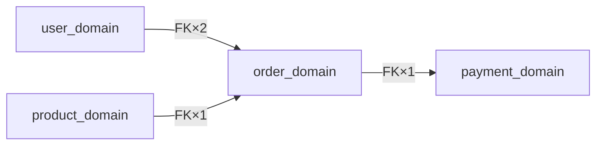

# Database 四层索引方案

> 适用于 `spec-graph-bootstrap` database worker 输出规范。
> 解决单文件 `database-er.md` 无法表达"系统运转体系"的问题。
>
> 作者: 2026-04-16 | 基于业界 Text-to-SQL / Context Engineering / Semantic Catalog 研究

---

## 背景与问题

传统 ERD 只表达**结构**（表 + 字段 + FK）。对 LLM 消费来说三层 context 缺一不可：

| Context 层 | 内容 | 传统 ERD 覆盖？ |
|---|---|---|
| Schema context | 表结构、字段类型、FK 关系 | ✅ |
| Business context | 表的业务含义、字段语义、状态机定义 | ❌ |
| Flow context | 数据在核心业务场景下如何流动 | ❌ |

单文件 ER 还有规模问题：**Mermaid erDiagram 超过 30 张表后可读性急剧下降**，200 张表的系统用单图无法表达。

---

## 四层索引结构

### 总体目录

```
docs/contexts/<slug>/database/
  database-index.md          # Tier 0：总索引（所有规模必须生成）
  data-flow.md               # Tier 2：核心业务场景数据流叙事（所有规模必须生成）
  database-er.md             # Tier 1A：≤30 张表时的全量 ER（单文件）
  domains/                   # Tier 1B：>30 张表时按域拆分
    <domain>-domain.md × N
  semantic-catalog.md        # Tier 3：>100 张表时的语义卡片全集
```

---

## Tier 0：database-index.md（总索引）

**目标**：让 LLM 在不读完所有内容的情况下，快速定位相关域和关键表。

**必须包含：**

```markdown
# <项目名> 数据库索引

Generated: <ISO date> | spec-graph-bootstrap

## 概览
- 总表数（过滤后）: N
- 业务域数: M
- 主要数据库类型: MySQL <version>

## 业务域清单

| 域 | 核心表（≤5 个） | 简述 | 详情 |
|---|---|---|---|
| order_domain | orders, order_items, payments | 下单→支付主链路 | [→](domains/order-domain.md) |
| user_domain  | users, profiles, auth_tokens | 用户身份与认证 | [→](domains/user-domain.md) |

## 核心实体快查

| 表名 | 业务名 | 实体类型 | 所属域 |
|---|---|---|---|
| orders | 订单 | 事务 | order_domain |
| users  | 用户 | 主数据 | user_domain |

## 跨域接口

| 源域 | 目标域 | 桥接字段 | 基数 |
|---|---|---|---|
| user_domain | order_domain | orders.user_id → users.id | 1:N |
| product_domain | order_domain | order_items.product_id → products.id | N:1 |

## 业务术语速查

| 业务术语 | 映射表.字段 | 操作类型 |
|---|---|---|
| 下单 | orders (INSERT), order_items (INSERT) | 写入 |
| 支付 | payments.status → confirmed | 状态变更 |
| 查订单 | orders + order_items (SELECT) | 读取 |
| 锁库存 | inventory.stock (UPDATE) | 写入 |
| 退款 | refunds (INSERT), orders.status → cancelled | 写入+状态变更 |

## 域间依赖拓扑（仅中型/大型系统，2+ 域时生成）



## Live Query

> 生成时间: <ISO date> | 以下命令基于 bootstrap 时的连接配置，数据可能已过期

快速验证命令（db_access_level=Level1 时）：
- 查表结构: `mcp__mysql-mcp-server__execute_query("SHOW CREATE TABLE <table_name>")`
- 查数据样本: `mcp__mysql-mcp-server__execute_query("SELECT * FROM <table_name> LIMIT 5")`
- 查索引: `mcp__mysql-mcp-server__execute_query("SHOW INDEX FROM <table_name>")`

快速验证命令（db_access_level=Level2 时）：
- 查表结构: `mysql -h $DB_HOST -u $DB_USER -p$DB_PASS -e "SHOW CREATE TABLE <table_name>"`
- 查数据样本: `mysql -h $DB_HOST -u $DB_USER -p$DB_PASS -e "SELECT * FROM <table_name> LIMIT 5"`
```

**生成规则：**
- 域划分：按 FK 连通分量聚类，同一连通分量优先归同一域；跨连通分量的表按命名前缀归域（如 `order_*` → order_domain）
- 实体类型分类（按命名 + 字段结构推断）：
  - `主数据`：有 name/title 字段，被多域 FK 引用
  - `事务`：有 status + created_at + amount/total 字段
  - `状态机`：有 status enum + updated_at，通常无独立业务语义
  - `关系`：纯 FK 对 —— 两个 FK 字段 + 少量属性
  - `配置`：有 key/value 或 code/name 模式
  - `审计`：有 operator/action + created_at，无 updated_at
  - `缓存`：有 expires_at 或 ttl 字段
- Entity Map（业务术语速查）生成策略：
  - 从 `data-flow.md` 场景标题提取动词（如"下单"→ 写入，"查询"→ 读取，"审核"→ 状态变更）
  - 从 `fact-inventory.entrypoints`（HTTP 类型）的 path 推断操作语义（POST→写入，GET→读取，PUT/PATCH→状态变更）
  - 从表名/列名的中文 COMMENT 或命名推断业务术语（如 `orders` → 订单，`user_id` → 用户）
  - 仅保留核心业务术语（≤15 行），不求穷举
- 域间依赖拓扑图生成策略：
  - 仅对中型（2+ 域）和大型系统生成
  - Mermaid `graph LR` 格式，节点 = 域名，边 = 该方向的 FK 数量标注
  - 边的 FK 数量统计自跨域接口表
  - 小型系统（单域或域数=1）不生成
- Live Query 提示生成策略：
  - 根据 `fact-inventory.database[].db_access_level` 生成对应的查询指令模板：
    - Level1（MCP）→ `mcp__mysql-mcp-server__execute_query(...)` 格式
    - Level2（CLI）→ `mysql -h $DB_HOST ...` 格式（只写变量名，不写值，符合凭据保护规则）
  - 包含 ISO 格式生成时间戳，提示文档可能过期
  - 每次 bootstrap 重跑自动更新时间戳（auto 段重写时更新）

---

## Tier 1A：database-er.md（≤30 张表，全量单文件）

**沿用当前规范**，附加要求：
- erDiagram 后追加 `## 核心业务关系` 一节（自然语言解释主要 FK 语义）
- 末尾追加指向 `data-flow.md` 的链接

---

## Tier 1B：domains/<name>-domain.md（31–100 张表，按域拆分）

**每个文件结构：**

```markdown
# <DomainName> Domain

## ER 图
\`\`\`mermaid
erDiagram
  orders {
    int id PK
    int user_id FK
    enum status
    decimal total_amount
  }
  order_items {
    int id PK
    int order_id FK
    int product_id FK
    int quantity
  }
  orders ||--o{ order_items : "包含"
\`\`\`

## 域内数据流（主要业务场景）
1. 用户提交订单 → `orders` INSERT (status=pending)
2. 逐行写入 `order_items`
3. 库存锁定（跨域：→ product_domain.inventory）

## 跨域接口
| 字段 | 目标域.表 | 语义 |
|---|---|---|
| orders.user_id | user_domain.users | 下单用户 |
```

**约束：**
- 单个 erDiagram 块 ≤ 25 张表
- 跨域 FK 在 erDiagram 中用注释标注，不画跨文件连线

---

## Tier 2：data-flow.md（所有规模必须生成）

**这是整套方案中价值最高的文档**，直接回答"系统如何运转"。

**结构：**

```markdown
# <项目名> 数据流

> 描述核心业务场景下数据在各表间的流动路径。

## 场景 1：<主要业务场景，如"用户下单"》

**触发点**：<API endpoint 或事件，如 POST /orders>

数据流路径：
1. `user_domain.users` — 身份验证（SELECT WHERE id=?）
2. `product_domain.inventory` — 库存锁定（UPDATE stock -= quantity）
3. `order_domain.orders` — 创建订单（INSERT, status=pending）
4. `order_domain.order_items` — 写入行项目（INSERT × N）
5. `payment_domain.payments` — 创建支付单（INSERT, status=awaiting）

状态机（orders.status）：
\`\`\`
pending ──支付成功──→ confirmed ──发货──→ shipped ──签收──→ completed
   └──超时/取消──→ cancelled
\`\`\`

### 时序交互图（可选，涉及 2+ 系统组件时生成）
\`\`\`mermaid
sequenceDiagram
    participant Client
    participant OrderService
    participant InventoryService
    participant PaymentService
    Client->>OrderService: POST /orders
    OrderService->>InventoryService: 锁定库存
    InventoryService-->>OrderService: 库存确认
    OrderService->>PaymentService: 创建支付单
    PaymentService-->>OrderService: 支付单号
    OrderService-->>Client: 订单创建成功
\`\`\`

## 场景 2：<第二主要业务场景>
...（3–5 个场景，覆盖系统核心价值链）

## 高频写入路径（风险提示）
| 路径 | 频率估计 | 涉及表 | 风险 |
|---|---|---|---|
| 下单 | 高 | orders + order_items + inventory | 库存并发竞态 |
```

**生成策略：**
- 从 `fact-inventory.entrypoints`（HTTP/worker 类型）推断业务场景入口
- 从 `risk-signals`（high severity）识别高频/高风险路径
- 场景数量：3–5 个（覆盖 80% 核心价值链，不求穷举）
- 状态机：只为有 `status` enum 字段的核心事务表绘制
- 时序交互图（sequenceDiagram）：
  - 生成条件：场景涉及 2+ 系统组件/服务时生成（如 OrderService → InventoryService → PaymentService）
  - 不生成条件：单库 CRUD 场景（如"查询用户信息"仅涉及 users 表 SELECT）
  - 位于编号步骤 + 状态机之后，作为可选补充
  - 参与者命名：使用业务服务名（如 OrderService），不使用表名

---

## Tier 3：semantic-catalog.md（>100 张表必须生成）

**目标**：为每张表提供机器可读的语义卡片，支持 RAG/Text-to-SQL 场景。

**每张表的卡片格式：**

```markdown
## <table_name>

- **业务名**: <中文业务名>
- **实体类型**: 主数据 / 事务 / 状态机 / 关系 / 配置 / 审计 / 缓存
- **所属域**: <domain_name>
- **核心字段**: `id`(PK), `user_id`(FK→users), `status`(enum: pending/confirmed/...), `total_amount`(decimal)
- **索引提示**: 按 `user_id + status` 高频查询；按 `created_at` 分区
- **核心约束**: `UNIQUE(email)`; `CHECK(status IN ('pending','confirmed','shipped','completed','cancelled'))`; `DEFAULT(currency='CNY')`; `COMMENT '订单主表'`
- **关联**: `user_id` → `users.id`（下单用户）；`order_items.order_id` → `orders.id`（行项目）
- **业务说明**: 一句话描述该表在业务中的角色
```

**生成策略：**
- 字段来自 `SHOW CREATE TABLE` / `DESCRIBE` 结果
- 实体类型按 Tier 0 的分类规则推断
- 索引提示来自 `SHOW CREATE TABLE` 中的 INDEX/KEY 定义
- 业务说明：表名 → 推断（如 `order_items` → "订单行项目，记录每笔订单中的商品明细"）
- 核心约束：来自 `SHOW CREATE TABLE` 输出，仅保留非 trivial 约束（Schemonic 式精选）：
  - `UNIQUE` 约束（业务唯一性）
  - `CHECK` 约束（值域限制）
  - 有业务含义的 `DEFAULT`（排除 NULL、AUTO_INCREMENT、CURRENT_TIMESTAMP 等通用默认值）
  - 有业务含义的 `COMMENT`（字段或表级注释）
  - 不包含：NOT NULL（过于普遍）、AUTO_INCREMENT（PK 标准配置）、普通 INDEX/KEY（已在索引提示中覆盖）

---

## 规模-产物矩阵

| 规模 | 过滤后表数 | 必须生成 | 按需生成 |
|---|---|---|---|
| 小型 | ≤ 30 | `database-index.md` + `data-flow.md` + `database-er.md` | — |
| 中型 | 31–100 | `database-index.md` + `data-flow.md` + `domains/*.md` | `semantic-catalog.md`（可选） |
| 大型 | > 100 | 全四层（所有文件） | — |

---

## injection-index.yaml 映射

```yaml
# 数据库文档由 stages 段按阶段注入（文件不存在时被 context-routing 静默过滤）
# 不再使用 output_exists.database_* 全局注入——避免 work 阶段无差别加载数据库上下文
#
# 设计意图：
# - plan 阶段：需要域概览来做技术方案决策，注入轻量的 database-index.md
# - review 阶段：需要数据流和风险信息来审查变更影响，注入 database-index.md + data-flow.md
# - work 阶段：agent 按需 Read 具体文件，不预注入数据库文档（节省 context window）
# - unknown 阶段：保守策略，仅注入 README.md（与当前行为一致）

stages:
  plan:
    - database/database-index.md      # 轻量域概览（文件不存在时静默跳过）
  review:
    - database/database-index.md      # 域概览 + 跨域影响（文件不存在时静默跳过）
    - database/data-flow.md           # 数据流路径和风险提示（文件不存在时静默跳过）

selection_rules:
  # database 文档已迁移至 stages 段，不再在 selection_rules 中按 output_exists 注入
  # domains/*.md 和 semantic-catalog.md 由调用方按需引用，不在 injection-index 中全量注入
```

---

## manual 段 ADR 引导规范

所有数据库文档的 `<!-- spec-graph-bootstrap:manual:start -->` 段内提供 ADR（Architecture Decision Record）式结构化引导注释，帮助团队在正确的位置补充正确类型的信息。bootstrap 永远不触碰 manual 段内容。

**各文件的 manual 段引导内容：**

| 文件 | 引导主题 | 说明 |
|------|----------|------|
| `database-index.md` | 业务背景、已知技术债、命名约定 | 全局性的数据库决策和约定 |
| `database-er.md` / `domains/*.md` | 软删除规则、分区策略、业务约束 | 域级别的架构决策 |
| `data-flow.md` | 不适用 | 人工优先模式，整个文件都是可编辑的 |
| `semantic-catalog.md` | 字段命名不一致、废弃字段、历史包袱 | 表级别的已知问题记录 |

**引导格式**：每个 manual 段内以 HTML 注释形式提供三级标题模板（`### 标题`），团队编辑时删除外层 `<!-- -->` 注释标记并填写内容。

---

## 设计决策记录

**为什么不用 DFD 符号图？**
DFD（Yourdon/Gane-Sarson 符号）在 Mermaid 中没有原生支持，且符号抽象程度高，LLM 推断业务含义的成本反而高于自然语言叙事。`data-flow.md` 用编号步骤 + 状态机图替代，可读性更高。

**为什么 semantic-catalog.md 仅在 >100 张表时生成？**
≤100 张表时，`database-index.md` + `domains/*.md` 已覆盖足够的语义信息。只有大型系统的 Text-to-SQL 场景才需要逐表语义卡片。

**data-flow.md 为什么对所有规模都必须生成？**
即使只有 5 张表，"系统如何运转"的叙事也无法从 ERD 中直接读出。data-flow.md 是所有规模共同的最高价值产物。

**为什么数据库文档改为按 stages 注入而非 output_exists？**
`output_exists.database_*` 在所有阶段无差别注入数据库上下文，work 阶段的 agent 实际按需 Read 具体文件，预注入只消耗 context window。改用 stages 段后：plan 阶段只注入轻量的 `database-index.md`（域概览足够做方案决策），review 阶段注入 `database-index.md` + `data-flow.md`（需要数据流和风险信息审查变更），work 阶段不预注入。stages 段的静默过滤机制（文件不存在时跳过，`evaluator.js` L127）确保无 database 产物的项目不受影响。

**为什么用 sequenceDiagram 而非 DFD？**
DFD 已在"不用 DFD 符号图"决策中排除。sequenceDiagram 是 Mermaid 原生支持的时序交互图，token 效率高于纯编号步骤（相同信息量下结构更紧凑），且能精确表达异步调用和响应方向。仅在涉及 2+ 系统组件的场景生成，单库 CRUD 场景的编号步骤已足够清晰。

**为什么 semantic-catalog 追加核心约束而非完整 DDL？**
Mermaid erDiagram 无法表达 UNIQUE、CHECK、DEFAULT 等精确约束（Hackolade 研究）。但完整 DDL 过于冗长。采用 Schemonic 式精选（VLDB 2024）：仅保留 UNIQUE、CHECK、有业务含义的 DEFAULT 和 COMMENT，压缩比可达 10x 无精度损失。NOT NULL、AUTO_INCREMENT 等 trivial 约束和 INDEX/KEY（已在索引提示中覆盖）不重复列出。

---

## 参考来源

- [Why LLMs Struggle with Text-to-SQL](https://www.selectstar.com/resources/text-to-sql-llm) — 三层 context 框架
- [The Missing Layer in Your AI Stack](https://www.dataengineeringweekly.com/p/the-missing-layer-in-your-ai-stack) — Context Engineering 四要素
- [Data Catalog for AI](https://atlan.com/know/data-catalog-for-ai/) — 机器可读 Semantic Catalog
- [Semantic Layers in 2025](https://coalesce.io/data-insights/semantic-layers-2025-catalog-owner-data-leader-playbook/) — Semantic Layer 架构模式
- [Schema Pruning for Text-to-SQL](https://www.nirmalya.net/posts/2026/02/text-to-sql-schema-pruning/) — Entity Map 确定性裁剪（93% token 减少，recall 1.00）
- [Schemonic: Succinct Schema Descriptions (VLDB 2024)](https://itrummer.github.io/drafts/SchemonicDraft.pdf) — 精选约束压缩 10x 无精度损失
- [GenAI-created Mermaid ERD (Hackolade)](https://hackolade.com/help/GenAI-createdMermaidERdiagram.html) — Mermaid erDiagram 格式限制分析
- [Token Efficiency of Diagramming Tools](https://dev.to/akari_iku/analyzing-the-best-diagramming-tools-for-the-llm-age-based-on-token-efficiency-5891) — Mermaid 24x token 效率优势
- [pgEdge Postgres MCP Server](https://www.pgedge.com/blog/introducing-the-pgedge-postgres-mcp-server) — 自动 summary mode + 阶段感知 context
