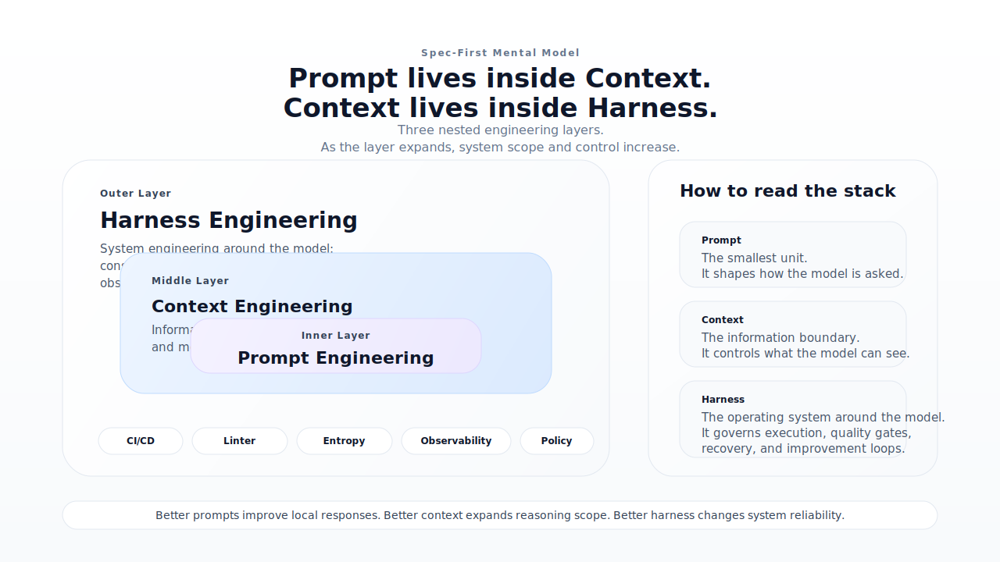

# 核心概念

Spec-First 的当前入口是 `spec-first doctor`、`spec-first init (--claude|--codex)` 和 `spec-first clean (--claude|--codex)`。`doctor` 用于自动检测或显式检查平台状态，`init` 用于安装项目运行时，`clean` 用于清理受管资产。


## 运行模型

当前版本采用 `npm CLI + project-local runtime assets` 模型。

这意味着：

- Claude Code 的用户入口是 `/spec:*`
- Codex 同时支持 `/spec:*` 命令入口和 `$spec-*` skill 入口；`spec-first init --codex` 会生成 `.codex/commands/spec/`
- Claude Code 命令模板来自项目本地 `.claude/commands/spec/`
- Codex 命令模板来自项目本地 `.codex/commands/spec/`
- `spec:ideate` 是前置 ideation 入口，用于在 brainstorm 之前发散候选和筛选方向
- Claude workflow skills 来自项目本地 `.claude/spec-first/workflows/`
- Codex workflow skills 来自项目本地 `.agents/skills/`
- standalone skills 来自项目本地 `.claude/skills/` 或 `.agents/skills/`
- agents 来自项目本地 `.claude/agents/` 或 `.codex/agents/`
- agent support files 来自项目本地 `.claude/agents/` 或 `.codex/agents/`
- `.claude/spec-first/state.json` 或 `.codex/spec-first/state.json` 负责记录受管资产状态；当前 schema 会显式跟踪 `commands / skills / workflowSkills / agents / agentSupportFiles`
- `.claude/spec-first/.developer` 或 `.codex/spec-first/.developer` 负责记录项目级开发者身份和初始化版本
- `spec-first init` 支持 `-u/--user` 和 `--lang`，若未显式提供用户名，会优先回退到全局 `~/.spec-first/.developer`，再回退到 `git config user.name`

当前升级策略是 hard-cut：

- 如果检测到 legacy managed state，唯一受支持的升级入口是重新运行 `spec-first init --claude` 或 `spec-first init --codex`
- `init` 会先执行 managed hard reset，再按当前版本全量重建运行时
- `spec-first clean` 不承担 legacy state 迁移，只清理当前受管集合

发布包中的 `.claude-plugin/plugin.json` 是统一资产清单，不是运行时生成目录。



## 三层工程概念

Spec-First 把 AI 工程拆成三层：

- `Prompt Engineering`
  关注如何发出更清晰的指令。
- `Context Engineering`
  关注模型能看到什么信息，以及信息如何组织。
- `Harness Engineering`
  关注整个系统如何运行，包括约束、反馈回路、工作流控制和持续改进。

## 五阶段闭环


五阶段主链路是：

`Brainstorm -> Plan -> Work -> Review -> Compound`

### 1. Brainstorm

- 目标：明确要做什么
- 输入：问题、想法、需求描述
- 输出：`docs/brainstorms/YYYY-MM-DD-<topic>-requirements.md`

### 2. Plan

- 目标：明确怎么做
- 输入：requirements 文档
- 输出：`docs/plans/YYYY-MM-DD-NNN-<type>-<name>-plan.md`

### 3. Work

- 目标：按计划完成实施
- 输入：plan 文档
- 输出：代码、测试和必要实现记录

### 4. Review

- 目标：输出结构化评审结论
- 输入：实施产物
- 输出：findings、问题清单和通过结论

### 5. Compound

- 目标：沉淀长期可复用知识
- 输入：评审通过的产物
- 输出：`docs/solutions/<category>/<filename>.md`

## Supporting Workflows

除五阶段主链路外，spec-first 还提供若干 **supporting workflows**，在特定场景下为主链路提供辅助能力。它们不属于五阶段的任何一步，而是独立运行的工具型工作流。

### spec-bootstrap（Stage-0 上下文 Bootstrap）

**入口：** `/spec:bootstrap`（Claude）| `$spec-bootstrap`（Codex）

在五阶段之前运行，为目标项目自动生成可长期复用的上下文资产：

```text
docs/contexts/<context-slug>/
  README.md               — 导航入口（含 bootstrap 生成时间戳）
  00-summary.md           — 项目概览：语言、框架、顶层结构
  architecture/
    system-overview.md    — 系统整体结构与核心组件
    module-map.md         — 目录/模块职责地图
    integration-boundaries.md  — 外部依赖与层间边界
  pitfalls/
    index.md              — 已知高风险点入口
  layers/<layer>/index.md — 按检测到的技术层条件生成
  database/database-er.md — MySQL ER 概览（条件生成：后端项目 + 可连接）
```

**定位说明：**
- 这是 **Stage-0 supporting workflow**，不属于五阶段主链路，不要将其视为某个核心阶段
- 当前版本**只生成**上下文资产，不自动注入到 brainstorm/plan/work/review
- Context-slug 规则：用户传入 > 复用已有 > 目标仓库根目录名 kebab-case
- Rerun 会备份已有资产，全部成功后删除备份，部分失败时恢复或报告

### spec-graph-bootstrap（Stage-0 图谱驱动 Bootstrap）

**入口：** `/spec:graph-bootstrap`（Claude）| `$spec-graph-bootstrap`（Codex）

由 `spec-first crg` CLI（CRG = Code Review Graph）驱动，分 Phase 0-4 运行：

- **Phase 0**：检测 CRG 图谱状态，自动选择 Full / Enhanced / Basic 模式
- **Phase 1**：事实抽取（god-nodes、large-functions、flows、communities、architecture、search 等 CRG 子命令输出）
- **Phase 2**：基于事实生成 PRD 任务规划
- **Phase 3**：生成 9 份文档（`docs/contexts/<slug>/`）
- **Phase 4**：路由生成与注入索引

**控制面产物**（`.spec-first/workflows/bootstrap/<slug>/`）：

```text
fact-inventory.json      — 聚合所有 CRG 事实
risk-signals.json        — god-nodes + large-functions 风险信号
test-surface.json        — 测试覆盖面分析
artifact-manifest.json   — 构建元数据与输出依赖映射
```

**文档产物**（`docs/contexts/<slug>/`）：与 `spec-bootstrap` 产出结构相同，但内容基于图谱事实。

**与 spec-bootstrap 的关系：**
- 两个入口并行可用，互不冲突
- `spec-bootstrap` 更适合通用场景（无需预先构建 CRG 图）
- `spec-graph-bootstrap` 提供更深的代码图谱洞察，但需要先执行 `spec-first crg build`

### spec-audit

代码库审计，识别技术债和高风险模式。详见各自的 SKILL.md。

---

## 下一步

阅读 [完整示例](./03-完整示例.md) 查看实际执行过程，或者先运行 `spec-first init --claude` 或 `spec-first init --codex` 在目标项目中生成工作流入口。
