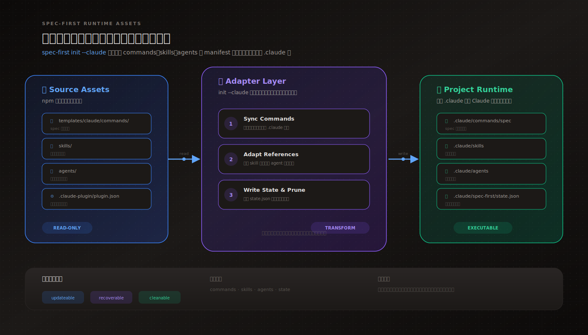
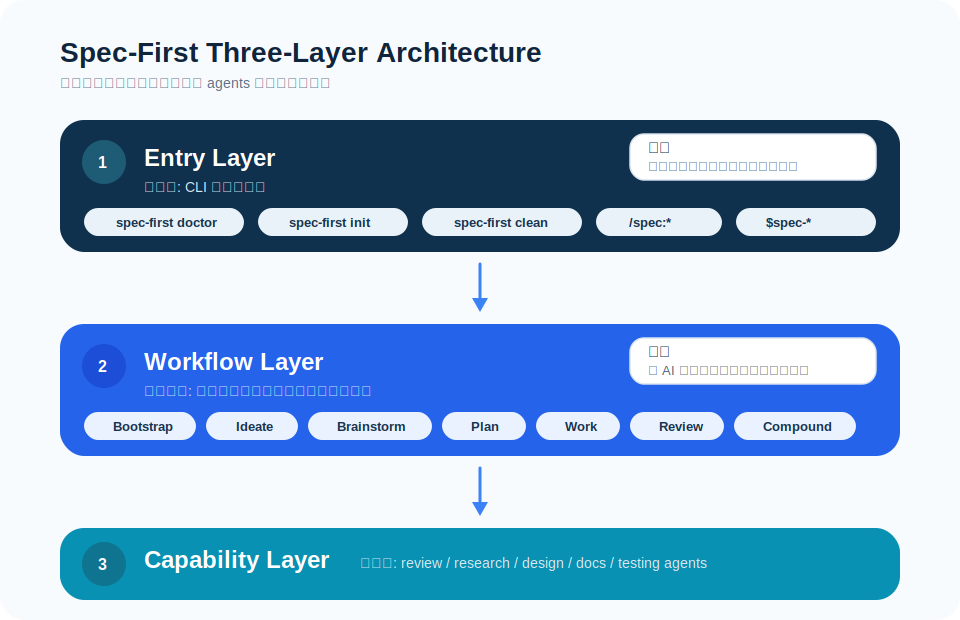

# 核心概念

Spec-First 是面向 Claude Code 与 Codex 的 **AI Coding Harness**：脚本产出可信事实，LLM 做语义判断，证据作为持久 artifact 留在仓库里。

CLI 入口（与 `spec-first --help` 一致）：

| 命令 | 作用 |
| --- | --- |
| `spec-first doctor [--claude\|--codex]` | 自动检测或显式检查环境、runtime asset manifest 和受管运行时状态 |
| `spec-first init` | 交互式安装 workflows、skills、agents 和开发者身份（多选宿主 → 确认姓名 → 选语言 → 预览 → 确认）。可选非交互 flag：`--claude` / `--codex` 显式指定并覆盖默认宿主集合，`-y` 跳过提示用默认宿主，`-u <name>` / `--lang <zh\|en>` 预置身份与语言 |
| `spec-first update` | 升级 CLI 包到 `@latest`，并提示随后运行 `init` 刷新本地 runtime |
| `spec-first clean (--claude\|--codex)` | 移除当前项目里 spec-first 受管资产 |
| `spec-first repair-worktree` | 预览失效 worktree pointer 的修复指引（`--dry-run` 仅预览，不删除 `.git`） |
| `spec-first tasks <subcommand>` | 对派生 task pack 做 hash / validate 确定性校验 |
| `spec-first session <subcommand>` | opt-in 的多 actor 会话 advisory（register / list / heartbeat / unregister） |



## 运行模型

当前版本采用 `npm CLI + project-local runtime assets` 模型。

这意味着：

- Claude Code 的用户入口是 `/spec:*`
- Codex 的用户入口是 `$spec-*` skill 入口；`spec-first init` 不会生成 `.codex/commands/spec/`
- Claude Code 命令模板来自项目本地 `.claude/commands/spec/`
- Codex workflow skills 来自项目本地 `.agents/skills/`
- `spec:ideate` 是前置 ideation 入口，用于在 brainstorm 之前发散候选和筛选方向
- Claude workflow skills 来自项目本地 `.claude/spec-first/workflows/`
- standalone skills 来自项目本地 `.claude/skills/` 或 `.agents/skills/`
- agents 来自项目本地 `.claude/agents/` 或 `.codex/agents/`
- agent support files 来自项目本地 `.claude/agents/` 或 `.codex/agents/`
- `.claude/spec-first/state.json` 或 `.codex/spec-first/state.json` 负责记录受管资产状态；当前 schema 会显式跟踪 `commands / skills / workflowSkills / agents / agentSupportFiles`
- `.claude/spec-first/.developer` 或 `.codex/spec-first/.developer` 负责记录项目级开发者身份和初始化版本
- `spec-first init` 会交互式多选宿主 runtime，并收集开发者姓名与语言；姓名默认值会优先回退到已选宿主的项目级 `.developer`，再回退到全局 `~/.spec-first/.developer` 和 `git config user.name`

当前升级策略是 hard-cut：

- 如果检测到 legacy managed state，唯一受支持的升级入口是重新运行 `spec-first init` 并选择目标宿主
- `init` 会先执行 managed hard reset，再按当前版本全量重建运行时
- `spec-first clean` 不承担 legacy state 迁移，只清理当前受管集合

发布包运行时资产清单由 `src/cli/contracts/dual-host-governance/skills-governance.json`、`templates/claude/commands/spec/*.md` frontmatter、`skills/` 和 `agents/` 在 CLI 内生成；`.claude-plugin/plugin.json` 不再作为源码或发布包真源。



## 三层工程概念

Spec-First 把 AI 工程拆成三层：

- `Prompt Engineering`
  关注如何发出更清晰的指令。
- `Context Engineering`
  关注模型能看到什么信息，以及信息如何组织。
- `Harness Engineering`
  关注整个系统如何运行，包括约束、反馈回路、工作流控制和持续改进。

## 五阶段闭环



五阶段主链路是：

`Brainstorm -> Plan -> Work -> Review -> Compound`

### 1. Brainstorm

- 目标：明确要做什么
- 输入：问题、想法、需求描述
- 输出：`docs/brainstorms/YYYY-MM-DD-<topic>-requirements.md`

### 2. Plan

- 目标：明确怎么做
- 输入：requirements 文档
- 输出：`docs/plans/YYYY-MM-DD-NNN-<type>-<name>-plan.md`

### 3. Work

- 目标：按计划完成实施
- 输入：plan 文档
- 输出：代码、测试和必要实现记录

### 4. Review

- 目标：输出结构化评审结论
- 输入：实施产物
- 输出：findings、问题清单和通过结论

### 5. Compound

- 目标：沉淀长期可复用知识
- 输入：评审通过的产物
- 输出：`docs/solutions/<category>/<filename>.md`

## 当前工程闭环

五阶段主链路是最小心智模型。当前 spec-first 实际支持的工程闭环更完整：

```text
Codebase -> Spec -> Plan -> Tasks -> Code -> Review -> Knowledge
```

对应到公开入口：

```text
mcp-setup
  -> ideate / brainstorm / doc-review
  -> plan / write-tasks
  -> work / debug / optimize / polish
  -> code-review / app-consistency-audit
  -> compound / compound-refresh / sessions / slack-research / skill-audit
```

这些入口不是刚性状态机。脚本和 CLI 准备 deterministic facts，LLM 根据当前目标、证据、scope 和风险决定下一步。

## Supporting Workflows

除五阶段主链路外，spec-first 还提供若干 **supporting workflows**，在特定场景下为主链路提供辅助能力。它们不属于五阶段的任何一步，而是独立运行的工具型工作流。

### spec-mcp-setup（required harness runtime 准备入口）

**入口：** `/spec:mcp-setup`（Claude）| `$spec-mcp-setup`（Codex）

用于安装和验证 required harness runtime、MCP servers 和 helper tools。它写入 setup-owned facts，不替代后续 planning / review 的语义判断。

主要产物：

```text
.spec-first/config/runtime-capabilities.json
```

多仓工作区中，从父 workspace 无参数运行时默认处理所有 child repos；`--repo <child>` 用于收窄到单个 child repo，`--all-repos` 是显式等价入口。父 workspace 只能写 advisory `.spec-first/workspace/*summary.json`；child repo 的 setup facts 必须写在 child repo 内。

旧内置图 CLI、旧上下文路由和静态文档注入链已移除，不再作为当前可用入口。需要当前代码证据时，workflow 应使用 bounded direct source reads、`rg`、ast-grep、git diff、tests/logs 和用户提供证据；影响面无法直接证明时，在 Coverage 中披露限制。

### spec-skill-audit（source skill 审计入口）

**入口：** `/spec:skill-audit`（Claude）| `$spec-skill-audit`（Codex）

用于审查 spec-first 仓库内的 source skills，而不是审查生成后的 runtime copies。它会先运行确定性脚本收集事实，再由 LLM 基于证据判断哪些信号是真问题。

常用方式：

```text
/spec:skill-audit
$spec-skill-audit

/spec:skill-audit skills/spec-debug
$spec-skill-audit skills/spec-debug
```

需要 runtime drift 或 patch preview 时显式传入：

```text
/spec:skill-audit --runtime --patch-preview
$spec-skill-audit --runtime --patch-preview
```

直接脚本入口：

```bash
node skills/spec-skill-audit/scripts/write-audit-artifacts.js --repo .
node skills/spec-skill-audit/scripts/write-audit-artifacts.js --repo . --target skills/spec-debug
node skills/spec-skill-audit/scripts/write-audit-artifacts.js --repo . --runtime --patch-preview
```

主要产物：

```text
.spec-first/audits/skill-audit/latest/skill-audit-summary.md
.spec-first/audits/skill-audit/latest/skill-improvement-plan.md
.spec-first/audits/skill-audit/latest/skill-audit-report.json
.spec-first/audits/skill-audit/latest/expert-scorecard.json
.spec-first/audits/skill-audit/latest/security-risk-report.json
.spec-first/audits/skill-audit/latest/promise-implementation-report.json
.spec-first/audits/skill-audit/latest/governance-drift-report.json
.spec-first/audits/skill-audit/latest/runtime-drift-report.json
```

协作规则：

- `.spec-first/audits/` 是 gitignored 执行产物，不进 Git
- scorecard 是 review signal，不是 release gate
- P0/P1 finding 必须带 signal、evidence、counter-evidence、decision、reason、recommendation、confidence 后再进入修复判断
- `promise-implementation-report.json` 只对比文档承诺、CLI 参数和脚本写出的产物；是否构成真实问题仍由 LLM 判断
- runtime drift 只能通过重新运行 `spec-first init` 并选择目标宿主 修复，不手改 `.claude/`、`.codex/`、`.agents/skills/`

### spec-app-consistency-audit（App 一致性审查入口）

**入口：** `/spec:app-consistency-audit`（Claude）| `$spec-app-consistency-audit`（Codex）

用于在模拟器、真机、打包或 QA 前，对移动 App 的 PRD、Figma、源码、页面路由、KMP / Clean Architecture、组件复用、埋点、i18n、工程质量和行业规则做静态一致性审查。

常用方式：

```text
/spec:app-consistency-audit prd:<path> figma-context:<path> source:<path>
$spec-app-consistency-audit prd:<path> figma-context:<path> source:<path>
```

需要从代码评审或自动化父流程中只返回 compact 结果时，可以使用：

```text
/spec:app-consistency-audit mode:headless base:<ref> source:<path>
$spec-app-consistency-audit mode:headless base:<ref> source:<path>
```

主要产物：

```text
.spec-first/app-audit/runs/<run-id>/metadata.json
.spec-first/app-audit/runs/<run-id>/preflight.json
.spec-first/app-audit/runs/<run-id>/impact-facts.json
.spec-first/app-audit/runs/<run-id>/app-audit-context.json
.spec-first/app-audit/runs/<run-id>/issues.json
.spec-first/app-audit/runs/<run-id>/audit-report.json
.spec-first/app-audit/runs/<run-id>/app-consistency-audit.md
```

协作规则：

- `.spec-first/app-audit/` 是 gitignored 执行产物，不是 source truth。
- `figma-context:<path>` 是可抽取 evidence；`figma-ref:<id-or-url>` 只是 reference。
- Figma MCP 属于宿主可选能力，只能在默认交互模式下 materialize 本地 JSON；它不进入 `spec-mcp-setup` required baseline。
- 缺 PRD、Figma 或行业 profile 时应记录 degraded mode，并限制结论范围，不能把缺失输入直接升级为 confirmed issue。
- 脚本负责 preflight、contract extraction、evidence gate 和 artifact 校验；LLM 专家负责语义判断、严重性解释和报告取舍。

## 当前代码证据的正确分层

当前 workflow 的代码证据来自 bounded direct source reads、`rg`、ast-grep、git diff、tests/logs 和用户提供材料。脚本可以写 setup-owned facts 或执行产物，但具体工程判断仍由 LLM 基于当前源码、当前 diff 和验证结果完成。

协作规则：

1. 用户可见知识沉淀写入 `docs/solutions/`，由 `spec-compound` 管理。
2. workflow 需要当前代码事实时直接读取 source 或运行聚焦验证，不读取旧文档包。
3. 父 workspace 的 `.spec-first/workspace/` 只保存 advisory summaries，不是跨 repo 的 source truth。

---

## 下一步

阅读 [完整示例](./03-完整示例.md) 查看实际执行过程，或者先运行 `spec-first init` 并选择目标宿主 在目标项目中生成工作流入口。
