# PRD 需求文档质量增强流程

本页总结 `$spec-prd` 面向粗 PRD、超大需求文档和多来源材料时的目标工作方式。它对应当前 `spec-prd` 需求质量增强方案：把 `grill-with-docs` 的 source-first、术语校准、场景压力测试、代码矛盾核对和决策闭环能力前置到需求文档阶段，让后续 `spec-plan`、task pack 和 `spec-work` 消费更稳定的 WHAT/WHY 输入。

> 注意：本页描述的是用户手册层面的流程意图和设计边界。具体可用行为以当前版本的 `skills/spec-prd/` source、生成后的宿主 runtime 和 release notes 为准。

## 设计思想与思路

这套流程的出发点是：研发质量很大程度取决于输入质量。一个 PRD 如果在用户、目标、范围、术语、现有系统行为、异常、验收和决策后果上含糊，后续 plan、task 和实现就会被迫补 WHAT，导致返工、误实现或 review 时才发现需求不稳。

它把“读需求”拆成三类工作：先理解材料在说什么，再用代码和文档证据校准它是否成立，最后只把真正需要业务裁决的问题交给 owner。这样 `$spec-prd` 输出的是可交给 planning 的需求判断，而不是一份未经压测的长摘要。

设计上遵循七个原则。

### 1. 模拟资深 PM / 架构师理解需求的过程

人类理解复杂需求时，通常不是读完就写方案，而是先判断材料质量，再抽事实、查证据、归类冲突、确认关键问题，最后重写成稳定需求。流程中的 `Sanitization`、`Preliminary Diagnosis`、`Map-Reduce`、`Deep Requirements Grill` 和 `Final Readiness Diagnosis` 对应的就是这个过程。

这个过程有一个明确目标：让后续研发不再猜。它不是把文档“摘要得更短”，而是把需求里的事实、假设、冲突、术语、场景和决策后果变成可以被计划和实现消费的结构化输入。

### 2. 先完整澄清，再按标准 PRD 模版写入

PRD 输入有大小和风险差异，但 `$spec-prd` 的目标不是尽快写一版轻文档，而是先把需求澄清到后续 planning 不需要补发明 WHAT，再按标准 PRD 模版写入。Progressive Detail Ladder 现在用于选择澄清方式和证据归约方式，而不是给粗输入找轻量捷径：

- source 已经完全闭合的需求可以直接写 L0 source-resolved PRD。
- 有少量不确定性时进入 shared understanding map。
- 超大或多来源材料才进入 Map-Reduce。
- 只有影响 planning invention 的问题才触发 P0/P1 packs。
- rough PRD、draft、reference-claims、resume-prd、pure-text 和多来源材料默认进入 `grill-with-docs` 的 one-question-at-a-time 深度澄清；如果缺系统/产品锚点、属于 broad discovery、下一问无法关闭命名 gap 或没有可负责的提问序列，才输出 blocker cluster / route-out。

这让流程按证据和决策展开，但最终仍回到标准 PRD 模版输出。

### 3. Map-Reduce 是证据归约，不是分段摘要

超大需求文档的问题通常不是“太长”，而是 claim 分散、重复、冲突、例外和术语漂移散落在不同章节。普通摘要会把这些细节压扁，最后留下看似顺滑但不可追溯的结论。

这里的 Map-Reduce 只做 run-local evidence reduction：

- Map 从每个 chunk 抽取带 `source_ref` 的需求原子。
- Shuffle 按 actor、flow、feature、data、state、permission、exception、PRD section 和 source contradiction 聚组。
- Reduce 合并重复、保留冲突，并输出 blockers、assumptions、owner questions 和 PRD write targets。

它保留 Map-Reduce 思想，但不新增持久 schema、JSON contract、向量索引、脚本 reducer 或独立 artifact。

### 4. 证据优先，owner 只裁决真正需要人的问题

`grill-with-docs` 的重要思想是：能从代码库回答的问题，就不要问用户。`spec-prd` 继承这个原则，把 source/docs/tests/contracts/prior PRDs/context/ADR 都当作 evidence candidates。

代码负责回答“当前系统是什么”；owner 负责回答“目标行为应该是什么”。LLM 负责判断差异是否会影响 PRD 和 planning readiness。这个分工避免让脚本做语义裁决，也避免让用户回答已经能从仓库确认的事实。

### 5. Deep Grill 前置到需求阶段

`grill-with-docs` 原本用于 stress-test plan 和领域语言。这里把它前置到需求文档阶段，因为术语、场景、代码矛盾和 owner 决策如果等到 planning 或实现阶段才发现，成本更高。

深度集成保留方法，不复制节点：

- 一次只问一个问题。
- 每个问题给 recommended answer 和后果。
- 挑战 glossary 冲突和模糊词。
- 用具体场景压测边界。
- 对照代码暴露矛盾。
- 把决议落回 PRD section。

这样做的目标是把需求文档先压实，再交给后续流程。

### 6. PRD-local closure 优先，知识晋升 preview-first

`CONTEXT.md` 和 ADR 很适合沉淀稳定术语与难逆决策，但如果把它们变成每个 PRD 的默认输出，会制造第二真相源和不必要的写入副作用。

所以这里采用 adapter 思路：

- 已有 `CONTEXT.md` / `CONTEXT-MAP.md` / ADR 先作为 evidence。
- 本轮 PRD 的术语和决策先在 PRD-local sections 闭环。
- 只有稳定术语或 hard decision 满足晋升条件时，才生成 preview-first promotion candidate。
- 不 silent write，不把 context/ADR 设为 readiness 前置条件。

这兼顾了短期 PRD 质量和长期知识沉淀。

### 7. 轻合同、清边界，不把流程做成强状态机

这套流程不追求把 PRD 写作变成固定状态机。强制的是边界和证据纪律：不能把 generated runtime 当 source，不能把 chunk summary 当 truth，不能让 `spec-plan` 发明 WHAT，不能把 owner 未确认的目标行为伪装成 confirmed requirement。

语义判断仍由 LLM 完成：哪些 gap 会影响 planning readiness、哪些冲突需要 owner、哪些 assumption 可以接受、哪些问题应该 route-out。脚本只提供 deterministic facts、结构检查、trace gaps 和 literal drift；owner 只裁决目标行为、业务取舍和代码无法证明的问题。

## 解决什么问题

很多研发返工不是因为 plan 不会拆任务，而是因为 PRD 还没把关键 WHAT 说清楚：

- 谁是目标用户、操作者、受益方和下游消费者不清楚。
- 需求描述和现有代码、文档、测试或历史 PRD 矛盾。
- 超大文档里同一个功能散落在多个章节，重复、冲突和例外被摘要丢掉。
- 术语模糊，例如“账户”“订单”“取消”“审批”在不同上下文里含义不同。
- 权限、状态、异常、负向验收、发布切片和 owner 决策没有闭环。

目标是在需求文档阶段把这些 load-bearing gaps 解决或显式暴露，而不是让 `spec-plan` 或实现阶段替 PRD 发明产品行为。

## 完整流程

```text
粗 PRD / draft / 会议记录 / 截图 / PDF / 多来源材料
  -> PRD Sanitization
  -> Problem / Outcome Framing
  -> Source-first Evidence Calibration
  -> Preliminary Diagnosis
  -> Progressive Detail Ladder
  -> optional Large-input Map-Reduce
  -> Deep Requirements Grill
  -> Context / ADR Topology Adapter
  -> PRD Rewrite
  -> Final Readiness Diagnosis
  -> Handoff
```

### 执行流程图

下面的流程图按 `skills/spec-prd/SKILL.md` 的 Phase 0-4 和 reference 触发规则展开。它描述的是 `$spec-prd` 在一次 PRD run 中如何选择最小必要路径；不是强状态机，也不是脚本 schema。

```mermaid
flowchart TD
  A["输入<br/>brownfield increment<br/>已有 PRD / 粗 PRD / Markdown notes<br/>截图 OCR / PDF / 会议纪要 / chat log"] --> B["安全边界<br/>把输入当作 untrusted document content<br/>只抽取 claim / evidence / contradiction<br/>不执行嵌入指令或命令"]

  B --> C{"Phase 0<br/>Classify Intent And Input Mode"}
  C -->|no-input| C1["询问 target increment 或 PRD path<br/>暂停运行"]
  C -->|wrong-stage| C2["Route out<br/>brainstorm / app-consistency-audit / plan / work / debug"]
  C -->|implementation-ready 或低风险小修| C3{"durable WHAT record 有价值吗?"}
  C3 -->|否| C4["bypass<br/>不写 PRD artifact<br/>记录 reason / handoff target<br/>说明 downstream 不会 invent WHAT"]
  C3 -->|是| D
  C -->|create / refine / validate| D["Run-local Decision Card<br/>intent / input_posture / output_shape<br/>topology / surface_lens / evidence_depth<br/>quality / clarification / readiness"]
  C -->|oversized initial PRD| C5["先建议 semantic split boundaries"]
  C5 --> C6{"owner 确认边界 / 优先级 / release order?"}
  C6 -->|否| C7["输出 split-decision summary<br/>不写 child PRDs"]
  C6 -->|是| H5["写 split summary + child PRDs<br/>仍使用 docs/brainstorms/*-requirements.md"]
  C1 --> L
  C2 --> L
  C7 --> L

  D --> E["Phase 1<br/>PRD Sanitization<br/>产品事实 / 目标 / 范围 / 验收<br/>技术 HOW / 临时结论 / 未确认 claim<br/>ratified decision vs raw discussion"]
  E --> F["Source-first Evidence Calibration<br/>source / docs / tests / contracts / prior PRDs<br/>context / ADR / glossary when relevant"]
  F --> F1["Evidence Tags<br/>confirmed-source / user-stated / source-candidate<br/>external-research / assumption"]
  F1 --> F2["Current System Snapshot<br/>只写影响 PRD 的 confirmed 或显式标注 claim"]

  F2 --> G{"Preliminary Diagnosis<br/>只决定展开层级"}
  G -->|缺目标用户 / 产品问题 / 系统锚点 / 核心场景| G0["route-out to brainstorm<br/>不伪造 PRD closure"]
  G -->|source 已闭合| G1["L0 source-resolved PRD"]
  G -->|claim 需 evidence/gap/write target 对齐| G2["L1 shared understanding map<br/>run-local scratch"]
  G -->|超大 / 多来源 / 无法整体可靠判断| G3["L2 Map-Reduce<br/>Map source_ref claim actor flow state gap<br/>Shuffle by actor / flow / feature / data / state / permission / exception / contradiction<br/>Reduce canonical candidates + conflicts + blockers"]
  G -->|problem/outcome/metric/NFR/trace/owner closure 触发| G4["L3 P0 packs<br/>写回 PRD-local core sections"]
  G -->|actor/design/release/change-management 有后果| G5["L4 P1 packs<br/>写回 conditional sections"]
  G -->|多 gap 决策需要持续裁决<br/>或缺系统/产品锚点| G6{"L5 deep grill<br/>或 blocker / route-out"}

  G1 --> H
  G2 --> H
  G3 --> H
  G4 --> H
  G5 --> H
  G6 -->|锚点足够且可 owner 裁决闭合| I3
  G6 -->|缺锚点 / broad discovery / 无可负责提问序列| J4
  G0 --> C2

  H["Phase 2<br/>Change Delta And Domain Language"] --> H1["Change Delta<br/>keep / extend / replace / remove / unknown"]
  H1 --> H2{"Topology risk?"}
  H2 -->|workflow / contract / migration / replace / remove / source-of-truth / runtime / mixed surface| H3["Topology Framing Gate<br/>surface map / producer-consumer<br/>source-of-truth resolution / negative space"]
  H2 -->|低风险 add / extend| H4["保持轻量边界<br/>不扩大 scope"]
  H3 --> I
  H4 --> I

  I{"Domain / terminology / contradiction / hard boundary?"}
  I -->|source-answerable| I1["先查 source / docs / tests / contracts / glossary<br/>不问 owner"]
  I -->|PRD write target 依赖 owner 决策| I2["Requirements Scenario Grill<br/>一次一个问题<br/>绑定 gap / source attempt / write target<br/>给 recommended_answer / consequence / closure state"]
  I -->|rough / draft / reference-claims<br/>或需要持续裁决| I3["Deep grill-with-docs mode<br/>持续 one-question-at-a-time<br/>等待反馈<br/>必要时 inline 更新 CONTEXT.md / CONTEXT-MAP.md / ADR"]
  I1 --> J
  I2 --> J
  I3 --> J

  J["Phase 3<br/>Draft / Refine / Split"] --> J1{"选择 output_shape"}
  J1 -->|bypass| C4
  J1 -->|compact-prd| J2["Core sections<br/>Summary / Change Delta / Requirements<br/>Acceptance Examples / Scope Boundaries<br/>Evidence And Assumptions"]
  J1 -->|normal-prd| J3["Core + triggered sections<br/>Problem Frame / Current Snapshot / Glossary<br/>Decision Notes / Actors / Use Cases / Exceptions<br/>Outstanding Questions / Planning Recheck"]
  J1 -->|topology-heavy-prd| J5["Topology sections<br/>Change Topology / Surface Map<br/>Producer Artifact Consumer<br/>Source-Of-Truth Resolution / Negative Acceptance"]
  J2 --> J6["写入或更新 PRD artifact<br/>docs/brainstorms/*-requirements.md<br/>artifact_kind: prd-requirements"]
  J3 --> J6
  J5 --> J6
  H5 --> J6

  J6 --> K["Phase 4<br/>Readiness And Handoff"]
  K --> K1["Script-owned advisory facts<br/>check-prd-artifact.js: frontmatter / core sections / R-AE trace / placeholder / feature slice trace<br/>check-glossary-drift.js: avoid term literal hits when glossary exists"]
  K1 --> K2["LLM-owned readiness lens<br/>Core Pack always<br/>conditional packs only when triggered<br/>script findings do not decide readiness"]
  K2 --> K3{"readiness_outcome"}
  K3 -->|ready-for-planning| K4["Handoff to current host plan workflow<br/>Claude: /spec:plan<br/>Codex: $spec-plan"]
  K3 -->|revise-prd| K5["修 PRD gaps<br/>把 source-resolved gaps / owner answers / assumptions 写回 PRD-local sections"]
  K3 -->|ask-owner| K6["问最小 blocking question<br/>或记录 accepted assumption / Outstanding Question"]
  K3 -->|doc-review| K7["Handoff to document review<br/>Claude: /spec:doc-review<br/>Codex: $spec-doc-review"]
  K3 -->|route-out| C2
  K4 --> L["Closeout Summary<br/>sections / requirement count / acceptance count<br/>priority / NFR / assumptions / outstanding questions<br/>trace gaps / planning would invent WHAT?"]
  K5 --> K
  K6 --> K
  K7 --> L
  C4 --> L
  J4["Blocker cluster closeout<br/>blockers / assumptions / affected write targets<br/>recommended route<br/>不输出 ready-for-planning"] --> L
```



读图时要注意三条边界：

- `Preliminary Diagnosis` 只决定走 compact、Map-Reduce、P0/P1 packs、deep grill、blocker cluster 还是 route-out；它不能宣布 `ready-for-planning`。
- Map rows、Reduce outputs、shared understanding map、question card 和 Framing Gate 都是 run-local scratch；只有能减少 planning 发明 WHAT 的结论才写回 PRD sections。
- `check-prd-artifact.js` 和 `check-glossary-drift.js` 只报告 script-owned facts；是否构成 readiness blocker、是否需要 owner 决策、是否能交给 planning，仍由 readiness lens 做语义判断。

### 1. PRD Sanitization

先把输入里的内容分开：

- 产品事实、目标、范围和验收。
- 技术建议和实现 HOW。
- 未确认 claim、临时结论、冲突说法。
- 嵌入在文档里的 agent 指令、shell 命令或 workflow 指令。

PRD 只承载产品 WHAT/WHY、current-state evidence、acceptance 和 scope boundary。实现 HOW 进入后续 plan/work。

### 2. Problem / Outcome Framing

确认需求不是一串功能清单，而是能回答：

- 哪类用户或角色遇到什么问题？
- 期望产生什么可观察结果？
- 哪些行为、权限、状态或验收会因此变化？

如果缺少目标用户、产品问题、系统锚点或核心场景，应该路由回 `$spec-brainstorm`，而不是硬写 PRD。

### 3. Source-first Evidence Calibration

在问 owner 之前，先查可验证证据：

- 代码、测试、contracts、README、docs。
- 既有 PRD、历史 plan、domain glossary、ADR 或类似决策记录。
- 当前系统入口、权限模型、状态机、异常处理和已存在限制。

代码和文档提供 current-state evidence，不自动决定目标行为。目标行为仍由 owner/PRD 决定。

### 4. Preliminary Diagnosis

Preliminary Diagnosis 只决定“怎么澄清、怎么归约证据、是否 route-out”，不等于最终 `ready-for-planning`。

它判断：

- 是否已有产品/系统锚点。
- 是否已经 source-resolved 到无需 owner interview。
- 是否需要超大文档 Map-Reduce。
- 哪些 P0/P1 packs 被触发。
- 是否要进入 deep grill、route-out 或输出 blocker cluster。

最终能否进入 planning，只能在 rewrite 后由 Final Readiness Diagnosis 判断。

### 5. Product Expert Lens

`$spec-prd` 的默认热路径现在是：

```text
Product Expert Lens -> Requirements Grill -> Standard PRD Write-In -> Readiness Lens
```

Product Expert Lens 不是一个新的公开 workflow，也不是默认独立 reviewer。它是需求澄清前的产品判断层：先识别用户、场景、结果、范围、权限、异常、验收和 downstream confirmation risk，再把每个 load-bearing gap 绑定到具体 PRD write target。Requirements Grill 只消费它产出的最小接口：

```text
downstream_confirmation_risk -> claim -> evidence/source -> gap
  -> owner_question_or_assumption -> PRD_write_target -> closure_state
```

这让 owner 问题不再是 checklist 式追问，而是围绕“哪个问题会让 planning / work 发明 WHAT”排序。已经成型或已决策的输入会被综合进标准 PRD sections；其中 implementation/testing/API/schema/task 细节会降级为 HOW，除非它改变 scope、acceptance 或 source-of-truth。

## Progressive Detail Ladder

流程按风险渐进展开，避免所有 PRD 都走最重路径。

| Level | 触发 | 停止条件 | 输出 |
| --- | --- | --- | --- |
| L0 source-resolved PRD | 输入锚点清楚且 source/owner context 已证明关键需求 | 不会让 planning 发明 WHAT，且无需 owner interview | 标准 core sections 的 compact/normal PRD |
| L1 shared understanding map | claim 需要对齐 evidence/gap/write target | gap 已解决、假设化或升级 | run-local shared understanding |
| L2 large-input Map-Reduce | 超大、多来源或无法整体可靠判断 | reduced candidates 保留 source refs 和 conflicts | run-local Map/Reduce 结果 |
| L3 P0 packs | problem/outcome、metric、NFR、trace、owner closure 会影响 planning | P0 gap 已闭环或显式阻塞 | PRD-local core sections |
| L4 P1 packs | actor/design/release/change-management 信号明确且有后果 | conditional detail 被捕获或延后 | PRD-local conditional sections |
| L5 deep grill / blocker route-out | PRD 模版仍依赖 owner 决策、交互 gap、source/user 矛盾、术语/范围/验收不稳，或缺系统/产品锚点 | 有锚点且下一问可关闭或缩窄命名 gap 时进入 one-question-at-a-time；否则 route 明确且不输出 ready | guided owner adjudication，或 blockers、assumptions、affected write targets |

## 超大文档的 Map-Reduce

超大需求文档不能只做“分段摘要再拼接”。摘要容易丢掉 source refs、例外、矛盾和术语漂移。Map-Reduce 用来先把证据归约成可判断输入，再进入深度澄清。

```text
Map row:
  source_ref / claim / actor / flow / state / gap /
  evidence_tag / confirmation_posture / write_target_candidate

Reduce output:
  canonical_requirement / supporting_refs / conflicts /
  assumptions / load_bearing_gap / owner_question_candidate /
  affected_write_targets
```

Map 负责从 chunk 里抽取需求原子并保留来源。Shuffle 按 actor、flow、feature、data、state、permission、exception、PRD section 和 source contradiction 聚组。Reduce 合并重复、保留冲突，并输出 blockers、assumptions、owner questions 和 PRD write targets。Reduce output 随后进入 Product Expert Lens 的风险排序，而不是绕过产品判断直接写入 PRD。

这些都是 run-local scratch，不是持久 schema、JSON contract 或新 artifact。

长链路、超大或多来源 PRD 可以把 reduced candidates 提前写入 PRD 文件本身作为 checkpoint：已闭合内容进入正式 sections，未确认内容进入 `Evidence And Assumptions`，owner 决策进入 `Outstanding Questions`，planning-time advisory 项进入 `Planning Recheck`。resume 时优先按 `source_ref` 恢复；如果 source_ref stale、缺失或冲突，则 degraded 重新归约相关 chunk 并记录原因。普通短 PRD 仍然闭合后再写，不新增 transcript 或 progress schema。`Planning Recheck` 是 `$spec-prd` producer-side advisory handoff：它说明下游在选 HOW 前必须复核，不等于 `$spec-plan` 已经完成 re-confirm。

## 设计源 / Figma 输入

当前端、H5、PC、Admin 或其他 UI PRD 带有 Figma 链接、截图、导出的设计上下文或交互状态说明时，`$spec-prd` 会把设计源作为 trigger-only evidence path 处理：

```text
URL parse -> tool discovery -> auth/access probe -> fetch or degraded reason
  -> design-WHAT extraction -> code/owner reconciliation -> PRD write targets / Planning Recheck
```

设计源证据默认是 `source-candidate` / `provider_untrusted`，直到经过代码、文档或 owner 决策校准。工具不可用、未授权、无访问权限或 headless 无法抓取时，不阻断 PRD；它会 loud degrade 到截图、导出 context、本地 `figma-context:<path>`、reference-claim 或 owner 描述。`spec-prd` 只提取 PRD facts，例如 entry、state、copy、empty/error/loading、permission、i18n、accessibility 和 acceptance；PRD/Figma/source 一致性审计仍应 route 到 `$spec-app-consistency-audit`。

## Deep Requirements Grill

Deep Requirements Grill 是 `grill-with-docs` 思想在需求文档阶段的主路径。它不是 PRD 写完后的 review，而是 rewrite 前确认 shared understanding；rough PRD、draft、reference-claims、resume-prd、pure-text 和多来源材料默认先经过它，再按标准 PRD 模版写入。

核心动作：

- source/code-first：能从代码、docs、tests、contracts 回答的问题，不问 owner。
- one question at a time：一次只问一个 load-bearing 问题。
- recommended answer：每个问题都尽量给推荐答案、理由和后果。
- glossary challenge：发现术语与现有 glossary 或代码用法冲突时立即指出。
- fuzzy term sharpening：把“账户”“订单”“审批”等模糊词锐化为 canonical term。
- scenario stress：用具体 actor、flow、state、exception、permission 场景压测边界。
- code contradiction：用户说法和现有代码冲突时，要求明确以哪个为准。
- decision closure：owner answer 必须落回 PRD section，而不是停留在聊天里。

正常 PRD run 不再用固定问题数量作为停止条件，也不把“看起来小”当作跳过澄清的理由。每个 owner 问题都必须绑定命名 gap、已做 source attempt、PRD write target 和 closure state；只要 PRD 模版的 actor、flow、state、exception、permission、scope、acceptance、release slice、术语或决策后果还依赖 owner 裁决，就进入 `grill-with-docs` 深度模式并继续一次一个问题。只有缺系统/产品锚点、属于 broad discovery、下一问无法关闭或缩窄命名 gap，或没有可负责提问序列时，才输出 prioritized blocker cluster、推荐下一 route、accepted assumptions 和 affected write targets，并且不标记 `ready-for-planning`。

## Context / ADR Topology Adapter

`grill-with-docs` 默认会围绕根目录 `CONTEXT.md`、`CONTEXT-MAP.md`、context-specific `CONTEXT.md` 和 `docs/adr/` 沉淀领域语言与决策。`spec-prd` 可以集成这套拓扑，但设计重心不是建立一套新的 PRD 外部目录规范，而是把已存在或本轮明确触发的长期上下文作为辅助证据，并始终让 PRD-local sections 成为 planning 的直接输入。

当前 source 的边界是“兼容拓扑、按需创建、PRD 内闭环”：

```text
user-repo/
  CONTEXT.md                 # 可选；项目或根 context，内容是 glossary，不是 spec
  CONTEXT-MAP.md             # 可选；多 context 路由图
  docs/
    contracts/
      domain-glossary.md     # 可选；跨 PRD canonical term layer
    adr/
      0001-some-decision.md  # 可选；满足三条件时才创建或更新
  src/
    ordering/
      CONTEXT.md             # 可选；context-specific glossary
```

目录边界：

- `CONTEXT.md` 是项目或某个 context 的 glossary，只记录项目/领域专属术语和 avoid terms，不承载需求正文、实现计划或决策日志。
- `CONTEXT-MAP.md` 只在多 context repo 中作为路由图存在，用来说明主题应该读取哪个 context。
- `docs/contracts/domain-glossary.md` 是 `spec-prd` 当前代码明确支持的跨 PRD canonical term layer；它是 opt-in、preview-first 晋升目标，不是每个 PRD 的前置条件。
- `docs/adr/**` 是 sparse decision record，只在决策 hard-to-reverse、surprising without context、real tradeoff 三个条件同时成立时创建或更新。
- 需求文档仍写入 `docs/brainstorms/*-requirements.md`，不是一个需求一个 context 目录。

集成方式：

- 已存在 `CONTEXT.md`、`CONTEXT-MAP.md`、context-specific `CONTEXT.md`、`docs/contracts/domain-glossary.md` 或 `docs/adr/**` 且与本轮 PRD 相关时，作为 source-first evidence 读取。
- PRD 内先闭环：术语写入 `Glossary`，决策写入 `Decision Notes` / `Evidence And Assumptions` / `Scope Boundaries`。
- 普通 PRD 模式下，稳定项目术语满足跨 PRD 条件时，生成 preview-first `docs/contracts/domain-glossary.md` 晋升建议；不会 silent-write `CONTEXT.md`。
- 只有触发 `grill-with-docs` 深度模式时，已解决的项目专属术语才会 inline 更新相关 `CONTEXT.md`，且只在有内容时 lazy create。
- hard decision 同时满足 hard-to-reverse、surprising without context、real tradeoff 时，普通模式只给 preview-first ADR promotion candidate；触发式 `grill-with-docs` 模式可 inline 创建或更新 ADR。
- 不 silent write，不把 context/glossary/ADR 创建设为 PRD readiness 前置条件。

如果 topology 不存在，PRD 仍然可以完成；缺 topology 是 degraded/no-op，不是失败。

### 后续消费场景

`CONTEXT.md`、`CONTEXT-MAP.md`、`docs/contracts/domain-glossary.md` 和 `docs/adr/**` 的价值不在于本轮 PRD 多写几个文件，而在于让后续 workflow 能复用稳定语言和历史决策。它们是辅助上下文，不替代 PRD 本身。

| 消费方 | 何时读取 | 消费方式 |
| --- | --- | --- |
| `$spec-prd` | 写作或 refine PRD 时 | 校准术语、识别历史决策约束、发现需求 claim 与现有上下文冲突；输出仍先落在 PRD-local sections |
| `$spec-plan` | 从 PRD 进入实施计划时 | 消费 PRD 中的 context/ADR source refs，避免重新发明术语、scope boundary、架构约束和 hard decision；`Planning Recheck` 项仍是 producer-side advisory handoff，只有被 planning 重新读取、重跑或 owner/source 确认后才可当作 confirmed truth |
| standalone `write-tasks` | 从 plan 派生 task pack 时 | 保留计划中已经确认的术语、决策和非目标，避免任务拆分时丢掉上下文 |
| `$spec-work` | 实现阶段 | 在代码变更前读取相关 context/ADR，确认实现没有违背领域语言、source-of-truth、runtime/source 边界或既有决策 |
| `$spec-doc-review` | review PRD、plan 或 task 文档时 | 检查文档是否与稳定术语、ADR、scope boundary 冲突，或是否遗漏必须传递给下游的决策后果 |
| `$spec-code-review` | review 代码 diff 时 | 检查代码是否违反已确认的领域边界、命名、数据 ownership、runtime/source 决策或已记录 trade-off |
| `$spec-compound` | 工作完成后沉淀知识时 | 判断本轮 PRD-local Glossary / Decision Notes 是否已经被验证为可复用知识，preview-first 建议晋升到 `docs/contracts/domain-glossary.md`、相关 `CONTEXT.md` 或 `docs/adr/**` |
| `$spec-compound-refresh` | 刷新长期知识时 | 对照当前源码、PRD、plan 和 review 结果，更新、合并、替换或退役过期 context/ADR |

消费时有两条边界：

- 下游 workflow 优先消费 PRD / plan 中已经携带的 source refs 和 closure summary；只有需要核对原文、发现冲突或缺少上下文时，才回读 `CONTEXT.md`、`CONTEXT-MAP.md`、`docs/contracts/domain-glossary.md` 或 `docs/adr/**`。
- context、glossary 和 ADR 是长期知识，不是本轮需求的 approval state。它们能约束和解释需求，但不能替 owner 决定新的目标行为。

## Final Readiness Diagnosis

PRD rewrite 后再判断是否可以进入 planning：

- actor、flow、state、exception、permission、scope、acceptance 是否闭环。
- load-bearing questions 是否由 source、owner answer、accepted assumption、Outstanding Question 或 blocker cluster 处理。
- planning 是否仍需要发明 WHAT。
- P0/P1 触发项是否已解决、假设化或显式阻塞。

只有当 `spec-plan` 不再需要补产品行为时，才能 `ready-for-planning`。

## 使用建议

- source 已完全闭合的需求：可直接写 L0 source-resolved PRD；否则先 grill，再写标准 PRD。
- 多来源或超大文档：先做 Map-Reduce，再做 Deep Requirements Grill。
- source 能回答的问题：不要问 owner。
- owner 问题不能关闭或缩窄命名 gap：有足够锚点且可裁决时进入 `grill-with-docs` 一问一答；否则输出 blocker cluster、Outstanding Questions 或 route-out。每个问题都需要 source attempt、PRD write target 和 closure state。
- 术语或决策可沉淀时：先 PRD-local closure，再 preview-first 提出 context/ADR promotion。

这套流程的价值是让需求文档先“变硬”：证据来源、术语、场景、冲突、假设和决策后果都进入 PRD，再交给 planning 和实现。它提升的不是单个 PRD 的字数，而是后续研发链路的输入质量。
