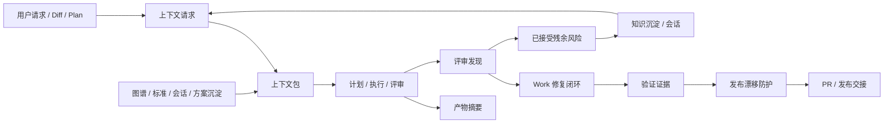

# feat: workflow harness evidence loop 三版本强化路线图

## 摘要

本计划把当前 `spec-first` 从 H4 evidence-governed harness 继续推进到 H5 review-closed engineering loop。路线分三版推进：先统一证据与阶段合同，再交付 summary-first context routing，最后闭合 review finding、work evidence、compound knowledge 和 release drift guard。

版本号是规划标签，不强制绑定最终 npm semver；实际 release 可按实现拆分。

## 2026-05-27 当前分支校准

本计划的上游路线图是 `docs/00-版本路线/版本规划.md`；H4 → H5 的成熟度判断来自 `docs/10-prompt/skill-agent-harness-audit/11-final-recommendations.md`。当前分支 `leo-2026-05-27-gitnexus-update` 已经落地一批原计划中的底座能力，因此本计划不再按 2026-05-14 原始 U1-U9 顺序直接执行。

已落地或已改口径的关键事实：

- `docs/contracts/ai-coding-harness.md` 已成为 Harness 分层总合同。
- `context-bundle.v1`、`artifact-summary.v1`、`review-finding.v1` 与 `spec-work-run-artifact.schema.json` 已存在，部分 workflow 已开始消费。
- GitNexus 已成为 active graph provider；CRG 仅作为迁移/历史残留清理对象，不再进入新能力主线。
- `spec-work-beta` 已删除，stable `spec-work` 是唯一执行入口。
- `spec-standards` 已从 active source surface 移除；后续只讨论 project guidance / host instructions / `docs/contracts/` / solutions 等可追溯上下文，不再规划 `.spec-first/standards/**` 或 standards glue map 主线。
- `review-pre-facts` 已扩展为 GitNexus bounded pre-facts helper，覆盖 `query` / `context` / `impact` / `detect_changes`，并带 durable redaction、source-read requirement 和 degraded reason。
- `spec-work` closeout 已有 `graph_evidence_used` 口径与 internal run artifact producer，但 workflow 全链路 closeout adoption 仍未闭合。

因此本计划剩余工作应收敛为四组：

1. **Contract gap**：决定是否还需要最小 `stage-contract`、`artifact-header`、`evidence-packet`；已有合同不能重复造第二套。
2. **Adoption gap**：把已存在的 `artifact-summary`、`context-bundle`、`review-finding`、`spec-work-run-artifact` 真正接进 plan/work/review/compound/release handoff，而不是只停留在文档。
3. **Review closure gap**：补 `fix-plan` / `re-review` / `compound-candidates` 的最小 artifact/producer/consumer 边界。
4. **Evaluation/release gap**：将 runtime capability catalog、README/docs、package delivery、dual-host governance 和 release artifact summary 纳入 deterministic drift guard。

---

## 问题框架

`spec-first` 已经具备 workflow skills、GitNexus graph readiness、task-pack、review pre-facts、task-level review gate、compound trigger checklist、spec-work run artifact producer、context/artifact/review contracts 和双宿主 runtime generation。当前主要缺口不再是“有没有能力”，而是这些能力之间的 adoption、artifact ownership 和 closeout 还不够统一：

- `Codebase -> Graph -> Spec -> Plan -> Tasks -> Code -> Review -> Knowledge` 链路中，不同 workflow 对 artifact、evidence、finding、context、degraded mode 的表达仍分散。
- Graph facts、GitNexus bounded pre-facts、context bundle、artifact summary 和 review finding 已有雏形，但 adoption 还没有覆盖核心 workflow chain。
- Review findings 已开始有共享 envelope，但 code/doc/app review 的 synthesis、residual handling、work follow-up 和 compound capture 还没有形成统一闭环。
- Context/token 治理已经有 `context-governance`、`context-bundle` 与 `artifact-summary` 合同，但仍需要 workflow 读取顺序、fanout 预算策略和 release/review adoption。
- 外部主流方向正在收敛到 repo instructions、sandboxed/ephemeral agent environment、explicit skills/subagents、MCP capability boundaries、reviewable PR/session logs、eval/trace-driven optimization；`spec-first` 应吸收这些原则，但不能退化成中心化 agent platform 或强状态机。

核心判断仍按角色契约执行：scripts prepare deterministic facts，LLM decides semantic judgment。

---

## 需求

- R1. 三版路线必须直接服务 `workflow harness + evidence governance + repo-local engineering loop`，不能新增无明确 consumer 的 schema 或 runtime producer。
- R2. 所有新协议必须保持 light contract：字段少、可测试、能解释 authority/degraded/freshness，不复制完整 workflow。
- R3. Evidence governance 必须区分 deterministic facts、LLM judgment、assumptions、session-local evidence、advisory evidence、stale evidence。
- R4. Context routing 必须 summary-first、path-backed、budget-aware，不做中心化 semantic router，不扫描 generated runtime mirrors 作为普通上下文。
- R5. Review closure 必须用 shared finding envelope 打通 code/doc/app review、work fix loop、residual risk、compound capture 和 release notes。
- R6. `spec-work` 必须能产出最小 run closeout evidence，支持 compaction/resume、review handoff 和 not-run/degraded reason；`spec-work-beta` 已删除，不再作为 consumer。
- R7. `spec-plan`、`spec-work`、`spec-code-review`、`spec-doc-review`、`spec-compound` 必须优先消费 artifact summary / context bundle，再按 trigger 展开 full artifact。
- R8. Graph/provider/MCP raw output 与 project-guidance context 必须保持 untrusted/advisory input 处理，进入 prompt 或 durable artifact 前要有 path containment、excerpt cap、provenance、reason_code 和 degraded classification。
- R9. Review fanout 必须 scale-aware：小 diff/docs-only 默认最小 reviewer set，高风险 contract/workflow/runtime/release 才扩大。
- R10. Public/internal helper 边界必须收紧：internal helpers 不作为用户入口推荐，mutating helper 必须有 explicit authorization、write scope、verification 和 changelog posture。
- R11. Skill/agent source 变更必须支持 fresh-source eval 或明确 not-run reason；runtime mirror 不作为 source truth。
- R12. Release/catalog guard 必须验证 public workflow inventory、runtime capability catalog、README/docs、package delivery 和 dual-host governance 的 deterministic drift。
- R13. Knowledge replay 必须能复用 accepted residuals、rejected/out-of-scope rationale、review findings 和 compound lessons，但不能变成 active workflow state。
- R14. 三版每版都必须有清晰 adoption gate、targeted tests 和 rollback/defer 边界。

---

## 假设

- A1. 当前分支已完成 GitNexus-only、interactive init、bounded pre-facts、Harness contract 与若干 workflow evidence adoption；本计划把这些视作当前 source truth，不再恢复 CRG、`spec-work-beta` 或 active `spec-standards` 方向。
- A2. `v1.9`、`v2.0`、`v2.1` 是路线标签；维护者可按实际 release cadence 合并或拆分。
- A3. 计划只规划 spec-first 当前项目，不实现代码，也不触碰 generated runtime mirrors。
- A4. `docs/contracts/context-governance.md`、`docs/contracts/context-bundle.md`、`docs/contracts/artifact-summary.md`、`docs/contracts/workflows/review-finding.md` 若在实施前被重命名或改写，实施者应以当时 source truth 为准。

---

## 范围边界

- 不新增中心化 workflow 状态机、current-task 文件、approval ledger、review dashboard、agent queue 或 marketplace。
- 不让 scripts 判断架构优先级、业务 scope、review 结论或 workflow route。
- 不把 graph/provider/MCP evidence 当作 confirmed truth；source、tests、compiled readiness facts 和 explicit user decisions 优先。
- 不手改 `.claude/`、`.codex/`、`.agents/skills/` 实现行为。
- 不恢复 `spec-work-beta` delegation、long-running autonomous runner 或 multi-agent fanout 到普通用户路径。
- 不复制外部工具的 prompt/prose/schema；只吸收工程原则并用 spec-first 自己的 source contracts 表达。

### 后续单独处理

- H6 自动治理平台、dashboard、长期 benchmark platform、marketplace/catalog。
- Generic MCP adapter framework，除非先命名 concrete provider、fixed argv shape、consumer 和 safety tests。
- Cross-repo CI/scheduled graph refresh，除非 graph refresh L1/L2 evidence 已稳定并另开计划。

---

## 图谱就绪状态

- target_repo: `spec-first`
- status: dirty-advisory
- source_revision: `16b0cf203a10ac223a3a0112ffa6eea96f48896c`
- current_revision: `69d38417`
- stale: true（当前分支晚于 graph-facts.source_revision，且工作区 dirty）
- primary_providers: `gitnexus`
- degraded_providers: none reported in compiled artifact
- fallback_capabilities: direct source reads, `rg`, existing contract tests, session-local GitNexus MCP pointer
- runtime_mcp_evidence: GitNexus MCP `query` used only as planning orientation; compiled graph facts report definitions-only / no impact evidence
- confidence: high for direct source/contract reads; advisory for graph-derived process/impact claims
- limitations: `.spec-first/graph/graph-facts.json` 当前为 `dirty-advisory`，`impact_context=false`，不能声明 graph-backed blast radius、related tests 或 process evidence。

---

## 上下文与研究

### 相关代码与模式

- `docs/10-prompt/结构化项目角色契约.md`: evolution baseline，定义 workflow harness、evidence loop、source/runtime 和 script/LLM 职责边界。
- `docs/contracts/graph-evidence-policy.md` 与 `docs/contracts/graph-provider-consumption.md`: compiled readiness、session-local evidence、stale graph、refresh ownership 和 forbidden compatibility reads。
- `docs/contracts/workflows/review-pre-facts-extraction.md`: pre-facts helper、query plan、provider result normalization、untrusted excerpts、temp artifact 和 run summary contract。
- `docs/contracts/context-governance.md`: runtime/generated/audit context 默认排除，summary-first 和 cache-friendly prompt layout。
- `docs/contracts/context-bundle.md`: `context-request.v1` / `context-bundle.v1` 的 lightweight envelope。
- `docs/contracts/artifact-summary.md`: durable workflow artifact 的 summary-first handoff。
- `docs/contracts/workflows/review-finding.md`: code/doc/app review 共享 finding envelope。
- `docs/contracts/ai-coding-harness.md`: 当前 Harness 分层总合同，约束 Context / Execution / Evidence / Evaluation / Governance / Knowledge 六层边界。
- `docs/contracts/gitnexus-capability-catalog.md`: GitNexus capability lane、source tags、readiness vocabulary 和 mutation boundary。
- `docs/10-prompt/skill-agent-harness-audit/11-final-recommendations.md`: 当前判断为 H4，下一阶段目标是 H5 review-closed loop，P0/P1 指向 public/internal、mutating helper、runtime parity 和 review closure。
- `docs/plans/2026-05-11-002-feat-spec-first-project-optimization-upgrade-plan.md`: 已有长期优化路线，第一阶段 MVP 聚焦 task handoff、execution evidence 和 token economy。

### 项目沉淀

- 已完成的 graph evidence、review pre-facts、task-pack review gate 和 no-graph fast path 说明：先交付轻量垂直切片，再扩大 adoption，是当前项目最稳的演进方式。
- `docs/solutions/workflow-issues/modify-source-not-artifacts-2026-04-13.md` 强化 source-first；runtime mirror drift 通过 init/update 处理。
- `docs/contracts/workflows/fresh-source-eval-checklist.md` 要求 skill/agent prose 变更后使用 fresh-source eval 或记录未执行原因。

### 外部参考

- OpenAI Codex docs 强调 coding agent 可以 read/modify/run code，cloud task 在 sandboxed environment 中执行，适合 background parallel work 和 PR draft，但需要 environment/security 边界。
- OpenAI agent docs 与 Codex use cases 强调 workflows、tools、knowledge、evals、skills、repeatable operations 和 reviewable outputs。
- Anthropic Claude Code docs 把 `CLAUDE.md`、skills、subagents、hooks、MCP 分成不同扩展面；subagents 有 separate context window 和 tool access，hooks 是 event automation。
- GitHub Copilot cloud agent docs 强调 research -> plan -> iterate -> PR/review，以及 ephemeral GitHub Actions environment、setup steps、session logs 和 PR review。
- MCP docs 把 prompts、resources、tools、roots、sampling 区分为不同 capability，且 prompts user-controlled、resources application-driven、roots define filesystem boundaries、sampling should keep human review in loop。

---

## 三个迭代版本

| 版本 | 主题 | 结果 | 主要验收门槛 |
| --- | --- | --- | --- |
| `v1.9` | 证据封套与紧凑阶段合同 | 已有 `artifact-summary`、`context-bundle`、`review-finding`、`spec-work-run-artifact` 底座；剩余是 adoption gap 与是否补 `stage-contract` / `artifact-header` / `evidence-packet` 的最小决策。 | 不新增重复 schema；`spec-plan` / `spec-work` / `spec-code-review` / `spec-doc-review` / `spec-compound` 的 handoff tests 能证明 existing contracts 被消费。 |
| `v2.0` | 上下文路由与证据选择 | `context-bundle` helper 已存在；剩余是 workflow intake 顺序、tool-budget / provider-risk、GitNexus session evidence lane 与 project-guidance source selection。 | context helper、runtime exclusion、budget/degraded reason、GitNexus lane 和 scale-aware dispatch 有聚焦测试与 workflow 覆盖。 |
| `v2.1` | Review 闭合的 repo-local 工程循环 | review findings 进入 work fix loop、accepted residuals、compound knowledge、release/changelog guard 和 source/runtime parity report。 | 一个真实 source-changing workflow 可从 plan / work / review / compound / release 形成 path-backed closeout，不依赖模型记忆。 |

---

## 关键技术决策

- D1. 先做 shared envelope adoption，再做 producer 扩展。理由：已有合同多于 adoption，先让核心 workflow 读写同一词表，避免继续增加孤立 schema。
- D2. Context routing 只做 deterministic envelope，不做 semantic router。理由：路径、预算、排除、reason_code 属于脚本；哪些上下文足够支撑当前判断仍属于 LLM。
- D3. Review closure 以 `review-finding.v1` 为最小共同字段，domain workflows 通过 `extensions` 保留差异。理由：code/doc/app review 风险不同，但 severity、evidence、owner、verification、residual status 应统一。
- D4. Durable evidence 记录 closeout 和 handoff，不记录 active progress state。理由：要支持 resume/review/compound，但不引入中心化状态机。
- D5. Release guard 只验证 deterministic drift。理由：脚本可判断 inventory、schema、manifest、README/catalog/package surface 是否一致；skill 语义质量仍由 LLM review/audit 判断。
- D6. 外部主流能力只映射到 spec-first 现有边界。理由：repo instructions、sandbox、skills/subagents、MCP、PR review 都支持本项目方向，但不能替代 source-first 和 workflow artifact chain。

---

## 开放问题

### 规划中已解决

- 是否应直接建设中心化 Context Router？不应。当前只做 `context-bundle` envelope、summary-first policy 和 helper，避免把语义排序交给脚本。
- 是否应把三版做成强 semver 承诺？不应。用 `v1.9` / `v2.0` / `v2.1` 作为路线标签，最终 release 可拆分。
- 是否应优先新增 agent？不应。当前缺口是 adoption、evidence、handoff、review closure，不是专家角色数量。

### 推迟到实施阶段

- `spec-work` run closeout 的剩余问题不是 producer 是否存在，而是 stable workflow 何时调用 producer、如何处理 resume/not-run/degraded evidence、以及是否需要 retention/prune follow-up。
- `context-bundle` helper 已存在且以 explicit paths 为主；是否允许 limited changed-file discovery 仍应另开计划，避免把 helper 变成 semantic router。
- `review-finding.v1` 在 code/doc/app review 中的 exact embedding 位置：实现时按各 workflow 现有 reviewer JSON/template 最小改动确定。

## 建议剩余执行顺序

下列顺序是当前分支的执行 source of truth。后面的 U1-U9 保留为 implementation catalog,用于说明可能改哪些文件、测哪些边界;不再代表 2026-05-14 原始线性执行顺序。执行时应先按本节选择下一组工作,再从 U1-U9 抽取对应文件和测试,避免继续按旧 U1 -> U9 全量推进。

1. **Schema budget refresh**：基于 `docs/contracts/ai-coding-harness.md` 复核现有 contract，决定 `stage-contract`、`artifact-header`、`evidence-packet` 哪些仍需要新增，哪些应由现有 `artifact-summary` / `review-pre-facts` / `spec-work-run-artifact` 覆盖。
2. **Core workflow adoption**：补 plan/work/review/doc-review/compound 对现有 summary/context/finding/run-artifact 的读取顺序和 focused tests。
3. **Review closure artifacts**：定义或收窄 `fix-plan` / `re-review` / `compound-candidates` 的 producer、canonical path、consumer 和 fallback。
4. **Context budget and dispatch policy**：在已有 `context-bundle` helper 基础上补 tool budget、provider risk、researcher budget 与 scale-aware dispatch tests。
5. **Release/evaluation guard**：把 runtime capability catalog、README/docs、package delivery、dual-host governance、release artifact summary 和 source/runtime parity 纳入 deterministic drift guard。

---

## 高层技术设计

> *本图只说明预期方案形态，作为审查方向参考，不是实现规格。实施者应把它当作上下文，而不是要逐字复刻的代码。*

该闭环是 repo-local 且 evidence-first 的。图示不是状态机；每条箭头表示 handoff contract 或消费路径。

---

## 实施单元

> U1-U9 是按原三版本路线保留下来的实施素材目录。当前执行顺序以 `## 建议剩余执行顺序` 为准；每个实施 slice 应只抽取相关 U 的文件、测试和边界,不得把依赖字段理解为旧计划的强线性状态机。

### U1. `v1.9` 紧凑阶段合同采纳

**目标：** 让核心 workflow 顶部在 30 秒内说明输入、输出、产物、证据要求、上下文策略、交接和降级模式。

**需求：** R1, R2, R3, R7, R11

**依赖：** Schema budget refresh 已决定 `stage-contract` / `artifact-header` / `evidence-packet` 的进入、合并或降级边界；不要求先新增 schema。

**文件：**
- 修改：`skills/spec-brainstorm/SKILL.md`
- 修改：`skills/spec-plan/SKILL.md`
- 修改：`skills/spec-write-tasks/SKILL.md`
- 修改：`skills/spec-work/SKILL.md`
- 修改：`skills/spec-code-review/SKILL.md`
- 修改：`skills/spec-doc-review/SKILL.md`
- 修改：`skills/spec-compound/SKILL.md`
- 测试：`tests/unit/public-workflow-contract-summary.test.js`
- 测试：`tests/unit/spec-plan-contracts.test.js`
- 测试：`tests/unit/spec-work-contracts.test.js`
- 测试：`tests/unit/spec-code-review-contracts.test.js`
- 测试：`tests/unit/spec-doc-review-contracts.test.js`
- 测试：`tests/unit/spec-compound-contracts.test.js`

**方案：**
- 复用已有 workflow contract summary 结构，不复制完整 workflow。
- 每个核心 stage 增加或校准证据要求与上下文策略，明确 artifact summary、context bundle、GitNexus graph readiness、project guidance 和 review finding 的消费姿态。
- 保持 progressive disclosure：长 examples、rubric、provider-specific details 下沉到 `references/`。

**执行说明：** 这是 skill prose 行为变化；实现后需要 focused contract tests，并执行 fresh-source eval 或记录未执行原因。

**遵循模式：**
- `skills/spec-plan/SKILL.md` 的 contract summary 和 graph readiness block。
- `skills/spec-doc-review/SKILL.md` 的 pre-facts / dispatch boundary。
- `docs/10-prompt/skill-agent-harness-audit/11-final-recommendations.md` 的 Skill MD Minimum。

**测试场景：**
- 合同断言：核心 workflow skills 都暴露紧凑的输入、输出、产物、交接和降级模式。
- 合同断言：summary 不把 generated runtime mirrors 推荐为 source truth。
- 合同断言：summary 区分 script-owned facts 与 LLM-owned judgment。
- 合同断言：长篇 provider-specific rules 只引用，不复制到入口正文。

**验证：**
- 聚焦 workflow contract tests 通过。
- implementation closeout 记录 fresh-source eval 结果或 not-run reason。

### U2. `v1.9` 证据包与 Artifact Summary 采纳

**目标：** 让 plan/work/review/compound handoff 默认传递 `artifact-summary.v1` 等价摘要，并为高风险 claim 提供 `evidence-packet.v1` 最小合同。

**当前状态：** `artifact-summary.v1` 与 `spec-work-run-artifact.schema.json` 已存在；`evidence-packet.v1` 仍需先做 schema budget 决策，避免和 `review-pre-facts` / `graph-evidence-policy` / `spec-work-run-artifact` 重叠。

**需求：** R2, R3, R6, R7, R8

**依赖：** U1

**文件：**
- 修改：`docs/contracts/artifact-summary.md`
- 可选新增：`docs/contracts/evidence-packet.md`（先完成 schema budget refresh）
- 修改：`docs/contracts/workflows/spec-work-run-artifact.schema.json`
- 修改：`skills/spec-plan/SKILL.md`
- 修改：`skills/spec-work/SKILL.md`
- 修改：`skills/spec-code-review/SKILL.md`
- 修改：`skills/spec-compound/SKILL.md`
- 测试：`tests/unit/spec-work-run-artifact-contract.test.js`
- 测试：`tests/unit/context-governance-contracts.test.js`
- 测试：`tests/unit/spec-work-contracts.test.js`

**方案：**
- 保持 `artifact-summary.v1` 是 summary-first handoff，不替代 full artifact。
- 若新增 `evidence-packet.v1`，只用于 high-risk claim：包含 fact、inference、assumption、limitation、source path、freshness、authority；若现有合同已覆盖，则记录 non-goal，不新增 schema。
- `spec-work` closeout 已有 durable JSON producer；剩余工作是 stable workflow 何时调用 producer、如何处理 resume/not-run/degraded evidence、以及 closeout 到 review/compound 的消费路径。
- Provider/raw outputs 只记录 summary、reason_code、artifact path，不嵌入大段 raw logs。

**遵循模式：**
- `docs/contracts/artifact-summary.md`
- `docs/contracts/workflows/review-pre-facts-extraction.md`
- `docs/contracts/graph-evidence-policy.md`

**测试场景：**
- 正向路径：work closeout 包含 changed files、verification、not-run/degraded reason 与 next action。
- 边界场景：stale graph evidence 不能在 evidence packet 中升级为 confirmed。
- 错误路径：缺少 provenance 的 provider raw output 必须归类为 advisory/degraded。
- 集成场景：compound 可以消费 artifact summary，而不需要读取完整 review report。

**验证：**
- Contract tests 证明 summary-first consumption language 与 raw-output boundary 已落地。

### U3. `v1.9` 跨 Review Workflow 采纳 Review Finding

**目标：** 让 code/doc/app review 的 synthesis 先消费 structured finding envelope，再按 evidence insufficiency 打开详细 reviewer prose。

**需求：** R5, R8, R9

**依赖：** U1, U2

**文件：**
- 修改：`docs/contracts/workflows/review-finding.md`
- 修改：`skills/spec-code-review/SKILL.md`
- 修改：`skills/spec-code-review/references/findings-schema.json`
- 修改：`skills/spec-doc-review/SKILL.md`
- 修改：`skills/spec-doc-review/references/findings-schema.json`
- 修改：`skills/spec-app-consistency-audit/SKILL.md`
- 测试：`tests/unit/spec-code-review-contracts.test.js`
- 测试：`tests/unit/spec-doc-review-contracts.test.js`
- 测试：`tests/unit/spec-app-consistency-audit-evidence.test.js`

**方案：**
- 不替换 domain-specific reviewer JSON；只要求 synthesis 可映射到 shared fields。
- P0/P1 findings 不得被 finding cap 静默丢弃。
- `owner` 和 `residual_status` 进入 final output，使 work/compound/release 能继续消费。
- 每个 actionable finding 必须有 path/command/artifact anchor。

**遵循模式：**
- `docs/contracts/workflows/review-finding.md`
- `skills/spec-code-review/references/findings-schema.json`
- `skills/spec-doc-review/references/synthesis-and-presentation.md`

**测试场景：**
- 正向路径：reviewer finding 能映射到共享的 severity、category、evidence、owner、residual_status。
- 边界场景：low-confidence finding 保持 advisory，没有证据时不能阻塞 release。
- 错误路径：没有 evidence anchor 的 actionable finding 无效，或必须降级。
- 集成场景：work follow-up 能从 final review output 识别 unresolved/high findings。

**验证：**
- 聚焦 review contract tests 通过。
- 一次 doc-review 或 code-review dry run 记录 `review-finding.v1` adoption status；若未执行，implementation closeout 记录原因。

### U4. `v2.0` Context Bundle Helper 与 Workflow Intake

**目标：** 让 reviewer、worker、researcher 的 dynamic suffix 通过 bounded `context-bundle.v1` 传递，减少 full artifact/full directory 读取。

**需求：** R4, R7, R8

**依赖：** U1, U2

**文件：**
- 修改：`docs/contracts/context-governance.md`
- 修改：`docs/contracts/context-bundle.md`
- 修改：`src/cli/commands/internal.js`
- 修改：`src/cli/helpers/context-bundle.js`
- 修改：`skills/spec-plan/SKILL.md`
- 修改：`skills/spec-work/SKILL.md`
- 修改：`skills/spec-code-review/SKILL.md`
- 修改：`skills/spec-doc-review/SKILL.md`
- 测试：`tests/unit/context-bundle-contracts.test.js`
- 测试：`tests/unit/context-governance-contracts.test.js`

**方案：**
- `spec-first internal context-bundle --json` 只接受 explicit paths 或 workflow-provided path lists；不做 repo search 或 semantic ranking。
- Bundle 输出 included/excluded context、reason_code、budget_used、full_read_triggers、confidence/degraded。
- Workflow 读取顺序改成 artifact summary -> context bundle -> exact evidence paths -> full read triggers。
- 默认排除 `.spec-first/audits/**` 与 generated runtime mirrors；runtime/audit/setup scoped tasks 显式例外。

**遵循模式：**
- `docs/contracts/context-governance.md`
- `docs/contracts/context-bundle.md`
- `src/cli/helpers/review-pre-facts/` 的 temp/output/path containment 思路。

**测试场景：**
- 正向路径：显式 source/test paths 能产出有效的 context bundle。
- 边界场景：`.spec-first/audits/**` 以 `runtime_audit_artifact_excluded` 排除。
- 错误路径：generated mirror path 默认排除，除非任务明确是 runtime-scoped。
- 集成场景：spec-doc-review prompt context 可引用 bundle summary，而不复制完整 artifacts。

**验证：**
- Context bundle helper tests 通过。
- Workflow contract tests 证明高频 workflows 提到 summary-first dynamic suffix。

### U5. `v2.0` Graph、Project Guidance、Sessions 与 Solutions 的证据源选择

**目标：** 把 GitNexus graph readiness、project guidance、sessions、solutions、review pre-facts 纳入统一 evidence source selection 纪律。

**当前状态：** `spec-standards` active surface 已移除；本单元不再新增 `.spec-first/standards/**`、standards glue map 或 standards examples，而是消费 already-loaded host/project instructions、directory-scoped instruction files、`docs/contracts/`、solutions 和 source-confirmed project guidance。

**需求：** R3, R4, R7, R8, R13

**依赖：** U4

**文件：**
- 修改：`docs/contracts/graph-evidence-policy.md`
- 修改：`skills/spec-plan/SKILL.md`
- 修改：`skills/spec-work/SKILL.md`
- 修改：`skills/spec-debug/SKILL.md`
- 修改：`skills/spec-sessions/SKILL.md`
- 修改：`skills/spec-compound/SKILL.md`
- 测试：`tests/unit/graph-provider-consumption-contracts.test.js`
- 测试：`tests/unit/spec-sessions-contracts.test.js`

**方案：**
- 建立 workflow-facing source selection rule：compiled GitNexus readiness / source-confirmed project guidance first；session-local MCP advisory；solutions/sessions require provenance-backed refs。
- `context-bundle` 只记录 candidate paths and reasons；LLM 判断是否展开和如何解释。
- `review-pre-facts` 继续服务 review orchestrator；不要复制其 provider result normalization。
- Rejected/out-of-scope rationale 以 artifact summary 或 compound reference 进入 context，不成为 active state。

**遵循模式：**
- `docs/contracts/graph-provider-consumption.md`
- `docs/contracts/gitnexus-capability-catalog.md`
- `docs/contracts/context-governance.md`

**测试场景：**
- 正向路径：source-confirmed project guidance 可作为 hard context 引用。
- 边界场景：session-local GitNexus 或 stale guidance 保持 advisory。
- 错误路径：stale graph facts 触发 limitation，不能成为 primary evidence。
- 集成场景：spec-plan 可通过 context bundle 引用相关 solution doc，而不扫描全部 `docs/solutions/**`。

**验证：**
- Graph consumption、context governance 与 session contract tests 通过。

### U6. `v2.0` 按规模调整的 Dispatch 与 Research Budget Policy

**目标：** 让 reviewer/researcher/subagent fanout 按 diff risk、artifact type、provider freshness、task complexity 收缩或扩大。

**需求：** R4, R9, R10, R11

**依赖：** U4, U5

**文件：**
- 新增：`docs/contracts/workflows/dispatch-budget-policy.md`
- 修改：`skills/spec-code-review/SKILL.md`
- 修改：`skills/spec-doc-review/SKILL.md`
- 修改：`skills/spec-plan/SKILL.md`
- 按需修改：`agents/*.agent.md`，仅当具体 agent 缺少 evidence/output boundary。
- 测试：`tests/unit/spec-dispatch-boundary-contracts.test.js`
- 测试：`tests/unit/spec-code-review-contracts.test.js`
- 测试：`tests/unit/spec-doc-review-contracts.test.js`

**方案：**
- 为 docs-only、窄范围代码、contract/runtime/security/release changes 定义 small/medium/high-risk dispatch profiles。
- Research agents 接收 context bundle 和 budget，不接收完整 plan/audit dumps。
- Implementation workers 不作为本单元主线；普通 review/research dispatch 不授权写入。
- Agent/skill behavior changes 需要 fresh-source eval，或记录 not-run reason。

**遵循模式：**
- Claude Code subagent 原则：separate context 与 focused tool access。
- 现有 `spec-doc-review` multi-persona dispatch 与 fallback contract。
- 当前 `spec-code-review` / `spec-doc-review` 的 bounded reviewer dispatch contract。

**测试场景：**
- 正向路径：docs-only review 使用最小 reviewer set。
- 边界场景：contract/runtime/security change 扩大 reviewer set，并记录原因。
- 错误路径：report-only/no-agents 禁用 dispatch，并记录 fallback reason。
- 集成场景：worker delegation prompt 携带 context bundle、write scope 与 review gate metadata。

**验证：**
- Dispatch boundary tests 通过。
- 记录 fresh-source eval 结果或 not-run reason。

### U7. `v2.1` Work 修复闭环与 Review Closure Handoff

**目标：** 把 unresolved review findings、fix verification、accepted residuals 和 next action 串成 work/review/compound 可消费的 closeout。

**需求：** R5, R6, R9, R13

**依赖：** U3, U4

**文件：**
- 新增：`docs/contracts/workflows/review-closure.md`
- 修改：`skills/spec-work/SKILL.md`
- 修改：`skills/spec-code-review/SKILL.md`
- 修改：`skills/spec-compound/SKILL.md`
- 测试：`tests/unit/spec-work-contracts.test.js`
- 测试：`tests/unit/spec-code-review-contracts.test.js`
- 测试：`tests/unit/spec-compound-contracts.test.js`

**方案：**
- `review-closure` 只记录 final review summary, finding ids, residual_status, verification evidence and next action；不记录 progress state。
- `spec-work` 对 P0/P1 或 review_focus-matching findings 要求 fix/re-review 或 explicit handoff。
- Accepted residuals 进入 PR Known Residuals 或 concise durable summary；compound 只在 learning-worthy trigger 命中时建议，不自动写。
- Closeout 能支持 compaction/resume：已读 artifact、关键决策、验证状态、degraded evidence、next action。

**遵循模式：**
- `docs/contracts/workflows/review-finding.md`
- `docs/contracts/workflows/spec-work-run-artifact.schema.json`
- `skills/spec-work/references/shipping-workflow.md`

**测试场景：**
- 正向路径：fixed finding 带 verification evidence 移动到 `applied`。
- 边界场景：accepted residual 保留 owner 与 next action。
- 错误路径：blocking finding 不能在没有 explicit handoff 时静默推迟。
- 集成场景：compound final checklist 可消费 review closure summary。

**验证：**
- Work/review/compound contract tests 通过。

### U8. `v2.1` Release 与 Runtime Drift Guard

**目标：** 在 release 前用 deterministic guard 暴露 public surface、runtime catalog、README/docs、dual-host governance、package delivery drift。

**需求：** R10, R11, R12

**依赖：** U1, U3, U6

**文件：**
- 修改：`src/cli/plugin.js`
- 修改：`src/cli/contracts/dual-host-governance/skills-governance.json`
- 修改：`scripts/generate-runtime-capability-catalog.js`
- 修改：`scripts/release-publish.cjs`
- 修改：`tests/smoke/release-dual-host-governance.sh`
- 修改：`tests/unit/dual-host-governance-contracts.test.js`
- 修改：`tests/unit/runtime-contract-boundary.test.js`
- 修改：`tests/unit/package-install-contracts.test.js`
- 修改：`README.md`
- 修改：`README.zh-CN.md`

**方案：**
- Guard 输出 blocking/advisory/docs-only/degraded classifications，不做 semantic skill quality judgment。
- 验证 public workflows、standalone skills、internal-only helpers、runtime capability catalog、README/user manual references、package files list 一致。
- Runtime parity 可得到 confirmed clean 或 explicit degraded reason；不得 silent fail。
- Source changes require CHANGELOG and runtime impact note.

**遵循模式：**
- `src/cli/plugin.js` governance checks。
- `tests/smoke/release-dual-host-governance.sh`。
- `docs/contracts/dual-host-governance/README.md`。

**测试场景：**
- 正向路径：public workflow inventory 与 docs/catalog/package projection 匹配。
- 边界场景：docs-only no-impact change 是 advisory，不阻塞。
- 错误路径：internal helper 暴露为 public entrypoint 时阻塞。
- 集成场景：runtime parity failure 输出 degraded reason 与 next action。

**验证：**
- Release/governance focused tests 通过。
- 仅当 package surface changes 时运行 `npm run build`。

### U9. `v2.1` 从 Findings、Residuals 与 Decisions 回放知识

**目标：** 让后续 plan/work/review 能复用 resolved findings、accepted residuals、rejected scope rationale、compound lessons 和 decision docs。

**需求：** R5, R7, R13

**依赖：** U2, U5, U7

**文件：**
- 修改：`skills/spec-compound/SKILL.md`
- 修改：`skills/spec-compound-refresh/SKILL.md`
- 修改：`skills/spec-sessions/SKILL.md`
- 修改：`skills/spec-plan/SKILL.md`
- 修改：`docs/contracts/artifact-summary.md`
- 测试：`tests/unit/spec-compound-contracts.test.js`
- 测试：`tests/unit/spec-sessions-contracts.test.js`
- 测试：`tests/unit/spec-plan-contracts.test.js`

**方案：**
- Compound 只捕获带 source/test/review evidence 的可复用经验；没有用户或 workflow decision 时，不从 review 自动写入。
- Sessions/replay 默认返回 summary + provenance，不返回 raw transcript dumps。
- Rejected/out-of-scope rationale 存在时，进入可查询的 artifact summary。
- Plan/work 消费知识时默认视为 advisory；只有 confirmed source/contract/test evidence 支撑时才升级为更强证据。

**遵循模式：**
- `docs/solutions/**` existing structure.
- `skills/spec-compound-refresh/SKILL.md`
- `docs/contracts/artifact-summary.md`

**测试场景：**
- 正向路径：compound 可引用 review closure summary 与 source evidence。
- 边界场景：stale learning 被标记为需要 refresh，而不是当作 confirmed。
- 错误路径：没有 provenance 的 session summary 保持 advisory。
- 集成场景：spec-plan 使用相关 rejected/out-of-scope rationale，避免重新规划已拒绝方向。

**验证：**
- Compound/session/plan contract tests 通过。

---

## 系统级影响

- **交互图谱：** 核心 public workflows 都会触达共享合同：`artifact-summary`、`context-bundle`、`review-finding`、graph evidence policy 和 release governance。Contract tests 必须防止 skills 之间漂移。
- **错误传播：** stale/degraded evidence 必须随 reason_code 和 limitation 传递，不能被 context bundle 或 artifact summary 归一化掉。
- **状态生命周期风险：** closeout artifacts 不能变成 active progress state；它们只支持 resume、review、compound 和 release handoff。
- **API 表面一致性：** Claude/Codex runtime delivery、README、runtime capability catalog 和 governance JSON 必须保持一致。
- **集成覆盖：** unit contract tests 证明 prose 与 schema 已被采纳；smoke / release tests 证明 package 与 dual-host surface；fresh-source eval 覆盖行为语义。
- **不变约束：** source-of-truth 仍是 `skills/`、`agents/`、`templates/`、`src/cli/`、`docs/`、`README*`、`AGENTS.md`、`CLAUDE.md`；generated runtime mirrors 仍保持 generated。

---

## 风险与依赖

| 风险 | 缓解措施 |
|------|------------|
| 协议过多导致新复杂度 | 每个协议必须命名 producer、consumer、test；没有 consumer 的字段不进 v1。 |
| Context bundle 演化成 semantic router | Helper 只做 explicit path normalization、budget、exclusion、reason_code；LLM 决定语义相关性。 |
| Review closure 变成状态机 | 只记录 finding/residual/verification closeout，不记录 active progress、approval state 或 task lifecycle。 |
| Stale graph 被误当 primary evidence | 所有 workflow 在声明 graph-backed evidence 前比较 `source_revision`、`worktree_dirty`、`worktree_status_hash`，并区分 GitNexus definitions-only / impact unavailable。 |
| Release guard 误做语义判断 | Guard 只输出 deterministic drift classification；skill quality 仍由 review/audit 判断。 |
| 当前未提交改动和本计划冲突 | 实施前先读最新 source truth；本计划路径是目标 surface，不覆盖已有用户改动。 |

---

## 文档与运维说明

- 每版实施都必须更新 `CHANGELOG.md`。
- 用户可见行为变化需要同步 `README.md`、`README.zh-CN.md` 或用户手册。
- Skill/agent prose 变化需要 focused contract tests；高影响变化需要 fresh-source eval 或 explicit not-run reason。
- Runtime generation 变化必须说明是否需要运行交互式 `spec-first init` 并选择对应 host。
- Review closure adoption 前，不要宣称 H5 已完成；只能说 H4 到 H5 的协议面已铺设。

---

## 备选方案取舍

- 中心化 workflow engine：拒绝。它会把 LLM semantic judgment 推给状态机，违背角色契约。
- 全量 Context Router：拒绝。当前只需要 bounded envelope 和 summary-first policy，不需要脚本替 LLM 排语义优先级。
- 新增更多 reviewer/worker agents：暂缓。当前瓶颈是 evidence/handoff/closure adoption，不是 agent 数量。
- 自动 graph refresh / hook rebuild：暂缓。保持 automatic check, explicit refresh；高风险 graph-heavy 工作显式 handoff 到 graph-bootstrap。
- Dashboard / marketplace：暂缓。当前 repo-local artifact loop 未闭合前，不做产品平台化。

---

## 来源与参考

- 角色基线：`docs/10-prompt/结构化项目角色契约.md`
- 总路线图：`docs/00-版本路线/版本规划.md`
- Harness 总合同：`docs/contracts/ai-coding-harness.md`
- 图谱证据：`docs/contracts/graph-evidence-policy.md`
- 图谱消费：`docs/contracts/graph-provider-consumption.md`
- GitNexus capability catalog：`docs/contracts/gitnexus-capability-catalog.md`
- Review pre-facts：`docs/contracts/workflows/review-pre-facts-extraction.md`
- 上下文治理：`docs/contracts/context-governance.md`
- Context bundle：`docs/contracts/context-bundle.md`
- Artifact summary：`docs/contracts/artifact-summary.md`
- Review finding：`docs/contracts/workflows/review-finding.md`
- Harness audit 建议：`docs/10-prompt/skill-agent-harness-audit/11-final-recommendations.md`
- 现有优化计划：`docs/plans/2026-05-11-002-feat-spec-first-project-optimization-upgrade-plan.md`
- OpenAI Codex cloud 文档：`https://platform.openai.com/docs/codex`
- OpenAI Codex agent internet access 文档：`https://platform.openai.com/docs/codex/agent-network`
- OpenAI Codex use cases：`https://developers.openai.com/codex/explore/`
- Anthropic Claude Code subagents 文档：`https://docs.anthropic.com/en/docs/claude-code/sub-agents`
- Anthropic Claude Code hooks 文档：`https://docs.anthropic.com/en/docs/claude-code/hooks`
- GitHub Copilot cloud agent research/plan/iterate 文档：`https://docs.github.com/en/copilot/how-tos/use-copilot-agents/coding-agent/research-plan-iterate`
- GitHub Copilot custom instructions 文档：`https://docs.github.com/en/copilot/concepts/about-customizing-github-copilot-chat-responses`
- MCP resources 文档：`https://modelcontextprotocol.io/docs/concepts/resources`
- MCP prompts 文档：`https://modelcontextprotocol.io/docs/concepts/prompts`
- MCP roots 文档：`https://modelcontextprotocol.io/docs/concepts/roots`
- MCP sampling 文档：`https://modelcontextprotocol.io/docs/concepts/sampling`
