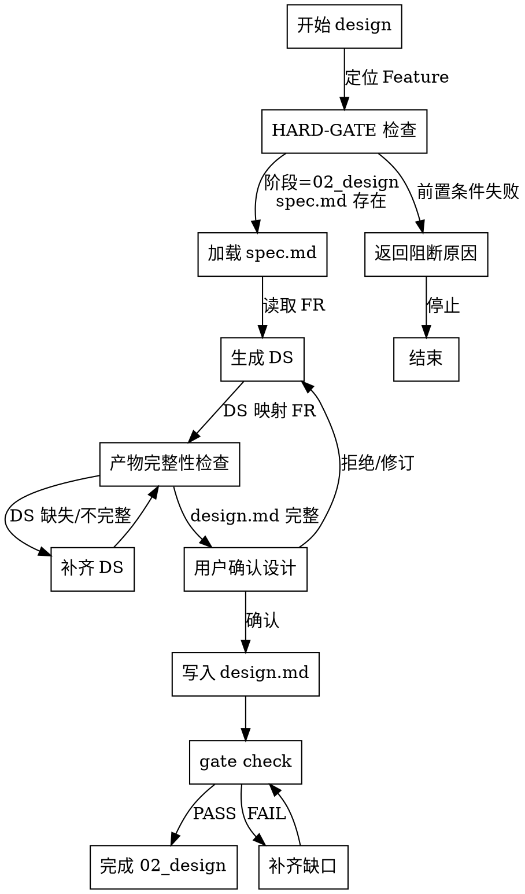

# HARD-GATE 检查规则

> Design Skill 的入口守卫与产物完整性检查

---

## HARD-GATE 定义

**核心原则**: NO implementation code until design artifacts are complete and approved.

**触发时机**: 进入 design 阶段前

---

## 前置条件检查

### 1. 阶段校验

**规则**: 当前阶段必须为 `02_design`

**检查方式**: 读取 `specs/{featureId}/stage-state.json`

**失败处理**: 返回阻断原因，停止执行

**错误消息**:
```
❌ HARD-GATE 阻断: 阶段不匹配

当前阶段: 01_specify
要求阶段: 02_design

💡 解决方案:
运行 spec-first stage advance 推进到 02_design
```

---

### 2. spec.md 存在性检查

**规则**: `specs/{featureId}/spec.md` 必须存在且可读取

**检查方式**: 文件系统检查

**失败处理**: 返回阻断原因，停止执行

**错误消息**:
```
❌ HARD-GATE 阻断: 缺失需求规格

未找到 specs/{featureId}/spec.md

💡 解决方案:
运行 /spec-first:spec 生成需求规格
```

---

## 产物完整性检查

### 检查时机

**P5 阶段**: design.md 写入后

### 检查项

1. **FR→DS 覆盖率**
   - 命令: `spec-first metrics coverage`
   - 要求: C1 (Design Coverage) > 0%
   - 失败: 补齐缺失的 DS

2. **孤立项检测**
   - 命令: `spec-first matrix check`
   - 要求: 无 orphan DS（无 FR 映射的 DS）
   - 失败: 删除或关联孤立 DS

3. **design.md 结构检查**
   - 要求: 包含模块划分、API 设计、数据模型
   - 失败: 补充缺失章节

---

## 设计简洁性守卫

- 在 DS 生成阶段逐条检查：该设计是否直接服务当前 FR / NFR / 约束
- 在用户确认阶段仅保留直接支撑当前交付的必要设计
- 对未来可能有价值但当前不需要的扩展方向，记录到 `findings.md` 或 ADR 候选

---

## 决策流程图



---

## 宪法权威参考

**规则**: 设计评审时必须对照 `../03-spec/references/constitution-authority.md`

**冲突处理**: 若 Design 与 Constitution 冲突，优先修正 Design

**示例**:
```
Constitution 规定: 所有 API 必须支持幂等性
Design 方案: POST /api/orders 不支持幂等

冲突解决: 修改 Design，添加幂等键机制
```

---

## 覆盖率检查

### C1: Design Coverage

**定义**: FR→DS 覆盖率

**计算**: `(已映射 FR 数 / 总 FR 数) * 100%`

**要求**: > 0%

**命令**: `spec-first metrics coverage`

**输出示例**:
```
C1 (Design Coverage): 80% (8/10 FR)

未覆盖 FR:
- FR-AUTH-009: 第三方登录
- FR-AUTH-010: 账号注销
```

---

## 孤立项检测

**定义**: 无上游映射的 DS

**命令**: `spec-first matrix check`

**输出示例**:
```
⚠️  发现 2 个孤立 DS:

- DS-AUTH-005: 无对应 FR
- DS-AUTH-007: 无对应 FR

建议:
1. 删除无用 DS
2. 或补充对应 FR
```

---

## 阻断原因分类

| 类型 | 说明 | 解决方案 |
|------|------|----------|
| 阶段不匹配 | 当前阶段 ≠ 02_design | 运行 stage advance |
| 缺失 spec.md | 需求规格未生成 | 运行 /spec-first:spec |
| FR 覆盖率为 0 | 所有 FR 都无 DS | 补充 DS 映射 |
| 存在孤立 DS | DS 无 FR 映射 | 删除或关联 DS |
| design.md 不完整 | 缺少必需章节 | 补充模块/API/数据模型 |

## design-view 评审门槛
- 设计前优先读取 `design-view`
- 正式设计评审属于高依赖场景，可提升为 `L3`
- 报告中必须标注 `backgroundInputStatus`
