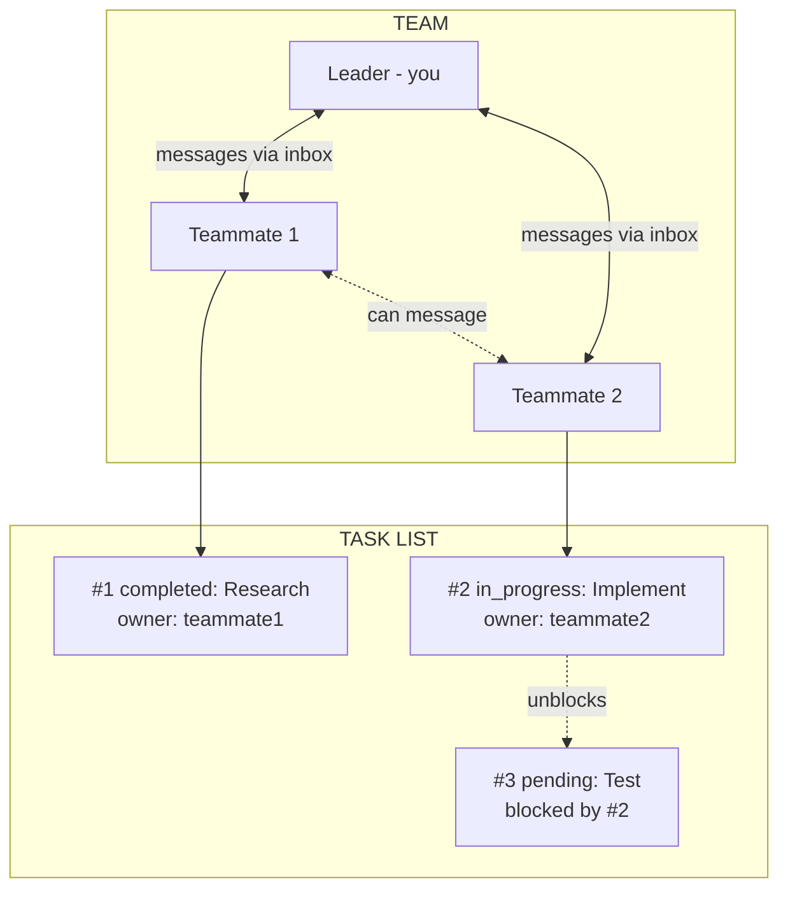
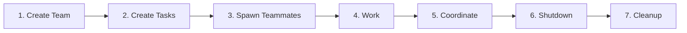
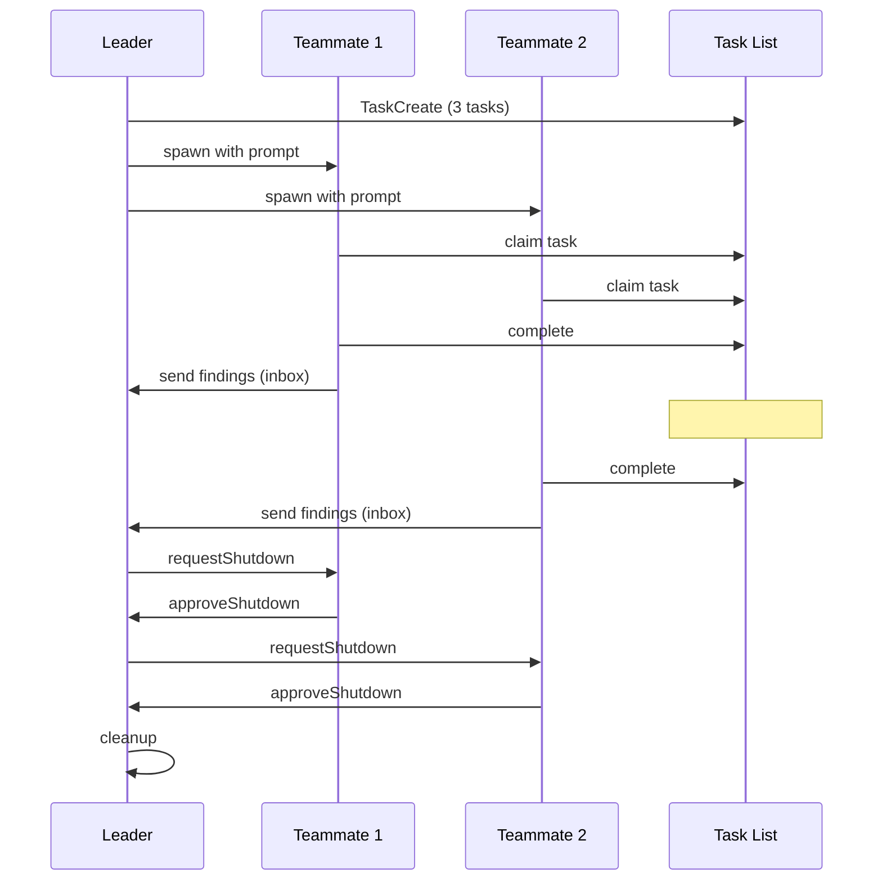
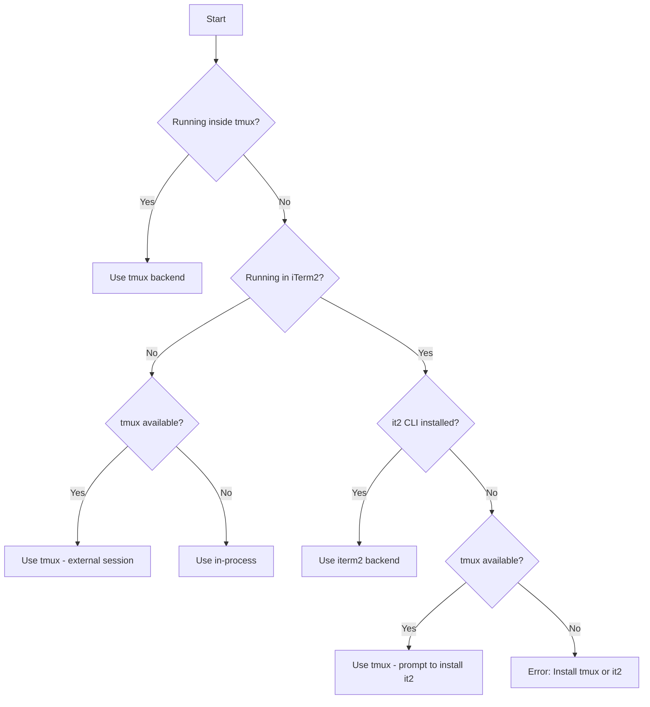

# Claude Code Swarm 编排

使用 Claude Code 的 TeammateTool 和任务系统掌握多代理编排。

---

## 基元

|原始|它是什么 |文件位置 |
|----------|----------|--------------|
| **代理** |可以使用工具的克劳德实例。你是一名代理人。子代理是您生成的代理。 |不适用（过程）|
| **团队** |一组指定的特工一起工作。一名领导者，多名队友。 | `~/.claude/teams/{name}/config.json` |
| **队友** |加入团队的特工。有名称、颜色、收件箱。通过带有 `team_name` + `name` 的任务生成。 |列于团队配置 |
| **领导者** |创建团队的代理人。接收队友消息，批准计划/关闭。 |配置中的第一个成员 |
| **任务** |具有主题、描述、状态、所有者和依赖项的工作项。 |平台管理的任务存储（不要假设存储库本地文件路径）|
| **收件箱** |代理从队友接收消息的 JSON 文件。 | `~/.claude/teams/{name}/inboxes/{agent}.json` |
| **留言** |在代理之间发送的 JSON 对象。可以是文本或结构化（shutdown_request、idle_notification 等）。 |存储在收件箱文件中 |
| **后端** |队友怎么跑。自动检测：`in-process`（相同的 Node.js，不可见）、`tmux`（单独的窗格，可见）、`iterm2`（iTerm2 中的拆分窗格）。请参阅[Spawn 后端](#spawn-backends)。 |根据环境自动检测 |

### 他们如何联系

### 生命周期

### 消息流

---

## 目录

1. [核心架构](#core-architecture)
2. [生成代理的两种方式](#two-ways-to-spawn-agents)
3. [内置代理类型](#built-in-agent-types)
4. [插件代理类型](#plugin-agent-types)
5. [TeammateTool 操作](#teammatetool-operations)
6. [任务系统集成](#task-system-integration)
7. [消息格式](#message-formats)
8. [编排模式](#orchestration-patterns)
9. [环境变量](#environment-variables)
10. [Spawn 后端](#spawn-backends)
11. [错误处理](#error-handling)
12.[完整工作流程](#complete-workflows)

---

## 核心架构

### 群体如何工作

群由以下部分组成：
- **领导者**（你） - 创建团队，产生工人，协调工作
- **队友**（产生的代理） - 执行任务，报告回来
- **任务列表** - 具有依赖项的共享工作队列
- **收件箱** - 用于代理间消息传递的 JSON 文件

### 文件结构
```
~/.claude/teams/{team-name}/
├── config.json              # Team metadata and member list
└── inboxes/
    ├── team-lead.json       # Leader's inbox
    ├── worker-1.json        # Worker 1's inbox
    └── worker-2.json        # Worker 2's inbox

Platform task system
├── Task #1
├── Task #2
└── Task #3
```
### 团队配置结构
```json
{
  "name": "my-project",
  "description": "Working on feature X",
  "leadAgentId": "team-lead@my-project",
  "createdAt": 1706000000000,
  "members": [
    {
      "agentId": "team-lead@my-project",
      "name": "team-lead",
      "agentType": "team-lead",
      "color": "#4A90D9",
      "joinedAt": 1706000000000,
      "backendType": "in-process"
    },
    {
      "agentId": "worker-1@my-project",
      "name": "worker-1",
      "agentType": "Explore",
      "model": "haiku",
      "prompt": "Analyze the codebase structure...",
      "color": "#D94A4A",
      "planModeRequired": false,
      "joinedAt": 1706000001000,
      "tmuxPaneId": "in-process",
      "cwd": "/Users/me/project",
      "backendType": "in-process"
    }
  ]
}
```
---

## 生成代理的两种方法

### 方法 1：任务工具（子代理）

使用 Task 进行**短暂、专注的工作**并返回结果：
```javascript
Task({
  subagent_type: "Explore",
  description: "Find auth files",
  prompt: "Find all authentication-related files in this codebase",
  model: "haiku"  // Optional: haiku, sonnet, opus
})
```
**特点：**
- 同步运行（阻塞直到完成）或与 `run_in_background: true` 异步运行
- 将结果直接返回给您
- 无需团队成员资格
- 最适合：搜索、分析、重点研究

### 方法2：任务工具+团队名称+姓名（队友）

使用带有 `team_name` 和 `name` 的任务来**产生持久的队友**：
```javascript
// First create a team
Teammate({ operation: "spawnTeam", team_name: "my-project" })

// Then spawn a teammate into that team
Task({
  team_name: "my-project",        // Required: which team to join
  name: "security-reviewer",      // Required: teammate's name
  subagent_type: "security-sentinel",
  prompt: "Review all authentication code for vulnerabilities. Send findings to team-lead via Teammate write.",
  run_in_background: true         // Teammates usually run in background
})
```
**特点：**
- 加入队伍，出现在`config.json`
- 通过收件箱消息进行交流
- 可以从共享任务列表中领取任务
- 持续到关闭为止
- 最适合：并行工作、持续协作、管道阶段

### 主要区别

|方面|任务（子代理）|任务+团队名称+姓名（队友）|
|--------------------|-----------------|------------------------------------------------|
|寿命 |直到任务完成 |直到请求关闭为止|
|通讯 |返回值 |收件箱消息 |
|任务访问 |无 |共享任务列表 |
|团队成员 |没有 |是的 |
|协调|一次性 |正在进行 |

---

## 内置代理类型

这些始终无需插件即可使用：

### 猛击
```javascript
Task({
  subagent_type: "Bash",
  description: "Run git commands",
  prompt: "Check git status and show recent commits"
})
```
- **工具：** 仅 Bash
- **型号：** 继承自父级
- **最适合：** Git 操作、命令执行、系统任务

### 探索
```javascript
Task({
  subagent_type: "Explore",
  description: "Find API endpoints",
  prompt: "Find all API endpoints in this codebase. Be very thorough.",
  model: "haiku"  // Fast and cheap
})
```
- **工具：** 所有只读工具（无编辑、写入、NotebookEdit、任务）
- **模型：**俳句（速度优化）
- **最适合：** 代码库探索、文件搜索、代码理解
- **彻底程度：**“快速”、“中等”、“非常彻底”

### 计划
```javascript
Task({
  subagent_type: "Plan",
  description: "Design auth system",
  prompt: "Create an implementation plan for adding OAuth2 authentication"
})
```
- **工具：** 所有只读工具
- **型号：** 继承自父级
- **最适合：** 架构规划、实施策略

### 通用
```javascript
Task({
  subagent_type: "general-purpose",
  description: "Research and implement",
  prompt: "Research React Query best practices and implement caching for the user API"
})
```
- **工具：** 所有工具 (*)
- **型号：** 继承自父级
- **最适合：** 多步骤任务、研究 + 行动组合

### 克劳德代码指南
```javascript
Task({
  subagent_type: "claude-code-guide",
  description: "Help with Claude Code",
  prompt: "How do I configure MCP servers?"
})
```
- **工具：**只读 + WebFetch + WebSearch
- **最适合：** 有关 Claude Code、Agent SDK、Anthropic API 的问题

### 状态行设置
```javascript
Task({
  subagent_type: "statusline-setup",
  description: "Configure status line",
  prompt: "Set up a status line showing git branch and node version"
})
```
- **工具：** 只读、编辑
- **型号：**十四行诗
- **最适合：** 配置 Claude Code 状态行

---

## 插件代理类型

来自 `spec-first` 插件（示例）：

### 审核代理
```javascript
// Security review
Task({
  subagent_type: "spec-first:review:security-sentinel",
  description: "Security audit",
  prompt: "Audit this PR for security vulnerabilities"
})

// Performance review
Task({
  subagent_type: "spec-first:review:performance-oracle",
  description: "Performance check",
  prompt: "Analyze this code for performance bottlenecks"
})

// Rails code review
Task({
  subagent_type: "spec-first:review:kieran-rails-reviewer",
  description: "Rails review",
  prompt: "Review this Rails code for best practices"
})

// Architecture review
Task({
  subagent_type: "spec-first:review:architecture-strategist",
  description: "Architecture review",
  prompt: "Review the system architecture of the authentication module"
})

// Code simplicity
Task({
  subagent_type: "spec-first:review:code-simplicity-reviewer",
  description: "Simplicity check",
  prompt: "Check if this implementation can be simplified"
})
```
**来自规范优先的所有审查代理：**
- `agent-native-reviewer` - 确保功能也适用于代理
- `architecture-strategist` - 架构合规性
- `code-simplicity-reviewer` - YAGNI 和极简主义
- `data-integrity-guardian` - 数据库和数据安全
- `data-migration-expert` - 迁移验证
- `deployment-verification-agent` - 预部署清单
- `dhh-rails-reviewer` - DHH/37signals 导轨式
- `julik-frontend-races-reviewer` - JavaScript 竞争条件
- `kieran-python-reviewer` - Python最佳实践
- `kieran-rails-reviewer` - Rails 最佳实践
- `kieran-typescript-reviewer` - TypeScript 最佳实践
- `pattern-recognition-specialist` - 设计模式和反模式
- `performance-oracle` - 性能分析
- `security-sentinel` - 安全漏洞

### 研究代理
```javascript
// Best practices research
Task({
  subagent_type: "spec-first:research:best-practices-researcher",
  description: "Research auth best practices",
  prompt: "Research current best practices for JWT authentication in Rails 2024-2026"
})

// Framework documentation
Task({
  subagent_type: "spec-first:research:framework-docs-researcher",
  description: "Research Active Storage",
  prompt: "Gather comprehensive documentation about Active Storage file uploads"
})

// Git history analysis
Task({
  subagent_type: "spec-first:research:git-history-analyzer",
  description: "Analyze auth history",
  prompt: "Analyze the git history of the authentication module to understand its evolution"
})
```
**所有研究人员：**
- `best-practices-researcher` - 外部最佳实践
- `framework-docs-researcher` - 框架文档
- `git-history-analyzer` - 代码考古
- `learnings-researcher` - 搜索文档/解决方案/
- `repo-research-analyst` - 存储库模式

### 设计代理
```javascript
Task({
  subagent_type: "spec-first:design:figma-design-sync",
  description: "Sync with Figma",
  prompt: "Compare implementation with Figma design at [URL]"
})
```
### 工作流程代理
```javascript
Task({
  subagent_type: "spec-first:workflow:bug-reproduction-validator",
  description: "Validate bug",
  prompt: "Reproduce and validate this reported bug: [description]"
})
```
---

## Teammate工具操作

### 1.spawnTeam - 创建团队
```javascript
Teammate({
  operation: "spawnTeam",
  team_name: "feature-auth",
  description: "Implementing OAuth2 authentication"
})
```
**创建：**
- `~/.claude/teams/feature-auth/config.json`
- `feature-auth` 的平台管理任务记录
- 你成为团队领导者

### 2.discoverTeams - 列出可用团队
```javascript
Teammate({ operation: "discoverTeams" })
```
**返回：** 您可以加入的团队列表（还不是成员）

### 3. requestJoin - 请求加入团队
```javascript
Teammate({
  operation: "requestJoin",
  team_name: "feature-auth",
  proposed_name: "helper",
  capabilities: "I can help with code review and testing"
})
```
### 4.approveJoin - 接受加入请求（仅限领导者）

当您收到 `join_request` 消息时：
```json
{"type": "join_request", "proposedName": "helper", "requestId": "join-123", ...}
```
批准它：
```javascript
Teammate({
  operation: "approveJoin",
  target_agent_id: "helper",
  request_id: "join-123"
})
```
### 5.rejectJoin - 拒绝加入请求（仅限领导者）
```javascript
Teammate({
  operation: "rejectJoin",
  target_agent_id: "helper",
  request_id: "join-123",
  reason: "Team is at capacity"
})
```
### 6. 写 - 向队友发送消息
```javascript
Teammate({
  operation: "write",
  target_agent_id: "security-reviewer",
  value: "Please prioritize the authentication module. The deadline is tomorrow."
})
```
**对队友很重要：** 您的文本输出对团队不可见。您必须使用 `write` 进行通信。

### 7. 广播 - 向所有队友发送消息
```javascript
Teammate({
  operation: "broadcast",
  name: "team-lead",  // Your name
  value: "Status check: Please report your progress"
})
```
**警告：** 广播的成本很高 - 为 N 个队友发送 N 个单独的消息。优先选择 `write` 而非特定队友。

**播出时间：**
- 需要立即关注的关键问题
- 影响每个人的重大公告

**何时不广播：**
- 回复一名队友
- 正常来回
- 仅与部分队友相关的信息

### 8. requestShutdown - 要求队友退出（仅限领导者）
```javascript
Teammate({
  operation: "requestShutdown",
  target_agent_id: "security-reviewer",
  reason: "All tasks complete, wrapping up"
})
```
### 9.approveShutdown - 接受关闭（仅限队友）

当您收到 `shutdown_request` 消息时：
```json
{"type": "shutdown_request", "requestId": "shutdown-123", "from": "team-lead", "reason": "Done"}
```
**必须**致电：
```javascript
Teammate({
  operation: "approveShutdown",
  request_id: "shutdown-123"
})
```
这会发送确认并终止您的进程。

### 10.rejectShutdown - 拒绝关机（仅限队友）
```javascript
Teammate({
  operation: "rejectShutdown",
  request_id: "shutdown-123",
  reason: "Still working on task #3, need 5 more minutes"
})
```
### 11.approvePlan - 批准队友的计划（仅限领导者）

当`plan_mode_required`的队友发送计划时：
```json
{"type": "plan_approval_request", "from": "architect", "requestId": "plan-456", ...}
```
批准：
```javascript
Teammate({
  operation: "approvePlan",
  target_agent_id: "architect",
  request_id: "plan-456"
})
```
### 12.rejectPlan - 拒绝带有反馈的计划（仅限领导者）
```javascript
Teammate({
  operation: "rejectPlan",
  target_agent_id: "architect",
  request_id: "plan-456",
  feedback: "Please add error handling for the API calls and consider rate limiting"
})
```
### 13. cleanup - 删除团队资源
```javascript
Teammate({ operation: "cleanup" })
```
**删除：**
- `~/.claude/teams/{team-name}/`目录
- 由平台任务系统管理的团队相关任务元数据

**重要：**如果队友仍然活跃，将会失败。首先使用`requestShutdown`。

---

## 任务系统集成

### TaskCreate - 创建工作项
```javascript
TaskCreate({
  subject: "Review authentication module",
  description: "Review all files in app/services/auth/ for security vulnerabilities",
  activeForm: "Reviewing auth module..."  // Shown in spinner when in_progress
})
```
### 任务列表 - 查看所有任务
```javascript
TaskList()
```
返回：
```
#1 [completed] Analyze codebase structure
#2 [in_progress] Review authentication module (owner: security-reviewer)
#3 [pending] Generate summary report [blocked by #2]
```
### TaskGet - 获取任务详细信息
```javascript
TaskGet({ taskId: "2" })
```
返回包含描述、状态、阻塞者等的完整任务。

### TaskUpdate - 更新任务状态
```javascript
// Claim a task
TaskUpdate({ taskId: "2", owner: "security-reviewer" })

// Start working
TaskUpdate({ taskId: "2", status: "in_progress" })

// Mark complete
TaskUpdate({ taskId: "2", status: "completed" })

// Set up dependencies
TaskUpdate({ taskId: "3", addBlockedBy: ["1", "2"] })
```
### 任务依赖关系

当阻塞任务完成后，阻塞任务会自动解除阻塞：
```javascript
// Create pipeline
TaskCreate({ subject: "Step 1: Research" })        // #1
TaskCreate({ subject: "Step 2: Implement" })       // #2
TaskCreate({ subject: "Step 3: Test" })            // #3
TaskCreate({ subject: "Step 4: Deploy" })          // #4

// Set up dependencies
TaskUpdate({ taskId: "2", addBlockedBy: ["1"] })   // #2 waits for #1
TaskUpdate({ taskId: "3", addBlockedBy: ["2"] })   // #3 waits for #2
TaskUpdate({ taskId: "4", addBlockedBy: ["3"] })   // #4 waits for #3

// When #1 completes, #2 auto-unblocks
// When #2 completes, #3 auto-unblocks
// etc.
```
### 逻辑任务记录示例

代表任务记录：
```json
{
  "id": "1",
  "subject": "Review authentication module",
  "description": "Review all files in app/services/auth/...",
  "status": "in_progress",
  "owner": "security-reviewer",
  "activeForm": "Reviewing auth module...",
  "blockedBy": [],
  "blocks": ["3"],
  "createdAt": 1706000000000,
  "updatedAt": 1706000001000
}
```
---

## 消息格式

### 常规消息
```json
{
  "from": "team-lead",
  "text": "Please prioritize the auth module",
  "timestamp": "2026-01-25T23:38:32.588Z",
  "read": false
}
```
### 结构化消息（文本字段中的 JSON）

#### 关闭请求
```json
{
  "type": "shutdown_request",
  "requestId": "shutdown-abc123@worker-1",
  "from": "team-lead",
  "reason": "All tasks complete",
  "timestamp": "2026-01-25T23:38:32.588Z"
}
```
#### 关闭已批准
```json
{
  "type": "shutdown_approved",
  "requestId": "shutdown-abc123@worker-1",
  "from": "worker-1",
  "paneId": "%5",
  "backendType": "in-process",
  "timestamp": "2026-01-25T23:39:00.000Z"
}
```
#### 空闲通知（当队友停止时自动发送）
```json
{
  "type": "idle_notification",
  "from": "worker-1",
  "timestamp": "2026-01-25T23:40:00.000Z",
  "completedTaskId": "2",
  "completedStatus": "completed"
}
```
#### 任务完成
```json
{
  "type": "task_completed",
  "from": "worker-1",
  "taskId": "2",
  "taskSubject": "Review authentication module",
  "timestamp": "2026-01-25T23:40:00.000Z"
}
```
#### 计划批准请求
```json
{
  "type": "plan_approval_request",
  "from": "architect",
  "requestId": "plan-xyz789",
  "planContent": "# Implementation Plan\n\n1. ...",
  "timestamp": "2026-01-25T23:41:00.000Z"
}
```
#### 加入请求
```json
{
  "type": "join_request",
  "proposedName": "helper",
  "requestId": "join-abc123",
  "capabilities": "Code review and testing",
  "timestamp": "2026-01-25T23:42:00.000Z"
}
```
#### 权限请求（沙箱/工具权限）
```json
{
  "type": "permission_request",
  "requestId": "perm-123",
  "workerId": "worker-1@my-project",
  "workerName": "worker-1",
  "workerColor": "#4A90D9",
  "toolName": "Bash",
  "toolUseId": "toolu_abc123",
  "description": "Run npm install",
  "input": {"command": "npm install"},
  "permissionSuggestions": ["Bash(npm *)"],
  "createdAt": 1706000000000
}
```
---

## 编排模式

### 模式1：并行专家（领导者模式）

多名专家同时审查代码：
```javascript
// 1. Create team
Teammate({ operation: "spawnTeam", team_name: "code-review" })

// 2. Spawn specialists in parallel (single message, multiple Task calls)
Task({
  team_name: "code-review",
  name: "security",
  subagent_type: "spec-first:review:security-sentinel",
  prompt: "Review the PR for security vulnerabilities. Focus on: SQL injection, XSS, auth bypass. Send findings to team-lead.",
  run_in_background: true
})

Task({
  team_name: "code-review",
  name: "performance",
  subagent_type: "spec-first:review:performance-oracle",
  prompt: "Review the PR for performance issues. Focus on: N+1 queries, memory leaks, slow algorithms. Send findings to team-lead.",
  run_in_background: true
})

Task({
  team_name: "code-review",
  name: "simplicity",
  subagent_type: "spec-first:review:code-simplicity-reviewer",
  prompt: "Review the PR for unnecessary complexity. Focus on: over-engineering, premature abstraction, YAGNI violations. Send findings to team-lead.",
  run_in_background: true
})

// 3. Wait for results (check inbox)
// cat ~/.claude/teams/code-review/inboxes/team-lead.json

// 4. Synthesize findings and cleanup
Teammate({ operation: "requestShutdown", target_agent_id: "security" })
Teammate({ operation: "requestShutdown", target_agent_id: "performance" })
Teammate({ operation: "requestShutdown", target_agent_id: "simplicity" })
// Wait for approvals...
Teammate({ operation: "cleanup" })
```
### 模式 2：管道（顺序依赖）

每个阶段都取决于前一个阶段：
```javascript
// 1. Create team and task pipeline
Teammate({ operation: "spawnTeam", team_name: "feature-pipeline" })

TaskCreate({ subject: "Research", description: "Research best practices for the feature", activeForm: "Researching..." })
TaskCreate({ subject: "Plan", description: "Create implementation plan based on research", activeForm: "Planning..." })
TaskCreate({ subject: "Implement", description: "Implement the feature according to plan", activeForm: "Implementing..." })
TaskCreate({ subject: "Test", description: "Write and run tests for the implementation", activeForm: "Testing..." })
TaskCreate({ subject: "Review", description: "Final code review before merge", activeForm: "Reviewing..." })

// Set up sequential dependencies
TaskUpdate({ taskId: "2", addBlockedBy: ["1"] })
TaskUpdate({ taskId: "3", addBlockedBy: ["2"] })
TaskUpdate({ taskId: "4", addBlockedBy: ["3"] })
TaskUpdate({ taskId: "5", addBlockedBy: ["4"] })

// 2. Spawn workers that claim and complete tasks
Task({
  team_name: "feature-pipeline",
  name: "researcher",
  subagent_type: "spec-first:research:best-practices-researcher",
  prompt: "Claim task #1, research best practices, complete it, send findings to team-lead. Then check for more work.",
  run_in_background: true
})

Task({
  team_name: "feature-pipeline",
  name: "implementer",
  subagent_type: "general-purpose",
  prompt: "Poll TaskList every 30 seconds. When task #3 unblocks, claim it and implement. Then complete and notify team-lead.",
  run_in_background: true
})

// Tasks auto-unblock as dependencies complete
```
### 模式 3：群体（自组织）

工作人员从池中获取可用任务：
```javascript
// 1. Create team and task pool
Teammate({ operation: "spawnTeam", team_name: "file-review-swarm" })

// Create many independent tasks (no dependencies)
for (const file of ["auth.rb", "user.rb", "api_controller.rb", "payment.rb"]) {
  TaskCreate({
    subject: `Review ${file}`,
    description: `Review ${file} for security and code quality issues`,
    activeForm: `Reviewing ${file}...`
  })
}

// 2. Spawn worker swarm
Task({
  team_name: "file-review-swarm",
  name: "worker-1",
  subagent_type: "general-purpose",
  prompt: `
    You are a swarm worker. Your job:
    1. Call TaskList to see available tasks
    2. Find a task with status 'pending' and no owner
    3. Claim it with TaskUpdate (set owner to your name)
    4. Do the work
    5. Mark it completed with TaskUpdate
    6. Send findings to team-lead via Teammate write
    7. Repeat until no tasks remain
  `,
  run_in_background: true
})

Task({
  team_name: "file-review-swarm",
  name: "worker-2",
  subagent_type: "general-purpose",
  prompt: `[Same prompt as worker-1]`,
  run_in_background: true
})

Task({
  team_name: "file-review-swarm",
  name: "worker-3",
  subagent_type: "general-purpose",
  prompt: `[Same prompt as worker-1]`,
  run_in_background: true
})

// Workers race to claim tasks, naturally load-balance
```
### 模式 4：研究 + 实施

先研究，再实施：
```javascript
// 1. Research phase (synchronous, returns results)
const research = await Task({
  subagent_type: "spec-first:research:best-practices-researcher",
  description: "Research caching patterns",
  prompt: "Research best practices for implementing caching in Rails APIs. Include: cache invalidation strategies, Redis vs Memcached, cache key design."
})

// 2. Use research to guide implementation
Task({
  subagent_type: "general-purpose",
  description: "Implement caching",
  prompt: `
    Implement API caching based on this research:

    ${research.content}

    Focus on the user_controller.rb endpoints.
  `
})
```
### 模式 5：计划审批工作流程

实施前需要获得计划批准：
```javascript
// 1. Create team
Teammate({ operation: "spawnTeam", team_name: "careful-work" })

// 2. Spawn architect with plan_mode_required
Task({
  team_name: "careful-work",
  name: "architect",
  subagent_type: "Plan",
  prompt: "Design an implementation plan for adding OAuth2 authentication",
  mode: "plan",  // Requires plan approval
  run_in_background: true
})

// 3. Wait for plan approval request
// You'll receive: {"type": "plan_approval_request", "from": "architect", "requestId": "plan-xxx", ...}

// 4. Review and approve/reject
Teammate({
  operation: "approvePlan",
  target_agent_id: "architect",
  request_id: "plan-xxx"
})
// OR
Teammate({
  operation: "rejectPlan",
  target_agent_id: "architect",
  request_id: "plan-xxx",
  feedback: "Please add rate limiting considerations"
})
```
### 模式 6：协调多文件重构
```javascript
// 1. Create team for coordinated refactoring
Teammate({ operation: "spawnTeam", team_name: "refactor-auth" })

// 2. Create tasks with clear file boundaries
TaskCreate({
  subject: "Refactor User model",
  description: "Extract authentication methods to AuthenticatableUser concern",
  activeForm: "Refactoring User model..."
})

TaskCreate({
  subject: "Refactor Session controller",
  description: "Update to use new AuthenticatableUser concern",
  activeForm: "Refactoring Sessions..."
})

TaskCreate({
  subject: "Update specs",
  description: "Update all authentication specs for new structure",
  activeForm: "Updating specs..."
})

// Dependencies: specs depend on both refactors completing
TaskUpdate({ taskId: "3", addBlockedBy: ["1", "2"] })

// 3. Spawn workers for each task
Task({
  team_name: "refactor-auth",
  name: "model-worker",
  subagent_type: "general-purpose",
  prompt: "Claim task #1, refactor the User model, complete when done",
  run_in_background: true
})

Task({
  team_name: "refactor-auth",
  name: "controller-worker",
  subagent_type: "general-purpose",
  prompt: "Claim task #2, refactor the Session controller, complete when done",
  run_in_background: true
})

Task({
  team_name: "refactor-auth",
  name: "spec-worker",
  subagent_type: "general-purpose",
  prompt: "Wait for task #3 to unblock (when #1 and #2 complete), then update specs",
  run_in_background: true
})
```
---

## 环境变量

生成的队友会自动收到这些：
```bash
CLAUDE_CODE_TEAM_NAME="my-project"
CLAUDE_CODE_AGENT_ID="worker-1@my-project"
CLAUDE_CODE_AGENT_NAME="worker-1"
CLAUDE_CODE_AGENT_TYPE="Explore"
CLAUDE_CODE_AGENT_COLOR="#4A90D9"
CLAUDE_CODE_PLAN_MODE_REQUIRED="false"
CLAUDE_CODE_PARENT_SESSION_ID="session-xyz"
```
**在提示中使用：**
```javascript
Task({
  team_name: "my-project",
  name: "worker",
  subagent_type: "general-purpose",
  prompt: "Your name is $CLAUDE_CODE_AGENT_NAME. Use it when sending messages to team-lead."
})
```
---

## 生成后端

**后端**决定队友 Claude 实例的实际运行方式。 Claude Code 支持三种后端，并根据您的环境**自动检测**最好的后端。

### 后端比较

|后端 |它是如何运作的 |能见度|坚持|速度|
|--------|-------------|------------|------------|--------|
| **进行中** |与领导者相同的 Node.js 进程 |隐藏（背景）|与领袖同归于尽|最快|
| **tmux** | tmux 会话中的单独终端 |在 tmux 中可见 |领导者退出后幸存|中等|
| **iterm2** | iTerm2 窗口中的拆分窗格 |并排可见 |带窗口模具 |中等|

### 自动检测逻辑

Claude Code 使用此决策树自动选择后端：

**检测检查：**
1. `$TMUX`环境变量→tmux内部
2. `$TERM_PROGRAM === "iTerm.app"` 或 `$ITERM_SESSION_ID` → 在 iTerm2 中
3. `which tmux` → tmux 可用
4. `which it2` → it2 CLI已安装

### 进程内（非 tmux 的默认值）

队友在同一 Node.js 进程中作为异步任务运行。

**它是如何工作的：**
- 没有产生新的进程
- 队友共享相同的 Node.js 事件循环
- 通过内存队列进行通信（快速）
- 你无法直接看到队友的输出

**使用时：**
- 不在 tmux 会话内运行
- 非交互模式（CI、脚本）
- 通过 `CLAUDE_CODE_SPAWN_BACKEND=in-process` 显式设置

**特点：**
```
┌─────────────────────────────────────────┐
│           Node.js Process               │
│  ┌─────────┐  ┌─────────┐  ┌─────────┐ │
│  │ Leader  │  │Worker 1 │  │Worker 2 │ │
│  │ (main)  │  │ (async) │  │ (async) │ │
│  └─────────┘  └─────────┘  └─────────┘ │
└─────────────────────────────────────────┘
```
**优点：**
- 最快的启动（无进程生成）
- 最低的开销
- 随处可用

**缺点：**
- 无法实时看到队友输出
- 如果领袖死了，所有人都会死
- 更难调试
```javascript
// in-process is automatic when not in tmux
Task({
  team_name: "my-project",
  name: "worker",
  subagent_type: "general-purpose",
  prompt: "...",
  run_in_background: true
})

// Force in-process explicitly
// export CLAUDE_CODE_SPAWN_BACKEND=in-process
```
### 多路复用器

队友在 tmux 窗格/窗口中作为单独的 Claude 实例运行。

**它是如何工作的：**
- 每个队友都有自己的 tmux 窗格
- 每个队友都有单独的流程
- 您可以切换窗格来查看队友的输出
- 通过收件箱文件进行通信

**使用时：**
- 在 tmux 会话中运行（`$TMUX` 已设置）
- tmux 可用但不在 iTerm2 中
- 通过 `CLAUDE_CODE_SPAWN_BACKEND=tmux` 显式设置

**布局模式：**

1. **在 tmux 内部（原生）：** 分割当前窗口
```
┌─────────────────┬─────────────────┐
│                 │    Worker 1     │
│     Leader      ├─────────────────┤
│   (your pane)   │    Worker 2     │
│                 ├─────────────────┤
│                 │    Worker 3     │
└─────────────────┴─────────────────┘
```
2. **Outside tmux（外部会话）：** 创建一个名为 `claude-swarm` 的新 tmux 会话
```bash
# Your terminal stays as-is
# Workers run in separate tmux session

# View workers:
tmux attach -t claude-swarm
```
**优点：**
- 实时查看队友输出
- 队友在领导者退出后幸存下来
- 可以附加/分离会话
- 适用于 CI/无头环境

**缺点：**
- 启动速度较慢（进程生成）
- 需要安装 tmux
- 更多资源使用
```bash
# Start tmux session first
tmux new-session -s claude

# Or force tmux backend
export CLAUDE_CODE_SPAWN_BACKEND=tmux
```
**有用的 tmux 命令：**
```bash
# List all panes in current window
tmux list-panes

# Switch to pane by number
tmux select-pane -t 1

# Kill a specific pane
tmux kill-pane -t %5

# View swarm session (if external)
tmux attach -t claude-swarm

# Rebalance pane layout
tmux select-layout tiled
```
### iterm2（仅限 macOS）

队友在 iTerm2 窗口中作为分割窗格运行。

**它是如何工作的：**
- 通过 `it2` CLI 使用 iTerm2 的 Python API
- 将当前窗口拆分为多个窗格
- 每个队友并排可见
- 通过收件箱文件进行通信

**使用时：**
- 在 iTerm2 中运行 (`$TERM_PROGRAM === "iTerm.app"`)
- `it2` CLI 已安装并正在运行
- 在 iTerm2 首选项中启用 Python API

**布局：**
```
┌─────────────────┬─────────────────┐
│                 │    Worker 1     │
│     Leader      ├─────────────────┤
│   (your pane)   │    Worker 2     │
│                 ├─────────────────┤
│                 │    Worker 3     │
└─────────────────┴─────────────────┘
```
**优点：**
- 可视化调试 - 查看所有队友
- 原生 macOS 体验
- 无需 tmux
- 自动窗格管理

**缺点：**
- 仅限 macOS + iTerm2
- 需要设置（it2 CLI + Python API）
- 窗格与窗户一起消失

**设置：**
```bash
# 1. Install it2 CLI
uv tool install it2
# OR
pipx install it2
# OR
pip install --user it2

# 2. Enable Python API in iTerm2
# iTerm2 → Settings → General → Magic → Enable Python API

# 3. Restart iTerm2

# 4. Verify
it2 --version
it2 session list
```
**如果设置失败：**
当您第一次生成队友时，克劳德代码将提示您进行设置2。您可以选择：
1. 立即安装2（引导安装）
2.使用tmux代替
3. 取消

### 强制后端
```bash
# Force in-process (fastest, no visibility)
export CLAUDE_CODE_SPAWN_BACKEND=in-process

# Force tmux (visible panes, persistent)
export CLAUDE_CODE_SPAWN_BACKEND=tmux

# Auto-detect (default)
unset CLAUDE_CODE_SPAWN_BACKEND
```
### 团队配置中的后端

每个队友的后端类型记录在 `config.json` 中：
```json
{
  "members": [
    {
      "name": "worker-1",
      "backendType": "in-process",
      "tmuxPaneId": "in-process"
    },
    {
      "name": "worker-2",
      "backendType": "tmux",
      "tmuxPaneId": "%5"
    }
  ]
}
```
### 后端故障排除

|问题 |原因 |解决方案 |
|--------|--------|----------|
| “没有可用的窗格后端”| tmux 和 iTerm2 都不可用 |安装 tmux: `brew install tmux` |
| “it2 CLI 未安装”|在 iTerm2 中但缺少 it2 |运行 `uv tool install it2` |
| “Python API 未启用”| it2 无法与 iTerm2 通信 |在 iTerm2 设置 → 常规 → Magic | 中启用
|工人不可见 |使用进程内后端 |在 tmux 或 iTerm2 中启动 |
|工人意外死亡 |在 tmux 之外，leader 退出 |使用 tmux 进行持久化 |

### 检查当前后端
```bash
# See what backend was detected
cat ~/.claude/teams/{team}/config.json | jq '.members[].backendType'

# Check if inside tmux
echo $TMUX

# Check if in iTerm2
echo $TERM_PROGRAM

# Check tmux availability
which tmux

# Check it2 availability
which it2
```
---

## 错误处理

### 常见错误

|错误|原因 |解决方案 |
|--------|--------|----------|
| “无法与活跃成员一起清理” |队友还在奔跑| `requestShutdown`全体队友优先，等待审核|
| “已经领导一个团队”|团队已存在| `cleanup`首先，或者使用不同的团队名称 |
| “找不到代理”|队友名字错误 |检查 `config.json` 的真实姓名 |
| “团队不存在”|尚未创建团队 |首先致电 `spawnTeam` |
| “团队名称为必填项”|缺少团队背景|提供`team_name`参数|
| “未找到代理类型” |无效的 subagent_type |检查具有正确前缀的可用代理 |

### 优雅的关闭顺序

**始终遵循以下顺序：**
```javascript
// 1. Request shutdown for all teammates
Teammate({ operation: "requestShutdown", target_agent_id: "worker-1" })
Teammate({ operation: "requestShutdown", target_agent_id: "worker-2" })

// 2. Wait for shutdown approvals
// Check for {"type": "shutdown_approved", ...} messages

// 3. Verify no active members
// Read ~/.claude/teams/{team}/config.json

// 4. Only then cleanup
Teammate({ operation: "cleanup" })
```
### 处理崩溃的队友

队友有5分钟心跳暂停。如果队友崩溃：

1. 超时后会自动标记为不活动
2. 他们的任务保留在任务列表中
3.其他队友可以领取任务
4. 超时后清理将起作用

### 调试
```bash
# Check team config
cat ~/.claude/teams/{team}/config.json | jq '.members[] | {name, agentType, backendType}'

# Check teammate inboxes
cat ~/.claude/teams/{team}/inboxes/{agent}.json | jq '.'

# List all teams
ls ~/.claude/teams/

# Check task states
TaskList()
# or inspect one task in detail:
TaskGet({ taskId: "2" })

# Watch for new messages
tail -f ~/.claude/teams/{team}/inboxes/team-lead.json
```
---

## 完整的工作流程

### 工作流程 1：与并行专家一起进行完整的代码审查
```javascript
// === STEP 1: Setup ===
Teammate({ operation: "spawnTeam", team_name: "pr-review-123", description: "Reviewing PR #123" })

// === STEP 2: Spawn reviewers in parallel ===
// (Send all these in a single message for parallel execution)
Task({
  team_name: "pr-review-123",
  name: "security",
  subagent_type: "spec-first:review:security-sentinel",
  prompt: `Review PR #123 for security vulnerabilities.

  Focus on:
  - SQL injection
  - XSS vulnerabilities
  - Authentication/authorization bypass
  - Sensitive data exposure

  When done, send your findings to team-lead using:
  Teammate({ operation: "write", target_agent_id: "team-lead", value: "Your findings here" })`,
  run_in_background: true
})

Task({
  team_name: "pr-review-123",
  name: "perf",
  subagent_type: "spec-first:review:performance-oracle",
  prompt: `Review PR #123 for performance issues.

  Focus on:
  - N+1 queries
  - Missing indexes
  - Memory leaks
  - Inefficient algorithms

  Send findings to team-lead when done.`,
  run_in_background: true
})

Task({
  team_name: "pr-review-123",
  name: "arch",
  subagent_type: "spec-first:review:architecture-strategist",
  prompt: `Review PR #123 for architectural concerns.

  Focus on:
  - Design pattern adherence
  - SOLID principles
  - Separation of concerns
  - Testability

  Send findings to team-lead when done.`,
  run_in_background: true
})

// === STEP 3: Monitor and collect results ===
// Poll inbox or wait for idle notifications
// cat ~/.claude/teams/pr-review-123/inboxes/team-lead.json

// === STEP 4: Synthesize findings ===
// Combine all reviewer findings into a cohesive report

// === STEP 5: Cleanup ===
Teammate({ operation: "requestShutdown", target_agent_id: "security" })
Teammate({ operation: "requestShutdown", target_agent_id: "perf" })
Teammate({ operation: "requestShutdown", target_agent_id: "arch" })
// Wait for approvals...
Teammate({ operation: "cleanup" })
```
### 工作流程 2：研究→计划→实施→测试管道
```javascript
// === SETUP ===
Teammate({ operation: "spawnTeam", team_name: "feature-oauth" })

// === CREATE PIPELINE ===
TaskCreate({ subject: "Research OAuth providers", description: "Research OAuth2 best practices and compare providers (Google, GitHub, Auth0)", activeForm: "Researching OAuth..." })
TaskCreate({ subject: "Create implementation plan", description: "Design OAuth implementation based on research findings", activeForm: "Planning..." })
TaskCreate({ subject: "Implement OAuth", description: "Implement OAuth2 authentication according to plan", activeForm: "Implementing OAuth..." })
TaskCreate({ subject: "Write tests", description: "Write comprehensive tests for OAuth implementation", activeForm: "Writing tests..." })
TaskCreate({ subject: "Final review", description: "Review complete implementation for security and quality", activeForm: "Final review..." })

// Set dependencies
TaskUpdate({ taskId: "2", addBlockedBy: ["1"] })
TaskUpdate({ taskId: "3", addBlockedBy: ["2"] })
TaskUpdate({ taskId: "4", addBlockedBy: ["3"] })
TaskUpdate({ taskId: "5", addBlockedBy: ["4"] })

// === SPAWN SPECIALIZED WORKERS ===
Task({
  team_name: "feature-oauth",
  name: "researcher",
  subagent_type: "spec-first:research:best-practices-researcher",
  prompt: "Claim task #1. Research OAuth2 best practices, compare providers, document findings. Mark task complete and send summary to team-lead.",
  run_in_background: true
})

Task({
  team_name: "feature-oauth",
  name: "planner",
  subagent_type: "Plan",
  prompt: "Wait for task #2 to unblock. Read research from task #1. Create detailed implementation plan. Mark complete and send plan to team-lead.",
  run_in_background: true
})

Task({
  team_name: "feature-oauth",
  name: "implementer",
  subagent_type: "general-purpose",
  prompt: "Wait for task #3 to unblock. Read plan from task #2. Implement OAuth2 authentication. Mark complete when done.",
  run_in_background: true
})

Task({
  team_name: "feature-oauth",
  name: "tester",
  subagent_type: "general-purpose",
  prompt: "Wait for task #4 to unblock. Write comprehensive tests for the OAuth implementation. Run tests. Mark complete with results.",
  run_in_background: true
})

Task({
  team_name: "feature-oauth",
  name: "reviewer",
  subagent_type: "spec-first:review:security-sentinel",
  prompt: "Wait for task #5 to unblock. Review the complete OAuth implementation for security. Send final assessment to team-lead.",
  run_in_background: true
})

// Pipeline auto-progresses as each stage completes
```
### 工作流程 3：自组织代码审查群
```javascript
// === SETUP ===
Teammate({ operation: "spawnTeam", team_name: "codebase-review" })

// === CREATE TASK POOL (all independent, no dependencies) ===
const filesToReview = [
  "app/models/user.rb",
  "app/models/payment.rb",
  "app/controllers/api/v1/users_controller.rb",
  "app/controllers/api/v1/payments_controller.rb",
  "app/services/payment_processor.rb",
  "app/services/notification_service.rb",
  "lib/encryption_helper.rb"
]

for (const file of filesToReview) {
  TaskCreate({
    subject: `Review ${file}`,
    description: `Review ${file} for security vulnerabilities, code quality, and performance issues`,
    activeForm: `Reviewing ${file}...`
  })
}

// === SPAWN WORKER SWARM ===
const swarmPrompt = `
You are a swarm worker. Your job is to continuously process available tasks.

LOOP:
1. Call TaskList() to see available tasks
2. Find a task that is:
   - status: 'pending'
   - no owner
   - not blocked
3. If found:
   - Claim it: TaskUpdate({ taskId: "X", owner: "YOUR_NAME" })
   - Start it: TaskUpdate({ taskId: "X", status: "in_progress" })
   - Do the review work
   - Complete it: TaskUpdate({ taskId: "X", status: "completed" })
   - Send findings to team-lead via Teammate write
   - Go back to step 1
4. If no tasks available:
   - Send idle notification to team-lead
   - Wait 30 seconds
   - Try again (up to 3 times)
   - If still no tasks, exit

Replace YOUR_NAME with your actual agent name from $CLAUDE_CODE_AGENT_NAME.
`

// Spawn 3 workers
Task({ team_name: "codebase-review", name: "worker-1", subagent_type: "general-purpose", prompt: swarmPrompt, run_in_background: true })
Task({ team_name: "codebase-review", name: "worker-2", subagent_type: "general-purpose", prompt: swarmPrompt, run_in_background: true })
Task({ team_name: "codebase-review", name: "worker-3", subagent_type: "general-purpose", prompt: swarmPrompt, run_in_background: true })

// Workers self-organize: race to claim tasks, naturally load-balance
// Monitor progress with TaskList() or by reading inbox
```
---

## 最佳实践

### 1. 经常清理
不要离开孤立的团队。完成后始终调用 `cleanup`。

### 2. 使用有意义的名称
```javascript
// Good
name: "security-reviewer"
name: "oauth-implementer"
name: "test-writer"

// Bad
name: "worker-1"
name: "agent-2"
```
### 3.写下清晰的提示
准确地告诉工人该做什么：
```javascript
// Good
prompt: `
  1. Review app/models/user.rb for N+1 queries
  2. Check all ActiveRecord associations have proper includes
  3. Document any issues found
  4. Send findings to team-lead via Teammate write
`

// Bad
prompt: "Review the code"
```
### 4. 使用任务依赖关系
让系统管理解锁：
```javascript
// Good: Auto-unblocking
TaskUpdate({ taskId: "2", addBlockedBy: ["1"] })

// Bad: Manual polling
"Wait until task #1 is done, check every 30 seconds..."
```
### 5. 检查收件箱中的结果
工作人员将结果发送到您的收件箱。检查一下：
```bash
cat ~/.claude/teams/{team}/inboxes/team-lead.json | jq '.'
```
### 6. 处理工人故障
- Worker 有 5 分钟心跳超时
- 崩溃的worker的任务可以被回收
- 将重试逻辑构建到工作提示中

### 7. 更喜欢写入而不是广播
`broadcast` 为 N 个队友发送 N 条消息。使用 `write` 进行有针对性的沟通。

### 8. 将代理类型与任务相匹配
- **探索**用于搜索/阅读
- **架构设计计划**
- **通用**用于实施
- **专业审稿人** 针对特定审稿类型

---

## 快速参考

### 生成子代理（无团队）
```javascript
Task({ subagent_type: "Explore", description: "Find files", prompt: "..." })
```
### 生成队友（与团队一起）
```javascript
Teammate({ operation: "spawnTeam", team_name: "my-team" })
Task({ team_name: "my-team", name: "worker", subagent_type: "general-purpose", prompt: "...", run_in_background: true })
```
### 给队友留言
```javascript
Teammate({ operation: "write", target_agent_id: "worker-1", value: "..." })
```
### 创建任务管道
```javascript
TaskCreate({ subject: "Step 1", description: "..." })
TaskCreate({ subject: "Step 2", description: "..." })
TaskUpdate({ taskId: "2", addBlockedBy: ["1"] })
```
### 关闭团队
```javascript
Teammate({ operation: "requestShutdown", target_agent_id: "worker-1" })
// Wait for approval...
Teammate({ operation: "cleanup" })
```
---

*基于 Claude Code v2.1.19 - 于 2026 年 1 月 25 日测试和验证*
